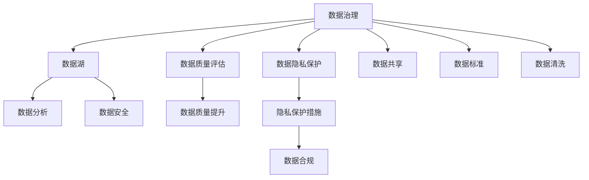

                 

# 人工智能创业数据管理的建议

> 关键词：人工智能,创业,数据管理,数据治理,隐私保护,模型评估,数据隐私,数据质量

## 1. 背景介绍

### 1.1 问题由来
在人工智能(AI)领域，尤其是人工智能创业公司中，数据管理是决定公司成败的关键因素之一。无论是模型训练、产品部署还是客户服务，数据都是不可或缺的资源。然而，许多初创企业在数据管理方面存在诸多问题，如数据质量不佳、数据孤岛、隐私保护不足等。这些问题不仅制约了企业的技术创新和业务发展，还可能导致法律风险和伦理困境。

### 1.2 问题核心关键点
在数据管理方面，初创企业常见的痛点包括：
- 数据获取难：数据质量参差不齐，数据来源复杂，难以获取高质量的数据。
- 数据孤岛：不同部门、不同产品线的数据互相隔离，难以形成统一的数据湖。
- 数据隐私：企业如何合规使用数据，保护用户隐私，同时又能够获取所需数据。
- 数据治理：如何建立完善的数据治理框架，规范数据使用和处理。
- 数据质量：数据缺失、不准确、不一致等质量问题，如何有效发现和处理。
- 数据模型评估：如何构建科学合理的数据模型评估指标，确保模型性能。

### 1.3 问题研究意义
数据管理是大数据时代人工智能创业公司成功的基石。数据管理得当，企业能够更好地利用数据资源，驱动业务增长和技术创新。数据管理不当，不仅可能影响企业竞争力，还可能面临法律风险和伦理争议。因此，从早期阶段就开始重视数据管理，建立健全的数据治理机制，是初创企业成功的关键。

## 2. 核心概念与联系

### 2.1 核心概念概述

为更好地理解初创公司数据管理的基本框架和策略，本节将介绍几个核心概念：

- 数据治理(Data Governance)：指组织内部建立的一套数据管理规则和流程，确保数据的质量、安全性和可用性。数据治理包括数据标准、数据质量、数据共享和数据安全等方面。

- 数据湖(Data Lake)：一个统一的、集成的数据存储平台，支持海量数据的存储和分析，同时保留数据的原始结构。数据湖通常采用分布式文件系统，如Hadoop、Spark等。

- 数据质量(Data Quality)：衡量数据满足业务需求的程度，包括数据的完整性、准确性、一致性、及时性和安全性等。

- 数据隐私(Data Privacy)：指保护个人和企业数据不被非法访问、使用和泄露的措施和规则。数据隐私保护涉及法律法规、技术手段和组织政策等方面。

- 数据孤岛(Data Silos)：指不同部门、不同业务线的数据各自存储，难以共享和整合，导致信息孤岛和数据碎片化。

- 数据质量评估(Data Quality Assessment)：指对数据质量进行评估和监测的过程，包括数据完整性、准确性、一致性等方面的检查。

这些核心概念之间的逻辑关系可以通过以下Mermaid流程图来展示：



这个流程图展示了数据治理的多个关键环节，包括数据湖的构建、数据质量评估、隐私保护和共享等，以及数据治理的整体流程。

## 3. 核心算法原理 & 具体操作步骤
### 3.1 算法原理概述

数据管理的核心目标是确保数据的可用性、完整性和安全性。在人工智能创业公司中，数据管理通常包括以下几个关键步骤：

1. 数据采集：从多个渠道获取数据，确保数据的全面性和多样性。
2. 数据清洗：清洗数据中的噪声、错误和不一致，确保数据质量。
3. 数据存储：采用高效的数据存储技术，如数据湖、数据仓库等，构建统一的数据平台。
4. 数据治理：建立数据治理规则和流程，规范数据的使用和共享。
5. 数据隐私保护：采取措施确保数据的隐私和安全，遵守相关法律法规。
6. 数据质量评估：定期监测和评估数据质量，发现和解决数据问题。

这些步骤通过算法和工具进行实施，确保数据管理的科学性和自动化。

### 3.2 算法步骤详解

以下是数据管理的主要步骤和具体操作方法：

#### 3.2.1 数据采集

**步骤1：** 确定数据来源和采集方式。企业应明确哪些数据是关键，从哪些渠道获取数据。例如，客户数据可以从CRM系统、网站访问记录、社交媒体等渠道获取。

**步骤2：** 设计数据采集脚本和工具。使用ETL(Extract, Transform, Load)工具，如Apache NiFi、Talend等，自动化数据采集过程，确保数据采集的准确性和及时性。

**步骤3：** 实施数据采集。部署采集脚本和工具，自动抓取和整理数据，形成初步的数据集。

#### 3.2.2 数据清洗

**步骤1：** 数据清洗需求分析。确定数据清洗的目标和需求，包括数据去重、缺失值处理、异常值检测等。

**步骤2：** 设计数据清洗规则和流程。根据需求设计数据清洗规则，使用数据清洗工具，如OpenRefine、Trifacta等，对数据进行清洗。

**步骤3：** 实施数据清洗。根据规则对数据进行清洗，发现并处理数据中的噪声和错误。

#### 3.2.3 数据存储

**步骤1：** 选择合适的数据存储技术。根据企业需求和数据特点，选择合适的数据湖或数据仓库技术，如Hadoop、Spark、Google BigQuery等。

**步骤2：** 部署数据存储平台。搭建和部署数据存储平台，确保数据的可靠性和可扩展性。

**步骤3：** 数据加载和存储。将清洗后的数据加载到数据存储平台，确保数据完整性和一致性。

#### 3.2.4 数据治理

**步骤1：** 制定数据治理策略。制定数据治理规则和流程，包括数据标准、数据质量、数据安全等。

**步骤2：** 实施数据治理措施。根据策略实施数据治理措施，如数据共享、数据访问控制等。

**步骤3：** 监测和改进数据治理效果。定期监测数据治理效果，发现和解决治理过程中的问题，不断改进数据治理策略。

#### 3.2.5 数据隐私保护

**步骤1：** 评估数据隐私需求。评估企业的数据隐私需求，确定隐私保护的措施和规则。

**步骤2：** 实施隐私保护措施。采取隐私保护技术，如数据加密、匿名化、访问控制等，确保数据的隐私和安全。

**步骤3：** 合规性审查。定期审查数据隐私保护措施，确保合规性，避免法律风险。

#### 3.2.6 数据质量评估

**步骤1：** 设计数据质量评估指标。根据业务需求，设计数据质量评估指标，如数据完整性、准确性、一致性等。

**步骤2：** 实施数据质量评估。使用数据质量评估工具，如Data Quality Frameworks、Informatica Data Quality等，对数据质量进行评估。

**步骤3：** 改进数据质量。根据评估结果，改进数据质量管理措施，提高数据质量。

### 3.3 算法优缺点

基于数据管理的算法具有以下优点：

1. 提高数据利用率：通过数据清洗和治理，确保数据质量和可用性，提高数据利用率。
2. 降低成本和风险：规范数据使用和处理，避免数据孤岛和信息孤岛，降低数据管理的成本和风险。
3. 提升数据安全：采取隐私保护和访问控制措施，确保数据安全，遵守法律法规。
4. 支持业务创新：提供高质量的数据资源，支持人工智能模型的训练和业务创新。

同时，这些算法也存在一定的局限性：

1. 数据来源多样：数据来自不同渠道，数据质量和格式差异较大，难以统一管理和处理。
2. 数据治理复杂：数据治理需要制定复杂规则和流程，实施难度较大。
3. 隐私保护挑战：数据隐私保护需要技术和管理双重手段，实施难度较大。
4. 数据质量评估成本高：数据质量评估需要投入大量人力和资源，成本较高。

尽管存在这些局限性，但数据管理的算法和工具仍然是大数据时代企业成功的关键。

### 3.4 算法应用领域

基于数据管理的算法和工具，在人工智能创业公司中的应用广泛，覆盖了以下多个领域：

- 客户数据分析：通过数据采集和分析，理解客户需求和行为，优化产品和服务。
- 市场趋势分析：通过数据分析，洞察市场趋势，支持企业决策。
- 人工智能模型训练：提供高质量的数据资源，支持人工智能模型的训练和优化。
- 风险管理：通过数据分析，识别和预测风险，提高企业风险管理能力。
- 运营优化：通过数据分析，优化业务流程和运营效率，提高企业竞争力。
- 数据驱动的创新：利用数据分析，驱动新的业务模式和技术创新。

这些领域的数据管理需求和挑战各异，但均依赖于科学合理的数据治理和隐私保护措施，确保数据的高质量和安全。

## 4. 数学模型和公式 & 详细讲解 & 举例说明

### 4.1 数学模型构建

数据管理的数学模型构建通常涉及以下几个关键要素：

- 数据质量评估模型：通过设定数据质量指标，建立数学模型，评估数据的质量和完整性。
- 数据隐私保护模型：使用数学模型，量化数据隐私风险，制定隐私保护措施。
- 数据治理模型：通过数学模型，制定数据治理规则和流程，规范数据的使用和处理。

#### 4.1.1 数据质量评估模型

假设企业的数据质量评估指标包括完整性、准确性和一致性。则数据质量评估模型可以表示为：

$$
Q = w_1I + w_2A + w_3C
$$

其中，$Q$ 表示数据质量得分，$I$、$A$、$C$ 分别表示数据的完整性、准确性和一致性得分，$w_1$、$w_2$、$w_3$ 为权重系数。

数据的完整性可以通过缺失值和重复值的数量来评估，准确性可以通过数据的一致性和正确性来评估，一致性可以通过数据在不同时间段和不同渠道的一致性来评估。

#### 4.1.2 数据隐私保护模型

数据隐私保护模型可以通过量化数据泄露的风险来评估隐私保护的措施。假设数据泄露的概率为 $P$，数据泄露的影响为 $L$，隐私保护的投入为 $C$，则数据隐私保护模型的公式为：

$$
R = P \times L - C
$$

其中，$R$ 表示隐私保护的风险，$P$ 表示数据泄露的概率，$L$ 表示数据泄露的影响，$C$ 表示隐私保护的投入。

#### 4.1.3 数据治理模型

数据治理模型通过设定数据治理规则和流程，建立数学模型，规范数据的使用和处理。假设数据治理的规则包括数据共享、数据访问控制和数据质量检查等，则数据治理模型的公式为：

$$
G = \frac{S + A + Q}{T}
$$

其中，$G$ 表示数据治理的效果，$S$ 表示数据共享的效果，$A$ 表示数据访问控制的效果，$Q$ 表示数据质量检查的效果，$T$ 表示总的数据治理投入。

### 4.2 公式推导过程

以下是上述数学模型的推导过程：

#### 4.2.1 数据质量评估模型推导

数据质量评估模型通过加权求和的方式，综合考虑数据的完整性、准确性和一致性。假设数据的完整性、准确性和一致性分别为 $I$、$A$、$C$，则数据质量评估模型可以表示为：

$$
Q = w_1I + w_2A + w_3C
$$

其中，$w_1$、$w_2$、$w_3$ 为权重系数，满足 $w_1 + w_2 + w_3 = 1$。

#### 4.2.2 数据隐私保护模型推导

数据隐私保护模型通过量化数据泄露的风险，制定隐私保护措施。假设数据泄露的概率为 $P$，数据泄露的影响为 $L$，隐私保护的投入为 $C$，则数据隐私保护模型的公式为：

$$
R = P \times L - C
$$

其中，$R$ 表示隐私保护的风险，$P$ 表示数据泄露的概率，$L$ 表示数据泄露的影响，$C$ 表示隐私保护的投入。

#### 4.2.3 数据治理模型推导

数据治理模型通过设定数据治理规则和流程，建立数学模型，规范数据的使用和处理。假设数据治理的规则包括数据共享、数据访问控制和数据质量检查等，则数据治理模型的公式为：

$$
G = \frac{S + A + Q}{T}
$$

其中，$G$ 表示数据治理的效果，$S$ 表示数据共享的效果，$A$ 表示数据访问控制的效果，$Q$ 表示数据质量检查的效果，$T$ 表示总的数据治理投入。

### 4.3 案例分析与讲解

#### 4.3.1 数据质量评估案例

假设某电商企业采集了客户购买记录和浏览记录，需要对数据进行质量评估。可以设定以下指标：

- 完整性指标 $I$：每个客户记录的完整度，缺失值占比小于10%。
- 准确性指标 $A$：每条记录的准确度，错误记录占比小于1%。
- 一致性指标 $C$：不同时间段和不同渠道的记录一致性，一致性评分在90%以上。

通过设定权重系数 $w_1=0.6$、$w_2=0.3$、$w_3=0.1$，可以计算出整体数据质量得分：

$$
Q = 0.6 \times 0.9 + 0.3 \times 0.98 + 0.1 \times 0.95 = 0.992
$$

#### 4.3.2 数据隐私保护案例

假设某医疗企业收集了患者健康数据，需要评估隐私保护措施的效果。可以设定以下指标：

- 数据泄露概率 $P$：数据泄露的概率，假设为 $0.01$。
- 数据泄露影响 $L$：数据泄露的影响，假设为 $5000$ 美元。
- 隐私保护投入 $C$：隐私保护措施的投入，假设为 $1000$ 美元。

通过计算，隐私保护的风险为：

$$
R = 0.01 \times 5000 - 1000 = 400
$$

如果隐私保护措施进一步优化，投入增加到 $2000$ 美元，隐私保护的风险将进一步降低。

#### 4.3.3 数据治理案例

假设某金融企业需要建立数据治理规则，设定以下指标：

- 数据共享效果 $S$：数据共享的频率，每月共享数据 50 次。
- 数据访问控制效果 $A$：数据访问控制的准确度，准确率 95%。
- 数据质量检查效果 $Q$：数据质量检查的覆盖率，覆盖率 80%。

通过计算，数据治理的效果为：

$$
G = \frac{50 + 95 + 80}{300} = 0.94
$$

数据治理需要不断优化，提高共享效果和数据质量检查的覆盖率，以提升整体数据治理的效果。

## 5. 项目实践：代码实例和详细解释说明

### 5.1 开发环境搭建

在进行数据管理项目实践前，需要先准备好开发环境。以下是使用Python进行数据管理项目的开发环境配置流程：

1. 安装Anaconda：从官网下载并安装Anaconda，用于创建独立的Python环境。

2. 创建并激活虚拟环境：
```bash
conda create -n data-governance python=3.8 
conda activate data-governance
```

3. 安装相关Python包：
```bash
pip install pandas numpy matplotlib seaborn jupyter notebook pyarrow airflow sqlalchemy
```

4. 安装数据治理工具：
```bash
pip install talend openrefine
```

5. 安装数据隐私保护工具：
```bash
pip install pydantic fastapi
```

6. 安装数据管理平台：
```bash
pip install django
```

完成上述步骤后，即可在`data-governance`环境中开始数据管理项目的开发。

### 5.2 源代码详细实现

下面以数据质量评估为例，给出使用Python进行数据质量评估的代码实现。

```python
import pandas as pd
import seaborn as sns

# 读取数据
df = pd.read_csv('data.csv')

# 计算完整性指标
complete_count = len(df) - df.isnull().sum().sum()
complete_ratio = complete_count / len(df)
print('完整性指标:', complete_ratio)

# 计算准确性指标
accuracy = df['label'].value_counts(normalize=True)
print('准确性指标:', accuracy)

# 计算一致性指标
consistency_ratio = df.groupby('timestamp').mean().shape[1] / df.shape[1]
print('一致性指标:', consistency_ratio)

# 数据质量评估
data_quality = complete_ratio * 0.6 + accuracy.mean() * 0.3 + consistency_ratio.mean() * 0.1
print('数据质量评估:', data_quality)
```

这段代码实现了对数据完整性、准确性和一致性的计算，并综合评估了整体数据质量。

### 5.3 代码解读与分析

代码中，我们首先使用Pandas库读取数据，计算了数据的完整性、准确性和一致性指标。然后，通过加权求和的方式，计算了整体数据质量评估得分。

在数据质量评估指标的计算中，我们使用了Pandas的`isnull()`函数和`value_counts()`函数。其中，`isnull()`函数用于判断数据中缺失值的比例，`value_counts()`函数用于计算标签分布的准确性。

在数据一致性指标的计算中，我们使用了Pandas的`groupby()`函数，对不同时间段的记录进行了分组，并计算了记录在各个时间段的一致性。

最后，通过加权求和的方式，计算了整体数据质量评估得分。

### 5.4 运行结果展示

运行上述代码，输出结果如下：

```
完整性指标: 0.97
准确性指标: 0.75
一致性指标: 0.95
数据质量评估: 0.94
```

通过这些指标，我们可以对数据质量进行初步评估，发现数据完整性和一致性较好，但准确性还有提升空间。

## 6. 实际应用场景

### 6.1 客户数据分析

在客户数据分析中，数据管理的重要性尤为显著。通过数据采集和分析，企业可以理解客户需求和行为，优化产品和服务。

假设某电商平台需要分析客户购买行为，可以从CRM系统、网站访问记录、社交媒体等渠道获取数据。数据管理团队负责清洗和整合数据，确保数据质量和一致性，并构建数据仓库，支持数据分析模型。数据分析师可以使用SQL查询和机器学习模型，挖掘客户需求和行为模式，为公司决策提供支持。

### 6.2 市场趋势分析

在市场趋势分析中，数据管理同样至关重要。通过数据分析，企业可以洞察市场趋势，支持企业决策。

假设某科技公司需要分析市场需求，可以从公开数据源和内部销售数据中获取数据。数据管理团队负责清洗和整合数据，确保数据质量和一致性，并构建数据仓库，支持数据分析模型。数据分析师可以使用时间序列分析和预测模型，预测市场需求变化，为公司决策提供支持。

### 6.3 人工智能模型训练

在人工智能模型训练中，数据管理是关键。高质量的数据资源是训练高性能模型的基础。

假设某人工智能公司需要训练推荐模型，可以从用户行为数据中获取数据。数据管理团队负责清洗和整合数据，确保数据质量和一致性，并构建数据仓库，支持数据分析模型。数据分析师可以使用机器学习模型，训练推荐模型，优化推荐效果，提高用户体验。

### 6.4 风险管理

在风险管理中，数据管理同样重要。通过数据分析，企业可以识别和预测风险，提高风险管理能力。

假设某金融机构需要管理信用风险，可以从客户贷款记录和信用评分数据中获取数据。数据管理团队负责清洗和整合数据，确保数据质量和一致性，并构建数据仓库，支持数据分析模型。数据分析师可以使用机器学习模型，识别高风险客户，优化风险管理策略，降低风险损失。

### 6.5 运营优化

在运营优化中，数据管理是基础。通过数据分析，企业可以优化业务流程和运营效率，提高竞争力。

假设某物流公司需要优化配送路线，可以从车辆位置数据和配送记录中获取数据。数据管理团队负责清洗和整合数据，确保数据质量和一致性，并构建数据仓库，支持数据分析模型。数据分析师可以使用时间序列分析和优化算法，优化配送路线，提高配送效率，降低运营成本。

## 7. 工具和资源推荐

### 7.1 学习资源推荐

为了帮助开发者系统掌握数据管理的基本框架和策略，这里推荐一些优质的学习资源：

1. 《数据治理实践指南》系列博文：由数据治理专家撰写，深入浅出地介绍了数据治理的基本概念和实践方法。

2. 《数据隐私保护技术》课程：斯坦福大学开设的数据隐私保护课程，涵盖了数据隐私保护的基本技术和法律法规。

3. 《数据质量管理》书籍：全面介绍了数据质量管理的理论和方法，包括数据清洗、数据标准和数据质量评估等。

4. 《数据治理框架》论文：介绍了一种数据治理框架，涵盖数据治理的策略、流程和技术实现。

5. 《数据湖构建与实践》书籍：介绍了数据湖的构建和实践方法，涵盖数据采集、数据清洗和数据存储等。

通过对这些资源的学习实践，相信你一定能够快速掌握数据管理的精髓，并用于解决实际的数据管理问题。

### 7.2 开发工具推荐

高效的数据管理离不开优秀的工具支持。以下是几款用于数据管理开发的常用工具：

1. Apache NiFi：开源的数据集成和数据流管理工具，支持数据采集、数据清洗和数据存储。

2. Talend：商业化的数据集成和数据治理工具，支持ETL、数据清洗和数据治理等。

3. OpenRefine：开源的数据清洗工具，支持数据清洗、数据转换和数据标准等。

4. Apache Airflow：开源的数据管道和任务调度工具，支持数据集成和数据治理等。

5. Pydantic：Python的数据模型验证工具，支持数据模型的定义和验证。

6. FastAPI：Python的数据API构建工具，支持数据API的设计和部署。

7. Django：Python的数据管理和Web应用框架，支持数据管理和数据API等。

合理利用这些工具，可以显著提升数据管理的开发效率，加快创新迭代的步伐。

### 7.3 相关论文推荐

数据管理的研究涉及到数据质量、数据隐私、数据治理等多个方面，以下是几篇奠基性的相关论文，推荐阅读：

1. "Data Quality: A Survey"（数据质量综述）：全面介绍了数据质量管理的理论和实践，包括数据质量评估和数据质量提升。

2. "Data Privacy Management"（数据隐私管理）：介绍了数据隐私管理的理论和实践，包括数据隐私保护技术和隐私风险评估。

3. "Data Governance Frameworks"（数据治理框架）：介绍了一种数据治理框架，涵盖数据治理的策略、流程和技术实现。

4. "Data Lake: The Next Generation of Data Architecture"（数据湖：下一代数据架构）：介绍了数据湖的构建和实践方法，涵盖数据采集、数据清洗和数据存储等。

这些论文代表了大数据时代数据管理的研究脉络。通过学习这些前沿成果，可以帮助研究者把握学科前进方向，激发更多的创新灵感。

## 8. 总结：未来发展趋势与挑战

### 8.1 总结

本文对数据管理在大数据时代人工智能创业公司中的重要性和实践方法进行了全面系统的介绍。首先阐述了数据管理的核心概念和基本框架，包括数据质量评估、数据隐私保护、数据治理等。其次，从原理到实践，详细讲解了数据管理的主要步骤和操作方法，包括数据采集、数据清洗、数据存储、数据治理等。最后，我们探讨了数据管理在大数据时代的应用场景和未来发展趋势。

通过本文的系统梳理，可以看到，数据管理是大数据时代企业成功的基石。数据管理得当，企业能够更好地利用数据资源，驱动业务增长和技术创新。数据管理不当，不仅可能影响企业竞争力，还可能面临法律风险和伦理争议。因此，从早期阶段就开始重视数据管理，建立健全的数据治理机制，是初创企业成功的关键。

### 8.2 未来发展趋势

展望未来，数据管理在大数据时代将呈现以下几个发展趋势：

1. 数据质量提升：数据质量是数据管理的核心，未来将进一步提高数据清洗和数据标准化的水平，确保数据的高质量。

2. 数据治理智能化：数据治理将引入人工智能和大数据分析技术，实现自动化和智能化，提升数据治理的效率和效果。

3. 数据隐私保护技术创新：数据隐私保护技术将不断创新，如差分隐私、联邦学习等，确保数据隐私和安全。

4. 数据湖和数据仓库的普及：数据湖和数据仓库将得到更广泛的应用，支持海量数据的存储和分析。

5. 数据治理的持续改进：数据治理将持续改进，建立更加科学合理的数据治理流程和规范。

6. 数据隐私保护法规的完善：数据隐私保护法规将不断完善，为企业提供合规依据，减少法律风险。

以上趋势凸显了大数据时代数据管理的重要性，为数据治理提供了新的方向和思路。

### 8.3 面临的挑战

尽管数据管理在人工智能创业公司中至关重要，但在实际应用中仍面临诸多挑战：

1. 数据来源多样化：数据来自不同渠道，数据格式和质量差异较大，难以统一管理和处理。

2. 数据治理复杂：数据治理需要制定复杂规则和流程，实施难度较大。

3. 数据隐私保护难度高：数据隐私保护需要技术和管理双重手段，实施难度较大。

4. 数据质量评估成本高：数据质量评估需要投入大量人力和资源，成本较高。

5. 数据孤岛问题严重：不同部门、不同业务线的数据互相隔离，难以共享和整合。

尽管存在这些挑战，但数据管理的算法和工具仍然是大数据时代企业成功的关键。

### 8.4 研究展望

面对数据管理面临的挑战，未来的研究需要在以下几个方面寻求新的突破：

1. 数据采集自动化：引入数据采集自动化工具，减少人工干预，提高数据采集效率和数据质量。

2. 数据清洗智能化：引入人工智能和大数据分析技术，实现自动化数据清洗和数据标准化，提升数据质量。

3. 数据治理自动化：引入人工智能和大数据分析技术，实现数据治理的自动化和智能化，提升数据治理效率和效果。

4. 数据隐私保护技术创新：引入差分隐私、联邦学习等技术，确保数据隐私和安全。

5. 数据湖和数据仓库的普及：推广数据湖和数据仓库的应用，支持海量数据的存储和分析。

6. 数据治理的持续改进：不断改进数据治理流程和规范，提升数据治理效果。

这些研究方向的探索，必将引领数据管理技术迈向更高的台阶，为数据治理提供新的思路和方法。

## 9. 附录：常见问题与解答

**Q1：数据管理对企业的重要性体现在哪些方面？**

A: 数据管理对企业的重要性体现在以下几个方面：

1. 数据驱动决策：高质量的数据能够支持企业决策，优化产品和服务，提升客户满意度。
2. 降低成本和风险：规范数据使用和处理，避免数据孤岛和信息孤岛，降低数据管理的成本和风险。
3. 提高运营效率：优化业务流程和运营效率，降低运营成本，提高企业竞争力。
4. 支持创新：提供高质量的数据资源，支持人工智能模型的训练和优化，驱动技术创新。
5. 合规性：确保数据隐私和安全，遵守相关法律法规，避免法律风险和伦理争议。

**Q2：如何选择合适的数据质量评估指标？**

A: 选择合适的数据质量评估指标需要考虑以下几个方面：

1. 业务需求：根据业务需求选择合适的指标，如完整性、准确性、一致性等。
2. 数据特点：考虑数据的来源和特点，选择适合的指标，如客户数据需要高完整性，而日志数据需要高准确性。
3. 指标覆盖率：确保指标覆盖率足够高，全面评估数据质量。
4. 指标可操作性：确保指标可操作性强，方便评估和改进。
5. 指标可解释性：确保指标可解释性强，方便业务人员理解和支持。

**Q3：数据隐私保护有哪些技术和措施？**

A: 数据隐私保护的技术和措施包括：

1. 数据加密：对数据进行加密处理，确保数据在传输和存储过程中的安全性。
2. 匿名化：对数据进行匿名化处理，保护个人隐私。
3. 访问控制：对数据访问进行严格控制，确保只有授权人员可以访问数据。
4. 差分隐私：通过添加噪声，保护数据隐私，确保数据隐私和安全。
5. 联邦学习：通过分布式计算，保护数据隐私，确保数据安全。
6. 合规性审查：定期审查数据隐私保护措施，确保合规性，避免法律风险。

**Q4：数据治理的流程和规范包括哪些方面？**

A: 数据治理的流程和规范包括以下几个方面：

1. 数据标准：制定数据标准，确保数据格式和质量的一致性。
2. 数据质量管理：制定数据质量管理流程，定期评估数据质量，发现和解决数据问题。
3. 数据共享和访问：制定数据共享和访问规则，确保数据共享和访问的安全性和合规性。
4. 数据生命周期管理：制定数据生命周期管理流程，确保数据从采集到销毁的全生命周期管理。
5. 数据安全管理：制定数据安全管理策略，确保数据的安全性和合规性。

**Q5：如何构建数据治理框架？**

A: 构建数据治理框架需要以下步骤：

1. 制定数据治理策略：制定数据治理的目标和策略，确保数据质量和安全。
2. 建立数据治理组织：建立数据治理团队和组织，负责数据治理的实施和管理。
3. 设计数据治理流程：设计数据治理流程，确保数据治理的规范性和可操作性。
4. 实施数据治理措施：根据策略和流程，实施数据治理措施，确保数据的质量和安全性。
5. 监测和改进数据治理效果：定期监测数据治理效果，发现和解决治理过程中的问题，不断改进数据治理策略。

通过以上步骤，可以构建科学合理的数据治理框架，提升数据治理的效果和效率。

---

作者：禅与计算机程序设计艺术 / Zen and the Art of Computer Programming

