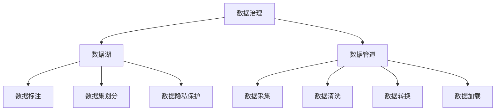

                 

# 人工智能创业数据管理的最佳经验

## 1. 背景介绍

### 1.1 问题由来
在人工智能(AI)创业的浪潮中，数据管理是创业公司成功的关键。无论是数据收集、存储、清洗还是应用，都直接影响着产品的性能和用户体验。然而，由于数据管理涉及的环节复杂，很多创业公司在初期难免陷入数据管理的泥潭中。本文旨在通过分享数据管理的最佳经验，帮助人工智能创业公司规避常见的陷阱，实现数据高效利用。

### 1.2 问题核心关键点
在人工智能创业中，数据管理的核心在于：
- **数据质量**：高质量的数据是AI模型训练和应用的基础。
- **数据量级**：海量数据能够显著提升模型的准确性和泛化能力。
- **数据隐私**：保障数据隐私是合规和安全的基本要求。
- **数据迭代**：数据不断更新，模型需要持续学习新的知识。
- **数据治理**：建立有效的数据管理机制，确保数据一致性和可用性。
- **数据驱动**：基于数据反馈优化产品策略，提升用户体验。

## 2. 核心概念与联系

### 2.1 核心概念概述

为更好地理解数据管理的最佳实践，本节将介绍几个核心概念及其相互关系：

- **数据治理**：确保数据的质量、安全、隐私等，是数据管理的基石。
- **数据湖**：一种集中式存储的数据管理方式，支持多样化数据类型和存储格式。
- **数据管道**：数据从源到目标的过程，包括采集、清洗、转换、加载等环节。
- **数据标注**：通过人工标注给数据打上标签，为模型训练提供有监督信号。
- **数据集划分**：将数据划分为训练集、验证集、测试集等，便于模型训练和评估。
- **数据隐私保护**：通过加密、去标识化、差分隐私等技术，保护数据隐私。

这些核心概念通过以下Mermaid流程图来展示：



这个流程图展示了数据管理的关键流程和环节：

1. 数据治理确保数据质量和安全。
2. 数据湖作为集中式存储解决方案，支持大规模数据管理。
3. 数据管道包括采集、清洗、转换和加载，实现数据从源到目标的高效流转。
4. 数据标注为模型训练提供监督信号。
5. 数据集划分便于模型训练和评估。
6. 数据隐私保护保障用户隐私和合规要求。

这些概念共同构成了数据管理的完整框架，使数据能够高效、安全地支撑AI模型的训练和应用。

## 3. 核心算法原理 & 具体操作步骤

### 3.1 算法原理概述

人工智能创业中的数据管理，主要依赖于数据治理和数据流管道。其核心算法原理如下：

1. **数据采集**：通过爬虫、API接口等方式，从各个数据源收集数据。
2. **数据清洗**：通过数据清洗算法，去除重复、缺失、错误的数据。
3. **数据转换**：将原始数据转换为适合模型训练的格式，如标准化、归一化等。
4. **数据加载**：将处理后的数据加载到数据湖或数据库中，便于后续查询和使用。
5. **数据标注**：对部分数据进行人工标注，为模型训练提供监督信号。
6. **数据迭代**：持续收集新数据，更新模型参数，保持模型的最新状态。

### 3.2 算法步骤详解

以下是数据管理的详细操作步骤：

**Step 1: 数据采集**

- 选择合适的数据源，如公共数据集、API接口、社交媒体等。
- 设计爬虫程序或API调用逻辑，定期自动采集数据。

**Step 2: 数据清洗**

- 对采集的数据进行初步清洗，去除重复和缺失数据。
- 使用数据清洗算法（如去除噪音、修复错误）进一步提高数据质量。

**Step 3: 数据转换**

- 根据模型需求，将数据进行标准化、归一化等预处理操作。
- 引入数据增强技术（如旋转、缩放、噪声注入等），提升数据的多样性。

**Step 4: 数据加载**

- 选择合适的数据存储方案，如数据湖、分布式数据库等。
- 使用数据管道工具（如Apache Kafka、Apache Flink等）进行数据加载和传输。

**Step 5: 数据标注**

- 定义标注任务，如文本分类、图像标注等。
- 引入标注工具（如Labelbox、Google Cloud AI等），对数据进行人工标注。

**Step 6: 数据迭代**

- 建立数据收集机制，持续更新训练数据集。
- 定期对模型进行重新训练，确保模型始终处于最佳状态。

### 3.3 算法优缺点

数据管理的算法优缺点如下：

**优点**：
- **自动化高效**：通过自动化工具和算法，大幅提升数据管理效率。
- **数据质量保障**：数据清洗和转换提高了数据质量，为模型训练提供了可靠基础。
- **数据迭代灵活**：数据迭代机制确保模型能够不断学习新知识。

**缺点**：
- **数据隐私风险**：数据采集和清洗过程中存在隐私泄露风险。
- **数据处理复杂**：不同数据源和数据类型增加了数据管理的复杂性。
- **资源消耗大**：大规模数据处理需要高计算资源和存储资源。

尽管存在这些局限性，但数据管理的自动化和高效性使得其在AI创业中具有重要意义。未来研究重点在于如何更好地平衡数据隐私与数据利用，以及如何优化数据处理流程，提升数据管理的效率和效果。

### 3.4 算法应用领域

数据管理在人工智能创业中的应用领域广泛，包括但不限于以下几个方面：

- **自然语言处理(NLP)**：数据采集、清洗、标注等是NLP模型的基础。
- **计算机视觉(CV)**：图像、视频数据的采集、清洗、增强等技术是CV模型训练的前提。
- **推荐系统**：用户行为数据的采集、处理和建模，是推荐算法优化的关键。
- **医疗AI**：医疗数据的采集、清洗和隐私保护，是医疗AI模型的基础。
- **金融科技**：金融数据的收集、清洗和标注，是金融AI模型的核心。

## 4. 数学模型和公式 & 详细讲解 & 举例说明

### 4.1 数学模型构建

数据管理中的核心数学模型包括以下几个方面：

- **数据分布模型**：假设数据服从某一分布，如高斯分布、泊松分布等。
- **数据降维模型**：通过主成分分析(PCA)、线性判别分析(LDA)等方法，降低数据维度。
- **数据聚类模型**：通过K-means、DBSCAN等算法，将数据进行聚类。
- **数据分类模型**：通过逻辑回归、支持向量机(SVM)等算法，对数据进行分类。

### 4.2 公式推导过程

以下以主成分分析(PCA)为例，推导其数学模型和公式：

设数据集为 $\mathbf{X} \in \mathbb{R}^{n \times d}$，其中 $n$ 为样本数，$d$ 为特征数。PCA的目标是将数据投影到 $k$ 维空间，使得投影后的数据方差最大化。

设投影矩阵为 $\mathbf{W} \in \mathbb{R}^{d \times k}$，投影向量为 $\mathbf{w}_i \in \mathbb{R}^d$，则投影后的数据矩阵为 $\mathbf{Y} = \mathbf{X} \mathbf{W} \in \mathbb{R}^{n \times k}$。

PCA的目标函数为：

$$
\min_{\mathbf{W}} \sum_{i=1}^n ||\mathbf{x}_i - \mathbf{Y}_i||^2
$$

其中 $\mathbf{X}_i$ 为数据集中的第 $i$ 个样本向量。

将目标函数转化为矩阵形式：

$$
\min_{\mathbf{W}} \text{tr}(\mathbf{X}^T\mathbf{X}\mathbf{W}^T\mathbf{W}) - k \text{tr}(\mathbf{W}^T\mathbf{W})
$$

求解上述最小化问题，可得到投影矩阵 $\mathbf{W}$ 的求解公式：

$$
\mathbf{W} = \mathbf{U}_k\mathbf{V}_k^T
$$

其中 $\mathbf{U}_k$ 为 $d \times k$ 的矩阵，$\mathbf{V}_k$ 为 $k \times k$ 的矩阵。

### 4.3 案例分析与讲解

假设我们有一组股票价格数据，需要对数据进行降维和可视化分析。

首先，定义数据集 $\mathbf{X} \in \mathbb{R}^{1000 \times 5}$，其中每行表示一只股票在某段时间内的价格，共1000只股票，5个特征。

使用PCA算法对数据进行降维，设定 $k=2$，即投影到二维空间。通过求解上述目标函数，得到投影矩阵 $\mathbf{W}$。

投影后的数据矩阵 $\mathbf{Y} \in \mathbb{R}^{1000 \times 2}$。将 $\mathbf{Y}$ 可视化，可以得到数据在二维空间上的分布图，便于进行分析和决策。

## 5. 项目实践：代码实例和详细解释说明

### 5.1 开发环境搭建

在进行数据管理实践前，我们需要准备好开发环境。以下是使用Python进行PyTorch开发的环境配置流程：

1. 安装Anaconda：从官网下载并安装Anaconda，用于创建独立的Python环境。

2. 创建并激活虚拟环境：
```bash
conda create -n pytorch-env python=3.8 
conda activate pytorch-env
```

3. 安装PyTorch：根据CUDA版本，从官网获取对应的安装命令。例如：
```bash
conda install pytorch torchvision torchaudio cudatoolkit=11.1 -c pytorch -c conda-forge
```

4. 安装各类工具包：
```bash
pip install numpy pandas scikit-learn matplotlib tqdm jupyter notebook ipython
```

完成上述步骤后，即可在`pytorch-env`环境中开始数据管理实践。

### 5.2 源代码详细实现

以下是使用Python和Pandas库进行数据管理的代码实现。

首先，定义数据管理函数：

```python
import pandas as pd
import numpy as np

def load_data(file_path):
    data = pd.read_csv(file_path)
    return data

def preprocess_data(data):
    # 1. 数据清洗
    data = data.dropna()  # 去除缺失值
    data = data.drop_duplicates()  # 去除重复值
    
    # 2. 数据转换
    data['date'] = pd.to_datetime(data['date'], format='%Y-%m-%d')  # 日期格式转换
    data['price'] = data['price'].astype('float')  # 价格类型转换
    
    # 3. 数据标注
    data['label'] = data['price'] > 10  # 简单示例，将价格高于10的标记为1
    
    return data

def train_test_split(data, test_size=0.2):
    # 随机打乱数据
    data = data.sample(frac=1)
    
    # 拆分训练集和测试集
    train_data = data[:int(len(data) * (1 - test_size))]
    test_data = data[int(len(data) * (1 - test_size)):]
    
    return train_data, test_data

def save_data(data, file_path):
    data.to_csv(file_path, index=False)
```

然后，使用上述函数对数据进行管理和分析：

```python
# 1. 加载数据
data = load_data('stock_prices.csv')

# 2. 数据预处理
data = preprocess_data(data)

# 3. 数据分割
train_data, test_data = train_test_split(data, test_size=0.2)

# 4. 保存数据
train_data.to_csv('train_data.csv', index=False)
test_data.to_csv('test_data.csv', index=False)
```

通过上述代码，我们可以对股票价格数据进行清洗、转换和标注，并拆分成训练集和测试集，最终保存为CSV文件。

### 5.3 代码解读与分析

让我们再详细解读一下关键代码的实现细节：

**load_data函数**：
- 使用Pandas的`read_csv`函数加载CSV文件，返回一个DataFrame对象。

**preprocess_data函数**：
- 对数据进行初步清洗，包括去除缺失值和重复值。
- 对日期和价格进行格式转换和类型转换。
- 引入简单标注逻辑，用于后续的模型训练。

**train_test_split函数**：
- 对数据进行随机打乱。
- 通过指定比例拆分训练集和测试集。

**save_data函数**：
- 将DataFrame对象保存为CSV文件，便于后续的加载和分析。

以上代码展示了数据管理的几个关键环节，包括数据加载、预处理、分割和保存。通过这些操作，我们可以对原始数据进行有效的管理和分析，为后续的模型训练和评估奠定基础。

当然，工业级的系统实现还需考虑更多因素，如数据的版本控制、元数据管理、跨团队协作等。但核心的数据管理逻辑基本与此类似。

## 6. 实际应用场景

### 6.1 智能客服系统

基于数据管理的智能客服系统，可以广泛应用于企业客服部门，提升客户体验和问题解决效率。通过数据管理，智能客服系统可以：

- 自动收集客户咨询数据，进行清洗和标注。
- 通过文本分析技术，理解客户意图，匹配最佳回复。
- 实时监控客服表现，提供个性化培训建议。

### 6.2 金融舆情监测

在金融领域，数据管理对于舆情监测具有重要意义。通过数据管理，金融舆情监测系统可以：

- 收集和清洗海量新闻、评论等数据。
- 分析金融市场舆情变化，提供实时预警。
- 通过情感分析技术，识别舆情中的负面信息。

### 6.3 个性化推荐系统

个性化推荐系统需要大量的用户行为数据进行训练和优化。通过数据管理，推荐系统可以：

- 收集和存储用户浏览、点击等行为数据。
- 对数据进行清洗和标注，提取用户兴趣特征。
- 引入协同过滤等算法，进行个性化推荐。

### 6.4 未来应用展望

随着数据管理的不断优化和完善，未来基于数据管理的AI应用将更加广泛，为各行各业带来变革性影响。

在智慧医疗领域，通过数据管理，智能诊断系统可以：
- 收集和处理患者病历数据。
- 分析患者症状和病历，提供诊断建议。

在智能教育领域，数据管理可以：
- 收集和分析学生学习数据。
- 通过学习分析技术，提供个性化学习路径。

在智慧城市治理中，数据管理可以：
- 收集和处理城市各类数据。
- 通过数据分析技术，提升城市管理水平。

此外，在企业生产、社会治理、文娱传媒等众多领域，基于数据管理的AI应用也将不断涌现，为经济社会发展注入新的动力。

## 7. 工具和资源推荐

### 7.1 学习资源推荐

为了帮助开发者系统掌握数据管理的理论基础和实践技巧，这里推荐一些优质的学习资源：

1. 《数据科学导论》：由世界顶级数据科学家撰写，涵盖数据采集、清洗、存储等基础概念和实践技巧。
2. 《Python数据科学手册》：详细介绍了使用Pandas、NumPy等Python库进行数据处理的技术。
3. Kaggle数据科学竞赛：通过参加数据竞赛，实践数据管理的具体案例，提升实战能力。
4. Coursera《数据科学基础》课程：由斯坦福大学提供，涵盖数据管理、数据分析等核心内容。
5. 《数据治理》书籍：详细介绍了数据治理的流程、工具和最佳实践。

通过对这些资源的学习实践，相信你一定能够快速掌握数据管理的精髓，并用于解决实际的数据管理问题。

### 7.2 开发工具推荐

高效的开发离不开优秀的工具支持。以下是几款用于数据管理开发的常用工具：

1. Apache Kafka：分布式流处理平台，支持大规模数据管道的设计和实现。
2. Apache Flink：流处理框架，支持复杂数据流管道和实时计算。
3. Apache Airflow：工作流编排工具，用于自动化数据管道的设计和执行。
4. Jupyter Notebook：交互式编程环境，支持数据管理、分析和可视化。
5. PySpark：基于Scala的分布式计算框架，支持大规模数据处理和分析。
6. Pandas：数据处理库，支持数据的加载、清洗、转换和分析。

合理利用这些工具，可以显著提升数据管理的开发效率，加快创新迭代的步伐。

### 7.3 相关论文推荐

数据管理的理论和技术不断发展，以下是几篇奠基性的相关论文，推荐阅读：

1. "The Data Wrangling Toolkit"：由IBM Research团队撰写，介绍了数据清洗和转换的工具和技术。
2. "Data Management for Social Media Analytics"：讨论了社交媒体数据的管理和分析方法。
3. "Anomaly Detection with Streaming Data"：研究了如何利用流处理技术进行数据异常检测。
4. "Data Privacy Preserving Machine Learning"：讨论了如何在保护数据隐私的前提下，进行机器学习模型的训练。
5. "The Role of Data Governance in Big Data Analytics"：探讨了数据治理在大数据分析中的重要性。

这些论文代表了大数据管理的发展脉络。通过学习这些前沿成果，可以帮助研究者把握学科前进方向，激发更多的创新灵感。

## 8. 总结：未来发展趋势与挑战

### 8.1 总结

本文对基于数据管理的人工智能创业实践进行了全面系统的介绍。首先阐述了数据管理在人工智能创业中的重要性，明确了数据质量、数据量级、数据隐私等核心关键点。其次，从原理到实践，详细讲解了数据管理的数学模型和操作步骤，给出了数据管理任务开发的完整代码实例。同时，本文还广泛探讨了数据管理在智能客服、金融舆情、个性化推荐等多个行业领域的应用前景，展示了数据管理范式的巨大潜力。此外，本文精选了数据管理的各类学习资源，力求为读者提供全方位的技术指引。

通过本文的系统梳理，可以看到，数据管理是人工智能创业成功的关键因素之一。高效的数据管理能够保障数据质量、提升模型效果、降低开发成本，是实现AI落地应用的重要基础。未来，随着数据量的不断增长和数据类型的日益多样化，数据管理的复杂性将进一步提升。数据管理技术的持续创新和优化，将是大规模人工智能应用落地的重要保障。

### 8.2 未来发展趋势

展望未来，数据管理技术将呈现以下几个发展趋势：

1. **数据自动化管理**：通过自动化工具和算法，提升数据管理的效率和准确性。
2. **数据融合与协同**：实现不同数据源和数据类型的融合，支持多模态数据协同建模。
3. **数据隐私保护**：采用差分隐私、联邦学习等技术，保护用户隐私和数据安全。
4. **数据驱动的决策支持**：通过数据分析和机器学习技术，提升决策的科学性和智能化。
5. **实时数据处理**：引入流处理和大数据技术，实现数据的实时分析和处理。
6. **跨部门数据共享**：建立跨部门数据共享机制，促进数据在业务和组织间的流通。

这些趋势凸显了数据管理技术的广阔前景。这些方向的探索发展，将进一步提升数据管理的效率和效果，为大规模人工智能应用提供坚实的保障。

### 8.3 面临的挑战

尽管数据管理技术已经取得了显著进展，但在迈向更加智能化、普适化应用的过程中，它仍面临诸多挑战：

1. **数据隐私风险**：数据采集和清洗过程中存在隐私泄露风险。
2. **数据处理复杂**：不同数据源和数据类型增加了数据管理的复杂性。
3. **数据量和类型多样**：海量数据和多模态数据处理需要高计算资源和存储资源。
4. **数据一致性和可用性**：如何确保数据的一致性和可用性，是一个重要的难题。
5. **数据驱动的业务决策**：如何基于数据驱动的决策，提升业务效果和用户体验，是一个复杂的挑战。

尽管存在这些挑战，但数据管理的自动化和高效性使得其在AI创业中具有重要意义。未来研究重点在于如何更好地平衡数据隐私与数据利用，以及如何优化数据处理流程，提升数据管理的效率和效果。

### 8.4 研究展望

面对数据管理所面临的挑战，未来的研究需要在以下几个方面寻求新的突破：

1. **数据隐私保护**：开发更加高效的数据隐私保护技术，确保数据在使用过程中的安全。
2. **数据处理自动化**：引入自动化工具和算法，提升数据处理的效率和准确性。
3. **数据治理机制**：建立数据治理机制，确保数据的一致性和可用性。
4. **多模态数据融合**：研究如何实现不同数据类型的融合，支持多模态数据协同建模。
5. **数据驱动的决策支持**：开发更加智能的数据驱动决策技术，提升决策的科学性和智能化。

这些研究方向的探索，将引领数据管理技术迈向更高的台阶，为构建安全、可靠、可解释、可控的智能系统铺平道路。面向未来，数据管理技术还需要与其他人工智能技术进行更深入的融合，如知识表示、因果推理、强化学习等，多路径协同发力，共同推动自然语言理解和智能交互系统的进步。只有勇于创新、敢于突破，才能不断拓展语言模型的边界，让智能技术更好地造福人类社会。

## 9. 附录：常见问题与解答

**Q1：数据管理在人工智能创业中的重要性**

A: 数据管理在人工智能创业中的重要性主要体现在以下几个方面：
1. 数据质量直接影响模型训练效果。高质量的数据是模型准确性和泛化能力的基础。
2. 数据量级影响模型性能。大量数据有助于提升模型的精度和鲁棒性。
3. 数据隐私保障合规要求。在数据管理中，必须严格遵循隐私保护法规，确保用户数据的安全。
4. 数据迭代促进模型优化。持续的数据收集和更新，使模型能够不断学习新知识，保持最佳状态。

**Q2：如何选择合适的数据管理工具**

A: 选择合适的数据管理工具主要考虑以下因素：
1. 数据类型和规模：不同数据类型和规模需要不同的管理工具。例如，大数据处理适合使用Hadoop、Spark等，流数据处理适合使用Kafka、Flink等。
2. 数据治理需求：数据治理工具如Airflow、Dataiku等，能够帮助建立数据管理流程和规则。
3. 数据隐私要求：隐私保护工具如TensorFlow Privacy、Google Differential Privacy等，能够保障数据隐私和安全。
4. 团队技术栈：选择适合团队现有技术栈的工具，降低学习和使用成本。

**Q3：如何处理大规模数据**

A: 处理大规模数据主要采用以下策略：
1. 数据分块：将大规模数据分块处理，减少单个任务的数据量。
2. 并行计算：利用分布式计算框架（如Hadoop、Spark等），实现大规模数据的高效计算。
3. 数据压缩：使用数据压缩技术（如Gzip、Bzip等），减少数据存储和传输的资源消耗。
4. 数据分层存储：将数据分层存储，将常用的数据放在快速访问的存储介质上。

**Q4：数据标注的常用方法**

A: 数据标注是模型训练的重要环节，常用方法包括：
1. 人工标注：通过专业标注员进行标注，适合标注数据量小但质量要求高的场景。
2. 半自动标注：结合自动标注和人工修正，提高标注效率和准确性。
3. 众包标注：利用众包平台（如Amazon Mechanical Turk）进行标注，适合标注数据量大但质量要求不高的场景。
4. 数据增强：通过数据增强技术（如旋转、缩放、噪声注入等），扩充标注数据量。

通过合理选择标注方法和工具，可以显著提升数据管理的效率和质量，为模型训练提供坚实基础。

**Q5：数据隐私保护的主要技术**

A: 数据隐私保护的主要技术包括：
1. 数据脱敏：通过掩码、伪随机化等技术，保护数据隐私。
2. 差分隐私：在数据发布前，添加噪声扰动，保护用户隐私。
3. 联邦学习：通过分布式训练，确保数据不出本地，保护数据隐私。
4. 同态加密：在加密状态下进行数据计算，保护数据隐私。

通过引入这些隐私保护技术，可以显著提升数据管理的合规性和安全性，确保用户数据不被滥用或泄露。

---

作者：禅与计算机程序设计艺术 / Zen and the Art of Computer Programming

