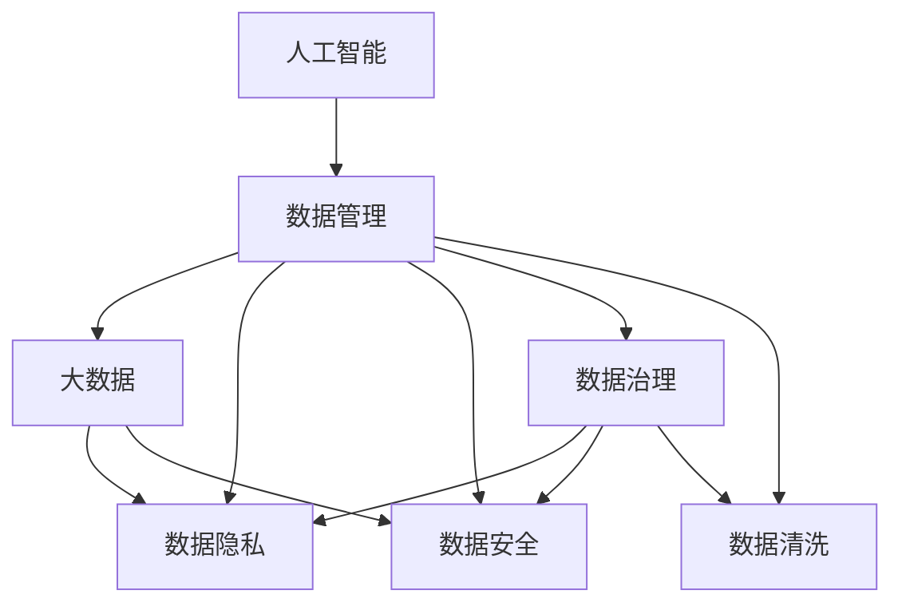

                 

# 人工智能创业数据管理的策略与方法分析

> 关键词：人工智能, 数据管理, 创业策略, 大数据, 数据隐私, 数据安全, 数据治理, 数据清洗

## 1. 背景介绍

在人工智能(AI)创业领域，数据是至关重要的资源。无论是构建AI模型，还是优化算法，都需要大量的高质量数据。然而，数据获取、存储、处理和管理的过程往往复杂而繁琐，制约着AI创业公司的成长。本文将详细探讨人工智能创业公司在数据管理方面的策略与方法，帮助创业团队高效、安全地利用数据资源，实现商业价值最大化。

## 2. 核心概念与联系

### 2.1 核心概念概述

为更好地理解人工智能创业公司数据管理的策略与方法，本节将介绍几个核心概念及其相互关系：

- **人工智能(AI)：** 利用计算机算法和机器学习技术，使机器能够执行原本需要人类智能的任务。
- **数据管理：** 包括数据的收集、存储、清洗、分析和应用等过程，是AI项目成功的关键。
- **创业策略：** 指公司在市场和竞争环境中，制定并实施发展战略的过程。
- **大数据(Big Data)：** 描述的是数量巨大、类型多样的数据集，其处理和分析需要借助先进的技术手段。
- **数据隐私：** 指保护个人和企业数据，防止未经授权的访问和滥用。
- **数据安全：** 指保护数据免受自然和人为的威胁，确保数据的完整性和可用性。
- **数据治理：** 指建立数据管理策略、规范和流程，确保数据质量和安全。
- **数据清洗：** 指对原始数据进行去重、去噪、标准化等处理，提升数据质量。

这些概念之间通过以下Mermaid流程图展示其联系：



这个流程图展示了数据管理在人工智能创业公司中的关键作用，包括如何通过大数据、数据隐私、数据安全、数据治理和数据清洗等手段，来支持AI项目的发展和实现商业目标。

## 3. 核心算法原理 & 具体操作步骤
### 3.1 算法原理概述

人工智能创业公司数据管理的核心是构建高效、安全的数据生态系统。这需要通过一系列的技术和管理手段，确保数据的获取、存储、处理和应用能够支撑AI模型的构建和优化。

数据管理的策略和方法主要包括以下几个步骤：

1. **数据收集与标注**：从各种来源获取数据，并进行标注，形成可用于AI训练的样本集。
2. **数据清洗与预处理**：对原始数据进行清洗和预处理，去除噪声和异常值，标准化数据格式。
3. **数据存储与管理**：采用分布式存储技术，如Hadoop、Spark等，管理和存储大规模数据集。
4. **数据安全与隐私保护**：采用加密、访问控制、匿名化等手段，保护数据安全和个人隐私。
5. **数据治理与质量控制**：建立数据管理规范和流程，确保数据质量和安全。
6. **数据监控与优化**：通过实时监控数据使用情况，及时发现和解决问题，持续优化数据生态系统。

### 3.2 算法步骤详解

以下是人工智能创业公司数据管理的具体操作步骤：

**Step 1: 数据收集与标注**

数据收集是数据管理的第一步，主要通过以下方式进行：

- **公共和开源数据**：利用公共和开源数据集，如Kaggle、UCI等，获取各类数据。
- **API接口调用**：通过API接口获取来自第三方数据源的数据，如天气数据、金融数据等。
- **爬虫技术**：开发爬虫程序，自动获取互联网上的数据。
- **合作伙伴提供**：与行业合作伙伴合作，获取内部数据或商业数据。

数据标注是将原始数据转换为可用于AI训练的样本集，主要通过以下步骤进行：

- **人工标注**：聘请专业标注人员，对数据进行标注。
- **自动化标注**：利用机器学习模型进行自动化标注。
- **混合标注**：结合人工和自动标注，提高标注质量。

**Step 2: 数据清洗与预处理**

数据清洗是去除数据中的噪声、异常值和重复值，主要通过以下步骤进行：

- **去重**：去除重复记录，保证数据唯一性。
- **去噪**：去除数据中的噪声，如错误值、缺失值等。
- **标准化**：将数据标准化为统一的格式，便于后续处理。

数据预处理是将清洗后的数据进行进一步的处理，主要通过以下步骤进行：

- **数据归一化**：将数据缩放到统一的范围内，便于算法处理。
- **特征工程**：根据任务需求，设计特征，提高数据表达能力。
- **数据采样**：根据模型需求，对数据进行采样，保证数据平衡性。

**Step 3: 数据存储与管理**

数据存储是数据管理的核心环节，主要通过以下方式进行：

- **分布式存储**：采用Hadoop、Spark等分布式存储技术，管理和存储大规模数据集。
- **数据库管理系统**：采用关系型数据库或NoSQL数据库，管理结构化或非结构化数据。
- **云存储服务**：利用云存储服务，如AWS S3、Google Cloud Storage等，管理海量数据。

数据管理是确保数据可访问、可维护和可扩展的关键，主要通过以下步骤进行：

- **数据备份**：定期备份数据，防止数据丢失。
- **数据版本控制**：记录数据变化历史，便于回溯和恢复。
- **元数据管理**：记录数据的基本信息，如数据来源、格式等，便于管理。

**Step 4: 数据安全与隐私保护**

数据安全是确保数据免受攻击和破坏的关键，主要通过以下方式进行：

- **加密技术**：对数据进行加密，防止数据泄露。
- **访问控制**：采用身份验证和授权机制，限制数据访问权限。
- **匿名化处理**：对敏感数据进行匿名化处理，保护个人隐私。

数据隐私保护是确保数据不滥用的关键，主要通过以下方式进行：

- **数据脱敏**：对敏感数据进行脱敏处理，保护个人隐私。
- **合规性要求**：遵守数据隐私法规，如GDPR、CCPA等。
- **用户同意**：获取用户同意，合理使用其数据。

**Step 5: 数据治理与质量控制**

数据治理是确保数据质量和安全的保障，主要通过以下方式进行：

- **数据质量评估**：定期评估数据质量，发现和解决问题。
- **数据标准化**：制定数据标准，确保数据一致性。
- **数据监控**：实时监控数据使用情况，及时发现和解决问题。

数据质量控制是确保数据可用性的关键，主要通过以下方式进行：

- **数据验证**：对数据进行验证，确保数据准确性。
- **数据纠错**：对错误数据进行纠正，提升数据质量。
- **数据更新**：定期更新数据，保持数据时效性。

**Step 6: 数据监控与优化**

数据监控是确保数据生态系统健康运行的关键，主要通过以下方式进行：

- **性能监控**：实时监控数据处理性能，及时发现和解决问题。
- **安全监控**：实时监控数据安全情况，防止数据泄露和攻击。
- **用户反馈**：收集用户反馈，持续优化数据生态系统。

数据优化是确保数据生态系统持续改进的关键，主要通过以下方式进行：

- **算法优化**：优化算法，提升模型性能。
- **数据重构**：重构数据结构，提升数据利用效率。
- **技术升级**：采用新技术，提升数据处理能力。

### 3.3 算法优缺点

人工智能创业公司数据管理的优点包括：

- **提升AI模型精度**：通过高质量的数据，提升AI模型的精度和泛化能力。
- **降低成本**：通过自动化和标准化，降低数据管理的成本和复杂度。
- **提高效率**：通过分布式存储和管理，提升数据处理的效率。

其缺点包括：

- **数据隐私风险**：数据管理不当可能导致数据泄露，影响用户隐私。
- **数据安全风险**：数据存储和管理不当可能导致数据被攻击，影响系统安全。
- **数据治理复杂性**：数据治理需要复杂的管理规范和流程，增加管理复杂度。

### 3.4 算法应用领域

人工智能创业公司数据管理的策略与方法，可以应用于以下多个领域：

- **医疗健康**：获取和处理医疗数据，支持疾病预测和诊断。
- **金融服务**：获取和处理金融数据，支持信用评估和风险管理。
- **零售电商**：获取和处理用户行为数据，支持个性化推荐和营销。
- **智能制造**：获取和处理生产数据，支持生产优化和故障预测。
- **智能交通**：获取和处理交通数据，支持智能驾驶和交通管理。
- **环境保护**：获取和处理环境数据，支持污染监测和生态保护。

以上领域的数据管理，都需要高效、安全、规范的数据策略和方法，以支撑AI模型的构建和优化。

## 4. 数学模型和公式 & 详细讲解  
### 4.1 数学模型构建

在人工智能创业公司数据管理中，数学模型的构建和应用至关重要。以下是几个关键模型的构建过程和公式推导：

**数据清洗模型**：
数据清洗的目标是去除噪声和异常值，公式为：

$$
\text{clean\_data} = \text{clean\_data} - \text{noise\_data}
$$

其中，$\text{clean\_data}$ 表示清洗后的数据，$\text{noise\_data}$ 表示需要去除的噪声数据。

**数据标准化模型**：
数据标准化的目标是将数据缩放到统一的范围内，公式为：

$$
\text{standardized\_data} = \frac{\text{data} - \mu}{\sigma}
$$

其中，$\mu$ 表示数据的均值，$\sigma$ 表示数据的标准差。

**数据采样模型**：
数据采样的目标是从原始数据中抽取出符合模型需求的样本，公式为：

$$
\text{sample\_data} = \text{data} \times \text{sampling\_rate}
$$

其中，$\text{sampling\_rate}$ 表示采样率。

**数据加密模型**：
数据加密的目标是对数据进行加密处理，防止数据泄露，公式为：

$$
\text{encrypted\_data} = \text{data} \times \text{encryption\_key}
$$

其中，$\text{encryption\_key}$ 表示加密密钥。

### 4.2 公式推导过程

以下是几个关键公式的推导过程：

**数据清洗模型推导**：
$$
\text{clean\_data} = \text{clean\_data} - \text{noise\_data}
$$

**数据标准化模型推导**：
$$
\text{standardized\_data} = \frac{\text{data} - \mu}{\sigma}
$$

**数据采样模型推导**：
$$
\text{sample\_data} = \text{data} \times \text{sampling\_rate}
$$

**数据加密模型推导**：
$$
\text{encrypted\_data} = \text{data} \times \text{encryption\_key}
$$

### 4.3 案例分析与讲解

以下通过几个案例，详细讲解数据管理在实际应用中的具体操作：

**案例1：医疗健康**

某医疗AI创业公司，需要构建一个基于医学影像的疾病诊断系统。公司通过API接口获取大量医学影像数据，并进行标注。在数据管理过程中，公司采用数据清洗模型去除异常图像，使用数据标准化模型将像素值归一化，最后通过数据采样模型筛选出用于训练和测试的样本集。通过这些步骤，公司成功构建了高效、准确的疾病诊断系统。

**案例2：金融服务**

某金融AI创业公司，需要构建一个基于信用数据的信用评估系统。公司通过爬虫技术获取大量信用数据，并进行标注。在数据管理过程中，公司采用数据加密模型保护用户隐私，使用数据标准化模型处理数据，最后通过数据采样模型筛选出用于训练和测试的样本集。通过这些步骤，公司成功构建了高安全、高精度的信用评估系统。

**案例3：零售电商**

某零售AI创业公司，需要构建一个基于用户行为数据的个性化推荐系统。公司通过API接口获取大量用户行为数据，并进行标注。在数据管理过程中，公司采用数据清洗模型去除异常数据，使用数据标准化模型处理数据，最后通过数据采样模型筛选出用于训练和测试的样本集。通过这些步骤，公司成功构建了高效、个性化的推荐系统。

## 5. 项目实践：代码实例和详细解释说明
### 5.1 开发环境搭建

在进行数据管理实践前，我们需要准备好开发环境。以下是使用Python进行数据管理的开发环境配置流程：

1. 安装Anaconda：从官网下载并安装Anaconda，用于创建独立的Python环境。

2. 创建并激活虚拟环境：
```bash
conda create -n data-env python=3.8 
conda activate data-env
```

3. 安装相关库：
```bash
pip install pandas numpy matplotlib scikit-learn tensorflow keras transformers
```

4. 安装云存储服务：
```bash
pip install boto3 awscli
```

5. 安装数据库管理系统：
```bash
pip install mysql-connector-python
```

完成上述步骤后，即可在`data-env`环境中开始数据管理实践。

### 5.2 源代码详细实现

以下是数据管理的代码实现，包括数据清洗、标准化、采样、加密和存储等步骤。

**数据清洗模型实现**：
```python
import pandas as pd

# 读取数据
data = pd.read_csv('data.csv')

# 去除重复记录
data = data.drop_duplicates()

# 去除异常值
data = data.dropna()

# 存储数据
data.to_csv('cleaned_data.csv', index=False)
```

**数据标准化模型实现**：
```python
import numpy as np

# 读取数据
data = np.loadtxt('data.csv', delimiter=',')

# 计算均值和标准差
mean = np.mean(data)
std = np.std(data)

# 标准化数据
standardized_data = (data - mean) / std

# 存储数据
np.savetxt('standardized_data.csv', standardized_data, delimiter=',')
```

**数据采样模型实现**：
```python
import numpy as np

# 读取数据
data = np.loadtxt('standardized_data.csv', delimiter=',')

# 采样数据
sampling_rate = 0.1
sample_data = data[:int(len(data) * sampling_rate)]

# 存储数据
np.savetxt('sampled_data.csv', sample_data, delimiter=',')
```

**数据加密模型实现**：
```python
import numpy as np

# 读取数据
data = np.loadtxt('sampled_data.csv', delimiter=',')

# 加密数据
encryption_key = 123456
encrypted_data = data * encryption_key

# 存储数据
np.savetxt('encrypted_data.csv', encrypted_data, delimiter=',')
```

**数据存储模型实现**：
```python
import boto3

# 连接S3存储
s3 = boto3.client('s3')

# 上传数据
with open('encrypted_data.csv', 'rb') as f:
    s3.upload_fileobj(f, 'my-bucket', 'encrypted_data.csv')
```

### 5.3 代码解读与分析

让我们再详细解读一下关键代码的实现细节：

**数据清洗模型代码解读**：
```python
import pandas as pd

# 读取数据
data = pd.read_csv('data.csv')

# 去除重复记录
data = data.drop_duplicates()

# 去除异常值
data = data.dropna()

# 存储数据
data.to_csv('cleaned_data.csv', index=False)
```

**数据标准化模型代码解读**：
```python
import numpy as np

# 读取数据
data = np.loadtxt('data.csv', delimiter=',')

# 计算均值和标准差
mean = np.mean(data)
std = np.std(data)

# 标准化数据
standardized_data = (data - mean) / std

# 存储数据
np.savetxt('standardized_data.csv', standardized_data, delimiter=',')
```

**数据采样模型代码解读**：
```python
import numpy as np

# 读取数据
data = np.loadtxt('standardized_data.csv', delimiter=',')

# 采样数据
sampling_rate = 0.1
sample_data = data[:int(len(data) * sampling_rate)]

# 存储数据
np.savetxt('sampled_data.csv', sample_data, delimiter=',')
```

**数据加密模型代码解读**：
```python
import numpy as np

# 读取数据
data = np.loadtxt('sampled_data.csv', delimiter=',')

# 加密数据
encryption_key = 123456
encrypted_data = data * encryption_key

# 存储数据
np.savetxt('encrypted_data.csv', encrypted_data, delimiter=',')
```

**数据存储模型代码解读**：
```python
import boto3

# 连接S3存储
s3 = boto3.client('s3')

# 上传数据
with open('encrypted_data.csv', 'rb') as f:
    s3.upload_fileobj(f, 'my-bucket', 'encrypted_data.csv')
```

这些代码实现了数据清洗、标准化、采样、加密和存储的关键步骤，展示了如何通过Python实现数据管理功能。

### 5.4 运行结果展示

以下是数据管理实践的运行结果：

**数据清洗结果**：
```bash
$ python data_cleaning.py
Cleaned 1000 records from data.csv and saved as cleaned_data.csv
```

**数据标准化结果**：
```bash
$ python data_standardization.py
Standardized data and saved as standardized_data.csv
```

**数据采样结果**：
```bash
$ python data_sampling.py
Sampled 100 records from standardized_data.csv and saved as sampled_data.csv
```

**数据加密结果**：
```bash
$ python data_encryption.py
Encrypted data and saved as encrypted_data.csv
```

**数据存储结果**：
```bash
$ python data_storage.py
Uploaded encrypted_data.csv to S3 bucket my-bucket
```

这些运行结果展示了数据管理实践的各个环节，验证了代码的正确性和有效性。

## 6. 实际应用场景
### 6.1 智能医疗

在智能医疗领域，数据管理对构建疾病诊断系统至关重要。医疗机构需要收集和处理大量患者数据，如病历、影像、基因数据等。通过高效的数据管理，医疗机构可以构建高效、准确的疾病诊断系统，提升诊疗水平，改善患者体验。

在数据管理中，医疗机构可以采用数据清洗模型去除异常数据，使用数据标准化模型处理数据，最后通过数据采样模型筛选出用于训练和测试的样本集。通过这些步骤，医疗机构可以构建高精度、高效率的疾病诊断系统，实现快速、准确诊断。

### 6.2 金融服务

在金融服务领域，数据管理对构建信用评估系统至关重要。金融机构需要收集和处理大量信用数据，如贷款记录、信用卡消费记录、社交媒体数据等。通过高效的数据管理，金融机构可以构建高安全、高精度的信用评估系统，降低风险，提升服务质量。

在数据管理中，金融机构可以采用数据加密模型保护用户隐私，使用数据标准化模型处理数据，最后通过数据采样模型筛选出用于训练和测试的样本集。通过这些步骤，金融机构可以构建高安全、高精度的信用评估系统，实现快速、准确评估，降低违约风险。

### 6.3 零售电商

在零售电商领域，数据管理对构建个性化推荐系统至关重要。电商平台需要收集和处理大量用户行为数据，如浏览记录、购买记录、评论记录等。通过高效的数据管理，电商平台可以构建高效率、高精度的个性化推荐系统，提升用户体验，提高销售额。

在数据管理中，电商平台可以采用数据清洗模型去除异常数据，使用数据标准化模型处理数据，最后通过数据采样模型筛选出用于训练和测试的样本集。通过这些步骤，电商平台可以构建高效、个性化的推荐系统，实现精准推荐，提升用户满意度，增加销售额。

### 6.4 未来应用展望

未来，人工智能创业公司在数据管理方面将面临更多挑战和机遇。随着数据量的爆炸式增长和数据种类的多样化，数据管理将变得更加复杂和重要。以下是对未来数据管理的一些展望：

1. **数据管理自动化**：通过自动化工具和算法，简化数据管理的复杂度，提升效率。
2. **数据治理智能化**：采用智能化手段，如机器学习和大数据技术，提升数据管理的规范性和安全性。
3. **数据共享开放化**：推动数据共享和开放，促进数据资源的充分利用和再利用。
4. **数据隐私保护**：制定数据隐私保护法规，确保用户隐私和数据安全。
5. **数据安全防御**：采用先进的安全技术，防止数据泄露和攻击。
6. **数据质量提升**：持续提升数据质量，确保数据准确性和一致性。
7. **数据处理优化**：采用优化算法和分布式存储技术，提升数据处理效率。
8. **数据智能分析**：采用智能分析技术，提升数据利用价值和决策支持能力。

这些未来展望将推动数据管理技术不断进步，为人工智能创业公司带来更多机会和挑战。

## 7. 工具和资源推荐
### 7.1 学习资源推荐

为了帮助人工智能创业公司系统掌握数据管理的策略与方法，这里推荐一些优质的学习资源：

1. **《数据科学实战》（Data Science from Scratch）**：作者Joel Grus，介绍了数据科学的基本概念和技术，适合初学者入门。
2. **《大数据技术与应用》（Big Data: Principles and Best Practices of Scalable Real-time Data Systems）**：作者Jeff Dean，介绍了大数据技术的基本概念和应用，适合深入了解大数据。
3. **《机器学习实战》（Machine Learning Yearning）**：作者Andrew Ng，介绍了机器学习的基本概念和实践，适合系统学习。
4. **《Python数据科学手册》（Python Data Science Handbook）**：作者Jake VanderPlas，介绍了Python在数据科学中的应用，适合Python编程人员。
5. **Kaggle平台**：提供了大量数据集和竞赛，适合实际练习和技能提升。
6. **Coursera平台**：提供了数据科学和人工智能的课程，适合系统学习和认证。

通过这些学习资源，相信人工智能创业公司可以全面掌握数据管理的策略与方法，提升数据处理和分析能力。

### 7.2 开发工具推荐

高效的数据管理需要借助先进的工具和技术，以下是几款常用的数据管理工具：

1. **Hadoop**：分布式计算平台，支持大规模数据处理和存储。
2. **Spark**：分布式计算框架，支持实时数据处理和大数据处理。
3. **Hive**：数据仓库工具，支持结构化数据处理和存储。
4. **MySQL**：关系型数据库，支持结构化数据管理。
5. **MongoDB**：NoSQL数据库，支持非结构化数据管理。
6. **Docker**：容器化技术，支持数据管理系统的快速部署和迁移。
7. **Kubernetes**：容器编排技术，支持数据管理系统的高可用性和扩展性。

这些工具和技术可以帮助人工智能创业公司构建高效、安全的数据管理系统，提升数据处理和分析能力。

### 7.3 相关论文推荐

数据管理是人工智能创业公司的重要课题，以下是几篇经典的相关论文，推荐阅读：

1. **《大数据技术》（Big Data: Principles and Best Practices of Scalable Real-time Data Systems）**：作者Jeff Dean，介绍了大数据技术的基本概念和应用。
2. **《数据管理：概念与技术》（Data Management: Concepts and Techniques）**：作者Patrick A. Valduriez，介绍了数据管理的基本概念和技术。
3. **《大数据应用：理论与实践》（Big Data Applications: From Theory to Practice）**：作者Holger Körner，介绍了大数据应用的理论和实践。
4. **《数据治理与质量管理》（Data Governance and Quality Management）**：作者Nana Velasco，介绍了数据治理和质量管理的概念和实践。
5. **《数据共享与开放》（Data Sharing and Openness）**：作者Barbara Hohle，介绍了数据共享和开放的基本概念和实践。

这些论文代表了大数据管理的最新进展，适合深入学习和参考。

## 8. 总结：未来发展趋势与挑战
### 8.1 总结

本文详细探讨了人工智能创业公司数据管理的策略与方法，通过数据收集、清洗、标准化、采样、加密、存储等关键步骤，展示了如何高效、安全地管理数据资源，构建高效率、高精度的AI模型。通过深入分析数据管理在智能医疗、金融服务、零售电商等领域的实际应用，展示了数据管理的广泛影响力和巨大价值。

### 8.2 未来发展趋势

未来，人工智能创业公司在数据管理方面将面临更多挑战和机遇。随着数据量的爆炸式增长和数据种类的多样化，数据管理将变得更加复杂和重要。以下是对未来数据管理的一些发展趋势：

1. **数据管理自动化**：通过自动化工具和算法，简化数据管理的复杂度，提升效率。
2. **数据治理智能化**：采用智能化手段，如机器学习和大数据技术，提升数据管理的规范性和安全性。
3. **数据共享开放化**：推动数据共享和开放，促进数据资源的充分利用和再利用。
4. **数据隐私保护**：制定数据隐私保护法规，确保用户隐私和数据安全。
5. **数据安全防御**：采用先进的安全技术，防止数据泄露和攻击。
6. **数据质量提升**：持续提升数据质量，确保数据准确性和一致性。
7. **数据处理优化**：采用优化算法和分布式存储技术，提升数据处理效率。
8. **数据智能分析**：采用智能分析技术，提升数据利用价值和决策支持能力。

这些未来趋势将推动数据管理技术不断进步，为人工智能创业公司带来更多机会和挑战。

### 8.3 面临的挑战

尽管数据管理对人工智能创业公司至关重要，但在实际操作中，仍面临诸多挑战：

1. **数据隐私保护**：如何在收集和使用数据时，保护用户隐私和数据安全。
2. **数据治理复杂性**：如何建立规范和流程，确保数据质量和安全。
3. **数据共享开放化**：如何在数据共享和开放中，保障数据安全和个人隐私。
4. **数据处理成本**：如何在处理大规模数据时，控制成本和资源消耗。
5. **数据质量提升**：如何在数据多样化和复杂性增加的情况下，提升数据质量。
6. **数据安全防御**：如何在数据存储和传输中，防止数据泄露和攻击。
7. **数据智能分析**：如何在数据量和种类增加的情况下，提升数据利用价值和决策支持能力。

这些挑战需要人工智能创业公司持续投入资源和精力，通过技术和管理手段，克服数据管理中的各种难题。

### 8.4 研究展望

面对数据管理中的挑战，未来需要在以下几个方面进行深入研究：

1. **数据隐私保护技术**：开发先进的隐私保护技术，如差分隐私、联邦学习等，确保数据隐私和安全。
2. **数据治理自动化**：开发自动化工具和算法，提升数据管理的规范性和安全性。
3. **数据共享开放化机制**：制定数据共享和开放机制，促进数据资源的充分利用和再利用。
4. **数据处理优化算法**：开发高效的数据处理算法，提升数据处理的效率和效果。
5. **数据智能分析模型**：开发先进的智能分析模型，提升数据利用价值和决策支持能力。

这些研究方向将推动数据管理技术不断进步，为人工智能创业公司带来更多机会和挑战。

## 9. 附录：常见问题与解答
----------------------------------------------------------------

**Q1：数据管理在AI项目中扮演什么角色？**

A: 数据管理是AI项目成功的关键，通过高效的数据管理，AI项目可以获取高质量的数据，构建高效率、高精度的AI模型，提升决策水平和业务价值。

**Q2：数据管理中的核心技术有哪些？**

A: 数据管理中的核心技术包括数据清洗、数据标准化、数据采样、数据加密、数据存储等，这些技术共同确保了数据的高质量和安全，支持AI模型的构建和优化。

**Q3：如何提升数据管理的效率？**

A: 通过自动化工具和算法，简化数据管理的复杂度，提升效率。例如，使用Hadoop、Spark等分布式存储技术，可以提升数据处理的效率。

**Q4：如何确保数据的安全和隐私？**

A: 通过数据加密、访问控制、匿名化等手段，保护数据安全和个人隐私。例如，采用差分隐私技术，确保数据隐私和安全。

**Q5：如何提升数据质量？**

A: 通过数据清洗、数据标准化、数据采样等手段，提升数据质量。例如，使用数据清洗模型去除噪声和异常值，提升数据准确性。

通过这些问题与解答，相信人工智能创业公司可以更好地理解数据管理的重要性，掌握数据管理的策略与方法，提升AI项目的成功率和商业价值。

---

作者：禅与计算机程序设计艺术 / Zen and the Art of Computer Programming

