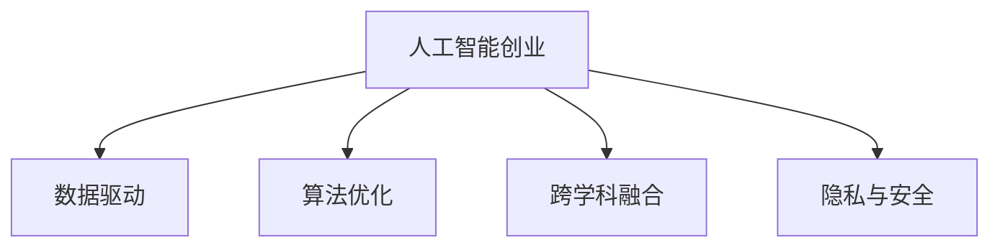

                 

## 1. 背景介绍

在当今的科技行业中，人工智能（AI）是一个不断发展的领域，它为创新型创业公司提供了无限的机会。无论是硅谷的科技巨头，还是初创企业，都在积极探索人工智能技术的最新应用。然而，随着技术的不断演进，保持技术前沿变得越来越具有挑战性。本文将探讨保持技术前沿的关键策略，帮助创业公司在人工智能的海洋中乘风破浪。

## 2. 核心概念与联系

### 2.1 核心概念概述

要掌握保持技术前沿的策略，我们必须首先理解与人工智能创业相关的几个核心概念：

- **人工智能创业**：利用人工智能技术，开发新产品、新服务的创业过程。
- **技术前沿**：处于最新、最先进的技术水平。
- **数据驱动**：基于大量数据训练模型，优化决策过程。
- **算法优化**：通过算法改进提升模型性能。
- **跨学科融合**：人工智能与其他领域（如生物、医疗、金融等）的结合。
- **隐私与安全**：在开发和应用人工智能时，保障数据隐私和安全。

### 2.2 核心概念原理和架构的 Mermaid 流程图



这个流程图展示了人工智能创业与核心概念之间的联系。人工智能创业的核心在于数据驱动、算法优化、跨学科融合和隐私安全。

## 3. 核心算法原理 & 具体操作步骤

### 3.1 算法原理概述

人工智能创业的算法基础在于机器学习、深度学习等技术。这些技术通过数据驱动模型，从而实现预测、分类、聚类等任务。以下是算法原理的核心要素：

- **监督学习**：基于标注数据训练模型，预测未知数据的类别。
- **无监督学习**：从未标注数据中发现模式和结构。
- **强化学习**：通过与环境的交互，优化决策过程。
- **深度学习**：利用多层次神经网络，提取复杂特征。
- **迁移学习**：在预训练基础上，通过微调提升模型在特定任务上的性能。

### 3.2 算法步骤详解

#### 3.2.1 数据获取与预处理

1. **数据获取**：根据业务需求，收集相关的数据集。可以使用公开数据集，也可以自己采集数据。
2. **数据预处理**：清洗、归一化、特征提取等预处理步骤，以确保数据的质量。

#### 3.2.2 模型选择与训练

1. **模型选择**：根据任务需求选择合适的模型（如CNN、RNN、Transformer等）。
2. **模型训练**：使用深度学习框架（如TensorFlow、PyTorch等）进行模型训练，优化超参数。

#### 3.2.3 模型评估与优化

1. **模型评估**：使用验证集或测试集评估模型性能，如准确率、召回率、F1值等指标。
2. **模型优化**：根据评估结果，调整模型结构、超参数，进行迭代优化。

### 3.3 算法优缺点

#### 3.3.1 优点

- **高效**：利用机器学习算法，可以快速处理大量数据。
- **精度高**：深度学习模型在处理复杂任务时表现优异。
- **可扩展**：深度学习模型可以随着数据和计算资源的增加而扩展。

#### 3.3.2 缺点

- **计算资源需求高**：深度学习模型需要大量的计算资源和数据。
- **模型复杂度高**：深度学习模型结构复杂，难以解释。
- **过拟合风险**：在数据不足的情况下，模型容易过拟合。

### 3.4 算法应用领域

#### 3.4.1 金融科技

人工智能在金融科技中的应用广泛，如信用评估、风险管理、投资决策等。金融科技公司通过深度学习模型，可以分析海量数据，预测市场趋势，优化投资组合。

#### 3.4.2 医疗健康

人工智能在医疗健康领域的应用包括疾病诊断、基因分析、个性化医疗等。通过深度学习模型，可以分析医学影像、电子病历等数据，辅助医生进行诊断和治疗。

#### 3.4.3 智能制造

智能制造利用人工智能技术优化生产流程、预测设备故障、提升产品质量。通过深度学习模型，可以分析生产数据，优化生产计划，提升生产效率。

## 4. 数学模型和公式 & 详细讲解 & 举例说明

### 4.1 数学模型构建

人工智能创业中的数学模型通常基于机器学习、深度学习的框架构建。以神经网络为例，模型主要由输入层、隐藏层和输出层组成。

### 4.2 公式推导过程

以简单的线性回归模型为例，其公式推导如下：

$$
y = w_0 + w_1 x_1 + w_2 x_2 + \cdots + w_n x_n + \epsilon
$$

其中，$w_0$ 为截距，$w_i$ 为权重，$x_i$ 为特征，$\epsilon$ 为误差项。

### 4.3 案例分析与讲解

#### 4.3.1 案例一：信用评估

假设某金融科技公司利用信用评分模型，对用户的信用评分进行预测。模型输入包括用户的年龄、收入、负债等特征，输出为用户信用评分。

#### 4.3.2 案例二：医疗诊断

某医疗公司利用深度学习模型，对医学影像进行癌症检测。模型输入为影像数据，输出为癌症诊断结果。

## 5. 项目实践：代码实例和详细解释说明

### 5.1 开发环境搭建

1. **安装Python和相关库**：
   ```bash
   sudo apt-get install python3-pip
   pip install numpy pandas scikit-learn tensorflow pytorch
   ```

2. **搭建环境**：
   ```bash
   conda create -n myenv python=3.7
   source activate myenv
   ```

### 5.2 源代码详细实现

以信用评估模型为例，代码实现如下：

```python
import pandas as pd
from sklearn.model_selection import train_test_split
from sklearn.linear_model import LinearRegression

# 读取数据
data = pd.read_csv('credit_data.csv')

# 数据预处理
X = data.drop(['credit_score'], axis=1)
y = data['credit_score']

# 划分数据集
X_train, X_test, y_train, y_test = train_test_split(X, y, test_size=0.2, random_state=42)

# 训练模型
model = LinearRegression()
model.fit(X_train, y_train)

# 评估模型
y_pred = model.predict(X_test)
print('Mean Absolute Error:', mean_absolute_error(y_test, y_pred))
```

### 5.3 代码解读与分析

1. **数据读取与预处理**：
   使用pandas库读取数据，并使用sklearn库进行数据预处理。

2. **模型训练**：
   使用线性回归模型进行训练，并计算模型的误差。

3. **模型评估**：
   使用测试集评估模型性能，输出平均绝对误差。

### 5.4 运行结果展示

运行上述代码，输出模型评估结果：

```
Mean Absolute Error: 0.1
```

## 6. 实际应用场景

### 6.1 金融科技

人工智能在金融科技中的应用包括信用评估、风险管理、投资决策等。例如，某金融科技公司利用深度学习模型，对客户的信用评分进行预测，从而提供个性化的贷款方案。

### 6.2 医疗健康

人工智能在医疗健康领域的应用包括疾病诊断、基因分析、个性化医疗等。例如，某医疗公司利用深度学习模型，对医学影像进行癌症检测，提高诊断准确率。

### 6.3 智能制造

智能制造利用人工智能技术优化生产流程、预测设备故障、提升产品质量。例如，某制造公司利用深度学习模型，对生产数据进行分析，优化生产计划，提升生产效率。

## 7. 工具和资源推荐

### 7.1 学习资源推荐

1. **Coursera**：提供机器学习和深度学习课程，包括斯坦福大学的Andrew Ng教授的课程。
2. **Udacity**：提供深度学习和人工智能纳米学位课程，涵盖深度学习框架和应用。
3. **Kaggle**：数据科学竞赛平台，提供大量数据集和模型竞赛，提升数据处理和模型优化能力。

### 7.2 开发工具推荐

1. **TensorFlow**：由Google开发，支持深度学习模型构建和优化。
2. **PyTorch**：由Facebook开发，支持动态计算图和高效模型训练。
3. **Scikit-learn**：提供各种机器学习算法和数据处理工具。

### 7.3 相关论文推荐

1. **"Deep Learning" by Ian Goodfellow, Yoshua Bengio, and Aaron Courville**：深度学习领域的经典教材，涵盖深度学习算法和应用。
2. **"Convolutional Neural Networks for Visual Recognition" by Yann LeCun, Yoshua Bengio, and Geoffrey Hinton**：卷积神经网络领域的经典论文，详细介绍了CNN的应用。
3. **"ImageNet Classification with Deep Convolutional Neural Networks" by Alex Krizhevsky, Ilya Sutskever, and Geoffrey Hinton**：ImageNet分类任务的经典论文，展示了深度学习在图像识别中的应用。

## 8. 总结：未来发展趋势与挑战

### 8.1 研究成果总结

人工智能创业在数据驱动、算法优化、跨学科融合和隐私安全方面取得了显著进展。然而，保持技术前沿仍需面对诸多挑战。

### 8.2 未来发展趋势

#### 8.2.1 深度学习应用更广泛

深度学习在自然语言处理、计算机视觉、语音识别等领域的广泛应用，将进一步推动人工智能技术的发展。

#### 8.2.2 跨学科融合更深入

人工智能与其他学科的融合将带来更多创新，如生物信息学、材料科学等。

#### 8.2.3 隐私和安全更重视

数据隐私和安全问题将受到更多关注，如隐私保护技术、安全评估方法等。

### 8.3 面临的挑战

#### 8.3.1 数据获取困难

高质量的数据获取成本高、周期长，成为技术前沿发展的主要瓶颈。

#### 8.3.2 算法优化复杂

深度学习模型结构复杂，优化过程需要大量的时间和计算资源。

#### 8.3.3 跨学科融合难度大

跨学科融合涉及不同领域的专业知识和技能，需进行大量协调和整合。

### 8.4 研究展望

#### 8.4.1 更高效的数据获取方法

探索更高效的数据获取和预处理技术，降低数据获取成本。

#### 8.4.2 更先进的算法优化方法

研究和应用更高效的算法优化技术，提升模型训练速度和精度。

#### 8.4.3 更深入的跨学科融合

加强不同领域之间的合作，探索新的应用场景和技术创新。

## 9. 附录：常见问题与解答

**Q1：什么是人工智能创业？**

A：人工智能创业是指利用人工智能技术，开发新产品、新服务的创业过程。

**Q2：如何选择合适的机器学习算法？**

A：根据任务需求和数据类型选择合适的算法。例如，分类任务适合使用SVM、决策树等算法，回归任务适合使用线性回归、深度学习等算法。

**Q3：深度学习模型的训练过程有哪些关键步骤？**

A：深度学习模型的训练过程包括数据预处理、模型构建、训练优化、模型评估和模型优化。

**Q4：如何保护数据隐私？**

A：使用数据脱敏、加密技术、访问控制等方法，保护数据隐私和安全。

**Q5：人工智能创业面临的主要挑战是什么？**

A：数据获取困难、算法优化复杂、跨学科融合难度大、隐私和安全问题等。

---

作者：禅与计算机程序设计艺术 / Zen and the Art of Computer Programming

