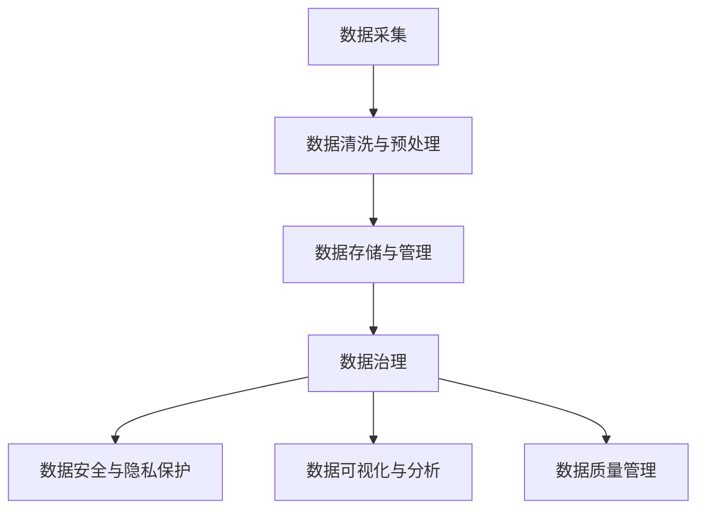

                 

# 人工智能创业：数据管理技巧

在人工智能(AI)创业的浪潮中，数据管理技巧的重要性不言而喻。无论是从数据收集、存储、处理，到数据分析、数据安全和隐私保护，每一个环节都直接影响着AI项目的成败。本文将深入探讨数据管理的核心概念、技术和应用，帮助AI创业者在数据处理的各个环节中游刃有余，从而打造出高效率、高价值的AI应用。

## 1. 背景介绍

随着大数据和人工智能技术的不断进步，越来越多的企业开始重视数据管理的重要性，将其视为战略性的资产。数据管理不仅是AI项目成功的基础，也是企业数字化转型的关键。创业者在创业初期，需要建立起健全的数据管理机制，确保数据的高效利用和正确应用，从而提升AI模型的性能和项目的成功率。

### 1.1 数据管理的重要性

数据管理的核心在于如何有效地收集、存储、分析和利用数据。良好的数据管理可以：
- **提升模型性能**：通过高质量的数据训练，AI模型能够更好地捕捉数据中的模式和规律。
- **降低成本**：优化数据管理流程，减少数据处理和存储的成本。
- **保障数据安全**：防止数据泄露和滥用，保护企业机密和用户隐私。
- **加速创新**：高效的数据管理能够快速响应市场需求，推动产品和服务的创新。

### 1.2 数据管理的挑战

尽管数据管理的重要性日益凸显，但其复杂性和挑战性也随之增加。主要挑战包括：
- **数据质量问题**：数据的不完整、不准确和不一致性，会影响模型训练和应用效果。
- **数据存储成本**：随着数据量的增长，存储和维护成本不断上升。
- **数据隐私和安全**：保护数据隐私和安全性，防止数据泄露和滥用。
- **数据治理**：数据管理涉及数据标准、数据生命周期、数据质量等多个方面，需要多部门的协同合作。

## 2. 核心概念与联系

### 2.1 核心概念概述

以下是人工智能创业中常用的数据管理核心概念及其联系：

1. **数据采集与预处理**：从不同的数据源收集数据，并进行清洗、去重、规范化等预处理操作，确保数据的完整性和一致性。
2. **数据存储与管理**：选择合适的数据存储技术（如关系型数据库、NoSQL数据库），管理和维护数据存储和检索的效率。
3. **数据治理**：通过建立数据标准和流程，确保数据的质量和一致性，确保数据的正确使用和共享。
4. **数据安全与隐私保护**：采取技术手段和管理措施，保护数据不被未授权访问、使用和泄露。
5. **数据可视化与分析**：通过数据可视化工具，直观展示数据特征和关系，支持决策制定。
6. **数据质量管理**：监控和评估数据质量，确保数据满足业务需求。

### 2.2 核心概念原理和架构的 Mermaid 流程图



## 3. 核心算法原理 & 具体操作步骤

### 3.1 算法原理概述

数据管理涉及多种技术和算法，其核心原理可以概括为：

- **数据采集**：从各种来源收集数据，包括结构化和非结构化数据。
- **数据清洗与预处理**：消除噪声和错误，确保数据的质量和一致性。
- **数据存储与管理**：选择合适的存储方式和管理系统，确保数据的高效存储和检索。
- **数据治理**：制定数据标准和流程，确保数据的正确使用和共享。
- **数据安全与隐私保护**：采用技术手段和管理措施，保护数据的隐私和安全。
- **数据可视化与分析**：通过可视化工具和算法，分析和展示数据特征和关系。
- **数据质量管理**：监控和评估数据质量，确保数据满足业务需求。

### 3.2 算法步骤详解

下面详细介绍各核心算法的详细步骤：

#### 3.2.1 数据采集

1. **确定数据源**：根据业务需求，确定需要收集的数据源，如传感器、用户行为数据、公开数据等。
2. **数据收集技术**：使用API、爬虫、ETL工具等方式收集数据。
3. **数据整合**：将不同来源的数据进行整合，消除冗余和冲突。

#### 3.2.2 数据清洗与预处理

1. **数据清洗**：识别和删除重复、缺失、噪声数据。
2. **数据转换**：对数据进行格式转换，如日期格式化、文本规范化等。
3. **数据归一化**：对数据进行标准化处理，确保数据在不同维度上具有可比性。
4. **特征工程**：根据模型需求，提取和构造特征。

#### 3.2.3 数据存储与管理

1. **选择合适的存储技术**：根据数据类型和业务需求，选择合适的存储技术（如关系型数据库、NoSQL数据库）。
2. **数据建模**：设计数据库架构，优化存储结构和索引。
3. **数据备份与恢复**：定期备份数据，并建立数据恢复机制。

#### 3.2.4 数据治理

1. **制定数据标准**：制定数据命名规范、数据格式标准等。
2. **数据质量监控**：建立数据质量监控系统，定期评估数据质量。
3. **数据生命周期管理**：定义数据生命周期，确保数据在不同阶段的正确处理和删除。

#### 3.2.5 数据安全与隐私保护

1. **数据加密**：对敏感数据进行加密存储和传输。
2. **访问控制**：限制对数据的访问权限，防止未授权访问。
3. **数据审计**：记录和审计数据访问和使用情况。

#### 3.2.6 数据可视化与分析

1. **数据可视化**：使用可视化工具（如Tableau、Power BI）展示数据特征和关系。
2. **数据挖掘**：采用数据挖掘算法（如聚类、分类、回归等）挖掘数据中的规律和模式。
3. **预测分析**：使用预测模型（如时间序列预测、回归分析等）进行趋势分析和预测。

#### 3.2.7 数据质量管理

1. **数据质量评估**：定期评估数据质量，识别问题数据。
2. **数据质量提升**：采取措施改进数据质量，如数据清洗、数据增强等。
3. **数据质量报告**：生成数据质量报告，为数据管理提供依据。

### 3.3 算法优缺点

数据管理算法的优缺点如下：

#### 优点

1. **提高数据质量**：通过清洗和预处理，消除数据中的噪声和错误，提升数据质量。
2. **优化数据存储**：选择合适的存储技术和管理方式，降低存储成本，提高存储效率。
3. **加强数据治理**：通过制定标准和流程，确保数据的正确使用和共享，提高数据管理的规范性。
4. **保障数据安全**：采用技术手段和管理措施，保护数据隐私和安全，避免数据泄露和滥用。
5. **支持数据可视化**：通过可视化工具和算法，直观展示数据特征和关系，支持决策制定。

#### 缺点

1. **技术复杂**：数据管理涉及多种技术和算法，技术门槛较高。
2. **成本高昂**：数据清洗和预处理、存储和管理、数据安全保护等环节，成本较高。
3. **数据孤岛**：数据来源多样，整合和治理复杂，可能导致数据孤岛现象。
4. **数据延迟**：数据清洗和处理可能需要较长时间，数据更新和获取可能存在延迟。

### 3.4 算法应用领域

数据管理算法在多个领域中得到广泛应用：

- **金融科技**：通过数据清洗和预处理，提升贷款审批和风险评估的准确性。
- **医疗健康**：通过数据治理和质量管理，确保医疗数据的准确性和一致性，提高诊疗效果。
- **智能制造**：通过数据采集和存储，优化生产流程，提升生产效率。
- **电子商务**：通过数据分析和可视化，优化用户推荐和广告投放，提升用户体验和销售额。
- **智能交通**：通过数据处理和可视化，优化交通流量管理，提升交通效率和安全性。

## 4. 数学模型和公式 & 详细讲解 & 举例说明

### 4.1 数学模型构建

数据管理算法涉及多种数学模型和公式，以下以数据清洗和预处理为例，详细介绍数学模型构建过程。

#### 4.1.1 数据清洗与预处理模型

假设有一个数据集 $D=\{(x_i, y_i)\}_{i=1}^N$，其中 $x_i$ 为输入，$y_i$ 为输出。目标是清洗和预处理数据，提升数据质量。

1. **数据清洗模型**：使用统计方法识别和删除异常数据。设异常数据为 $\hat{y}_i$，则数据清洗模型可表示为：

   $$
   \hat{y}_i = \begin{cases}
   y_i & \text{if } |y_i - \mu| < \sigma \\
   \text{NaN} & \text{otherwise}
   \end{cases}
   $$

   其中 $\mu$ 和 $\sigma$ 为数据的均值和标准差。

2. **数据归一化模型**：将数据映射到[0,1]区间。设归一化后的数据为 $\tilde{x}_i$，则归一化模型可表示为：

   $$
   \tilde{x}_i = \frac{x_i - \min(x)}{\max(x) - \min(x)}
   $$

3. **特征工程模型**：构造新的特征变量。设构造后的特征为 $z_i$，则特征工程模型可表示为：

   $$
   z_i = f(x_i, \theta)
   $$

   其中 $f$ 为特征函数，$\theta$ 为模型参数。

### 4.2 公式推导过程

#### 4.2.1 数据清洗模型推导

数据清洗模型的关键在于识别异常数据。通过计算数据的均值和标准差，可以识别出偏离正常范围的数据点。假设数据集 $D$ 的均值为 $\mu$，标准差为 $\sigma$，则数据清洗模型可以表示为：

$$
\hat{y}_i = \begin{cases}
y_i & \text{if } |y_i - \mu| < \sigma \\
\text{NaN} & \text{otherwise}
\end{cases}
$$

通过该模型，可以将异常数据点替换为NaN，减少对模型的干扰。

#### 4.2.2 数据归一化模型推导

数据归一化模型将原始数据映射到[0,1]区间，有助于模型更好地处理数据。设数据集 $D$ 中的最小值为 $\min(x)$，最大值为 $\max(x)$，则数据归一化模型可以表示为：

$$
\tilde{x}_i = \frac{x_i - \min(x)}{\max(x) - \min(x)}
$$

通过该模型，可以将数据映射到[0,1]区间，减少数据在不同特征上的尺度差异。

#### 4.2.3 特征工程模型推导

特征工程模型通过构造新的特征变量，提升模型的预测能力。假设原始数据集为 $D=\{(x_i, y_i)\}_{i=1}^N$，构造后的特征集为 $Z=\{(z_i)\}_{i=1}^N$，则特征工程模型可以表示为：

$$
z_i = f(x_i, \theta)
$$

其中 $f$ 为特征函数，$\theta$ 为模型参数。

### 4.3 案例分析与讲解

#### 4.3.1 数据清洗案例

假设有一家电商公司，收集了用户的购买数据和行为数据。通过数据清洗，可以识别和删除异常数据，如购买行为异常、价格异常等。以价格异常为例，假设数据的均值为 $\mu$，标准差为 $\sigma$，则可以通过数据清洗模型识别并删除异常价格点。

#### 4.3.2 数据归一化案例

假设有一家智能制造企业，收集了生产线上的传感器数据。通过数据归一化，可以将不同传感器数据映射到[0,1]区间，便于模型处理和比较。假设传感器数据的最大值为 $\max(x)$，最小值为 $\min(x)$，则可以通过数据归一化模型将数据映射到[0,1]区间。

#### 4.3.3 特征工程案例

假设有一家医疗健康公司，收集了患者的医疗数据。通过特征工程，可以构造新的特征变量，提升诊断模型的准确性。以病人的血压数据为例，可以通过构造心率、年龄、性别等特征变量，构建新的特征集，用于诊断模型的训练和测试。

## 5. 项目实践：代码实例和详细解释说明

### 5.1 开发环境搭建

在进行数据管理实践前，我们需要准备好开发环境。以下是使用Python进行Pandas和Scikit-Learn开发的环境配置流程：

1. 安装Anaconda：从官网下载并安装Anaconda，用于创建独立的Python环境。

2. 创建并激活虚拟环境：
```bash
conda create -n data-management python=3.8 
conda activate data-management
```

3. 安装Pandas和Scikit-Learn：
```bash
conda install pandas scikit-learn
```

4. 安装各类工具包：
```bash
pip install numpy matplotlib jupyter notebook ipython
```

完成上述步骤后，即可在`data-management-env`环境中开始数据管理实践。

### 5.2 源代码详细实现

下面我们以数据清洗和预处理为例，给出使用Pandas库进行数据管理的PyTorch代码实现。

首先，定义数据清洗和预处理函数：

```python
import pandas as pd
import numpy as np

def data_cleaning(df, threshold=3):
    # 删除异常值
    return df[abs(df - np.mean(df)) < threshold * np.std(df)]

def data_normalization(df):
    # 归一化处理
    return (df - df.min()) / (df.max() - df.min())

def feature_engineering(df, columns):
    # 构造新特征
    return pd.concat([df[columns], pd.DataFrame(df[columns].apply(lambda x: x.mean(), axis=0))], axis=1)
```

然后，使用这些函数对数据集进行清洗和预处理：

```python
# 加载数据集
df = pd.read_csv('data.csv')

# 清洗数据
df_cleaned = data_cleaning(df)

# 归一化处理
df_normalized = data_normalization(df_cleaned)

# 构造新特征
df_features = feature_engineering(df_normalized, columns=['age', 'gender', 'income'])

# 输出处理后的数据集
print(df_features)
```

### 5.3 代码解读与分析

让我们再详细解读一下关键代码的实现细节：

**data_cleaning函数**：
- 定义了数据清洗函数，通过计算数据的均值和标准差，识别并删除异常值。

**data_normalization函数**：
- 定义了数据归一化函数，将数据映射到[0,1]区间，减少数据在不同特征上的尺度差异。

**feature_engineering函数**：
- 定义了特征工程函数，构造新的特征变量，提升模型的预测能力。

**数据加载与处理**：
- 使用Pandas库加载数据集，并进行清洗、归一化和特征构造。

**数据输出**：
- 最后输出处理后的数据集，展示数据清洗和预处理的效果。

通过这些代码，我们可以看到Pandas库在数据管理中的应用。Pandas提供了丰富的数据处理工具，使得数据清洗、归一化和特征工程等环节变得更加简便高效。

## 6. 实际应用场景

### 6.1 智能推荐系统

智能推荐系统是数据管理的重要应用场景之一。通过数据清洗和预处理，提升推荐模型的准确性和效果。以电商平台的推荐系统为例，通过清洗用户行为数据，消除异常点和噪声，可以提高推荐模型的精度，提升用户满意度。

### 6.2 金融风险评估

金融领域需要处理大量的数据，如交易记录、信用评分等。通过数据治理和质量管理，确保数据的一致性和准确性，可以提升风险评估模型的性能，降低金融风险。

### 6.3 智能交通系统

智能交通系统需要处理大量的传感器数据和交通流量数据。通过数据清洗和预处理，提升交通流量预测模型的精度，优化交通管理，提高交通效率和安全性。

### 6.4 医疗健康管理

医疗健康领域需要处理大量的患者数据和医疗记录。通过数据治理和质量管理，确保数据的准确性和一致性，可以提升诊疗模型的性能，提高医疗服务的质量和效率。

## 7. 工具和资源推荐

### 7.1 学习资源推荐

为了帮助开发者系统掌握数据管理的技术基础和实践技巧，这里推荐一些优质的学习资源：

1. 《Python数据科学手册》：Python数据科学领域的经典书籍，涵盖数据清洗、数据处理、数据可视化等多个主题。
2. Kaggle：全球知名的数据科学竞赛平台，提供大量开源数据集和竞赛项目，锻炼数据管理能力。
3. Coursera《数据管理与分析》课程：由知名大学和机构提供的在线课程，系统介绍数据管理的理论和技术。
4. DataCamp：提供大量数据科学和数据管理的实战项目和课程，适合动手实践。
5. Udacity《数据科学与数据工程》纳米学位：涵盖数据清洗、数据处理、数据可视化等多个主题，适合系统学习。

通过对这些资源的学习实践，相信你一定能够快速掌握数据管理的精髓，并用于解决实际的数据管理问题。

### 7.2 开发工具推荐

高效的开发离不开优秀的工具支持。以下是几款用于数据管理开发的常用工具：

1. Pandas：Python中最流行的数据处理库，提供了丰富的数据清洗和预处理工具。
2. Scikit-Learn：Python中的机器学习库，提供了多种数据处理和分析算法。
3. Tableau：数据可视化工具，可以直观展示数据特征和关系，支持决策制定。
4. Apache Spark：大数据处理框架，可以高效处理大规模数据，提供数据处理和分析能力。
5. TensorBoard：TensorFlow配套的可视化工具，可以实时监测模型训练状态，提供丰富的图表呈现方式。

合理利用这些工具，可以显著提升数据管理的开发效率，加快创新迭代的步伐。

### 7.3 相关论文推荐

数据管理技术的发展离不开学界的持续研究。以下是几篇奠基性的相关论文，推荐阅读：

1. "Data Management: Concepts and Practice"：详细介绍了数据管理的概念、技术和应用。
2. "Big Data: Principles and Best Practices of Scalable Real-time Data Systems"：介绍了大数据管理的原则和技术，适用于大规模数据管理场景。
3. "Data Cleaning: A Review"：总结了数据清洗的各种方法和技术，适用于不同类型的数据管理问题。
4. "Data Quality in the Age of Big Data"：讨论了大数据时代数据质量管理的挑战和解决方案。
5. "Data Governance: Concepts, Strategies, and Challenges"：介绍了数据治理的框架和策略，适用于企业级数据管理。

这些论文代表了大数据管理的发展脉络。通过学习这些前沿成果，可以帮助研究者把握学科前进方向，激发更多的创新灵感。

## 8. 总结：未来发展趋势与挑战

### 8.1 总结

本文对数据管理的核心概念、技术和应用进行了全面系统的介绍。首先阐述了数据管理的重要性，详细讲解了数据采集、清洗、存储、治理、安全与隐私保护、可视化与分析、质量管理等各个环节，并提供了相应的代码实现和解释分析。同时，本文还广泛探讨了数据管理在多个行业领域的应用前景，展示了数据管理的巨大潜力。

通过本文的系统梳理，可以看到，数据管理是人工智能创业的重要基础，能够有效提升AI模型的性能和项目的成功率。未来，伴随数据管理技术和工具的不断演进，数据管理的自动化和智能化水平将不断提高，为AI技术的深入应用提供更坚实的保障。

### 8.2 未来发展趋势

展望未来，数据管理技术将呈现以下几个发展趋势：

1. **自动化与智能化**：随着AI技术的进步，数据管理将更多地依赖自动化工具和算法，提高数据处理的效率和准确性。
2. **云化和分布式**：数据管理将越来越多地迁移到云端，利用云平台的大规模存储和处理能力，提高数据管理的灵活性和可扩展性。
3. **多模态融合**：数据管理将越来越多地涉及多模态数据，如图像、视频、文本等多种形式的数据，需要多模态融合技术来提升数据处理的综合能力。
4. **实时处理**：数据管理将越来越多地涉及实时数据处理，需要实时数据流处理和分析技术，提高数据处理的实时性。
5. **隐私保护**：数据管理将越来越多地关注隐私保护，采用隐私保护技术，确保数据的安全性和用户隐私。

以上趋势凸显了数据管理技术的广阔前景。这些方向的探索发展，必将进一步提升数据管理的智能化水平，为人工智能技术提供更坚实的数据基础。

### 8.3 面临的挑战

尽管数据管理技术已经取得了瞩目成就，但在迈向更加智能化、普适化应用的过程中，仍面临诸多挑战：

1. **数据复杂性**：数据的多样性和复杂性增加了数据管理的难度，需要更多的技术手段和算法支持。
2. **数据安全与隐私**：数据安全与隐私保护始终是数据管理的重要挑战，需要不断创新技术手段和管理措施。
3. **数据存储与处理成本**：随着数据量的增长，数据存储和处理成本不断上升，需要更多的优化技术和资源支持。
4. **数据治理**：数据治理涉及数据标准、数据生命周期、数据质量等多个方面，需要跨部门协同合作，统一管理。

这些挑战需要开发者不断探索和优化数据管理技术，从多个维度提升数据管理的智能化和自动化水平。

### 8.4 研究展望

面对数据管理面临的挑战，未来的研究需要在以下几个方面寻求新的突破：

1. **自动化数据管理**：开发更多的自动化数据处理工具和算法，提高数据处理的效率和准确性。
2. **多模态数据融合**：研究多模态数据融合技术，提升数据处理的综合能力。
3. **隐私保护技术**：研发隐私保护技术，如差分隐私、联邦学习等，确保数据的安全性和用户隐私。
4. **实时数据处理**：研究实时数据处理技术，提高数据处理的实时性。
5. **数据治理框架**：制定数据治理标准和流程，确保数据管理的规范性和一致性。

这些研究方向的探索，必将引领数据管理技术迈向更高的台阶，为人工智能技术的深入应用提供更坚实的保障。总之，数据管理是人工智能创业的重要基础，需要在多个维度不断优化和创新，才能更好地支持AI技术的落地应用。

## 9. 附录：常见问题与解答

**Q1：数据管理与数据科学有什么区别？**

A: 数据管理主要关注数据的收集、存储、处理和治理，是数据科学的基础和支撑。数据科学则更关注数据的分析和挖掘，通过数据建模和机器学习等方法，提取数据中的知识，支持业务决策。两者相辅相成，共同构成数据驱动的应用。

**Q2：数据治理主要包括哪些内容？**

A: 数据治理包括数据标准、数据质量、数据生命周期、数据安全与隐私等多个方面。具体内容如下：
1. 数据标准：定义数据的命名规范、数据格式标准等。
2. 数据质量：监控和评估数据质量，确保数据的一致性和准确性。
3. 数据生命周期：定义数据的生命周期，确保数据在不同阶段的正确处理和删除。
4. 数据安全与隐私：采用技术手段和管理措施，保护数据隐私和安全。

**Q3：数据清洗和预处理有哪些步骤？**

A: 数据清洗和预处理通常包括以下步骤：
1. 数据清洗：识别和删除重复、缺失、噪声数据。
2. 数据转换：对数据进行格式转换，如日期格式化、文本规范化等。
3. 数据归一化：将数据映射到[0,1]区间，减少数据在不同特征上的尺度差异。
4. 特征工程：根据模型需求，提取和构造特征。

**Q4：数据可视化工具有哪些？**

A: 常用的数据可视化工具包括：
1. Tableau：支持数据拖放和交互式分析，适合企业级应用。
2. Power BI：支持多数据源和报表生成，适合业务分析。
3. Matplotlib和Seaborn：Python中的数据可视化库，支持多种图表绘制。
4. Plotly：支持交互式和动态图表绘制，适合数据探索和展示。

这些工具可以帮助开发者更直观地展示数据特征和关系，支持决策制定和数据探索。

**Q5：数据质量管理有哪些关键指标？**

A: 数据质量管理的关键指标包括：
1. 数据完整性：数据是否完整，是否存在缺失值。
2. 数据一致性：数据是否一致，是否存在冲突。
3. 数据准确性：数据是否准确，是否存在错误。
4. 数据时效性：数据是否及时，是否存在延迟。

通过监控和评估这些指标，可以及时发现和解决数据质量问题，确保数据满足业务需求。

---

作者：禅与计算机程序设计艺术 / Zen and the Art of Computer Programming

