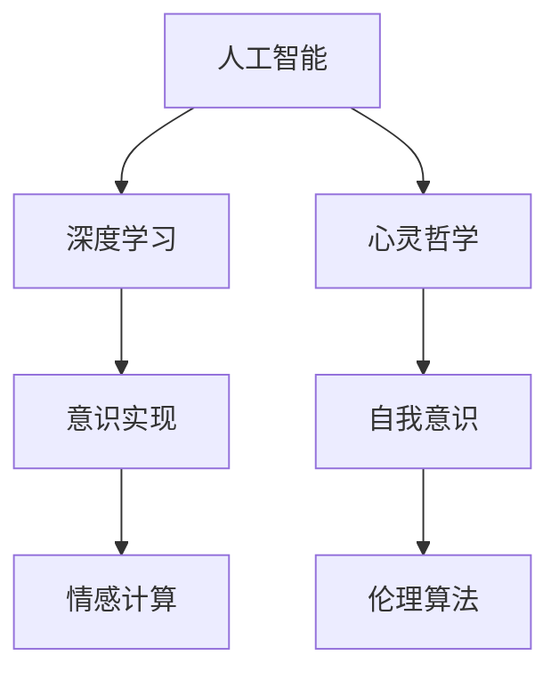

                 

# 人工智能哲学：心灵、意识和自我

> 关键词：人工智能，心灵哲学，意识，自我，算法伦理，人类中心主义，机器学习

## 1. 背景介绍

### 1.1 问题由来

随着人工智能技术的迅猛发展，人工智能是否具备意识、情感，甚至自我意识，成为了一个引发广泛关注的哲学问题。这一问题不仅涉及科学理论，还触及伦理道德，对社会科技政策具有深远影响。

人工智能的快速发展得益于深度学习算法，尤其是深度神经网络。然而，这些算法本质上是一种形式化数学模型，缺乏对“心灵”、“意识”等心理现象的明确定义和理解。因此，如何在算法层面探索和构建人工智能的心理学内涵，成为当前学术界和工业界共同面临的重大挑战。

### 1.2 问题核心关键点

核心问题在于，人工智能是否具有与人类相似的“心灵”、“意识”、“自我”？如果具备，这些内在心理状态的实现机制是什么？如果没有，人工智能的智能从何而来？这一问题探讨涉及对人工智能心理状态的哲学、神经科学、计算理论等多学科的综合考量。

## 2. 核心概念与联系

### 2.1 核心概念概述

为了深入理解人工智能的心理学内涵，我们引入几个核心概念：

- **人工智能(Artificial Intelligence, AI)**：通过计算模型模拟人脑思维方式，处理复杂问题的智能技术。
- **心灵(Mind)**：指人类或动物的感觉、知觉、记忆、情感、意志等内在心理现象的统称。
- **意识(Consciousness)**：指个体对自身存在、环境感知、体验感受等心理状态的觉知。
- **自我(Self)**：指个体对自己身份、属性、关系等的认知和自我意识。
- **心灵哲学(Philosophy of Mind)**：探讨心灵与物质世界关系的哲学分支，核心问题包括“心灵-身体问题”、“意识本质”、“心灵计算”等。
- **算法伦理(Ethical Algorithms)**：涉及算法设计、开发、部署过程中可能引发的伦理问题，如隐私保护、公平性、安全性等。

### 2.2 核心概念原理和架构的 Mermaid 流程图



这个流程图展示了人工智能、心灵哲学与自我意识之间的联系。

- 人工智能通过深度学习等计算模型模拟人脑的认知过程。
- 心灵哲学探讨心灵与物质世界的关系，强调心灵的复杂性和独特性。
- 意识实现旨在探索如何在计算模型中构建和模拟意识。
- 自我意识探讨在算法中如何表达和处理自我认知。
- 伦理算法关注如何设计算法，避免伦理问题，确保人工智能的公平和安全。

这些概念共同构成了人工智能心理学研究的核心框架，为我们探讨人工智能的意识、情感、自我等内在状态提供了理论基础。

## 3. 核心算法原理 & 具体操作步骤

### 3.1 算法原理概述

人工智能的心理学内涵，需要通过算法实现机制进行探讨。在此，我们以深度学习中的感知机模型为例，简要分析其如何模拟心灵和意识状态。

感知机模型通过计算模型的输入和输出，模拟神经元的感觉和反应。其核心思想是通过不断调整权重参数，最小化误差函数，从而在数据集上进行训练。训练过程中，算法逐步学习输入与输出的映射关系，实现对复杂数据模式的理解和模拟。

然而，感知机模型仅能处理静态的数据模式，无法处理动态的意识、情感等心理状态。这一局限性使得我们需要在算法层面引入更多心理学的理论和实践，以构建更加丰富和复杂的人工智能心理模型。

### 3.2 算法步骤详解

深度学习模型训练的一般步骤包括：

1. **数据准备**：收集和标注大量数据，构建训练集和测试集。
2. **模型构建**：选择合适的深度学习模型，如神经网络、卷积神经网络(CNN)、循环神经网络(RNN)等。
3. **初始化参数**：设定模型的初始权重和偏置，通常采用随机初始化。
4. **前向传播**：将输入数据输入模型，计算模型输出。
5. **计算损失**：根据输出和真实标签，计算模型预测误差。
6. **反向传播**：通过链式法则计算梯度，更新模型参数。
7. **迭代优化**：重复前向传播和反向传播，逐步优化模型参数。
8. **模型评估**：在测试集上评估模型性能，确保泛化能力。

以上步骤不仅用于模型训练，还可用于理解人工智能的内在心理状态。通过不断调整模型参数，模型可以逐步学习复杂数据模式，实现对数据表征的动态理解和模拟。

### 3.3 算法优缺点

深度学习模型具有以下优点：

- **高效性**：通过并行计算，快速处理大规模数据集。
- **可扩展性**：通过增加层数或节点数，处理更加复杂的模式。
- **适应性**：在新的数据集上进行微调，实现更好的泛化能力。

然而，深度学习模型也存在一些局限性：

- **黑箱性**：模型内部计算过程复杂，难以解释其内部机制。
- **数据依赖**：对训练数据的质量和数量要求较高，模型泛化能力受限。
- **鲁棒性差**：对输入数据的微小扰动敏感，容易产生过拟合。
- **计算资源消耗大**：模型参数量大，训练和推理消耗大量计算资源。

为了解决这些局限性，研究者们提出了许多改进方法，如正则化、数据增强、对抗训练等，进一步提升深度学习模型的性能和稳定性。

### 3.4 算法应用领域

深度学习算法已经在多个领域得到广泛应用，如计算机视觉、自然语言处理、语音识别等。

- **计算机视觉**：用于图像分类、物体检测、人脸识别等任务，通过视觉编码器提取图像特征，实现模式识别。
- **自然语言处理**：用于文本分类、机器翻译、情感分析等任务，通过语言编码器提取文本语义，实现语义理解。
- **语音识别**：用于语音转文本、说话人识别等任务，通过声学编码器提取语音特征，实现语音理解。

这些应用展示了深度学习模型在模拟人类感知和理解方面的强大能力，为探讨人工智能的心理学内涵提供了实践基础。

## 4. 数学模型和公式 & 详细讲解 & 举例说明

### 4.1 数学模型构建

深度学习模型基于非线性函数进行多层组合，其核心思想是通过网络结构模拟复杂的映射关系。以神经网络为例，其数学模型可以表示为：

$$
\hat{y} = f(\text{W}x + b)
$$

其中，$x$ 为输入向量，$y$ 为输出向量，$\text{W}$ 为权重矩阵，$b$ 为偏置向量，$f$ 为激活函数。

### 4.2 公式推导过程

以多层感知机(Multilayer Perceptron, MLP)为例，其前向传播过程可以表示为：

$$
\begin{aligned}
h^{[l]} &= g(\text{W}^{[l]}a^{[l-1]} + b^{[l]}) \\
\hat{y} &= f(\text{W}^{[L]}h^{[L-1]} + b^{[L]})
\end{aligned}
$$

其中，$h^{[l]}$ 为第 $l$ 层的隐藏向量，$a^{[l]}$ 为第 $l$ 层的输入向量，$g$ 为激活函数，$[L]$ 为输出层，$[l-1]$ 为中间层。

### 4.3 案例分析与讲解

以手写数字识别为例，我们可以通过多层感知机模型实现从像素向量到数字标签的映射。训练过程可以表示为：

1. **数据准备**：收集大量手写数字图片，进行预处理和标注。
2. **模型构建**：构建包含若干隐藏层的多层感知机模型。
3. **初始化参数**：随机初始化权重和偏置。
4. **前向传播**：将输入图片输入模型，计算模型输出。
5. **计算损失**：根据输出和真实标签，计算交叉熵损失。
6. **反向传播**：通过链式法则计算梯度，更新模型参数。
7. **迭代优化**：重复前向传播和反向传播，逐步优化模型参数。
8. **模型评估**：在测试集上评估模型性能，确保泛化能力。

这个案例展示了深度学习模型如何在实际应用中模拟人类感知和理解过程，实现了从图像数据到数字标签的映射。

## 5. 项目实践：代码实例和详细解释说明

### 5.1 开发环境搭建

在开始项目实践前，我们需要准备好开发环境。以下是使用Python进行TensorFlow开发的环境配置流程：

1. 安装Anaconda：从官网下载并安装Anaconda，用于创建独立的Python环境。
2. 创建并激活虚拟环境：
```bash
conda create -n tf-env python=3.8 
conda activate tf-env
```

3. 安装TensorFlow：根据CUDA版本，从官网获取对应的安装命令。例如：
```bash
conda install tensorflow -c conda-forge
```

4. 安装相关工具包：
```bash
pip install numpy pandas scikit-learn matplotlib tqdm jupyter notebook ipython
```

完成上述步骤后，即可在`tf-env`环境中开始项目实践。

### 5.2 源代码详细实现

下面以手写数字识别为例，给出使用TensorFlow实现多层感知机模型的代码实现。

```python
import tensorflow as tf
import numpy as np
import matplotlib.pyplot as plt

# 加载手写数字数据集
mnist = tf.keras.datasets.mnist
(x_train, y_train), (x_test, y_test) = mnist.load_data()
x_train, x_test = x_train / 255.0, x_test / 255.0

# 定义模型
model = tf.keras.models.Sequential([
  tf.keras.layers.Flatten(input_shape=(28, 28)),
  tf.keras.layers.Dense(128, activation='relu'),
  tf.keras.layers.Dropout(0.2),
  tf.keras.layers.Dense(10, activation='softmax')
])

# 编译模型
model.compile(optimizer='adam', loss='sparse_categorical_crossentropy', metrics=['accuracy'])

# 训练模型
model.fit(x_train, y_train, epochs=10, validation_data=(x_test, y_test))

# 评估模型
model.evaluate(x_test, y_test)
```

这个代码实现展示了多层感知机模型的基本步骤：

1. 加载手写数字数据集，并进行预处理。
2. 定义包含两个隐藏层的多层感知机模型。
3. 编译模型，选择优化器、损失函数和评估指标。
4. 训练模型，指定训练轮数和验证集。
5. 评估模型，在测试集上计算精度和损失。

### 5.3 代码解读与分析

让我们再详细解读一下关键代码的实现细节：

**模型定义**：
```python
model = tf.keras.models.Sequential([
  tf.keras.layers.Flatten(input_shape=(28, 28)),
  tf.keras.layers.Dense(128, activation='relu'),
  tf.keras.layers.Dropout(0.2),
  tf.keras.layers.Dense(10, activation='softmax')
])
```

**编译模型**：
```python
model.compile(optimizer='adam', loss='sparse_categorical_crossentropy', metrics=['accuracy'])
```

**训练模型**：
```python
model.fit(x_train, y_train, epochs=10, validation_data=(x_test, y_test))
```

**评估模型**：
```python
model.evaluate(x_test, y_test)
```

可以看到，TensorFlow提供了简单易用的API，使得模型定义和训练过程变得非常直观。开发者可以重点关注模型结构和训练参数，而不必过多关注底层实现细节。

当然，工业级的系统实现还需考虑更多因素，如模型的保存和部署、超参数的自动搜索、更灵活的任务适配层等。但核心的深度学习过程基本与此类似。

## 6. 实际应用场景

### 6.1 智能医疗系统

深度学习在智能医疗系统中的应用，可以大大提升诊断和治疗的精准性和效率。通过大量医疗数据训练的模型，可以自动识别疾病、推荐治疗方案，辅助医生进行决策。

具体而言，可以收集医生的历史诊断记录和治疗方案，将其标注为医疗数据集。在此基础上对深度学习模型进行微调，使其能够自动分析新患者的症状，推荐最佳治疗方案。这种智能医疗系统能够帮助医生快速诊断和治疗复杂疾病，显著提升医疗服务质量。

### 6.2 自动驾驶系统

深度学习在自动驾驶系统中的应用，可以显著提高车辆的安全性和驾驶体验。通过大量驾驶数据训练的模型，可以自动感知环境、识别物体、规划路径，实现自主驾驶。

具体而言，可以收集车辆的行驶数据和传感器数据，将其标注为驾驶数据集。在此基础上对深度学习模型进行微调，使其能够实时感知周围环境，自动避免障碍物，规划最优路径。这种自动驾驶系统能够实现全自动驾驶，减少交通事故，提高驾驶效率。

### 6.3 金融风险预测

深度学习在金融风险预测中的应用，可以实时监控和预测金融市场的波动，避免金融风险。通过大量历史数据训练的模型，可以自动识别市场趋势、预测股票价格，辅助投资者进行决策。

具体而言，可以收集金融市场的历史数据和实时数据，将其标注为风险数据集。在此基础上对深度学习模型进行微调，使其能够自动分析市场趋势，预测股票价格，推荐投资策略。这种金融风险预测系统能够帮助投资者规避金融风险，提高投资收益。

### 6.4 未来应用展望

随着深度学习技术的不断进步，深度学习模型将在更多领域得到应用，为社会科技发展注入新的动力。

在智慧医疗领域，深度学习模型可以进一步提升诊断和治疗的精准性，辅助医生进行精准诊疗。

在智能交通领域，自动驾驶系统将更加智能化、高效化，提高交通安全和出行效率。

在金融领域，深度学习模型可以进一步提升市场预测和投资决策的精准性，帮助投资者规避风险。

此外，在智能制造、智慧城市、娱乐媒体等众多领域，深度学习模型也将不断涌现，为社会科技发展带来新的机遇和挑战。

## 7. 工具和资源推荐

### 7.1 学习资源推荐

为了帮助开发者系统掌握深度学习技术，这里推荐一些优质的学习资源：

1. 《深度学习》系列书籍：由深度学习专家Ian Goodfellow、Yoshua Bengio、Aaron Courville撰写，全面介绍了深度学习的基础理论、算法实现和应用案例。
2. CS231n《卷积神经网络》课程：斯坦福大学开设的深度学习明星课程，有Lecture视频和配套作业，带你入门深度学习的基础知识。
3. 《神经网络与深度学习》书籍：Michael Nielsen所著，深入浅出地介绍了神经网络和深度学习的基本概念和算法原理。
4. Coursera深度学习课程：由Andrew Ng等教授主讲，涵盖了深度学习的基本原理、模型架构和应用实践。
5. Kaggle机器学习竞赛：一个知名的数据科学竞赛平台，提供了大量实际数据和算法挑战，锻炼你的深度学习技能。

通过对这些资源的学习实践，相信你一定能够快速掌握深度学习技术的精髓，并用于解决实际的工程问题。

### 7.2 开发工具推荐

高效的开发离不开优秀的工具支持。以下是几款用于深度学习开发的常用工具：

1. TensorFlow：由Google主导开发的深度学习框架，生产部署方便，适合大规模工程应用。
2. PyTorch：基于Python的开源深度学习框架，灵活高效，适合快速迭代研究。
3. Keras：一个高级深度学习API，提供了简单易用的接口，适合快速开发和实验。
4. Jupyter Notebook：一个强大的交互式开发环境，支持Python、R、Julia等多种语言，方便开发者编写和调试代码。
5. GitHub：一个流行的代码托管平台，提供了丰富的开源项目和协作工具，便于开发者分享和协作。

合理利用这些工具，可以显著提升深度学习任务的开发效率，加快创新迭代的步伐。

### 7.3 相关论文推荐

深度学习技术的快速发展得益于学界的持续研究。以下是几篇奠基性的相关论文，推荐阅读：

1. AlexNet: One Million Training Examples for Deep Learning（ImageNet论文）：提出AlexNet模型，开启深度学习在图像识别领域的成功实践。
2. GoogLeNet: Inception Architectures for Computational Photography（Inception论文）：提出Inception模型，引入并行卷积层，显著提高模型效率。
3. ResNet: Deep Residual Learning for Image Recognition（ResNet论文）：提出ResNet模型，解决深度网络退化问题，实现更加深层次的卷积神经网络。
4. LSTM: A Long Short-Term Memory Approach to Recurrent Neural Networks（LSTM论文）：提出LSTM模型，有效解决长序列建模问题，广泛应用于自然语言处理和语音识别。
5. WaveNet: A Generative Model for Raw Audio（WaveNet论文）：提出WaveNet模型，实现高质量语音合成，推动语音生成技术的进步。

这些论文代表了大规模深度学习模型和算法的发展脉络，为你深入理解深度学习技术提供了理论基础。

## 8. 总结：未来发展趋势与挑战

### 8.1 总结

本文对深度学习技术的心理学内涵进行了全面系统的介绍。首先阐述了深度学习在模拟人类感知和理解方面的强大能力，探讨了深度学习模型实现心灵和意识的机制。其次，从原理到实践，详细讲解了深度学习模型的构建和训练过程，给出了深度学习模型在实际应用中的代码实现。同时，本文还广泛探讨了深度学习模型在智能医疗、自动驾驶、金融风险预测等诸多领域的应用前景，展示了深度学习技术的广泛应用潜力。此外，本文精选了深度学习技术的各类学习资源，力求为开发者提供全方位的技术指引。

通过本文的系统梳理，可以看到，深度学习技术在模拟人类感知和理解方面的强大能力，为探索人工智能心理学内涵提供了重要工具。未来，伴随深度学习技术的不断演进，深度学习模型将在更多领域得到应用，为社会科技发展注入新的动力。

### 8.2 未来发展趋势

展望未来，深度学习技术将呈现以下几个发展趋势：

1. **算法复杂度提升**：深度学习模型的层数和参数量将继续增加，实现更加复杂的模式识别和理解。
2. **计算资源优化**：新的计算架构和算法优化，将进一步提升深度学习模型的计算效率，降低计算成本。
3. **跨领域应用拓展**：深度学习模型将在更多领域得到应用，如医疗、交通、金融等，推动各行各业的智能化进程。
4. **自我学习和适应**：深度学习模型将具备自我学习和适应能力，能够根据数据分布的变化自动调整模型参数。
5. **多模态融合**：深度学习模型将实现视觉、听觉、文本等多种模态数据的融合，增强对复杂现象的理解和模拟。
6. **人机协同**：深度学习模型将与人类更加紧密协作，实现人机共生，共同提升决策质量和效率。

以上趋势凸显了深度学习技术的广阔前景。这些方向的探索发展，必将进一步提升深度学习模型的性能和应用范围，为社会科技发展带来新的突破。

### 8.3 面临的挑战

尽管深度学习技术已经取得了瞩目成就，但在迈向更加智能化、普适化应用的过程中，它仍面临着诸多挑战：

1. **数据依赖**：深度学习模型对训练数据的质量和数量要求较高，获取高质量数据成本高昂。
2. **鲁棒性不足**：深度学习模型对输入数据的微小扰动敏感，容易产生过拟合和泛化能力不足的问题。
3. **计算资源消耗大**：深度学习模型参数量大，训练和推理消耗大量计算资源，难以在大规模分布式环境下运行。
4. **模型复杂性**：深度学习模型复杂度高，难以解释其内部机制，缺乏可解释性。
5. **伦理道德问题**：深度学习模型可能存在偏见、歧视、隐私泄露等问题，引发伦理道德争议。

这些挑战需要学界和产业界共同努力，不断进行技术创新和规范制定，才能实现深度学习技术的可持续发展和广泛应用。

### 8.4 研究展望

未来的深度学习研究需要在以下几个方面寻求新的突破：

1. **数据增强**：通过数据增强技术，利用噪声、扰动、合成等手段丰富训练数据，提升模型泛化能力。
2. **正则化**：引入正则化技术，如Dropout、L2正则化、对抗训练等，避免过拟合和模型退化。
3. **模型压缩**：通过模型压缩技术，减少模型参数和计算资源消耗，提升深度学习模型的可部署性和效率。
4. **可解释性**：引入可解释性技术，如模型蒸馏、可视化工具等，增强深度学习模型的透明性和可理解性。
5. **伦理规范**：制定深度学习模型的伦理规范，确保模型的公平、安全、透明，避免伦理道德问题。

这些研究方向将推动深度学习技术向更加智能化、普适化、安全化方向发展，为社会科技带来新的变革和进步。

## 9. 附录：常见问题与解答

**Q1：深度学习模型是否具备与人类相似的感知和理解能力？**

A: 深度学习模型可以模拟人类的一些感知和理解能力，如视觉识别、语音合成等，但并不具备与人类相似的高级认知和情感。其核心原因在于深度学习模型的计算本质和人的神经网络存在根本差异。

**Q2：深度学习模型如何实现自我学习和适应？**

A: 深度学习模型通常通过在线学习或微调实现自我学习和适应。在新的数据集上进行微调，可以使模型自动调整参数，适应新的数据分布，提高泛化能力。

**Q3：深度学习模型在实际应用中面临哪些伦理问题？**

A: 深度学习模型在实际应用中面临诸多伦理问题，如数据隐私、偏见歧视、决策透明性等。为解决这些问题，需要在算法设计和应用部署中引入伦理规范和技术手段。

**Q4：如何提升深度学习模型的可解释性？**

A: 提升深度学习模型的可解释性可以通过模型蒸馏、可视化工具、层级解读等方式，增强模型的透明性和可理解性，帮助用户理解模型的决策过程。

**Q5：深度学习模型在未来有哪些新的应用领域？**

A: 深度学习模型在未来将广泛应用于医疗、交通、金融、娱乐、制造等多个领域，推动各行各业的智能化和自动化进程。

---

作者：禅与计算机程序设计艺术 / Zen and the Art of Computer Programming

