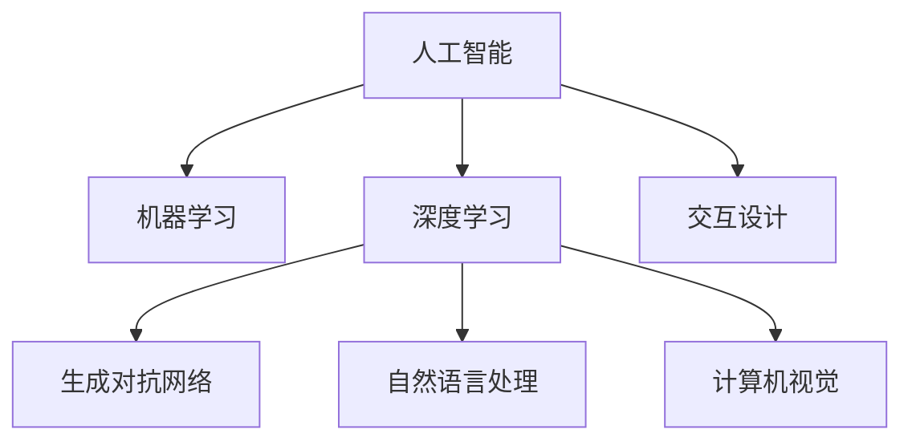

                 

# 人工智能在创意产业中的应用：辅助设计与创作

## 1. 背景介绍

### 1.1 问题由来
人工智能(AI)正以惊人的速度渗透各行各业，成为创新和发展的核心驱动力。创意产业，包括设计、艺术、媒体、游戏等，是AI技术应用的重要领域之一。AI不仅能够加速创意过程，提供设计灵感，还能增强创意作品的传播与互动体验，带来全新的价值创造方式。

创意产业的特点在于其高度的个性化、多样化和即时性。每个项目都是独一无二的，需要在短时间内产生高质量的创意成果。传统的设计与创作过程往往依赖设计师的经验和灵感，耗时长、成本高，难以满足快速变化的市场需求。AI技术的引入，为创意产业带来了革命性的变革，通过数据驱动和算法优化，极大地提升了设计和创作的效率和质量。

### 1.2 问题核心关键点
AI在创意产业中的应用主要集中在以下几个关键点：

1. **设计辅助**：利用AI技术分析用户需求和市场趋势，辅助设计师进行设计创意和方案优化。
2. **创意生成**：通过深度学习和生成模型，自动生成创意内容，如图像、音乐、视频等，提供创新灵感。
3. **交互设计**：利用自然语言处理和计算机视觉技术，增强创意作品与用户的互动体验，实现人机协同创作。
4. **版权保护**：运用AI技术检测和防止侵权行为，保护创意作品免受非法复制和传播。

AI的介入不仅提高了创作效率和作品质量，还开创了更多个性化和交互式的设计方式，推动创意产业向智能化、自动化、个性化方向发展。

## 2. 核心概念与联系

### 2.1 核心概念概述

为更好地理解AI在创意产业中的设计辅助应用，本节将介绍几个关键概念及其相互关系：

- **人工智能(AI)**：通过算法、数据和计算能力，使计算机系统能够模拟人类智能行为的技术。
- **机器学习(ML)**：AI的一个子领域，利用数据和算法训练模型，使其能够进行预测、分类、生成等任务。
- **深度学习(Deep Learning, DL)**：一种机器学习方法，通过多层神经网络模拟人类大脑的结构和功能，用于处理大规模非结构化数据。
- **生成对抗网络(GAN)**：一种深度学习技术，通过两个神经网络相互竞争，生成高质量的合成数据。
- **自然语言处理(NLP)**：AI的一个分支，专注于使计算机理解和处理自然语言，支持文本生成、语音识别、情感分析等任务。
- **计算机视觉(CV)**：AI的另一分支，涉及图像和视频数据的处理与分析，支持图像识别、物体检测、场景理解等任务。
- **交互设计(UI/UX)**：设计学科的一个分支，关注人机交互的界面和用户体验，通过AI技术优化界面设计。

这些概念之间的关系可以通过以下Mermaid流程图来展示：



这个流程图展示了AI在创意产业中的核心概念及其相互联系：

1. 人工智能是综合性的概念，包含多个子领域。
2. 机器学习和深度学习是AI的两个主要技术支柱，用于处理复杂的数据和模式识别。
3. 生成对抗网络、自然语言处理和计算机视觉是AI在不同领域的具体应用，各有侧重点。
4. 交互设计是AI与用户体验相结合的产物，提升了人机交互的效率和质量。

## 3. 核心算法原理 & 具体操作步骤
### 3.1 算法原理概述

AI在创意产业中的应用主要基于以下算法原理：

1. **图像生成和设计辅助**：利用生成对抗网络(GAN)和变分自编码器(VAE)等模型，从少量样本中学习到数据的生成分布，生成高质量的图像和设计草图。
2. **文本生成和创意写作**：通过循环神经网络(RNN)和Transformer模型，利用大量文本数据训练语言模型，自动生成文本和创意作品。
3. **音频生成和音乐创作**：运用生成对抗网络(GAN)和波形生成模型，生成具有一定风格和情感的音乐和声音。
4. **视频编辑和剪辑**：结合计算机视觉和自然语言处理技术，通过语义理解和自动剪辑，生成创意视频内容。

这些算法的核心在于数据驱动和模型优化，通过大量的数据训练，使AI模型能够模拟人类的创意过程，产生符合人类审美和需求的作品。

### 3.2 算法步骤详解

AI在创意产业中的应用涉及多个步骤，一般包括以下关键环节：

**Step 1: 数据收集与预处理**
- 收集创意产业相关的数据，如设计作品、用户评论、市场趋势等。
- 对数据进行清洗和预处理，如去除噪声、归一化、特征提取等，准备数据输入模型。

**Step 2: 模型选择与训练**
- 根据具体应用场景，选择合适的算法模型，如GAN、VAE、RNN、Transformer等。
- 利用准备好的数据集，训练模型参数，调整超参数以优化模型性能。

**Step 3: 模型评估与优化**
- 在验证集上评估模型性能，如生成图像的质量、文本的相关性、音频的情感等。
- 根据评估结果调整模型结构、超参数，进行模型优化。

**Step 4: 模型应用与优化**
- 将训练好的模型应用于实际设计或创作任务中，提供辅助设计、创意生成等。
- 根据实际应用效果，进一步迭代优化模型，提升模型性能。

**Step 5: 人机交互与反馈**
- 设计交互界面，使得AI模型能够与用户进行实时互动，获取用户反馈。
- 根据用户反馈调整模型输出，提升创意作品的质量和满意度。

### 3.3 算法优缺点

AI在创意产业中的应用具有以下优点：

1. **高效性**：AI可以24小时不间断地处理大量数据，快速生成创意作品，极大地提高了设计效率。
2. **多样性**：AI能够生成各种风格和类型的创意内容，提供多种创意方案供选择。
3. **个性化**：利用用户数据，AI能够生成高度个性化的创意作品，满足不同用户的需求。

同时，AI在创意产业中也有一定的局限性：

1. **缺乏情感理解**：当前的AI模型虽然可以生成具有一定美感和结构的设计作品，但很难理解作品的情感和文化内涵。
2. **依赖高质量数据**：AI模型的性能依赖于高质量的数据输入，数据的不足可能导致创意作品质量不高。
3. **道德与版权问题**：AI生成的创意作品可能涉及版权争议，如何保护创意作品的原创性和知识产权，仍需进一步探讨。

### 3.4 算法应用领域

AI在创意产业中的应用主要包括以下几个领域：

- **工业设计**：利用AI生成设计草图和模型，辅助设计师进行方案优化。
- **室内设计**：通过图像生成模型生成室内设计效果图，提供设计灵感。
- **游戏开发**：利用AI生成游戏角色、场景和任务，增强游戏的互动性和趣味性。
- **影视制作**：结合计算机视觉和自然语言处理技术，自动剪辑和优化影视作品。
- **艺术创作**：通过图像生成和音乐生成模型，创作艺术作品和音乐作品。
- **广告设计**：生成创意广告素材，提升广告的吸引力和效果。

## 4. 数学模型和公式 & 详细讲解  
### 4.1 数学模型构建

AI在创意产业中的应用涉及多个数学模型，这里以图像生成和设计辅助为例，展示其数学模型构建过程。

**图像生成模型**：
- **生成对抗网络(GAN)**：由生成器和判别器两个神经网络组成，通过对抗训练生成高质量图像。
- **变分自编码器(VAE)**：利用变分推断方法，从少量样本中学习数据分布，生成新样本。

**设计辅助模型**：
- **回归模型**：用于预测设计参数，如颜色、形状等，辅助设计师进行方案优化。
- **聚类模型**：用于对设计数据进行分类，发现设计趋势和模式，提供设计灵感。

### 4.2 公式推导过程

以下我们以图像生成模型GAN为例，展示其核心公式的推导过程。

假设生成器和判别器分别为 $G$ 和 $D$，生成器 $G$ 的输入为噪声向量 $\mathbf{z}$，输出为图像 $\mathbf{x}$，判别器 $D$ 的输入为图像 $\mathbf{x}$，输出为真实性概率 $y$。则GAN的目标函数为：

$$
\min_G \max_D V(G,D) = \min_G \max_D \mathbb{E}_{\mathbf{z}} [D(G(\mathbf{z}))]
$$

其中 $V(G,D)$ 为生成器 $G$ 和判别器 $D$ 的联合损失函数。

判别器的损失函数为：

$$
\mathcal{L}_D = -\mathbb{E}_{\mathbf{x}} [\log D(\mathbf{x})] - \mathbb{E}_{\mathbf{z}} [\log(1-D(G(\mathbf{z})))
$$

生成器的损失函数为：

$$
\mathcal{L}_G = -\mathbb{E}_{\mathbf{z}} [\log D(G(\mathbf{z}))
$$

通过交替优化生成器和判别器，使得生成器生成的图像逼近真实图像，判别器能够准确区分真实图像和生成图像，从而生成高质量的图像。

### 4.3 案例分析与讲解

**案例：基于GAN的室内设计效果图生成**
- 收集室内设计数据集，如家具、装饰品等，生成对应的3D模型。
- 训练GAN模型，生成新的室内设计效果图。
- 利用用户反馈调整模型参数，生成符合用户需求的设计方案。

## 5. 项目实践：代码实例和详细解释说明
### 5.1 开发环境搭建

在进行创意产业的AI应用开发前，我们需要准备好开发环境。以下是使用Python进行TensorFlow和Keras开发的配置流程：

1. 安装Anaconda：从官网下载并安装Anaconda，用于创建独立的Python环境。

2. 创建并激活虚拟环境：
```bash
conda create -n ai-design python=3.8 
conda activate ai-design
```

3. 安装TensorFlow和Keras：
```bash
conda install tensorflow==2.6
conda install keras==2.6.0
```

4. 安装各类工具包：
```bash
pip install numpy pandas scikit-learn matplotlib tqdm jupyter notebook ipython
```

完成上述步骤后，即可在`ai-design`环境中开始项目实践。

### 5.2 源代码详细实现

下面我们以基于GAN的室内设计效果图生成为例，给出TensorFlow和Keras代码实现。

首先，定义数据集和数据增强函数：

```python
import tensorflow as tf
from tensorflow.keras.preprocessing.image import ImageDataGenerator

train_datagen = ImageDataGenerator(
    rescale=1./255,
    rotation_range=30,
    width_shift_range=0.1,
    height_shift_range=0.1,
    shear_range=0.2,
    zoom_range=0.2,
    horizontal_flip=True,
    fill_mode='nearest'
)
```

然后，加载和预处理数据：

```python
train_generator = train_datagen.flow_from_directory(
    'path/to/train/directory',
    target_size=(256, 256),
    batch_size=32,
    class_mode='binary'
)
```

接着，定义生成器和判别器：

```python
from tensorflow.keras.layers import Input, Dense, Reshape, Flatten, BatchNormalization
from tensorflow.keras.models import Model
from tensorflow.keras.optimizers import Adam

def make_generator(z_dim, img_shape):
    z = Input(shape=(z_dim,))
    x = Dense(256 * 8 * 8)(z)
    x = BatchNormalization()(x)
    x = tf.reshape(x, (8, 8, 256))
    x = Conv2DTranspose(128, 4, strides=2, padding='same')(x)
    x = BatchNormalization()(x)
    x = tf.reshape(x, (16, 16, 128))
    x = Conv2DTranspose(64, 4, strides=2, padding='same')(x)
    x = BatchNormalization()(x)
    x = tf.reshape(x, (32, 32, 64))
    x = Conv2DTranspose(3, 4, strides=2, padding='same', activation='tanh')(x)
    return Model(z, x)

def make_discriminator(img_shape):
    x = Input(shape=img_shape)
    x = Conv2D(64, 4, strides=2, padding='same')(x)
    x = LeakyReLU(alpha=0.2)(x)
    x = Conv2D(128, 4, strides=2, padding='same')(x)
    x = LeakyReLU(alpha=0.2)(x)
    x = Flatten()(x)
    x = Dense(1, activation='sigmoid')(x)
    return Model(x, x)
```

最后，定义训练函数：

```python
def train(model, d_model, z_dim, epochs):
    for epoch in range(epochs):
        for batch in train_generator:
            real_images = batch[0]
            fake_images = model.predict(z_dim)
            d_real_loss = d_model.train_on_batch(real_images, real_images)
            d_fake_loss = d_model.train_on_batch(fake_images, np.zeros_like(real_images))
            g_loss = model.train_on_batch(np.zeros_like(real_images), real_images)
        print(f'Epoch {epoch+1}, d_real_loss: {d_real_loss:.4f}, d_fake_loss: {d_fake_loss:.4f}, g_loss: {g_loss:.4f}')
```

使用上述代码，可以训练基于GAN的室内设计效果图生成模型。

### 5.3 代码解读与分析

让我们再详细解读一下关键代码的实现细节：

**数据增强函数**：
- 定义了图像数据增强器，包括缩放、旋转、平移等操作，用于扩充训练集数据的多样性，提高模型的泛化能力。

**数据加载与预处理**：
- 使用`flow_from_directory`方法加载数据集，并进行归一化、填充等预处理，确保输入数据的一致性和稳定性。

**生成器和判别器定义**：
- 生成器定义了从噪声向量生成图像的过程，包括多个卷积和反卷积层，以及批量归一化等技术。
- 判别器定义了从图像判断真实性的过程，包括多个卷积和全连接层，以及LeakyReLU激活函数。

**训练函数**：
- 通过交替训练生成器和判别器，计算并输出损失函数值，指导模型参数的更新。

## 6. 实际应用场景
### 6.1 室内设计效果图生成

基于GAN的室内设计效果图生成，可以极大地加速室内设计师的工作效率，提供多样化的设计方案供选择。在实际应用中，设计师只需提供设计需求和设计风格，AI便能自动生成多个方案供比较，快速迭代优化设计效果。

例如，某室内设计师想要设计一个现代风格的客厅，只需要输入“现代风格客厅设计”，AI便能自动生成多个客厅效果图，展示不同的布局、颜色和家具搭配，供设计师选择和优化。这种自动化的设计辅助，不仅提高了设计师的创意效率，还为设计提供了更多灵感和可能性。

### 6.2 游戏角色设计

AI在游戏设计中的应用也十分广泛。通过GAN等生成模型，自动生成各种角色和场景，为游戏开发者提供丰富的设计素材。

例如，某游戏开发者需要设计一款奇幻世界中的角色，只需要输入“奇幻角色”，AI便能自动生成多种风格的角色形象，包括战士、法师、精灵等，供开发者选择和优化。AI生成的角色不仅多样化和美观，还能提供一定的创作灵感，帮助开发者快速迭代出高质量的游戏角色设计。

### 6.3 影视作品剪辑与特效

AI在影视制作中的应用同样重要。通过计算机视觉和自然语言处理技术，自动剪辑和优化影视作品，提高制作效率和作品质量。

例如，某影视制作团队需要剪辑一段视频，只需要输入“剪辑视频”，AI便能自动进行视频剪辑和特效处理，生成高质量的视频内容。AI还能根据用户反馈，自动调整剪辑方案，优化视频效果，满足不同用户的需求。

### 6.4 未来应用展望

随着AI技术的不断发展，其在创意产业中的应用也将更加广泛和深入。未来，AI将与创意产业的各个环节进行深度融合，推动创意产业的智能化、自动化和个性化发展。

**智能化设计**：通过AI技术与设计师的深度合作，提供更智能、高效的创作工具，助力设计师实现更高效、更有创意的设计过程。

**自动化创作**：AI将进一步融入创意创作的各个环节，从素材准备、创意生成到后期处理，全面提升创作效率，降低人工成本。

**个性化体验**：AI将利用大数据分析和个性化推荐技术，为创意作品提供更精准的推广和传播策略，提升用户互动体验。

**跨领域融合**：AI将与其他领域的先进技术进行深度融合，如AR/VR、区块链等，拓展创意产业的应用场景，提升创意作品的创新性和实用性。

## 7. 工具和资源推荐
### 7.1 学习资源推荐

为了帮助开发者系统掌握AI在创意产业中的应用，这里推荐一些优质的学习资源：

1. 《深度学习》（Ian Goodfellow著）：深度学习的经典教材，全面介绍了深度学习的基本原理和应用。
2. 《计算机视觉：算法与应用》（Richard Szeliski著）：计算机视觉领域的经典教材，详细讲解了图像处理和计算机视觉技术。
3. 《自然语言处理综述》（Yoshua Bengio, Yann LeCun, Geoffrey Hinton等著）：自然语言处理领域的经典综述，介绍了NLP技术的最新进展。
4. Coursera《深度学习专项课程》：斯坦福大学和DeepLearning.AI联合推出的深度学习课程，涵盖从基础到高级的多个主题。
5. TensorFlow官方文档：TensorFlow的官方文档，提供了详细的API文档和代码示例，是学习TensorFlow的重要资源。

通过对这些资源的学习实践，相信你一定能够快速掌握AI在创意产业中的设计辅助应用，并用于解决实际的创意设计问题。

### 7.2 开发工具推荐

高效的开发离不开优秀的工具支持。以下是几款用于AI在创意产业中应用的开发工具：

1. TensorFlow：基于Python的开源深度学习框架，提供强大的计算图和自动微分功能，适合复杂的模型训练和推理。
2. Keras：基于TensorFlow的高级API，提供了简单易用的接口，适合快速原型开发和模型训练。
3. PyTorch：基于Python的开源深度学习框架，提供灵活的动态计算图，适合研究和原型开发。
4. Blender：开源的3D创作软件，支持各种3D建模、渲染和动画制作，与AI模型进行深度集成。
5. Unity：流行的游戏引擎，支持游戏设计和开发，结合AI技术生成游戏内容。

合理利用这些工具，可以显著提升AI在创意产业中应用的开发效率，加快创新迭代的步伐。

### 7.3 相关论文推荐

AI在创意产业中的应用源于学界的持续研究。以下是几篇奠基性的相关论文，推荐阅读：

1. Generative Adversarial Nets（GAN的原始论文）：Ian Goodfellow等著，提出GAN模型，通过对抗训练生成高质量的合成数据。
2. ImageNet Classification with Deep Convolutional Neural Networks：Alex Krizhevsky等著，提出卷积神经网络(CNN)，在图像分类任务上取得突破性进展。
3. Sequence to Sequence Learning with Neural Networks：Ilya Sutskever等著，提出序列到序列模型(Seq2Seq)，实现自动翻译和文本生成。
4. Deep Learning for Music Generation：Shaoqi Shen等著，提出基于深度学习的音乐生成模型，生成具有一定风格和情感的音乐。
5. GANs Trained by a Two-Generator Adversarial Network Can Generate Images of Anything and Impossible Things Too：Zhang等著，提出两生成器对抗网络(2-GAN)，生成更加多样和逼真的合成数据。

这些论文代表了大语言模型微调技术的发展脉络。通过学习这些前沿成果，可以帮助研究者把握学科前进方向，激发更多的创新灵感。

## 8. 总结：未来发展趋势与挑战
### 8.1 总结

本文对AI在创意产业中的设计辅助应用进行了全面系统的介绍。首先阐述了AI技术在创意产业中的背景和应用前景，明确了设计辅助在提高创意效率和质量方面的独特价值。其次，从原理到实践，详细讲解了GAN模型等关键算法，并给出了室内设计效果图生成的代码实例。同时，本文还探讨了AI在创意产业中的应用场景，展示了AI技术在多个创意领域的广阔应用空间。

通过本文的系统梳理，可以看到，AI技术在创意产业中的应用正在成为行业发展的新趋势，极大地提高了创意工作的效率和质量，推动创意产业向智能化、自动化、个性化方向发展。未来，伴随AI技术的进一步突破，AI将在创意产业中发挥更加重要的作用，助力创意产业迈向新的高峰。

### 8.2 未来发展趋势

展望未来，AI在创意产业中的应用将呈现以下几个发展趋势：

1. **智能化设计**：AI将与设计师进行更深入的合作，提供智能化的设计工具和建议，助力设计师实现更高效、更有创意的设计过程。
2. **自动化创作**：AI将全面融入创意创作的各个环节，从素材准备、创意生成到后期处理，全面提升创作效率，降低人工成本。
3. **个性化体验**：AI将利用大数据分析和个性化推荐技术，为创意作品提供更精准的推广和传播策略，提升用户互动体验。
4. **跨领域融合**：AI将与其他领域的先进技术进行深度融合，如AR/VR、区块链等，拓展创意产业的应用场景，提升创意作品的创新性和实用性。

### 8.3 面临的挑战

尽管AI在创意产业中的应用已经取得显著进展，但在迈向更加智能化、普适化应用的过程中，仍面临诸多挑战：

1. **数据依赖**：AI模型的性能依赖于高质量的数据输入，数据的不足可能导致创意作品质量不高。如何获取和处理高质量的数据，仍需进一步探讨。
2. **版权问题**：AI生成的创意作品可能涉及版权争议，如何保护创意作品的原创性和知识产权，仍需进一步探讨。
3. **情感理解**：当前的AI模型虽然可以生成具有一定美感和结构的设计作品，但很难理解作品的情感和文化内涵。如何赋予AI更强的情感理解能力，仍需进一步探讨。
4. **可解释性**：AI模型的决策过程通常缺乏可解释性，难以对其推理逻辑进行分析和调试。如何增强AI模型的可解释性，仍需进一步探讨。
5. **交互设计**：AI与用户的互动设计仍需进一步优化，如何提升用户界面的人机交互体验，仍需进一步探讨。

### 8.4 研究展望

面对AI在创意产业中的应用所面临的挑战，未来的研究需要在以下几个方面寻求新的突破：

1. **高质量数据获取**：通过数据增强、数据合成等技术，生成高质量的训练数据，提高AI模型的性能。
2. **版权保护机制**：建立完善的版权保护机制，明确AI生成作品的版权归属和使用限制，保护创意作品的知识产权。
3. **情感理解技术**：通过引入情感分析、情感生成等技术，提升AI模型的情感理解能力，创作出更具情感和文化内涵的创意作品。
4. **可解释性增强**：通过可解释性研究，解释AI模型的决策过程，提升模型的透明性和可信度。
5. **交互设计优化**：通过交互设计研究，提升用户界面的人机交互体验，提供更智能、更自然的交互方式。

这些研究方向的探索，必将引领AI在创意产业中的应用向更深层次发展，为创意产业带来更多创新和价值。面向未来，AI将在创意产业中发挥更加重要的作用，助力创意产业迈向新的高峰。

## 9. 附录：常见问题与解答

**Q1：AI在创意产业中的应用是否会取代设计师的工作？**

A: AI技术虽然可以提供设计辅助和自动化创作，但无法完全取代设计师的创造力和情感表达。AI更多的是作为工具，提高设计师的工作效率，帮助设计师实现更高效、更有创意的设计过程。设计师的灵感和创意仍然是不可替代的。

**Q2：如何选择合适的AI模型进行创意设计？**

A: 选择合适的AI模型需要考虑多个因素，包括任务的复杂度、数据的类型和数量、模型的可解释性等。对于简单任务，可以选择轻量级模型，如CNN、RNN等；对于复杂任务，可以选择高性能模型，如GAN、VAE等。同时，模型的可解释性也是重要的考量因素，需要根据具体需求选择适合的模型。

**Q3：AI在创意产业中的应用是否存在版权争议？**

A: AI生成的创意作品可能涉及版权争议，需要明确作品的原作者和创作过程。如何保护创意作品的原创性和知识产权，仍然需要进一步探讨。建议在使用AI技术时，明确作品的版权归属和使用限制，确保版权的合法性和合理性。

**Q4：AI在创意产业中的应用是否会降低创意作品的质量？**

A: AI生成的创意作品的质量取决于数据输入和模型训练的效果。如果数据质量不高，模型训练不足，生成的创意作品可能质量不高。因此，需要在数据获取、模型训练和模型优化等方面进行深入研究，提高AI生成的创意作品的质量。

**Q5：AI在创意产业中的应用是否需要高昂的算力投入？**

A: AI在创意产业中的应用确实需要一定的算力投入，尤其是对于大模型和高性能模型。但随着AI技术的不断进步和算力资源的不断丰富，AI在创意产业中的应用成本正在逐渐降低。通过优化算法、使用高效的硬件设备等方法，可以有效降低算力成本，提高AI应用的可行性和普及度。

这些常见问题的解答，可以帮助开发者更好地理解AI在创意产业中的应用，掌握相关技术和工具，解决实际应用中的问题。

