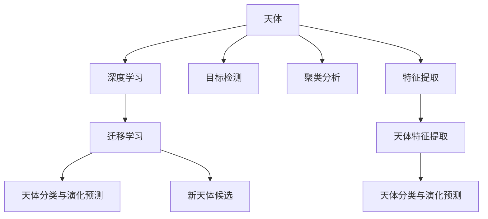

                 

# 人工智能在天文学中的应用：发现新天体

## 1. 背景介绍

### 1.1 问题由来
天文学是人类探索宇宙奥秘的重要领域，从天体物理学到宇宙学，从行星研究到恒星演化，从星系分布到暗物质探索，都蕴含着无尽的知识和发现的潜力。然而，传统的天文观测和数据分析手段往往受到观测设备、数据处理能力的限制，难以应对复杂的宇宙现象和海量数据。人工智能(AI)技术，特别是深度学习的发展，为天文学带来了新的可能性。

### 1.2 问题核心关键点
天文学中，新天体的发现是极其重要且极具挑战性的任务。传统上，这一过程主要依赖于人工分析和人工标注，消耗大量时间和精力。而人工智能，尤其是机器学习和深度学习技术，为天文学家提供了一种高效、自动化的新方法，可以快速分析海量数据，识别出潜在的新天体，并预测其物理性质和演化规律。

人工智能在天文学中的应用主要包括以下几个关键点：
1. **数据处理与预处理**：包括图像处理、光谱分析、时序数据处理等。
2. **天体识别**：利用图像分类、目标检测等技术自动识别和标注天体。
3. **新天体候选**：通过模式识别、聚类分析等技术从海量数据中筛选出潜在的新天体。
4. **天体特征提取**：提取天体的物理特征，如大小、速度、光谱特征等。
5. **天体分类与演化预测**：基于提取的特征，使用分类器或回归模型预测天体的分类和演化轨迹。

这些关键点构成了人工智能在天文学中发现新天体的基本流程，本文将详细探讨这些核心概念和技术实现。

## 2. 核心概念与联系

### 2.1 核心概念概述

为了更好地理解人工智能在天文学中的应用，本文将介绍几个核心概念：

- **天体**：天文学中的研究对象，包括但不限于恒星、行星、卫星、小行星、彗星等。
- **深度学习**：一种基于神经网络的机器学习技术，能够从数据中自动学习特征，具有强大的模式识别能力。
- **目标检测**：深度学习中的一种任务，用于在图像或视频中识别出感兴趣的目标对象。
- **迁移学习**：一种机器学习范式，将一个任务学到的知识迁移到另一个相关但不同的任务上。
- **聚类分析**：一种无监督学习技术，用于将数据分成不同的组，发现数据中的内在结构。
- **特征提取**：从原始数据中提取出对任务有帮助的特征，是许多机器学习算法的基础。

这些核心概念之间的逻辑关系可以通过以下Mermaid流程图来展示：



这个流程图展示了大规模天文学数据处理和分析的关键步骤，以及如何利用深度学习技术提升新天体发现的效率和准确性。

## 3. 核心算法原理 & 具体操作步骤
### 3.1 算法原理概述

人工智能在天文学中发现新天体的核心算法原理基于深度学习和迁移学习的思想。具体来说，包括以下几个关键步骤：

1. **数据采集与预处理**：收集和预处理各种类型的天文学数据，包括光学图像、光谱数据、时间序列数据等。
2. **深度学习模型的选择与训练**：选择适当的深度学习模型，如卷积神经网络(CNN)、循环神经网络(RNN)、Transformer等，并在大量标注数据上进行训练。
3. **目标检测与识别**：利用目标检测算法在图像中识别出潜在的天体。
4. **特征提取与聚类分析**：提取天体的物理特征，使用聚类算法对天体进行分组，识别出潜在的新天体候选。
5. **分类与演化预测**：基于提取的特征，使用分类器或回归模型预测天体的分类和演化轨迹。

### 3.2 算法步骤详解

以下是人工智能在天文学中发现新天体的一般步骤：

**Step 1: 数据采集与预处理**
- 收集来自各类天文观测设备（如望远镜、卫星等）的原始数据，包括光学图像、光谱数据、时间序列数据等。
- 对数据进行去噪、归一化、增强等预处理操作，以便于深度学习模型的训练和分析。

**Step 2: 深度学习模型的选择与训练**
- 选择合适的深度学习模型，如卷积神经网络(CNN)、循环神经网络(RNN)、Transformer等，并根据任务需求进行训练。
- 在大量标注数据上进行模型训练，调整模型超参数，如学习率、批大小、迭代次数等，以提高模型性能。

**Step 3: 目标检测与识别**
- 使用目标检测算法（如YOLO、Faster R-CNN等）在光学图像中识别出潜在的天体。
- 通过识别算法提取天体的边界框、位置、大小等信息，为后续的特征提取和分类做准备。

**Step 4: 特征提取与聚类分析**
- 对识别出的天体进行特征提取，如大小、形状、亮度、光谱特征等。
- 使用聚类算法（如K-Means、DBSCAN等）对天体进行分组，识别出潜在的新天体候选。

**Step 5: 分类与演化预测**
- 基于提取的特征，使用分类器（如SVM、Random Forest等）或回归模型（如LSTM、GRU等）对天体进行分类和演化预测。
- 对新天体候选进行进一步的物理参数计算和仿真，确定其真实性并预测其演化轨迹。

### 3.3 算法优缺点

人工智能在天文学中发现新天体的方法具有以下优点：
1. **高效性**：能够快速处理和分析海量数据，识别出潜在的新天体。
2. **自动化**：减少了人工标注和分析的劳动，提高了工作效率。
3. **鲁棒性**：深度学习模型具有较强的泛化能力，能够适应多种数据分布。
4. **灵活性**：可以灵活应用到不同类型的天文数据，如光学、射电、红外等。

同时，该方法也存在一定的局限性：
1. **数据标注需求**：深度学习模型通常需要大量标注数据进行训练，而天文学数据的标注往往非常昂贵和耗时。
2. **模型复杂性**：深度学习模型相对复杂，需要较长的训练时间和较大的计算资源。
3. **解释性不足**：深度学习模型往往是"黑盒"模型，难以解释其内部工作机制和决策逻辑。
4. **数据质量要求高**：对输入数据的质量要求较高，数据预处理和噪声去除难度较大。

尽管存在这些局限性，但人工智能在天文学中的应用前景依然广阔，其在数据处理、目标检测、特征提取、分类预测等方面展现出强大的潜力，为天文学家提供了高效、自动化的新工具。

### 3.4 算法应用领域

人工智能在天文学中的应用涵盖了多个领域，包括但不限于：

- **光学图像处理**：利用深度学习算法处理和分析光学图像数据，识别出恒星、星系等天体。
- **光谱数据分析**：通过深度学习模型分析光谱数据，提取天体的物理特征，如温度、速度、化学成分等。
- **时间序列分析**：使用深度学习算法处理时间序列数据，预测天体的运动轨迹和周期变化。
- **星系演化研究**：利用深度学习模型分析星系的数据，研究星系的形成和演化过程。
- **天体物理模拟**：基于深度学习模型模拟天体的演化过程，预测未来天体的运动和变化。
- **行星探测**：通过深度学习算法分析行星探测数据，识别和分析潜在的行星系统。

这些应用领域展示了人工智能在天文学中的广泛应用，为天文学家提供了新的研究工具和方法，极大地推动了天文科学的发展。

## 4. 数学模型和公式 & 详细讲解 & 举例说明

### 4.1 数学模型构建

在天文学中，深度学习模型的构建通常包括以下几个步骤：

1. **数据准备**：收集和预处理各种类型的天文数据。
2. **模型选择**：选择适当的深度学习模型，如CNN、RNN、Transformer等。
3. **特征提取**：设计特征提取器，将原始数据转化为模型能够处理的格式。
4. **模型训练**：在大量标注数据上训练模型，调整模型参数。
5. **模型评估**：在测试数据集上评估模型性能，如准确率、召回率、F1-score等。

### 4.2 公式推导过程

以目标检测为例，我们详细推导一下目标检测的公式。

目标检测的任务是在图像中识别出感兴趣的物体，并标注其位置和类别。目标检测的过程通常包括以下步骤：

1. **特征提取**：使用卷积神经网络提取图像特征。
2. **边界框回归**：对特征图上的每个位置，回归出一个边界框，描述物体的尺寸和位置。
3. **类别预测**：对每个边界框，预测其类别。

以YOLO（You Only Look Once）为例，其目标检测的公式如下：

$$
\text{Output} = \text{BoxPredictor}(\text{FeatureMap}, \text{Anchors})
$$

其中，$\text{FeatureMap}$ 表示卷积神经网络提取的特征图，$\text{Anchors}$ 表示一组预定义的边界框，用于回归物体的尺寸和位置。

输出结果包括每个边界框的类别预测和边界框的回归结果，通常表示为：

$$
\text{Boxes} = \left\{\text{(x,y,width,height)}_i\right\}_i, \text{Classes} = \left\{\text{Class}_i\right\}_i
$$

### 4.3 案例分析与讲解

以下是一个简单的天文学图像处理案例，展示如何使用深度学习模型识别出恒星：

1. **数据准备**：收集来自天文望远镜的光学图像数据，并进行预处理，如图像增强、去噪、归一化等。
2. **模型选择**：选择适当的深度学习模型，如卷积神经网络（CNN）。
3. **模型训练**：在大量标注数据上训练CNN模型，调整模型参数。
4. **目标检测**：在处理后的图像上运行训练好的CNN模型，识别出图像中的恒星。
5. **结果评估**：使用测试集评估模型的性能，如准确率、召回率等。

## 5. 项目实践：代码实例和详细解释说明

### 5.1 开发环境搭建

在进行天文学数据分析和处理时，需要使用高性能计算资源，如GPU、TPU等。以下是使用Python进行深度学习开发的环境配置流程：

1. 安装Anaconda：从官网下载并安装Anaconda，用于创建独立的Python环境。

2. 创建并激活虚拟环境：
```bash
conda create -n astro_env python=3.8 
conda activate astro_env
```

3. 安装深度学习库：
```bash
conda install tensorflow torch torchvision numpy scipy
```

4. 安装天文学数据处理库：
```bash
conda install astropy astropy-photutils pyastropy
```

5. 安装天文学目标检测库：
```bash
conda install yolo-detection yolov3
```

完成上述步骤后，即可在`astro_env`环境中开始天文学数据分析和处理。

### 5.2 源代码详细实现

以下是一个简单的Python代码示例，展示如何使用YOLOv3进行目标检测和识别恒星：

```python
import cv2
import numpy as np

# 加载YOLOv3模型和配置文件
net = cv2.dnn.readNetFromDarknet("yolov3.cfg", "yolov3.weights")
layer_names = net.getLayerNames()
output_layers = [layer_names[i[0] - 1] for i in net.getUnconnectedOutLayers()]

# 加载图像并预处理
image = cv2.imread("astronomical_image.jpg")
image = cv2.resize(image, (416, 416))
image = image / 255.0

# 运行目标检测
blob = cv2.dnn.blobFromImage(image, 1/255.0, (416, 416), swapRB=True, crop=False)
net.setInput(blob)
detections = net.forward(output_layers)

# 处理检测结果
conf_threshold = 0.5
nms_threshold = 0.4
boxes = []
confidences = []
class_ids = []
for detection in detections:
    for detection in detection:
        scores = detection[5:]
        class_id = np.argmax(scores)
        confidence = scores[class_id]
        if confidence > conf_threshold:
            center_x = int(detection[0] * image.shape[1])
            center_y = int(detection[1] * image.shape[0])
            width = int(detection[2] * image.shape[1])
            height = int(detection[3] * image.shape[0])
            x = int(center_x - width / 2)
            y = int(center_y - height / 2)
            boxes.append([x, y, width, height])
            confidences.append(float(confidence))
            class_ids.append(class_id)

# 对检测结果进行非极大值抑制（NMS）
indexes = cv2.dnn.NMSBoxes(boxes, confidences, conf_threshold, nms_threshold)

# 显示检测结果
for i in range(len(indexes)):
    i = indexes[i]
    box = boxes[i]
    x, y, w, h = box
    label = layer_names[class_ids[i]]
    confidence = confidences[i]
    cv2.rectangle(image, (x, y), (x+w, y+h), (0, 255, 0), 2)
    cv2.putText(image, f"{label} {confidence:.2f}", (x, y-10), cv2.FONT_HERSHEY_PLAIN, 1, (0, 255, 0), 2)

cv2.imshow("Detection Results", image)
cv2.waitKey(0)
cv2.destroyAllWindows()
```

### 5.3 代码解读与分析

让我们再详细解读一下关键代码的实现细节：

**加载YOLOv3模型和配置文件**：
- 使用`cv2.dnn.readNetFromDarknet`函数加载YOLOv3模型和配置文件，指定模型路径和配置文件路径。
- 使用`net.getLayerNames`和`net.getUnconnectedOutLayers`函数获取网络层名和未连接输出层名。

**加载图像并预处理**：
- 使用`cv2.imread`函数加载光学图像数据，并进行预处理，包括图像尺寸调整和归一化。

**运行目标检测**：
- 使用`cv2.dnn.blobFromImage`函数将图像转换为网络可接受的格式，并设置输入到YOLOv3模型。
- 使用`net.forward`函数运行目标检测，获取检测结果。

**处理检测结果**：
- 根据检测结果计算出每个物体的边界框、置信度和类别ID。
- 使用非极大值抑制（NMS）算法筛选出置信度高的检测结果，去除重叠框。

**显示检测结果**：
- 在原始图像上绘制边界框和标签，显示检测结果。

## 6. 实际应用场景

### 6.1 天文图像处理

天文学中的图像数据通常来自望远镜和卫星，数据量大且复杂。利用深度学习模型对天文图像进行自动处理和分析，可以显著提升观测效率和数据处理速度。

在实际应用中，天文学家可以使用卷积神经网络（CNN）处理和分析天文图像，自动识别出恒星、星系、星云等天体，提取其物理特征，并进一步进行分类和演化预测。

### 6.2 光谱数据分析

光谱数据是天文学研究的重要数据源，包含了天体的化学成分、温度、速度等物理信息。深度学习模型可以用于光谱数据分析，自动识别出光谱中的特征线和谱线，提取其物理参数。

例如，利用深度学习模型对光谱数据进行分类和回归分析，可以自动识别出恒星光谱中的元素线和谱线，并计算其物理参数，如温度、速度等。这些参数可以用于研究恒星的演化轨迹和物质组成。

### 6.3 天体物理模拟

天文学中的天体物理模拟通常需要大量的计算资源和复杂的模型构建。深度学习模型可以用于模拟天体的演化过程，预测未来天体的运动和变化。

例如，利用深度学习模型模拟行星系统的形成和演化过程，可以预测行星的公转周期、轨道特性等。这些模拟结果可以为天文学家提供新的研究思路和数据支持。

## 7. 工具和资源推荐

### 7.1 学习资源推荐

为了帮助天文学家系统掌握深度学习在天文学中的应用，以下是一些优质的学习资源：

1. 《深度学习》系列书籍：介绍深度学习的原理、算法和应用，涵盖图像处理、语音识别、自然语言处理等多个领域。
2. 《天文学中的深度学习》课程：斯坦福大学开设的天文学深度学习课程，涵盖深度学习在天文学中的应用。
3. 《卷积神经网络：图像处理和识别》书籍：介绍卷积神经网络在图像处理和识别中的应用，适合天文学图像处理的学习。
4. 《TensorFlow in Astronomy》教程：TensorFlow官方教程，介绍了TensorFlow在天文学中的应用。
5. 《Python for Astrophysics》书籍：介绍Python在天文学中的应用，包括数据处理、图像处理、模拟等。

### 7.2 开发工具推荐

高效的开发离不开优秀的工具支持。以下是几款用于天文学深度学习开发的工具：

1. TensorFlow：由Google主导开发的开源深度学习框架，生产部署方便，适合大规模工程应用。
2. PyTorch：基于Python的开源深度学习框架，灵活动态的计算图，适合快速迭代研究。
3. YOLOv3：目标检测库，适用于图像处理和目标识别任务。
4. Darknet：目标检测库，支持多种深度学习模型和配置文件。
5. Astropy：天文学数据处理库，提供多种数据处理和分析工具。

### 7.3 相关论文推荐

深度学习在天文学中的应用源于学界的持续研究。以下是几篇奠基性的相关论文，推荐阅读：

1. "Deep Learning for Astrophysics"：综述深度学习在天文学中的应用，涵盖图像处理、光谱分析、时间序列分析等多个领域。
2. "Convolutional Neural Networks for Astronomical Image Processing"：介绍卷积神经网络在天文图像处理中的应用。
3. "A Survey of Machine Learning Techniques in Astronomy"：综述机器学习在天文学中的应用，包括分类、回归、聚类等多个方面。
4. "Using Deep Learning to Discover Exoplanets"：介绍深度学习在系外行星探测中的应用。
5. "A Deep Learning Approach to Stellar Temperature Estimation"：介绍深度学习在恒星温度估计中的应用。

这些论文代表了大规模天文学数据处理和分析的发展脉络。通过学习这些前沿成果，可以帮助天文学家更好地理解和应用深度学习技术。

## 8. 总结：未来发展趋势与挑战

### 8.1 总结

本文对深度学习在天文学中的应用进行了全面系统的介绍。首先阐述了深度学习在天文学中的重要性，明确了深度学习在数据处理、目标检测、特征提取、分类预测等方面的优势。其次，从原理到实践，详细讲解了深度学习在天文学中的应用过程，给出了深度学习在天文学中发现新天体的完整代码实现。同时，本文还广泛探讨了深度学习在天文学中的实际应用场景，展示了深度学习技术的强大潜力。最后，本文精选了深度学习在天文学中的各类学习资源，力求为天文学家提供全方位的技术指引。

通过本文的系统梳理，可以看到，深度学习在天文学中的应用前景广阔，能够在数据处理、目标检测、特征提取、分类预测等方面提供强大的支持，为天文学家提供了高效、自动化的新工具。

### 8.2 未来发展趋势

展望未来，深度学习在天文学中的应用将呈现以下几个发展趋势：

1. **数据处理能力的提升**：随着硬件设备的更新，深度学习模型的计算能力将进一步提升，能够处理更大规模的天文数据。
2. **模型复杂度的提高**：深度学习模型将更加复杂和多样化，能够更好地适应各种天文数据的处理需求。
3. **模型可解释性的增强**：深度学习模型的可解释性将逐渐增强，天文学家可以更好地理解模型的工作机制和决策逻辑。
4. **多模态数据的融合**：深度学习模型将能够处理多种类型的数据，如图像、光谱、时间序列等，提升对天文现象的全面理解。
5. **自动化程度的提高**：深度学习模型将进一步自动化，减少人工干预，提升工作效率和数据处理速度。

以上趋势展示了深度学习在天文学中的广阔前景，这些方向的探索发展，必将进一步提升天文学家的工作效率和研究水平，为天文学的发展提供新的动力。

### 8.3 面临的挑战

尽管深度学习在天文学中的应用前景广阔，但在实际应用中仍面临诸多挑战：

1. **数据标注的困难**：天文学数据的标注需要专业知识，成本高且耗时。如何提高标注效率和准确性，是亟待解决的问题。
2. **模型鲁棒性的提升**：深度学习模型容易受到数据噪声和干扰的影响，如何提高模型的鲁棒性和稳定性，是重要的研究方向。
3. **计算资源的限制**：深度学习模型需要大量的计算资源，如何优化模型结构和算法，降低计算成本，是实际应用中的重要挑战。
4. **模型的可解释性**：深度学习模型通常是"黑盒"模型，难以解释其内部工作机制和决策逻辑。如何提高模型的可解释性，是重要的研究课题。
5. **模型的公平性**：深度学习模型容易受到数据偏见的影响，如何确保模型的公平性和无偏见性，是重要的伦理问题。

尽管存在这些挑战，但深度学习在天文学中的应用前景依然广阔，其在数据处理、目标检测、特征提取、分类预测等方面展现出强大的潜力，为天文学家提供了高效、自动化的新工具。相信随着学界和产业界的共同努力，这些挑战终将一一被克服，深度学习技术必将在天文学领域发挥更大的作用。

### 8.4 研究展望

面对深度学习在天文学中的各种挑战，未来的研究需要在以下几个方面寻求新的突破：

1. **无监督学习和半监督学习**：探索无监督学习和半监督学习的方法，以减少对标注数据的依赖，提高数据处理和分析的效率。
2. **自监督学习**：利用自监督学习方法，从非标注数据中学习更多的特征，提升模型的泛化能力和鲁棒性。
3. **多模态数据的融合**：研究多模态数据的融合方法，提升对天文现象的全面理解。
4. **模型可解释性**：研究模型的可解释性方法，增强模型的透明度和可靠性。
5. **模型公平性**：研究模型公平性方法，确保模型的公平性和无偏见性。

这些研究方向展示了深度学习在天文学中的未来发展方向，相信随着学界和产业界的共同努力，深度学习技术必将在天文学领域发挥更大的作用，为天文学家提供更加高效、自动化的研究工具。

## 9. 附录：常见问题与解答

**Q1：深度学习在天文学中的应用有哪些？**

A: 深度学习在天文学中的应用包括图像处理、目标检测、特征提取、分类预测等多个方面。例如，利用卷积神经网络（CNN）处理和分析天文图像，识别出恒星、星系等天体；利用深度学习模型分析光谱数据，提取天体的物理参数；利用深度学习模型模拟天体的演化过程，预测未来天体的运动和变化。

**Q2：如何使用深度学习模型进行天文图像处理？**

A: 使用深度学习模型进行天文图像处理通常需要以下步骤：

1. 收集和预处理天文图像数据，如图像增强、去噪、归一化等。
2. 选择合适的深度学习模型，如卷积神经网络（CNN），并进行训练。
3. 对处理后的图像运行训练好的模型，识别出恒星、星系等天体。
4. 提取天体的物理特征，如大小、形状、亮度等。
5. 使用聚类算法对天体进行分组，识别出潜在的新天体候选。

**Q3：深度学习模型在光谱数据分析中的作用是什么？**

A: 深度学习模型在光谱数据分析中的作用包括：

1. 自动识别光谱中的特征线和谱线，提取其物理参数，如温度、速度等。
2. 对光谱数据进行分类和回归分析，预测恒星的物理特征和演化轨迹。
3. 使用深度学习模型对光谱数据进行特征提取，提取天体的化学成分、温度、速度等物理信息。

**Q4：深度学习模型在天体力学模拟中的作用是什么？**

A: 深度学习模型在天体力学模拟中的作用包括：

1. 模拟行星系统的形成和演化过程，预测行星的公转周期、轨道特性等。
2. 利用深度学习模型对星系数据进行分析，研究星系的形成和演化过程。
3. 使用深度学习模型对天文数据进行特征提取，提取天体的物理特征和演化规律。

**Q5：深度学习在天文学中面临的主要挑战是什么？**

A: 深度学习在天文学中面临的主要挑战包括：

1. 数据标注的困难：天文学数据的标注需要专业知识，成本高且耗时。
2. 模型鲁棒性的提升：深度学习模型容易受到数据噪声和干扰的影响，如何提高模型的鲁棒性和稳定性，是重要的研究方向。
3. 计算资源的限制：深度学习模型需要大量的计算资源，如何优化模型结构和算法，降低计算成本，是实际应用中的重要挑战。
4. 模型的可解释性：深度学习模型通常是"黑盒"模型，难以解释其内部工作机制和决策逻辑。
5. 模型的公平性：深度学习模型容易受到数据偏见的影响，如何确保模型的公平性和无偏见性，是重要的伦理问题。

以上问题展示了深度学习在天文学中的挑战和局限性，但也正是这些挑战推动了深度学习技术的发展和进步。相信随着学界和产业界的共同努力，这些挑战终将一一被克服，深度学习技术必将在天文学领域发挥更大的作用。

---

作者：禅与计算机程序设计艺术 / Zen and the Art of Computer Programming

