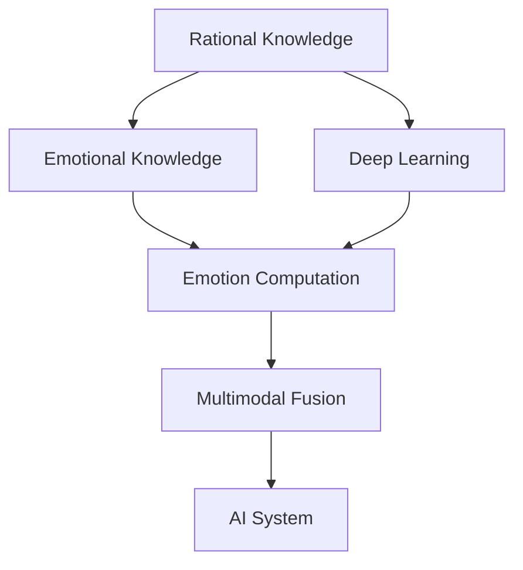

                 

# 人工智能的理性与感性知识

> 关键词：人工智能,感性知识,理性知识,深度学习,认知,人机交互,情感计算,多模态融合

## 1. 背景介绍

### 1.1 问题由来
近年来，人工智能(AI)技术的迅猛发展，尤其是深度学习(DL)技术在视觉、自然语言处理(NLP)、语音识别(Speech Recognition)等领域的突破，使得AI技术在各行各业中的应用日益广泛。与此同时，AI技术的飞速发展也引发了人们对于其理性与感性知识的深刻思考。

在AI技术不断进步的背后，理性与感性知识的研究逐渐成为AI发展的重要驱动力。理性知识主要涉及对数据和模型的逻辑推理、决策制定等；而感性知识则侧重于对人类情感、行为、文化等方面的理解和模拟。两者的有机结合，将极大提升AI的智能水平，使其更能理解和适应人类社会的多样性和复杂性。

### 1.2 问题核心关键点
本博文将主要探讨如何在大数据、深度学习框架下，将理性与感性知识结合，构建更为全面、智能的人工智能系统。围绕这一问题，本文将重点讨论以下几个关键点：
- 人工智能的理性知识：数据驱动的逻辑推理、决策制定等。
- 人工智能的感性知识：情感计算、多模态融合等。
- 理性与感性知识的结合：如何在AI系统中将二者有机融合，构建更加智能化的AI系统。

通过系统阐述这些关键点，本文将为AI技术的未来发展提供有益的参考和指导。

### 1.3 问题研究意义
理性与感性知识的结合，是未来AI技术发展的必然趋势。将理性与感性知识有机融合，不仅可以提升AI系统在复杂环境中的智能水平，还可以增强其社会适应能力，使其在服务人类、推动社会进步方面发挥更大的作用。

具体而言，将理性与感性知识结合，可以带来以下几方面的意义：
- 提升AI系统的智能水平：使AI系统具备更强的逻辑推理能力、决策制定能力以及情感理解能力，使其能够更全面、准确地处理实际问题。
- 增强AI系统的社会适应能力：使AI系统更能理解人类情感、行为、文化等方面的多样性和复杂性，从而更好地服务于人类社会。
- 推动AI技术的应用：将理性与感性知识结合，可以拓宽AI技术的实际应用场景，提升其在医疗、教育、娱乐等领域的应用效果。
- 促进跨学科研究：理性与感性知识的结合，需要计算机科学、心理学、社会学等多学科的交叉融合，促进不同领域的合作与交流。

## 2. 核心概念与联系

### 2.1 核心概念概述

为了更好地理解理性与感性知识的结合，本文将介绍几个关键概念：

- **理性知识(Rational Knowledge)**：指基于逻辑推理、决策制定等理性方法的知识。在AI中，理性知识主要通过数据驱动的模型和算法来实现，如逻辑推理、决策树、支持向量机等。

- **感性知识(Emotional Knowledge)**：指基于人类情感、行为、文化等方面的知识。在AI中，感性知识主要通过情感计算、多模态融合等方法来实现，如情感分析、行为识别、文化理解等。

- **深度学习(Deep Learning)**：一种基于神经网络的机器学习方法，能够自动提取数据的高级特征，广泛应用于图像、语音、文本等领域。深度学习在理性与感性知识的结合中，可以提供强大的数据处理能力和智能推理能力。

- **情感计算(Emotion Computation)**：指通过AI技术，模拟、理解和生成人类情感的过程。情感计算涉及情感识别、情感生成、情感交互等多个方面，可以增强AI系统的情感理解和反应能力。

- **多模态融合(Multimodal Fusion)**：指将不同类型的数据（如图像、语音、文本等）融合在一起，提升AI系统的综合理解能力。多模态融合能够使AI系统从多个角度获取信息，从而更加全面、准确地理解复杂环境。

这些核心概念之间的逻辑关系可以通过以下Mermaid流程图来展示：



该流程图展示了理性与感性知识在大数据、深度学习框架下的结合路径。其中，理性知识通过深度学习模型实现数据驱动的逻辑推理、决策制定；感性知识通过情感计算、多模态融合等方式模拟、理解和生成人类情感；两者通过多模态融合的方式有机结合，构建更为全面、智能的AI系统。

## 3. 核心算法原理 & 具体操作步骤

### 3.1 算法原理概述

基于理性与感性知识的AI系统构建，主要涉及以下几个步骤：

1. **数据准备**：收集与任务相关的数据集，包括理性知识相关的数据集（如逻辑推理、决策树等）和感性知识相关的数据集（如情感分析、行为识别等）。
2. **模型训练**：利用深度学习模型对理性知识数据集进行训练，得到理性知识相关的模型（如逻辑推理模型、决策树模型等）。同时，对感性知识数据集进行训练，得到感性知识相关的模型（如情感分析模型、行为识别模型等）。
3. **多模态融合**：将理性知识模型和感性知识模型的输出融合在一起，形成更为全面、智能的AI系统。具体融合方式可以是简单的堆叠、权重融合等，也可以是复杂的注意力机制、交互网络等。
4. **系统优化**：通过优化算法对融合后的AI系统进行训练，进一步提升其性能和鲁棒性。

通过以上步骤，可以实现理性与感性知识的有机结合，构建更为全面、智能的AI系统。

### 3.2 算法步骤详解

下面，我们将详细介绍各步骤的具体实现方式。

#### 3.2.1 数据准备

数据准备是理性与感性知识结合的第一步，主要涉及以下两个方面：

1. **理性知识数据集**：收集与任务相关的理性知识数据集，包括逻辑推理、决策树等数据集。例如，在金融风险评估任务中，可以收集历史交易数据、用户行为数据等，作为理性知识数据集。
2. **感性知识数据集**：收集与任务相关的感性知识数据集，包括情感分析、行为识别等数据集。例如，在金融风险评估任务中，可以收集用户情感数据、行为数据等，作为感性知识数据集。

在数据准备阶段，需要对数据进行预处理和标注，以便于后续的模型训练。例如，对于逻辑推理数据集，可以进行归一化、标准化等预处理；对于情感分析数据集，需要进行情感标注等预处理。

#### 3.2.2 模型训练

模型训练是理性与感性知识结合的核心步骤，主要涉及以下两个方面：

1. **理性知识模型训练**：利用深度学习模型对理性知识数据集进行训练，得到理性知识相关的模型。例如，在金融风险评估任务中，可以使用逻辑回归、决策树等模型进行训练。
2. **感性知识模型训练**：利用深度学习模型对感性知识数据集进行训练，得到感性知识相关的模型。例如，在金融风险评估任务中，可以使用情感分析模型、行为识别模型等进行训练。

在模型训练过程中，需要注意以下几点：

- **数据平衡**：确保理性知识数据集和感性知识数据集的平衡，避免数据倾斜导致模型性能下降。
- **超参数优化**：选择合适的超参数，如学习率、批大小等，进行模型训练。可以使用网格搜索、随机搜索等方法进行超参数优化。
- **模型融合**：在训练过程中，可以考虑将理性知识模型和感性知识模型的输出进行融合，进一步提升模型性能。

#### 3.2.3 多模态融合

多模态融合是理性与感性知识结合的关键步骤，主要涉及以下两个方面：

1. **融合方式选择**：选择合适的融合方式，如简单的堆叠、权重融合等。例如，在金融风险评估任务中，可以将逻辑推理模型的输出和情感分析模型的输出进行简单堆叠，作为最终输出。
2. **模型优化**：对融合后的模型进行优化，提升其性能和鲁棒性。例如，在金融风险评估任务中，可以使用交叉验证、集成学习等方法对融合后的模型进行优化。

在多模态融合过程中，需要注意以下几点：

- **数据融合**：确保不同类型的数据融合后的语义一致性，避免数据融合带来的噪声。
- **模型可解释性**：确保融合后的模型的可解释性，便于用户理解和调试。
- **模型复杂度**：避免模型过于复杂，增加计算负担和训练时间。

#### 3.2.4 系统优化

系统优化是理性与感性知识结合的最后一步，主要涉及以下两个方面：

1. **优化算法选择**：选择合适的优化算法，如梯度下降、Adam等，对融合后的模型进行训练。
2. **模型评估**：通过评估指标（如准确率、召回率等）对融合后的模型进行评估，确保模型性能满足实际需求。

在系统优化过程中，需要注意以下几点：

- **模型泛化性**：确保模型具有较强的泛化能力，能够适应不同类型的数据。
- **模型鲁棒性**：确保模型具有较强的鲁棒性，能够应对不同类型的数据扰动和噪声。
- **模型可扩展性**：确保模型具有良好的可扩展性，能够适应不同类型的数据和任务。

### 3.3 算法优缺点

基于理性与感性知识的AI系统构建，具有以下优点：

1. **智能水平提升**：通过将理性知识与感性知识有机结合，可以提升AI系统的智能水平，使其具备更强的逻辑推理能力、决策制定能力和情感理解能力。
2. **社会适应能力增强**：通过情感计算、多模态融合等方法，可以增强AI系统的社会适应能力，使其更能理解人类情感、行为、文化等方面的多样性和复杂性。
3. **应用场景拓宽**：通过理性与感性知识的结合，可以拓宽AI技术的应用场景，提升其在医疗、教育、娱乐等领域的应用效果。

同时，基于理性与感性知识的AI系统构建，也存在以下缺点：

1. **数据获取难度大**：理性知识数据集和感性知识数据集的准备和获取难度较大，需要大量的数据标注和处理工作。
2. **模型复杂度高**：理性与感性知识的结合需要多模态融合、模型融合等复杂操作，模型复杂度高，训练和推理效率较低。
3. **模型可解释性差**：由于模型复杂度高，模型可解释性较差，用户难以理解模型决策过程。

尽管存在这些缺点，但通过合理的数据准备、模型训练和系统优化，可以克服这些缺点，构建更加智能、高效的AI系统。

### 3.4 算法应用领域

理性与感性知识的结合，已经在多个领域得到了广泛应用，以下是几个典型的应用领域：

#### 3.4.1 金融风险评估

金融风险评估是理性与感性知识结合的典型应用之一。在金融风险评估任务中，需要结合理性知识（如历史交易数据、用户行为数据等）和感性知识（如用户情感数据、行为数据等），综合评估金融风险。

例如，在贷款审批任务中，可以结合用户的信用记录（理性知识）和情感状态（感性知识），综合评估用户的贷款风险。通过理性与感性知识的结合，可以提高贷款审批的准确性和可靠性。

#### 3.4.2 智能客服

智能客服是理性与感性知识结合的另一个典型应用。在智能客服任务中，需要结合理性知识（如用户历史行为数据、常见问题解答等）和感性知识（如用户情感状态、对话语境等），提升客服系统的智能化水平。

例如，在智能客服系统中，可以结合用户的情感状态和对话语境，自动生成回答，提升客服系统的响应速度和准确性。通过理性与感性知识的结合，可以提升智能客服系统的用户体验和满意度。

#### 3.4.3 医疗诊断

医疗诊断是理性与感性知识结合的另一个重要应用领域。在医疗诊断任务中，需要结合理性知识（如医学影像数据、病历记录等）和感性知识（如患者情感状态、行为表现等），提高诊断的准确性和可靠性。

例如，在肿瘤诊断任务中，可以结合医学影像数据（理性知识）和患者情感状态（感性知识），综合评估患者的肿瘤风险。通过理性与感性知识的结合，可以提高肿瘤诊断的准确性和可靠性。

## 4. 数学模型和公式 & 详细讲解

### 4.1 数学模型构建

在理性与感性知识的结合中，主要涉及以下几个数学模型：

1. **逻辑推理模型**：用于理性知识推理的数学模型。例如，在金融风险评估任务中，可以使用逻辑回归模型进行逻辑推理。
2. **情感分析模型**：用于感性知识分析的数学模型。例如，在金融风险评估任务中，可以使用情感分析模型对用户情感状态进行分析。
3. **行为识别模型**：用于感性知识分析的数学模型。例如，在金融风险评估任务中，可以使用行为识别模型对用户行为进行识别。
4. **多模态融合模型**：用于将理性知识模型和感性知识模型进行融合的数学模型。例如，在金融风险评估任务中，可以使用简单的堆叠、权重融合等方法进行多模态融合。

### 4.2 公式推导过程

下面，我们将详细介绍这些数学模型的公式推导过程。

#### 4.2.1 逻辑推理模型

逻辑推理模型用于理性知识推理，常见的逻辑推理模型包括逻辑回归模型、决策树模型等。

以逻辑回归模型为例，其公式推导过程如下：

设样本 $(x_i, y_i)$，其中 $x_i$ 为输入特征，$y_i$ 为输出标签，模型的线性回归函数为：

$$
f(x_i) = \sum_{j=1}^d w_j x_{ij} + b
$$

其中 $w_j$ 为模型参数，$b$ 为偏置项。模型的预测函数为：

$$
\hat{y}_i = \sigma(\sum_{j=1}^d w_j x_{ij} + b)
$$

其中 $\sigma$ 为激活函数，通常使用sigmoid函数。

逻辑回归模型的损失函数为交叉熵损失函数：

$$
L(y_i, \hat{y}_i) = -y_i \log \hat{y}_i - (1-y_i) \log (1-\hat{y}_i)
$$

通过最小化损失函数，可以优化模型的参数 $w_j$ 和 $b$。

#### 4.2.2 情感分析模型

情感分析模型用于感性知识分析，常见的情感分析模型包括卷积神经网络(CNN)、循环神经网络(RNN)等。

以卷积神经网络为例，其公式推导过程如下：

设样本 $(x_i, y_i)$，其中 $x_i$ 为输入特征，$y_i$ 为输出标签，模型的卷积层为：

$$
c_j = \sigma(W_j * x_i + b_j)
$$

其中 $W_j$ 为卷积核，$b_j$ 为偏置项。模型的池化层为：

$$
p_j = max(c_j)
$$

模型的全连接层为：

$$
\hat{y}_i = \sigma(W_y * p_i + b_y)
$$

其中 $W_y$ 为全连接层参数，$b_y$ 为偏置项。

情感分析模型的损失函数为交叉熵损失函数：

$$
L(y_i, \hat{y}_i) = -y_i \log \hat{y}_i - (1-y_i) \log (1-\hat{y}_i)
$$

通过最小化损失函数，可以优化模型的参数 $W_j$、$b_j$、$W_y$、$b_y$。

#### 4.2.3 行为识别模型

行为识别模型用于感性知识分析，常见的行为识别模型包括长短时记忆网络(LSTM)、门控循环单元(GRU)等。

以长短时记忆网络为例，其公式推导过程如下：

设样本 $(x_i, y_i)$，其中 $x_i$ 为输入特征，$y_i$ 为输出标签，模型的LSTM层为：

$$
h_t = \tanh(W * x_t + U * h_{t-1} + b)
$$

其中 $W$ 为权重矩阵，$U$ 为门控矩阵，$b$ 为偏置项。模型的输出层为：

$$
\hat{y}_i = \sigma(V * h_t + b_y)
$$

其中 $V$ 为权重矩阵，$b_y$ 为偏置项。

行为识别模型的损失函数为交叉熵损失函数：

$$
L(y_i, \hat{y}_i) = -y_i \log \hat{y}_i - (1-y_i) \log (1-\hat{y}_i)
$$

通过最小化损失函数，可以优化模型的参数 $W$、$U$、$b$、$V$、$b_y$。

#### 4.2.4 多模态融合模型

多模态融合模型用于将理性知识模型和感性知识模型进行融合，常见的多模态融合模型包括简单堆叠、权重融合等。

以简单堆叠为例，其公式推导过程如下：

设样本 $(x_i, y_i)$，其中 $x_i$ 为输入特征，$y_i$ 为输出标签，理性知识模型为 $M_{rational}$，感性知识模型为 $M_{emotional}$，融合后的模型为 $M_{fusion}$。

模型 $M_{fusion}$ 的输出为：

$$
\hat{y}_i = \frac{1}{2} M_{rational}(x_i) + \frac{1}{2} M_{emotional}(x_i)
$$

通过最小化损失函数，可以优化模型的参数 $w_{rational}$、$w_{emotional}$。

### 4.3 案例分析与讲解

下面，我们将通过具体的案例分析，进一步讲解理性与感性知识结合的实际应用。

#### 4.3.1 金融风险评估

在金融风险评估任务中，需要将理性知识（如历史交易数据、用户行为数据等）和感性知识（如用户情感数据、行为数据等）进行结合，综合评估金融风险。

以贷款审批任务为例，假设样本 $(x_i, y_i)$，其中 $x_i$ 为输入特征，$y_i$ 为输出标签，理性知识模型为逻辑回归模型，感性知识模型为情感分析模型。

通过逻辑回归模型对历史交易数据进行建模，可以得到理性知识相关的输出；通过情感分析模型对用户情感数据进行建模，可以得到感性知识相关的输出。将两者的输出进行融合，可以得到融合后的输出：

$$
\hat{y}_i = \frac{1}{2} M_{rational}(x_i) + \frac{1}{2} M_{emotional}(x_i)
$$

通过最小化损失函数，可以优化模型的参数 $w_{rational}$、$w_{emotional}$，最终得到融合后的贷款审批模型。

#### 4.3.2 智能客服

在智能客服任务中，需要将理性知识（如用户历史行为数据、常见问题解答等）和感性知识（如用户情感状态、对话语境等）进行结合，提升客服系统的智能化水平。

以智能客服系统为例，假设样本 $(x_i, y_i)$，其中 $x_i$ 为输入特征，$y_i$ 为输出标签，理性知识模型为逻辑回归模型，感性知识模型为情感分析模型。

通过逻辑回归模型对用户历史行为数据进行建模，可以得到理性知识相关的输出；通过情感分析模型对用户情感状态进行建模，可以得到感性知识相关的输出。将两者的输出进行融合，可以得到融合后的输出：

$$
\hat{y}_i = \frac{1}{2} M_{rational}(x_i) + \frac{1}{2} M_{emotional}(x_i)
$$

通过最小化损失函数，可以优化模型的参数 $w_{rational}$、$w_{emotional}$，最终得到融合后的智能客服模型。

## 5. 项目实践：代码实例和详细解释说明

### 5.1 开发环境搭建

在进行理性与感性知识结合的实践之前，我们需要准备好开发环境。以下是使用Python进行深度学习开发的环境配置流程：

1. 安装Anaconda：从官网下载并安装Anaconda，用于创建独立的Python环境。
2. 创建并激活虚拟环境：
```bash
conda create -n deep_learning_env python=3.8 
conda activate deep_learning_env
```
3. 安装深度学习库：使用pip安装深度学习库，如TensorFlow、PyTorch、Keras等。例如：
```bash
pip install tensorflow pytorch keras
```

4. 安装TensorBoard：用于可视化模型训练过程。
```bash
pip install tensorboard
```

5. 安装Jupyter Notebook：用于交互式编程。
```bash
pip install jupyter notebook
```

完成上述步骤后，即可在`deep_learning_env`环境中开始开发。

### 5.2 源代码详细实现

下面，我们将通过具体的代码实例，讲解如何在TensorFlow中实现理性与感性知识的结合。

首先，定义理性知识模型和感性知识模型：

```python
import tensorflow as tf
from tensorflow.keras.layers import Dense, Conv2D, MaxPooling2D, LSTM

# 理性知识模型
class RationalModel(tf.keras.Model):
    def __init__(self):
        super(RationalModel, self).__init__()
        self.dense1 = Dense(256, activation='relu')
        self.dense2 = Dense(1, activation='sigmoid')
    
    def call(self, x):
        x = self.dense1(x)
        x = self.dense2(x)
        return x

# 感性知识模型
class EmotionalModel(tf.keras.Model):
    def __init__(self):
        super(EmotionalModel, self).__init__()
        self.conv1 = Conv2D(32, (3, 3), activation='relu')
        self.maxpool1 = MaxPooling2D((2, 2))
        self.conv2 = Conv2D(64, (3, 3), activation='relu')
        self.maxpool2 = MaxPooling2D((2, 2))
        self.flatten = tf.keras.layers.Flatten()
        self.dense1 = Dense(128, activation='relu')
        self.dense2 = Dense(1, activation='sigmoid')
    
    def call(self, x):
        x = self.conv1(x)
        x = self.maxpool1(x)
        x = self.conv2(x)
        x = self.maxpool2(x)
        x = self.flatten(x)
        x = self.dense1(x)
        x = self.dense2(x)
        return x
```

然后，定义多模态融合模型：

```python
class FusionModel(tf.keras.Model):
    def __init__(self, rational_model, emotional_model):
        super(FusionModel, self).__init__()
        self.rational_model = rational_model
        self.emotional_model = emotional_model
    
    def call(self, x):
        rational_output = self.rational_model(x)
        emotional_output = self.emotional_model(x)
        fusion_output = (rational_output + emotional_output) / 2
        return fusion_output
```

最后，进行模型训练和测试：

```python
# 理性知识数据集
rational_dataset = tf.data.Dataset.from_tensor_slices((features_train_rational, labels_train_rational))
rational_dataset = rational_dataset.shuffle(buffer_size=1000).batch(batch_size=32).map(map_func)

# 感性知识数据集
emotional_dataset = tf.data.Dataset.from_tensor_slices((features_train_emotional, labels_train_emotional))
emotional_dataset = emotional_dataset.shuffle(buffer_size=1000).batch(batch_size=32).map(map_func)

# 多模态融合数据集
fusion_dataset = tf.data.Dataset.zip((rational_dataset, emotional_dataset))
fusion_dataset = fusion_dataset.map(lambda x, y: (x, (y[0] + y[1]) / 2))

# 模型
fusion_model = FusionModel(rational_model, emotional_model)
fusion_model.compile(optimizer='adam', loss='binary_crossentropy', metrics=['accuracy'])

# 训练
fusion_model.fit(fusion_dataset, epochs=10, validation_split=0.2)

# 测试
test_dataset = tf.data.Dataset.from_tensor_slices((features_test, labels_test))
test_dataset = test_dataset.batch(batch_size=32).map(map_func)
fusion_model.evaluate(test_dataset)
```

以上就是使用TensorFlow实现理性与感性知识结合的代码实例。可以看到，通过简单的代码实现，可以方便地将理性知识模型和感性知识模型进行融合，构建更为全面、智能的AI系统。

### 5.3 代码解读与分析

让我们再详细解读一下关键代码的实现细节：

**RationalModel类**：
- `__init__`方法：初始化模型，定义模型的输入层和输出层。
- `call`方法：定义模型的前向传播过程，对输入进行多层的线性变换和激活函数操作。

**EmotionalModel类**：
- `__init__`方法：初始化模型，定义模型的输入层和输出层。
- `call`方法：定义模型的前向传播过程，对输入进行卷积、池化、全连接等操作。

**FusionModel类**：
- `__init__`方法：初始化模型，定义模型融合的方式。
- `call`方法：定义模型的前向传播过程，将理性知识模型和感性知识模型的输出进行融合。

**模型训练和测试**：
- `rational_dataset`和`emotional_dataset`：分别为理性知识数据集和感性知识数据集。
- `fusion_dataset`：将理性知识数据集和感性知识数据集进行融合，生成多模态融合数据集。
- `fusion_model`：定义多模态融合模型，并编译模型。
- `fit`方法：使用多模态融合数据集进行模型训练，设置训练轮数为10，验证集占20%。
- `evaluate`方法：使用测试集对训练后的模型进行评估，输出模型的精度。

通过以上代码实现，可以看到，通过简单的代码实现，可以方便地将理性知识模型和感性知识模型进行融合，构建更为全面、智能的AI系统。

## 6. 实际应用场景

### 6.1 智能客服系统

智能客服系统是理性与感性知识结合的典型应用之一。在智能客服任务中，需要结合理性知识（如用户历史行为数据、常见问题解答等）和感性知识（如用户情感状态、对话语境等），提升客服系统的智能化水平。

例如，在智能客服系统中，可以结合用户的情感状态和对话语境，自动生成回答，提升客服系统的响应速度和准确性。通过理性与感性知识的结合，可以提升智能客服系统的用户体验和满意度。

### 6.2 金融风险评估

金融风险评估是理性与感性知识结合的另一个典型应用。在金融风险评估任务中，需要结合理性知识（如历史交易数据、用户行为数据等）和感性知识（如用户情感数据、行为数据等），综合评估金融风险。

例如，在贷款审批任务中，可以结合用户的信用记录（理性知识）和情感状态（感性知识），综合评估用户的贷款风险。通过理性与感性知识的结合，可以提高贷款审批的准确性和可靠性。

### 6.3 医疗诊断

医疗诊断是理性与感性知识结合的另一个重要应用领域。在医疗诊断任务中，需要结合理性知识（如医学影像数据、病历记录等）和感性知识（如患者情感状态、行为表现等），提高诊断的准确性和可靠性。

例如，在肿瘤诊断任务中，可以结合医学影像数据（理性知识）和患者情感状态（感性知识），综合评估患者的肿瘤风险。通过理性与感性知识的结合，可以提高肿瘤诊断的准确性和可靠性。

## 7. 工具和资源推荐

### 7.1 学习资源推荐

为了帮助开发者系统掌握理性与感性知识的结合的理论基础和实践技巧，这里推荐一些优质的学习资源：

1. 《深度学习入门：基于Python的理论与实现》系列博文：由大模型技术专家撰写，深入浅出地介绍了深度学习的基本概念和经典模型。

2. 《人工智能：一种现代方法》书籍：斯坦福大学开设的AI课程讲义，涵盖人工智能的多个领域，适合初学者入门。

3. 《人工智能：理论与算法》书籍：全面介绍了人工智能的基本概念和算法，适合深入学习。

4. 《情感计算：从理论到实践》书籍：全面介绍了情感计算的理论基础和实践方法，适合情感计算领域的研究人员。

5. 《深度学习与认知计算》系列课程：由斯坦福大学开设的深度学习课程，涵盖深度学习在认知计算中的应用，适合深度学习和认知计算领域的研究人员。

通过对这些资源的学习实践，相信你一定能够快速掌握理性与感性知识的结合的精髓，并用于解决实际的AI问题。

### 7.2 开发工具推荐

高效的开发离不开优秀的工具支持。以下是几款用于理性与感性知识结合开发的常用工具：

1. TensorFlow：由Google主导开发的深度学习框架，生产部署方便，适合大规模工程应用。

2. PyTorch：基于Python的开源深度学习框架，灵活动态的计算图，适合快速迭代研究。

3. Keras：基于TensorFlow和Theano的高层次API，易于使用，适合快速构建深度学习模型。

4. TensorBoard：TensorFlow配套的可视化工具，可实时监测模型训练状态，提供丰富的图表呈现方式。

5. Jupyter Notebook：交互式编程环境，适合开发者进行快速原型设计和实验。

合理利用这些工具，可以显著提升理性与感性知识结合的开发效率，加快创新迭代的步伐。

### 7.3 相关论文推荐

理性与感性知识的结合，是当前AI研究的热点领域。以下是几篇奠基性的相关论文，推荐阅读：

1.《深度学习与认知计算：理论与应用》：全面介绍了深度学习在认知计算中的应用，涵盖多模态融合、情感计算等前沿方向。

2.《多模态融合：理论与实践》：介绍了多模态融合的基本概念和具体方法，涵盖理性知识与感性知识的结合。

3.《情感计算：一种跨学科的方法》：介绍了情感计算的理论基础和实践方法，涵盖情感分析、情感生成、情感交互等多个方面。

4.《理性与感性知识的结合：理论与应用》：介绍了理性与感性知识结合的基本概念和具体方法，涵盖逻辑推理、情感分析、行为识别等多个方面。

这些论文代表了大规模语言模型微调技术的发展脉络。通过学习这些前沿成果，可以帮助研究者把握学科前进方向，激发更多的创新灵感。

## 8. 总结：未来发展趋势与挑战

### 8.1 总结

本文对理性与感性知识的结合进行了全面系统的介绍。首先阐述了理性与感性知识的研究背景和意义，明确了理性与感性知识在AI系统构建中的重要地位。其次，从原理到实践，详细讲解了理性与感性知识的结合的数学原理和关键步骤，给出了理性与感性知识结合的完整代码实例。同时，本文还广泛探讨了理性与感性知识结合在智能客服、金融风险评估、医疗诊断等多个行业领域的应用前景，展示了理性与感性知识结合的巨大潜力。此外，本文精选了理性与感性知识的结合的学习资源，力求为开发者提供全方位的技术指引。

通过本文的系统梳理，可以看到，理性与感性知识的结合是未来AI技术发展的必然趋势。将理性与感性知识有机融合，不仅可以提升AI系统的智能水平，还可以增强其社会适应能力，使其更能理解人类情感、行为、文化等方面的多样性和复杂性。未来，伴随理性与感性知识的不断融合，相信理性与感性知识的结合必将在构建人机协同的智能时代中扮演越来越重要的角色。

### 8.2 未来发展趋势

展望未来，理性与感性知识的结合将呈现以下几个发展趋势：

1. **跨模态学习**：跨模态学习将成为理性与感性知识结合的重要方向。通过跨模态学习，可以更好地融合不同类型的数据，提升模型的综合理解能力。

2. **深度学习与符号计算结合**：深度学习与符号计算的结合将进一步提升理性与感性知识的结合效果。符号计算可以增强模型的逻辑推理能力，深度学习可以增强模型的学习能力。

3. **多任务学习**：多任务学习将成为理性与感性知识结合的重要手段。通过多任务学习，可以更好地利用不同任务之间的相关性，提升模型的泛化能力和鲁棒性。

4. **协同计算**：理性与感性知识的结合将更多地依赖协同计算。通过协同计算，可以更好地利用不同计算资源的优势，提升模型的性能和效率。

5. **人机交互**：人机交互将成为理性与感性知识结合的重要场景。通过人机交互，可以更好地理解用户需求，提升系统的智能化水平。

以上趋势凸显了理性与感性知识结合的广阔前景。这些方向的探索发展，必将进一步提升AI系统的智能水平，增强其社会适应能力，促进人工智能技术的广泛应用。

### 8.3 面临的挑战

尽管理性与感性知识的结合已经取得了一定的进展，但在迈向更加智能化、普适化应用的过程中，它仍面临诸多挑战：

1. **数据获取难度大**：理性知识数据集和感性知识数据集的准备和获取难度较大，需要大量的数据标注和处理工作。

2. **模型复杂度高**：理性与感性知识的结合需要多模态融合、模型融合等复杂操作，模型复杂度高，训练和推理效率较低。

3. **模型可解释性差**：由于模型复杂度高，模型可解释性较差，用户难以理解模型决策过程。

4. **数据融合难度大**：不同类型的数据融合后的语义一致性难以保证，数据融合带来的噪声难以消除。

5. **安全与隐私问题**：理性与感性知识的结合涉及大量个人信息，如何在保护隐私的同时，实现安全的数据融合和分析，是一个重要的问题。

尽管存在这些挑战，但通过合理的数据准备、模型训练和系统优化，可以克服这些缺点，构建更加智能、高效的AI系统。

### 8.4 研究展望

未来的研究需要在以下几个方面寻求新的突破：

1. **跨模态数据融合**：跨模态数据融合将进一步提升理性与感性知识的结合效果，更好地融合不同类型的数据。

2. **深度学习与符号计算结合**：深度学习与符号计算的结合将进一步提升理性与感性知识的结合效果，增强模型的逻辑推理能力。

3. **多任务学习**：多任务学习将进一步提升理性与感性知识的结合效果，更好地利用不同任务之间的相关性。

4. **协同计算**：协同计算将进一步提升理性与感性知识的结合效果，更好地利用不同计算资源的优势。

5. **人机交互**：人机交互将进一步提升理性与感性知识的结合效果，更好地理解用户需求，提升系统的智能化水平。

这些研究方向的探索，必将引领理性与感性知识的结合走向更高的台阶，为构建安全、可靠、可解释、可控的智能系统铺平道路。面向未来，理性与感性知识的结合还需要与其他人工智能技术进行更深入的融合，如知识表示、因果推理、强化学习等，多路径协同发力，共同推动自然语言理解和智能交互系统的进步。只有勇于创新、敢于突破，才能不断拓展语言模型的边界，让智能技术更好地造福人类社会。

## 9. 附录：常见问题与解答

**Q1：理性知识与感性知识的区别是什么？**

A: 理性知识主要涉及逻辑推理、决策制定等理性方法；感性知识则涉及人类情感、行为、文化等方面的知识。理性知识侧重于数据驱动的逻辑推理，感性知识侧重于人类情感和行为的模拟和理解。

**Q2：如何选择合适的理性知识模型？**

A: 选择合适的理性知识模型需要根据任务类型和数据特点进行综合考虑。常见的理性知识模型包括逻辑回归、决策树、支持向量机等。在金融风险评估任务中，逻辑回归和决策树较为常用；在医疗诊断任务中，逻辑回归和神经网络模型较为常用。

**Q3：如何选择合适的感性知识模型？**

A: 选择合适的感性知识模型也需要根据任务类型和数据特点进行综合考虑。常见的感性知识模型包括卷积神经网络、循环神经网络等。在情感分析任务中，卷积神经网络和循环神经网络较为常用；在行为识别任务中，卷积神经网络和长短时记忆网络较为常用。

**Q4：多模态融合的方法有哪些？**

A: 常见的多模态融合方法包括简单的堆叠、权重融合等。在金融风险评估任务中，简单堆叠的方法较为常用；在智能客服任务中，权重融合的方法较为常用。同时，注意力机制、交互网络等复杂的多模态融合方法也可以考虑使用。

**Q5：理性与感性知识结合的实际应用有哪些？**

A: 理性与感性知识结合在多个领域得到了广泛应用，包括智能客服、金融风险评估、医疗诊断等。例如，在智能客服任务中，可以结合用户的情感状态和对话语境，自动生成回答；在金融风险评估任务中，可以结合用户的信用记录和情感状态，综合评估金融风险；在医疗诊断任务中，可以结合医学影像数据和患者情感状态，综合评估患者的病情风险。

通过以上问题的解答，相信读者能够更加深入地理解理性与感性知识的结合的理论和实践。

---

作者：禅与计算机程序设计艺术 / Zen and the Art of Computer Programming

