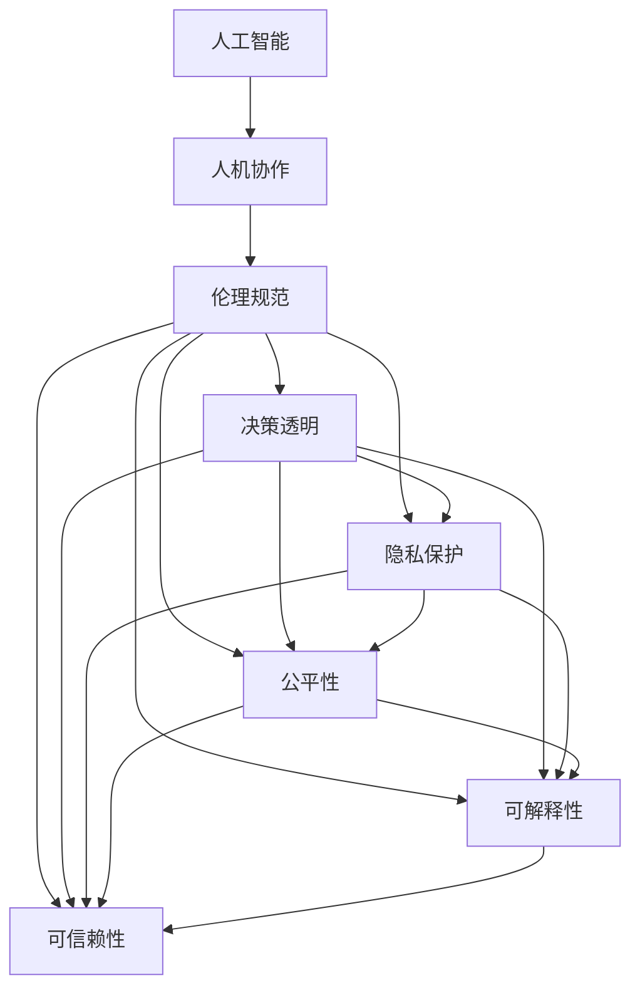

                 

# 人机协作：伦理规范与准则

> 关键词：人工智能, 人机协作, 伦理规范, 决策透明, 隐私保护, 可解释性, 公平性, 可信赖性

## 1. 背景介绍

在信息化时代，人机协作已成为社会运行的重要形态。从工业自动化到智慧城市建设，从科学研究到教育医疗，人工智能（AI）技术的应用日益广泛，极大地提升了效率、质量和创造力。然而，人工智能的飞速发展也带来了新的伦理挑战和道德困境，如隐私泄露、数据偏见、算法不透明等。因此，制定科学的伦理规范和准则，已成为保证人机协作顺利进行、推动人工智能健康发展的迫切需求。

### 1.1 问题由来
随着人工智能技术的不断进步，AI在众多领域中展示了强大的能力，但在应用过程中也出现了一些伦理问题。例如，自动驾驶系统在遇到复杂交通情况时，如何选择行动方案可能涉及伦理决策；医疗AI在诊断时可能存在数据偏见；智能推荐系统可能侵犯用户隐私；AI生成的内容可能缺乏可解释性，导致用户对其决策产生不信任。这些问题引发了社会各界对人工智能伦理规范的广泛关注和讨论。

### 1.2 问题核心关键点
这些问题主要集中在以下几个方面：
- **隐私保护**：如何保护用户的个人信息，避免数据泄露和滥用。
- **公平性**：确保AI模型不会对特定群体产生偏见，避免歧视。
- **透明性**：使AI决策过程透明可解释，增加用户对系统的信任。
- **责任归属**：明确AI系统在决策失误时的责任归属，防止系统滥用。
- **安全与可靠**：确保AI系统稳定可靠，不会引发重大安全事故。

解决这些问题的关键在于制定和遵循一系列伦理规范和准则，以指导AI技术的合理应用，确保人机协作的公正、透明和可信赖。

## 2. 核心概念与联系

### 2.1 核心概念概述

为更好地理解人机协作中的伦理规范与准则，本节将介绍几个关键概念及其相互联系：

- **人工智能**：利用计算机技术模拟人类智能行为的系统。
- **人机协作**：人类与AI系统共同完成任务的模式，融合人类的逻辑判断和AI的计算能力。
- **伦理规范**：在人工智能应用中，指导AI行为准则的规范性原则。
- **决策透明**：AI决策过程应公开透明，可追溯和可解释。
- **隐私保护**：保护个人数据不被非法获取、使用或公开，确保用户隐私权利。
- **公平性**：AI系统在处理数据和决策时应避免对特定群体或个体的歧视。
- **可解释性**：AI系统应具备一定的解释能力，让用户理解其决策依据。
- **可信赖性**：AI系统在长期运行中表现稳定、可靠，能够满足用户预期。

这些概念之间的逻辑关系可以通过以下Mermaid流程图来展示：



这个流程图展示了人工智能与伦理规范的联系及其各个组成概念之间的相互作用：

1. 人工智能作为人机协作的基础，需要在伦理规范的指导下进行设计和应用。
2. 伦理规范中的决策透明、隐私保护、公平性、可解释性和可信赖性，共同构成了AI系统合理应用的准则。
3. 各伦理准则之间相互联系，共同指导AI系统的行为。

## 3. 核心算法原理 & 具体操作步骤

### 3.1 算法原理概述

制定AI伦理规范和准则的核心在于确保AI系统在应用中的行为符合社会伦理要求。这一过程通常包括以下几个关键步骤：

1. **需求分析**：明确AI系统在特定应用场景中的目标和任务，理解用户的需求和期望。
2. **伦理评估**：对AI系统进行伦理评估，识别可能存在的伦理风险和问题。
3. **准则制定**：基于伦理评估结果，制定符合社会伦理要求的规范和准则。
4. **准则实施**：将制定的伦理准则应用于AI系统的设计、开发、测试和部署过程中，确保系统符合伦理要求。
5. **持续监督**：对AI系统进行持续监督和评估，确保其长期运行符合伦理准则。

### 3.2 算法步骤详解

**Step 1: 需求分析**
- 与用户、利益相关者进行深入沟通，了解其在应用场景中的具体需求和期望。
- 分析用户的需求，明确AI系统应实现的功能和目标。

**Step 2: 伦理评估**
- 对AI系统的数据收集、处理、存储和传输进行全面审计，确保符合隐私保护要求。
- 分析AI系统的决策过程，识别可能的偏见和歧视问题。
- 评估AI系统的可解释性和透明性，确保其决策过程可追溯和可解释。

**Step 3: 准则制定**
- 基于伦理评估结果，制定符合社会伦理要求的规范和准则。例如，隐私保护准则应规定数据使用的限制和规范；公平性准则应规定数据处理的公平原则；透明性准则应规定系统的可解释性和透明度要求；责任归属准则应规定系统在决策失误时的责任划分。

**Step 4: 准则实施**
- 将制定的伦理准则应用于AI系统的各个环节，包括设计、开发、测试和部署。例如，在数据处理环节应使用加密技术保护数据隐私；在模型训练环节应避免数据偏见；在决策输出环节应提供清晰的解释和理由。

**Step 5: 持续监督**
- 对AI系统进行持续监督和评估，确保其长期运行符合伦理准则。例如，定期审计数据处理流程，评估系统输出结果的公平性和透明性，根据反馈调整系统行为。

### 3.3 算法优缺点

制定和实施AI伦理规范和准则具有以下优点：
1. 提升AI系统的可信度和接受度：符合伦理准则的AI系统更容易获得用户和社会的信任和接受。
2. 降低法律风险：符合伦理要求的AI系统更少可能涉及法律纠纷和责任追究。
3. 促进社会公平：符合公平性要求的AI系统能够更好地服务于各个群体，减少社会不平等现象。
4. 保护用户隐私：符合隐私保护要求的AI系统能够有效保护用户数据安全。

然而，制定和实施伦理规范和准则也面临一些挑战：
1. 伦理规范缺乏统一标准：不同国家和地区的伦理标准可能存在差异，难以达成全球共识。
2. 技术实现难度高：实现高水平的透明性、可解释性和公平性，对技术和算法的要求较高。
3. 伦理准则执行难度大：缺乏有效的监督和评估机制，可能导致准则流于形式，难以落实。

尽管存在这些挑战，但制定和实施AI伦理规范和准则，对于确保AI技术的健康发展，具有重要意义。

### 3.4 算法应用领域

人机协作中的伦理规范与准则，不仅适用于单个AI系统，还涉及广泛的领域和场景，例如：

- **医疗**：确保医疗AI在诊断和治疗中的公平性、透明性和可解释性。
- **金融**：保护用户隐私，确保金融AI的透明性和公平性。
- **教育**：促进AI教育系统符合伦理要求，尊重学生隐私，提供公平的学习机会。
- **交通**：确保自动驾驶系统在安全、可靠性和决策透明性方面符合伦理要求。
- **公共安全**：确保AI在监控和预测犯罪等方面的应用符合伦理要求。

## 4. 数学模型和公式 & 详细讲解 & 举例说明

### 4.1 数学模型构建

在伦理规范和准则的制定过程中，可以通过建立数学模型来量化和分析某些伦理指标。例如，隐私保护可以通过计算数据泄露风险来进行评估，公平性可以通过分析模型输出分布的均值和方差来进行评估。

以隐私保护为例，假设我们有数据集 $D=\{x_1,x_2,\dots,x_n\}$，其中 $x_i$ 为数据点。如果数据泄露风险为 $R$，则隐私保护的目标是找到最优的隐私保护策略 $P$，使得 $R$ 最小化。

$$
\min_{P} R(P) = \mathbb{E}[\max_i |f(x_i,P) - f(x_i,P')|]
$$

其中 $f(x_i,P)$ 为数据点 $x_i$ 在隐私保护策略 $P$ 下的信息泄露风险，$P'$ 为另一种隐私保护策略。

### 4.2 公式推导过程

对于公平性，我们通常使用统计学中的均值方差分析（ANOVA）来评估模型输出分布的公平性。假设我们有两个群体 $A$ 和 $B$，模型输出为 $y$，则公平性可以通过检验 $y$ 在两个群体中的均值差异和方差差异来评估。

令 $\mu_A$ 和 $\mu_B$ 分别为群体 $A$ 和 $B$ 的模型输出均值，$\sigma_A^2$ 和 $\sigma_B^2$ 分别为群体 $A$ 和 $B$ 的方差。公平性可以通过计算方差比 $\eta$ 和均值比 $\delta$ 来评估。

$$
\eta = \frac{\sigma_A^2}{\sigma_B^2}, \quad \delta = \frac{\mu_A - \mu_B}{\mu_A + \mu_B}
$$

如果 $\eta$ 和 $\delta$ 都在可接受范围内，则认为模型输出是公平的。

### 4.3 案例分析与讲解

**案例：医疗AI的公平性评估**

假设我们有一个医疗AI系统，用于诊断某种疾病的患病概率。我们希望评估该系统的公平性，即在不同人群（如性别、年龄、种族等）中，系统诊断的患病概率是否存在显著差异。

我们可以使用ANOVA方法来评估系统的公平性。首先，收集不同人群的患病数据和系统诊断结果，构建数据集 $D$。然后，使用ANOVA方法来检验系统输出在不同人群中的均值差异和方差差异。

如果均值差异显著，则说明系统在不同人群中诊断结果存在显著差异；如果方差差异显著，则说明系统在不同人群中的诊断不确定性存在显著差异。通过评估这些指标，我们可以确定系统是否公平，并采取相应措施来提升其公平性。

## 5. 项目实践：代码实例和详细解释说明

### 5.1 开发环境搭建

在进行伦理规范与准则的制定和实施时，我们需要准备好开发环境。以下是使用Python进行代码开发的环境配置流程：

1. 安装Anaconda：从官网下载并安装Anaconda，用于创建独立的Python环境。

2. 创建并激活虚拟环境：
```bash
conda create -n ethics-env python=3.8 
conda activate ethics-env
```

3. 安装必要的Python库：
```bash
conda install numpy pandas scikit-learn scipy matplotlib
```

4. 安装相关数据分析工具：
```bash
pip install statsmodels seaborn
```

完成上述步骤后，即可在`ethics-env`环境中进行伦理规范与准则的开发和实践。

### 5.2 源代码详细实现

下面以隐私保护为例，给出使用Python和Scikit-Learn库实现隐私保护风险评估的代码实现。

首先，定义隐私保护风险评估函数：

```python
import numpy as np
from sklearn.metrics import mean_absolute_error
from statsmodels.stats.multicomp import pairwise_tukeyhsd

def privacy_risk_assessment(data, k, alpha=0.05):
    n, p = data.shape
    n0 = np.bincount(data[:, 0] % k) / n
    n1 = np.bincount(data[:, 1] % k) / n
    
    # 计算均值差异
    mean_diff = np.mean(n0) - np.mean(n1)
    
    # 计算方差差异
    var_diff = np.var(n0) - np.var(n1)
    
    # 进行均值差异和方差差异的ANOVA检验
    f, pv = pairwise_tukeyhsd(n0, n1, alpha=alpha)
    
    return mean_diff, var_diff, f, pv
```

然后，使用示例数据集进行隐私风险评估：

```python
# 示例数据集
data = np.random.randint(0, 10, size=(100, 2))

# 计算隐私保护风险
mean_diff, var_diff, f, pv = privacy_risk_assessment(data, 10)

print(f"Mean Difference: {mean_diff:.2f}")
print(f"Variance Difference: {var_diff:.2f}")
print(f"ANOVA F-value: {f:.2f}")
print(f"ANOVA p-value: {pv:.2f}")
```

### 5.3 代码解读与分析

**privacy_risk_assessment函数**：
- 该函数计算了数据集中两个分组（这里以性别为例）的隐私保护风险，包括均值差异和方差差异。
- 使用Scikit-Learn中的`pairwise_tukeyhsd`函数进行ANOVA检验，判断均值和方差差异是否显著。

**示例数据集**：
- 使用NumPy生成100个样本，其中每个样本包含两个分组变量。
- 将数据集输入到`privacy_risk_assessment`函数中，计算隐私保护风险。

**输出结果**：
- 打印出均值差异、方差差异、ANOVA F值和p值，用于判断隐私保护风险是否显著。

## 6. 实际应用场景

### 6.1 医疗AI系统

在医疗AI系统中，隐私保护是一个重要考量因素。医疗数据通常包含敏感信息，如病历、体检报告等，如果这些数据泄露，可能导致患者隐私受到侵犯。

为了保护医疗数据隐私，医疗AI系统应采取以下措施：
- 数据加密：在数据传输和存储过程中，使用加密技术保护数据隐私。
- 访问控制：对系统访问进行严格控制，确保只有授权人员能够访问数据。
- 匿名化处理：对敏感数据进行匿名化处理，避免直接暴露个人身份信息。

### 6.2 金融AI系统

金融AI系统在处理用户数据时，应严格遵守隐私保护和公平性要求。金融数据通常包含用户的财务信息，如收入、支出、资产等，如果这些数据泄露，可能导致用户的财务状况受到威胁。

为了保护金融数据隐私，金融AI系统应采取以下措施：
- 数据加密：在数据传输和存储过程中，使用加密技术保护数据隐私。
- 访问控制：对系统访问进行严格控制，确保只有授权人员能够访问数据。
- 匿名化处理：对敏感数据进行匿名化处理，避免直接暴露个人身份信息。

### 6.3 教育AI系统

教育AI系统在处理学生数据时，应严格遵守隐私保护和公平性要求。学生数据通常包含学习记录、行为数据等，如果这些数据泄露，可能导致学生的隐私受到侵犯。

为了保护学生隐私，教育AI系统应采取以下措施：
- 数据加密：在数据传输和存储过程中，使用加密技术保护数据隐私。
- 访问控制：对系统访问进行严格控制，确保只有授权人员能够访问数据。
- 匿名化处理：对敏感数据进行匿名化处理，避免直接暴露个人身份信息。

## 7. 工具和资源推荐

### 7.1 学习资源推荐

为了帮助开发者系统掌握人工智能伦理规范与准则的理论基础和实践技巧，这里推荐一些优质的学习资源：

1. 《AI伦理规范与准则》系列书籍：系统介绍了AI伦理规范的框架、原则和实践方法，是理解AI伦理的重要入门书籍。
2. 《AI伦理与社会》课程：由知名AI伦理专家讲授，深入探讨AI伦理在社会各个领域的应用和挑战。
3. 《AI伦理与安全》论文集：收录了大量关于AI伦理和安全性的研究成果，是深入理解AI伦理问题的必备资料。
4. 《AI伦理指南》白皮书：由知名AI伦理机构发布，提供了一整套AI伦理规范的指南和实践建议。

通过对这些资源的学习实践，相信你一定能够快速掌握AI伦理规范与准则的精髓，并用于解决实际的伦理问题。

### 7.2 开发工具推荐

高效的开发离不开优秀的工具支持。以下是几款用于伦理规范与准则开发的常用工具：

1. Python：Python作为一种高性能的脚本语言，非常适合用于数据分析和模型开发。
2. Jupyter Notebook：交互式编程环境，方便开发者进行快速迭代和实验。
3. Scikit-Learn：常用的数据分析和机器学习库，提供了丰富的统计和模型工具。
4. Statsmodels：Python的统计分析库，提供了多种统计方法，支持复杂的数据分析需求。
5. Seaborn：基于Matplotlib的统计数据可视化库，方便进行数据可视化。

合理利用这些工具，可以显著提升伦理规范与准则开发的效率，加快创新迭代的步伐。

### 7.3 相关论文推荐

人工智能伦理规范与准则的发展源于学界的持续研究。以下是几篇奠基性的相关论文，推荐阅读：

1. "On the Ethics of AI Systems"：探讨了AI系统的伦理问题，提出了一系列伦理准则和评估方法。
2. "Fairness, Accountability, and Transparency"：讨论了AI系统中的公平性、透明性和责任问题，提供了一系列伦理规范和评估指标。
3. "The Ethics of Data Sharing in AI Systems"：探讨了数据共享在AI系统中的伦理问题，提出了一系列数据隐私保护措施。
4. "Ethical Considerations in AI Development"：讨论了AI系统开发过程中的伦理问题，提出了一系列伦理准则和评估方法。
5. "AI Ethics and Society"：探讨了AI系统在社会各个领域中的伦理问题，提供了一系列伦理规范和实践建议。

这些论文代表了大数据和人工智能伦理规范与准则的发展脉络。通过学习这些前沿成果，可以帮助研究者把握学科前进方向，激发更多的创新灵感。

## 8. 总结：未来发展趋势与挑战

### 8.1 总结

本文对人工智能伦理规范与准则进行了全面系统的介绍。首先阐述了人工智能和伦理规范与准则的研究背景和意义，明确了伦理规范与准则在保障人机协作中的重要作用。其次，从原理到实践，详细讲解了伦理规范与准则的制定和实施方法，给出了具体的代码实现和案例分析。同时，本文还广泛探讨了伦理规范与准则在医疗、金融、教育等众多领域的应用前景，展示了伦理规范与准则的广泛影响。最后，本文精选了伦理规范与准则的学习资源，力求为读者提供全方位的技术指引。

通过本文的系统梳理，可以看到，人工智能伦理规范与准则对于确保人机协作的公正、透明和可信赖，具有重要意义。未来的AI技术发展，离不开伦理规范与准则的指导和约束，需要在技术和伦理两个维度协同推进，才能真正实现人工智能的普惠和可持续性。

### 8.2 未来发展趋势

展望未来，人工智能伦理规范与准则将呈现以下几个发展趋势：

1. 伦理规范的全球化：随着全球信息化进程的加快，人工智能伦理规范和准则将逐步走向全球化，形成统一的国际标准。
2. 伦理评估的自动化：利用AI技术进行伦理评估，提高评估的准确性和效率。
3. 伦理教育的普及化：将伦理教育纳入AI相关课程和培训，提升从业人员的伦理素养。
4. 伦理技术的发展：研究开发更多的伦理保护技术，如隐私保护、公平性评估、透明性分析等。
5. 伦理标准的动态化：随着技术和社会环境的变化，伦理标准将不断更新，适应新的应用需求。

### 8.3 面临的挑战

尽管人工智能伦理规范与准则的研究取得了一定进展，但在实施过程中仍面临诸多挑战：

1. 伦理规范缺乏统一标准：不同国家和地区的伦理标准可能存在差异，难以达成全球共识。
2. 技术实现难度高：实现高水平的透明性、可解释性和公平性，对技术和算法的要求较高。
3. 伦理准则执行难度大：缺乏有效的监督和评估机制，可能导致准则流于形式，难以落实。

尽管存在这些挑战，但制定和实施AI伦理规范和准则，对于确保AI技术的健康发展，具有重要意义。

### 8.4 研究展望

未来，人工智能伦理规范与准则的研究需要在以下几个方向寻求新的突破：

1. 探索伦理规范的全球共识：建立跨国家和跨行业的伦理标准，确保AI技术在全球范围内的公平应用。
2. 研发伦理保护技术：开发更高效、更精准的隐私保护、公平性评估等技术，保障AI系统的伦理要求。
3. 推动伦理教育的普及：将伦理教育纳入AI相关课程和培训，提升从业人员的伦理素养。
4. 构建伦理监督机制：建立有效的伦理监督和评估机制，确保AI系统的长期运行符合伦理准则。

这些研究方向的探索，必将引领人工智能伦理规范与准则的发展，为构建安全、可靠、公正、透明的人机协作系统铺平道路。面向未来，人工智能伦理规范与准则的研究还需要与其他人工智能技术进行更深入的融合，如知识表示、因果推理、强化学习等，多路径协同发力，共同推动人工智能技术的健康发展。

## 9. 附录：常见问题与解答

**Q1：制定AI伦理规范和准则的目的是什么？**

A: 制定AI伦理规范和准则的目的是为了确保AI系统的行为符合社会伦理要求，保护用户隐私，避免数据偏见，提升系统透明性和可解释性，确保AI系统的安全性和可靠性。

**Q2：如何评估AI系统的隐私保护风险？**

A: 评估AI系统的隐私保护风险，可以通过计算数据泄露风险来进行。使用ANOVA方法检验模型输出在不同分组中的均值差异和方差差异，判断隐私保护风险是否显著。

**Q3：如何保证AI系统的公平性？**

A: 保证AI系统的公平性，需要从数据收集、模型设计和决策输出三个环节进行控制。使用均值方差分析（ANOVA）评估模型输出在不同分组中的差异，识别可能的偏见和歧视问题，采取相应的纠正措施。

**Q4：AI系统在决策过程中如何确保透明性和可解释性？**

A: 确保AI系统的透明性和可解释性，需要从算法设计、模型输出和用户界面三个环节进行改进。使用可解释性较高的模型，提供详细的模型输出解释，设计友好的用户界面，使用户能够理解系统的决策依据。

**Q5：如何确保AI系统在应用中的安全性？**

A: 确保AI系统在应用中的安全性，需要从数据安全、模型安全和运行安全三个环节进行控制。使用数据加密技术保护数据隐私，使用模型验证技术检测模型漏洞，使用系统监控技术实时监控系统运行状态，及时发现和修复安全问题。

---

作者：禅与计算机程序设计艺术 / Zen and the Art of Computer Programming

