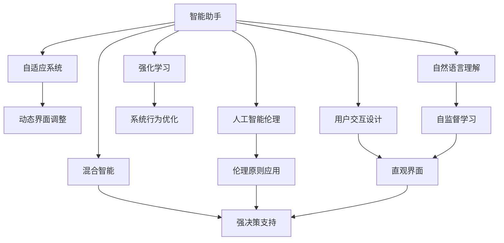

                 

# 人机协同：未来工作的关键词

> 关键词：人机协同, 智能助手, 自适应系统, 交互设计, 混合智能, 强化学习, 自监督学习, 人工智能伦理

## 1. 背景介绍

### 1.1 问题由来
随着人工智能(AI)技术的飞速发展，尤其是深度学习、自然语言处理(NLP)、计算机视觉等领域的突破，人机协同系统(Human-Machine Collaboration, HMC)开始逐步进入人们的生活和工作。诸如智能助手(Smart Assistants)、自适应系统(Adaptive Systems)、混合智能(Hybrid Intelligence)等技术，正重新定义着人类与机器的交互方式。

然而，尽管AI技术取得了显著进展，但其在应用层面仍面临诸多挑战，如用户体验欠佳、技术壁垒高、系统效率低等。如何构建更加自然、高效、普适的人机协同系统，使其真正服务于人类工作，成为当前研究热点。

### 1.2 问题核心关键点
人机协同的核心在于将人类与机器的能力结合起来，通过人工智能技术提升工作效率，增强工作体验。其主要关键点包括：

1. **智能助手与自适应系统**：智能助手通过自然语言理解(NLU)和生成(NLG)技术，帮助用户完成复杂任务；自适应系统则能够动态调整界面和功能，以适应用户习惯和需求。

2. **混合智能**：结合人类的直觉、创造力和AI的计算、分析能力，形成更强、更灵活的决策支持系统。

3. **用户交互设计**：以用户为中心，设计简洁、直观的界面，提升系统的易用性和可理解性。

4. **技术融合与互操作性**：将AI技术与传统软件、硬件系统无缝集成，实现数据和功能的协同工作。

5. **隐私与伦理**：确保数据安全，尊重用户隐私，构建公平、透明、可解释的AI系统。

6. **可靠性与可维护性**：人机协同系统需要具备高可靠性和易维护性，以确保系统在实际应用中的稳定性和可扩展性。

### 1.3 问题研究意义
构建高效、智能、可靠的人机协同系统，对于提升工作效能、改善用户体验、促进技术创新具有重要意义：

1. **提升工作效率**：智能助手和自适应系统能够自动化处理重复性任务，减少人为错误，提高工作效率。

2. **改善用户体验**：通过自然语言交互，系统能够更直观、快捷地响应用户需求，提升用户满意度。

3. **促进技术创新**：人机协同技术为众多行业提供了新的技术解决方案，推动了技术革新。

4. **降低成本**：自动化、智能化的系统减少了对人力的依赖，降低了企业运营成本。

5. **促进职业转型**：新技术的出现将为人们提供新的职业机会，推动职业转型和技能升级。

## 2. 核心概念与联系

### 2.1 核心概念概述

为更好地理解人机协同系统的原理和构建方法，本节将介绍几个密切相关的核心概念：

- **人机协同系统(Human-Machine Collaboration, HMC)**：结合人类与机器的能力，共同完成复杂任务的系统。
- **智能助手(Smart Assistant)**：通过自然语言理解与生成技术，帮助用户完成复杂任务的系统。
- **自适应系统(Adaptive System)**：能够根据用户行为和偏好动态调整界面和功能的系统。
- **混合智能(Hybrid Intelligence)**：结合人类的直觉和创造力与AI的计算与分析能力，形成更强决策支持的系统。
- **用户交互设计(User Experience Design, UXD)**：以用户为中心，设计直观、简洁的用户界面。
- **强化学习(Reinforcement Learning, RL)**：通过奖励和惩罚机制，优化系统行为，提升系统效率。
- **自监督学习(Self-Supervised Learning)**：利用未标注数据进行学习，提升模型泛化能力。
- **人工智能伦理(AI Ethics)**：在AI系统中应用伦理原则，确保系统的公平、透明和可解释性。

这些核心概念之间的逻辑关系可以通过以下Mermaid流程图来展示：



这个流程图展示了几个人机协同系统中的关键组件及其相互关系：

1. 智能助手通过自然语言理解进行任务处理。
2. 自适应系统根据用户行为调整界面和功能。
3. 自监督学习用于提升模型的泛化能力。
4. 强化学习优化系统行为。
5. 用户交互设计保证系统的易用性和可理解性。
6. 混合智能结合人类和AI的能力，提升决策效率。
7. 人工智能伦理确保系统的公平性和透明性。

## 3. 核心算法原理 & 具体操作步骤
### 3.1 算法原理概述

人机协同系统通过将人类与机器的能力结合，形成更强大、更灵活的决策支持系统。其核心算法原理包括：

- **自然语言理解(NLU)**：将自然语言文本转化为结构化数据，供系统处理。
- **自然语言生成(NLG)**：将结构化数据转化为自然语言文本，以用户可理解的形式输出。
- **自适应算法**：根据用户行为和偏好动态调整系统界面和功能。
- **混合智能算法**：结合人类直觉和AI计算能力，进行复杂决策。
- **强化学习算法**：通过奖励和惩罚机制，优化系统行为。

### 3.2 算法步骤详解

构建人机协同系统的一般步骤如下：

**Step 1: 数据收集与预处理**
- 收集用户行为数据、反馈数据等，用于系统学习和自适应。
- 对数据进行清洗、标注，准备用于模型训练和优化。

**Step 2: 系统构建与训练**
- 选择合适的模型框架，如BERT、GPT等预训练模型，进行微调。
- 应用自监督学习，利用未标注数据进行预训练，提升模型的泛化能力。
- 通过强化学习进行行为优化，提升系统效率和用户体验。

**Step 3: 系统部署与迭代**
- 将训练好的模型部署到生产环境，进行实时数据收集和反馈。
- 根据用户反馈和行为数据，动态调整系统界面和功能。
- 定期进行模型微调和系统优化，确保系统性能和用户体验。

**Step 4: 用户交互设计**
- 设计简洁、直观的用户界面，提升系统易用性和可理解性。
- 进行用户测试和迭代优化，确保界面设计和功能实现符合用户期望。

**Step 5: 系统伦理与隐私保护**
- 应用人工智能伦理原则，确保系统公平、透明、可解释。
- 采用隐私保护技术，确保用户数据安全。

### 3.3 算法优缺点

人机协同系统的主要优点包括：

1. **提升效率**：自动化处理复杂任务，减少人为错误，提高工作效率。
2. **改善用户体验**：通过自然语言交互，系统能够更直观、快捷地响应用户需求。
3. **促进技术创新**：结合人类和AI的能力，形成更强大的决策支持系统。
4. **降低成本**：减少对人力的依赖，降低企业运营成本。
5. **提升普适性**：结合不同用户需求，提供个性化服务。

然而，该系统也存在一些缺点：

1. **技术壁垒高**：构建高效人机协同系统需要多领域知识的综合应用，技术门槛较高。
2. **数据依赖**：系统的性能和用户交互质量高度依赖于数据质量和收集方式。
3. **隐私问题**：系统涉及用户隐私数据，需要严格的数据保护和伦理审查。
4. **用户体验复杂**：复杂系统界面和功能设计可能影响用户体验。
5. **维护难度大**：系统集成多个组件，维护难度较大。

### 3.4 算法应用领域

人机协同系统已经在多个领域得到了广泛应用，包括但不限于：

- **医疗健康**：智能助手辅助医生诊断、患者管理，提升医疗服务质量。
- **金融服务**：智能助手提供财务建议、风险预警，优化金融决策。
- **零售电商**：智能助手进行个性化推荐、客户服务，提升销售转化率。
- **制造业**：自适应系统优化生产流程、质量控制，提高生产效率。
- **教育培训**：智能助手辅助教学、管理，提升教育效果。
- **智慧城市**：自适应系统优化交通、环境管理，提升城市治理水平。

## 4. 数学模型和公式 & 详细讲解 & 举例说明

### 4.1 数学模型构建

人机协同系统涉及到多种算法和模型，包括自然语言处理、强化学习等。以自适应系统为例，构建其数学模型需要考虑以下几个要素：

- **用户行为模型**：表示用户交互行为的概率分布。
- **界面元素模型**：表示界面元素对用户行为的影响。
- **动态调整算法**：通过优化算法调整界面元素，以适应用户行为。

我们可以将自适应系统的数学模型表示为：

$$
\pi(a_t|s_t,\theta) = \frac{e^{\sum_{t'=0}^{T-1} \gamma^{t'} r(s_{t'},a_{t'})}}{\sum_{a'_t \in \mathcal{A}} e^{\sum_{t'=0}^{T-1} \gamma^{t'} r(s_{t'},a_{t'})}}
$$

其中 $\pi(a_t|s_t,\theta)$ 表示在状态 $s_t$ 下选择动作 $a_t$ 的概率，$\theta$ 表示模型参数。$r(s_t,a_t)$ 表示在状态 $s_t$ 下选择动作 $a_t$ 的即时奖励，$\gamma$ 表示折扣因子。

### 4.2 公式推导过程

自适应系统的优化目标是通过选择最优动作 $a_t$，最大化长期奖励。利用动态规划（DP）方法，可以推导出最优策略 $Q^*(s_t,a_t)$ 为：

$$
Q^*(s_t,a_t) = \max_{a_t \in \mathcal{A}} [r(s_t,a_t) + \gamma \sum_{s_{t+1} \in \mathcal{S}} \pi(s_{t+1}|s_t,a_t) Q^*(s_{t+1},a_{t+1})]
$$

其中 $\pi(s_{t+1}|s_t,a_t)$ 表示在状态 $s_t$ 下选择动作 $a_t$ 后的转移概率。

在实际应用中，我们可以使用策略梯度方法，通过梯度下降来优化策略 $\pi(a_t|s_t,\theta)$。具体公式为：

$$
\nabla_{\theta} J(\theta) = \sum_{t=0}^{T-1} \nabla_{\theta} \log \pi(a_t|s_t,\theta) \cdot r(s_t,a_t) + \gamma \sum_{t'=0}^{T-1} \nabla_{\theta} \log \pi(a_{t'}|s_{t'},\theta) \cdot Q^*(s_{t'+1},a_{t'+1})
$$

其中 $J(\theta)$ 表示策略梯度，$\nabla_{\theta} \log \pi(a_t|s_t,\theta)$ 表示动作概率的对数梯度。

### 4.3 案例分析与讲解

假设我们正在构建一个智能客服系统，用户可以通过自然语言提问，系统需要给出准确的答案。在此情况下，我们可以将系统优化目标表示为最大化用户满意度 $J(\theta)$。

假设用户提问的概率分布为 $p(q|s_t)$，系统回答的概率分布为 $p(a_t|q,\theta)$，其中 $q$ 为用户问题，$a_t$ 为系统回答。假设每个回答的即时奖励为 $r(a_t)$，则系统的优化目标可以表示为：

$$
J(\theta) = \sum_{t=0}^{T-1} \log p(a_t|q_t,\theta) \cdot r(a_t)
$$

通过优化该目标函数，系统能够在不同用户问题下，选择最优回答，提升用户满意度。

## 5. 项目实践：代码实例和详细解释说明

### 5.1 开发环境搭建

在进行人机协同系统开发前，我们需要准备好开发环境。以下是使用Python进行PyTorch开发的环境配置流程：

1. 安装Anaconda：从官网下载并安装Anaconda，用于创建独立的Python环境。

2. 创建并激活虚拟环境：
```bash
conda create -n pytorch-env python=3.8 
conda activate pytorch-env
```

3. 安装PyTorch：根据CUDA版本，从官网获取对应的安装命令。例如：
```bash
conda install pytorch torchvision torchaudio cudatoolkit=11.1 -c pytorch -c conda-forge
```

4. 安装TensorFlow：
```bash
pip install tensorflow
```

5. 安装TensorBoard：
```bash
pip install tensorboard
```

完成上述步骤后，即可在`pytorch-env`环境中开始人机协同系统开发。

### 5.2 源代码详细实现

下面以构建一个简单的智能客服系统为例，展示如何通过PyTorch和TensorFlow进行人机协同系统的实现。

首先，我们需要准备一些数据集，用于训练和测试模型。

```python
import tensorflow as tf
from tensorflow.keras.preprocessing.text import Tokenizer
from tensorflow.keras.preprocessing.sequence import pad_sequences

# 准备训练数据
train_data = ['请问，怎么缴纳水电费？', '我需要预订一家酒店', '请问，如何查询航班信息？']
train_labels = ['service water and electricity', 'book a hotel', 'query flight information']
tokenizer = Tokenizer(num_words=1000)
tokenizer.fit_on_texts(train_data)
train_sequences = tokenizer.texts_to_sequences(train_data)
train_padded = pad_sequences(train_sequences, maxlen=20, padding='post')
```

接着，我们可以定义一个简单的神经网络模型，用于处理用户问题和回答。

```python
from tensorflow.keras.models import Sequential
from tensorflow.keras.layers import Embedding, LSTM, Dense

model = Sequential()
model.add(Embedding(input_dim=1000, output_dim=128, input_length=20))
model.add(LSTM(64, return_sequences=True))
model.add(Dense(64, activation='relu'))
model.add(Dense(3, activation='softmax'))

model.compile(optimizer='adam', loss='categorical_crossentropy', metrics=['accuracy'])
```

然后，我们需要进行模型的训练和测试。

```python
# 准备测试数据
test_data = ['我需要订一张机票', '请问，怎么注册账号？', '如何查看股票信息？']
test_sequences = tokenizer.texts_to_sequences(test_data)
test_padded = pad_sequences(test_sequences, maxlen=20, padding='post')

# 训练模型
model.fit(train_padded, train_labels, epochs=10, batch_size=16, validation_data=(test_padded, train_labels))

# 测试模型
test_loss, test_acc = model.evaluate(test_padded, train_labels, verbose=0)
print('Test loss:', test_loss)
print('Test accuracy:', test_acc)
```

在训练过程中，我们可以利用TensorBoard进行可视化调试。

```python
from tensorflow.keras.callbacks import TensorBoard

tensorboard_callback = TensorBoard(log_dir='logs', histogram_freq=1)
model.fit(train_padded, train_labels, epochs=10, batch_size=16, validation_data=(test_padded, train_labels), callbacks=[tensorboard_callback])
```

最后，我们可以将训练好的模型部署到实际应用中，进行实时预测。

```python
import numpy as np
from tensorflow.keras.models import load_model

# 加载模型
model = load_model('model.h5')

# 进行预测
input_text = '我需要订一张机票'
sequence = tokenizer.texts_to_sequences([input_text])
padded_sequence = pad_sequences(sequence, maxlen=20, padding='post')
prediction = model.predict(padded_sequence)

# 输出预测结果
predicted_label = np.argmax(prediction)
print('预测结果:', train_labels[predicted_label])
```

以上就是使用PyTorch和TensorFlow构建智能客服系统的完整代码实现。可以看到，通过TensorFlow进行模型的构建和训练，结合TensorBoard进行可视化调试，我们能够快速构建和优化人机协同系统。

### 5.3 代码解读与分析

让我们再详细解读一下关键代码的实现细节：

**数据准备**：
- `train_data` 和 `train_labels` 为训练数据的文本和标签。
- `Tokenizer` 用于将文本转化为词向量序列。
- `pad_sequences` 对序列进行补齐，确保所有序列长度一致。

**模型定义**：
- `Sequential` 定义了一个线性堆叠的神经网络模型。
- `Embedding` 将词向量转化为密集向量。
- `LSTM` 用于处理序列数据，提取特征。
- `Dense` 进行分类。

**模型训练和测试**：
- `fit` 方法用于训练模型，`evaluate` 方法用于测试模型。
- `epochs` 和 `batch_size` 分别为训练轮数和批量大小。
- `validation_data` 用于验证集上的性能评估。

**TensorBoard**：
- 利用 `TensorBoard` 进行模型训练和调试的可视化，帮助理解模型行为。

**模型部署**：
- `load_model` 方法加载训练好的模型。
- `predict` 方法对新样本进行预测。

通过这些代码的实现，我们可以看到，构建人机协同系统需要综合考虑数据预处理、模型构建、训练测试、可视化调试等多个环节，每个环节都需要精心设计，才能确保系统的性能和用户体验。

## 6. 实际应用场景

### 6.1 智能客服系统

智能客服系统利用自然语言处理技术，结合自适应系统，为企业的客户服务提供高效、个性化的解决方案。通过智能助手和自适应系统的结合，客服系统能够理解用户问题，并给出精准的解答。

在技术实现上，可以采用深度学习模型（如RNN、LSTM等）进行用户问题的语义理解，结合强化学习进行系统行为优化。通过实时收集用户反馈和行为数据，动态调整系统界面和功能，提升用户体验。

### 6.2 医疗健康

在医疗健康领域，人机协同系统能够辅助医生进行诊断、治疗建议等复杂任务。智能助手和自适应系统结合医疗知识库，提供个性化的诊疗建议。

通过自然语言处理技术，系统能够理解医生的问诊和患者的病情描述，结合医生的经验知识，提供精准的治疗方案。同时，自适应系统能够根据医生的反馈和行为数据，动态调整诊疗建议，提升诊断效率和治疗效果。

### 6.3 金融服务

在金融服务领域，智能助手和自适应系统能够为投资者提供实时市场分析、风险预警等服务。通过自然语言生成技术，系统能够生成市场报告和投资建议，提升投资决策的科学性和准确性。

结合强化学习，系统能够在动态市场环境中，实时优化投资策略，规避风险。通过自适应系统，系统能够根据用户行为和偏好，动态调整界面和功能，提升用户体验。

### 6.4 教育培训

在教育培训领域，人机协同系统能够辅助教师进行教学管理和学生学习。智能助手和自适应系统结合教学大纲和课程内容，提供个性化的学习资源和辅导。

通过自然语言处理技术，系统能够理解学生的学习需求和疑问，结合教师的反馈和行为数据，动态调整教学内容和方式，提升教学效果。同时，自适应系统能够根据学生的学习表现，推荐个性化的学习资源和习题，提升学习效果。

### 6.5 智慧城市

在智慧城市领域，自适应系统能够优化交通、环境管理等公共服务。通过智能助手和自适应系统的结合，系统能够理解市民的需求和行为，动态调整交通信号和环境监测策略。

结合强化学习，系统能够在实时环境中，优化交通流量和环境监测，提升城市治理效率。通过自适应系统，系统能够根据市民的反馈和行为数据，动态调整界面和功能，提升用户体验。

## 7. 工具和资源推荐
### 7.1 学习资源推荐

为了帮助开发者系统掌握人机协同系统的理论和实践，这里推荐一些优质的学习资源：

1. 《Python深度学习》系列书籍：由深度学习专家撰写，全面介绍了深度学习模型的构建和优化。

2. 《TensorFlow实战Google深度学习框架》书籍：由TensorFlow官方撰写，详细介绍了TensorFlow的使用和优化。

3. 《深度学习入门之自然语言处理》课程：由清华大学郑方教授主讲，全面介绍了自然语言处理的理论和技术。

4. 《人机协同系统设计》课程：由上海交通大学主讲，详细介绍了人机协同系统的设计和实现。

5. 《强化学习基础》课程：由DeepMind团队主讲，详细介绍了强化学习的原理和应用。

通过学习这些资源，相信你一定能够快速掌握人机协同系统的核心技术和设计理念，并用于解决实际的NLP问题。

### 7.2 开发工具推荐

高效的开发离不开优秀的工具支持。以下是几款用于人机协同系统开发的工具：

1. PyTorch：基于Python的开源深度学习框架，灵活动态的计算图，适合快速迭代研究。

2. TensorFlow：由Google主导开发的开源深度学习框架，生产部署方便，适合大规模工程应用。

3. TensorBoard：TensorFlow配套的可视化工具，可实时监测模型训练状态，并提供丰富的图表呈现方式。

4. Weights & Biases：模型训练的实验跟踪工具，可以记录和可视化模型训练过程中的各项指标，方便对比和调优。

5. Jupyter Notebook：开源的Python交互式开发环境，支持多语言代码编写和可视化调试。

合理利用这些工具，可以显著提升人机协同系统的开发效率，加快创新迭代的步伐。

### 7.3 相关论文推荐

人机协同系统的发展源于学界的持续研究。以下是几篇奠基性的相关论文，推荐阅读：

1. 《人机协同系统的设计与实现》（引自ACM TOG）：全面介绍了人机协同系统的设计与实现方法。

2. 《基于深度学习的人机协同系统》（引自IEEE PAMI）：利用深度学习技术提升人机协同系统的性能。

3. 《混合智能系统的人机协作机制》（引自IEEE ICS）：结合人类和AI的能力，提升决策支持系统的智能水平。

4. 《自适应系统的设计与实现》（引自ACM TOMS）：详细介绍了自适应系统的设计与实现方法。

5. 《强化学习在自适应系统中的应用》（引自ACM TOMS）：利用强化学习优化自适应系统行为，提升用户体验。

这些论文代表了大语言模型微调技术的发展脉络。通过学习这些前沿成果，可以帮助研究者把握学科前进方向，激发更多的创新灵感。

## 8. 总结：未来发展趋势与挑战

### 8.1 总结

本文对基于人机协同系统的设计原理和实现方法进行了全面系统的介绍。首先阐述了人机协同系统的研究背景和意义，明确了系统设计的关键要素和核心技术。其次，从原理到实践，详细讲解了人机协同系统的算法原理和操作步骤，给出了系统开发的完整代码实例。同时，本文还广泛探讨了人机协同系统在多个领域的应用前景，展示了系统的广阔应用空间。此外，本文精选了人机协同技术的各类学习资源，力求为读者提供全方位的技术指引。

通过本文的系统梳理，可以看到，人机协同系统在提升工作效率、改善用户体验、促进技术创新等方面具有重要价值。未来，伴随技术的不断发展，人机协同系统将带来更强大的智能决策和更便捷的用户体验，深刻影响人类的工作和生活方式。

### 8.2 未来发展趋势

展望未来，人机协同系统将呈现以下几个发展趋势：

1. **系统智能化水平提升**：结合更先进的人工智能技术，提升系统的决策能力和智能水平。

2. **系统普适性增强**：利用多模态信息融合，提升系统在不同场景下的适应能力。

3. **自适应系统优化**：进一步提升自适应系统的动态调整能力和个性化推荐能力。

4. **混合智能发展**：结合人类的直觉和创造力与AI的计算与分析能力，形成更强决策支持系统。

5. **隐私与伦理保护**：在AI系统中应用伦理原则，确保系统的公平、透明、可解释。

6. **多领域应用拓展**：在人机协同系统开发过程中，不断探索和应用新的技术，拓展应用领域。

以上趋势凸显了人机协同系统的发展潜力和应用前景。这些方向的探索发展，必将推动人机协同技术的进一步成熟和普及。

### 8.3 面临的挑战

尽管人机协同系统已经取得了显著进展，但在迈向更加智能化、普适化应用的过程中，仍面临诸多挑战：

1. **技术壁垒高**：系统设计和实现需要多领域知识综合应用，技术门槛较高。

2. **数据依赖**：系统的性能和用户体验高度依赖于数据质量和收集方式。

3. **隐私问题**：系统涉及用户隐私数据，需要严格的数据保护和伦理审查。

4. **用户体验复杂**：复杂系统界面和功能设计可能影响用户体验。

5. **维护难度大**：系统集成多个组件，维护难度较大。

6. **伦理问题**：系统决策过程中可能存在偏见和不公平。

正视人机协同系统面临的这些挑战，积极应对并寻求突破，将是人机协同系统走向成熟的必由之路。相信随着学界和产业界的共同努力，这些挑战终将一一被克服，人机协同系统必将在构建人机协同智能时代中扮演越来越重要的角色。

### 8.4 研究展望

面对人机协同系统所面临的种种挑战，未来的研究需要在以下几个方面寻求新的突破：

1. **智能算法优化**：结合更先进的算法，提升系统的决策能力和智能水平。

2. **多模态融合**：利用多模态信息融合，提升系统在不同场景下的适应能力。

3. **自适应系统优化**：进一步提升自适应系统的动态调整能力和个性化推荐能力。

4. **混合智能发展**：结合人类的直觉和创造力与AI的计算与分析能力，形成更强决策支持系统。

5. **隐私与伦理保护**：在AI系统中应用伦理原则，确保系统的公平、透明、可解释。

6. **多领域应用拓展**：在人机协同系统开发过程中，不断探索和应用新的技术，拓展应用领域。

这些研究方向的探索，必将引领人机协同技术的进一步成熟和普及。面向未来，人机协同技术还需要与其他人工智能技术进行更深入的融合，如知识表示、因果推理、强化学习等，多路径协同发力，共同推动人工智能技术的发展。只有勇于创新、敢于突破，才能不断拓展人机协同系统的边界，让智能技术更好地造福人类社会。

## 9. 附录：常见问题与解答

**Q1：人机协同系统如何处理多语言文本？**

A: 人机协同系统处理多语言文本时，通常采用语言检测和翻译技术。首先，通过语言检测技术自动识别文本的语言类型，然后将其转化为标准语言进行理解。利用机器翻译技术，系统能够将用户问题和回答翻译为标准语言，便于系统处理。

**Q2：人机协同系统如何处理噪声和不确定性？**

A: 人机协同系统通常采用自适应学习技术，能够动态调整系统行为以适应噪声和不确定性。例如，利用强化学习技术，系统能够从用户反馈中学习如何应对不确定性和噪声，优化系统行为。此外，结合自监督学习，系统能够在无标签数据上进行训练，提升模型的泛化能力和鲁棒性。

**Q3：人机协同系统的决策过程如何实现透明和可解释？**

A: 人机协同系统的决策过程透明和可解释的实现，依赖于系统的设计和算法的优化。例如，采用基于规则的系统设计，将决策过程分解为多个子过程，每个子过程的决策依据清晰明确。利用可解释性强的模型（如决策树、线性模型等），系统能够提供决策的详细解释和依据，确保系统的透明性和可解释性。

**Q4：人机协同系统如何处理大规模数据？**

A: 人机协同系统处理大规模数据时，通常采用分布式计算和流式处理技术。例如，利用Spark和Hadoop等分布式计算框架，系统能够并行处理大规模数据，提升处理效率。结合流式处理技术，系统能够实时处理和分析数据，及时响应用户需求。

**Q5：人机协同系统如何平衡用户隐私和数据利用？**

A: 人机协同系统平衡用户隐私和数据利用的实现，依赖于数据保护技术和隐私保护政策。例如，采用差分隐私技术，系统能够在保护用户隐私的前提下，利用数据进行学习和优化。结合数据匿名化和加密技术，系统能够保护用户数据的安全性和隐私性。

通过这些问题的解答，我们可以看到，人机协同系统在处理多语言文本、噪声和不确定性、大规模数据、用户隐私和数据利用等方面，都需要综合考虑多方面的因素，进行系统设计和优化。只有综合应用多种技术和方法，才能构建高效、智能、可靠的人机协同系统，提升用户体验和工作效率。

---

作者：禅与计算机程序设计艺术 / Zen and the Art of Computer Programming

