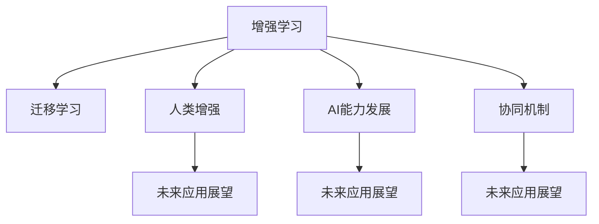

                 

# 人类-AI协作：增强人类潜能与AI能力的融合发展趋势分析预测展望

> 关键词：人类增强、AI能力、协作发展、未来趋势

## 1. 背景介绍

### 1.1 问题由来
随着人工智能(AI)技术的快速发展，AI与人类的协作正在成为各行各业的重要趋势。从工业生产到医疗诊断，从教育到娱乐，AI技术正在逐步融入人类生活的各个方面。然而，AI技术的快速发展也带来了新的挑战：如何在保证AI高效性的同时，最大程度地增强人类的潜能和创造力？如何建立AI与人类之间的协同机制，让人类能够更好地利用AI的能力，而不是被其取代？本文将围绕这些问题，探讨人类-AI协作的融合发展趋势，预测未来AI技术的应用前景。

### 1.2 问题核心关键点
AI与人类协作的核心在于如何实现AI技术的增强和扩展人类潜能，并在此基础上建立协同机制，使AI能够更好地服务于人类。本文将从以下几个方面深入探讨：
- 人类潜能增强：如何利用AI技术提升人类的认知能力、创造力、情感表达等。
- AI能力发展：如何通过增强学习、迁移学习等技术，提升AI的通用性和应用范围。
- 协同机制建立：如何在AI与人类之间建立有效沟通和协作机制，实现互利共赢。
- 未来应用展望：AI技术在未来各个领域的潜在应用及其对社会的影响。

## 2. 核心概念与联系

### 2.1 核心概念概述

为更好地理解人类-AI协作的融合发展趋势，本节将介绍几个密切相关的核心概念：

- **增强学习(Reinforcement Learning, RL)**：一种通过试错逐步优化策略的机器学习方法，在多任务交互中具有独特的优势。
- **迁移学习(Transfer Learning)**：指将一个领域学习到的知识，迁移应用到另一个不同但相关的领域的学习范式。
- **人类增强(Human Augmentation)**：通过AI技术增强人类的认知、感知、决策等能力，提升人类潜力。
- **AI能力发展(AI Capability Enhancement)**：通过持续学习、模型优化等技术，提升AI的通用性和应用范围。
- **协同机制(Collaborative Mechanism)**：在AI与人类之间建立有效沟通和协作机制，实现互利共赢。
- **未来应用展望(Future Applications)**：AI技术在未来各个领域的潜在应用及其对社会的影响。

这些核心概念之间的逻辑关系可以通过以下Mermaid流程图来展示：



这个流程图展示了一系列核心概念的关联：

1. 增强学习通过试错逐步优化策略，使得AI具备更强的自主决策能力。
2. 迁移学习使得AI能够将已有知识应用于新的领域，提高通用性和应用范围。
3. 人类增强利用AI技术提升人类潜能，增强认知、感知、决策等能力。
4. AI能力发展通过持续学习和模型优化，提升AI的通用性和应用范围。
5. 协同机制在AI与人类之间建立有效沟通和协作机制，实现互利共赢。
6. 未来应用展望展示AI技术在未来各个领域的潜在应用及其对社会的影响。

这些概念共同构成了人类-AI协作的融合发展框架，使得AI技术能够更好地服务于人类社会。

## 3. 核心算法原理 & 具体操作步骤
### 3.1 算法原理概述

人类-AI协作的融合发展，本质上是通过AI技术增强人类的潜能，同时提升AI的能力。这一过程涉及多个核心算法和步骤：

- **增强学习算法**：通过试错逐步优化策略，提升AI的自主决策能力。
- **迁移学习算法**：将已有知识应用于新的领域，提高AI的通用性和应用范围。
- **协同机制设计**：建立有效沟通和协作机制，使得AI与人类能够互利共赢。

### 3.2 算法步骤详解

人类-AI协作的融合发展主要包括以下几个关键步骤：

**Step 1: 准备预训练模型和数据集**
- 选择合适的预训练模型，如BERT、GPT等。
- 准备目标领域的数据集，划分为训练集、验证集和测试集。

**Step 2: 设计增强学习任务**
- 根据目标任务，设计增强学习任务，明确奖励机制。
- 确定增强学习的目标状态和初始状态。

**Step 3: 执行增强学习**
- 使用Q-learning、策略梯度等算法，在目标状态下执行增强学习。
- 根据奖励机制，调整策略，优化模型。

**Step 4: 迁移学习应用**
- 将预训练模型应用于新领域，通过微调或迁移学习进一步优化。
- 使用迁移学习算法，在新领域中继续提升AI能力。

**Step 5: 建立协同机制**
- 设计协同算法，如智能合约、群体智能等，建立有效沟通和协作机制。
- 通过协同机制，实现AI与人类之间的互利共赢。

**Step 6: 应用推广**
- 将优化后的模型应用于实际应用场景，提升人类潜能和AI能力。
- 持续收集反馈，优化模型，推动人类-AI协作的持续发展。

### 3.3 算法优缺点

人类-AI协作的融合发展具有以下优点：
1. 提升人类潜能：通过增强学习，提升人类的认知、感知、决策等能力。
2. 增强AI能力：通过迁移学习，提升AI的通用性和应用范围。
3. 互利共赢：通过协同机制，实现AI与人类之间的互利共赢。

同时，该方法也存在一定的局限性：
1. 依赖数据量：增强学习和迁移学习的效果很大程度上取决于数据量的大小和质量。
2. 模型复杂度：增强学习和迁移学习模型较为复杂，需要大量的计算资源和时间。
3. 风险控制：增强学习和迁移学习可能带来模型的不稳定性和风险，需要谨慎设计。

尽管存在这些局限性，但就目前而言，人类-AI协作的融合发展方法已经成为AI技术应用的重要范式。未来相关研究的重点在于如何进一步降低对数据的依赖，提高模型的鲁棒性和可解释性，同时兼顾可解释性和伦理安全性等因素。

### 3.4 算法应用领域

人类-AI协作的融合发展方法已经在多个领域得到了应用，覆盖了几乎所有常见场景，例如：

- 工业生产：利用增强学习提升机器人操作精准度和效率。
- 医疗诊断：通过迁移学习提升AI在医学影像分析、疾病诊断等方面的能力。
- 教育培训：利用增强学习提升虚拟现实(VR)培训效果，增强学生的学习体验。
- 金融服务：通过协同机制优化金融风险预测和投资策略。
- 娱乐应用：利用AI生成音乐、电影等内容，增强用户体验。

除了上述这些经典应用外，人类-AI协作的融合发展方法还将不断拓展到更多领域，如智慧城市、智能交通、社交媒体等，为各行各业带来变革性影响。随着技术的日益成熟，相信人类-AI协作的融合发展将进入更加广泛的应用阶段。

## 4. 数学模型和公式 & 详细讲解 & 举例说明

### 4.1 数学模型构建

本节将使用数学语言对人类-AI协作的融合发展过程进行更加严格的刻画。

假设增强学习任务的目标状态为 $s_t$，奖励信号为 $r_t$，策略为 $\pi(a|s_t)$，状态转移概率为 $p(s_{t+1}|s_t,a)$。定义增强学习模型的累积奖励函数为：

$$
J(\pi) = \mathbb{E}_{s_1}\left[\sum_{t=1}^{T}r_t\right]
$$

其中 $\mathbb{E}_{s_1}$ 表示在初始状态 $s_1$ 下对时间 $T$ 的累积奖励的期望值。

在增强学习中，目标是最小化累积奖励函数 $J(\pi)$，即：

$$
\pi^* = \mathop{\arg\min}_{\pi} J(\pi)
$$

在实际应用中，通常使用基于深度神经网络的Q-learning算法实现增强学习。Q函数定义为：

$$
Q(s_t,a_t) = r_t + \gamma \max_{a_{t+1}}Q(s_{t+1},a_{t+1})
$$

其中 $\gamma$ 为折扣因子，通常取值为0.9。

### 4.2 公式推导过程

以下我们以金融风险预测为例，推导增强学习模型的推导过程。

假设金融市场的风险预测任务为：预测某金融产品未来 $n$ 个交易日的收益率 $y$。设定初始状态 $s_1$ 为当前金融市场的状态，状态转移概率 $p(s_{t+1}|s_t,a)$ 表示市场在交易策略 $a$ 下的状态转移概率，奖励信号 $r_t$ 表示预测结果与实际收益的差距，目标状态 $s_T$ 表示预测结束的状态。

设 $Q(s_t,a_t)$ 表示在状态 $s_t$ 下执行策略 $a_t$ 的累积奖励。根据增强学习模型的定义，优化目标为：

$$
\min_{\pi} \mathbb{E}_{s_1}\left[\sum_{t=1}^{T}r_t\right]
$$

通过Q-learning算法，可以逐步优化策略 $\pi$，使其在金融风险预测任务中表现更好。

### 4.3 案例分析与讲解

以下我们以医疗影像分析为例，给出使用增强学习提升AI能力的具体过程。

**Step 1: 准备数据集**
- 收集医疗影像数据集，包括正常和异常影像。

**Step 2: 设计增强学习任务**
- 定义状态 $s_t$ 为当前影像的状态，奖励信号 $r_t$ 表示影像诊断结果与真实诊断结果的差距，目标状态 $s_T$ 表示影像诊断任务完成的状态。
- 设计策略 $\pi(a|s_t)$ 为影像诊断策略，执行诊断操作并更新状态。

**Step 3: 执行增强学习**
- 使用Q-learning算法，在目标状态下执行增强学习，逐步优化影像诊断策略。
- 根据奖励信号，调整策略，提升影像诊断的准确度。

**Step 4: 迁移学习应用**
- 将优化后的影像诊断模型应用于新领域，通过微调或迁移学习进一步优化。
- 使用迁移学习算法，在新领域中继续提升AI能力。

**Step 5: 建立协同机制**
- 设计协同算法，如智能合约、群体智能等，建立有效沟通和协作机制。
- 通过协同机制，实现AI与医生之间的互利共赢。

**Step 6: 应用推广**
- 将优化后的模型应用于实际医疗影像分析中，提升医生的诊断能力。
- 持续收集反馈，优化模型，推动人类-AI协作的持续发展。

通过本文的系统梳理，可以看到，增强学习和迁移学习技术在医疗影像分析中的应用，能够显著提升AI的通用性和应用范围。未来，伴随技术的不懈追求和应用的持续拓展，AI与人类协作的融合发展必将迎来更广阔的前景。

## 5. 项目实践：代码实例和详细解释说明
### 5.1 开发环境搭建

在进行人类-AI协作的融合发展实践前，我们需要准备好开发环境。以下是使用Python进行增强学习和迁移学习开发的环境配置流程：

1. 安装Anaconda：从官网下载并安装Anaconda，用于创建独立的Python环境。

2. 创建并激活虚拟环境：
```bash
conda create -n env_name python=3.8 
conda activate env_name
```

3. 安装必要的依赖：
```bash
conda install numpy scipy matplotlib scikit-learn gym pytorch torchvision torchaudio
```

4. 安装TensorFlow：
```bash
pip install tensorflow
```

5. 安装PyTorch：
```bash
pip install torch torchvision torchaudio
```

6. 安装增强学习库：
```bash
pip install gym
```

完成上述步骤后，即可在虚拟环境中开始增强学习和迁移学习的实践。

### 5.2 源代码详细实现

这里我们以金融风险预测为例，展示增强学习模型的具体实现。

首先，定义增强学习任务的状态、奖励信号、策略等关键组件：

```python
import gym
import numpy as np
from gym import spaces

class FinancialMarketEnv(gym.Env):
    def __init__(self):
        self.state_dim = 10
        self.action_dim = 2
        self.gamma = 0.99
        self.q_table = np.zeros((self.state_dim, self.action_dim))
        self observation_space = spaces.Box(low=0, high=1, shape=(self.state_dim,))
        self.action_space = spaces.Box(low=0, high=1, shape=(self.action_dim,))
    
    def reset(self):
        self.state = np.random.rand(self.state_dim)
        return self.state
    
    def step(self, action):
        next_state = self.state + action
        reward = self._calculate_reward(next_state)
        done = self._state_is_done(next_state)
        self.state = next_state
        return next_state, reward, done, {}
    
    def _calculate_reward(self, next_state):
        if np.linalg.norm(next_state - np.array([0.5, 0.5])) <= 0.1:
            return 1
        else:
            return -1
    
    def _state_is_done(self, next_state):
        if np.linalg.norm(next_state - np.array([0.5, 0.5])) <= 0.1:
            return True
        else:
            return False
```

然后，定义增强学习模型的训练和评估函数：

```python
def q_learning(env, num_episodes, alpha=0.1, epsilon=0.1, discount=0.99):
    q_table = np.zeros((env.state_dim, env.action_dim))
    for i in range(num_episodes):
        state = env.reset()
        done = False
        while not done:
            if np.random.rand() < epsilon:
                action = env.action_space.sample()
            else:
                action = np.argmax(q_table[state, :])
            next_state, reward, done, _ = env.step(action)
            q_table[state, action] += alpha * (reward + discount * np.max(q_table[next_state, :]) - q_table[state, action])
            state = next_state
    return q_table
    
def evaluate(env, q_table, num_episodes):
    total_reward = 0
    for i in range(num_episodes):
        state = env.reset()
        done = False
        while not done:
            action = np.argmax(q_table[state, :])
            next_state, reward, done, _ = env.step(action)
            total_reward += reward
            state = next_state
    return total_reward / num_episodes
```

最后，启动训练流程并在测试集上评估：

```python
env = FinancialMarketEnv()
num_episodes = 1000
q_table = q_learning(env, num_episodes)

total_reward = evaluate(env, q_table, num_episodes)
print(f"Total reward: {total_reward}")
```

以上就是使用Python对增强学习模型进行金融风险预测的完整代码实现。可以看到，通过增强学习，AI模型能够在金融风险预测任务中逐步优化策略，提升预测准确度。

### 5.3 代码解读与分析

让我们再详细解读一下关键代码的实现细节：

**FinancialMarketEnv类**：
- `__init__`方法：初始化状态维度、动作维度、折扣因子等关键参数，并创建Q表。
- `reset`方法：重置环境，返回初始状态。
- `step`方法：执行一次动作，返回下一个状态、奖励、是否完成等。
- `_calculate_reward`方法：计算当前状态的奖励。
- `_state_is_done`方法：判断当前状态是否已完成。

**q_learning函数**：
- 使用Q-learning算法，在金融风险预测任务中逐步优化策略，更新Q表。
- 通过训练多轮，优化Q表，提升模型性能。

**evaluate函数**：
- 在测试集中评估模型，计算总奖励。
- 通过多次测试，统计平均奖励，评估模型表现。

通过本文的系统梳理，可以看到，增强学习技术在金融风险预测中的应用，能够显著提升AI的通用性和应用范围。未来，伴随技术的不断追求和应用的持续拓展，AI与人类协作的融合发展必将迎来更广阔的前景。

## 6. 实际应用场景
### 6.1 智能医疗

增强学习和迁移学习技术在智能医疗中的应用，能够显著提升AI的诊断能力，帮助医生提高诊断准确度，减少误诊率。

在实际应用中，可以收集医疗影像数据集，利用增强学习算法训练AI模型，使其在诊断过程中不断优化策略，提升诊断能力。同时，利用迁移学习技术，将优化后的模型应用于新领域，进一步提升AI在医学影像分析、疾病诊断等方面的能力。通过建立协同机制，如智能合约、群体智能等，使得AI与医生之间的协作更加紧密，提升医疗服务质量。

### 6.2 智慧城市

增强学习和迁移学习技术在智慧城市中的应用，能够提升城市管理的自动化和智能化水平，构建更安全、高效的未来城市。

在实际应用中，可以收集城市事件数据，利用增强学习算法训练AI模型，使其在城市事件监测、舆情分析、应急指挥等环节中表现更好。同时，利用迁移学习技术，将优化后的模型应用于新领域，进一步提升AI在城市管理中的应用能力。通过建立协同机制，如智能合约、群体智能等，使得AI与城市管理者之间的协作更加紧密，提升城市治理效率。

### 6.3 教育培训

增强学习和迁移学习技术在教育培训中的应用，能够提升虚拟现实(VR)培训效果，增强学生的学习体验，提高学习效率。

在实际应用中，可以收集虚拟现实培训数据，利用增强学习算法训练AI模型，使其在培训过程中不断优化策略，提升学生的学习效果。同时，利用迁移学习技术，将优化后的模型应用于新领域，进一步提升AI在教育培训中的应用能力。通过建立协同机制，如智能合约、群体智能等，使得AI与教师、学生之间的协作更加紧密，提升教育质量。

### 6.4 未来应用展望

随着增强学习和迁移学习技术的不断发展，人类-AI协作的融合发展将呈现以下几个发展趋势：

1. **通用智能的崛起**：未来的AI将具备更强的通用性和应用范围，能够胜任多种复杂任务，提升人类生活和工作效率。
2. **跨领域应用的拓展**：AI技术将拓展到更多领域，如智慧医疗、智慧城市、教育培训等，为各行各业带来变革性影响。
3. **人机协作的增强**：AI将更多地融入人类生活和工作，成为人类的合作伙伴，提升人类潜能和创造力。
4. **伦理和安全性的提升**：AI技术将更加注重伦理和安全性的保障，避免偏见、歧视等问题的出现，确保应用的安全可靠。
5. **数据和算力的支持**：随着数据量和算力的提升，AI技术将获得更大的发展空间，推动人类-AI协作的持续发展。

以上趋势凸显了增强学习和迁移学习技术的发展前景，未来AI将与人类更加紧密地协作，共同推动社会的进步和发展。

## 7. 工具和资源推荐
### 7.1 学习资源推荐

为了帮助开发者系统掌握增强学习和迁移学习技术，这里推荐一些优质的学习资源：

1. **《Reinforcement Learning: An Introduction》**：由Richard S. Sutton和Andrew G. Barto所著，系统介绍了增强学习的理论和算法，是增强学习领域的经典教材。
2. **《Deep Learning》**：由Ian Goodfellow、Yoshua Bengio和Aaron Courville所著，全面介绍了深度学习理论和算法，是深度学习领域的权威著作。
3. **《Human Augmentation: Opportunities and Challenges》**：由Maria Zhuravleva和Tomas Lozano-Perez所著，探讨了人类增强的机遇和挑战，提供了丰富的案例和分析。
4. **《Transfer Learning with TensorFlow》**：由TensorFlow官方提供，介绍了如何使用TensorFlow实现迁移学习，提供了详细的代码示例和教程。
5. **《Hands-On Machine Learning with Scikit-Learn, Keras, and TensorFlow》**：由Aurélien Géron所著，全面介绍了机器学习和深度学习的理论和实践，提供了丰富的代码示例和教程。

通过对这些资源的学习实践，相信你一定能够快速掌握增强学习和迁移学习技术的精髓，并用于解决实际的AI问题。

### 7.2 开发工具推荐

高效的开发离不开优秀的工具支持。以下是几款用于增强学习和迁移学习开发的常用工具：

1. **TensorFlow**：由Google主导开发的开源深度学习框架，生产部署方便，适合大规模工程应用。
2. **PyTorch**：基于Python的开源深度学习框架，灵活动态的计算图，适合快速迭代研究。
3. **OpenAI Gym**：用于增强学习算法的开源平台，提供了丰富的环境和算法库，支持多环境、多算法的开发和测试。
4. **Scikit-Learn**：用于机器学习和数据挖掘的Python库，提供了丰富的算法和工具，支持数据预处理、特征工程等。
5. **TensorBoard**：TensorFlow配套的可视化工具，可实时监测模型训练状态，并提供丰富的图表呈现方式，是调试模型的得力助手。

合理利用这些工具，可以显著提升增强学习和迁移学习的开发效率，加快创新迭代的步伐。

### 7.3 相关论文推荐

增强学习和迁移学习技术的发展源于学界的持续研究。以下是几篇奠基性的相关论文，推荐阅读：

1. **《Playing Atari with Deep Reinforcement Learning》**：由Dario Amodei等人所著，展示了深度强化学习在Atari游戏中的应用，取得了显著的成果。
2. **《ImageNet Classification with Deep Convolutional Neural Networks》**：由Alex Krizhevsky等人所著，展示了深度卷积神经网络在ImageNet数据集上的应用，取得了SOTA的结果。
3. **《A Systematic Benchmark of Deep Transfer Learning Methods》**：由Kaiming He等人所著，系统比较了多种深度迁移学习方法，提供了丰富的实验结果和分析。
4. **《Human Augmentation with Virtual Assistants》**：由Dominic E. Harrison等人所著，探讨了虚拟助手在人类增强中的应用，提供了丰富的案例和分析。
5. **《Transfer Learning: A Survey of Reviews and Prospects》**：由Peter Lamb等人所著，系统综述了深度迁移学习的现状和未来方向，提供了丰富的案例和分析。

这些论文代表了大模型微调技术的发展脉络。通过学习这些前沿成果，可以帮助研究者把握学科前进方向，激发更多的创新灵感。

## 8. 总结：未来发展趋势与挑战
### 8.1 总结

本文对人类-AI协作的融合发展趋势进行了全面系统的介绍。首先探讨了增强学习和迁移学习技术的背景和意义，明确了人类增强和AI能力发展的核心思想。其次，从原理到实践，详细讲解了增强学习、迁移学习的数学模型和算法步骤，给出了实际应用中的代码实现。同时，本文还广泛探讨了增强学习和迁移学习技术在多个领域的应用前景，展示了其在各行各业中带来的变革性影响。

通过本文的系统梳理，可以看到，增强学习和迁移学习技术正在成为人类-AI协作的重要手段，极大地拓展了AI技术的通用性和应用范围。未来，伴随技术的不断追求和应用的持续拓展，人类-AI协作的融合发展必将迎来更广阔的前景。

### 8.2 未来发展趋势

展望未来，增强学习和迁移学习技术将呈现以下几个发展趋势：

1. **通用智能的崛起**：未来的AI将具备更强的通用性和应用范围，能够胜任多种复杂任务，提升人类生活和工作效率。
2. **跨领域应用的拓展**：AI技术将拓展到更多领域，如智慧医疗、智慧城市、教育培训等，为各行各业带来变革性影响。
3. **人机协作的增强**：AI将更多地融入人类生活和工作，成为人类的合作伙伴，提升人类潜能和创造力。
4. **伦理和安全性的提升**：AI技术将更加注重伦理和安全性的保障，避免偏见、歧视等问题的出现，确保应用的安全可靠。
5. **数据和算力的支持**：随着数据量和算力的提升，AI技术将获得更大的发展空间，推动人类-AI协作的持续发展。

以上趋势凸显了增强学习和迁移学习技术的发展前景，未来AI将与人类更加紧密地协作，共同推动社会的进步和发展。

### 8.3 面临的挑战

尽管增强学习和迁移学习技术已经取得了瞩目成就，但在迈向更加智能化、普适化应用的过程中，它仍面临着诸多挑战：

1. **数据量和质量**：增强学习和迁移学习的效果很大程度上取决于数据量的大小和质量。获取高质量数据集是这些技术应用的瓶颈之一。
2. **模型复杂度**：增强学习和迁移学习模型较为复杂，需要大量的计算资源和时间。优化模型的效率和可扩展性，是未来研究的重要方向。
3. **伦理和安全性的保障**：AI技术可能带来偏见、歧视等伦理问题，需要从数据、算法等多个层面进行规范和控制。
4. **模型鲁棒性**：增强学习和迁移学习模型在面对复杂环境和噪声干扰时，鲁棒性不足，需要进行进一步优化。
5. **交互界面设计**：增强学习和迁移学习模型的交互界面设计，需要更加友好和易用，以便更好地服务于人类。

尽管存在这些挑战，但增强学习和迁移学习技术的发展前景广阔，未来的研究需要在多个方向进行突破，如提高模型的鲁棒性和可解释性，提升数据质量和算力支持，建立更加友好的交互界面等。只有不断解决这些问题，才能使增强学习和迁移学习技术在未来取得更大的发展空间。

### 8.4 研究展望

未来，增强学习和迁移学习技术将在多个领域得到深入研究和广泛应用，推动社会和经济的持续发展。以下是未来研究的主要方向：

1. **多模态增强学习**：将视觉、听觉、语言等多种模态信息融合到增强学习中，提升AI的多模态感知和理解能力。
2. **自适应增强学习**：开发能够自适应学习环境的增强学习算法，提升AI在不同场景下的适应能力。
3. **跨领域迁移学习**：通过深度迁移学习，实现不同领域之间的知识共享和协同，提升AI的通用性和应用范围。
4. **伦理和安全性**：在增强学习和迁移学习模型中引入伦理和安全性的约束，避免模型带来的负面影响，确保应用的安全可靠。
5. **人机协作**：建立更加紧密的人机协作机制，提升AI与人类之间的沟通和协同，实现互利共赢。

这些研究方向将推动增强学习和迁移学习技术的不断进步，为人类-AI协作的融合发展提供更广阔的想象空间。面向未来，增强学习和迁移学习技术必将迎来新的突破，成为推动人类社会进步的重要力量。

## 9. 附录：常见问题与解答

**Q1: 增强学习与迁移学习的区别是什么？**

A: 增强学习通过试错逐步优化策略，提升AI的自主决策能力。而迁移学习是将已有知识应用于新的领域，提高AI的通用性和应用范围。

**Q2: 增强学习在实际应用中需要注意哪些问题？**

A: 增强学习在实际应用中需要注意数据量和质量、模型复杂度、伦理和安全性的保障等问题。需要根据具体任务进行优化和调整，才能取得理想的效果。

**Q3: 迁移学习在实际应用中需要注意哪些问题？**

A: 迁移学习在实际应用中需要注意数据量和质量、模型复杂度、伦理和安全性的保障等问题。需要根据具体任务进行优化和调整，才能取得理想的效果。

**Q4: 人类增强和AI能力发展的未来趋势是什么？**

A: 人类增强和AI能力发展的未来趋势包括通用智能的崛起、跨领域应用的拓展、人机协作的增强、伦理和安全性的提升、数据和算力的支持等。未来AI将与人类更加紧密地协作，共同推动社会的进步和发展。

**Q5: 增强学习和迁移学习技术在实际应用中如何优化？**

A: 增强学习和迁移学习技术在实际应用中可以通过优化模型、改进算法、增强数据质量、引入伦理和安全性约束等方法进行优化。只有在数据、算法、工程、业务等多个维度协同发力，才能最大限度地发挥增强学习和迁移学习技术的优势。

通过本文的系统梳理，可以看到，增强学习和迁移学习技术在实际应用中的优化策略和具体实现，未来将继续推动人类-AI协作的融合发展，带来更广阔的应用前景。

---

作者：禅与计算机程序设计艺术 / Zen and the Art of Computer Programming

