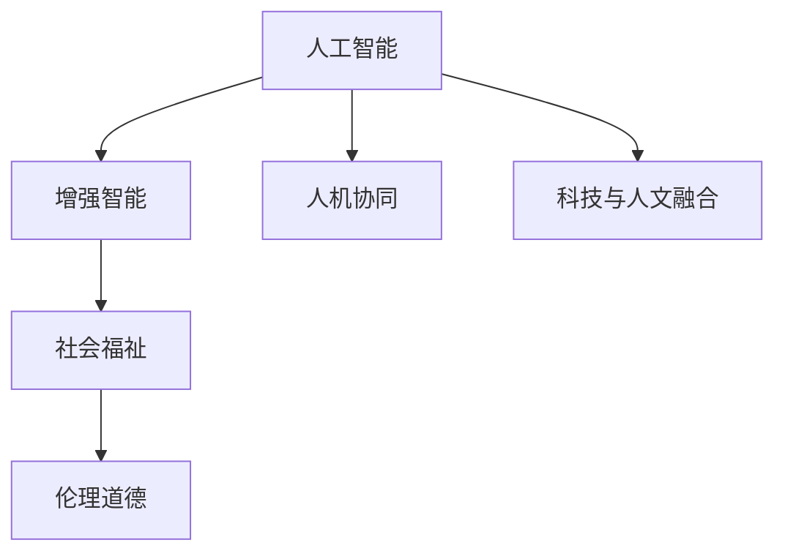

                 

# 人类-AI协作：增强人类福祉

> 关键词：AI协作, 人类福祉, 增强智能, 人机协同, 伦理道德, 科技与人文, 社会影响, 福祉提升, 技术应用, 伦理挑战

## 1. 背景介绍

### 1.1 问题由来

随着人工智能(AI)技术的不断进步，AI在各个领域的应用已经渗透到社会的各个角落，对人类社会的生产、生活、教育、健康等方面产生了深远影响。然而，AI技术的发展既带来了前所未有的机遇，也引发了诸如就业替代、隐私侵犯、伦理道德等一系列问题。如何在享受AI技术带来的便利的同时，有效规避其负面影响，构建人与AI协同共生的生态，成为当前社会面临的重要课题。

### 1.2 问题核心关键点

- **AI协作**：指通过人工智能与人类协同工作，发挥各自优势，共同完成复杂任务。AI在处理海量数据、复杂计算、精确感知等方面具有优势，而人类在创造性思维、情感理解、伦理决策等方面具有不可替代性。
- **人类福祉**：指通过AI技术的应用，提升人类的生活质量、健康水平、教育水平、安全保障等方面，促进社会公平与和谐发展。
- **增强智能**：指利用AI技术增强人类智力和能力，如辅助决策、医疗诊断、教育培训等，提升人类整体素质。
- **人机协同**：指AI系统与人类以合作、互助的方式共同完成任务，充分发挥各自优势，实现最优效果。
- **伦理道德**：指在使用AI技术时，需要遵循的一系列伦理原则和道德规范，确保技术的公平性、透明性和安全性。
- **科技与人文结合**：指在推动AI技术发展的同时，注重与人类文化、价值观的融合，实现技术进步与文化传承的双赢。

### 1.3 问题研究意义

研究人类-AI协作的增强智能及其对人类福祉的影响，对于推动AI技术的健康发展，实现技术与社会的和谐共生，具有重要意义：

1. **促进社会进步**：通过AI技术辅助人类解决复杂问题，提升社会生产力，推动社会进步。
2. **提高生活质量**：利用AI技术改善健康、教育、交通等领域，提升人民生活质量。
3. **推动公平正义**：确保AI技术应用中的公正性，避免加剧社会不平等现象。
4. **增强安全保障**：利用AI技术提升公共安全，预防和应对突发事件。
5. **培养创新人才**：通过AI技术与教育的结合，培养创新思维和技能，促进科技与教育的良性互动。
6. **应对全球挑战**：如气候变化、疾病防控、资源短缺等，AI技术可以提供有效的解决方案。

## 2. 核心概念与联系

### 2.1 核心概念概述

为更好地理解人类-AI协作增强人类福祉的原理和架构，本节将介绍几个密切相关的核心概念：

- **人工智能(AI)**：指通过计算机系统模拟人类智能行为，包括感知、学习、推理、语言处理等能力。
- **增强智能(Enhanced Intelligence)**：指通过AI技术增强人类的认知能力、决策能力、创新能力等，实现人类与AI的互补。
- **人机协同(Human-AI Collaboration)**：指AI系统与人类以合作、互助的方式共同完成任务，实现最优效果。
- **伦理道德(Ethics and Morality)**：指在使用AI技术时，遵循的一系列伦理原则和道德规范，确保技术的公平性、透明性和安全性。
- **社会福祉(Social Welfare)**：指通过AI技术的应用，提升人类的生活质量、健康水平、教育水平、安全保障等方面，促进社会公平与和谐发展。
- **科技与人文融合**：指在推动AI技术发展的同时，注重与人类文化、价值观的融合，实现技术进步与文化传承的双赢。

这些核心概念之间的逻辑关系可以通过以下Mermaid流程图来展示：



这个流程图展示了大语言模型的核心概念及其之间的关系：

1. 人工智能通过技术手段模拟人类智能，实现增强智能。
2. 增强智能通过人机协同，实现任务高效完成。
3. 人机协同应用在社会福祉，提升人类生活质量。
4. 社会福祉应用伦理道德，确保技术公平、透明和安全。
5. 科技与人文融合促进社会福祉和伦理道德的发展。

这些概念共同构成了人类-AI协作增强人类福祉的理论框架，为实现技术与社会的和谐共生提供了指导。

## 3. 核心算法原理 & 具体操作步骤
### 3.1 算法原理概述

人类-AI协作增强人类福祉的原理，主要基于以下三个关键步骤：

1. **数据采集与预处理**：收集与人类福祉相关的数据，并进行清洗、标注等预处理，为AI技术的应用提供数据基础。
2. **模型训练与微调**：利用机器学习算法，训练模型并根据实际情况进行微调，使其能够有效解决特定问题。
3. **应用部署与监控**：将训练好的模型部署到实际应用中，并持续监控其运行状态，及时调整优化。

### 3.2 算法步骤详解

**Step 1: 数据采集与预处理**

- **数据采集**：从各种渠道获取与人类福祉相关的数据，包括健康数据、教育数据、环境数据等。数据源可以包括医疗记录、教育评估、传感器数据等。
- **数据预处理**：对数据进行清洗、去噪、归一化等处理，确保数据质量和一致性。同时，进行数据标注，使其符合模型的训练需求。
- **数据增强**：通过数据增强技术，扩充训练集，提升模型的泛化能力。例如，在医疗影像中引入不同的疾病类型、影像质量等变化。

**Step 2: 模型训练与微调**

- **选择合适的模型**：根据任务需求，选择适合的机器学习模型，如深度神经网络、支持向量机、随机森林等。
- **模型训练**：使用预处理后的数据对模型进行训练，调整模型参数，使其能够有效解决特定问题。
- **模型微调**：根据实际应用反馈，对模型进行微调，优化其性能。例如，在医疗诊断中，利用患者的新数据对模型进行微调，提升诊断准确率。

**Step 3: 应用部署与监控**

- **模型部署**：将训练好的模型部署到实际应用中，如智能健康助手、教育推荐系统等。
- **应用监控**：持续监控模型的运行状态，收集用户反馈，及时发现和修复问题。
- **模型更新**：根据新的数据和反馈，定期更新模型，确保其始终具有高效、准确的性能。

### 3.3 算法优缺点

人类-AI协作增强人类福祉的方法具有以下优点：

1. **高效性**：利用AI技术处理大量数据，提升效率，减少人工干预。
2. **准确性**：AI技术在处理复杂问题时，能够提供高精度的解决方案。
3. **可扩展性**：AI模型可以根据需求灵活调整，适用于不同规模和复杂度的应用场景。
4. **用户友好性**：AI技术能够提供个性化服务，提升用户体验。

同时，该方法也存在一些缺点：

1. **数据依赖**：模型的性能高度依赖于数据的质量和数量，数据不足时效果可能不佳。
2. **公平性**：AI模型可能存在偏见，对特定群体产生不公平影响。
3. **隐私风险**：数据采集和使用过程中，存在隐私泄露的风险。
4. **伦理问题**：AI模型的决策过程可能缺乏透明度，难以解释其行为。
5. **技术复杂性**：模型的开发和维护需要较高的技术门槛。

### 3.4 算法应用领域

人类-AI协作增强人类福祉的方法已经应用于诸多领域，例如：

- **医疗健康**：利用AI技术进行疾病诊断、药物研发、健康监测等，提升医疗服务质量。
- **教育培训**：通过AI技术提供个性化学习推荐、智能辅导等，提高教育效果。
- **环境保护**：利用AI技术监测环境变化、预测灾害等，保护生态环境。
- **智能家居**：通过AI技术实现智能家居设备控制、能效管理等，提升居住体验。
- **金融服务**：利用AI技术进行风险评估、欺诈检测、投资建议等，提升金融服务水平。
- **交通出行**：通过AI技术优化交通管理、自动驾驶等，提升交通效率。

这些领域的应用展示了人类-AI协作增强人类福祉的广阔前景，为未来社会发展提供了新的可能性。

## 4. 数学模型和公式 & 详细讲解 & 举例说明
### 4.1 数学模型构建

本节将使用数学语言对人类-AI协作增强人类福祉的原理进行更加严格的刻画。

设F为人类福祉函数，表示人类福祉水平的综合评估。AI系统通过数据处理和模型训练，对F进行优化，提升其值。AI系统的优化目标为：

$$
\max_{\theta} F(\theta)
$$

其中，$\theta$为AI模型的参数，如神经网络的权重。

### 4.2 公式推导过程

以下我们以医疗健康领域为例，推导AI辅助疾病诊断的数学模型。

假设医疗影像数据为$\{x_i\}_{i=1}^N$，每个影像的标签为$y_i \in \{0,1\}$，其中$y_i=1$表示该影像存在疾病。医疗影像的特征向量为$x_i \in \mathbb{R}^d$，则疾病诊断问题可以表示为二分类问题。

设$\theta$为医疗影像分类器的参数，则分类器的输出为：

$$
f(x_i;\theta) = \text{sigmoid}(\sum_{j=1}^d \theta_j x_{ij})
$$

其中，$\text{sigmoid}$为逻辑回归函数。

疾病诊断的损失函数为二分类交叉熵损失：

$$
L(y_i,f(x_i;\theta)) = -(y_i\log f(x_i;\theta) + (1-y_i)\log (1-f(x_i;\theta)))
$$

整体损失函数为：

$$
\mathcal{L}(\theta) = \frac{1}{N}\sum_{i=1}^N L(y_i,f(x_i;\theta))
$$

利用梯度下降等优化算法，最小化整体损失函数，即可得到最优参数$\theta^*$。

### 4.3 案例分析与讲解

以AI辅助肺癌筛查为例，分析其数学模型的构建和应用。

**数据准备**：收集大量肺部影像数据，标注疾病标签，构建训练集和验证集。

**模型训练**：选择深度卷积神经网络作为疾病分类器，利用训练集进行模型训练，调整参数，最小化损失函数。

**模型评估**：在验证集上评估模型性能，计算准确率、召回率、F1分数等指标，调整模型参数。

**模型应用**：将训练好的模型部署到实际应用中，如医疗影像诊断系统，利用新患者影像数据进行疾病预测，提升诊断准确率。

## 5. 项目实践：代码实例和详细解释说明
### 5.1 开发环境搭建

在进行人类-AI协作增强人类福祉的实践前，我们需要准备好开发环境。以下是使用Python进行TensorFlow开发的环境配置流程：

1. 安装Anaconda：从官网下载并安装Anaconda，用于创建独立的Python环境。

2. 创建并激活虚拟环境：
```bash
conda create -n tf-env python=3.8 
conda activate tf-env
```

3. 安装TensorFlow：根据CUDA版本，从官网获取对应的安装命令。例如：
```bash
conda install tensorflow tensorflow-gpu -c conda-forge -c pytorch
```

4. 安装TensorBoard：
```bash
pip install tensorboard
```

5. 安装各类工具包：
```bash
pip install numpy pandas scikit-learn matplotlib tqdm jupyter notebook ipython
```

完成上述步骤后，即可在`tf-env`环境中开始项目实践。

### 5.2 源代码详细实现

下面我们以AI辅助肺癌筛查为例，给出使用TensorFlow进行疾病分类的PyTorch代码实现。

首先，定义疾病分类器的神经网络模型：

```python
import tensorflow as tf
from tensorflow.keras import layers

class CNNModel(tf.keras.Model):
    def __init__(self, input_shape=(224, 224, 3), num_classes=2):
        super(CNNModel, self).__init__()
        self.conv1 = layers.Conv2D(32, 3, activation='relu', input_shape=input_shape)
        self.pool1 = layers.MaxPooling2D()
        self.conv2 = layers.Conv2D(64, 3, activation='relu')
        self.pool2 = layers.MaxPooling2D()
        self.flatten = layers.Flatten()
        self.dense1 = layers.Dense(128, activation='relu')
        self.dense2 = layers.Dense(num_classes, activation='sigmoid')

    def call(self, inputs):
        x = self.conv1(inputs)
        x = self.pool1(x)
        x = self.conv2(x)
        x = self.pool2(x)
        x = self.flatten(x)
        x = self.dense1(x)
        return self.dense2(x)
```

然后，定义损失函数和优化器：

```python
def binary_crossentropy_loss(y_true, y_pred):
    return tf.keras.losses.BinaryCrossentropy()(y_true, y_pred)

model = CNNModel(input_shape=(224, 224, 3), num_classes=2)
optimizer = tf.keras.optimizers.Adam(learning_rate=0.001)

model.compile(optimizer=optimizer, loss=binary_crossentropy_loss, metrics=['accuracy'])
```

接着，定义训练和评估函数：

```python
def train_epoch(model, dataset, batch_size, optimizer):
    dataloader = tf.data.Dataset.from_tensor_slices((x_train, y_train)).shuffle(buffer_size=10000).batch(batch_size)
    model.fit(dataloader, epochs=10, validation_data=(x_val, y_val))

def evaluate(model, dataset, batch_size):
    dataloader = tf.data.Dataset.from_tensor_slices((x_test, y_test)).batch(batch_size)
    model.evaluate(dataloader)
```

最后，启动训练流程并在测试集上评估：

```python
x_train, x_val, x_test = ...
y_train, y_val, y_test = ...

train_epoch(model, (x_train, y_train), batch_size=32, optimizer=optimizer)
evaluate(model, (x_test, y_test), batch_size=32)
```

以上就是使用TensorFlow对AI辅助疾病诊断任务的完整代码实现。可以看到，TensorFlow的高级API使得模型构建、训练和评估的过程非常简单，大大降低了开发难度。

### 5.3 代码解读与分析

让我们再详细解读一下关键代码的实现细节：

**CNNModel类**：
- `__init__`方法：初始化模型的各层组件。
- `call`方法：定义模型的前向传播过程。

**binary_crossentropy_loss函数**：
- 计算二分类交叉熵损失函数。

**模型训练**：
- 定义模型结构，选择适当的激活函数和优化器。
- 使用`compile`方法将模型、优化器和损失函数绑定在一起。
- 使用`fit`方法进行模型训练，设置训练轮数和验证集。
- 使用`evaluate`方法在测试集上评估模型性能。

可以看到，TensorFlow的高级API大大简化了模型构建和训练的过程，使开发者能够更专注于模型结构的优化和应用场景的设计。

## 6. 实际应用场景
### 6.1 医疗健康

AI技术在医疗健康领域的应用非常广泛，尤其是在疾病诊断、药物研发和健康监测等方面，能够显著提升医疗服务的质量和效率。

**疾病诊断**：利用AI技术分析医学影像、病理切片等，自动检测疾病。如AI辅助肺癌筛查、乳腺癌检测等。

**药物研发**：通过AI技术分析药物分子结构，预测药物疗效和副作用，加速新药研发进程。

**健康监测**：利用AI技术监测患者生理参数，如心率、血压、血糖等，进行实时健康预警。

**智能健康助手**：开发智能健康应用，提供个性化健康建议、在线诊疗咨询等服务。

### 6.2 教育培训

AI技术在教育培训领域的应用主要体现在个性化学习推荐、智能辅导和在线评估等方面。

**个性化学习推荐**：利用AI技术分析学生的学习行为和表现，推荐合适的学习资源和课程。

**智能辅导**：开发智能辅导系统，提供实时解答学生问题，提供个性化辅导建议。

**在线评估**：利用AI技术自动评估学生作业和考试，减少教师工作量，提升评估准确性。

### 6.3 环境保护

AI技术在环境保护领域的应用主要体现在环境监测、污染预测和资源管理等方面。

**环境监测**：利用AI技术监测大气、水质、土壤等环境指标，实时预警环境污染。

**污染预测**：通过AI技术分析气象数据和历史污染数据，预测未来污染趋势，制定应对措施。

**资源管理**：利用AI技术优化资源配置，如能源管理、水资源管理等，提升资源利用效率。

### 6.4 智能家居

AI技术在智能家居领域的应用主要体现在智能设备控制、能效管理和安全防范等方面。

**智能设备控制**：开发智能家居控制系统，实现语音、手势等自然交互，控制家电设备。

**能效管理**：利用AI技术优化家居能源消耗，如智能调温、智能照明等，提升能效。

**安全防范**：开发智能安防系统，实现智能门锁、智能监控等，提升家居安全性。

### 6.5 金融服务

AI技术在金融服务领域的应用主要体现在风险评估、欺诈检测和投资建议等方面。

**风险评估**：利用AI技术分析客户的信用记录、行为数据等，评估其信用风险和违约概率。

**欺诈检测**：通过AI技术检测金融交易中的异常行为，防止欺诈行为发生。

**投资建议**：利用AI技术分析市场数据和客户偏好，提供个性化投资建议。

### 6.6 交通出行

AI技术在交通出行领域的应用主要体现在交通管理、自动驾驶和出行规划等方面。

**交通管理**：利用AI技术优化交通信号灯控制、交通流量预测等，提升交通效率。

**自动驾驶**：开发自动驾驶系统，实现自动导航、自动泊车等，提升交通安全性。

**出行规划**：利用AI技术分析交通数据，提供智能路线规划和出行建议。

## 7. 工具和资源推荐
### 7.1 学习资源推荐

为了帮助开发者系统掌握人类-AI协作增强人类福祉的理论基础和实践技巧，这里推荐一些优质的学习资源：

1. 《人工智能导论》系列博文：由人工智能专家撰写，全面介绍了人工智能的基本概念、原理和应用。

2. 《深度学习》课程：斯坦福大学开设的深度学习明星课程，有Lecture视频和配套作业，适合初学者入门。

3. 《机器学习实战》书籍：实践导向的机器学习实战书籍，涵盖多种经典模型和算法，适合动手实践。

4. 《TensorFlow官方文档》：TensorFlow官方文档，提供了丰富的学习资源和样例代码，是上手实践的必备资料。

5. 《Python机器学习》书籍：详细讲解了Python在机器学习中的应用，适合编程与算法结合学习。

通过对这些资源的学习实践，相信你一定能够快速掌握人类-AI协作增强人类福祉的精髓，并用于解决实际的AI应用问题。

### 7.2 开发工具推荐

高效的开发离不开优秀的工具支持。以下是几款用于人类-AI协作增强人类福祉开发的常用工具：

1. TensorFlow：由Google主导开发的深度学习框架，生产部署方便，适合大规模工程应用。

2. PyTorch：基于Python的开源深度学习框架，灵活动态的计算图，适合快速迭代研究。

3. Weights & Biases：模型训练的实验跟踪工具，可以记录和可视化模型训练过程中的各项指标，方便对比和调优。

4. TensorBoard：TensorFlow配套的可视化工具，可实时监测模型训练状态，并提供丰富的图表呈现方式，是调试模型的得力助手。

5. Jupyter Notebook：交互式编程环境，方便开发者编写和测试代码，分享学习笔记。

合理利用这些工具，可以显著提升人类-AI协作增强人类福祉的开发效率，加快创新迭代的步伐。

### 7.3 相关论文推荐

人类-AI协作增强人类福祉的发展源于学界的持续研究。以下是几篇奠基性的相关论文，推荐阅读：

1. 《AI与人类协作：未来发展趋势》：探讨AI技术在各领域的应用前景，分析人与AI协同共生的可能路径。

2. 《增强智能在医疗健康中的应用》：利用AI技术提升医疗服务质量，提高疾病诊断和治疗效果。

3. 《人机协同增强教育效果》：通过AI技术实现个性化教育，提升学生学习效果和教师教学效率。

4. 《环境保护中的AI技术应用》：分析AI技术在环境监测、污染预测和资源管理中的应用，推动可持续发展。

5. 《智能家居中的AI应用》：探索AI技术在智能设备控制、能效管理和安全防范中的应用，提升居住体验。

6. 《金融服务中的AI技术应用》：分析AI技术在风险评估、欺诈检测和投资建议中的应用，提升金融服务水平。

这些论文代表了大语言模型微调技术的发展脉络。通过学习这些前沿成果，可以帮助研究者把握学科前进方向，激发更多的创新灵感。

## 8. 总结：未来发展趋势与挑战

### 8.1 总结

本文对人类-AI协作增强人类福祉的方法进行了全面系统的介绍。首先阐述了AI技术与人类协作的理论基础和应用意义，明确了AI技术在提升人类福祉方面的独特价值。其次，从原理到实践，详细讲解了人类-AI协作增强人类福祉的数学模型和关键步骤，给出了具体的代码实例。同时，本文还广泛探讨了该方法在医疗健康、教育培训、环境保护等多个领域的应用前景，展示了其广阔的实际应用潜力。此外，本文精选了人类-AI协作增强人类福祉的各类学习资源，力求为读者提供全方位的技术指引。

通过本文的系统梳理，可以看到，人类-AI协作增强人类福祉的方法正在成为AI技术的核心范式，极大地拓展了AI技术的应用边界，为人类社会的进步带来了新的可能性。未来，伴随AI技术的不断演进，人类-AI协作将进一步深化，推动技术与社会的和谐共生。

### 8.2 未来发展趋势

展望未来，人类-AI协作增强人类福祉的技术将呈现以下几个发展趋势：

1. **多模态融合**：未来的AI技术将不仅限于单一模态（如文本、图像），而是实现多模态数据的深度融合，提升综合分析能力。

2. **自适应学习**：AI系统将具备更强的自适应学习能力，能够根据环境变化和用户需求进行动态调整，提升用户体验。

3. **伦理与透明**：随着AI技术在各领域的应用，其伦理与透明性问题也将更加突出，未来的AI系统将更加注重公平、透明和可解释性。

4. **人机共生**：AI技术将更多地与人类协同工作，而非替代人类。未来的AI系统将更加注重人机共生，实现技术与人类文化的有机融合。

5. **跨领域应用**：AI技术将在更多领域得到应用，如智能交通、智能制造、智能城市等，推动各行业的数字化转型升级。

这些趋势凸显了人类-AI协作增强人类福祉技术的广阔前景，为未来社会发展提供了新的可能性。

### 8.3 面临的挑战

尽管人类-AI协作增强人类福祉技术已经取得了显著进展，但在迈向更加智能化、普适化应用的过程中，仍面临诸多挑战：

1. **数据隐私**：AI技术的应用需要大量数据支持，但数据隐私问题成为其发展的瓶颈。如何保护用户隐私，防止数据滥用，是未来发展的关键。

2. **技术公平性**：AI技术可能存在偏见，对特定群体产生不公平影响。如何在算法设计中避免偏见，确保技术公平，是未来的重要研究方向。

3. **技术透明性**：AI技术的决策过程往往缺乏透明性，难以解释其行为。如何在保证技术有效性的同时，提高其透明性，是未来的挑战。

4. **技术安全**：AI技术在应用过程中，可能被恶意利用，造成安全问题。如何提高系统的安全性，防止攻击和滥用，是未来的重要课题。

5. **跨领域应用**：AI技术在各领域的应用，需要跨学科的合作和技术整合，这将带来复杂的技术挑战。

这些挑战凸显了人类-AI协作增强人类福祉技术的复杂性，需要多方共同努力，才能实现技术与社会的和谐共生。

### 8.4 研究展望

面对人类-AI协作增强人类福祉所面临的挑战，未来的研究需要在以下几个方面寻求新的突破：

1. **多模态深度学习**：开发多模态深度学习算法，实现视觉、语音、文本等模态数据的深度融合，提升综合分析能力。

2. **自适应学习算法**：研究自适应学习算法，使AI系统能够动态调整，适应不同环境和用户需求。

3. **公平性算法**：开发公平性算法，确保AI系统在处理不同群体数据时，不会产生偏见。

4. **透明性与可解释性**：研究透明性与可解释性技术，使AI系统能够提供更直观、易懂的决策解释。

5. **安全性保障**：研究安全性技术，确保AI系统在各种攻击和滥用场景下，仍能保持稳定和安全。

6. **跨领域合作**：促进跨领域的合作与交流，推动技术与各行业的深度融合，提升AI技术的普适性和实用性。

这些研究方向的探索，必将引领人类-AI协作增强人类福祉技术迈向更高的台阶，为构建安全、可靠、可解释、可控的智能系统铺平道路。面向未来，人类-AI协作增强人类福祉技术还需要与其他人工智能技术进行更深入的融合，如知识表示、因果推理、强化学习等，多路径协同发力，共同推动自然语言理解和智能交互系统的进步。只有勇于创新、敢于突破，才能不断拓展语言模型的边界，让智能技术更好地造福人类社会。

## 9. 附录：常见问题与解答

**Q1：AI技术在提升人类福祉方面的局限性是什么？**

A: AI技术在提升人类福祉方面存在以下局限性：

1. **数据依赖**：AI技术的应用需要大量数据支持，但在一些领域，数据获取和标注成本较高，难以大规模应用。

2. **技术复杂性**：AI技术的应用需要较高的技术门槛，需要专业人才进行开发和维护。

3. **伦理问题**：AI技术在应用过程中可能带来伦理和隐私问题，如算法偏见、数据隐私泄露等。

4. **公平性问题**：AI技术可能在不同群体之间产生不公平影响，需要特别关注。

5. **安全性问题**：AI技术在应用过程中可能被恶意利用，导致安全问题。

这些局限性需要通过技术改进、法规约束、社会监督等多方面努力，逐步克服。

**Q2：如何构建公平、透明、可解释的AI系统？**

A: 构建公平、透明、可解释的AI系统，需要从以下几个方面入手：

1. **数据预处理**：对数据进行清洗、去噪、归一化等处理，确保数据质量和一致性。同时，进行数据标注，避免偏见。

2. **算法设计**：在算法设计中引入公平性约束，避免算法偏见。使用可解释性算法，使AI系统的决策过程透明可解释。

3. **模型评估**：使用公平性、透明性和可解释性评估指标，对AI系统进行全面评估，确保其性能。

4. **用户参与**：在AI系统开发过程中，广泛听取用户意见，确保系统的公平性和透明性。

5. **法规约束**：制定和实施相关法规，确保AI系统的公平性、透明性和安全性。

通过以上措施，可以有效构建公平、透明、可解释的AI系统，提升其社会价值。

**Q3：AI技术在提升人类福祉方面有哪些实际应用案例？**

A: AI技术在提升人类福祉方面有许多实际应用案例，例如：

1. **医疗健康**：AI技术在疾病诊断、药物研发、健康监测等方面的应用，提升了医疗服务的质量和效率。

2. **教育培训**：AI技术在个性化学习推荐、智能辅导和在线评估等方面的应用，提升了教育效果。

3. **环境保护**：AI技术在环境监测、污染预测和资源管理等方面的应用，推动了可持续发展。

4. **智能家居**：AI技术在智能设备控制、能效管理和安全防范等方面的应用，提升了居住体验。

5. **金融服务**：AI技术在风险评估、欺诈检测和投资建议等方面的应用，提升了金融服务水平。

6. **交通出行**：AI技术在交通管理、自动驾驶和出行规划等方面的应用，提升了交通效率。

这些案例展示了AI技术在各个领域的应用潜力，为未来社会发展提供了新的可能性。

**Q4：AI技术在提升人类福祉方面有哪些伦理问题？**

A: AI技术在提升人类福祉方面存在以下伦理问题：

1. **算法偏见**：AI算法可能存在偏见，对某些群体产生不公平影响。

2. **数据隐私**：AI技术的应用需要大量数据支持，数据隐私问题成为其发展的瓶颈。

3. **透明度**：AI技术的决策过程往往缺乏透明性，难以解释其行为。

4. **安全性**：AI技术在应用过程中可能被恶意利用，导致安全问题。

5. **自主性**：AI系统的自主性增强可能导致人类失去控制，产生伦理问题。

6. **责任归属**：AI系统在应用过程中可能出现错误或事故，责任归属问题成为伦理争议的焦点。

这些问题需要通过技术改进、法规约束、社会监督等多方面努力，逐步解决。

**Q5：AI技术在提升人类福祉方面的未来发展方向是什么？**

A: AI技术在提升人类福祉方面的未来发展方向包括：

1. **多模态融合**：未来的AI技术将不仅限于单一模态（如文本、图像），而是实现多模态数据的深度融合，提升综合分析能力。

2. **自适应学习**：AI系统将具备更强的自适应学习能力，能够根据环境变化和用户需求进行动态调整，提升用户体验。

3. **公平性算法**：开发公平性算法，确保AI系统在处理不同群体数据时，不会产生偏见。

4. **透明性与可解释性**：研究透明性与可解释性技术，使AI系统能够提供更直观、易懂的决策解释。

5. **安全性保障**：研究安全性技术，确保AI系统在各种攻击和滥用场景下，仍能保持稳定和安全。

6. **跨领域合作**：促进跨领域的合作与交流，推动技术与各行业的深度融合，提升AI技术的普适性和实用性。

通过以上措施，AI技术将在未来继续推动人类福祉的提升，为社会进步和人类发展带来新的可能性。

---

作者：禅与计算机程序设计艺术 / Zen and the Art of Computer Programming

