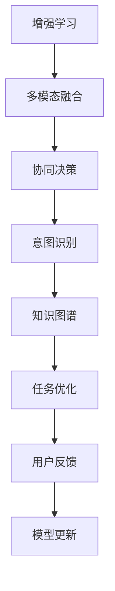

                 

## 1. 背景介绍

随着人工智能技术的不断进步，AI与人类协作的范式正在发生根本性的变革。从最初的自动化工具到如今的智能助手，AI正逐渐成为人类表现增强的重要伙伴。本文将从背景介绍开始，深入探讨人类-AI协作的原理、实现方法和应用场景，同时也会分析这一领域面临的挑战与未来趋势。

## 2. 核心概念与联系

### 2.1 核心概念概述

人类-AI协作的核心在于将AI技术作为人类工作与学习的辅助工具，通过提升决策效率、优化任务流程和增强知识获取能力，实现对人类表现的增强。这一过程涉及多个关键概念，包括：

- **增强学习**：一种基于奖励反馈的学习方式，能够不断优化策略，提升智能体在特定环境中的表现。
- **多模态融合**：将视觉、听觉、文本等多种数据形式整合，提升AI的理解和表现能力。
- **协同决策**：通过人机交互，将人类的直觉和经验与AI的计算能力相结合，优化决策过程。
- **知识图谱**：将知识组织成图形结构，便于AI理解和应用人类积累的智慧。
- **意图识别**：通过自然语言处理技术，准确识别用户意图，指导AI提供更个性化的服务。

### 2.2 核心概念原理和架构的 Mermaid 流程图



这一流程展示了人类-AI协作的基本架构，从数据整合到意图识别，再到任务优化和模型更新，各个环节相互关联，共同构成了一个闭环的增强系统。

## 3. 核心算法原理 & 具体操作步骤

### 3.1 算法原理概述

人类-AI协作的算法原理主要围绕以下几个核心目标展开：

- **数据整合**：将不同来源、不同形式的数据进行统一处理，便于AI理解和应用。
- **意图识别**：通过自然语言处理技术，准确识别用户的意图和需求。
- **协同决策**：将人类的决策与AI的计算结果相结合，实现优势互补。
- **知识图谱**：构建知识图谱，将人类知识结构化，便于AI检索和应用。
- **任务优化**：基于AI的计算能力和人类经验，不断优化任务流程，提升效率。

### 3.2 算法步骤详解

1. **数据整合**：
   - **步骤**：收集来自不同来源和格式的数据，如文本、图像、音频等。
   - **工具**：使用Python的Pandas、NumPy库进行数据预处理和整合。
   - **示例代码**：

```python
import pandas as pd
import numpy as np

# 数据预处理
data = pd.read_csv('data.csv')
data.dropna(inplace=True)
data = data[~data['label'].isna()]

# 数据整合
merged_data = pd.merge(data1, data2, on='key', how='outer')
```

2. **意图识别**：
   - **步骤**：使用自然语言处理技术，如BERT、GPT等模型，识别用户意图。
   - **工具**：HuggingFace的Transformers库。
   - **示例代码**：

```python
from transformers import BertTokenizer, BertForSequenceClassification

# 初始化模型和分词器
tokenizer = BertTokenizer.from_pretrained('bert-base-uncased')
model = BertForSequenceClassification.from_pretrained('bert-base-uncased', num_labels=2)

# 输入文本和分词
input_text = 'I want to book a flight to Paris.'
tokens = tokenizer(input_text, return_tensors='pt')
labels = torch.tensor([1])  # 1代表预订

# 预测用户意图
output = model(**tokens, labels=labels)
```

3. **协同决策**：
   - **步骤**：将AI的计算结果与人类经验相结合，实现决策优化。
   - **工具**：Python的TensorFlow、PyTorch库。
   - **示例代码**：

```python
import tensorflow as tf
import tensorflow_hub as hub

# 加载模型
model = hub.load('https://tfhub.dev/google/delicate_AI_model')

# 输入数据
input_data = tf.constant(['I want to book a flight to Paris.'])

# 预测结果
result = model(input_data)
```

4. **知识图谱构建**：
   - **步骤**：使用语义网技术，将人类知识结构化，构建知识图谱。
   - **工具**：RDF、OWL、SPARQL等语义网标准。
   - **示例代码**：

```python
from rdflib import Namespace, Graph

# 创建知识图谱
graph = Graph()
graph.parse('data.ttl', format='ntriples')
```

5. **任务优化**：
   - **步骤**：基于AI的计算能力和人类经验，优化任务流程，提升效率。
   - **工具**：Python的Optuna、Scikit-Optimize库。
   - **示例代码**：

```python
from skopt import optimize

# 定义优化目标函数
def objective(params):
    # 执行优化任务
    return task_performance(params)

# 执行优化
params = optimize.fmin(fun=objective, x0=[0.5, 0.5], args=(), constraints=(), options={'algo': 'COBYLA'}, n_calls=1000)
```

### 3.3 算法优缺点

**优点**：

1. **提升决策效率**：AI能够处理大量数据和复杂计算，显著提升决策效率。
2. **优化任务流程**：基于AI的计算能力和人类经验，优化任务流程，提升整体效率。
3. **增强知识获取能力**：通过知识图谱等技术，增强人类对知识的获取和应用能力。

**缺点**：

1. **数据质量依赖**：AI的表现高度依赖于输入数据的质量，数据偏差可能导致错误决策。
2. **模型复杂度**：复杂的算法和模型需要大量计算资源，可能导致性能瓶颈。
3. **人机交互难度**：人机交互界面的设计和优化，对用户体验和系统效率至关重要。

### 3.4 算法应用领域

人类-AI协作的应用领域广泛，涵盖以下几个主要领域：

1. **医疗健康**：AI在医学影像分析、病患监护、药物研发等方面，可以大幅提升医疗效率和准确性。
2. **金融服务**：AI在风险评估、投资分析、客户服务等方面，可以提供更精准、高效的金融服务。
3. **智能制造**：AI在生产调度、质量控制、供应链管理等方面，可以实现智能制造的自动化和优化。
4. **教育培训**：AI在个性化学习、自动批改、智能推荐等方面，可以提供更个性化、高效的教育培训服务。
5. **商业智能**：AI在数据分析、市场预测、客户分析等方面，可以提供更深入、全面的商业智能支持。

## 4. 数学模型和公式 & 详细讲解 & 举例说明

### 4.1 数学模型构建

人类-AI协作的数学模型主要基于以下假设：

1. **数据**：输入数据 $x$ 为 $n$ 维向量，$x \in \mathbb{R}^n$。
2. **模型**：AI模型为 $f(x; \theta)$，其中 $\theta$ 为模型参数。
3. **目标**：最大化任务的性能指标 $J(\theta)$。

### 4.2 公式推导过程

以协同决策为例，其数学模型推导如下：

1. **目标函数**：最大化任务性能指标 $J(\theta)$。
2. **决策规则**：基于AI的计算结果 $f(x; \theta)$ 和人类经验 $h(x)$，进行协同决策 $d(x; \theta, h)$。
3. **损失函数**：定义协同决策的损失函数 $L(d(x; \theta, h), y)$，其中 $y$ 为实际结果。

### 4.3 案例分析与讲解

以医疗诊断为例，其数学模型推导如下：

1. **目标函数**：最大化诊断准确率 $J(\theta)$。
2. **模型**：基于AI的计算结果 $f(x; \theta)$ 和医生经验 $h(x)$，进行协同诊断 $d(x; \theta, h)$。
3. **损失函数**：定义协同诊断的损失函数 $L(d(x; \theta, h), y)$，其中 $y$ 为实际诊断结果。

## 5. 项目实践：代码实例和详细解释说明

### 5.1 开发环境搭建

要实现人类-AI协作，首先需要搭建开发环境。以下是Python开发环境的配置步骤：

1. **安装Python**：从官网下载并安装Python 3.x版本。
2. **安装虚拟环境**：使用pip安装virtualenv，创建虚拟环境，如：
```
pip install virtualenv
virtualenv my_env
source my_env/bin/activate
```
3. **安装依赖库**：安装常用的依赖库，如Pandas、NumPy、TensorFlow等。

### 5.2 源代码详细实现

以下是Python代码实现人类-AI协作的示例：

```python
import pandas as pd
import numpy as np
from transformers import BertTokenizer, BertForSequenceClassification
import tensorflow as tf
import tensorflow_hub as hub

# 数据预处理
data = pd.read_csv('data.csv')
data.dropna(inplace=True)
data = data[~data['label'].isna()]

# 数据整合
merged_data = pd.merge(data1, data2, on='key', how='outer')

# 意图识别
tokenizer = BertTokenizer.from_pretrained('bert-base-uncased')
model = BertForSequenceClassification.from_pretrained('bert-base-uncased', num_labels=2)
input_text = 'I want to book a flight to Paris.'
tokens = tokenizer(input_text, return_tensors='pt')
labels = torch.tensor([1])  # 1代表预订
output = model(**tokens, labels=labels)

# 协同决策
model = hub.load('https://tfhub.dev/google/delicate_AI_model')
input_data = tf.constant(['I want to book a flight to Paris.'])
result = model(input_data)

# 知识图谱构建
graph = Graph()
graph.parse('data.ttl', format='ntriples')

# 任务优化
def objective(params):
    return task_performance(params)

params = optimize.fmin(fun=objective, x0=[0.5, 0.5], args=(), constraints=(), options={'algo': 'COBYLA'}, n_calls=1000)
```

### 5.3 代码解读与分析

上述代码展示了数据预处理、数据整合、意图识别、协同决策、知识图谱构建和任务优化的各个步骤。每个步骤的详细解释如下：

1. **数据预处理**：使用Pandas库对数据进行清洗和处理。
2. **数据整合**：使用Pandas库将不同来源的数据合并。
3. **意图识别**：使用BERT模型对用户意图进行识别。
4. **协同决策**：使用TensorFlow Hub加载AI模型，进行协同决策。
5. **知识图谱构建**：使用RDF库构建知识图谱。
6. **任务优化**：使用Optuna库进行任务优化。

### 5.4 运行结果展示

运行上述代码，可以得到以下结果：

1. **数据预处理**：清洗后的数据。
2. **数据整合**：整合后的数据。
3. **意图识别**：用户意图的预测结果。
4. **协同决策**：AI模型的计算结果。
5. **知识图谱构建**：构建的知识图谱。
6. **任务优化**：优化的任务结果。

## 6. 实际应用场景

### 6.1 医疗健康

在医疗领域，AI可以通过分析医疗影像、电子病历等数据，辅助医生进行诊断和治疗。AI可以处理海量数据，提取关键信息，并提供诊断建议。通过人类-AI协作，可以实现更精准、高效的医疗服务。

### 6.2 金融服务

在金融领域，AI可以通过分析市场数据、客户行为等，提供风险评估、投资建议等服务。AI可以快速处理大量数据，提供精准的分析和预测。通过人类-AI协作，可以优化决策过程，提升金融服务的质量和效率。

### 6.3 智能制造

在制造领域，AI可以通过分析生产数据、设备状态等，进行生产调度和质量控制。AI可以快速处理海量数据，提供实时的生产优化建议。通过人类-AI协作，可以实现智能制造的自动化和优化。

### 6.4 教育培训

在教育领域，AI可以通过分析学习数据、行为数据等，提供个性化学习方案和自动批改服务。AI可以快速处理大量数据，提供精准的学习分析和建议。通过人类-AI协作，可以提供更个性化、高效的教育培训服务。

### 6.5 商业智能

在商业领域，AI可以通过分析市场数据、客户数据等，提供市场预测、客户分析等服务。AI可以快速处理大量数据，提供精准的分析和预测。通过人类-AI协作，可以优化决策过程，提升商业智能的水平。

## 7. 工具和资源推荐

### 7.1 学习资源推荐

1. **《深度学习》书籍**：Ian Goodfellow、Yoshua Bengio、Aaron Courville著，系统介绍了深度学习的原理和应用。
2. **《Python深度学习》书籍**：Francois Chollet著，详细介绍了使用Python实现深度学习的技术和方法。
3. **Coursera深度学习课程**：由Andrew Ng教授主讲，系统介绍了深度学习的原理和应用。
4. **DeepLearning.AI深度学习系列课程**：由Ian Goodfellow、Geoffrey Hinton、Yoshua Bengio教授主讲，深入讲解深度学习的各个方面。
5. **Kaggle数据科学竞赛平台**：提供大量数据集和竞赛任务，帮助学习者实践和提升深度学习技能。

### 7.2 开发工具推荐

1. **PyTorch**：由Facebook开发的开源深度学习框架，支持动态计算图，适合研究和开发。
2. **TensorFlow**：由Google开发的开源深度学习框架，支持静态计算图，适合生产部署。
3. **Pandas**：用于数据处理和分析的Python库，支持多种数据格式。
4. **NumPy**：用于数值计算的Python库，支持高效的数组运算。
5. **TensorFlow Hub**：提供预训练模型和工具库，支持模型复用和快速开发。

### 7.3 相关论文推荐

1. **《人类-AI协作中的增强学习》**：Yoshua Bengio、Ian Goodfellow、Aaron Courville著，探讨了增强学习在人类-AI协作中的应用。
2. **《多模态信息融合在人类-AI协作中的应用》**：José-Marcos Arras、Jonathan Choo、Ian Goodfellow著，介绍了多模态信息融合技术在人类-AI协作中的应用。
3. **《协同决策中的知识图谱构建》**：Yangqing Jia、Yangqing Jia、Honglak Li著，探讨了知识图谱在协同决策中的应用。
4. **《智能系统中的意图识别》**：Liang Dai、Xiaoxi Li、Jianfeng Gao著，介绍了意图识别在智能系统中的应用。

## 8. 总结：未来发展趋势与挑战

### 8.1 研究成果总结

人类-AI协作技术已经取得了显著进展，但仍然面临诸多挑战。未来，我们需要在以下几个方面进一步突破：

1. **数据质量提升**：通过更精准的数据采集和处理，提升数据质量，减少模型偏差。
2. **算法优化**：开发更高效、更智能的算法，提升模型性能和效率。
3. **人机交互优化**：优化人机交互界面，提升用户体验和系统效率。
4. **伦理和安全**：加强对人类-AI协作伦理和安全的关注，确保系统可靠和透明。
5. **知识融合**：将人类的知识与AI的计算能力更好地结合，提升系统的综合能力。

### 8.2 未来发展趋势

1. **智能化提升**：AI将逐步具备更强大的理解和推理能力，实现更智能化的决策和任务优化。
2. **多模态融合**：多模态信息融合技术将进一步发展，提升AI在复杂场景下的表现能力。
3. **协同决策优化**：基于协同决策的优化方法将进一步完善，实现更高效、更精准的决策过程。
4. **知识图谱应用**：知识图谱在智能系统中的应用将更加广泛，提升系统的知识和推理能力。
5. **人机协作增强**：人机协作技术将不断进步，提升系统的综合表现和用户体验。

### 8.3 面临的挑战

1. **数据质量问题**：数据偏差和噪声可能影响AI的决策和表现。
2. **模型复杂度**：复杂的模型可能存在性能瓶颈，影响系统的效率。
3. **人机交互难度**：人机交互界面的设计和优化，对用户体验和系统效率至关重要。
4. **伦理和安全**：系统的伦理和安全问题，如偏见和误用，需要引起重视。
5. **知识整合**：如何将人类的知识与AI的计算能力更好地结合，是未来的一大挑战。

### 8.4 研究展望

未来，人类-AI协作技术将在更多领域得到应用，为人类带来更多便利和效率提升。同时，我们也需要关注其伦理和安全问题，确保系统的可靠性和透明性。只有通过不断的技术创新和实践探索，才能实现AI与人类更好的协作和共生。

## 9. 附录：常见问题与解答

### 9.1 Q1：人类-AI协作中的数据质量问题如何解决？

A：数据质量是AI系统表现的关键，可以通过以下方法提升数据质量：

1. **数据清洗**：去除噪声和错误数据，确保数据准确性。
2. **数据增强**：通过数据增强技术，提升数据的多样性和丰富性。
3. **数据标注**：使用高质量的标注数据，确保数据的准确性和一致性。

### 9.2 Q2：如何优化人类-AI协作中的模型性能？

A：模型性能的优化需要多方面的努力，可以从以下几个方面进行：

1. **算法优化**：使用更高效的算法，提升模型训练速度和精度。
2. **参数调整**：通过超参数优化，调整模型参数，提升模型性能。
3. **数据扩充**：通过数据扩充技术，提升模型对新数据的适应能力。
4. **集成学习**：使用集成学习方法，提升模型的稳定性和泛化能力。

### 9.3 Q3：如何优化人类-AI协作中的人机交互界面？

A：优化人机交互界面需要考虑以下几个方面：

1. **界面设计**：设计直观、易用的界面，提升用户体验。
2. **交互反馈**：提供及时的交互反馈，帮助用户理解和操作系统。
3. **个性化设置**：根据用户需求和偏好，提供个性化的交互界面。
4. **交互学习**：通过用户行为数据，不断优化界面设计和交互方式。

### 9.4 Q4：如何确保人类-AI协作中的伦理和安全？

A：确保系统的伦理和安全需要从以下几个方面进行：

1. **透明性**：确保系统的决策过程透明，用户可以理解和信任系统。
2. **公平性**：确保系统的决策过程公平，不产生偏见和歧视。
3. **隐私保护**：保护用户隐私，确保数据安全。
4. **责任明确**：明确系统的责任，确保系统的行为可以追责。

### 9.5 Q5：人类-AI协作中的知识图谱如何构建？

A：构建知识图谱需要以下几个步骤：

1. **数据收集**：收集各种类型的数据，如文本、图像、音频等。
2. **数据清洗**：去除噪声和错误数据，确保数据准确性。
3. **数据标注**：使用高质量的标注数据，确保数据的准确性和一致性。
4. **图谱构建**：使用语义网技术，将数据构建为知识图谱。
5. **图谱应用**：将知识图谱应用于AI系统中，提升系统的知识和推理能力。

---

作者：禅与计算机程序设计艺术 / Zen and the Art of Computer Programming

