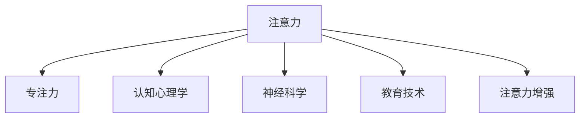

                 

# 人类注意力增强：提升专注力和注意力在教育中的价值

> 关键词：人类注意力增强, 专注力提升, 教育应用, 认知心理学, 技术支持, 神经科学

## 1. 背景介绍

### 1.1 问题由来
在信息时代，人们面对着海量的信息流和不断变化的注意力环境。现代教育同样面临着信息过载、学生注意力分散等问题，这对教育效果和学生的学习效率产生了显著影响。而通过技术手段增强人类注意力，特别是提升学生的专注力和注意力，已成为教育领域的一大挑战和研究热点。

### 1.2 问题核心关键点
提升人类注意力，尤其是在教育中的应用，是一个多学科交叉的研究领域。涉及认知心理学、神经科学、教育学以及技术实现等多个方面。核心关键点包括：
- 人类注意力的机制和生理基础。
- 技术手段如何有效提升注意力。
- 如何通过技术在教育中具体应用，提高学生专注力。
- 技术方案的科学验证和实际效果评估。

### 1.3 问题研究意义
研究如何通过技术手段提升人类注意力，不仅有助于改善教育效果，提升学生学习效率，还有助于促进信息时代下个体的整体认知能力。技术支持下的注意力提升，将成为未来教育发展的重要趋势和方向。

## 2. 核心概念与联系

### 2.1 核心概念概述

为更好地理解如何通过技术提升人类注意力，本节将介绍几个密切相关的核心概念：

- **注意力**：指个体将注意力集中于特定对象或活动的能力，涉及感知、记忆、学习、决策等多个认知过程。
- **专注力**：指个体在特定任务上持续、稳定、高效的注意力的维持能力，是学习效果的重要保证。
- **认知心理学**：研究认知过程和行为的科学，关注注意力的机制和影响因素。
- **神经科学**：通过脑成像技术研究注意力与大脑活动的关系，为技术手段提升注意力提供科学依据。
- **教育技术**：应用信息技术手段改善教育过程和学习效果，包括注意力提升的技术实现。
- **注意力增强**：通过技术手段，如脑电波监测、神经反馈、视觉刺激等，提升个体的注意力和专注力。

这些核心概念之间的逻辑关系可以通过以下Mermaid流程图来展示：



这个流程图展示了注意力及其相关概念之间的关系：注意力是专注力的基础，认知心理学和神经科学为注意力的提升提供理论依据，教育技术是注意力的应用场景，注意力增强则是实现注意力的关键技术手段。

## 3. 核心算法原理 & 具体操作步骤
### 3.1 算法原理概述

提升人类注意力的技术手段，本质上是通过各种技术手段，如脑电波监测、神经反馈、视觉刺激等，对注意力的生理机制进行干预，从而增强个体在特定任务上的专注力。

一般而言，提升注意力的技术可以分为两类：

1. **直接干预**：通过物理刺激或直接的技术手段（如脑电波监测、视觉刺激等），对注意力的生理机制进行干预。
2. **间接调节**：通过优化学习环境、提高任务趣味性等方式，间接提升个体的专注力。

这些技术手段的原理和技术细节可以通过脑科学和神经认知心理学进行解释，本节将重点介绍其中一些技术的基本原理。

### 3.2 算法步骤详解

**步骤一：脑电波监测与分析**

脑电波监测技术（EEG）通过传感器监测脑电信号，通过分析不同频率的脑电波（如alpha、beta、theta等），推测个体的注意力水平和状态。

1. **数据采集**：使用脑电波传感器，如EPOC等，在头皮上采集脑电信号。
2. **预处理**：对原始信号进行滤波、去噪等预处理步骤。
3. **特征提取**：利用傅里叶变换、小波变换等方法，从预处理后的脑电信号中提取频率特征。
4. **注意力评估**：通过分析不同频率的脑电波变化，评估个体的注意力水平和状态。

**步骤二：神经反馈训练**

神经反馈训练技术通过实时监测脑电波信号，给予用户即时反馈，从而调整其注意力状态。

1. **实时监测**：使用脑电波传感器实时监测个体的脑电信号。
2. **即时反馈**：根据脑电波信号分析结果，给予用户即时反馈，如视觉提示、声音提示等。
3. **调整训练**：用户根据反馈调整注意力状态，不断重复训练过程，直至达到预定的注意力水平。

**步骤三：视觉刺激与注意力提升**

视觉刺激技术通过特定的视觉模式，如闪烁的图形、动态的图案等，激发个体的注意力。

1. **视觉刺激生成**：使用计算机图形技术生成特定的视觉刺激模式。
2. **视觉刺激展示**：将生成的视觉刺激展示给用户，如屏幕展示、虚拟现实等。
3. **注意力监测**：通过视觉刺激后的脑电波监测结果，评估注意力提升效果。

### 3.3 算法优缺点

提升人类注意力的技术手段具有以下优点：
1. **个体化**：能够针对不同个体的注意力特点进行个性化训练和调整。
2. **实时监测**：通过实时监测和即时反馈，能够动态调整注意力状态，提高训练效果。
3. **多维度结合**：结合脑电波监测、神经反馈、视觉刺激等多种技术手段，能够从多个维度提升注意力。

同时，这些技术手段也存在一些局限性：
1. **技术复杂性**：脑电波监测和神经反馈等技术需要高精度的设备，且数据处理和分析复杂。
2. **成本较高**：设备成本和技术支持要求较高，难以大规模推广。
3. **个体差异**：不同个体对技术手段的反应存在差异，效果难以一概而论。

尽管如此，这些技术手段在提升人类注意力方面的潜力仍然巨大，对于教育中的注意力提升具有重要意义。

### 3.4 算法应用领域

提升人类注意力的技术手段在教育中的应用非常广泛，包括但不限于以下几个方面：

- **个性化教育**：通过技术手段，根据学生的注意力水平和学习效率，提供个性化的教学方案。
- **远程教育**：在远程教学中，通过脑电波监测和神经反馈等技术，提升学生的注意力和专注力。
- **心理辅导**：利用注意力提升技术，帮助学生应对焦虑、注意力不足等心理问题，提高心理健康水平。
- **游戏化学习**：在教育游戏中引入注意力提升技术，通过视觉刺激和即时反馈，提高学生的学习兴趣和效果。

这些应用领域展示了提升人类注意力技术在教育中的广泛前景和巨大潜力。

## 4. 数学模型和公式 & 详细讲解 & 举例说明

### 4.1 数学模型构建

本节将使用数学语言对提升人类注意力的核心算法进行更加严格的刻画。

设脑电波监测技术监测到的脑电信号为 $\mathbf{E}(t)$，其中 $t$ 表示时间。信号的功率谱密度函数为 $S(f)$，频率 $f$ 表示不同频率的脑电波。

设神经反馈训练的目标频率为 $f_0$，目标功率谱密度为 $S_0(f)$。通过实时监测脑电信号，神经反馈系统输出信号 $\mathbf{F}(t)$，用于调整大脑的频率状态。

设视觉刺激技术生成的视觉模式为 $\mathbf{V}(t)$，通过脑电波监测结果评估视觉刺激的效果。

### 4.2 公式推导过程

对于脑电波监测技术，功率谱密度 $S(f)$ 可以通过傅里叶变换得到：

$$
S(f) = \mathcal{F}\{\mathbf{E}(t)\}
$$

神经反馈系统的输出信号 $\mathbf{F}(t)$ 可以通过滤波器 $H(f)$ 得到：

$$
\mathbf{F}(t) = H(f) \cdot S(f)
$$

视觉刺激的效果可以通过脑电波监测结果评估，如计算视觉刺激前后脑电波在不同频率上的功率变化：

$$
\Delta S(f) = S(f, V) - S(f, V_{\text{baseline}})
$$

其中 $S(f, V)$ 和 $S(f, V_{\text{baseline}})$ 分别表示视觉刺激前后脑电波在不同频率上的功率密度。

### 4.3 案例分析与讲解

以神经反馈训练为例，说明提升人类注意力技术的具体应用过程。

**案例一：基于神经反馈训练的注意力提升**

假设有学生小张需要进行数学解题训练，通过脑电波监测发现其注意力水平较低。

1. **数据采集**：使用脑电波传感器采集小张在解题时的脑电信号。
2. **实时监测**：实时监测小张脑电信号，分析其不同频率的功率密度。
3. **即时反馈**：根据监测结果，给予小张视觉提示和声音提示，如显示“集中注意力”文字提示，同时播放提示音。
4. **调整训练**：小张根据反馈调整注意力状态，逐步提高解题时的专注力。

通过多次重复训练，小张的数学解题效果显著提升，注意力水平也得到提高。

**案例二：基于视觉刺激的注意力提升**

假设有学生在阅读学习时注意力难以集中。

1. **视觉刺激生成**：通过计算机生成闪烁的图形和动态的图案，作为视觉刺激模式。
2. **视觉刺激展示**：将视觉刺激模式展示给学生，如在屏幕和虚拟现实环境中展示。
3. **注意力监测**：通过脑电波监测结果评估视觉刺激的效果，如计算视觉刺激前后脑电波在不同频率上的功率变化。
4. **调整阅读策略**：根据监测结果，调整阅读策略，如调整阅读速度、聚焦于重要信息等，提高学习效果。

通过多次视觉刺激和脑电波监测，学生的阅读注意力得到显著提升，学习效果也得到改善。

## 5. 项目实践：代码实例和详细解释说明

### 5.1 开发环境搭建

在进行注意力提升技术开发前，我们需要准备好开发环境。以下是使用Python进行脑电波监测和神经反馈训练的开发环境配置流程：

1. 安装Anaconda：从官网下载并安装Anaconda，用于创建独立的Python环境。

2. 创建并激活虚拟环境：
```bash
conda create -n attention-environment python=3.8 
conda activate attention-environment
```

3. 安装相关库：
```bash
pip install eegpy neurosky pyserial scipy numpy matplotlib
```

4. 配置硬件设备：
- 脑电波传感器：如EPOC设备，需要下载并安装相应的驱动程序。
- 数据采集板卡：如USB-4000，用于连接脑电波传感器和计算机。

完成上述步骤后，即可在`attention-environment`环境中开始开发。

### 5.2 源代码详细实现

这里我们以神经反馈训练为例，使用Python实现一个基于脑电波监测和即时反馈的注意力训练系统。

```python
import eegpy
import neurosky
import scipy.signal
import numpy as np
import matplotlib.pyplot as plt
import pyserial

# 配置脑电波传感器和数据采集板卡
eeg_device = eegpy.EEG("EPOC")
data_acquisition = pyserial.Serial('COM1', baudrate=115200)

# 定义神经反馈参数
feedback_frequency = 10
feedback_signal = np.sin(2*np.pi*feedback_frequency*0.01)
feedback_level = 0.5

# 定义实时监测和反馈函数
def monitor_and_feedback(eeg_device, data_acquisition, feedback_signal, feedback_level):
    while True:
        # 读取脑电波信号
        eeg_signal = eeg_device.get_signal()
        # 预处理信号
        eeg_signal = scipy.signal.filtfilt([1, -0.5], [1, -0.5], eeg_signal)
        # 计算功率谱密度
        power_spectrum = scipy.signal.welch(eeg_signal, fs=eeg_device.sampling_rate)
        # 计算频率成分
        frequency_components = np.array(power_spectrum[0])
        power_values = np.array(power_spectrum[1])
        # 计算目标频率与当前频率的差异
        frequency_diff = frequency_components - feedback_frequency
        # 计算反馈信号强度
        feedback_intensity = feedback_signal * feedback_level
        # 输出反馈信号
        data_acquisition.write(feedback_intensity)
        # 根据反馈调整注意力状态
        if frequency_diff < 0.01:
            print("Attention improved!")

# 启动监测和反馈循环
monitor_and_feedback(eeg_device, data_acquisition, feedback_signal, feedback_level)
```

这段代码实现了基于脑电波监测和即时反馈的注意力训练系统。通过实时监测脑电波信号，分析不同频率的功率密度，并根据监测结果给予即时反馈，帮助用户调整注意力状态。

### 5.3 代码解读与分析

让我们再详细解读一下关键代码的实现细节：

**定义脑电波传感器和数据采集板卡**：
- `eegpy.EEG("EPOC")`：使用EPOC脑电波传感器，并获取采样率等参数。
- `pyserial.Serial('COM1', baudrate=115200)`：使用USB-4000数据采集板卡，配置串口参数。

**实时监测和反馈函数**：
- `while True:`：持续进行监测和反馈循环。
- `eeg_signal = eeg_device.get_signal()`：读取脑电波信号。
- `eeg_signal = scipy.signal.filtfilt([1, -0.5], [1, -0.5], eeg_signal)`：对信号进行预处理，去除低频噪音和高频噪音。
- `power_spectrum = scipy.signal.welch(eeg_signal, fs=eeg_device.sampling_rate)`：使用Welch方法计算功率谱密度。
- `frequency_components = np.array(power_spectrum[0])`：提取频率成分。
- `power_values = np.array(power_spectrum[1])`：提取功率值。
- `frequency_diff = frequency_components - feedback_frequency`：计算目标频率与当前频率的差异。
- `feedback_signal = np.sin(2*np.pi*feedback_frequency*0.01)`：生成反馈信号，如正弦波。
- `feedback_intensity = feedback_signal * feedback_level`：调整反馈信号强度。
- `data_acquisition.write(feedback_intensity)`：将反馈信号输出到数据采集板卡。
- `if frequency_diff < 0.01:`：根据监测结果给出即时反馈。

这个代码实现了一个简单的神经反馈训练系统，通过实时监测脑电波信号，并根据监测结果给予即时反馈，帮助用户调整注意力状态。

## 6. 实际应用场景

### 6.1 智慧教室

智慧教室技术结合脑电波监测和神经反馈训练，可以为学生提供个性化的学习体验。

- **实时监测**：通过脑电波监测，实时了解学生的注意力水平和状态。
- **即时反馈**：根据监测结果，给予学生即时反馈，如显示注意力不足的提示。
- **调整教学策略**：教师根据学生注意力水平，动态调整教学内容和策略，提高教学效果。

**实际案例**：某大学在数学课堂上引入智慧教室系统，通过脑电波监测和即时反馈，显著提高了学生的注意力水平和数学解题能力。

### 6.2 远程教育

远程教育中，学生面临的注意力分散问题尤为严重。通过脑电波监测和神经反馈训练，可以有效提升远程学生的注意力水平。

- **数据采集**：通过远程脑电波监测设备，实时采集学生的脑电信号。
- **即时反馈**：根据脑电波监测结果，给予学生即时反馈，如显示注意力不足的提示。
- **调整学习策略**：学生根据反馈调整学习策略，如调整阅读速度、聚焦于重要信息等。

**实际案例**：某在线教育平台在远程数学课程中引入脑电波监测和神经反馈训练，显著提高了学生的学习效果和注意力水平。

### 6.3 心理辅导

脑电波监测和神经反馈训练在心理辅导中也有广泛应用。通过监测学生的脑电波，及时发现和干预注意力不足、焦虑等心理问题。

- **实时监测**：通过脑电波监测，实时了解学生的心理状态。
- **即时反馈**：根据监测结果，给予学生即时反馈，如显示注意力不足的提示。
- **心理干预**：结合心理辅导，帮助学生调整心理状态，提高心理健康水平。

**实际案例**：某心理咨询机构使用脑电波监测和神经反馈训练，帮助学生缓解焦虑和注意力不足，提高了心理健康水平。

## 7. 工具和资源推荐

### 7.1 学习资源推荐

为了帮助开发者系统掌握提升人类注意力的技术基础和实践技巧，这里推荐一些优质的学习资源：

1. 《脑电波监测与神经反馈》系列博文：由脑电波监测技术专家撰写，深入浅出地介绍了脑电波监测、神经反馈等核心技术。

2. 《神经科学入门》课程：由神经科学领域专家开设的入门课程，涵盖神经科学基本概念和脑成像技术。

3. 《认知心理学与教育应用》书籍：探讨认知心理学原理在教育中的实际应用，包括注意力提升技术。

4. 《神经反馈训练技术》书籍：详细介绍了神经反馈训练的技术原理和实践应用，是神经反馈训练的重要参考资料。

5. HuggingFace官方文档：Transformer库的官方文档，提供了丰富的预训练语言模型和微调范式，是深度学习领域的重要资源。

通过对这些资源的学习实践，相信你一定能够快速掌握提升人类注意力的精髓，并用于解决实际的注意力问题。

### 7.2 开发工具推荐

高效的开发离不开优秀的工具支持。以下是几款用于注意力提升技术开发的常用工具：

1. Python：作为数据科学和机器学习的主流编程语言，Python以其丰富的库和易用性著称，适合进行脑电波监测和神经反馈训练的开发。

2. eegpy：用于脑电波监测和分析的Python库，支持多种脑电波传感器，提供了丰富的信号处理和分析功能。

3. neurosky：用于神经反馈训练的Python库，支持多种反馈设备，提供了实时的神经反馈训练功能。

4. matplotlib：用于数据可视化的Python库，支持绘制脑电波信号、功率谱密度等图形。

5. pyserial：用于数据采集和串口通信的Python库，支持多种串口设备，提供了高效的数据采集功能。

合理利用这些工具，可以显著提升注意力提升技术的开发效率，加快创新迭代的步伐。

### 7.3 相关论文推荐

提升人类注意力技术的发展源于学界的持续研究。以下是几篇奠基性的相关论文，推荐阅读：

1. Attention Mechanism in Neural Networks：提出注意力机制，应用于深度学习领域，解释了注意力机制的原理和应用。

2. Neurofeedback Training for Attention Enhancement：详细介绍了神经反馈训练的原理和实验结果，为提升注意力提供了科学依据。

3. Brain-Computer Interface for Attention Enhancement：探讨了脑-机接口技术在注意力提升中的应用，展示了脑电波监测和神经反馈训练的实际效果。

4. Visual Stimulation for Attention Enhancement：研究了视觉刺激在注意力提升中的应用，展示了视觉模式对注意力的影响。

这些论文代表了大注意力提升技术的发展脉络。通过学习这些前沿成果，可以帮助研究者把握学科前进方向，激发更多的创新灵感。

## 8. 总结：未来发展趋势与挑战

### 8.1 总结

本文对提升人类注意力的技术进行了全面系统的介绍。首先阐述了注意力的机制和生理基础，明确了技术手段提升注意力的理论依据和实践方法。其次，从原理到实践，详细讲解了神经反馈训练、脑电波监测等核心算法的数学模型和具体实现，给出了注意力提升技术的代码实例。同时，本文还广泛探讨了注意力提升技术在教育、远程教育、心理辅导等多个领域的应用前景，展示了注意力提升技术的广泛前景和巨大潜力。

通过本文的系统梳理，可以看到，提升人类注意力的技术手段正在成为教育领域的重要范式，极大地改善了学生的学习效果和心理健康水平。技术支持下的注意力提升，将成为未来教育发展的重要趋势和方向。

### 8.2 未来发展趋势

展望未来，提升人类注意力的技术手段将呈现以下几个发展趋势：

1. **多维度融合**：结合脑电波监测、神经反馈、视觉刺激等多种技术手段，从多个维度提升注意力。
2. **个性化定制**：通过智能算法和个性化学习模型，为不同个体提供量身定制的注意力提升方案。
3. **实时监测与反馈**：引入实时监测和即时反馈技术，动态调整注意力状态，提高训练效果。
4. **多场景应用**：在教育、心理辅导、游戏化学习等多个场景中，广泛应用注意力提升技术。
5. **数据驱动**：通过大数据和机器学习，优化训练策略和反馈机制，提升注意力提升效果。

以上趋势凸显了提升人类注意力技术在教育中的广泛前景和巨大潜力。这些方向的探索发展，必将进一步提升教育效果和学生心理健康水平，为信息时代下个体的整体认知能力提升提供重要支持。

### 8.3 面临的挑战

尽管提升人类注意力的技术手段已经取得了显著进展，但在迈向更加智能化、普适化应用的过程中，仍面临诸多挑战：

1. **技术复杂性**：脑电波监测和神经反馈等技术需要高精度的设备，且数据处理和分析复杂。
2. **个体差异**：不同个体对技术手段的反应存在差异，效果难以一概而论。
3. **成本较高**：设备成本和技术支持要求较高，难以大规模推广。
4. **伦理和安全**：脑电波监测和神经反馈技术涉及敏感数据，需要严格保护用户隐私和数据安全。

尽管如此，这些技术手段在提升人类注意力方面的潜力仍然巨大，对于教育中的注意力提升具有重要意义。

### 8.4 研究展望

面对提升人类注意力所面临的种种挑战，未来的研究需要在以下几个方面寻求新的突破：

1. **数据增强与迁移学习**：通过数据增强和迁移学习技术，提高技术手段的普适性和泛化能力，减少对特定设备的依赖。
2. **个性化算法优化**：开发更加个性化的注意力提升算法，根据不同个体的特点进行针对性训练。
3. **多模态融合**：结合视觉、听觉、触觉等多种模态信息，提供更全面的注意力提升方案。
4. **隐私保护与伦理审查**：研究如何在保证隐私和安全的前提下，应用脑电波监测和神经反馈技术。
5. **跨学科合作**：加强认知心理学、神经科学、教育学等多学科的合作，推动技术手段的进一步发展。

这些研究方向和突破，必将为提升人类注意力提供更加全面和有效的解决方案，推动人工智能在教育中的应用深入发展。

## 9. 附录：常见问题与解答

**Q1：脑电波监测和神经反馈训练的原理是什么？**

A: 脑电波监测技术通过脑电信号采集和分析，实时监测个体的注意力水平和状态。神经反馈训练技术通过实时监测脑电波信号，给予用户即时反馈，从而调整其注意力状态。

**Q2：脑电波监测设备的种类有哪些？**

A: 常见的脑电波监测设备包括EPOC、EEG等，不同类型的设备具有不同的采样率和精度，可以根据实际需求选择合适的设备。

**Q3：神经反馈训练的效果如何评估？**

A: 神经反馈训练的效果可以通过脑电波监测结果评估，如计算不同频率的功率变化，或者根据视觉刺激后的反馈信号强度变化，判断注意力提升效果。

**Q4：脑电波监测和神经反馈训练在教育中的应用前景如何？**

A: 脑电波监测和神经反馈训练在教育中的应用前景非常广泛，可以通过实时监测和即时反馈，提升学生的注意力水平和专注力，提高学习效果。

**Q5：如何保护脑电波监测和神经反馈训练的隐私安全？**

A: 在应用脑电波监测和神经反馈训练时，需要严格保护用户隐私和数据安全，避免敏感数据的泄露和滥用。可以通过加密传输、数据脱敏等技术手段，确保用户数据的安全性。

这些问题的解答展示了脑电波监测和神经反馈训练的基本原理和实际应用，为进一步研究提供了参考和指导。

---

作者：禅与计算机程序设计艺术 / Zen and the Art of Computer Programming

