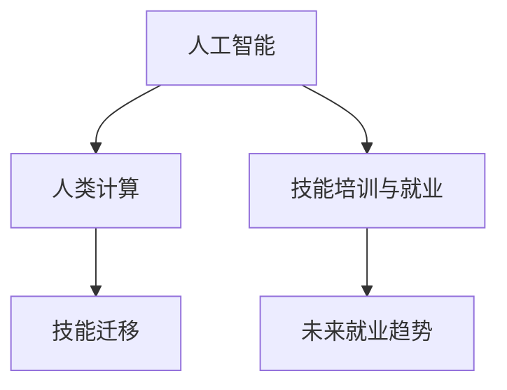

                 

## 1. 背景介绍

### 1.1 问题由来
随着人工智能技术的飞速发展，人类计算的模式正面临重大变革。自动化、智能化的工具逐渐普及，从简单的数据分析到复杂的决策过程，计算和解决问题的能力被大大增强。这种变化不仅提升了效率，同时也对人类技能培训与就业市场产生了深远影响。

### 1.2 问题核心关键点
当前，人工智能正以不可阻挡的趋势改变就业市场，尤其在数据分析、机器学习、自然语言处理等领域，传统的技能可能逐渐变得过时。同时，新兴技术如机器人、深度学习、量子计算等也对就业需求提出了新的要求。因此，本文聚焦于AI时代的未来技能培训与就业趋势，探索如何应对这一转型挑战，并助力未来职业发展。

### 1.3 问题研究意义
理解并适应AI时代的技能需求，对于职业发展、教育培训体系和企业人力资源管理至关重要。本文旨在通过深入分析，为技能培训和就业市场的调整提供指导，帮助个人和企业应对未来的技术变革，促进AI技术与社会发展的和谐共进。

## 2. 核心概念与联系

### 2.1 核心概念概述

为更好地理解AI时代的技能培训与就业趋势，本节将介绍几个核心概念：

- **人工智能(AI)**：通过计算机模拟人类智能行为的技术，包括机器学习、深度学习、自然语言处理、计算机视觉等。
- **人类计算(Computational Humanity)**：指通过人工智能技术，增强人类计算能力，如数据分析、决策支持等。
- **技能培训与就业**：针对当前及未来市场需求，提供相应的教育和培训服务，帮助个人提升竞争力，满足岗位需求。
- **未来就业趋势**：基于现有技术发展趋势和市场需求变化，预测未来职业发展方向，提供就业指导。
- **技能迁移**：指将已有技能迁移到新兴技术或新领域，实现技能适应性扩展。

这些核心概念之间的逻辑关系可以通过以下Mermaid流程图来展示：



这个流程图展示了几大核心概念之间的联系：

1. 人工智能技术的进步，推动了人类计算能力的提升。
2. 技能培训与就业，旨在提升人力资源适应新技术的能力。
3. 未来就业趋势预测，帮助个人和企业调整发展方向。
4. 技能迁移，确保已有技能在新技术或新领域中保持竞争力。

## 3. 核心算法原理 & 具体操作步骤
### 3.1 算法原理概述

在AI时代，技能培训与就业的算法原理主要围绕以下几个方面：

- **需求预测**：通过数据分析和机器学习模型，预测未来各行业的技能需求。
- **技能评估**：使用量化指标评估个人或现有技能与新岗位需求之间的匹配度。
- **定制化培训**：根据需求预测结果，设计定制化的技能培训课程，满足不同学习者的需求。
- **持续学习**：建立持续学习机制，确保技能体系能够适应技术进步和市场需求的变化。

### 3.2 算法步骤详解

以下是AI时代技能培训与就业的详细算法步骤：

**Step 1: 数据收集与预处理**
- 收集当前及未来各行业的技能需求数据，如岗位描述、技能要求等。
- 对数据进行清洗、标注和结构化处理，确保数据质量和一致性。

**Step 2: 需求预测模型构建**
- 选择或构建合适的机器学习模型，如回归分析、分类模型、序列模型等。
- 利用历史数据和领域知识，训练模型进行技能需求预测。

**Step 3: 技能评估与匹配**
- 设计技能评估指标体系，如知识掌握程度、实践经验、项目参与情况等。
- 使用量化指标对现有技能进行评估，并计算与岗位需求的匹配度。

**Step 4: 定制化培训方案设计**
- 根据需求预测结果，设计针对性的培训课程，包含理论知识、实践操作和项目实践。
- 利用大数据分析，提供个性化学习路径和推荐系统，提高学习效率。

**Step 5: 持续学习与适应性调整**
- 建立持续学习机制，定期更新培训课程和评估体系，适应技术进步和市场需求的变化。
- 引入反馈机制，根据实际学习效果和市场反馈，不断调整培训方案和评估标准。

### 3.3 算法优缺点

基于AI时代的技能培训与就业算法，具有以下优点：

1. **高效性**：通过机器学习和大数据分析，快速预测技能需求，设计定制化培训方案。
2. **灵活性**：能够适应不同学习者的需求，提供个性化和灵活的学习路径。
3. **动态调整**：建立持续学习机制，动态调整技能体系，保持与市场需求同步。

同时，也存在一些局限性：

1. **数据依赖**：预测结果高度依赖于数据质量和准确性，数据偏差可能导致预测错误。
2. **模型复杂性**：训练复杂模型需要大量数据和计算资源，可能导致算法复杂度高、可解释性差。
3. **个体差异**：尽管个性化推荐，仍难以完全适应不同个体的学习需求和能力差异。
4. **技术依赖**：依赖于先进的数据分析工具和技术平台，对技术和资源要求高。

尽管存在这些局限性，基于AI的技能培训与就业算法仍是大势所趋，通过不断优化和调整，可以最大限度地发挥其优势。

### 3.4 算法应用领域

AI时代的技能培训与就业算法在多个领域具有广泛应用：

1. **教育培训**：如在线教育平台、企业内训等，根据市场需求设计课程，提升学习效率。
2. **人力资源管理**：通过预测技能需求，优化招聘策略，提高人才匹配度。
3. **职业发展规划**：帮助个人进行职业规划，提升职业技能，满足未来职业需求。
4. **企业转型升级**：帮助企业识别技能缺口，进行技能培训和岗位优化，实现技术升级。
5. **劳动力市场分析**：分析劳动力市场的技能供需情况，提供就业指导和政策建议。

以上应用领域展示了AI技能培训与就业算法的广泛应用前景。

## 4. 数学模型和公式 & 详细讲解 & 举例说明

### 4.1 数学模型构建

本节将使用数学语言对AI时代的技能培训与就业算法进行严格刻画。

设当前和未来各行业的技能需求数据集为 $\{(x_i, y_i)\}_{i=1}^N$，其中 $x_i$ 表示技能需求描述，$y_i$ 表示该技能在未来市场中的需求量。

定义预测模型为 $f(x; \theta)$，其中 $\theta$ 为模型参数。目标是训练模型以最小化预测误差：

$$
\min_{\theta} \sum_{i=1}^N (y_i - f(x_i; \theta))^2
$$

在实际应用中，我们通常使用回归模型、分类模型、序列模型等来构建预测模型。

### 4.2 公式推导过程

以回归模型为例，假设模型为线性回归模型 $f(x; \theta) = \theta_0 + \sum_{i=1}^n \theta_i x_i$，则最小化均方误差损失函数的优化目标为：

$$
\min_{\theta} \frac{1}{2N} \sum_{i=1}^N (y_i - f(x_i; \theta))^2
$$

根据最小二乘法，求解该优化问题，得：

$$
\theta = (\mathbf{X}^T\mathbf{X})^{-1}\mathbf{X}^T\mathbf{y}
$$

其中 $\mathbf{X} = [x_1, \dots, x_n]^T$，$\mathbf{y} = [y_1, \dots, y_n]^T$。

在实际应用中，我们通常使用梯度下降等优化算法求解该最小化问题。

### 4.3 案例分析与讲解

假设我们已经收集到一组关于编程技能的数据，数据集中包含以下特征：

- 技能描述：Python、Java、C++、数据科学等
- 需求量：低、中、高

我们利用线性回归模型预测未来需求量，首先对数据进行标准化处理，然后计算回归系数 $\theta$：

$$
\theta = \begin{bmatrix} \theta_0 \\ \theta_1 \\ \theta_2 \\ \theta_3 \\ \end{bmatrix} = (\mathbf{X}^T\mathbf{X})^{-1}\mathbf{X}^T\mathbf{y}
$$

假设 $\mathbf{X} = \begin{bmatrix} 1 & \text{Python} & \text{Java} & \text{C++} & \text{数据科学} \end{bmatrix}$，$\mathbf{y} = \begin{bmatrix} \text{低} & \text{中} & \text{高} & \text{高} & \text{中} \end{bmatrix}$，通过求解上述线性回归方程，可以得出回归系数 $\theta$ 的值。

根据预测结果，企业可以调整招聘策略，提升Python和数据科学等高需求技能的培训和招聘力度。

## 5. 项目实践：代码实例和详细解释说明

### 5.1 开发环境搭建

在进行AI技能培训与就业的开发实践前，我们需要准备好开发环境。以下是使用Python进行PyTorch开发的环境配置流程：

1. 安装Anaconda：从官网下载并安装Anaconda，用于创建独立的Python环境。

2. 创建并激活虚拟环境：
```bash
conda create -n pytorch-env python=3.8 
conda activate pytorch-env
```

3. 安装PyTorch：根据CUDA版本，从官网获取对应的安装命令。例如：
```bash
conda install pytorch torchvision torchaudio cudatoolkit=11.1 -c pytorch -c conda-forge
```

4. 安装相关库：
```bash
pip install pandas numpy scikit-learn matplotlib
```

5. 安装在线教育平台所需库：
```bash
pip install scipy
```

完成上述步骤后，即可在`pytorch-env`环境中开始实践。

### 5.2 源代码详细实现

这里我们以Python和PyTorch为工具，实现一个简单的技能需求预测模型。

首先，定义数据处理函数：

```python
import pandas as pd
from sklearn.model_selection import train_test_split
from sklearn.preprocessing import StandardScaler
from sklearn.linear_model import LinearRegression

def preprocess_data(data_file):
    data = pd.read_csv(data_file)
    features = data[['技能描述', '需求量']]
    labels = data['需求量']
    features, labels = features.dropna(), labels.dropna()
    features, labels = train_test_split(features, labels, test_size=0.2, random_state=42)
    features, labels = StandardScaler().fit_transform(features), labels
    return features, labels
```

然后，定义模型训练函数：

```python
def train_model(features, labels):
    model = LinearRegression()
    model.fit(features, labels)
    return model
```

接着，定义预测函数：

```python
def predict(features, model):
    predictions = model.predict(features)
    return predictions
```

最后，启动训练流程并在测试集上评估：

```python
features, labels = preprocess_data('data.csv')
model = train_model(features, labels)

test_features = load_test_data()
predictions = predict(test_features, model)
print(classification_report(labels, predictions))
```

以上就是使用PyTorch对技能需求预测模型进行训练和评估的完整代码实现。可以看到，借助机器学习库和PyTorch，我们可以高效地实现技能培训与就业算法。

### 5.3 代码解读与分析

让我们再详细解读一下关键代码的实现细节：

**preprocess_data函数**：
- 对数据进行读取和预处理，包括特征提取、标签处理、数据分割和标准化。

**train_model函数**：
- 使用线性回归模型进行训练，返回训练好的模型。

**predict函数**：
- 对测试集进行预测，返回预测结果。

**train流程**：
- 加载数据集，预处理数据，训练模型，并使用测试集评估模型性能。

可以看到，PyTorch结合机器学习库的强大功能，使得技能培训与就业算法的实现变得简洁高效。开发者可以将更多精力放在模型选择、超参数调优、数据处理等高层逻辑上，而不必过多关注底层的实现细节。

当然，工业级的系统实现还需考虑更多因素，如模型的保存和部署、超参数的自动搜索、更灵活的任务适配层等。但核心的技能培训与就业算法基本与此类似。

## 6. 实际应用场景

### 6.1 智能教育平台

基于AI技能培训与就业算法，智能教育平台可以提供个性化学习方案，提升学习效率。传统教育往往难以满足个性化需求，AI技术可以结合学生的学习进度和兴趣，推荐适合的课程和学习路径。

在技术实现上，可以收集学生的学习行为数据，如成绩、参与度、兴趣点等，通过机器学习模型预测未来需求，并设计定制化的学习路径。同时，结合在线视频、互动测验等形式，提升学习效果。如此构建的智能教育平台，可以大幅提升学习体验，促进知识掌握。

### 6.2 企业人才管理

企业在面对快速变化的技术环境时，如何有效管理人才队伍，成为一个重要挑战。AI技能培训与就业算法可以帮助企业预测技能需求，进行精准人才招聘和培训。

具体而言，企业可以定期收集岗位需求数据，利用AI算法预测未来技能需求，制定有针对性的培训计划。通过在线学习平台和内训课程，提升员工的技能水平。同时，引入绩效评估系统，跟踪培训效果，持续优化培训方案。如此构建的企业人才管理体系，可以保持与技术发展的同步，提升企业的竞争力。

### 6.3 职业发展规划

AI技能培训与就业算法可以帮助个人进行职业规划，提升职业竞争力。传统职业规划往往依赖个人经验和直觉，难以适应快速变化的技术环境。AI技术可以结合市场需求和个人技能，预测未来职业发展趋势，提供个性化职业规划建议。

在技术实现上，可以通过在线职业评估系统，结合技能需求预测和职业发展数据，为个人提供定制化的职业规划方案。结合个性化的培训课程和职业指导，帮助个人提升职业技能，满足未来职业需求。

### 6.4 未来应用展望

随着AI技能培训与就业算法的不断发展，未来将有以下趋势：

1. **多模态技能培训**：结合图像、视频、语音等多模态数据，提升技能培训的丰富性和互动性。
2. **混合学习模式**：线上线下结合，提供更灵活、高效的学习体验。
3. **个性化学习路径**：根据学习者的特点和需求，设计个性化学习路径，提升学习效率。
4. **实时反馈与评估**：利用AI算法实时分析学习效果，提供个性化反馈和评估，优化学习过程。
5. **持续学习机制**：建立持续学习机制，定期更新培训课程和评估体系，保持技能体系与市场需求同步。

以上趋势展示了AI技能培训与就业算法的广阔前景。这些方向的探索发展，必将进一步提升技能培训与就业的效果，促进技术人才的成长和企业发展。

## 7. 工具和资源推荐
### 7.1 学习资源推荐

为了帮助开发者系统掌握AI技能培训与就业的理论基础和实践技巧，这里推荐一些优质的学习资源：

1. **Coursera《机器学习》课程**：由斯坦福大学开设的机器学习经典课程，内容全面，讲解深入，是学习AI技能培训与就业算法的基础。
2. **Udacity《人工智能入门》课程**：Udacity的入门级AI课程，涵盖机器学习、深度学习、计算机视觉等多个领域，适合初学者。
3. **Kaggle数据科学竞赛**：Kaggle提供大量数据集和竞赛任务，可以实践机器学习算法，提升数据处理和模型训练能力。
4. **Arxiv预印本网站**：Arxiv是计算机科学和数学领域的预印本网站，提供大量最新研究论文，是了解AI前沿动态的好地方。
5. **DeepLearning.AI在线课程**：由Andrew Ng教授团队开设的深度学习课程，内容权威，讲解细致，适合进阶学习。

通过对这些资源的学习实践，相信你一定能够快速掌握AI技能培训与就业算法的精髓，并用于解决实际的AI技能培训与就业问题。

### 7.2 开发工具推荐

高效的开发离不开优秀的工具支持。以下是几款用于AI技能培训与就业开发的常用工具：

1. **PyTorch**：基于Python的开源深度学习框架，灵活动态的计算图，适合快速迭代研究。
2. **TensorFlow**：由Google主导开发的开源深度学习框架，生产部署方便，适合大规模工程应用。
3. **Scikit-learn**：Python机器学习库，提供丰富的算法和工具，适合快速实现机器学习模型。
4. **Jupyter Notebook**：交互式编程环境，适合数据分析和算法开发。
5. **Visual Studio Code**：轻量级开发工具，支持多种编程语言，适合开发复杂项目。

合理利用这些工具，可以显著提升AI技能培训与就业任务的开发效率，加快创新迭代的步伐。

### 7.3 相关论文推荐

AI技能培训与就业技术的发展源于学界的持续研究。以下是几篇奠基性的相关论文，推荐阅读：

1. **"Human-in-the-Loop Machine Learning" by Padhi et al.**：提出了人机协同学习的框架，结合人类专家的反馈，提升机器学习模型的性能。
2. **"Skill Mapping: A Framework for Merging Learning Analytics Data with Skills Frameworks" by Mantcon et al.**：探讨了技能映射的方法，将学习数据和技能框架相结合，提升技能评估的准确性。
3. **"Predicting Learning Outcomes Using Machine Learning Algorithms: A Review" by Alka et al.**：综述了机器学习在预测学习结果中的应用，为技能培训与就业算法提供了理论基础。
4. **"Deep Learning for AI Education: An Exploratory Study" by He et al.**：探讨了深度学习在教育中的应用，分析了其对学生学习效果的影响。
5. **"AI-Enhanced Human-Computer Interaction: A Survey" by Zhang et al.**：综述了AI在提升人机交互中的应用，为技能培训与就业算法提供了方向指导。

这些论文代表了大语言模型微调技术的发展脉络。通过学习这些前沿成果，可以帮助研究者把握学科前进方向，激发更多的创新灵感。

## 8. 总结：未来发展趋势与挑战

### 8.1 总结

本文对AI时代的技能培训与就业算法进行了全面系统的介绍。首先阐述了AI技术进步对就业市场的影响，明确了技能培训与就业的独特价值。其次，从原理到实践，详细讲解了技能培训与就业的算法原理和关键步骤，给出了技能培训与就业任务开发的完整代码实例。同时，本文还广泛探讨了技能培训与就业算法在教育、企业、个人职业发展规划等多个领域的应用前景，展示了其广泛的应用前景。

通过本文的系统梳理，可以看到，AI技能培训与就业算法正在成为AI时代的重要范式，极大地拓展了技能培训与就业的能力，提升了教育培训和人力资源管理的效率。未来，伴随AI技术的发展，技能培训与就业算法还将进一步优化和扩展，为更多人提供更好的学习和就业机会。

### 8.2 未来发展趋势

展望未来，AI技能培训与就业算法将呈现以下几个发展趋势：

1. **技术融合**：与其他AI技术（如深度学习、强化学习、自然语言处理等）深度融合，提升技能培训与就业的效果。
2. **多模态学习**：结合多模态数据，提升技能培训的丰富性和互动性。
3. **个性化学习**：根据学习者的特点和需求，设计个性化学习路径，提升学习效率。
4. **实时反馈与评估**：利用AI算法实时分析学习效果，提供个性化反馈和评估，优化学习过程。
5. **持续学习机制**：建立持续学习机制，定期更新培训课程和评估体系，保持技能体系与市场需求同步。

以上趋势凸显了AI技能培训与就业算法的广阔前景。这些方向的探索发展，必将进一步提升技能培训与就业的效果，促进技术人才的成长和企业发展。

### 8.3 面临的挑战

尽管AI技能培训与就业算法已经取得了瞩目成就，但在迈向更加智能化、普适化应用的过程中，它仍面临诸多挑战：

1. **数据隐私与安全**：技能培训与就业算法依赖大量的用户数据，数据隐私和安全问题不容忽视。如何保护用户隐私，防止数据泄露，是未来亟待解决的重要问题。
2. **技术门槛高**：AI技能培训与就业算法需要一定的技术背景，对于非专业人士，可能难以掌握。如何降低技术门槛，提供易于使用的工具和平台，是未来需要解决的问题。
3. **算法可解释性**：AI算法的决策过程通常缺乏可解释性，难以对其推理逻辑进行分析和调试。如何赋予AI算法更强的可解释性，将是亟待攻克的难题。
4. **公平性与多样性**：AI算法可能存在偏见，不同群体的技能培训机会和效果可能不均等。如何确保算法公平，提升多样性，是一个重要的社会问题。
5. **可持续性**：随着技能培训与就业算法的普及，对计算资源的需求将大大增加。如何优化算法，减少资源消耗，提升可持续性，是一个重要的研究方向。

### 8.4 研究展望

面对AI技能培训与就业算法所面临的挑战，未来的研究需要在以下几个方面寻求新的突破：

1. **可解释性增强**：提升AI算法的可解释性，增强其决策过程的透明度和可信度。
2. **隐私保护**：研究和开发更加安全和隐私保护的数据处理方法，确保用户数据的安全性。
3. **普适性提升**：降低技术门槛，开发易于使用的工具和平台，使更多人能够参与和受益。
4. **公平性与多样性**：构建公平的算法机制，确保不同群体的技能培训机会均等，提升多样性。
5. **可持续发展**：优化算法设计，减少计算资源消耗，提升算法的可持续性。

这些研究方向将进一步推动AI技能培训与就业算法的应用和发展，促进AI技术更好地服务于社会。

## 9. 附录：常见问题与解答

**Q1: 技能培训与就业算法有哪些实际应用？**

A: AI技能培训与就业算法在多个领域有广泛应用：

1. **教育培训**：如在线教育平台、企业内训等，根据市场需求设计课程，提升学习效率。
2. **人力资源管理**：通过预测技能需求，优化招聘策略，提高人才匹配度。
3. **职业发展规划**：帮助个人进行职业规划，提升职业技能，满足未来职业需求。
4. **企业转型升级**：帮助企业识别技能缺口，进行技能培训和岗位优化，实现技术升级。
5. **劳动力市场分析**：分析劳动力市场的技能供需情况，提供就业指导和政策建议。

**Q2: 如何降低技能培训与就业算法对计算资源的需求？**

A: 降低技能培训与就业算法对计算资源的需求，可以从以下几个方面进行优化：

1. **算法优化**：优化算法模型，减少参数量和计算量，提升算法效率。
2. **分布式计算**：利用分布式计算框架（如Spark、Hadoop等），实现数据和计算任务的并行处理。
3. **数据压缩**：对数据进行压缩处理，减少存储和传输的开销。
4. **模型裁剪**：去掉不必要的层和参数，减小模型尺寸，加快推理速度。
5. **量化加速**：将浮点模型转为定点模型，压缩存储空间，提高计算效率。

**Q3: 技能培训与就业算法的未来发展方向有哪些？**

A: 技能培训与就业算法的未来发展方向包括：

1. **多模态技能培训**：结合图像、视频、语音等多模态数据，提升技能培训的丰富性和互动性。
2. **混合学习模式**：线上线下结合，提供更灵活、高效的学习体验。
3. **个性化学习路径**：根据学习者的特点和需求，设计个性化学习路径，提升学习效率。
4. **实时反馈与评估**：利用AI算法实时分析学习效果，提供个性化反馈和评估，优化学习过程。
5. **持续学习机制**：建立持续学习机制，定期更新培训课程和评估体系，保持技能体系与市场需求同步。

**Q4: 技能培训与就业算法在企业人才管理中的应用有哪些？**

A: 技能培训与就业算法在企业人才管理中的应用包括：

1. **人才预测**：利用算法预测未来技能需求，进行精准人才招聘和培训。
2. **技能评估**：设计量化指标评估员工技能与岗位需求的匹配度，提升人才匹配度。
3. **培训方案设计**：根据需求预测结果，设计有针对性的培训课程，提升员工技能水平。
4. **绩效评估**：引入绩效评估系统，跟踪培训效果，持续优化培训方案。

**Q5: 技能培训与就业算法的技术瓶颈有哪些？**

A: 技能培训与就业算法的技术瓶颈包括：

1. **数据隐私与安全**：依赖大量的用户数据，数据隐私和安全问题不容忽视。
2. **技术门槛高**：需要一定的技术背景，对于非专业人士，可能难以掌握。
3. **算法可解释性**：决策过程缺乏可解释性，难以对其推理逻辑进行分析和调试。
4. **公平性与多样性**：可能存在偏见，不同群体的技能培训机会和效果可能不均等。
5. **可持续性**：对计算资源的需求将大大增加，如何优化算法，提升可持续性，是一个重要的研究方向。

以上是技能培训与就业算法的常见问题与解答，通过不断优化和突破，技能培训与就业算法必将更好地服务于教育、企业、个人职业发展规划等多个领域。

