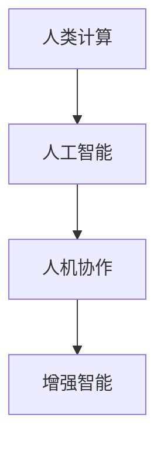

                 

# 人类计算：人机协作的新时代

## 1. 背景介绍

在过去几十年间，计算机技术的飞速发展极大地推动了人类社会的进步，使得许多从前难以想象的事情变得可能。然而，即便是计算机变得日益强大，它仍然在某些领域存在短板，特别是在需要高度复杂和富有创造力的任务中。人类计算的出现，为我们提供了一个全新的思路：通过将人类智慧和计算能力有机结合，我们可以共同攻克更为复杂的问题。本文将探讨人类计算的概念、原理、实现方法，并分析其在实际应用场景中的潜力和挑战。

## 2. 核心概念与联系

### 2.1 核心概念概述

为更好地理解人类计算，我们将介绍几个关键概念及其之间的联系。

- **人类计算**：指利用人类的逻辑思维、创造力以及专业知识来解决复杂问题的过程。这种计算方式结合了人类的直觉和判断力，以及计算机的高效处理能力。
- **人工智能**：一种通过模拟人类智能行为来解决问题的技术，包括机器学习、深度学习、自然语言处理等。
- **人机协作**：指将人类和计算机的优势结合起来，共同完成复杂任务的协作方式。
- **增强智能**：通过将人工智能技术与人类智慧相结合，来提升人类的认知能力和决策效率。

### 2.2 核心概念原理和架构的 Mermaid 流程图



这个流程图展示了人类计算与其他核心概念之间的关系：

1. 人类计算是基于人工智能技术的，通过AI来辅助人类解决复杂问题。
2. 人机协作是人类计算的关键，其中人类提供判断和决策，计算机提供数据处理和算法支持。
3. 增强智能则体现了人类计算的最终目标，即通过人工智能技术的辅助，提升人类智慧和能力。

## 3. 核心算法原理 & 具体操作步骤

### 3.1 算法原理概述

人类计算的核心算法原理主要包括：

- **人类直觉**：利用人类在长期积累的直觉和经验来指导AI模型，使其在复杂决策中表现更佳。
- **AI算法**：将复杂问题分解为多个子问题，并利用AI算法（如深度学习、强化学习等）进行求解。
- **融合与反馈**：将AI的计算结果反馈给人类，由人类进一步分析判断，然后再将判断结果输入AI系统进行进一步计算，形成一个闭环反馈系统。

### 3.2 算法步骤详解

人类计算的算法步骤主要包括以下几个步骤：

1. **问题定义**：明确问题并定义解决目标，确保问题可以明确分解为多个子问题。
2. **数据准备**：收集、整理和预处理数据，以便后续AI模型的训练和推理。
3. **模型训练**：选择适当的AI模型，并使用大量数据进行训练，确保模型能够高效处理复杂问题。
4. **人机协作**：在问题解决过程中，将AI模型的输出结果反馈给人类，由人类进行分析和决策。
5. **结果验证与优化**：对人类和AI模型的输出结果进行验证和优化，确保最终结果准确性。

### 3.3 算法优缺点

人类计算的算法具有以下优点：

- **融合人类直觉**：结合人类的逻辑思维和直觉，能够处理复杂、非结构化的问题。
- **高效处理**：利用AI的高效计算能力，可以处理大量数据并快速得到结果。
- **增强决策**：通过人机协作，可以提升决策的质量和准确性。

然而，人类计算也存在一些缺点：

- **依赖人类专业知识**：对人类的专业知识要求较高，当人类知识不足时，可能影响最终结果。
- **训练复杂**：模型训练和调优过程复杂，需要大量资源和专业知识。
- **成本较高**：需要同时投入人力和AI资源，成本相对较高。

### 3.4 算法应用领域

人类计算的应用领域广泛，包括但不限于以下几个方面：

- **医疗诊断**：利用AI辅助医生进行复杂病例的诊断和治疗决策。
- **金融分析**：通过人机协作，对复杂金融市场进行预测和分析。
- **创意设计**：结合人工智能与人类创造力，进行创意设计和产品开发。
- **科学研究**：利用AI处理大数据，辅助科学家进行复杂问题的研究和发现。

## 4. 数学模型和公式 & 详细讲解 & 举例说明

### 4.1 数学模型构建

人类计算的数学模型通常包含以下几个要素：

- **输入数据**：需要输入的数据，如文本、图像、音频等。
- **模型结构**：选择的AI模型，如深度神经网络、卷积神经网络、循环神经网络等。
- **损失函数**：用于衡量模型预测结果与真实结果之间的差异。
- **优化算法**：用于训练模型，如梯度下降、Adam、RMSprop等。

### 4.2 公式推导过程

以下以深度学习中的多分类问题为例，推导常用的交叉熵损失函数及其梯度计算公式。

假设模型输出为向量 $\hat{y} = [\hat{y}_1, \hat{y}_2, ..., \hat{y}_C]$，其中 $C$ 为类别数，真实标签为 $y \in [1, 2, ..., C]$。

交叉熵损失函数定义为：

$$
\mathcal{L}(y, \hat{y}) = -\sum_{i=1}^C y_i \log \hat{y}_i
$$

其梯度计算公式为：

$$
\frac{\partial \mathcal{L}}{\partial \hat{y}_j} = -y_j \frac{1}{\hat{y}_j} + \sum_{i \neq j} \frac{y_i}{\hat{y}_i}
$$

其中 $j$ 为当前类别，$i$ 为所有其他类别。

### 4.3 案例分析与讲解

假设我们要构建一个用于图像分类的AI模型。我们可以使用卷积神经网络（CNN）作为模型结构，并通过大规模的图像数据进行训练。训练过程中，我们会使用交叉熵损失函数，并使用梯度下降等优化算法来调整模型参数。

在实际应用中，我们将待分类的图像输入模型，模型输出每个类别的预测概率。然后，我们将真实标签与模型输出进行对比，计算损失，并根据损失反向传播更新模型参数。通过多轮迭代，模型逐步优化，最终得到较高的准确率。

## 5. 项目实践：代码实例和详细解释说明

### 5.1 开发环境搭建

在进行人类计算项目实践前，我们需要准备好开发环境。以下是使用Python进行TensorFlow开发的环境配置流程：

1. 安装Anaconda：从官网下载并安装Anaconda，用于创建独立的Python环境。

2. 创建并激活虚拟环境：
```bash
conda create -n tf-env python=3.8 
conda activate tf-env
```

3. 安装TensorFlow：
```bash
conda install tensorflow==2.7 -c conda-forge
```

4. 安装各类工具包：
```bash
pip install numpy pandas scikit-learn matplotlib tqdm jupyter notebook ipython
```

完成上述步骤后，即可在`tf-env`环境中开始实践。

### 5.2 源代码详细实现

我们以图像分类为例，给出使用TensorFlow构建卷积神经网络并进行多分类训练的PyTorch代码实现。

```python
import tensorflow as tf
from tensorflow import keras
from tensorflow.keras import layers

# 加载数据集
(train_images, train_labels), (test_images, test_labels) = keras.datasets.mnist.load_data()

# 数据预处理
train_images = train_images / 255.0
test_images = test_images / 255.0

# 构建模型
model = keras.Sequential([
    layers.Flatten(input_shape=(28, 28)),
    layers.Dense(128, activation='relu'),
    layers.Dense(10, activation='softmax')
])

# 定义损失函数和优化器
loss_fn = tf.keras.losses.CategoricalCrossentropy()
optimizer = tf.keras.optimizers.Adam()

# 编译模型
model.compile(optimizer=optimizer,
              loss=loss_fn,
              metrics=['accuracy'])

# 训练模型
model.fit(train_images, train_labels, epochs=10, 
          validation_data=(test_images, test_labels))
```

### 5.3 代码解读与分析

让我们再详细解读一下关键代码的实现细节：

**模型构建**：
- 使用`keras.Sequential`构建模型，包含两个全连接层，第一层为输入层，第二层为输出层，激活函数分别为ReLU和Softmax。

**数据预处理**：
- 将像素值归一化到[0,1]之间，以适应模型训练。

**模型编译**：
- 指定优化器为Adam，损失函数为交叉熵损失函数，同时设置模型的评价指标为准确率。

**模型训练**：
- 使用训练集进行模型训练，设置训练轮数为10，并在验证集上进行验证。

## 6. 实际应用场景

### 6.1 医疗诊断

人类计算在医疗诊断中具有重要的应用前景。医学影像、基因组学等领域的数据复杂度较高，传统方法难以有效处理。通过结合AI和人类医学专家的智慧，可以显著提高诊断的准确性和效率。

例如，在乳腺癌诊断中，AI可以处理大量医学影像数据，提取特征并进行初步判断。然后，由医生进行人工复审，结合临床经验，最终给出诊断结果。这种人机协作的方式，可以显著提升诊断的准确性和一致性。

### 6.2 金融分析

金融市场复杂多变，需要同时考虑各种宏观和微观因素。利用人类计算，可以更好地理解和预测市场动态。

例如，在金融投资决策中，AI可以分析海量数据，提取出关键的指标和趋势。然后，结合人类投资专家的经验和直觉，进行综合决策。这种多层次、多维度的分析方式，可以显著提高投资策略的科学性和稳健性。

### 6.3 创意设计

创意设计是高度依赖于人类直觉和创造力的领域。通过人类计算，可以结合AI的计算能力，帮助设计师进行更高效的创意生成和设计。

例如，在建筑设计中，AI可以生成多种设计方案，设计师则根据创意需求进行筛选和优化。这种人机协作的方式，可以大幅缩短设计周期，提高设计质量。

### 6.4 未来应用展望

随着技术的发展，人类计算的应用将更加广泛和深入。未来，人类计算可能在以下几个方面得到广泛应用：

- **智能制造**：结合AI和人类工程专家的智慧，实现智能化、个性化生产。
- **智慧城市**：利用AI和人类城市规划专家的知识，构建更加智能、可持续的城市。
- **智能交通**：结合AI和人类交通专家的智慧，优化交通管理，提升出行效率。

## 7. 工具和资源推荐

### 7.1 学习资源推荐

为了帮助开发者系统掌握人类计算的理论基础和实践技巧，这里推荐一些优质的学习资源：

1. 《人类计算》系列博文：由人类计算技术专家撰写，深入浅出地介绍了人类计算的原理、应用和未来发展方向。

2. Coursera《人类计算与人工智能》课程：提供系统化的课程，涵盖人类计算、人工智能、人机协作等核心概念和前沿技术。

3. 《增强智能》书籍：探讨了如何通过人工智能与人类智慧的结合，实现增强智能。

4. IEEE Xplore：包含大量人类计算相关的论文和技术报告，是深入学习该领域的必读资料。

5. arXiv：提供最新的学术论文和预印本，涵盖人类计算、AI等前沿技术，是探索新技术的重要平台。

通过对这些资源的学习实践，相信你一定能够快速掌握人类计算的精髓，并用于解决实际的复杂问题。

### 7.2 开发工具推荐

高效的开发离不开优秀的工具支持。以下是几款用于人类计算开发的常用工具：

1. TensorFlow：基于Python的开源深度学习框架，灵活动态的计算图，适合快速迭代研究。

2. PyTorch：同样基于Python的开源深度学习框架，灵活易用，适合学术研究和工程实践。

3. Jupyter Notebook：支持多种编程语言，集成了强大的代码编辑器和交互式界面，适合进行数据探索和算法开发。

4. Scikit-learn：提供了多种常用的机器学习算法和工具，方便快速实现分类、回归等任务。

5. Anaconda：提供了Python环境管理工具，方便创建和管理虚拟环境，支持大规模数据处理和科学计算。

合理利用这些工具，可以显著提升人类计算的开发效率，加快创新迭代的步伐。

### 7.3 相关论文推荐

人类计算的发展源于学界的持续研究。以下是几篇奠基性的相关论文，推荐阅读：

1. "Human-Computer Interaction" by Paul S. Mattau和Howard K.zonar（1980）：介绍了人机交互的基本原理和设计方法。

2. "Artificial Intelligence and the Society" by John S. McCarthy（1967）：探讨了AI技术对人类社会的影响和挑战。

3. "Human-AI Collaboration" by Masao Hamaguchi和Kazuhiko Niiyama（1994）：分析了人机协作在复杂问题解决中的作用和优势。

4. "Human-Computer Interaction in the Next Decade" by Bill Buxton（2015）：探讨了未来人机交互的发展趋势和应用前景。

这些论文代表了大规模语言模型微调技术的发展脉络。通过学习这些前沿成果，可以帮助研究者把握学科前进方向，激发更多的创新灵感。

## 8. 总结：未来发展趋势与挑战

### 8.1 总结

本文对人类计算的概念、原理和实践方法进行了全面系统的介绍。首先阐述了人类计算的重要性及其与人工智能的关系，明确了人类计算在复杂问题解决中的独特价值。其次，从原理到实践，详细讲解了人类计算的数学原理和关键步骤，给出了人类计算任务开发的完整代码实例。同时，本文还广泛探讨了人类计算在医疗诊断、金融分析、创意设计等多个领域的应用前景，展示了人类计算的巨大潜力。此外，本文精选了人类计算技术的各类学习资源，力求为读者提供全方位的技术指引。

通过本文的系统梳理，可以看到，人类计算作为人机协作的新范式，正在成为AI技术落地应用的重要途径，极大地拓展了AI系统的应用边界，催生了更多的落地场景。随着AI技术的不断发展，人类计算将不断融入到人类社会的各个领域，推动人类社会的全面智能化进程。

### 8.2 未来发展趋势

展望未来，人类计算将呈现以下几个发展趋势：

1. **融合度提升**：人类计算和AI的结合将更加紧密，AI可以更加智能化地辅助人类进行决策和计算。
2. **应用范围扩大**：人类计算将从医疗、金融等特定领域，逐步扩展到智能制造、智慧城市、智能交通等更多领域。
3. **跨学科融合**：人类计算将结合更多学科的知识，如心理学、社会学、管理学等，实现更加全面和深入的问题解决。
4. **多模态交互**：人类计算将不仅限于文本和图像数据，还将涵盖语音、视频等多模态数据，实现更加丰富和真实的人机交互。
5. **伦理与安全**：人类计算将更加注重数据隐私和伦理问题，确保人机协作过程的透明性和安全性。

这些趋势凸显了人类计算的前景广阔，为未来的技术发展提供了新的方向。

### 8.3 面临的挑战

尽管人类计算具有巨大的潜力，但在迈向更加智能化、普适化应用的过程中，它仍面临着诸多挑战：

1. **依赖人类知识**：人类计算依赖于人类专家的知识和经验，当专家知识不足时，可能影响计算效果。
2. **数据质量和量级**：需要高质量、大规模的数据作为输入，数据不足或质量低下可能影响计算效果。
3. **算法复杂度**：人类计算通常涉及多层次的算法设计，算法设计复杂，需要大量时间进行调试和优化。
4. **成本和资源**：需要同时投入人类专家和AI资源，成本相对较高，需要更高效的资源管理和优化。

### 8.4 研究展望

面对人类计算面临的挑战，未来的研究需要在以下几个方面寻求新的突破：

1. **数据增强和预处理**：通过数据增强和预处理技术，提升数据质量和多样性，优化模型训练过程。
2. **多层次算法融合**：结合多层次的算法，如符号计算、逻辑推理、机器学习等，提升问题解决的全面性和高效性。
3. **跨学科合作**：与心理学、社会学、管理学等学科进行深入合作，拓展问题解决的跨学科视角。
4. **模型压缩和优化**：通过模型压缩和优化技术，减少计算复杂度，提升计算效率和效果。
5. **伦理和安全保护**：建立数据隐私保护机制和伦理审查制度，确保人机协作过程的透明性和安全性。

这些研究方向将为人机协作技术的发展提供新的思路和动力，推动人类计算技术走向成熟和应用。

## 9. 附录：常见问题与解答

**Q1：人类计算是否适用于所有复杂问题？**

A: 人类计算适用于复杂且需要人类直觉和判断力的问题。对于高度结构化和规则明确的任务，计算机通常能够更高效地解决。

**Q2：人类计算的训练过程如何设计？**

A: 人类计算的训练过程通常包括数据收集、预处理、模型构建、训练和验证等多个环节。在训练过程中，需要结合人类专家的知识，不断迭代优化，确保模型的准确性和鲁棒性。

**Q3：人类计算的计算资源需求如何？**

A: 人类计算需要同时投入人类专家和AI资源，计算资源需求较高。可以通过分布式计算和云计算等技术进行优化。

**Q4：人类计算的输出结果如何解释？**

A: 人类计算的输出结果需要结合人类专家的知识和经验进行解释。AI模型的决策过程需要透明化，便于人类理解和验证。

**Q5：人类计算在实际应用中如何评估效果？**

A: 人类计算的效果评估需要结合多个指标，如准确率、召回率、F1分数、用户满意度等。同时，需要结合专家意见进行多维度评估。

总之，人类计算作为一种新型计算范式，具有广阔的应用前景和深远的社会影响。通过充分利用人类智慧和AI技术，我们可以更加高效地解决复杂问题，推动社会的全面智能化进程。随着技术的不断发展，人类计算将不断拓展其应用范围，成为未来科技发展的重要方向。

