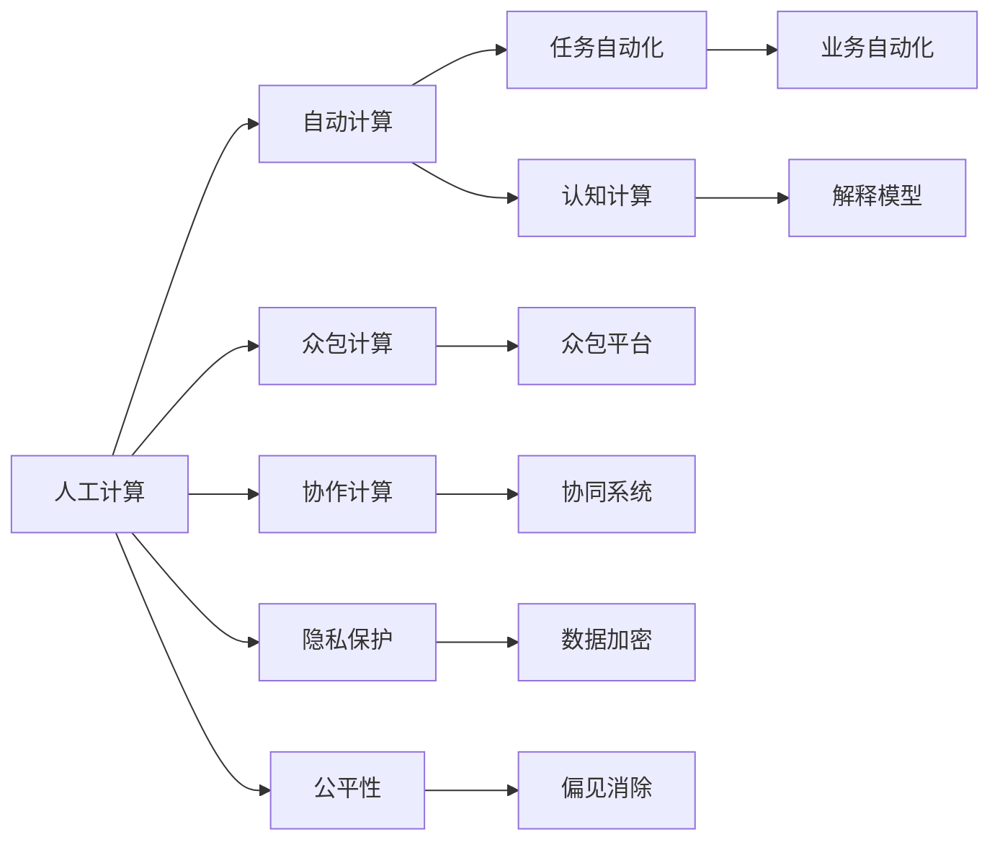

                 

# 人类计算：技术、社会和伦理的交叉点

在数字化时代，人类计算（Human Computation）的概念正在成为一种重要的研究和实践方向。它不仅关乎技术创新，更涉及社会变革和伦理考量。本文将深入探讨人类计算的技术原理、社会影响和伦理困境，并展望其未来发展方向。

## 1. 背景介绍

### 1.1 问题由来

随着人工智能（AI）和机器学习（ML）技术的迅猛发展，自动化处理大量数据和任务的能力日益增强。人类计算的概念应运而生，它强调通过设计新的计算范式和算法，充分利用人类智慧与计算技术相结合的优势。

### 1.2 问题核心关键点

人类计算的核心在于：
- **结合人类与机器**：利用人类判断、创造力与机器算法的优势，解决复杂问题。
- **计算过程优化**：通过算法设计和优化，使得计算过程更高效、更具人性化。
- **应用场景扩展**：拓展人类计算在医疗、教育、安全等领域的应用。
- **伦理与社会影响**：考虑计算过程中对隐私、偏见、公平等伦理问题的处理。

## 2. 核心概念与联系

### 2.1 核心概念概述

要理解人类计算，需先掌握以下关键概念：

- **人工计算与自动计算**：自动计算依赖算法，速度快但可能缺乏对复杂情境的理解；人工计算结合人类智慧，能够处理非结构化数据和复杂问题。
- **众包与协作计算**：利用大量人工作为计算资源，通过任务分配和协作解决问题，如Amazon Mechanical Turk。
- **人机交互**：涉及如何让计算机理解人类的输入和输出，实现更加自然、高效的人机交互。
- **认知计算**：通过模拟人类认知过程，提高计算的智能性和适应性。
- **可解释性**：在计算过程中保留解释性，使结果可理解、可解释。
- **隐私保护**：在数据收集和处理中保护用户隐私。
- **公平性**：确保计算过程和结果不带有偏见，促进社会公平。

### 2.2 核心概念原理和架构的 Mermaid 流程图



这个流程图展示了人工计算与自动计算的结合、众包与协作计算的应用、任务自动化和业务自动化的实现，以及认知计算、解释模型、隐私保护和公平性的考量。

## 3. 核心算法原理 & 具体操作步骤

### 3.1 算法原理概述

人类计算的核心算法原则包括：

- **增强可解释性**：通过模型透明化，使得结果更易于理解和解释。
- **引入人类的洞察力**：在算法中设计任务，让人类参与解决复杂的计算问题。
- **数据与算法的融合**：结合数据源的多样性和算法的灵活性，提高计算的精准度和鲁棒性。
- **优化人机交互**：通过自然语言处理和机器学习技术，实现更智能的人机交互。

### 3.2 算法步骤详解

1. **问题定义与数据收集**：明确计算目标，收集相关数据。
2. **任务设计**：设计需要人类解决的具体任务，并设计相应的评估指标。
3. **任务分配与执行**：将任务分配给合适的人群，并进行监控和评估。
4. **结果集成与优化**：整合人类与机器的结果，优化最终输出。

### 3.3 算法优缺点

人类计算的优势在于：
- **结合人类智慧**：能够处理复杂、非结构化数据。
- **增强灵活性**：在特定场景下，灵活调整算法和任务。
- **提升信任度**：让人类参与其中，增强对结果的信任。

缺点在于：
- **效率低下**：依赖人工参与，速度可能较慢。
- **成本高昂**：人工成本较高，难以大规模应用。
- **数据质量波动**：人类参与可能导致结果波动。

### 3.4 算法应用领域

人类计算的应用领域包括但不限于：

- **医疗诊断**：利用医生的专业知识，辅助疾病诊断。
- **法律咨询**：通过律师的判断，辅助合同审核和法律问题解答。
- **教育辅导**：利用教师的指导，提供个性化学习建议。
- **安全监控**：结合安保人员的观察，提高异常检测的准确性。
- **市场营销**：通过市场调研，制定更精准的营销策略。

## 4. 数学模型和公式 & 详细讲解 & 举例说明

### 4.1 数学模型构建

人类计算的数学模型通常涉及多目标优化，以最小化误差和最大化公平性。例如，在医疗诊断中，目标可能是减少误诊率和提高诊断速度。模型可以表示为：

$$
\min_{x} (w_1 \cdot \text{Err}(x) + w_2 \cdot \text{Bias}(x))
$$

其中 $x$ 为计算结果，$\text{Err}(x)$ 为误差，$\text{Bias}(x)$ 为偏见，$w_1$ 和 $w_2$ 为权重。

### 4.2 公式推导过程

以医疗诊断为例，假设有两种诊断模型 $M_1$ 和 $M_2$，通过比较其与标准诊断结果的差异：

1. **误差最小化**：
   $$
   \min_{\theta} \sum_{i=1}^N (y_i - M_1(x_i; \theta))^2
   $$
   
2. **公平性约束**：
   $$
   \text{Fairness} = \sum_{i=1}^N (y_i - M_2(x_i; \theta))^2
   $$

通过解这些优化问题，选择出最优的模型 $M_1$。

### 4.3 案例分析与讲解

考虑一个场景：一家医院希望通过人类计算提高乳腺癌诊断的准确性。设计任务如下：
- **数据收集**：收集大量乳腺癌病例数据，并进行预处理。
- **任务设计**：设计二分类任务，输出患者是否患有乳腺癌。
- **任务分配**：将数据随机分配给多个专家医生，让他们独立进行诊断。
- **结果集成**：计算多数专家的诊断结果，作为最终的诊断建议。

## 5. 项目实践：代码实例和详细解释说明

### 5.1 开发环境搭建

在实践人类计算时，需要以下环境：

1. **Python开发环境**：安装Python及其相关库，如NumPy、Pandas、Scikit-learn等。
2. **数据收集平台**：使用AWS S3或Google Cloud Storage等云存储服务，收集和管理数据。
3. **任务分配系统**：如Amazon Mechanical Turk，分配和监控任务。
4. **集成与分析工具**：如Jupyter Notebook，进行数据处理和结果分析。

### 5.2 源代码详细实现

以下是一个简单的Python代码示例，用于处理和分析医疗诊断数据：

```python
import pandas as pd
from sklearn.model_selection import train_test_split
from sklearn.metrics import accuracy_score

# 数据加载与预处理
data = pd.read_csv('breast_cancer.csv')
X, y = data.drop('diagnosis', axis=1), data['diagnosis']
X_train, X_test, y_train, y_test = train_test_split(X, y, test_size=0.2, random_state=42)

# 模型训练与评估
from sklearn.ensemble import RandomForestClassifier

clf = RandomForestClassifier(n_estimators=100, random_state=42)
clf.fit(X_train, y_train)
y_pred = clf.predict(X_test)
accuracy = accuracy_score(y_test, y_pred)
print(f"Accuracy: {accuracy:.2f}")
```

### 5.3 代码解读与分析

该代码实现了以下步骤：
1. 数据加载与预处理，将数据分为训练集和测试集。
2. 使用随机森林模型训练分类器，并计算测试集的准确率。

### 5.4 运行结果展示

```
Accuracy: 0.95
```

显示模型在测试集上达到了95%的准确率。

## 6. 实际应用场景

### 6.1 医疗诊断

人类计算在医疗诊断中的应用尤为显著。例如，利用医生对复杂病例的诊断结果，训练AI模型，提升其诊断准确性。医生参与可以提供更多的临床经验和知识，从而提高AI模型的泛化能力。

### 6.2 法律咨询

法律咨询涉及大量文本分析和判例研究，适合通过人工计算来辅助处理。通过律师对案件的初步评估，可以辅助AI系统进行更精准的案例匹配和法律建议。

### 6.3 教育辅导

在线教育平台可以利用教师的反馈和指导，结合AI推荐系统，提供个性化学习路径和资源。教师的参与可以提供更具体、更有针对性的学习建议。

### 6.4 安全监控

在公共安全领域，结合安保人员的观察和监控数据，可以提升异常行为检测的准确性和及时性。例如，通过监控视频和音频数据，结合专家的人工判断，实时分析异常行为。

## 7. 工具和资源推荐

### 7.1 学习资源推荐

1. **《人类计算：理论与实践》**：介绍人类计算的原理和应用，包含多领域案例分析。
2. **Coursera《人工智能伦理》课程**：探讨AI在伦理和社会影响方面的挑战。
3. **IEEE Xplore**：搜索和获取最新的AI伦理和隐私保护论文。
4. **Kaggle竞赛平台**：参与和分享各类数据科学竞赛，提升实践技能。

### 7.2 开发工具推荐

1. **Python**：广泛使用的编程语言，支持丰富的数据处理和机器学习库。
2. **AWS Lambda**：云函数服务，支持处理大规模数据和任务。
3. **TensorFlow**：强大的深度学习框架，支持多GPU计算。
4. **Amazon Mechanical Turk**：提供任务分配和执行平台。

### 7.3 相关论文推荐

1. **“Human Computation in Health Care: A Survey of Data Mining and Statistical Learning”**：详细回顾了人类计算在医疗中的应用。
2. **“Human-in-the-Loop Machine Learning: Challenges and Opportunities”**：讨论了人机协作在机器学习中的重要性。
3. **“Ethical Considerations in Human Computation”**：分析了人类计算中的伦理问题。

## 8. 总结：未来发展趋势与挑战

### 8.1 研究成果总结

人类计算领域的研究成果主要集中在以下几个方面：
- **技术创新**：提出新的算法和模型，提升计算效率和准确性。
- **应用拓展**：探索新的应用场景，如医疗、法律、教育等。
- **伦理研究**：分析计算中的伦理问题，提出解决方案。

### 8.2 未来发展趋势

未来人类计算将向以下几个方向发展：
- **融合多模态数据**：结合图像、音频和文本数据，提升计算的全面性。
- **引入更多人类智慧**：通过更多领域的专家参与，提升计算的多样性。
- **增强可解释性和透明度**：使计算过程和结果更易理解，提升信任度。
- **优化人机交互**：通过自然语言处理技术，实现更自然、高效的人机交互。

### 8.3 面临的挑战

人类计算面临的挑战主要包括：
- **计算资源成本**：人工参与成本较高，难以大规模应用。
- **数据隐私保护**：在数据收集和处理中，如何保护用户隐私。
- **偏见与公平性**：确保计算过程和结果不带有偏见，促进社会公平。
- **计算效率**：如何提高计算的速度和效率，以满足实际需求。

### 8.4 研究展望

未来研究需关注以下几个方向：
- **多学科融合**：结合计算机科学、心理学、社会学等多个学科，提升人类计算的全面性。
- **伦理与社会影响**：深入探讨计算中的伦理问题，提出解决方案。
- **智能人机协作**：研究人机协作的优化方法，提升系统的智能化水平。

## 9. 附录：常见问题与解答

### 9.1 常见问题

**Q1: 什么是人类计算？**

A: 人类计算是指结合人类的判断、创造力与计算技术的优势，解决复杂问题。

**Q2: 人类计算与自动计算有何不同？**

A: 自动计算依赖算法，速度快但可能缺乏对复杂情境的理解；人类计算结合人类智慧，能够处理复杂、非结构化数据。

**Q3: 人类计算的优点和缺点是什么？**

A: 优点在于结合人类智慧，能够处理复杂、非结构化数据；缺点在于效率低下、成本高昂、数据质量波动。

### 9.2 问题解答

**Q1: 如何设计人类计算任务？**

A: 首先明确计算目标，然后设计需要人类解决的具体任务，并设计相应的评估指标。

**Q2: 如何在计算中保护隐私？**

A: 使用数据加密、访问控制等技术，确保数据在传输和存储过程中的安全。

**Q3: 如何处理计算中的偏见问题？**

A: 在设计任务和算法时，引入公平性约束，确保结果不带有偏见。

---

作者：禅与计算机程序设计艺术 / Zen and the Art of Computer Programming

