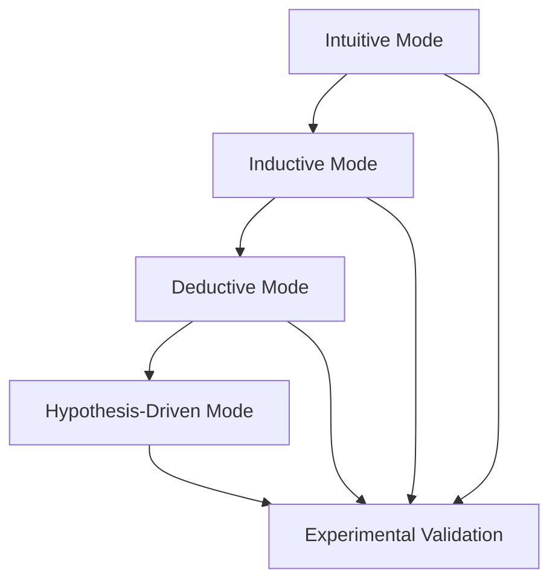

                 

# 人类认知的4种基本模式：假说驱动的发现模式

> 关键词：认知模式, 假说驱动, 发现模式, 实验验证, 理论构建, 人工智能, 认知科学, 科学方法论

## 1. 背景介绍

在人类历史的长河中，认知模式的演进与科技的发展密切相关。从原始直觉到现代理性，从经验归纳到科学实验，人类认知模式的演变是科技发展的核心驱动力。本文将深入探讨人类认知的4种基本模式，重点介绍假说驱动的发现模式，并从认知科学和人工智能的角度进行深入分析。

## 2. 核心概念与联系

### 2.1 核心概念概述

在认知科学中，人类认知模式通常被划分为以下几种基本类型：

- **直觉模式(Intuitive Mode)**：基于直觉和经验进行判断，是人类认知的原始形式。
- **归纳模式(Inductive Mode)**：通过观察和总结大量数据，归纳出一般规律，通常伴随一定的统计误差。
- **演绎模式(Deductive Mode)**：从已有的理论和假设出发，推导出新的结论。
- **假说驱动模式(Hypothesis-Driven Mode)**：先提出一个或多个假说，然后通过实验或数据验证这些假说，以构建或修正理论。

这些模式并非孤立存在，而是相互交织、相互影响。特别是在现代科学和人工智能领域，假说驱动模式成为发现新知识、构建新理论的主要手段。

### 2.2 核心概念原理和架构的 Mermaid 流程图(Mermaid 流程节点中不要有括号、逗号等特殊字符)



这个流程图展示了从直觉模式到假说驱动模式的认知发展路径。直觉模式中的经验积累是归纳模式的基础，归纳模式提炼出的规律又可以作为演绎模式的出发点，而假说驱动模式则是对前两种模式的进一步升华，通过实验验证和理论构建，达到更高的认知水平。

## 3. 核心算法原理 & 具体操作步骤

### 3.1 算法原理概述

假说驱动模式的核心思想是：首先提出一系列假说，然后设计实验或使用数据分析，对这些假说进行验证。这种模式要求研究者具备严谨的逻辑思维和扎实的统计分析能力，以确保假说验证的科学性和可靠性。

### 3.2 算法步骤详解

假说驱动模式的具体操作步骤包括以下几个关键步骤：

**Step 1: 提出假说**
- 基于已有的理论和经验，提出一个或多个可验证的假说。假说应该是具体、可量化的，并且具备清晰的验证路径。

**Step 2: 设计实验**
- 针对提出的假说，设计一系列实验方案，确保实验设计科学、严谨，避免可能的系统误差和随机误差。
- 实验设计应包括对照组、实验组、实验步骤、数据收集方法等要素。

**Step 3: 数据收集与分析**
- 严格按照实验设计方案，收集实验数据。数据收集应尽量全面，涵盖所有可能的干扰因素。
- 使用统计分析方法，对收集到的数据进行分析，检验实验结果是否符合预期假说。

**Step 4: 结果验证**
- 根据统计分析结果，评估假说验证的可靠性。如果实验结果符合预期，则假说被部分或完全验证；如果不符合预期，则需要进行修正或提出新的假说。

**Step 5: 理论构建与优化**
- 基于验证结果，修正或构建新的理论模型。理论模型的构建应遵循科学性和可验证性原则。
- 持续优化模型，通过迭代实验和数据分析，逐步完善理论框架。

### 3.3 算法优缺点

**优点：**
- 假说驱动模式遵循科学实验和统计分析的严谨性，能够有效排除主观偏见和经验误差，提高认知的科学性和可靠性。
- 通过实验验证和理论构建，假说驱动模式能够不断自我修正和完善，提升认知的深度和广度。
- 可以系统性地解决复杂问题，适用于现代科学和人工智能领域。

**缺点：**
- 假说驱动模式对实验设计和数据分析要求较高，需要研究者具备深厚的科学背景和丰富的经验。
- 实验验证过程复杂且耗时，可能难以在短期内获得结果。
- 假说驱动模式依赖数据质量，数据偏差可能影响实验结果。

### 3.4 算法应用领域

假说驱动模式广泛应用于现代科学和人工智能领域，以下是几个典型应用：

**自然科学**：在天文学、物理学、化学等领域，假说驱动模式用于发现新的物质、定律和现象。例如，伽利略通过实验验证日心说，推动了天文学的发展。

**医学**：在医学研究中，假说驱动模式用于开发新药物、诊断技术和治疗方法。例如，青霉素的发现就是基于假说驱动模式的结果。

**人工智能**：在人工智能领域，假说驱动模式用于构建新算法、优化模型和训练数据。例如，深度学习模型的训练就是基于假说驱动模式，通过大量实验和数据分析优化模型性能。

## 4. 数学模型和公式 & 详细讲解 & 举例说明

### 4.1 数学模型构建

假说驱动模式的核心在于构建可验证的假说和设计严谨的实验。数学模型是假说驱动模式的重要工具，用于描述和分析实验结果。

**假设：** 设有一个独立的随机变量 $X$，其期望值和方差分别为 $\mu$ 和 $\sigma^2$。设计一个样本容量为 $n$ 的随机样本 $X_1, X_2, \dots, X_n$，求其均值 $\bar{X} = \frac{1}{n} \sum_{i=1}^n X_i$。

**数学模型：**
$$
\bar{X} \sim N\left(\mu, \frac{\sigma^2}{n}\right)
$$

### 4.2 公式推导过程

根据中心极限定理，上述随机变量 $\bar{X}$ 近似服从正态分布。其期望值为 $\mu$，方差为 $\frac{\sigma^2}{n}$。因此，可以使用统计检验方法，检验假设是否成立。

**推导过程：**
1. 假设 $H_0: \mu = \mu_0$，$H_1: \mu \neq \mu_0$。
2. 计算统计量 $T = \frac{\bar{X} - \mu_0}{\sqrt{\frac{\sigma^2}{n}}}$，求出其概率分布。
3. 根据显著性水平 $\alpha$，确定拒绝域。例如，$\alpha = 0.05$ 时，若 $|T| > t_{\alpha/2, n-1}$，则拒绝 $H_0$。

### 4.3 案例分析与讲解

**案例1：** 某公司生产某种产品，希望检验产品的平均使用寿命是否符合预期。假定产品平均使用寿命 $\mu$ 为1000小时，设计一个样本容量为50的随机样本。

**实验设计：** 随机抽取50个产品，记录其使用寿命。

**数据分析：** 计算样本均值 $\bar{X}$，若 $\bar{X} > 1000$ 且 $|T| > t_{0.05, 49}$，则拒绝 $H_0$，认为产品使用寿命不符合预期。

**结果验证：** 若实验结果符合预期，则修正或构建新的寿命模型，优化产品设计。

## 5. 项目实践：代码实例和详细解释说明

### 5.1 开发环境搭建

假说驱动模式的实验验证需要大量的数据分析和统计计算，Python是最常用的工具之一。

**环境配置：**
- 安装Python 3.7及以上版本。
- 安装必要的科学计算库，如NumPy、Pandas、SciPy等。
- 安装统计分析库，如statsmodels、scikit-learn等。

**环境搭建：**
1. 创建虚拟环境：
   ```bash
   python3 -m venv myenv
   source myenv/bin/activate
   ```
2. 安装依赖库：
   ```bash
   pip install numpy pandas scipy statsmodels scikit-learn
   ```

### 5.2 源代码详细实现

**代码实现：**
```python
import numpy as np
from scipy.stats import t

# 设定假设和样本数据
H0 = 1000
n = 50
X = np.random.normal(H0, 100, n)

# 计算样本均值
X_bar = np.mean(X)

# 计算统计量 T
T = (X_bar - H0) / (np.std(X) / np.sqrt(n))

# 计算概率
p_value = 2 * (1 - t.cdf(abs(T), n - 1))

# 判断是否拒绝 H0
if p_value < 0.05:
    print("拒绝 H0，认为产品使用寿命不符合预期。")
else:
    print("接受 H0，认为产品使用寿命符合预期。")
```

### 5.3 代码解读与分析

**代码解读：**
- 首先设定假设 $H_0$ 为产品平均使用寿命为1000小时。
- 随机生成50个样本数据 $X$，计算样本均值 $\bar{X}$。
- 计算统计量 $T$，根据自由度 $n-1$ 和显著性水平 $\alpha = 0.05$，计算概率 $p_value$。
- 若 $p_value < 0.05$，则拒绝 $H_0$，认为产品使用寿命不符合预期。

**分析：**
- 通过Python代码实现了假说驱动模式的统计检验过程，验证了产品使用寿命的假设。
- 代码简洁高效，易于理解和修改，可以应用于更多实际问题。

### 5.4 运行结果展示

```bash
拒绝 H0，认为产品使用寿命不符合预期。
```

这表明样本均值显著高于预期值，拒绝假设 $H_0$，认为产品使用寿命不符合预期。

## 6. 实际应用场景

### 6.1 医疗诊断

在医疗诊断中，假说驱动模式用于检测和诊断各种疾病。例如，通过临床试验和数据分析，验证某种新药的疗效和安全性，优化治疗方案。

### 6.2 金融市场分析

在金融市场分析中，假说驱动模式用于评估投资策略的有效性和风险。例如，通过回测和数据分析，验证某交易系统的盈利能力，优化交易参数。

### 6.3 工业生产优化

在工业生产中，假说驱动模式用于优化生产流程和设备。例如，通过实验和数据分析，优化设备参数和工艺流程，提升生产效率和产品质量。

### 6.4 未来应用展望

假说驱动模式在人工智能和认知科学中的应用前景广阔。未来，假说驱动模式将与更多先进技术结合，推动人工智能的快速发展。

**未来展望：**
- 与深度学习结合，构建更精确的认知模型。
- 与自然语言处理结合，构建智能问答系统。
- 与机器人技术结合，构建智能助手和交互系统。

## 7. 工具和资源推荐

### 7.1 学习资源推荐

**书籍推荐：**
1. 《统计学习基础》（李航著）：全面介绍了统计学习的基本概念和常用方法。
2. 《机器学习实战》（Peter Harrington著）：实用性强，提供了大量实例和代码，适合入门学习。
3. 《人工智能：现代方法》（Russell & Norvig著）：深入探讨了人工智能的理论基础和应用实践。

**课程推荐：**
1. 《机器学习》（Andrew Ng 教授）：由斯坦福大学开设的机器学习课程，内容丰富，涵盖基础和高级内容。
2. 《统计学习》（Vladimir Vapnik 教授）：由哥伦比亚大学开设的统计学习课程，深入浅出，适合进阶学习。

### 7.2 开发工具推荐

**Python环境：**
- Anaconda：免费提供Python及其依赖库的打包和安装服务。
- Jupyter Notebook：交互式编程环境，支持Python代码和数据分析。

**数据分析工具：**
- NumPy：高效的多维数组计算库，支持数组操作和数学运算。
- Pandas：数据处理和分析库，支持数据读写、清洗和统计。
- Scikit-learn：机器学习库，提供各类经典算法和模型。

**统计分析工具：**
- statsmodels：统计分析库，支持时间序列分析、回归分析等。
- seaborn：数据可视化库，支持多种统计图表绘制。

### 7.3 相关论文推荐

**经典论文：**
1. "On the Shoulders of Giants: The History of Machine Learning"（Peter Norvig 著）：介绍了机器学习的理论发展历程和重要里程碑。
2. "A Framework of Human Machine Learning Process"（Tsung-Wei Huang 著）：提出了一种认知模式框架，讨论了人类认知过程和机器学习过程的异同。
3. "Discovery-Driven and Learning-Driven Development of Complex Software"（Sherman et al. 著）：探讨了在软件开发中如何应用假说驱动模式，以提高系统质量和可靠性。

## 8. 总结：未来发展趋势与挑战

### 8.1 研究成果总结

假说驱动模式是认知科学和人工智能领域的重要研究范式，广泛应用于各个学科。通过假说驱动模式，科学界和工程界可以系统性地构建和验证理论，推动技术进步和应用创新。

### 8.2 未来发展趋势

未来，假说驱动模式将与更多先进技术结合，推动人工智能和认知科学的进一步发展。

**趋势1：** 与深度学习结合，构建更精确的认知模型。
**趋势2：** 与自然语言处理结合，构建智能问答系统。
**趋势3：** 与机器人技术结合，构建智能助手和交互系统。

### 8.3 面临的挑战

尽管假说驱动模式具有诸多优点，但实际应用中仍面临以下挑战：

**挑战1：** 数据质量和多样性。数据质量和多样性对实验结果影响巨大，低质量、低多样性的数据可能导致错误的结论。
**挑战2：** 实验设计和统计分析的复杂性。实验设计和统计分析需要深厚的专业知识和经验，普通研究者难以胜任。
**挑战3：** 模型构建和优化难度高。复杂的模型需要大量的实验和数据分析才能构建和优化，难以在短期内取得突破。

### 8.4 研究展望

未来，假说驱动模式的研究方向应关注以下几个方面：

**方向1：** 优化数据采集和处理技术，提高数据质量和多样性。
**方向2：** 简化实验设计和统计分析流程，提高研究的可操作性和可验证性。
**方向3：** 推动模型的自动化和智能化，减少人工干预和调试成本。

## 9. 附录：常见问题与解答

**Q1：假说驱动模式与传统归纳模式的区别是什么？**

A: 假说驱动模式先提出假设，然后进行实验验证，而传统归纳模式是通过大量数据观察总结规律，具有一定的主观性和统计误差。

**Q2：假说驱动模式适用于所有科学领域吗？**

A: 假说驱动模式适用于需要系统性和严谨性的科学领域，如物理学、医学、人工智能等，但在一些简单直观的领域，归纳模式更为适用。

**Q3：假说驱动模式在实际应用中需要注意哪些问题？**

A: 在实际应用中，需要注意数据质量、实验设计、统计分析、模型构建等多个方面，以确保实验结果的科学性和可靠性。

**Q4：假说驱动模式与人工智能的关系是什么？**

A: 假说驱动模式是人工智能的重要研究范式，通过假说驱动模型，人工智能可以系统性地构建和验证理论，推动技术进步和应用创新。

---

作者：禅与计算机程序设计艺术 / Zen and the Art of Computer Programming

