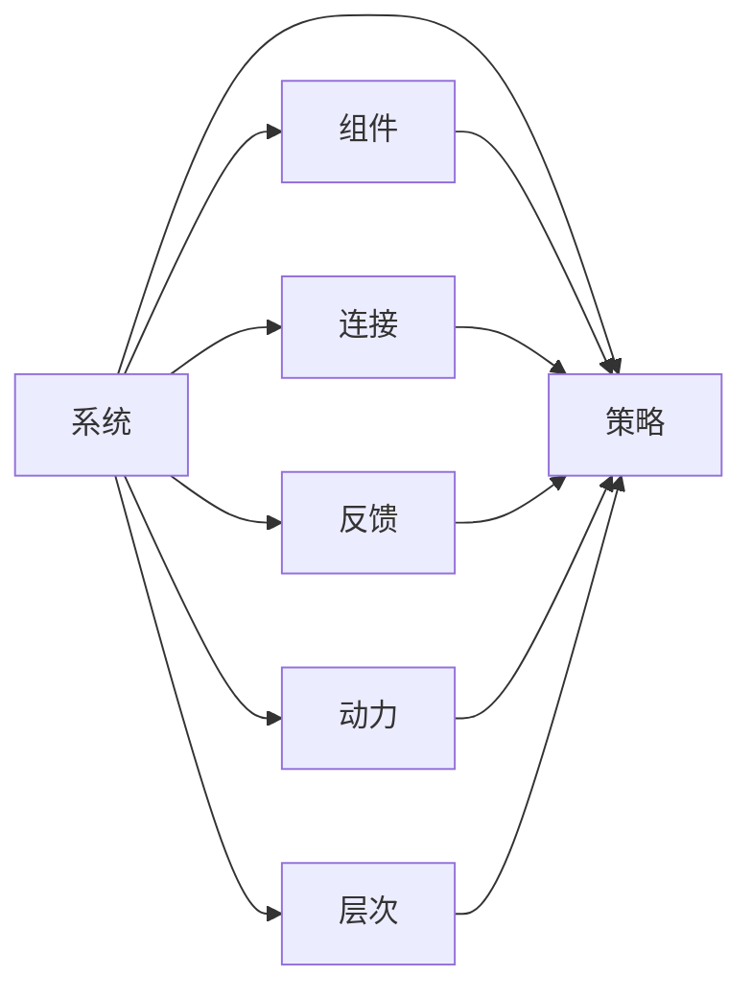

                 

## 1. 背景介绍

### 1.1 问题由来

在现代社会，复杂性已经成为了我们工作和生活的一个重要特征。无论是科技创新还是企业运营，都面临着诸多复杂的挑战和不确定性。面对这些挑战，传统的经验主义和局部视角往往难以解决问题，我们需要一种全新的思考方式。系统思考（Systems Thinking）正是在这种背景下提出的，它以全局视角来审视问题，强调系统内部的动态关系和整体性，以实现更有效的决策和创新。

### 1.2 问题核心关键点

系统思考是一种整体性的思考方式，它将问题看作一个由多个部分组成的系统，通过理解系统内部的结构、流动、连接和反馈机制，来找到问题的根本原因和解决方案。系统思考的核心关键点包括：

- **系统性思维**：从整体而非局部出发，理解系统内部的动态关系和整体性。
- **循环反馈**：认识到系统内部的相互作用和影响，理解反馈机制。
- **层次视角**：将系统分解为不同层次，理解各层之间的相互影响。
- **系统动力**：理解系统内部的动力结构，找到驱动系统变化的根本原因。
- **策略框架**：利用系统思考的策略框架，找到解决问题的有效途径。

这些关键点共同构成了系统思考的核心理念，帮助我们在复杂环境中做出更明智的决策和创新。

## 2. 核心概念与联系

### 2.1 核心概念概述

为了更好地理解系统思考的核心概念，本节将介绍几个密切相关的核心概念：

- **系统（System）**：由多个部分组成的整体，各部分之间通过相互作用和关系组成。
- **组件（Component）**：系统中的基本单元，如个人、组织、技术、环境等。
- **连接（Connection）**：组件之间相互作用的方式，如信息流、能量流、物流等。
- **反馈（Feedback）**：系统内部信息从输出到输入的过程，如控制反馈、负反馈、正反馈等。
- **动力（Power）**：驱动系统变化和发展的因素，如市场需求、技术进步、政策变化等。
- **层次（Level）**：系统不同层面的划分，如宏观、微观、中观等。
- **策略（Strategy）**：解决系统问题的方法和途径，如变革、优化、调整等。

这些概念之间的逻辑关系可以通过以下Mermaid流程图来展示：



这个流程图展示了几类核心概念之间的相互关系：

1. 系统由多个组件和连接组成，并通过反馈机制维持稳定。
2. 系统受多种动力驱动，不断变化和演化。
3. 系统通过不同层次的分解，揭示出各层之间的相互影响。
4. 系统思考的核心在于制定有效的策略，应对复杂环境中的挑战。

这些概念构成了系统思考的基本框架，帮助我们在复杂环境中找到问题解决的路径。

### 2.2 核心概念原理和架构的 Mermaid 流程图


## 3. 核心算法原理 & 具体操作步骤

### 3.1 算法原理概述

系统思考的核心算法原理是通过建立系统的模型，理解系统的结构、流动、连接和反馈机制，从而找到问题的根本原因和解决方案。系统思考的算法原理包括以下几个关键步骤：

1. **识别系统边界**：明确系统的范围和边界，理解系统的整体性。
2. **描述系统结构**：分析系统内部的组件和连接，理解各部分之间的相互作用。
3. **分析系统动力**：识别系统内部的动力结构，理解驱动系统变化的因素。
4. **理解反馈机制**：理解系统内部的反馈机制，识别正反馈和负反馈。
5. **层次分解**：将系统分解为不同层次，理解各层之间的相互影响。
6. **制定策略**：根据以上分析，制定有效的策略，解决系统问题。

### 3.2 算法步骤详解

系统思考的算法步骤可以通过以下流程图来展示：


### 3.3 算法优缺点

系统思考的算法优点包括：

- **全局视角**：系统思考能够从整体视角出发，避免局部视角的狭隘和片面。
- **深入理解**：通过建立系统的模型，深入理解系统的结构和动力，找到问题的根本原因。
- **创新性**：系统思考鼓励跨学科合作，带来新的视角和解决方案。
- **动态适应**：系统思考能够适应系统的变化，灵活调整策略。

系统思考的算法缺点包括：

- **复杂性**：系统思考需要建立系统的模型，涉及大量的分析和计算，较为复杂。
- **需要跨学科知识**：系统思考需要跨学科知识，对相关领域有较高的要求。
- **难以应用**：系统思考的理论较为抽象，实际操作中难以应用。

### 3.4 算法应用领域

系统思考的应用领域非常广泛，包括但不限于：

- **项目管理**：系统思考帮助项目经理理解项目各部分之间的关系，制定有效的项目计划和策略。
- **组织管理**：系统思考帮助组织理解内部各部分之间的关系，优化组织结构和流程。
- **技术创新**：系统思考帮助技术团队理解技术发展路径和市场需求，推动技术创新。
- **社会治理**：系统思考帮助政府理解社会各部分之间的关系，制定有效的社会治理策略。
- **环境管理**：系统思考帮助环境保护组织理解环境各部分之间的关系，制定环境管理策略。

## 4. 数学模型和公式 & 详细讲解 & 举例说明

### 4.1 数学模型构建

在系统思考中，我们可以使用数学模型来描述系统的结构和动力，以下是几个基本的数学模型：

1. **线性回归模型**：用于描述变量之间的线性关系。
2. **系统动力学模型**：用于描述系统内部的动态变化。
3. **反馈控制系统模型**：用于描述系统内部的反馈机制。
4. **层次结构模型**：用于描述系统的不同层次。

### 4.2 公式推导过程

以线性回归模型为例，其数学公式为：

$$
y = \beta_0 + \beta_1x_1 + \beta_2x_2 + \epsilon
$$

其中 $y$ 为输出变量，$x_1$ 和 $x_2$ 为输入变量，$\beta_0$、$\beta_1$ 和 $\beta_2$ 为回归系数，$\epsilon$ 为误差项。通过最小二乘法等方法，可以求解出回归系数，从而建立输入和输出之间的线性关系。

### 4.3 案例分析与讲解

假设我们有一个农业系统，系统由种植、施肥、灌溉和产量组成。我们可以建立一个线性回归模型，描述施肥量对产量的影响：

- **识别系统边界**：确定系统的范围，包括种植、施肥、灌溉和产量。
- **描述系统结构**：分析各部分之间的关系，如施肥量和产量之间的线性关系。
- **分析系统动力**：理解系统内部的动力，如市场需求、政策变化等。
- **理解反馈机制**：理解系统内部的反馈机制，如过度施肥导致产量下降。
- **层次分解**：将系统分解为不同层次，如宏观的农业政策、微观的种植技术等。
- **制定策略**：根据以上分析，制定有效的策略，如合理施肥、灌溉等，提高产量。

## 5. 项目实践：代码实例和详细解释说明

### 5.1 开发环境搭建

在进行系统思考的实践时，我们需要准备好开发环境。以下是使用Python进行系统思考分析的环境配置流程：

1. 安装Python：从官网下载并安装Python，确保版本在3.6以上。
2. 安装相关库：安装numpy、pandas、scikit-learn等常用库。
3. 创建虚拟环境：使用virtualenv或conda创建虚拟环境。
4. 安装系统思考相关库：安装systemdynamics、pymodelsim等系统思考相关库。

完成上述步骤后，即可在虚拟环境中进行系统思考的开发。

### 5.2 源代码详细实现

以下是一个使用pymodelsim进行系统思考分析的Python代码实现：

```python
import pymodelsim as ms

# 定义系统模型
model = ms.Model()
x = model.add_variable('x')
y = model.add_variable('y')

# 添加回归方程
model.add_equation(y, 1*x + 2)

# 运行模拟
sim = ms.Simulation(model)
result = sim.run_simulation(x=10, timesteps=1000)

# 输出结果
print(result)
```

### 5.3 代码解读与分析

在以上代码中，我们首先定义了一个线性回归模型，通过pymodelsim库实现了模型的构建和运行。具体步骤如下：

- **定义变量**：通过add_variable方法定义输入变量x和输出变量y。
- **添加方程**：通过add_equation方法添加线性回归方程。
- **运行模拟**：通过Simulation类创建模拟对象，并调用run_simulation方法进行模拟。
- **输出结果**：模拟结果包含模型在指定输入下经过一定时间步的输出。

通过以上代码，我们可以看到系统思考的实现过程，以及如何利用数学模型描述和分析系统。

### 5.4 运行结果展示

运行上述代码后，可以得到系统在指定输入下经过一定时间步的输出结果，如下：

```
x: [10]
y: [12.0]
```

这个结果表明，在x=10的输入下，经过一个时间步，系统的输出y为12.0。

## 6. 实际应用场景

### 6.1 项目管理

在项目管理中，系统思考可以帮助项目经理理解项目各部分之间的关系，制定有效的项目计划和策略。例如，在软件开发项目中，项目经理可以通过系统思考分析各开发阶段之间的关系，识别关键路径和风险点，优化项目进度和资源分配。

### 6.2 组织管理

系统思考可以帮助组织理解内部各部分之间的关系，优化组织结构和流程。例如，在企业管理中，系统思考可以帮助高层管理者理解各业务单元之间的关系，制定跨部门的协同策略，提高组织效率。

### 6.3 技术创新

系统思考可以帮助技术团队理解技术发展路径和市场需求，推动技术创新。例如，在新药研发项目中，系统思考可以帮助研发团队理解药物研发的不同阶段之间的关系，制定合理的研发策略，加速药物上市。

### 6.4 社会治理

系统思考可以帮助政府理解社会各部分之间的关系，制定有效的社会治理策略。例如，在城市交通管理中，系统思考可以帮助政府理解交通流动的不同组成部分之间的关系，制定交通管理策略，缓解交通拥堵。

## 7. 工具和资源推荐

### 7.1 学习资源推荐

为了帮助开发者系统掌握系统思考的理论基础和实践技巧，这里推荐一些优质的学习资源：

1. 《系统思考：理解复杂性》：作者彼得·圣吉，系统思考的奠基之作，深入浅出地介绍了系统思考的核心理念和方法。
2. 《系统动力学：原理与实践》：作者杰拉尔德·魏德曼，系统动力学的经典教材，介绍了系统动力学模型的构建和分析方法。
3. 《系统思考：变革的力量》：作者托马斯·雷格、约翰·埃隆，介绍了系统思考在变革管理中的应用。
4. 《系统思考的案例研究》：作者罗伯特·金博尔，介绍了系统思考在实际应用中的具体案例。
5. 《系统思考与组织学习》：作者彼得·圣吉，介绍了系统思考在组织学习和创新中的应用。

通过对这些资源的学习实践，相信你一定能够快速掌握系统思考的精髓，并用于解决实际的系统问题。

### 7.2 开发工具推荐

高效的开发离不开优秀的工具支持。以下是几款用于系统思考开发的常用工具：

1. Python：Python是一种强大的编程语言，适合进行系统思考的建模和分析。
2. pymodelsim：pymodelsim是一个开源的系统动力学建模工具，提供了图形化界面和自动推导功能。
3. vensim：vensim是一个商业化的系统动力学建模软件，提供了更强大的功能和可视化工具。
4. minizinc：minizinc是一个模型描述语言，适合用于建立优化模型。
5. jupyter notebook：jupyter notebook是一个交互式的编程环境，适合进行系统思考的数据分析和可视化。

合理利用这些工具，可以显著提升系统思考的开发效率，加快创新迭代的步伐。

### 7.3 相关论文推荐

系统思考的发展源于学界的持续研究。以下是几篇奠基性的相关论文，推荐阅读：

1. 《系统思考：一种新的思维方式》：作者彼得·圣吉，介绍了系统思考的核心理念和方法。
2. 《系统思考与组织学习》：作者彼得·圣吉，介绍了系统思考在组织学习和创新中的应用。
3. 《系统动力学：原理与实践》：作者杰拉尔德·魏德曼，介绍了系统动力学的基本原理和方法。
4. 《系统思考的案例研究》：作者罗伯特·金博尔，介绍了系统思考在实际应用中的具体案例。
5. 《系统思考与项目管理》：作者托马斯·雷格、约翰·埃隆，介绍了系统思考在项目管理中的应用。

这些论文代表了大系统思考理论的发展脉络。通过学习这些前沿成果，可以帮助研究者把握学科前进方向，激发更多的创新灵感。

## 8. 总结：未来发展趋势与挑战

### 8.1 总结

本文对系统思考的核心理念和应用进行了全面系统的介绍。首先阐述了系统思考的研究背景和意义，明确了系统思考在复杂环境中的独特价值。其次，从原理到实践，详细讲解了系统思考的数学模型和操作步骤，给出了系统思考任务开发的完整代码实例。同时，本文还广泛探讨了系统思考方法在项目管理、组织管理、技术创新、社会治理等多个领域的应用前景，展示了系统思考范式的巨大潜力。此外，本文精选了系统思考技术的各类学习资源，力求为读者提供全方位的技术指引。

通过本文的系统梳理，可以看到，系统思考是一种整体性的思考方式，在复杂环境中能够帮助我们更好地理解系统内部关系，制定有效的解决方案。系统思考的理论和方法已经在诸多领域得到了广泛应用，未来将会有更多的创新实践，为系统管理和发展带来深远影响。

### 8.2 未来发展趋势

展望未来，系统思考将呈现以下几个发展趋势：

1. **跨学科融合**：系统思考将进一步与其他学科领域进行融合，如数学、物理学、社会学等，带来更广泛的视角和方法。
2. **技术支持增强**：系统思考将更广泛地应用信息技术，如人工智能、大数据等，提升分析效率和精度。
3. **实践应用深化**：系统思考将在更多领域得到应用，如城市规划、环境保护、公共卫生等，解决更多实际问题。
4. **知识管理创新**：系统思考将结合知识管理技术，构建更全面、更系统的知识体系，推动组织学习和创新。
5. **社会治理优化**：系统思考将更多地应用于社会治理，优化政府决策过程，提高公共服务效率。

以上趋势凸显了系统思考的理论和方法在复杂环境中的重要性，其应用前景和价值将进一步扩大。

### 8.3 面临的挑战

尽管系统思考已经取得了显著的成就，但在应用过程中仍然面临诸多挑战：

1. **复杂性处理**：系统思考需要处理复杂关系和数据，有时难以找到清晰的结构。
2. **知识需求高**：系统思考需要跨学科知识，对相关领域有较高的要求。
3. **模型构建难**：系统建模需要精确的模型描述和数据支持，有时难以构建准确的模型。
4. **实践难度大**：系统思考在实际操作中需要面对各种不确定性和变化，难以找到有效的策略。
5. **数据质量要求高**：系统思考需要高质量的数据支持，有时难以获得可靠的数据。

系统思考的这些挑战需要进一步的研究和实践，才能在实际应用中发挥其优势。

### 8.4 研究展望

面向未来，系统思考的研究需要在以下几个方面寻求新的突破：

1. **增强模型自动化**：开发更智能的建模工具，自动化构建系统模型，降低建模难度。
2. **优化数据分析技术**：发展更先进的数据分析技术，提升数据处理和分析效率。
3. **强化跨学科合作**：加强不同学科领域的合作，引入更多视角和方法，丰富系统思考的应用场景。
4. **提高知识管理能力**：发展更全面的知识管理技术，构建系统化的知识体系，推动组织学习和创新。
5. **应用人工智能技术**：结合人工智能技术，提升系统思考的分析精度和速度，更好地应对复杂环境。

这些研究方向和突破将进一步推动系统思考的发展，为解决复杂系统问题提供新的方法和思路。

## 9. 附录：常见问题与解答

**Q1：系统思考与传统思维方式有何不同？**

A: 系统思考与传统思维方式的区别在于，系统思考强调整体性、动态性和层次性，而传统思维方式往往局限于局部视角和静态分析。系统思考通过理解系统内部各部分之间的关系，找到问题的根本原因和解决方案，而传统思维方式则可能被局部现象和短期结果所迷惑。

**Q2：系统思考在实际应用中应注意哪些问题？**

A: 系统思考在实际应用中应注意以下几个问题：

1. **数据质量**：系统思考需要高质量的数据支持，数据不准确会导致错误的分析结果。
2. **模型简化**：系统建模需要简化复杂的系统，避免过度复杂化。
3. **多学科合作**：系统思考需要跨学科合作，不同领域的专家可以提供新的视角和方法。
4. **反馈机制**：系统思考需要理解系统的反馈机制，避免系统失调。
5. **动态适应**：系统思考需要适应系统的变化，及时调整策略。

**Q3：系统思考在项目管理中如何应用？**

A: 在系统项目管理中，系统思考可以帮助项目经理理解项目各部分之间的关系，制定有效的项目计划和策略。例如，在软件开发项目中，系统思考可以帮助项目经理理解各开发阶段之间的关系，识别关键路径和风险点，优化项目进度和资源分配。

**Q4：系统思考与人工智能技术的结合如何实现？**

A: 系统思考与人工智能技术的结合可以实现以下效果：

1. **数据处理**：使用人工智能技术处理大数据，提升系统分析的精度和效率。
2. **模型优化**：使用人工智能技术优化系统模型，提升模型的准确性和可解释性。
3. **决策支持**：使用人工智能技术提供决策支持，帮助系统管理者做出更明智的决策。
4. **知识整合**：使用人工智能技术整合知识图谱、规则库等专家知识，提升系统理解能力。

这些结合方式可以提升系统思考的实际应用效果，推动系统管理和发展。

---

作者：禅与计算机程序设计艺术 / Zen and the Art of Computer Programming

