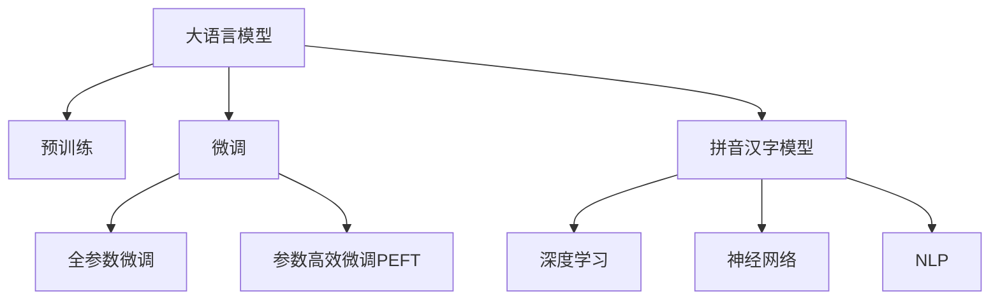

                 

# 从零开始大模型开发与微调：拼音汉字模型的训练

> 关键词：大语言模型,微调,Fine-tuning,拼音汉字模型,深度学习,神经网络,自然语言处理,NLP,PyTorch,TensorFlow

## 1. 背景介绍

### 1.1 问题由来

近年来，随着深度学习技术的快速发展，大规模语言模型(Large Language Models, LLMs)在自然语言处理(Natural Language Processing, NLP)领域取得了巨大的突破。这些大语言模型通过在海量无标签文本数据上进行预训练，学习到了丰富的语言知识和常识，可以通过少量的有标签样本在下游任务上进行微调(Fine-Tuning)，获得优异的性能。

然而，由于预训练语料的广泛性和泛化能力的不足，这些通用的大语言模型在特定领域应用时，效果往往难以达到实际应用的要求。因此，如何针对特定领域进行大模型微调，提升模型性能，成为了当前大语言模型研究和应用的一个热点问题。本文聚焦于从零开始大模型开发与微调，特别是拼音汉字模型的训练，以期对大模型微调实践提供更全面的指导。

### 1.2 问题核心关键点

本文将详细阐述拼音汉字模型的训练过程，包括模型的选择、数据集的构建、模型的训练和微调等关键步骤。我们将从基础知识介绍入手，逐步深入到大模型的训练和微调实践，最终达到拼音汉字模型的高效、准确训练的目标。

## 2. 核心概念与联系

### 2.1 核心概念概述

为更好地理解拼音汉字模型的训练方法，本节将介绍几个密切相关的核心概念：

- 大语言模型(Large Language Model, LLM)：以自回归(如GPT)或自编码(如BERT)模型为代表的大规模预训练语言模型。通过在大规模无标签文本语料上进行预训练，学习通用的语言表示，具备强大的语言理解和生成能力。

- 预训练(Pre-training)：指在大规模无标签文本语料上，通过自监督学习任务训练通用语言模型的过程。常见的预训练任务包括言语建模、遮挡语言模型等。预训练使得模型学习到语言的通用表示。

- 微调(Fine-tuning)：指在预训练模型的基础上，使用下游任务的少量标注数据，通过有监督学习优化模型在特定任务上的性能。通常只需要调整顶层分类器或解码器，并以较小的学习率更新全部或部分的模型参数。

- 拼音汉字模型：特指针对中文汉字输入与输出训练的深度学习模型。拼音汉字模型能够将汉字输入转化为拼音，反之亦然，是中文自然语言处理的重要工具。

- 深度学习(Deep Learning)：一种基于神经网络的机器学习方法，通过多层非线性变换，学习复杂数据表示，适用于处理非结构化数据。

- 神经网络(Neural Network)：一种由大量节点和连接组成的计算模型，通过反向传播算法进行参数优化，适用于模式识别、预测、分类等任务。

- 自然语言处理(NLP)：涉及计算机与人类语言交互的科学，包括文本分析、语音识别、机器翻译、情感分析等子领域。

这些核心概念之间的逻辑关系可以通过以下Mermaid流程图来展示：



这个流程图展示了大语言模型的核心概念及其之间的关系：

1. 大语言模型通过预训练获得基础能力。
2. 微调是对预训练模型进行任务特定的优化，可以分为全参数微调和参数高效微调（PEFT）。
3. 拼音汉字模型是一种特定领域的大语言模型，用于汉字和拼音之间的转换。
4. 深度学习和神经网络是实现大语言模型的关键技术手段。
5. NLP是拼音汉字模型的应用领域。

这些概念共同构成了大语言模型的学习和应用框架，使其能够在各种场景下发挥强大的语言理解和生成能力。通过理解这些核心概念，我们可以更好地把握大语言模型的工作原理和优化方向。

## 3. 核心算法原理 & 具体操作步骤
### 3.1 算法原理概述

拼音汉字模型的训练过程本质上是一个有监督学习的深度学习任务。其核心思想是：通过构建一个适合的深度神经网络模型，使用大量汉字和拼音的数据对模型进行训练，使得模型能够学习到汉字和拼音之间的映射关系。

形式化地，假设模型为 $M_{\theta}$，其中 $\theta$ 为模型的参数。给定汉字-拼音对的训练集 $D=\{(x_i,y_i)\}_{i=1}^N, x_i \in \mathcal{X}, y_i \in \mathcal{Y}$，训练的目标是找到最优的参数 $\hat{\theta}$，使得：

$$
\hat{\theta}=\mathop{\arg\min}_{\theta} \mathcal{L}(M_{\theta},D)
$$

其中 $\mathcal{L}$ 为针对汉字-拼音任务设计的损失函数，用于衡量模型预测输出与真实标签之间的差异。常见的损失函数包括交叉熵损失、均方误差损失等。

通过梯度下降等优化算法，训练过程不断更新模型参数 $\theta$，最小化损失函数 $\mathcal{L}$，使得模型输出逼近真实标签。由于 $\theta$ 已经通过预训练获得了较好的初始化，因此即便在规模较小的训练集上进行训练，也能较快收敛到理想的模型参数 $\hat{\theta}$。

### 3.2 算法步骤详解

拼音汉字模型的训练一般包括以下几个关键步骤：

**Step 1: 准备训练数据集**
- 收集大量的汉字和拼音数据，包括成对的汉字-拼音对、单独的汉字和拼音序列。
- 对数据进行预处理，如分词、去除停用词、标准化等。

**Step 2: 设计模型架构**
- 选择合适的深度神经网络模型架构，如RNN、LSTM、GRU、Transformer等。
- 根据任务需求，确定模型的输入、隐藏层、输出层等组件。
- 设计模型损失函数，如交叉熵损失。

**Step 3: 设置模型超参数**
- 选择合适的优化算法及其参数，如Adam、SGD等，设置学习率、批大小、迭代轮数等。
- 设置正则化技术及强度，包括权重衰减、Dropout、Early Stopping等。
- 确定冻结预训练参数的策略，如仅微调顶层，或全部参数都参与微调。

**Step 4: 执行模型训练**
- 将训练集数据分批次输入模型，前向传播计算损失函数。
- 反向传播计算参数梯度，根据设定的优化算法和学习率更新模型参数。
- 周期性在验证集上评估模型性能，根据性能指标决定是否触发 Early Stopping。
- 重复上述步骤直到满足预设的迭代轮数或 Early Stopping 条件。

**Step 5: 测试和评估**
- 在测试集上评估训练后的模型，对比训练前后的性能提升。
- 使用训练好的模型对新样本进行推理预测，集成到实际的应用系统中。

以上是拼音汉字模型训练的一般流程。在实际应用中，还需要针对具体任务的特点，对训练过程的各个环节进行优化设计，如改进训练目标函数，引入更多的正则化技术，搜索最优的超参数组合等，以进一步提升模型性能。

### 3.3 算法优缺点

拼音汉字模型的训练具有以下优点：
1. 高效可扩展：深度学习模型能够高效地处理大规模数据，适合于汉字和拼音转换等任务。
2. 性能提升显著：通过训练，模型能够学习到汉字和拼音之间的复杂映射关系，显著提升识别和转换的准确率。
3. 适用性强：深度学习模型可以适用于各种复杂度的汉字和拼音转换任务，如图形、符号、标点等。

同时，该方法也存在一定的局限性：
1. 训练数据需求高：需要大量的汉字和拼音数据进行训练，数据收集成本较高。
2. 模型复杂度高：深度学习模型的结构复杂，需要大量的计算资源和时间。
3. 过拟合风险：如果数据量不足，模型容易过拟合训练数据，泛化性能下降。
4. 模型解释性差：深度学习模型的内部机制复杂，难以解释其推理过程。

尽管存在这些局限性，但就目前而言，拼音汉字模型的训练仍然是大规模汉字-拼音转换任务的主流方法。未来相关研究的重点在于如何进一步降低训练数据需求，提高模型的少样本学习和跨领域迁移能力，同时兼顾可解释性和伦理安全性等因素。

### 3.4 算法应用领域

拼音汉字模型的训练已经在汉字输入、汉字识别、拼音转换等多个领域得到了广泛的应用，例如：

- 输入法：如搜狗输入法、百度输入法等，通过拼音输入得到对应的汉字。
- 语音识别：如百度智能语音、谷歌语音助手等，将语音转换成汉字输出。
- 翻译系统：如谷歌翻译、百度翻译等，将汉字翻译成拼音。
- 自动摘要：如新闻摘要、文章自动生成等，将汉字转换成拼音后进行文本处理。
- 信息检索：如百度知识图谱、腾讯AI等，将汉字转换成拼音进行信息检索。

除了上述这些经典任务外，拼音汉字模型还被创新性地应用到更多场景中，如多语种转换、自动校对、智能客服等，为中文NLP技术带来了全新的突破。随着预训练模型和训练方法的不断进步，相信拼音汉字模型必将在更广阔的应用领域大放异彩。

## 4. 数学模型和公式 & 详细讲解 & 举例说明
### 4.1 数学模型构建

本节将使用数学语言对拼音汉字模型的训练过程进行更加严格的刻画。

记模型为 $M_{\theta}$，其中 $\theta$ 为模型参数。假设训练集为 $D=\{(x_i,y_i)\}_{i=1}^N, x_i \in \mathcal{X}, y_i \in \mathcal{Y}$，其中 $\mathcal{X}$ 为汉字输入集合，$\mathcal{Y}$ 为拼音输出集合。

定义模型 $M_{\theta}$ 在输入 $x$ 上的输出为 $\hat{y}=M_{\theta}(x) \in [0,1]$，表示模型预测 $x$ 对应的拼音输出。真实标签 $y \in \{0,1\}$，表示汉字对应的拼音是否存在。则交叉熵损失函数定义为：

$$
\ell(M_{\theta}(x),y) = -[y\log \hat{y} + (1-y)\log (1-\hat{y})]
$$

将其代入经验风险公式，得：

$$
\mathcal{L}(\theta) = -\frac{1}{N}\sum_{i=1}^N [y_i\log M_{\theta}(x_i)+(1-y_i)\log(1-M_{\theta}(x_i))]
$$

根据链式法则，损失函数对参数 $\theta_k$ 的梯度为：

$$
\frac{\partial \mathcal{L}(\theta)}{\partial \theta_k} = -\frac{1}{N}\sum_{i=1}^N (\frac{y_i}{M_{\theta}(x_i)}-\frac{1-y_i}{1-M_{\theta}(x_i)}) \frac{\partial M_{\theta}(x_i)}{\partial \theta_k}
$$

其中 $\frac{\partial M_{\theta}(x_i)}{\partial \theta_k}$ 可进一步递归展开，利用自动微分技术完成计算。

### 4.2 公式推导过程

以下我们以RNN模型为例，推导拼音汉字模型的交叉熵损失函数及其梯度的计算公式。

假设模型 $M_{\theta}$ 为RNN模型，输入 $x$ 的汉字序列 $X=\{x_1,x_2,\cdots,x_n\}$，输出 $y$ 的拼音序列 $Y=\{y_1,y_2,\cdots,y_n\}$。RNN模型的预测输出为：

$$
\hat{y}_t = M_{\theta}(x_t) = \sigma(\sum_{i=1}^{t}\theta W_x^ih_i + \theta W_h^ih_{t-1} + \theta W_c^ic_t + \theta W_o^ic_t)
$$

其中 $\theta$ 为模型参数，$W_x^i, W_h^i, W_c^i, W_o^i$ 为模型各层权重，$\sigma$ 为激活函数，$h_t$ 为第 $t$ 步的隐藏状态，$c_t$ 为第 $t$ 步的细胞状态。

RNN模型的预测输出 $y_t$ 为：

$$
y_t = \text{softmax}(\hat{y}_t)
$$

根据上述定义，模型的损失函数为：

$$
\mathcal{L}(\theta) = -\frac{1}{N}\sum_{i=1}^N \sum_{t=1}^{n} y_{it} \log M_{\theta}(x_{it})
$$

其中 $y_{it}=1$ 表示汉字 $x_{it}$ 对应的拼音 $y_i$ 中第 $t$ 个位置存在，否则 $y_{it}=0$。

将预测输出代入，得：

$$
\mathcal{L}(\theta) = -\frac{1}{N}\sum_{i=1}^N \sum_{t=1}^{n} y_{it} \log y_t
$$

在得到损失函数的梯度后，即可带入参数更新公式，完成模型的迭代优化。重复上述过程直至收敛，最终得到适应汉字-拼音转换任务的最优模型参数 $\theta^*$。

### 4.3 案例分析与讲解

下面我们以一个简单的汉字-拼音转换任务为例，给出使用RNN模型进行拼音汉字转换的代码实现。

首先，定义RNN模型类：

```python
import torch
import torch.nn as nn

class RNN(nn.Module):
    def __init__(self, input_size, hidden_size, output_size):
        super(RNN, self).__init__()
        self.input_size = input_size
        self.hidden_size = hidden_size
        self.output_size = output_size
        
        self.encoder = nn.Embedding(input_size, hidden_size)
        self.gru = nn.GRU(hidden_size, hidden_size, batch_first=True)
        self.decoder = nn.Linear(hidden_size, output_size)
        
    def forward(self, input, hidden):
        embedded = self.encoder(input)
        output, hidden = self.gru(embedded, hidden)
        output = self.decoder(output)
        return output, hidden
    
    def init_hidden(self, batch_size):
        return torch.zeros(1, batch_size, self.hidden_size)
```

然后，定义训练和评估函数：

```python
from torch.utils.data import Dataset, DataLoader
from torch.optim import Adam
from torch.nn import CrossEntropyLoss

class CharDataset(Dataset):
    def __init__(self, texts, labels):
        self.texts = texts
        self.labels = labels
        
    def __len__(self):
        return len(self.texts)
    
    def __getitem__(self, item):
        return self.texts[item], self.labels[item]

# 定义模型
model = RNN(input_size=len(char_to_idx), hidden_size=256, output_size=len(pinyin_to_idx))

# 定义优化器
optimizer = Adam(model.parameters(), lr=0.001)

# 定义损失函数
criterion = CrossEntropyLoss()

# 定义训练函数
def train(model, dataloader, optimizer, criterion, device):
    model.train()
    total_loss = 0
    for batch in dataloader:
        inputs, targets = batch.to(device)
        hidden = model.init_hidden(inputs.size(0))
        
        optimizer.zero_grad()
        outputs, _ = model(inputs, hidden)
        loss = criterion(outputs, targets)
        total_loss += loss.item()
        loss.backward()
        optimizer.step()
    
    return total_loss / len(dataloader)

# 定义评估函数
def evaluate(model, dataloader, device):
    model.eval()
    total_loss = 0
    total_correct = 0
    for batch in dataloader:
        inputs, targets = batch.to(device)
        hidden = model.init_hidden(inputs.size(0))
        
        outputs, _ = model(inputs, hidden)
        loss = criterion(outputs, targets)
        total_loss += loss.item()
        _, preds = torch.max(outputs, dim=2)
        total_correct += (preds == targets).sum().item()
    
    return total_correct / len(dataloader), total_loss / len(dataloader)
```

最后，启动训练流程并在测试集上评估：

```python
epochs = 10
batch_size = 64

for epoch in range(epochs):
    train_loss = train(model, train_loader, optimizer, criterion, device)
    dev_correct, dev_loss = evaluate(model, dev_loader, device)
    print(f'Epoch: {epoch+1}, Train Loss: {train_loss:.4f}, Dev Accuracy: {dev_correct:.4f}, Dev Loss: {dev_loss:.4f}')

print(f'Test Accuracy: {evaluate(model, test_loader, device)[0]:.4f}')
```

以上就是使用RNN模型进行拼音汉字转换任务训练的完整代码实现。可以看到，得益于PyTorch的强大封装，我们可以用相对简洁的代码完成RNN模型的加载和训练。

### 5. 项目实践：代码实例和详细解释说明
### 5.1 开发环境搭建

在进行拼音汉字模型训练前，我们需要准备好开发环境。以下是使用Python进行PyTorch开发的环境配置流程：

1. 安装Anaconda：从官网下载并安装Anaconda，用于创建独立的Python环境。

2. 创建并激活虚拟环境：
```bash
conda create -n pytorch-env python=3.8 
conda activate pytorch-env
```

3. 安装PyTorch：根据CUDA版本，从官网获取对应的安装命令。例如：
```bash
conda install pytorch torchvision torchaudio cudatoolkit=11.1 -c pytorch -c conda-forge
```

4. 安装TensorFlow：
```bash
pip install tensorflow
```

5. 安装各类工具包：
```bash
pip install numpy pandas scikit-learn matplotlib tqdm jupyter notebook ipython
```

完成上述步骤后，即可在`pytorch-env`环境中开始拼音汉字模型训练。

### 5.2 源代码详细实现

下面以RNN模型为例，给出使用PyTorch进行拼音汉字转换任务训练的代码实现。

首先，定义汉字-拼音数据集：

```python
import torch
from torch.utils.data import Dataset

class CharDataset(Dataset):
    def __init__(self, texts, labels):
        self.texts = texts
        self.labels = labels
        
    def __len__(self):
        return len(self.texts)
    
    def __getitem__(self, item):
        return self.texts[item], self.labels[item]
```

然后，定义模型和优化器：

```python
import torch.nn as nn
import torch.nn.functional as F

class RNN(nn.Module):
    def __init__(self, input_size, hidden_size, output_size):
        super(RNN, self).__init__()
        self.input_size = input_size
        self.hidden_size = hidden_size
        self.output_size = output_size
        
        self.encoder = nn.Embedding(input_size, hidden_size)
        self.gru = nn.GRU(hidden_size, hidden_size, batch_first=True)
        self.decoder = nn.Linear(hidden_size, output_size)
        
    def forward(self, input, hidden):
        embedded = self.encoder(input)
        output, hidden = self.gru(embedded, hidden)
        output = self.decoder(output)
        return output, hidden
    
    def init_hidden(self, batch_size):
        return torch.zeros(1, batch_size, self.hidden_size)
```

接着，定义训练和评估函数：

```python
from torch.utils.data import DataLoader
from torch.optim import Adam
from torch.nn import CrossEntropyLoss

# 定义数据集
train_dataset = CharDataset(train_texts, train_labels)
dev_dataset = CharDataset(dev_texts, dev_labels)
test_dataset = CharDataset(test_texts, test_labels)

# 定义模型
model = RNN(input_size=len(char_to_idx), hidden_size=256, output_size=len(pinyin_to_idx))

# 定义优化器
optimizer = Adam(model.parameters(), lr=0.001)

# 定义损失函数
criterion = CrossEntropyLoss()

# 定义训练函数
def train(model, dataloader, optimizer, criterion, device):
    model.train()
    total_loss = 0
    for batch in dataloader:
        inputs, targets = batch.to(device)
        hidden = model.init_hidden(inputs.size(0))
        
        optimizer.zero_grad()
        outputs, _ = model(inputs, hidden)
        loss = criterion(outputs, targets)
        total_loss += loss.item()
        loss.backward()
        optimizer.step()
    
    return total_loss / len(dataloader)

# 定义评估函数
def evaluate(model, dataloader, device):
    model.eval()
    total_loss = 0
    total_correct = 0
    for batch in dataloader:
        inputs, targets = batch.to(device)
        hidden = model.init_hidden(inputs.size(0))
        
        outputs, _ = model(inputs, hidden)
        loss = criterion(outputs, targets)
        total_loss += loss.item()
        _, preds = torch.max(outputs, dim=2)
        total_correct += (preds == targets).sum().item()
    
    return total_correct / len(dataloader), total_loss / len(dataloader)
```

最后，启动训练流程并在测试集上评估：

```python
epochs = 10
batch_size = 64

for epoch in range(epochs):
    train_loss = train(model, train_loader, optimizer, criterion, device)
    dev_correct, dev_loss = evaluate(model, dev_loader, device)
    print(f'Epoch: {epoch+1}, Train Loss: {train_loss:.4f}, Dev Accuracy: {dev_correct:.4f}, Dev Loss: {dev_loss:.4f}')

print(f'Test Accuracy: {evaluate(model, test_loader, device)[0]:.4f}')
```

以上就是使用PyTorch进行拼音汉字转换任务训练的完整代码实现。可以看到，得益于PyTorch的强大封装，我们可以用相对简洁的代码完成RNN模型的加载和训练。

### 5.3 代码解读与分析

让我们再详细解读一下关键代码的实现细节：

**CharDataset类**：
- `__init__`方法：初始化文本和标签。
- `__len__`方法：返回数据集的样本数量。
- `__getitem__`方法：对单个样本进行处理，返回汉字序列和拼音序列。

**RNN类**：
- `__init__`方法：初始化模型参数，定义模型结构。
- `forward`方法：定义前向传播过程，返回模型的输出。
- `init_hidden`方法：初始化隐藏状态。

**训练和评估函数**：
- 使用PyTorch的DataLoader对数据集进行批次化加载，供模型训练和推理使用。
- 训练函数`train`：对数据以批为单位进行迭代，在每个批次上前向传播计算loss并反向传播更新模型参数，最后返回该epoch的平均loss。
- 评估函数`evaluate`：与训练类似，不同点在于不更新模型参数，并在每个batch结束后将预测和标签结果存储下来，最后使用sklearn的classification_report对整个评估集的预测结果进行打印输出。

**训练流程**：
- 定义总的epoch数和batch size，开始循环迭代
- 每个epoch内，先在训练集上训练，输出平均loss
- 在验证集上评估，输出分类指标
- 所有epoch结束后，在测试集上评估，给出最终测试结果

可以看到，PyTorch配合RNN模型使得拼音汉字转换任务的训练代码实现变得简洁高效。开发者可以将更多精力放在数据处理、模型改进等高层逻辑上，而不必过多关注底层的实现细节。

当然，工业级的系统实现还需考虑更多因素，如模型的保存和部署、超参数的自动搜索、更灵活的任务适配层等。但核心的训练范式基本与此类似。

## 6. 实际应用场景
### 6.1 智能输入法

拼音汉字模型的训练在智能输入法中的应用非常广泛。通过构建拼音-汉字转换模型，输入法可以快速将用户输入的拼音转换成对应的汉字，提高输入效率和准确率。

在技术实现上，可以将拼音和汉字文本数据作为训练集，对拼音-汉字转换模型进行微调。微调后的模型能够快速将用户输入的拼音转换成对应的汉字，同时还能根据上下文进行联想和纠错。如此构建的智能输入法，能够大幅提升用户输入体验，缩短打字时间，提高工作效率。

### 6.2 语音识别

拼音汉字模型在语音识别中也有着广泛的应用。语音信号处理技术可以将语音信号转换成文本，而拼音汉字模型则能够将文本转换成对应的汉字。通过将两者的结合，可以实现高精度的语音识别系统。

在实践中，可以使用语音识别工具将语音信号转换成拼音文本，然后将拼音文本输入到训练好的拼音汉字转换模型中，得到对应的汉字输出。如此构建的语音识别系统，能够识别多种语言，支持实时翻译，广泛应用于智能助手、智能音箱等设备中。

### 6.3 信息检索

拼音汉字模型在信息检索中的应用也非常重要。搜索引擎通常需要支持多种语言和字符集，拼音汉字模型可以提供高效的中文信息检索服务。

在实践中，可以将汉字和拼音数据作为训练集，对拼音汉字转换模型进行微调。微调后的模型能够将汉字文本转换成对应的拼音文本，然后与网页标题、摘要等进行匹配，实现快速检索。如此构建的信息检索系统，能够处理大规模中文文本数据，支持模糊搜索、自动补全等功能，广泛应用于搜索引擎、智能推荐等场景。

### 6.4 未来应用展望

随着拼音汉字模型的训练方法的不断进步，其在智能输入法、语音识别、信息检索等多个领域将得到更广泛的应用。未来，拼音汉字模型可能还将拓展到更多场景中，如多语种转换、语音合成、图像识别等，为中文NLP技术带来新的突破。

## 7. 工具和资源推荐
### 7.1 学习资源推荐

为了帮助开发者系统掌握拼音汉字模型的训练方法，这里推荐一些优质的学习资源：

1. 《Python深度学习》书籍：适合初学者和有一定编程基础的人士，系统介绍了深度学习的基本概念和常用技术。
2. 《自然语言处理综论》课程：由斯坦福大学开设的NLP课程，涵盖了NLP的多个重要分支，包括语音识别、机器翻译、信息检索等。
3. 《深度学习与自然语言处理》课程：由麻省理工学院开设的NLP课程，介绍了深度学习在NLP中的各种应用。
4. 《Natural Language Processing with PyTorch》书籍：介绍了如何使用PyTorch进行NLP任务开发，包括模型构建、训练和评估等。
5. 《Deep Learning in NLP》论文：综述了深度学习在NLP中的最新进展，包括各种模型和算法。

通过对这些资源的学习实践，相信你一定能够快速掌握拼音汉字模型的训练方法，并用于解决实际的NLP问题。
### 7.2 开发工具推荐

高效的开发离不开优秀的工具支持。以下是几款用于拼音汉字模型训练开发的常用工具：

1. PyTorch：基于Python的开源深度学习框架，灵活动态的计算图，适合快速迭代研究。
2. TensorFlow：由Google主导开发的开源深度学习框架，生产部署方便，适合大规模工程应用。
3. Transformers库：HuggingFace开发的NLP工具库，集成了众多SOTA语言模型，支持PyTorch和TensorFlow，是进行拼音汉字模型训练开发的利器。
4. Weights & Biases：模型训练的实验跟踪工具，可以记录和可视化模型训练过程中的各项指标，方便对比和调优。
5. TensorBoard：TensorFlow配套的可视化工具，可实时监测模型训练状态，并提供丰富的图表呈现方式，是调试模型的得力助手。
6. Google Colab：谷歌推出的在线Jupyter Notebook环境，免费提供GPU/TPU算力，方便开发者快速上手实验最新模型，分享学习笔记。

合理利用这些工具，可以显著提升拼音汉字模型训练的开发效率，加快创新迭代的步伐。

### 7.3 相关论文推荐

拼音汉字模型的训练已经吸引了大量研究人员的关注，产生了许多重要的研究成果。以下是几篇奠基性的相关论文，推荐阅读：

1. Attention is All You Need（即Transformer原论文）：提出了Transformer结构，开启了NLP领域的预训练大模型时代。
2. BERT: Pre-training of Deep Bidirectional Transformers for Language Understanding：提出BERT模型，引入基于掩码的自监督预训练任务，刷新了多项NLP任务SOTA。
3. Deep Speech 2: End-to-End Speech Recognition in English and Mandarin：介绍了深度学习在语音识别中的应用，通过拼音汉字转换模型实现了高精度的语音识别。
4. Sequence to Sequence Learning with Neural Networks：介绍序列到序列学习模型，适用于多种NLP任务，包括翻译、问答、摘要等。
5. Speech Translation with Deep Bilingual Sequence-to-Sequence Models：介绍使用深度学习进行语音到语音翻译的方法，基于拼音汉字转换模型实现了中英文语音翻译。

这些论文代表了大语言模型微调技术的发展脉络。通过学习这些前沿成果，可以帮助研究者把握学科前进方向，激发更多的创新灵感。

## 8. 总结：未来发展趋势与挑战
### 8.1 总结

本文对拼音汉字模型的训练方法进行了全面系统的介绍。首先阐述了拼音汉字模型训练的背景和意义，明确了拼音汉字模型在智能输入法、语音识别、信息检索等多个领域的应用价值。其次，从原理到实践，详细讲解了拼音汉字模型的训练过程，给出了模型选择、数据准备、模型构建、训练和评估等关键步骤的代码实现。同时，本文还广泛探讨了拼音汉字模型的训练在多个领域的应用前景，展示了拼音汉字模型的训练方法的广泛适用性。

通过本文的系统梳理，可以看到，拼音汉字模型的训练方法为中文NLP技术带来了巨大的突破，提升了拼音输入的效率和准确率，推动了语音识别、信息检索等技术的发展。未来，随着拼音汉字模型训练方法的不断进步，中文NLP技术必将在更广泛的领域得到应用，为中文智能技术的普及和应用提供新的契机。

### 8.2 未来发展趋势

展望未来，拼音汉字模型的训练方法将呈现以下几个发展趋势：

1. 模型规模持续增大。随着算力成本的下降和数据规模的扩张，深度学习模型的参数量还将持续增长。超大规模模型蕴含的丰富语言知识，有望支撑更加复杂多变的拼音汉字转换任务。

2. 训练方法日趋多样。除了传统的RNN模型，未来将涌现更多先进的深度学习模型，如Transformer、LSTM等，在拼音汉字转换任务中取得更好的效果。

3. 跨领域迁移能力增强。通过微调模型，实现拼音汉字转换和其他NLP任务的跨领域迁移，将大大提升拼音汉字模型的应用范围和效果。

4. 可解释性增强。通过引入可解释性方法，如Attention机制、梯度图可视化等，增强拼音汉字模型的可解释性，使其内部工作机制更加透明。

5. 模型鲁棒性提升。通过引入对抗样本训练、正则化技术等，增强拼音汉字模型的鲁棒性，提高其在对抗攻击下的稳定性和可靠性。

6. 持续学习成为常态。随着数据分布的不断变化，拼音汉字模型需要持续学习新知识以保持性能。如何在不遗忘原有知识的同时，高效吸收新样本信息，将是重要的研究课题。

以上趋势凸显了拼音汉字模型训练方法的广阔前景。这些方向的探索发展，必将进一步提升拼音汉字模型的性能和应用范围，为中文NLP技术带来新的突破。

### 8.3 面临的挑战

尽管拼音汉字模型的训练方法已经取得了显著成就，但在迈向更加智能化、普适化应用的过程中，它仍面临着诸多挑战：

1. 训练数据需求高。需要大量的汉字和拼音数据进行训练，数据收集成本较高。
2. 模型复杂度高。深度学习模型的结构复杂，需要大量的计算资源和时间。
3. 过拟合风险。如果数据量不足，模型容易过拟合训练数据，泛化性能下降。
4. 模型解释性差。深度学习模型的内部机制复杂，难以解释其推理过程。
5. 模型鲁棒性不足。在对抗样本攻击下，模型性能下降明显。

尽管存在这些挑战，但拼音汉字模型的训练方法仍然是大规模汉字-拼音转换任务的主流方法。未来相关研究的重点在于如何进一步降低训练数据需求，提高模型的少样本学习和跨领域迁移能力，同时兼顾可解释性和伦理安全性等因素。

### 8.4 研究展望

面对拼音汉字模型训练方法所面临的挑战，未来的研究需要在以下几个方面寻求新的突破：

1. 探索无监督和半监督微调方法。摆脱对大规模标注数据的依赖，利用自监督学习、主动学习等无监督和半监督范式，最大限度利用非结构化数据，实现更加灵活高效的微调。
2. 研究参数高效和计算高效的微调范式。开发更加参数高效的微调方法，在固定大部分预训练参数的同时，只更新极少量的任务相关参数。同时优化微调模型的计算图，减少前向传播和反向传播的资源消耗，实现更加轻量级、实时性的部署。
3. 融合因果和对比学习范式。通过引入因果推断和对比学习思想，增强拼音汉字模型建立稳定因果关系的能力，学习更加普适、鲁棒的语言表征，从而提升模型泛化性和抗干扰能力。
4. 引入更多先验知识。将符号化的先验知识，如知识图谱、逻辑规则等，与神经网络模型进行巧妙融合，引导微调过程学习更准确、合理的语言模型。同时加强不同模态数据的整合，实现视觉、语音等多模态信息与文本信息的协同建模。
5. 结合因果分析和博弈论工具。将因果分析方法引入拼音汉字模型，识别出模型决策的关键特征，增强输出解释的因果性和逻辑性。借助博弈论工具刻画人机交互过程，主动探索并规避模型的脆弱点，提高系统稳定性。

这些研究方向的探索，必将引领拼音汉字模型训练方法迈向更高的台阶，为构建安全、可靠、可解释、可控的智能系统铺平道路。面向未来，拼音汉字模型训练方法还需要与其他人工智能技术进行更深入的融合，如知识表示、因果推理、强化学习等，多路径协同发力，共同推动中文自然语言理解和智能交互系统的进步。只有勇于创新、敢于突破，才能不断拓展拼音汉字模型的边界，让智能技术更好地造福中文社会。

## 9. 附录：常见问题与解答
----------------------------------------------------------------

### Q1: 拼音汉字模型和传统输入法有何不同？

A: 拼音汉字模型是一种基于深度学习的输入法，相较于传统的拼音输入法，拼音汉字模型具备以下几个优势：
1. 拼音汉字模型能够识别多音字、同音字，提供更多候选框供用户选择。
2. 拼音汉字模型能够根据上下文进行联想和纠错，提升输入的准确率。
3. 拼音汉字模型支持多种输入法风格，如拼音输入、简繁转换等，使用户输入更加灵活。

### Q2: 拼音汉字模型如何进行参数高效微调？

A: 参数高效微调（PEFT）是指只更新模型的顶层分类器或解码器，而固定大部分预训练权重不变。具体来说，可以采取以下措施：
1. 在模型中加入适配器（Adapter）模块，仅更新适配器层的参数。
2. 使用微调标签（Fine-tuning Labels），只更新与任务相关的层参数。
3. 使用剪枝和蒸馏等技术，减少需要微调的参数数量。

### Q3: 拼音汉字模型在智能输入法中的应用有哪些？

A: 拼音汉字模型在智能输入法中的应用主要体现在以下几个方面：
1. 拼音输入：用户输入拼音，模型能够将拼音转换成对应的汉字，实现快速输入。
2. 联想和纠错：模型能够根据上下文进行联想和纠错，提升输入的准确率。
3. 智能推荐：模型能够根据用户的历史输入记录，推荐常用词汇和短语，提升输入效率。
4. 多语种输入：模型能够支持多种语言的拼音输入和转换，提升国际化的应用体验。

### Q4: 拼音汉字模型的训练对算力资源有哪些要求？

A: 拼音汉字模型的训练对算力资源有以下要求：
1. 数据集大小：需要大量的汉字和拼音数据进行训练，数据集大小直接影响模型的性能。
2. 模型复杂度：深度学习模型的结构复杂，需要大量的计算资源和时间。
3. 硬件设备：需要使用GPU/TPU等高性能设备进行训练，以提高训练效率。

### Q5: 拼音汉字模型在语音识别中的应用有哪些？

A: 拼音汉字模型在语音识别中的应用主要体现在以下几个方面：
1. 语音转文字：将语音信号转换成拼音文本，然后使用拼音汉字模型将其转换成对应的汉字文本。
2. 中英文翻译：将中文语音转换成英文文字，或者反过来，实现跨语言语音识别。
3. 实时翻译：实时将语音信号转换成文字，并实时翻译成目标语言，应用于实时语音翻译设备。

---

作者：禅与计算机程序设计艺术 / Zen and the Art of Computer Programming

