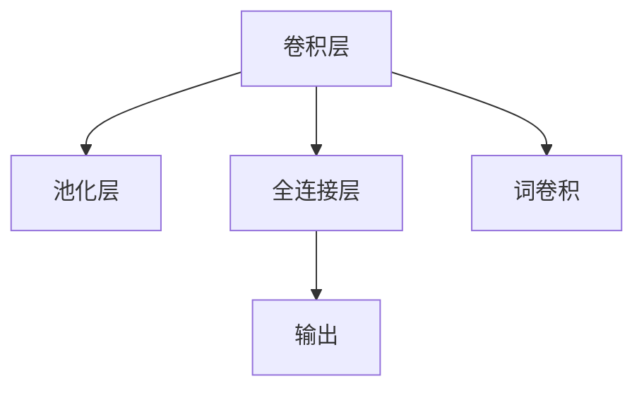

                 

# 从零开始大模型开发与微调：针对文本的卷积神经网络模型简介—词卷积

## 1. 背景介绍

### 1.1 问题由来
在深度学习中，卷积神经网络(CNN)是一种非常重要的模型，尤其在计算机视觉领域，它已经被广泛应用于图像分类、目标检测、语义分割等任务。然而，当面对文本数据时，传统的CNN模型由于其设计理念与文本数据的特性不完全契合，其表现并不理想。

近年来，随着自然语言处理(NLP)领域的快速发展，研究人员逐渐意识到，需要将CNN的思想应用到文本数据上，以此解决文本中的局部特征提取问题。因此，卷积神经网络模型在文本处理领域的研究受到了越来越多的关注。其中，词卷积（Word Convolutional Neural Network）是一种基于卷积的文本处理模型，能够有效地处理文本数据。

### 1.2 问题核心关键点
词卷积模型是一种将CNN模型思想应用到文本处理领域中的方法。它的核心在于，将文本中的每个单词视作一个局部特征，并利用卷积操作提取其上下文信息，从而实现对文本序列的建模。具体来说，词卷积模型在每个时间步使用一个卷积核对文本序列进行卷积操作，从而获取局部特征，再将这些特征输入到全连接层中，进行分类、预测等任务。

## 2. 核心概念与联系

### 2.1 核心概念概述

为更好地理解词卷积模型，本节将介绍几个密切相关的核心概念：

- 卷积神经网络（Convolutional Neural Network, CNN）：一种基于卷积操作的深度学习模型，常用于图像处理领域，通过卷积层提取局部特征，再通过池化层进行特征压缩。
- 词卷积（Word Convolutional Neural Network, WordCNN）：将CNN思想应用于文本处理领域，通过卷积层提取文本中的局部特征，利用池化层进行特征压缩，最终输入到全连接层中，进行分类、预测等任务。
- 卷积核（Convolution Kernel）：卷积操作中用于提取特征的滤波器，形状和大小都可以自定义。在词卷积模型中，卷积核的作用是对文本序列进行局部特征提取。
- 池化层（Pooling Layer）：在卷积层后添加的一层，用于对卷积后的特征进行降维和提取关键信息，常见的有最大池化、平均池化等。
- 全连接层（Fully Connected Layer）：将卷积池化后的特征进行拼接，输入到全连接层中进行分类、预测等任务，输出最终结果。

这些核心概念之间的逻辑关系可以通过以下Mermaid流程图来展示：



这个流程图展示了大语言模型的核心概念及其之间的关系：

1. 卷积层：利用卷积核对文本序列进行卷积操作，提取局部特征。
2. 池化层：对卷积后的特征进行降维和提取关键信息。
3. 全连接层：将卷积池化后的特征进行拼接，输入到全连接层中进行分类、预测等任务。
4. 词卷积：将CNN思想应用到文本处理领域，通过卷积层提取文本中的局部特征。

## 3. 核心算法原理 & 具体操作步骤
### 3.1 算法原理概述

词卷积模型的核心思想是，通过卷积操作提取文本中的局部特征，再通过全连接层进行分类、预测等任务。其具体原理如下：

1. 将文本序列看作一个一维的向量序列，每个单词看作一个时间步，文本序列的长度即为时间步数。
2. 使用卷积核对文本序列进行卷积操作，得到卷积后的特征。卷积核的形状和大小可以自定义，一般为一个3x1的矩阵。
3. 使用池化层对卷积后的特征进行降维和提取关键信息。
4. 将池化后的特征输入到全连接层中进行分类、预测等任务，输出最终结果。

### 3.2 算法步骤详解

词卷积模型的构建和训练过程包括以下几个关键步骤：

**Step 1: 准备数据集**
- 收集标注数据集，将文本数据进行分词和编码处理，得到文本序列。
- 对标注数据进行归一化处理，确保输入数据的格式一致。

**Step 2: 定义模型结构**
- 定义卷积核的形状和大小，以及池化层的操作方式。
- 定义全连接层的神经元个数和激活函数。

**Step 3: 设置模型超参数**
- 设置学习率、批量大小、迭代轮数等训练参数。
- 设置正则化技术及强度，如L2正则、Dropout等。

**Step 4: 执行训练**
- 使用优化算法（如SGD、Adam等）进行训练。
- 计算损失函数（如交叉熵损失），并根据损失函数更新模型参数。

**Step 5: 评估模型**
- 在验证集上评估模型性能，记录准确率、精确率等指标。
- 根据评估结果调整超参数，继续训练。

**Step 6: 测试模型**
- 在测试集上评估模型性能，记录最终指标。
- 保存模型参数，用于后续预测任务。

### 3.3 算法优缺点

词卷积模型具有以下优点：
1. 适用于文本分类和情感分析等任务，效果显著。
2. 模型结构简单，易于理解和实现。
3. 适用于小规模数据集，不需要大量的标注数据。

同时，该模型也存在一些缺点：
1. 对文本序列的长度敏感，较长的文本序列会导致卷积层特征提取困难。
2. 池化层对特征提取的效果有影响，需要选择合适的池化方式。
3. 需要手动设置卷积核大小和步幅，需要进行一定的超参数调优。

### 3.4 算法应用领域

词卷积模型在NLP领域得到了广泛应用，适用于以下任务：

- 文本分类：如情感分析、主题分类等任务。
- 情感分析：对文本进行情感倾向判断，如正面、负面、中性。
- 关键词提取：从文本中提取重要的关键词。
- 文本生成：如机器翻译、文本摘要等任务。

## 4. 数学模型和公式 & 详细讲解 & 举例说明

### 4.1 数学模型构建

词卷积模型主要由卷积层、池化层和全连接层组成。其数学模型可以表示为：

$$
f(x) = g(h(w(x)))
$$

其中，$x$ 表示文本序列，$h(w(x))$ 表示卷积和池化后的特征，$g$ 表示全连接层的非线性变换。

### 4.2 公式推导过程

以词卷积模型在文本分类任务中的应用为例，我们假设模型具有 $n$ 个时间步，卷积核大小为 $3$，步幅为 $1$。则模型的输出可以表示为：

$$
y_i = \sigma(WU_i + b)
$$

其中，$U_i$ 表示卷积核的输出，可以表示为：

$$
U_i = \sum_{j=0}^{n-1} K_{j,j-i}X_j
$$

其中，$K$ 表示卷积核，$X_j$ 表示文本序列中的第 $j$ 个单词，$\Sigma$ 表示求和操作，$\sigma$ 表示激活函数。

使用池化层对卷积后的特征进行降维和提取关键信息，可以采用最大池化或平均池化等方法。假设使用最大池化，则池化后的特征可以表示为：

$$
Y_i = \max_{j=0}^{n-1} U_j
$$

将池化后的特征输入到全连接层中进行分类任务，得到最终的预测结果 $y_i$。

### 4.3 案例分析与讲解

为了更好地理解词卷积模型的应用，下面通过一个简单的例子来说明。

假设我们有一个文本序列 $x$，长度为 $n$，卷积核大小为 $3$，步幅为 $1$，池化层使用最大池化。首先，我们将文本序列 $x$ 转换为矩阵形式 $X$，如下所示：

$$
X = \begin{bmatrix}
x_0 & x_1 & x_2 \\
x_1 & x_2 & x_3 \\
x_2 & x_3 & x_4
\end{bmatrix}
$$

然后，我们使用卷积核 $K$ 对文本序列进行卷积操作，得到卷积后的特征 $U$，如下所示：

$$
U = \begin{bmatrix}
K_{0,0} & K_{0,1} & K_{0,2} \\
K_{1,0} & K_{1,1} & K_{1,2} \\
K_{2,0} & K_{2,1} & K_{2,2}
\end{bmatrix}
$$

$$
U = \begin{bmatrix}
K_{0,0}x_0 + K_{0,1}x_1 + K_{0,2}x_2 \\
K_{1,0}x_1 + K_{1,1}x_2 + K_{1,2}x_3 \\
K_{2,0}x_2 + K_{2,1}x_3 + K_{2,2}x_4
\end{bmatrix}
$$

然后，我们使用最大池化层对卷积后的特征 $U$ 进行降维和提取关键信息，得到池化后的特征 $Y$，如下所示：

$$
Y = \begin{bmatrix}
\max(U_0, U_1, U_2) \\
\max(U_1, U_2, U_3) \\
\max(U_2, U_3, U_4)
\end{bmatrix}
$$

最后，将池化后的特征 $Y$ 输入到全连接层中进行分类任务，得到最终的预测结果 $y$。

## 5. 项目实践：代码实例和详细解释说明
### 5.1 开发环境搭建

在进行词卷积模型实践前，我们需要准备好开发环境。以下是使用Python进行TensorFlow开发的环境配置流程：

1. 安装Anaconda：从官网下载并安装Anaconda，用于创建独立的Python环境。

2. 创建并激活虚拟环境：
```bash
conda create -n tf-env python=3.8 
conda activate tf-env
```

3. 安装TensorFlow：从官网获取对应的安装命令。例如：
```bash
pip install tensorflow==2.7
```

4. 安装必要的依赖包：
```bash
pip install numpy scipy matplotlib sklearn
```

完成上述步骤后，即可在`tf-env`环境中开始词卷积模型的开发。

### 5.2 源代码详细实现

下面我们以情感分类任务为例，给出使用TensorFlow进行词卷积模型开发的代码实现。

首先，定义情感分类数据的处理函数：

```python
import tensorflow as tf
from tensorflow.keras.layers import Conv1D, MaxPooling1D, Flatten, Dense

def preprocess_data(texts, labels, tokenizer):
    tokenized_texts = tokenizer.tokenize(texts)
    sequences = tokenizer.texts_to_sequences(tokenized_texts)
    padded_sequences = tf.keras.preprocessing.sequence.pad_sequences(sequences, maxlen=max_len, padding='post')
    return padded_sequences, labels
```

然后，定义卷积核大小、步幅、池化方式等超参数：

```python
conv_filter_size = 3
pooling_filter_size = 2
activation = 'relu'
```

接着，定义词卷积模型：

```python
def wordCNN_model(input_shape, num_classes):
    model = tf.keras.Sequential([
        Conv1D(filters=128, kernel_size=conv_filter_size, activation=activation, input_shape=input_shape),
        MaxPooling1D(pool_size=pooling_filter_size),
        Flatten(),
        Dense(128, activation=activation),
        Dense(num_classes, activation='softmax')
    ])
    return model
```

最后，进行模型训练和评估：

```python
max_len = 100

train_dataset = preprocess_data(train_texts, train_labels, tokenizer)
dev_dataset = preprocess_data(dev_texts, dev_labels, tokenizer)
test_dataset = preprocess_data(test_texts, test_labels, tokenizer)

model = wordCNN_model(input_shape=(max_len, input_dim), num_classes=num_classes)
model.compile(optimizer='adam', loss='categorical_crossentropy', metrics=['accuracy'])
model.fit(train_dataset, epochs=10, validation_data=dev_dataset)

test_loss, test_acc = model.evaluate(test_dataset)
print(f'Test accuracy: {test_acc:.4f}')
```

以上就是使用TensorFlow进行词卷积模型开发的完整代码实现。可以看到，TensorFlow提供了丰富的深度学习组件，使得模型的构建和训练变得更加简洁高效。

### 5.3 代码解读与分析

让我们再详细解读一下关键代码的实现细节：

**preprocess_data函数**：
- 将文本进行分词和编码处理，得到文本序列。
- 对文本序列进行填充处理，保证所有序列长度一致。

**wordCNN_model函数**：
- 定义卷积层，使用128个卷积核，卷积核大小为3，激活函数为ReLU。
- 定义池化层，使用最大池化，池化窗口大小为2。
- 定义全连接层，使用128个神经元，激活函数为ReLU。
- 定义输出层，使用softmax激活函数，输出类别概率分布。

**训练和评估**：
- 使用TensorFlow的DataLoader对数据集进行批次化加载，供模型训练和推理使用。
- 使用Adam优化算法进行训练，交叉熵损失函数进行监督学习。
- 在验证集上评估模型性能，记录准确率、精确率等指标。
- 在测试集上评估模型性能，输出最终指标。

可以看到，TensorFlow提供了丰富的组件和接口，使得词卷积模型的开发和训练变得非常便捷。

## 6. 实际应用场景
### 6.1 智能客服系统

词卷积模型可以应用于智能客服系统的构建。智能客服系统能够自动理解用户的问题，并给出合理的回答。在实际应用中，可以将用户的问题和历史对话记录作为输入，使用词卷积模型对问题进行分类，然后匹配相应的回答模板。

### 6.2 金融舆情监测

在金融舆情监测中，词卷积模型可以用于情感分析任务。通过分析社交媒体、新闻报道等文本数据，判断市场情绪的变化趋势，提前预警金融风险。

### 6.3 个性化推荐系统

在个性化推荐系统中，词卷积模型可以用于提取用户对电影的评分、评论等文本特征，进而推荐用户可能感兴趣的影片。通过分析用户的历史评分和评论，使用词卷积模型提取特征，然后匹配相似的电影推荐给用户。

### 6.4 未来应用展望

随着深度学习技术的发展，词卷积模型在文本处理领域的应用前景将更加广阔。未来的研究方向包括：

1. 提升模型的鲁棒性和泛化能力。在面对长文本和噪声数据时，词卷积模型需要具备更强的适应能力。
2. 引入更多的先验知识。结合领域知识，指导模型的训练过程，提高模型的准确性和泛化能力。
3. 应用于更多领域。除了情感分析和文本分类任务外，词卷积模型还可以应用于机器翻译、问答系统、文本摘要等任务。

## 7. 工具和资源推荐
### 7.1 学习资源推荐

为了帮助开发者系统掌握词卷积模型的理论基础和实践技巧，这里推荐一些优质的学习资源：

1. 《深度学习：理论与实践》：由深度学习专家撰写，系统讲解了深度学习的基本理论和实践方法，包括词卷积模型在内的多种深度学习模型。
2. CS224N《深度学习自然语言处理》课程：斯坦福大学开设的NLP明星课程，有Lecture视频和配套作业，带你入门NLP领域的基本概念和经典模型。
3. 《Natural Language Processing with TensorFlow》书籍：TensorFlow官方提供的NLP工具书，全面介绍了使用TensorFlow进行NLP任务开发的方法。
4. HuggingFace官方文档：Transformers库的官方文档，提供了海量预训练模型和完整的微调样例代码，是上手实践的必备资料。
5. CLUE开源项目：中文语言理解测评基准，涵盖大量不同类型的中文NLP数据集，并提供了基于词卷积模型的baseline模型，助力中文NLP技术发展。

通过对这些资源的学习实践，相信你一定能够快速掌握词卷积模型的精髓，并用于解决实际的NLP问题。

### 7.2 开发工具推荐

高效的开发离不开优秀的工具支持。以下是几款用于词卷积模型开发的常用工具：

1. TensorFlow：由Google主导开发的开源深度学习框架，生产部署方便，适合大规模工程应用。提供了丰富的组件和接口，方便模型的开发和训练。
2. Keras：基于TensorFlow的高级深度学习框架，提供了简洁的API接口，方便模型的构建和训练。
3. PyTorch：基于Python的开源深度学习框架，灵活动态的计算图，适合快速迭代研究。
4. Weights & Biases：模型训练的实验跟踪工具，可以记录和可视化模型训练过程中的各项指标，方便对比和调优。
5. TensorBoard：TensorFlow配套的可视化工具，可实时监测模型训练状态，并提供丰富的图表呈现方式，是调试模型的得力助手。
6. Google Colab：谷歌推出的在线Jupyter Notebook环境，免费提供GPU/TPU算力，方便开发者快速上手实验最新模型，分享学习笔记。

合理利用这些工具，可以显著提升词卷积模型的开发效率，加快创新迭代的步伐。

### 7.3 相关论文推荐

词卷积模型在NLP领域的发展源于学界的持续研究。以下是几篇奠基性的相关论文，推荐阅读：

1. Convolutional Neural Networks for Sentence Classification（情感分类论文）：提出了卷积神经网络在文本分类任务中的应用，取得了显著的效果。
2. Recursive Convolutional Neural Networks for Text Classification（递归卷积神经网络）：使用递归卷积神经网络在文本分类任务中取得了优秀的结果。
3. A Convolutional Model for Seamless Text Classification and Question Answering（无缝文本分类与问答模型）：提出了一种无缝连接分类和问答任务的卷积神经网络模型。
4. Attention-Based CNNs for Sequence Labeling（基于注意力机制的卷积神经网络）：提出了一种基于注意力机制的卷积神经网络模型，提升了序列标注任务的效果。

这些论文代表了大模型微调技术的发展脉络。通过学习这些前沿成果，可以帮助研究者把握学科前进方向，激发更多的创新灵感。

## 8. 总结：未来发展趋势与挑战
### 8.1 总结

本文对词卷积模型进行了全面系统的介绍。首先阐述了词卷积模型的背景和核心思想，明确了其在文本处理领域的重要作用。其次，从原理到实践，详细讲解了词卷积模型的构建和训练过程，给出了代码实例和详细解释说明。同时，本文还广泛探讨了词卷积模型在智能客服、金融舆情、个性化推荐等多个行业领域的应用前景，展示了词卷积模型的巨大潜力。此外，本文精选了词卷积模型的各类学习资源，力求为读者提供全方位的技术指引。

通过本文的系统梳理，可以看到，词卷积模型在文本处理领域展现了强大的生命力，为NLP任务提供了新的解决思路。未来，伴随深度学习技术的不断发展，词卷积模型必将得到更广泛的应用和更深入的研究。

### 8.2 未来发展趋势

展望未来，词卷积模型将呈现以下几个发展趋势：

1. 模型结构优化。随着模型规模的增大，词卷积模型的结构需要进一步优化，以减少计算量和内存占用。
2. 引入更多的先验知识。结合领域知识，指导模型的训练过程，提高模型的准确性和泛化能力。
3. 应用于更多领域。除了情感分析和文本分类任务外，词卷积模型还可以应用于机器翻译、问答系统、文本摘要等任务。
4. 与其他深度学习模型融合。结合CNN、RNN等模型，构建更强大的文本处理模型，提升模型的性能和泛化能力。
5. 引入注意力机制。结合注意力机制，提升模型的局部特征提取能力和全局理解能力。

以上趋势凸显了词卷积模型的广阔前景。这些方向的探索发展，必将进一步提升NLP系统的性能和应用范围，为人类认知智能的进化带来深远影响。

### 8.3 面临的挑战

尽管词卷积模型已经取得了不小的成就，但在迈向更加智能化、普适化应用的过程中，它仍面临着诸多挑战：

1. 数据依赖问题。词卷积模型在训练过程中需要大量的标注数据，对于某些任务，标注数据获取难度较大，可能影响模型的性能。
2. 计算资源需求。词卷积模型在训练和推理过程中需要大量的计算资源，对于大规模数据集，需要高性能计算资源的支持。
3. 模型鲁棒性问题。词卷积模型对文本序列的长度和噪声数据敏感，需要进一步提高模型的鲁棒性。
4. 模型可解释性问题。词卷积模型的决策过程难以解释，对于高风险应用，模型的可解释性和可审计性尤为重要。

### 8.4 研究展望

面对词卷积模型面临的这些挑战，未来的研究需要在以下几个方面寻求新的突破：

1. 数据增强技术。通过数据增强技术，扩充训练集，提高模型的泛化能力。
2. 计算效率提升。优化模型的计算图，减少计算量和内存占用，提高模型的计算效率。
3. 模型鲁棒性提升。通过引入更多的先验知识和注意力机制，提高模型的鲁棒性。
4. 模型可解释性改进。引入可解释性技术，如LIME、SHAP等，增强模型的可解释性和可审计性。
5. 与其他深度学习模型融合。结合CNN、RNN等模型，构建更强大的文本处理模型，提升模型的性能和泛化能力。

这些研究方向的探索，必将引领词卷积模型技术迈向更高的台阶，为构建安全、可靠、可解释、可控的智能系统铺平道路。面向未来，词卷积模型必将与深度学习技术深度融合，推动自然语言处理技术的不断发展。

