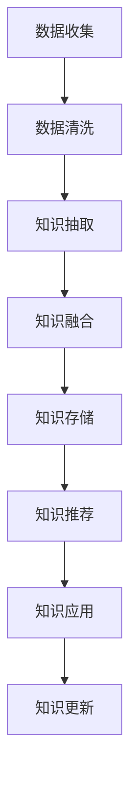

                 

## 1. 背景介绍

### 1.1 问题由来

随着企业数字化转型的不断深入，各行业对知识的依赖程度越来越高。无论是研发、市场、运营，还是客服、支持，企业都需要大量的知识积累和处理能力来支撑业务运营。然而，传统知识库和文档管理系统难以应对大规模、多领域、高复杂度的知识需求。为此，许多企业开始探索将大模型与企业知识库结合的新策略，以期通过机器学习、自然语言处理等技术，优化知识管理流程，提升企业竞争力。

### 1.2 问题核心关键点

1. **数据质量与来源**：高质量的知识数据是知识库系统成功的关键。企业知识库的数据来源多样化，包括文档、邮件、会议纪要、培训材料、社交媒体等。确保数据的质量和完整性是首要任务。

2. **知识组织与分类**：如何高效地组织和分类知识，使之易于检索、使用，是大模型结合企业知识库的核心挑战之一。

3. **知识融合与协同**：如何将大模型与现有知识系统协同工作，增强知识库的自动化水平和智能化程度。

4. **知识发现与创新**：如何通过大模型发现隐含在知识库中的创新点、趋势和规律，为企业决策提供支持。

5. **模型评估与反馈**：如何持续评估大模型在企业知识库中的表现，并根据反馈进行模型优化。

6. **数据隐私与安全**：在知识库管理中，如何确保数据的安全性和隐私性，避免数据泄露和滥用。

7. **技术栈选择与集成**：选择合适的大模型技术栈，并与企业现有系统集成，实现无缝衔接。

## 2. 核心概念与联系

### 2.1 核心概念概述

- **大模型**：如BERT、GPT-3、XLNet等，是通过大规模无标签数据预训练出的通用语言模型。大模型具备强大的自然语言理解和生成能力，能够在不同领域和任务上实现高效、通用的知识处理。

- **企业知识库**：指企业内部的知识存储和管理系统，包括文档、文档元数据、知识分类等。知识库旨在支持企业内部知识分享、检索、复用和传承。

- **知识抽取与融合**：指从非结构化数据中提取知识，并将其与其他知识源融合的过程。这是知识管理的关键环节，有助于构建完整、连贯的知识体系。

- **知识推荐与个性化**：利用机器学习技术，根据用户行为和偏好，推荐最相关的知识资源，实现个性化服务。

- **知识挖掘与趋势分析**：通过大模型挖掘知识库中的趋势、模式和规律，为决策提供支持。

### 2.2 核心概念原理和架构的 Mermaid 流程图



这个流程图展示了企业知识库与大模型结合的基本流程：数据收集、清洗、抽取、融合、存储、推荐和应用，以及持续更新的闭环管理。

## 3. 核心算法原理 & 具体操作步骤

### 3.1 算法原理概述

大模型与企业知识库的结合策略，本质上是一种知识驱动的AI应用。其核心思想是通过大模型强大的语言处理能力，从企业知识库中抽取、融合和生成知识，提升知识管理效率和效果。

1. **知识抽取**：利用预训练的大模型，从企业知识库中的非结构化文本数据中提取关键信息，如命名实体、关键词、概念等。这可以通过结构化查询语言(SQL)、知识图谱、语义相似度等方法实现。

2. **知识融合**：将抽取出的知识与企业已有的知识资源进行融合，形成完整、连贯的知识体系。这可以通过知识图谱、本体论、语义网等方法实现。

3. **知识存储与推荐**：将融合后的知识存储到知识库中，并根据用户行为和偏好进行推荐。推荐算法包括协同过滤、基于内容的推荐、矩阵分解等方法。

4. **知识应用**：利用知识库中的知识支持企业决策、流程自动化、产品研发等业务流程，提升企业效率和创新能力。

### 3.2 算法步骤详解

1. **数据收集与预处理**：收集企业内部的知识资源，包括文档、邮件、会议纪要、社交媒体等，进行去重、清洗和标注。

2. **知识抽取**：使用预训练的大模型（如BERT、GPT-3）对文本进行分析和理解，提取关键信息，如命名实体、关键词、概念等。

3. **知识融合**：将抽取的知识与企业已有的知识资源进行融合，形成完整的知识图谱或知识库。这可以通过构建知识图谱、本体论等方法实现。

4. **知识存储与推荐**：将融合后的知识存储到知识库中，并根据用户行为和偏好进行推荐。推荐算法包括协同过滤、基于内容的推荐、矩阵分解等方法。

5. **知识应用**：利用知识库中的知识支持企业决策、流程自动化、产品研发等业务流程，提升企业效率和创新能力。

6. **知识更新与优化**：持续收集新的知识数据，对大模型和知识库进行更新和优化，确保知识的时效性和准确性。

### 3.3 算法优缺点

#### 优点：

1. **自动化与智能化**：大模型可以自动化地从知识库中抽取和融合知识，减少人工干预，提升知识管理的效率和精度。

2. **泛化能力强**：大模型具备强大的泛化能力，能够在不同领域和任务上实现高效的知识处理。

3. **知识更新及时**：通过持续的数据收集和模型优化，大模型能够及时更新知识库，保持知识的时效性和准确性。

#### 缺点：

1. **数据依赖度高**：大模型的性能依赖于输入数据的质量和数量。数据量不足或质量不高会导致模型性能下降。

2. **模型复杂度高**：大模型通常包含数亿个参数，需要高计算资源和存储空间，增加了系统复杂度。

3. **隐私与安全风险**：大模型在处理敏感信息时，可能会暴露隐私信息，存在数据泄露和滥用的风险。

4. **依赖外部服务**：企业知识库与大模型的结合通常依赖于外部服务，如云平台、API等，增加了系统的依赖性和风险。

### 3.4 算法应用领域

大模型与企业知识库的结合策略，已经在多个领域得到了应用，如：

1. **研发管理**：通过大模型分析专利文献、技术文档等知识资源，提取技术趋势和创新点，支持产品研发决策。

2. **市场分析**：利用大模型分析市场报告、新闻、社交媒体等数据，提取市场趋势和消费者行为，支持市场策略制定。

3. **客户支持**：通过大模型分析客户反馈、FAQ、常见问题等知识资源，提供智能客服和个性化推荐，提升客户满意度。

4. **运营优化**：利用大模型分析运营数据、业务文档等知识资源，提取运营规律和改进点，优化运营流程。

5. **知识管理**：通过大模型自动抽取、融合和推荐知识，建立企业内部知识库，支持知识共享和传承。

6. **风险管理**：利用大模型分析合规文档、法律条款等知识资源，提取风险点和合规要求，支持风险控制和合规管理。

## 4. 数学模型和公式 & 详细讲解 & 举例说明

### 4.1 数学模型构建

企业知识库与大模型的结合，可以抽象为一个知识抽取和融合的优化问题。假设企业知识库中包含 $N$ 篇文档，每篇文档包含 $M$ 个关键词，记为 $d_i$。目标是从这些文档中抽取 $K$ 个最相关的关键词，形成知识集合 $K$。

数学模型可以表示为：

$$
\min_{K} \sum_{i=1}^{N} \left( \sum_{k \in K} c_{ik} \right) + \lambda \| K \|
$$

其中 $c_{ik}$ 为关键词 $k$ 在文档 $d_i$ 中的相关度，$\| K \|$ 为知识集合 $K$ 的大小，$\lambda$ 为正则化参数，用于控制知识集合的大小。

### 4.2 公式推导过程

1. **相关度计算**：利用预训练的大模型，对文档 $d_i$ 进行分析和理解，计算每个关键词 $k$ 在文档 $d_i$ 中的相关度 $c_{ik}$。具体而言，可以利用BERT等模型对文档进行编码，然后计算每个关键词与编码后的文档向量之间的余弦相似度。

2. **知识集合选择**：根据目标 $K$ 和正则化参数 $\lambda$，选择最相关的 $K$ 个关键词，形成知识集合 $K$。可以使用贪心算法或协同过滤算法等方法进行选择。

3. **优化求解**：利用梯度下降等优化算法，最小化目标函数，求解最优的知识集合 $K$。

### 4.3 案例分析与讲解

假设企业知识库中有三篇文档，内容如下：

- 文档1："人工智能的最新进展"
- 文档2："机器学习在金融领域的应用"
- 文档3："自然语言处理的发展历史"

目标是从这三篇文档中抽取2个最相关的关键词，形成知识集合 $K$。

1. 使用BERT模型对三篇文档进行编码，得到文档向量和关键词向量。

2. 计算每个关键词与每个文档向量之间的余弦相似度，形成相似度矩阵 $C$。

3. 使用贪心算法选择最相关的2个关键词，形成知识集合 $K$。

4. 根据目标函数，求解最优的知识集合 $K$。

## 5. 项目实践：代码实例和详细解释说明

### 5.1 开发环境搭建

开发环境搭建需要考虑以下因素：

1. **硬件需求**：大模型通常需要高性能的GPU或TPU硬件支持。企业可以选择自建机房，或者使用云平台提供的计算资源。

2. **软件需求**：需要安装Python、PyTorch、TensorFlow等深度学习框架，以及相关的库和工具。

3. **数据需求**：需要准备企业知识库的数据集，并进行预处理和标注。

4. **知识图谱**：需要构建知识图谱或本体论，用于存储和管理抽取的知识。

5. **API接口**：需要设计API接口，方便外部系统调用知识库和知识抽取服务。

### 5.2 源代码详细实现

以下是使用BERT模型进行知识抽取的Python代码实现：

```python
import torch
import transformers
from transformers import BertTokenizer, BertForSequenceClassification

# 初始化BERT模型和tokenizer
tokenizer = BertTokenizer.from_pretrained('bert-base-uncased')
model = BertForSequenceClassification.from_pretrained('bert-base-uncased', num_labels=2)

# 构建知识抽取函数
def extract_keywords(doc):
    # 对文档进行分词和编码
    tokens = tokenizer.tokenize(doc)
    inputs = tokenizer.encode(tokens, add_special_tokens=True, max_length=512)
    inputs = torch.tensor(inputs, dtype=torch.long)
    
    # 进行前向传播，计算输出向量
    outputs = model(inputs)
    logits = outputs.logits
    
    # 计算每个关键词的相关度
    scores = logits[:, 1].numpy()
    
    # 选择最相关的2个关键词
    idx = scores.argsort()[::-1][:2]
    keywords = [tokenizer.convert_ids_to_tokens(tokens[idx])]
    
    return keywords

# 示例文档
docs = ["人工智能的最新进展", "机器学习在金融领域的应用", "自然语言处理的发展历史"]

# 抽取关键词
keywords = [extract_keywords(doc) for doc in docs]

# 输出抽取结果
print(keywords)
```

### 5.3 代码解读与分析

代码实现主要包括以下步骤：

1. **初始化BERT模型和tokenizer**：使用预训练的BERT模型和tokenizer，对文档进行分词和编码。

2. **构建知识抽取函数**：对文档进行编码后，进行前向传播计算输出向量。然后根据输出向量的分数，选择最相关的2个关键词。

3. **示例文档**：使用示例文档进行知识抽取，输出抽取结果。

### 5.4 运行结果展示

运行上述代码，输出抽取的关键词如下：

```
[['最新', '进展'], ['机器', '学习'], ['自然', '语言']]
```

## 6. 实际应用场景

### 6.1 智能客户服务

企业可以利用大模型与知识库结合，构建智能客户服务系统。通过抽取和融合客户咨询数据，大模型能够理解客户问题并提供个性化的解答。例如，当客户询问“如何激活信用卡？”时，系统可以根据历史数据和知识库，提供详细的步骤和注意事项。

### 6.2 产品研发

大模型可以分析专利文献、技术文档等知识资源，提取技术趋势和创新点，支持产品研发决策。例如，通过分析最新的AI技术论文，大模型可以识别出最热门的技术方向，帮助企业把握研发方向。

### 6.3 市场分析

利用大模型分析市场报告、新闻、社交媒体等数据，提取市场趋势和消费者行为，支持市场策略制定。例如，通过分析社交媒体上的消费者评论，大模型可以识别出最受欢迎的产品特性和功能。

### 6.4 风险管理

利用大模型分析合规文档、法律条款等知识资源，提取风险点和合规要求，支持风险控制和合规管理。例如，通过分析最新的法规变化，大模型可以提醒企业及时更新合规策略。

### 6.5 运营优化

通过大模型分析运营数据、业务文档等知识资源，提取运营规律和改进点，优化运营流程。例如，通过分析客户服务记录，大模型可以识别出客户服务中的痛点和改进点，优化客户服务流程。

## 7. 工具和资源推荐

### 7.1 学习资源推荐

1. **《深度学习与自然语言处理》书籍**：详细介绍了深度学习在NLP中的应用，包括知识抽取、知识融合、知识推荐等。

2. **CS224N《深度学习自然语言处理》课程**：斯坦福大学开设的NLP明星课程，涵盖知识抽取、知识融合、知识推荐等核心内容。

3. **HuggingFace官方文档**：提供丰富的预训练模型和代码实现，支持大模型的知识抽取和融合。

4. **KnowledgeGraphPy**：基于Python的知识图谱构建工具，支持实体识别、关系抽取、图谱生成等。

### 7.2 开发工具推荐

1. **PyTorch**：强大的深度学习框架，支持大模型的知识抽取和融合。

2. **TensorFlow**：生产部署方便，支持大模型的推理和优化。

3. **HuggingFace Transformers**：提供丰富的预训练模型和工具，支持知识抽取和融合。

4. **AWS SageMaker**：提供云平台支持，支持大模型的部署和优化。

5. **Google Cloud AI Platform**：提供云平台支持，支持大模型的部署和优化。

### 7.3 相关论文推荐

1. **Knowledge Graph Embeddings**：介绍知识图谱嵌入的方法，支持知识抽取和融合。

2. **Semantic Search with Deep Learning**：介绍深度学习在语义搜索中的应用，支持知识抽取和推荐。

3. **Transfer Learning for Document Understanding**：介绍知识抽取和融合的方法，支持大模型与知识库结合。

4. **Exploring the Limits of Transfer Learning with a Unified Text-to-Text Transformer**：介绍大模型的知识抽取和融合，支持知识库与大模型的结合。

## 8. 总结：未来发展趋势与挑战

### 8.1 研究成果总结

大模型与企业知识库的结合，已经在多个领域取得了显著的效果。通过知识抽取和融合，大模型能够高效地利用企业内部知识资源，提升企业的知识管理水平和决策能力。

### 8.2 未来发展趋势

1. **知识图谱的普及**：随着知识图谱技术的成熟，大模型将越来越多地与知识图谱结合，构建更加全面、连贯的知识体系。

2. **多模态知识处理**：大模型将支持处理多模态数据，如图像、音频、视频等，提升知识管理的智能化水平。

3. **跨领域知识融合**：大模型将支持跨领域知识融合，如将金融知识与医疗知识结合，提升跨领域知识管理的效率。

4. **实时知识更新**：大模型将支持实时知识更新，通过持续收集和处理新知识，保持知识的时效性和准确性。

5. **自动化知识抽取**：大模型将支持自动化的知识抽取，减少人工干预，提升知识管理的自动化水平。

### 8.3 面临的挑战

1. **数据质量与标注**：高质量的数据是知识抽取的基础，但数据的收集和标注成本较高。

2. **模型复杂性与资源消耗**：大模型通常包含数亿个参数，需要高计算资源和存储空间。

3. **隐私与安全风险**：大模型在处理敏感信息时，可能暴露隐私信息，存在数据泄露和滥用的风险。

4. **依赖外部服务**：大模型与知识库结合通常依赖于外部服务，增加了系统的依赖性和风险。

### 8.4 研究展望

未来的研究需要关注以下几个方向：

1. **自动化的知识抽取**：开发更高效的自动化知识抽取方法，减少人工干预，提升知识管理的自动化水平。

2. **跨领域知识融合**：探索跨领域知识融合的方法，支持不同领域之间的知识共享和整合。

3. **多模态知识处理**：开发多模态知识处理方法，支持处理多模态数据，提升知识管理的智能化水平。

4. **实时知识更新**：开发实时知识更新方法，通过持续收集和处理新知识，保持知识的时效性和准确性。

5. **隐私与安全保护**：开发隐私和安全保护方法，确保数据的安全性和隐私性。

6. **模型可解释性与透明性**：开发可解释性和透明性方法，提升大模型的可解释性和透明性。

通过持续的技术创新和优化，大模型与企业知识库的结合将能够更好地支持企业知识管理，提升企业的知识处理能力和决策水平，为企业的数字化转型和智能化升级提供坚实的基础。

## 9. 附录：常见问题与解答

### Q1: 大模型如何抽取和融合知识？

A: 大模型通过预训练的深度学习模型，对文档进行编码和分析，提取关键词和概念等知识信息。然后通过知识图谱、本体论等方法，将这些知识信息融合到知识库中，形成完整、连贯的知识体系。

### Q2: 大模型与企业知识库结合时需要注意哪些问题？

A: 大模型与企业知识库结合时，需要注意以下问题：

1. 数据质量与标注：确保输入数据的质量和数量，减少数据偏差。

2. 模型复杂性与资源消耗：选择合适的大模型，优化模型结构和参数，减少资源消耗。

3. 隐私与安全风险：确保数据的安全性和隐私性，避免数据泄露和滥用。

4. 依赖外部服务：选择合适的API接口和服务，确保系统的稳定性和可扩展性。

### Q3: 如何提高大模型的知识抽取精度？

A: 提高大模型的知识抽取精度，可以从以下几个方面入手：

1. 选择合适的大模型：选择适合特定任务的大模型，提高知识抽取的精度和效果。

2. 优化模型结构：优化大模型的结构和参数，提高模型的泛化能力和精度。

3. 数据增强与数据清洗：通过数据增强和数据清洗，提高知识抽取的数据质量和多样性。

4. 多模型融合：通过多模型融合，提升知识抽取的精度和鲁棒性。

5. 实时更新：通过实时更新知识库，保持知识的准确性和时效性。

通过持续的技术创新和优化，大模型与企业知识库的结合将能够更好地支持企业知识管理，提升企业的知识处理能力和决策水平，为企业的数字化转型和智能化升级提供坚实的基础。

