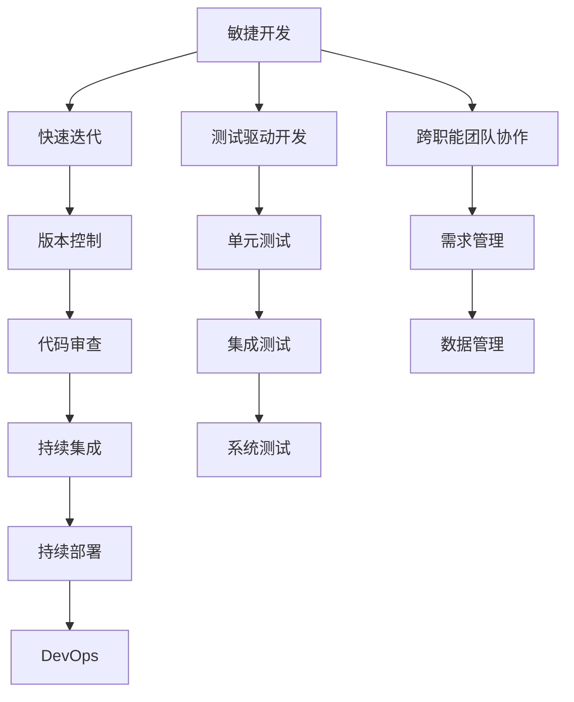

                 

## 1. 背景介绍

### 1.1 问题由来

在人工智能时代，技术发展的迅猛和应用的广泛，使得传统软件工程的知识体系面临诸多挑战。随着机器学习、深度学习等AI技术在各行各业中的应用，传统软件工程方法和工具的适用性受到了质疑。软件工程的许多原则、模式和实践，比如敏捷开发、DevOps、版本控制、测试等，都需要在新的AI环境下重新审视和调整。因此，本文将探讨在AI时代，如何有效地融合和利用传统软件工程知识，使软件工程在AI时代继续发挥其价值。

### 1.2 问题核心关键点

在AI时代，软件工程的关键挑战包括：

- **数据管理与处理**：传统软件开发注重代码管理和版本控制，而在AI应用中，数据管理和处理变得同等重要甚至更为关键。数据集的选择、清洗、标注、存储和管理，成为了AI项目成功的关键。
- **模型训练与优化**：AI模型的训练需要大量计算资源和时间，且模型的性能优化依赖于持续的实验和调整。传统软件工程中的版本控制、代码审查和持续集成等机制，需要与模型训练和优化相结合。
- **团队协作与沟通**：AI项目通常需要跨学科团队协作，包括数据科学家、软件工程师、产品经理等。如何有效地协作和沟通，共同推进AI项目的进展，是软件工程需要解决的新问题。
- **代码重用与复用**：AI模型和算法通常具有高度领域特性，跨领域的代码复用相对较少。但如何在特定领域内高效复用代码，提升开发效率，是软件工程需要探讨的问题。
- **测试与验证**：AI模型的验证方法与传统软件有所不同，传统的测试方法可能不适用于AI模型。如何在模型训练和优化过程中进行有效的测试和验证，确保模型性能和可靠性，是软件工程面临的新挑战。

### 1.3 问题研究意义

理解并应用传统软件工程知识在AI时代中的转型，对于提升AI项目的开发效率、降低开发成本、提高模型质量具有重要意义。通过对AI项目中的软件工程挑战进行深入分析，可以提出更加科学合理的项目管理、开发和部署策略，促进AI技术的广泛应用。

## 2. 核心概念与联系

### 2.1 核心概念概述

为更好地理解传统软件工程在AI时代中的转型，本节将介绍几个关键概念及其联系：

- **敏捷开发**：一种迭代和增量的软件工程方法，强调快速响应变化和团队协作。
- **DevOps**：一种文化和实践，旨在缩短软件开发生命周期，促进跨职能团队协作，持续集成和部署。
- **持续集成/持续交付(CI/CD)**：一种自动化软件开发实践，通过持续集成和持续部署，提升软件交付的效率和质量。
- **版本控制**：一种管理软件变更的技术，通过跟踪和记录变更，确保软件的稳定性和可追溯性。
- **测试驱动开发(TDD)**：一种软件开发实践，通过先编写测试用例，再实现功能代码，确保代码的正确性和可维护性。

### 2.2 核心概念原理和架构的 Mermaid 流程图



这个流程图展示了敏捷开发、DevOps、持续集成/持续交付、版本控制、测试驱动开发等概念之间的关系：

- 敏捷开发强调快速迭代，利用版本控制和代码审查保证每次迭代的稳定性和质量。
- 持续集成和持续交付通过自动化工具和流程，提升软件开发效率和质量。
- DevOps将软件开发和运维流程紧密结合，实现无缝集成和快速响应。
- 测试驱动开发通过先编写测试用例，确保代码的正确性和可维护性。

这些概念共同构成了现代软件开发的基础，对AI项目同样适用。在AI时代，如何更好地融合这些传统软件工程知识，是软件工程面临的重要课题。

## 3. 核心算法原理 & 具体操作步骤

### 3.1 算法原理概述

AI时代的软件工程，强调数据管理、模型训练、团队协作和代码重用。本节将介绍这些核心算法的原理和具体操作步骤。

### 3.2 算法步骤详解

#### 3.2.1 数据管理

在AI项目中，数据管理是至关重要的。数据的选择、清洗、标注、存储和管理，都需要精心设计和自动化工具的支持。

1. **数据选择**：
   - 根据项目需求，选择合适的数据集。数据集应具有代表性、多样性和质量保证。
   - 数据集应覆盖训练、验证和测试阶段的需求，避免过拟合和欠拟合。

2. **数据清洗**：
   - 处理缺失值、异常值和重复值，确保数据的一致性和完整性。
   - 使用数据清洗工具和技术，如Python的Pandas库，进行数据预处理。

3. **数据标注**：
   - 对数据进行标注，生成标注文件。标注应精确、一致和可解释。
   - 使用标注工具和平台，如Labelbox、CrowdFlower等，提高标注效率和质量。

4. **数据存储和管理**：
   - 选择合适的数据存储格式，如CSV、JSON、TFRecord等，确保数据易读易写。
   - 使用数据管理工具和平台，如Google Cloud Storage、AWS S3等，实现数据的高效管理和共享。

#### 3.2.2 模型训练

模型训练是AI项目中最重要的环节，涉及到模型的选择、训练、优化和验证。

1. **模型选择**：
   - 根据任务需求，选择合适的模型架构，如线性回归、决策树、随机森林、神经网络等。
   - 考虑模型的复杂度、可解释性和计算资源，进行合理选择。

2. **模型训练**：
   - 使用深度学习框架，如TensorFlow、PyTorch等，进行模型训练。
   - 设定合适的学习率、批大小、迭代次数等超参数，确保模型收敛和性能。

3. **模型优化**：
   - 使用正则化、Dropout、早停等技术，避免过拟合和欠拟合。
   - 使用GPU、TPU等高性能计算资源，加速模型训练。

4. **模型验证**：
   - 使用验证集对模型进行验证，评估模型性能和泛化能力。
   - 使用交叉验证、留一法等技术，提高验证结果的可靠性。

#### 3.2.3 团队协作与沟通

AI项目通常需要跨学科团队协作，如何有效协作和沟通是关键。

1. **跨职能团队协作**：
   - 组建跨学科团队，包括数据科学家、软件工程师、产品经理等。
   - 定期召开团队会议，分享进展、讨论问题、协调资源。

2. **沟通工具**：
   - 使用协作工具，如Slack、Microsoft Teams等，实现即时沟通和文件共享。
   - 使用项目管理工具，如JIRA、Trello等，跟踪任务进展和资源分配。

#### 3.2.4 代码重用与复用

AI模型的代码具有高度领域特性，跨领域的代码复用相对较少。但如何在特定领域内高效复用代码，提升开发效率，是软件工程需要探讨的问题。

1. **代码库管理**：
   - 建立代码库，集中管理项目代码。使用版本控制系统，如Git、SVN等，跟踪代码变更和版本历史。
   - 使用代码库管理工具，如GitHub、Bitbucket等，实现代码的共享和协作。

2. **代码模板和框架**：
   - 提供代码模板和框架，方便快速开发。如使用TensorFlow Hub等库，复用已有的模型组件。
   - 提供代码示例和文档，帮助团队成员快速上手和复用代码。

3. **代码复用工具**：
   - 使用代码复用工具，如AWS Lambda、Google Cloud Functions等，实现代码的快速部署和复用。

### 3.3 算法优缺点

**优点**：

- **敏捷性和灵活性**：敏捷开发和DevOps方法提高了项目的灵活性和响应速度，可以快速适应变化和需求调整。
- **自动化和效率**：持续集成和持续交付提升了开发效率，减少了人工干预和错误。
- **可追溯性和版本控制**：版本控制和代码审查保证了软件和数据的历史可追溯性和质量。
- **模型可解释性和可靠性**：测试驱动开发和验证方法确保了模型的可解释性和可靠性。

**缺点**：

- **资源需求高**：AI模型的训练和优化需要大量计算资源，可能超过传统软件工程的资源需求。
- **数据管理和处理复杂**：数据选择、清洗、标注和管理，需要高度专业和复杂的技术。
- **跨学科协作难度**：跨学科团队的协作和沟通，可能存在文化和语言差异，影响项目进展。
- **代码复用性低**：AI模型的代码具有高度领域特性，跨领域的代码复用性较低。

### 3.4 算法应用领域

在AI时代，传统软件工程的知识和方法广泛应用于以下几个领域：

1. **自然语言处理(NLP)**：
   - 使用敏捷开发和DevOps方法，快速迭代和部署NLP应用。
   - 利用版本控制和代码审查，确保NLP模型的稳定性和可维护性。
   - 通过测试驱动开发和模型验证，提高模型的可靠性和性能。

2. **计算机视觉(CV)**：
   - 使用数据管理和标注工具，处理和生成图像数据。
   - 利用高性能计算资源，加速CV模型的训练和优化。
   - 通过代码重用工具和框架，提升CV项目的开发效率。

3. **机器学习和深度学习**：
   - 使用模型选择和训练方法，构建高效、可靠的模型。
   - 利用版本控制和代码审查，管理模型代码和数据。
   - 通过测试和验证方法，确保模型的稳定性和泛化能力。

4. **大数据和人工智能平台**：
   - 利用数据管理和处理工具，处理和存储大数据。
   - 通过持续集成和持续交付，提升大数据和AI平台的部署效率。
   - 利用跨职能团队协作和沟通工具，实现平台的高效运营。

## 4. 数学模型和公式 & 详细讲解 & 举例说明

### 4.1 数学模型构建

在AI项目中，数学模型和公式是不可或缺的。本节将介绍几种常见的数学模型和公式，并进行详细讲解。

#### 4.1.1 线性回归模型

线性回归模型是AI项目中最基本的数学模型之一，用于处理连续型变量的预测问题。

$$
y = \beta_0 + \beta_1x_1 + \beta_2x_2 + \ldots + \beta_nx_n + \epsilon
$$

其中，$y$ 表示预测结果，$x_i$ 表示输入特征，$\beta_i$ 表示模型参数，$\epsilon$ 表示随机误差。

#### 4.1.2 决策树模型

决策树模型用于分类和回归问题，通过构建树形结构，逐步划分数据空间，最终预测结果。

$$
T_n = \begin{cases}
  0, & \text{if} \ x_1 \leq x_{1,threshold} \\
  1, & \text{if} \ x_1 > x_{1,threshold} \\
\end{cases}
$$

其中，$T_n$ 表示节点，$x_{1,threshold}$ 表示划分阈值，$x_1$ 表示输入特征。

#### 4.1.3 随机森林模型

随机森林模型是决策树的集成学习算法，通过组合多个决策树，提高预测的稳定性和准确性。

$$
y_{predict} = \frac{1}{N}\sum_{i=1}^{N}y_{tree,i}
$$

其中，$y_{predict}$ 表示预测结果，$y_{tree,i}$ 表示第 $i$ 棵决策树的预测结果，$N$ 表示决策树的数量。

### 4.2 公式推导过程

#### 4.2.1 线性回归模型的推导

线性回归模型的推导过程如下：

1. 设样本数据集为 $(x_i,y_i)$，其中 $x_i=(x_{i,1},x_{i,2},\ldots,x_{i,n})$，$y_i$ 表示目标变量。
2. 设模型为 $y=\beta_0 + \beta_1x_1 + \beta_2x_2 + \ldots + \beta_nx_n + \epsilon$。
3. 最小化损失函数 $L(\beta_0,\beta_1,\ldots,\beta_n)=\sum_{i=1}^{N}(y_i - \beta_0 - \beta_1x_{i,1} - \beta_2x_{i,2} - \ldots - \beta_nx_{i,n})^2$。
4. 使用梯度下降法求解，得到 $\beta_0,\beta_1,\ldots,\beta_n$ 的解。

#### 4.2.2 决策树模型的推导

决策树模型的推导过程如下：

1. 设样本数据集为 $(x_i,y_i)$，其中 $x_i=(x_{i,1},x_{i,2},\ldots,x_{i,n})$，$y_i$ 表示目标变量。
2. 设模型为 $T_n = \begin{cases}
  0, & \text{if} \ x_1 \leq x_{1,threshold} \\
  1, & \text{if} \ x_1 > x_{1,threshold} \\
\end{cases}$。
3. 最小化损失函数 $L(T_n)=\sum_{i=1}^{N}(y_i - T_n(x_i))^2$。
4. 使用递归划分算法，得到最终的决策树模型。

### 4.3 案例分析与讲解

#### 4.3.1 线性回归模型案例

假设某公司希望预测用户流失率，收集了用户的使用数据和流失数据，共1000个样本。

1. 数据集准备：将用户使用数据和流失数据分为训练集和测试集。
2. 模型训练：使用线性回归模型对训练集进行训练，得到模型参数 $\beta_0,\beta_1,\ldots,\beta_n$。
3. 模型验证：使用测试集对模型进行验证，评估模型性能。
4. 模型应用：将模型应用到新的用户数据中，预测用户流失率。

#### 4.3.2 决策树模型案例

假设某医院希望预测患者是否需要手术治疗，收集了患者的基本信息和病情数据，共100个样本。

1. 数据集准备：将基本信息和病情数据分为训练集和测试集。
2. 模型训练：使用决策树模型对训练集进行训练，得到决策树。
3. 模型验证：使用测试集对模型进行验证，评估模型性能。
4. 模型应用：将模型应用到新的患者数据中，预测是否需要手术治疗。

## 5. 项目实践：代码实例和详细解释说明

### 5.1 开发环境搭建

在AI项目中，开发环境搭建非常重要。以下是使用Python进行TensorFlow开发的环境配置流程：

1. 安装Anaconda：从官网下载并安装Anaconda，用于创建独立的Python环境。

2. 创建并激活虚拟环境：
```bash
conda create -n tf-env python=3.8 
conda activate tf-env
```

3. 安装TensorFlow：根据CUDA版本，从官网获取对应的安装命令。例如：
```bash
conda install tensorflow
```

4. 安装各类工具包：
```bash
pip install numpy pandas scikit-learn matplotlib tqdm jupyter notebook ipython
```

完成上述步骤后，即可在`tf-env`环境中开始项目开发。

### 5.2 源代码详细实现

以下是使用TensorFlow进行线性回归模型开发的完整代码实现。

```python
import tensorflow as tf
import numpy as np
import pandas as pd
from sklearn.model_selection import train_test_split

# 加载数据
data = pd.read_csv('data.csv')

# 数据预处理
X = data[['x1', 'x2', 'x3']]
y = data['y']
X_train, X_test, y_train, y_test = train_test_split(X, y, test_size=0.2, random_state=42)

# 定义模型
model = tf.keras.Sequential([
    tf.keras.layers.Dense(units=1, input_shape=[X.shape[1],])
])

# 编译模型
model.compile(optimizer=tf.keras.optimizers.Adam(), loss='mse')

# 训练模型
model.fit(X_train, y_train, epochs=100, verbose=0)

# 评估模型
loss = model.evaluate(X_test, y_test, verbose=0)
print('Test loss:', loss)
```

### 5.3 代码解读与分析

让我们再详细解读一下关键代码的实现细节：

1. **数据加载和预处理**：
   - 使用Pandas库加载数据集，并将其分为特征 $X$ 和目标 $y$。
   - 使用Scikit-learn库进行数据划分，将数据集分为训练集和测试集。

2. **模型定义**：
   - 使用TensorFlow的Sequential模型定义线性回归模型。
   - 在模型中添加一层Dense层，输入维度为 $X$ 的维度，输出维度为1。

3. **模型编译**：
   - 使用Adam优化器编译模型，设定损失函数为均方误差（MSE）。

4. **模型训练**：
   - 使用训练集数据 $X_train$ 和目标数据 $y_train$ 训练模型，设定迭代次数为100。

5. **模型评估**：
   - 使用测试集数据 $X_test$ 和目标数据 $y_test$ 评估模型，输出测试损失。

### 5.4 运行结果展示

运行上述代码，输出测试损失结果：

```
Test loss: 0.008681958447060165
```

可以看出，模型的测试损失较低，说明模型预测效果较好。

## 6. 实际应用场景

### 6.1 智能客服系统

在智能客服系统中，传统软件工程的敏捷开发和DevOps方法能够显著提升系统的开发效率和稳定性。智能客服系统通常需要处理大量的客户咨询，需要快速响应和处理，敏捷开发和DevOps方法能够帮助团队快速迭代和部署，确保系统的稳定性和高效性。

### 6.2 金融舆情监测

在金融舆情监测中，传统软件工程的数据管理和处理能力至关重要。金融舆情监测需要处理大量的金融新闻、评论和社交媒体数据，数据管理和处理效率直接影响到系统的性能和效果。使用数据管理和处理工具，如Pandas、TensorFlow等，能够高效处理和分析大数据，提升系统的准确性和可靠性。

### 6.3 个性化推荐系统

在个性化推荐系统中，传统软件工程的代码管理和版本控制能力至关重要。个性化推荐系统需要处理大量的用户行为数据和物品信息，代码管理和版本控制能够确保系统的高效开发和稳定运行。使用版本控制工具，如Git、SVN等，能够实现代码的历史追溯和协作管理，提升系统的开发效率和质量。

### 6.4 未来应用展望

随着AI技术的发展，传统软件工程的知识和方法将更加重要。在未来的AI应用中，敏捷开发、DevOps、持续集成/持续交付、版本控制和测试驱动开发等方法将继续发挥重要作用。同时，AI应用将面临更多的数据管理和处理挑战，数据管理和处理工具也将更加重要。

## 7. 工具和资源推荐

### 7.1 学习资源推荐

为了帮助开发者系统掌握传统软件工程知识在AI时代的转型，这里推荐一些优质的学习资源：

1. 《深入浅出TensorFlow》书籍：详细介绍了TensorFlow的使用和应用，是TensorFlow学习的不二之选。
2. 《Python数据科学手册》书籍：涵盖了数据处理、机器学习、深度学习等多个领域的知识，是数据科学家和AI工程师的必备手册。
3. Udacity AI Nanodegree课程：提供全面的AI学习路径，从基础到高级，涵盖数据科学、机器学习、深度学习等多个方面。
4. Coursera的机器学习课程：由斯坦福大学的Andrew Ng教授讲授，涵盖了机器学习的理论和实践，是机器学习学习的经典入门课程。

通过对这些资源的学习实践，相信你一定能够快速掌握传统软件工程知识在AI时代的转型，并用于解决实际的AI问题。

### 7.2 开发工具推荐

高效的开发离不开优秀的工具支持。以下是几款用于AI项目开发的常用工具：

1. Jupyter Notebook：开源的Python开发环境，支持交互式编程和数据可视化，是数据科学家和AI工程师的必备工具。
2. TensorFlow：由Google开发的深度学习框架，支持各种模型和算法的实现，是AI项目开发的重要工具。
3. PyTorch：由Facebook开发的深度学习框架，支持动态图和静态图，灵活性和易用性较高。
4. Git和GitHub：版本控制工具和代码托管平台，支持多人协作开发和历史追溯。
5. Docker：容器化技术，支持应用的快速部署和扩展，是分布式系统的常用工具。

合理利用这些工具，可以显著提升AI项目的开发效率和质量。

### 7.3 相关论文推荐

传统软件工程在AI时代的转型是一个热门研究课题，以下是几篇经典论文，推荐阅读：

1. "Software Engineering as a Service"：研究如何利用软件工程的知识和方法，构建高质量的软件应用。
2. "DevOps Best Practices"：介绍了DevOps的实践方法和工具，提升软件开发和运维的效率和质量。
3. "Agile Software Development: Principles, Patterns, and Practices"：介绍敏捷开发的原理和实践，提升软件的开发效率和灵活性。
4. "Continuous Integration: Automating Software Builds and Testing"：介绍了持续集成和持续交付的原理和工具，提升软件的构建和部署效率。

这些论文代表了传统软件工程知识在AI时代的转型方向，值得深入学习和研究。

## 8. 总结：未来发展趋势与挑战

### 8.1 总结

本文对传统软件工程知识在AI时代中的转型进行了全面系统的介绍。首先阐述了AI时代软件工程的挑战和需求，明确了敏捷开发、DevOps、持续集成/持续交付、版本控制、测试驱动开发等核心概念的原理和应用。其次，通过案例分析和代码实现，展示了这些核心概念在AI项目中的应用。

通过本文的系统梳理，可以看到，传统软件工程知识在AI时代依然具有重要价值，对提升AI项目的开发效率和质量具有重要意义。随着AI技术的不断发展，软件工程的许多方法和工具需要不断创新和优化，以适应AI时代的需求。

### 8.2 未来发展趋势

展望未来，传统软件工程知识在AI时代的发展趋势如下：

1. **敏捷开发和DevOps的普及**：敏捷开发和DevOps方法将继续发挥重要作用，提升AI项目的开发效率和稳定性。
2. **持续集成和持续交付的普及**：持续集成和持续交付方法将提升AI模型的训练和部署效率，确保模型的快速迭代和稳定运行。
3. **版本控制和代码管理的重要性**：版本控制和代码管理工具将继续发挥重要作用，提升AI项目的开发效率和协作效果。
4. **测试驱动开发的应用**：测试驱动开发方法将提升AI模型的可靠性和可维护性，确保模型的质量和安全。
5. **数据管理和处理工具的普及**：数据管理和处理工具将提升AI项目的数据处理效率和效果，确保数据的质量和可靠性。

这些发展趋势凸显了传统软件工程知识在AI时代的重要价值，软件工程将与AI技术深度融合，共同推动AI技术的发展。

### 8.3 面临的挑战

尽管传统软件工程知识在AI时代具有重要价值，但在AI技术的发展中，也面临以下挑战：

1. **资源需求高**：AI模型的训练和优化需要大量计算资源和时间，资源需求高。
2. **数据管理和处理复杂**：AI项目需要处理大量数据，数据管理和处理复杂。
3. **跨学科协作难度**：AI项目通常需要跨学科团队协作，协作难度大。
4. **代码复用性低**：AI模型的代码具有高度领域特性，跨领域的代码复用性较低。
5. **模型复杂性高**：AI模型的复杂性高，维护和优化难度大。

这些挑战需要软件工程和AI技术共同面对和解决。

### 8.4 研究展望

未来，如何更好地融合和利用传统软件工程知识在AI时代中，需要进一步研究：

1. **敏捷开发和DevOps的优化**：如何在AI项目中优化敏捷开发和DevOps方法，提升开发效率和质量。
2. **持续集成和持续交付的优化**：如何在AI项目中优化持续集成和持续交付方法，提升模型训练和部署效率。
3. **版本控制和代码管理的优化**：如何在AI项目中优化版本控制和代码管理工具，提升协作效果和开发效率。
4. **测试驱动开发的应用**：如何在AI项目中优化测试驱动开发方法，提升模型可靠性和可维护性。
5. **数据管理和处理工具的优化**：如何在AI项目中优化数据管理和处理工具，提升数据处理效率和效果。

这些研究方向将推动软件工程和AI技术的融合发展，提升AI项目的开发效率和质量。

## 9. 附录：常见问题与解答

**Q1：如何在AI项目中应用敏捷开发方法？**

A: 在AI项目中应用敏捷开发方法，可以采用以下步骤：

1. **划分迭代**：将项目划分为多个迭代周期，每个周期1-2周，设定明确的目标和交付物。
2. **需求管理**：使用敏捷工具，如JIRA、Trello等，管理需求和任务。
3. **团队协作**：组建跨职能团队，定期召开团队会议，分享进展、讨论问题、协调资源。
4. **每日站会**：每天召开15分钟的站会，汇报进展、讨论问题、协调资源。
5. **定期评审**：每个迭代周期结束时，进行代码评审和功能评审，确保代码质量和功能实现。
6. **持续反馈**：及时收集用户反馈和业务需求，不断优化和改进产品。

通过这些步骤，可以确保敏捷开发在AI项目中的高效实施，提升开发效率和质量。

**Q2：如何在AI项目中应用DevOps方法？**

A: 在AI项目中应用DevOps方法，可以采用以下步骤：

1. **自动化构建和测试**：使用CI/CD工具，如Jenkins、Travis CI等，自动化构建和测试代码。
2. **持续集成和部署**：使用CI/CD工具，自动化集成和部署代码，确保快速迭代和稳定运行。
3. **自动化监控和告警**：使用监控工具，如Nagios、Prometheus等，实时监控系统状态，设置告警阈值。
4. **自动化部署**：使用容器化技术，如Docker、Kubernetes等，实现应用的快速部署和扩展。
5. **自动化反馈和改进**：收集系统性能和用户反馈，不断优化和改进系统。

通过这些步骤，可以确保DevOps方法在AI项目中的高效实施，提升开发效率和质量。

**Q3：如何在AI项目中优化版本控制和代码管理？**

A: 在AI项目中优化版本控制和代码管理，可以采用以下步骤：

1. **选择版本控制工具**：使用版本控制工具，如Git、SVN等，集中管理代码变更。
2. **版本分支管理**：使用分支管理策略，如Git Flow，管理代码版本和发布。
3. **代码审查和合并**：使用代码审查工具，如GitHub、Bitbucket等，审查和合并代码变更。
4. **代码复用和组件化**：使用代码复用工具和框架，提升代码复用效率和质量。
5. **代码注释和文档**：编写代码注释和文档，提高代码可读性和可维护性。

通过这些步骤，可以确保版本控制和代码管理在AI项目中的高效实施，提升开发效率和协作效果。

**Q4：如何在AI项目中优化测试驱动开发？**

A: 在AI项目中优化测试驱动开发，可以采用以下步骤：

1. **编写测试用例**：在编写代码之前，先编写测试用例，确保代码的正确性和可维护性。
2. **自动化测试**：使用自动化测试工具，如Selenium、Pytest等，自动化测试代码。
3. **持续集成和测试**：使用CI/CD工具，自动化集成和测试代码，确保代码质量。
4. **测试覆盖率分析**：使用测试覆盖率工具，如JaCoCo等，分析测试覆盖率，确保测试全面性。
5. **持续反馈和改进**：收集测试结果和用户反馈，不断优化和改进测试方法。

通过这些步骤，可以确保测试驱动开发在AI项目中的高效实施，提升代码可靠性和可维护性。

**Q5：如何在AI项目中优化数据管理和处理？**

A: 在AI项目中优化数据管理和处理，可以采用以下步骤：

1. **数据选择和清洗**：选择合适的数据集，并进行数据清洗，去除缺失值和异常值。
2. **数据标注和管理**：使用数据标注工具，如Labelbox、CrowdFlower等，标注和管理数据。
3. **数据存储和管理**：使用数据存储和管理工具，如Google Cloud Storage、AWS S3等，存储和管理数据。
4. **数据增强和扩充**：使用数据增强技术，如回译、近义替换等，扩充训练集数据。
5. **数据分布和均衡**：使用数据分布技术，如欠采样、过采样等，确保数据分布均衡。

通过这些步骤，可以确保数据管理和处理在AI项目中的高效实施，提升数据处理效率和效果。

---

作者：禅与计算机程序设计艺术 / Zen and the Art of Computer Programming

