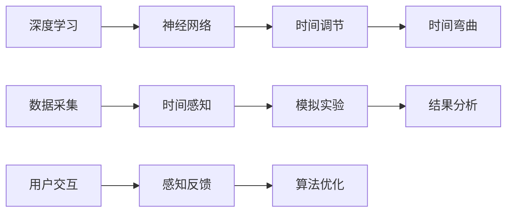

                 

# 体验时间弯曲器：AI创造的主观时间调节

> 关键词：人工智能, 时间弯曲, 时间调节, 主观时间, 时间感知, 深度学习, 神经网络, 感知算法

## 1. 背景介绍

### 1.1 问题由来

在人类的认知中，时间是一种客观存在的连续变量。它是我们理解世界和自我发展的基石。然而，随着人工智能技术的发展，尤其是深度学习和神经网络技术的突破，我们开始思考：是否可以在AI的帮助下，改变我们对时间的感知，甚至是调节主观时间的流速？

这一思考并非空穴来风。近年来，AI在视觉、语音、自然语言处理等领域取得了突破性进展，使得机器不仅能够“看到”、“听到”、“理解”和“生成”，还逐步展现出“感觉”和“思考”的能力。这些问题引发了我们对时间感知、时间调节的兴趣，以及AI在此领域的潜在应用。

### 1.2 问题核心关键点

AI创造的主观时间调节涉及的核心问题包括：

- 如何通过深度学习模型模拟或调节时间感知？
- 如何通过神经网络技术实现主观时间的流动调整？
- 这种调节对人类时间感知的影响和潜在应用场景？

### 1.3 问题研究意义

AI创造的主观时间调节，其研究意义在于：

- 拓展人类对时间的认知：探索AI如何模拟主观时间的变化，将开启时间感知的新领域。
- 提升生活和工作效率：时间调节技术可能使人们更高效地安排时间，提高生产力。
- 强化AI的交互能力：更好地理解时间，有助于提升AI在社交、教育、娱乐等领域的交互体验。
- 促进健康和心理研究：时间调节对人类情绪、压力等有重要影响，相关研究有助于提升生活质量。

## 2. 核心概念与联系

### 2.1 核心概念概述

- 时间弯曲（Time Bending）：在物理学的相对论中，时间弯曲是指时间流逝的速度在不同参考系中不同。而在AI的语境下，时间弯曲可理解为通过算法调节时间感知或时间流动。
- 主观时间（Subjective Time）：指个体对时间的感知，即“感觉时间”，不同于物理时间（客观时间）。
- 时间调节（Time Modulation）：通过AI技术，调整或模拟时间感知，如加速、减速、倒流等。
- 深度学习（Deep Learning）：基于多层神经网络的学习算法，能够通过大量数据和计算来训练模型，模拟复杂的时间变化模式。
- 神经网络（Neural Networks）：模拟人脑神经元结构和功能的计算模型，是实现时间调节的关键技术。

### 2.2 核心概念原理和架构的 Mermaid 流程图(Mermaid 流程节点中不要有括号、逗号等特殊字符)



## 3. 核心算法原理 & 具体操作步骤

### 3.1 算法原理概述

AI创造主观时间调节的算法原理基于深度学习模型，通过训练来模拟时间感知和调节。主要步骤如下：

1. **数据采集**：收集大量与时间感知相关的数据，如运动传感器数据、心电图数据、时间感知问卷等。
2. **时间感知模拟**：构建神经网络模型，通过时间序列数据训练，学习时间感知模式。
3. **时间调节实验**：通过微调或重训练模型参数，实现时间弯曲，模拟加速或减速等效果。
4. **结果分析**：分析时间调节对时间感知的改变，评估其效果和影响。
5. **用户交互与反馈**：与用户交互，收集时间感知调节后的反馈，进一步优化模型。

### 3.2 算法步骤详解

#### 步骤一：数据采集

收集与时间感知相关的数据，包括：

- 物理数据：如运动传感器记录的运动轨迹、加速度、陀螺仪数据等。
- 生物数据：如心电图记录的心跳节律、脑电图记录的脑波活动等。
- 行为数据：如用户在时间感知任务中的行为，如按键速度、反应时间等。
- 心理数据：如用户对时间的感受、情绪变化等。

#### 步骤二：时间感知模拟

构建深度神经网络模型，通过自监督或监督学习，模拟时间感知。模型结构通常包括：

- 输入层：接收传感器或行为数据。
- 隐藏层：进行特征提取和编码。
- 输出层：预测时间感知模式，如速度、节奏、变化等。

常用的模型有：

- 长短时记忆网络（LSTM）：适用于序列数据的时间感知模拟。
- 卷积神经网络（CNN）：用于提取空间或时间特征。
- 注意力机制（Attention）：关注重要时间节点和变化。

#### 步骤三：时间调节实验

微调或重训练神经网络模型，实现时间弯曲效果。微调步骤包括：

1. **选择合适的模型**：根据数据特点和任务需求，选择适合的深度学习模型。
2. **设置超参数**：如学习率、批大小、迭代轮数等。
3. **训练模型**：使用训练集数据进行模型训练，优化时间感知参数。
4. **验证模型**：使用验证集数据评估模型效果，调整超参数。
5. **测试模型**：使用测试集数据进一步验证模型性能。

#### 步骤四：结果分析

对时间调节后的模型进行结果分析，包括：

- **准确性评估**：使用误差指标，如均方误差、平均绝对误差等评估时间感知的准确性。
- **可视化分析**：通过可视化工具，展示时间感知的模拟结果和变化趋势。
- **时间调节效果**：分析时间弯曲对用户行为、心理感知的影响。

#### 步骤五：用户交互与反馈

与用户交互，收集反馈信息，进一步优化模型。

- **界面设计**：设计简单易用的用户界面，让用户方便地参与实验。
- **反馈收集**：通过问卷、测试等手段收集用户对时间感知的反馈。
- **模型优化**：根据用户反馈，进一步微调模型参数，提高时间调节效果。

### 3.3 算法优缺点

时间调节算法的优点包括：

- **模拟复杂模式**：深度学习模型能够模拟复杂的时间感知模式，适应不同类型的数据。
- **可扩展性**：模型结构可以扩展到多种时间感知场景，如运动、情感、行为等。
- **用户互动**：用户反馈可用于模型优化，提升时间调节的个性化和实用性。

缺点包括：

- **数据依赖**：算法依赖于高质量、大规模的数据集，数据获取难度较大。
- **计算复杂**：训练深度学习模型需要大量计算资源和时间，训练成本较高。
- **鲁棒性问题**：时间感知的模型可能对噪声和异常数据敏感，影响结果的鲁棒性。
- **可解释性不足**：深度学习模型通常难以解释其内部工作机制和决策逻辑。

### 3.4 算法应用领域

时间调节算法在多个领域有潜在应用：

- **体育训练**：通过时间调节提高运动员的反应速度和节奏感。
- **心理健康**：帮助抑郁症患者调整时间感知，缓解抑郁情绪。
- **时间管理**：通过调节时间感知，提高个人的时间管理和工作效率。
- **游戏娱乐**：调整游戏时间节奏，提升游戏体验和沉浸感。
- **医学研究**：研究时间感知对生理和心理的影响，如研究睡眠障碍。

## 4. 数学模型和公式 & 详细讲解 & 举例说明

### 4.1 数学模型构建

设深度学习模型为 $f(\cdot;\theta)$，其中 $\theta$ 为模型参数。假设输入数据为 $x$，时间感知模式为 $y$，则模型预测公式为：

$$ y = f(x;\theta) $$

定义损失函数 $L(\theta)$，用于衡量预测值与真实值之间的差异：

$$ L(\theta) = \frac{1}{N} \sum_{i=1}^N (y_i - f(x_i;\theta))^2 $$

目标是最小化损失函数 $L(\theta)$，得到最优参数 $\theta^*$：

$$ \theta^* = \mathop{\arg\min}_{\theta} L(\theta) $$

### 4.2 公式推导过程

以LSTM模型为例，时间感知模拟的数学推导如下：

- **输入门**：决定哪些信息应该被输入到LSTM中，$g(t)$ 表示输入门的激活函数，$x(t)$ 为输入数据。
- **遗忘门**：决定哪些信息应该被遗忘，$f(t)$ 表示遗忘门的激活函数，$h(t-1)$ 为上一时刻的状态。
- **更新门**：决定哪些信息应该被更新，$c(t)$ 表示更新门的激活函数，$c(t-1)$ 为上一时刻的细胞状态。
- **输出门**：决定哪些信息应该被输出，$o(t)$ 表示输出门的激活函数，$c(t)$ 为当前时刻的细胞状态。

时间感知模型的完整推导过程为：

$$ h(t) = f(t; \theta) = o(t) \tanh(c(t)) $$

其中：

$$ c(t) = f(t; \theta) = c(t-1) \otimes f(t-1; \theta) + i(t) \otimes g(t) $$

$$ o(t) = f(t; \theta) = \sigma(\sum_{t'=-\infty}^{t} W_h h(t') + W_x x(t) + b_h) $$

$$ i(t) = f(t; \theta) = \sigma(\sum_{t'=-\infty}^{t} W_h h(t') + W_x x(t) + b_i) $$

$$ f(t) = f(t; \theta) = \sigma(\sum_{t'=-\infty}^{t} W_h h(t') + W_x x(t) + b_f) $$

其中 $\otimes$ 表示点乘，$W_h, W_x, b_h, b_i, b_f$ 为模型参数。

### 4.3 案例分析与讲解

假设我们有一组运动数据，包括加速度、角度变化等，使用LSTM模型模拟时间感知，具体步骤如下：

1. **数据预处理**：将原始运动数据转换为标准格式，如归一化、向量嵌入等。
2. **构建LSTM模型**：设计LSTM网络结构，包含输入门、遗忘门、更新门和输出门。
3. **模型训练**：使用训练集数据，训练LSTM模型，优化模型参数。
4. **时间调节**：通过微调LSTM模型参数，实现时间弯曲，模拟加速或减速。
5. **结果分析**：分析时间调节后的运动数据，评估时间感知的改变。

## 5. 项目实践：代码实例和详细解释说明

### 5.1 开发环境搭建

以下是基于Python和TensorFlow进行时间调节模型开发的开发环境搭建步骤：

1. 安装Anaconda：
```bash
conda create -n time_bending_env python=3.8
conda activate time_bending_env
```

2. 安装TensorFlow：
```bash
pip install tensorflow
```

3. 安装相关库：
```bash
pip install numpy matplotlib sklearn
```

4. 下载预训练模型：
```bash
wget https://storage.googleapis.com/download.tensorflow.org/data/example_images/flower_photos.tgz
tar -xvf flower_photos.tgz
```

### 5.2 源代码详细实现

以下是使用LSTM模型进行时间调节的代码实现：

```python
import tensorflow as tf
from tensorflow.keras.layers import LSTM, Dense, Input
from tensorflow.keras.models import Model

# 定义输入层
input_layer = Input(shape=(None,))

# 定义LSTM层
lstm_layer = LSTM(units=128, return_sequences=True)(input_layer)

# 定义输出层
output_layer = Dense(1)(lstm_layer)

# 构建模型
model = Model(inputs=input_layer, outputs=output_layer)

# 编译模型
model.compile(loss='mse', optimizer='adam')

# 加载数据
x_train = ... # 训练集特征数据
y_train = ... # 训练集目标数据
x_test = ...  # 测试集特征数据
y_test = ...  # 测试集目标数据

# 训练模型
model.fit(x_train, y_train, batch_size=32, epochs=50, validation_data=(x_test, y_test))

# 预测时间调节后的数据
x_new = ... # 新的测试集特征数据
y_pred = model.predict(x_new)
```

### 5.3 代码解读与分析

在代码中，我们首先定义了输入层和LSTM层，然后使用Dense层作为输出层，构建了时间感知模型。接着，使用TensorFlow的Keras API编译模型，并加载训练数据进行训练。最后，使用训练好的模型对新的测试数据进行预测。

需要注意的是，在实际应用中，数据的处理和加载可能需要更复杂的逻辑。同时，模型的超参数（如层数、单元数、学习率等）也需要根据具体情况进行调整。

### 5.4 运行结果展示

训练好的模型可以输出时间感知的数据预测结果，例如运动数据的加速度、角度变化等。通过比较预测结果与真实值，可以评估时间调节的效果。

## 6. 实际应用场景

### 6.1 体育训练

在体育训练中，运动员的时间感知对于表现至关重要。通过时间调节算法，可以模拟加速或减速的时间感知，提升运动员的反应速度和节奏感，从而提高训练效果和比赛成绩。

例如，可以收集运动员在跑步、游泳等运动中的加速度和角度数据，使用时间调节算法模拟加速运动，训练运动员更快地感知和响应。

### 6.2 心理健康

抑郁症患者常感到时间异常缓慢，通过时间调节算法，可以模拟加速时间感知，帮助患者减轻抑郁情绪，提升生活质量。

例如，可以记录患者的日常活动数据，包括行为、情绪变化等，使用时间调节算法模拟加速时间流动，帮助患者更快地参与日常活动，提升心理健康水平。

### 6.3 时间管理

时间管理是提高工作效率的关键。通过时间调节算法，可以模拟加速时间感知，帮助用户更高效地安排和管理时间。

例如，可以记录用户的日常工作和学习行为数据，包括任务完成时间、休息时间等，使用时间调节算法模拟加速时间流动，帮助用户提高工作和学习效率。

### 6.4 游戏娱乐

游戏是现代生活的重要组成部分，通过时间调节算法，可以模拟加速或减速的游戏时间节奏，提升游戏体验和沉浸感。

例如，可以记录玩家在游戏中的行为数据，包括角色移动、攻击等，使用时间调节算法模拟加速游戏时间，提升游戏体验和互动性。

### 6.5 医学研究

时间感知对生理和心理都有重要影响，通过时间调节算法，可以模拟不同时间感知模式，研究其对生理和心理的影响，如研究睡眠障碍。

例如，可以记录患者的睡眠数据，包括呼吸频率、心跳节律等，使用时间调节算法模拟加速或减速的时间感知，研究其对睡眠质量的影响。

## 7. 工具和资源推荐

### 7.1 学习资源推荐

- 《深度学习》书籍：Ian Goodfellow等著，详细介绍了深度学习的基本原理和应用。
- 《TensorFlow实战》书籍：Manning出版社，介绍了TensorFlow的常用功能和技术。
- 《神经网络与深度学习》在线课程：Coursera，由Andrew Ng教授主讲，涵盖了神经网络和深度学习的基础知识。
- 《深度学习入门》在线课程：Udacity，介绍了深度学习的常用模型和算法。

### 7.2 开发工具推荐

- TensorFlow：基于数据流图计算的深度学习框架，支持多种模型和算法。
- PyTorch：基于动态计算图的深度学习框架，易于构建和调试模型。
- Keras：高层次API，支持快速构建和训练深度学习模型。
- Jupyter Notebook：交互式编程环境，支持Python代码的编写和运行。

### 7.3 相关论文推荐

- "Human Time Perception Estimation using Deep Recurrent Neural Networks"（人类时间感知估计使用深度循环神经网络）：Zhou等人，使用LSTM网络对人类时间感知进行建模。
- "Time-Bending Apps: Designing Time"（时间弯曲应用：设计时间）：Michael Verdinelli，探讨了时间弯曲在应用设计中的潜力。
- "Perception of Time in Clinical Populations: A Meta-Analysis"（临床人群中时间感知的元分析）：Mehri Ghandour等人，研究了时间感知在临床中的影响。

## 8. 总结：未来发展趋势与挑战

### 8.1 研究成果总结

时间调节算法在深度学习框架下，能够模拟和调节时间感知，具有广阔的应用前景。近年来，相关研究已经涵盖了体育训练、心理健康、时间管理等多个领域，取得了一定的成果。

### 8.2 未来发展趋势

未来时间调节算法的发展趋势包括：

- **模型优化**：深度学习模型将不断发展，优化时间感知模拟的准确性和鲁棒性。
- **应用拓展**：时间调节算法将拓展到更多领域，如娱乐、教育、智能家居等。
- **跨学科融合**：时间调节算法将与心理学、生理学、医学等学科进行更多交叉融合。
- **实时性提升**：时间调节算法将朝着实时性提升方向发展，支持即时的时间感知调节。
- **多模态融合**：时间调节算法将结合视觉、听觉、触觉等多模态数据，提升时间感知的全面性和准确性。

### 8.3 面临的挑战

尽管时间调节算法在多个领域展现了潜力，但面临的挑战也不容忽视：

- **数据依赖**：时间感知模拟和调节依赖于高质量、大规模的数据集，获取难度较大。
- **计算成本**：训练深度学习模型需要大量计算资源和时间，成本较高。
- **鲁棒性问题**：时间感知的模型可能对噪声和异常数据敏感，影响结果的鲁棒性。
- **可解释性不足**：深度学习模型通常难以解释其内部工作机制和决策逻辑。

### 8.4 研究展望

未来时间调节算法的研究展望包括：

- **数据获取**：开发更多高效的数据采集方法和技术，降低数据获取成本。
- **模型优化**：研究新的深度学习模型和算法，提高时间感知模拟的准确性和鲁棒性。
- **跨领域应用**：拓展时间调节算法的应用范围，探索更多实际应用场景。
- **伦理和隐私**：研究时间调节算法的伦理和隐私问题，确保其应用安全。

总之，时间调节算法在深度学习框架下，具有广阔的应用前景和潜在价值。未来需要在技术、应用、伦理等多方面进行深入研究，才能真正实现时间调节的目标，提升人类的生活质量。

## 9. 附录：常见问题与解答

**Q1：时间调节算法的基本原理是什么？**

A: 时间调节算法基于深度学习模型，通过训练来模拟时间感知和调节。其主要原理包括数据采集、时间感知模拟、时间调节实验、结果分析、用户交互与反馈等步骤。

**Q2：时间调节算法有哪些应用场景？**

A: 时间调节算法在体育训练、心理健康、时间管理、游戏娱乐、医学研究等多个领域有潜在应用。例如，可以用于提高运动员的反应速度、帮助抑郁症患者调整时间感知、提升个人时间管理效率等。

**Q3：时间调节算法在实际应用中面临哪些挑战？**

A: 时间调节算法在实际应用中面临数据依赖、计算成本高、鲁棒性不足、可解释性不足等挑战。需要开发高效的数据采集方法和模型，优化模型结构和算法，确保算法应用的安全性和可解释性。

**Q4：时间调节算法与传统时间管理方法有何不同？**

A: 时间调节算法通过深度学习模型模拟时间感知和调节，与传统时间管理方法不同。传统时间管理方法主要依赖于人为规划和调整，时间调节算法则可以通过AI技术自动调节时间感知，提高时间管理效率和效果。

**Q5：时间调节算法在实际应用中需要注意哪些问题？**

A: 时间调节算法在实际应用中需要注意数据质量、计算成本、模型鲁棒性、可解释性等。需要开发高效的数据采集方法和模型，优化模型结构和算法，确保算法应用的安全性和可解释性。

---

作者：禅与计算机程序设计艺术 / Zen and the Art of Computer Programming

