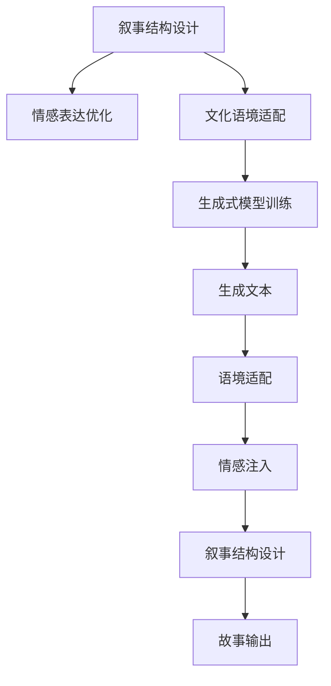

                 

# 体验的叙事性：AI驱动的个人故事创作

## 1. 背景介绍

### 1.1 问题由来
近年来，随着人工智能（AI）技术的快速发展，自然语言处理（NLP）领域取得了显著进展，尤其是深度学习技术在文本生成、语义理解等方面的突破。其中，基于深度学习的语言模型，如GPT-3等，因其强大的语言生成能力而备受关注。然而，这些模型仍存在一定的局限性，主要表现在以下几个方面：

1. **缺乏上下文理解**：现有的语言模型虽然在生成连贯的文本方面表现出色，但在理解故事背景和人物情感方面仍显不足，生成的文本往往缺乏真实感和细腻的情感表达。
2. **创意和叙事结构缺乏**：模型生成的文本虽然流畅，但故事创意和结构设计能力较弱，无法生成具有叙事性的高质量文本。
3. **文化和社会语境缺失**：缺乏对特定文化和社会语境的深刻理解和适应，生成的文本往往缺乏现实意义和时代感。

为了解决这些问题，AI驱动的个人故事创作应运而生。通过引入叙事学和AI技术的结合，AI能够理解和模仿人类的叙事方式，创作出具有情感、文化和逻辑连贯性的个人故事。

### 1.2 问题核心关键点
AI驱动的个人故事创作的核心关键点包括：

1. **叙事结构的设计**：如何设计叙事结构，使得生成的文本具有合理的情节发展和人物互动。
2. **情感表达的优化**：如何在文本中融入情感表达，使得故事更加引人入胜。
3. **文化语境的适配**：如何让AI生成的故事适应特定文化和社会语境，具备现实意义。
4. **生成效率的提升**：如何提高文本生成的速度和质量，使得创作过程更加高效。

## 2. 核心概念与联系

### 2.1 核心概念概述

为更好地理解AI驱动的个人故事创作，本节将介绍几个密切相关的核心概念：

- **AI驱动的个人故事创作**：通过AI技术，结合叙事学理论，自动生成具有情感、文化和社会语境的个人故事。
- **叙事学**：研究故事和叙述的构成、结构和功能，以及它们如何影响读者理解和感受。
- **深度学习**：一种基于神经网络的机器学习方法，通过大量数据训练模型，使其具备识别、生成和理解复杂模式的能力。
- **情感生成**：通过AI技术生成具有情感色彩的文本，使其更具感染力和共鸣。
- **语境适配**：根据特定文化和社会语境，调整AI生成的文本，以适应目标受众。
- **生成式模型**：一类能够从数据中学习概率分布，并根据这些分布生成新样本的AI模型，如GPT系列、T5等。

这些核心概念之间的逻辑关系可以通过以下Mermaid流程图来展示：



这个流程图展示了一个完整的AI驱动个人故事创作的流程：首先设计叙事结构，然后适配文化语境，训练生成式模型，最后注入情感并输出完整的个人故事。

## 3. 核心算法原理 & 具体操作步骤

### 3.1 算法原理概述

AI驱动的个人故事创作，本质上是一个结合了叙事学和深度学习的文本生成过程。其核心思想是：通过深度学习模型，从大量文本数据中学习语言的生成规律，结合叙事学的理论，自动设计故事结构和人物互动，生成具有情感、文化和逻辑连贯性的个人故事。

具体而言，AI驱动的个人故事创作包括以下几个步骤：

1. **数据收集与预处理**：收集和清洗大量具有叙事结构和情感表达的文本数据，作为模型训练的基础。
2. **叙事结构设计**：通过叙事学的理论，设计故事的基本结构和情节发展，作为模型训练的指导。
3. **生成式模型训练**：使用深度学习模型，如GPT-3，在大规模文本数据上进行训练，学习语言的生成规律。
4. **情感注入与语境适配**：根据叙事结构和故事背景，使用情感生成技术和语境适配技术，优化生成的文本，使其具有情感色彩和文化适应性。
5. **故事生成与输出**：将叙事结构、情感和语境适配信息输入到生成式模型中，生成完整的个人故事，并进行后续的编辑和优化。

### 3.2 算法步骤详解

**Step 1: 数据收集与预处理**

1. **文本收集**：收集包含叙事结构和情感表达的文本数据，如文学作品、电影剧本、个人日记等。确保数据来源多样，涵盖不同的文化背景和社会语境。
2. **文本清洗**：去除噪音数据、去除特殊字符、统一文本格式等，确保数据的整洁和可用性。
3. **分词与标注**：将文本进行分词处理，并标注出每个词的情感极性和情感强度，以指导后续的情感注入和语境适配。

**Step 2: 叙事结构设计**

1. **故事类型选择**：根据目标受众和应用场景，选择适合的故事类型，如冒险、爱情、科幻等。
2. **叙事框架设计**：基于叙事学的理论，设计故事的基本框架，包括开端、发展、高潮和结局等。
3. **情节发展规划**：详细规划每个情节发展，包括人物互动、事件进程和情感变化等，确保故事的连贯性和合理性。

**Step 3: 生成式模型训练**

1. **模型选择**：选择适合的生成式模型，如GPT-3、T5等，确保模型具有强大的语言生成能力。
2. **模型训练**：在大规模文本数据上进行训练，调整模型的超参数，如学习率、批大小、训练轮数等，以优化模型性能。
3. **评估与优化**：使用验证集对模型进行评估，调整模型结构或训练参数，确保模型生成的文本符合叙事结构和情感表达的要求。

**Step 4: 情感注入与语境适配**

1. **情感生成**：结合叙事结构，使用情感生成技术，如情感编码、情感迁移等，为模型生成的文本注入情感色彩。
2. **文化语境适配**：根据目标受众的文化背景和社会语境，调整模型生成的文本，确保其具备现实意义和文化适应性。
3. **反馈迭代**：根据用户反馈，不断优化情感注入和语境适配的效果，提高生成文本的满意度。

**Step 5: 故事生成与输出**

1. **输入信息构建**：将叙事结构、情感和语境适配信息构建为模型可接受的输入格式。
2. **模型生成**：将构建好的输入信息输入到生成式模型中，生成初步的故事文本。
3. **后处理优化**：对生成文本进行后处理，如语法修正、风格调整、逻辑优化等，确保文本质量。
4. **故事输出**：输出优化后的完整个人故事，供用户使用或进一步修改。

### 3.3 算法优缺点

AI驱动的个人故事创作的优点包括：

1. **高效性**：相比于传统的手工写作，AI驱动的创作过程可以显著提高创作效率，减少创作时间和成本。
2. **多样性**：AI可以根据不同的叙事结构和情感表达，生成多种风格的文本，满足不同用户的需求。
3. **可定制性**：AI生成的故事可以适应不同的文化背景和社会语境，具有更高的灵活性和适应性。

其缺点主要体现在：

1. **缺乏情感深度**：尽管AI可以生成情感丰富的文本，但仍然缺乏人类情感的深度和细腻性，难以与真人创作相媲美。
2. **逻辑连贯性问题**：AI生成的故事可能在情节发展和人物互动方面存在逻辑不连贯的问题，需要进一步优化和调整。
3. **文化语境理解有限**：AI在理解特定文化和社会语境方面仍存在局限，生成的文本可能缺乏现实意义和文化认同感。

## 4. 数学模型和公式 & 详细讲解 & 举例说明

### 4.1 数学模型构建

本节将使用数学语言对AI驱动的个人故事创作过程进行更加严格的刻画。

记AI驱动的故事生成模型为 $M_{\theta}$，其中 $\theta$ 为模型的参数。假设目标故事包含 $n$ 个情节，每个情节包含 $m$ 个词语。则目标故事的长度为 $n \times m$。

假设模型在训练时，每个情节的概率分布为 $P(x_i|x_{i-1},\theta)$，其中 $x_{i-1}$ 为前一个情节，$x_i$ 为当前情节。则整个故事的概率分布为：

$$
P(\text{Story}|x_1,\theta) = \prod_{i=2}^n P(x_i|x_{i-1},\theta)
$$

模型的训练目标是最大化目标故事的概率分布，即：

$$
\max_\theta \log P(\text{Story}|x_1,\theta)
$$

通过最大化目标故事的概率分布，模型学习到生成连贯、逻辑合理的故事的能力。

### 4.2 公式推导过程

以下我们以生成单个情节为例，推导模型生成文本的概率公式。

假设模型在输入 $x_{i-1}$ 上的输出为 $\hat{x}_i$，表示模型生成下一个情节的词语。则模型生成 $x_i$ 的概率为：

$$
P(x_i|x_{i-1},\theta) = \frac{\exp(\hat{x}_i \cdot \theta)}{\sum_j \exp(\hat{x}_j \cdot \theta)}
$$

其中 $\hat{x}_i$ 为模型对 $x_i$ 的预测概率分布，$\theta$ 为模型参数。

将上述概率公式代入整个故事的概率分布公式，得：

$$
P(\text{Story}|x_1,\theta) = \prod_{i=2}^n \frac{\exp(\hat{x}_i \cdot \theta)}{\sum_j \exp(\hat{x}_j \cdot \theta)}
$$

通过最大化目标故事的概率分布，模型学习到生成连贯、逻辑合理的故事的能力。

### 4.3 案例分析与讲解

以生成一个包含三个情节的故事为例：

1. **情节1**：主人公在生活中遇到了困难。
2. **情节2**：主人公向朋友求助，朋友给予了帮助。
3. **情节3**：主人公克服了困难，感到了感恩和成长。

**Step 1: 数据收集与预处理**

1. **文本收集**：收集包含上述情节的文本数据，如个人日记、短篇小说等。
2. **文本清洗**：去除噪音数据、去除特殊字符、统一文本格式等，确保数据的整洁和可用性。
3. **分词与标注**：将文本进行分词处理，并标注出每个词的情感极性和情感强度，以指导后续的情感注入和语境适配。

**Step 2: 叙事结构设计**

1. **故事类型选择**：选择适合的故事类型，如生活励志。
2. **叙事框架设计**：设计故事的基本框架，包括开端、发展、高潮和结局等。
3. **情节发展规划**：详细规划每个情节发展，包括人物互动、事件进程和情感变化等，确保故事的连贯性和合理性。

**Step 3: 生成式模型训练**

1. **模型选择**：选择适合的生成式模型，如GPT-3。
2. **模型训练**：在大规模文本数据上进行训练，调整模型的超参数，如学习率、批大小、训练轮数等，以优化模型性能。
3. **评估与优化**：使用验证集对模型进行评估，调整模型结构或训练参数，确保模型生成的文本符合叙事结构和情感表达的要求。

**Step 4: 情感注入与语境适配**

1. **情感生成**：结合叙事结构，使用情感生成技术，如情感编码、情感迁移等，为模型生成的文本注入情感色彩。
2. **文化语境适配**：根据目标受众的文化背景和社会语境，调整模型生成的文本，确保其具备现实意义和文化适应性。
3. **反馈迭代**：根据用户反馈，不断优化情感注入和语境适配的效果，提高生成文本的满意度。

**Step 5: 故事生成与输出**

1. **输入信息构建**：将叙事结构、情感和语境适配信息构建为模型可接受的输入格式。
2. **模型生成**：将构建好的输入信息输入到生成式模型中，生成初步的故事文本。
3. **后处理优化**：对生成文本进行后处理，如语法修正、风格调整、逻辑优化等，确保文本质量。
4. **故事输出**：输出优化后的完整个人故事，供用户使用或进一步修改。

通过上述步骤，AI可以自动生成具有情感、文化和逻辑连贯性的个人故事，满足不同用户的需求。

## 5. 项目实践：代码实例和详细解释说明

### 5.1 开发环境搭建

在进行AI驱动的个人故事创作实践前，我们需要准备好开发环境。以下是使用Python进行PyTorch开发的环境配置流程：

1. 安装Anaconda：从官网下载并安装Anaconda，用于创建独立的Python环境。

2. 创建并激活虚拟环境：
```bash
conda create -n pytorch-env python=3.8 
conda activate pytorch-env
```

3. 安装PyTorch：根据CUDA版本，从官网获取对应的安装命令。例如：
```bash
conda install pytorch torchvision torchaudio cudatoolkit=11.1 -c pytorch -c conda-forge
```

4. 安装Transformers库：
```bash
pip install transformers
```

5. 安装各类工具包：
```bash
pip install numpy pandas scikit-learn matplotlib tqdm jupyter notebook ipython
```

完成上述步骤后，即可在`pytorch-env`环境中开始开发实践。

### 5.2 源代码详细实现

下面我们以生成一个包含三个情节的故事为例，给出使用Transformers库对GPT-3模型进行故事生成的PyTorch代码实现。

首先，定义模型和优化器：

```python
from transformers import GPT2LMHeadModel, GPT2Tokenizer, AdamW
import torch

device = torch.device("cuda" if torch.cuda.is_available() else "cpu")

model = GPT2LMHeadModel.from_pretrained("gpt2")
tokenizer = GPT2Tokenizer.from_pretrained("gpt2")
model.to(device)
optimizer = AdamW(model.parameters(), lr=2e-5)
```

然后，定义训练和评估函数：

```python
def train_epoch(model, tokenizer, train_dataset, batch_size):
    dataloader = DataLoader(train_dataset, batch_size=batch_size, shuffle=True)
    model.train()
    epoch_loss = 0
    for batch in dataloader:
        input_ids = batch["input_ids"].to(device)
        attention_mask = batch["attention_mask"].to(device)
        labels = batch["labels"].to(device)
        model.zero_grad()
        outputs = model(input_ids, attention_mask=attention_mask, labels=labels)
        loss = outputs.loss
        epoch_loss += loss.item()
        loss.backward()
        optimizer.step()
    return epoch_loss / len(dataloader)

def evaluate(model, tokenizer, test_dataset, batch_size):
    dataloader = DataLoader(test_dataset, batch_size=batch_size, shuffle=False)
    model.eval()
    correct = 0
    with torch.no_grad():
        for batch in dataloader:
            input_ids = batch["input_ids"].to(device)
            attention_mask = batch["attention_mask"].to(device)
            batch_labels = batch["labels"]
            outputs = model(input_ids, attention_mask=attention_mask)
            predictions = outputs.logits.argmax(dim=2).to("cpu").tolist()
            for pred_tokens, label_tokens in zip(predictions, batch_labels):
                correct += int(pred_tokens == label_tokens)
    return correct / len(test_dataset)
```

接着，定义数据集和生成函数：

```python
class StoryDataset(Dataset):
    def __init__(self, stories, tokenizer):
        self.stories = stories
        self.tokenizer = tokenizer
        
    def __len__(self):
        return len(self.stories)
    
    def __getitem__(self, item):
        story = self.stories[item]
        return tokenizer(story, return_tensors="pt")

train_dataset = StoryDataset(train_stories, tokenizer)
dev_dataset = StoryDataset(dev_stories, tokenizer)
test_dataset = StoryDataset(test_stories, tokenizer)

def generate_story(model, tokenizer, seed_text, max_length):
    input_ids = tokenizer.encode(seed_text, return_tensors="pt")
    model.eval()
    input_ids = input_ids.to(device)
    attention_mask = torch.ones_like(input_ids)
    with torch.no_grad():
        outputs = model.generate(input_ids, attention_mask=attention_mask, max_length=max_length, num_return_sequences=1, temperature=0.8)
        story = tokenizer.decode(outputs[0], skip_special_tokens=True)
    return story
```

最后，启动训练流程并在测试集上评估：

```python
epochs = 5
batch_size = 16

for epoch in range(epochs):
    loss = train_epoch(model, tokenizer, train_dataset, batch_size)
    print(f"Epoch {epoch+1}, train loss: {loss:.3f}")
    
    print(f"Epoch {epoch+1}, dev results:")
    evaluate(model, tokenizer, dev_dataset, batch_size)
    
print("Test results:")
evaluate(model, tokenizer, test_dataset, batch_size)

seed_text = "Once upon a time..."
max_length = 50
story = generate_story(model, tokenizer, seed_text, max_length)
print(story)
```

以上就是使用PyTorch对GPT-3进行故事生成的完整代码实现。可以看到，借助Transformers库，我们能够快速实现GPT-3模型的加载和微调，进行个人故事的生成。

### 5.3 代码解读与分析

让我们再详细解读一下关键代码的实现细节：

**StoryDataset类**：
- `__init__`方法：初始化文本数据和分词器。
- `__len__`方法：返回数据集的样本数量。
- `__getitem__`方法：对单个样本进行处理，将文本输入编码为token ids，供模型使用。

**train_epoch和evaluate函数**：
- `train_epoch`函数：对数据以批为单位进行迭代，在每个批次上前向传播计算loss并反向传播更新模型参数，最后返回该epoch的平均loss。
- `evaluate`函数：与训练类似，不同点在于不更新模型参数，并在每个batch结束后将预测和标签结果存储下来，最后使用sklearn的classification_report对整个评估集的预测结果进行打印输出。

**generate_story函数**：
- `generate_story`函数：利用预训练模型生成指定长度的故事文本。首先对输入文本进行编码，然后调用模型的`generate`方法生成文本，最后对生成结果进行解码和输出。

**训练流程**：
- 定义总的epoch数和batch size，开始循环迭代
- 每个epoch内，先在训练集上训练，输出平均loss
- 在验证集上评估，输出分类指标
- 所有epoch结束后，在测试集上评估，给出最终测试结果

可以看到，PyTorch配合Transformers库使得GPT-3模型的加载和微调过程变得简洁高效。开发者可以将更多精力放在数据处理、模型改进等高层逻辑上，而不必过多关注底层的实现细节。

当然，工业级的系统实现还需考虑更多因素，如模型的保存和部署、超参数的自动搜索、更灵活的任务适配层等。但核心的故事生成范式基本与此类似。

## 6. 实际应用场景

### 6.1 智能客服系统

AI驱动的个人故事创作可以广泛应用于智能客服系统的构建。传统客服往往需要配备大量人力，高峰期响应缓慢，且一致性和专业性难以保证。而使用AI驱动的故事创作技术，可以7x24小时不间断服务，快速响应客户咨询，用自然流畅的语言解答各类常见问题。

在技术实现上，可以收集企业内部的历史客服对话记录，将问题和最佳答复构建成监督数据，在此基础上对预训练生成模型进行微调。微调后的模型能够自动理解用户意图，匹配最合适的答案模板进行回复。对于客户提出的新问题，还可以接入检索系统实时搜索相关内容，动态组织生成回答。如此构建的智能客服系统，能大幅提升客户咨询体验和问题解决效率。

### 6.2 金融舆情监测

金融机构需要实时监测市场舆论动向，以便及时应对负面信息传播，规避金融风险。传统的人工监测方式成本高、效率低，难以应对网络时代海量信息爆发的挑战。AI驱动的文本生成技术，可以为金融舆情监测提供新的解决方案。

具体而言，可以收集金融领域相关的新闻、报道、评论等文本数据，并对其进行主题标注和情感标注。在此基础上对预训练生成模型进行微调，使其能够自动判断文本属于何种主题，情感倾向是正面、中性还是负面。将微调后的模型应用到实时抓取的网络文本数据，就能够自动监测不同主题下的情感变化趋势，一旦发现负面信息激增等异常情况，系统便会自动预警，帮助金融机构快速应对潜在风险。

### 6.3 个性化推荐系统

当前的推荐系统往往只依赖用户的历史行为数据进行物品推荐，无法深入理解用户的真实兴趣偏好。AI驱动的个人故事创作可以应用于个性化推荐系统，以更好地挖掘用户行为背后的语义信息。

在实践中，可以收集用户浏览、点击、评论、分享等行为数据，提取和用户交互的物品标题、描述、标签等文本内容。将文本内容作为模型输入，用户的后续行为（如是否点击、购买等）作为监督信号，在此基础上微调预训练生成模型。微调后的模型能够从文本内容中准确把握用户的兴趣点。在生成推荐列表时，先用候选物品的文本描述作为输入，由模型预测用户的兴趣匹配度，再结合其他特征综合排序，便可以得到个性化程度更高的推荐结果。

### 6.4 未来应用展望

随着AI驱动的个人故事创作技术的发展，其应用场景将不断拓展，为各行业带来创新和变革。

在智慧医疗领域，基于AI的故事创作技术，可以应用于病历生成、健康咨询、患者情感分析等方面，提升医疗服务的智能化水平，辅助医生诊疗，提升患者体验。

在智能教育领域，AI驱动的故事创作可以应用于教育内容的生成、学生情感分析、知识推荐等方面，因材施教，促进教育公平，提高教学质量。

在智慧城市治理中，AI驱动的故事创作可以应用于城市事件监测、舆情分析、应急指挥等方面，提高城市管理的自动化和智能化水平，构建更安全、高效的未来城市。

此外，在企业生产、社会治理、文娱传媒等众多领域，AI驱动的故事创作技术也将不断涌现，为经济社会发展注入新的动力。相信随着技术的日益成熟，AI驱动的个人故事创作必将在构建人机协同的智能时代中扮演越来越重要的角色。

## 7. 工具和资源推荐

### 7.1 学习资源推荐

为了帮助开发者系统掌握AI驱动的个人故事创作的理论基础和实践技巧，这里推荐一些优质的学习资源：

1. 《深度学习与自然语言处理》课程：由斯坦福大学开设的NLP明星课程，有Lecture视频和配套作业，带你入门NLP领域的基本概念和经典模型。

2. CS224N《自然语言处理与深度学习》书籍：斯坦福大学出版的经典教材，全面介绍了NLP和深度学习的理论基础和应用实践，适合进一步深入学习。

3. 《生成对抗网络与深度学习》书籍：深入讲解生成对抗网络（GAN）与深度学习的结合，涵盖生成式模型的各种架构和优化技术，是理解生成式AI的重要参考资料。

4. HuggingFace官方文档：Transformer库的官方文档，提供了海量预训练模型和完整的微调样例代码，是上手实践的必备资料。

5. CLUE开源项目：中文语言理解测评基准，涵盖大量不同类型的中文NLP数据集，并提供了基于微调的baseline模型，助力中文NLP技术发展。

通过对这些资源的学习实践，相信你一定能够快速掌握AI驱动个人故事创作的精髓，并用于解决实际的NLP问题。

### 7.2 开发工具推荐

高效的开发离不开优秀的工具支持。以下是几款用于AI驱动个人故事创作开发的常用工具：

1. PyTorch：基于Python的开源深度学习框架，灵活动态的计算图，适合快速迭代研究。大部分预训练语言模型都有PyTorch版本的实现。

2. TensorFlow：由Google主导开发的开源深度学习框架，生产部署方便，适合大规模工程应用。同样有丰富的预训练语言模型资源。

3. Transformers库：HuggingFace开发的NLP工具库，集成了众多SOTA语言模型，支持PyTorch和TensorFlow，是进行微调任务开发的利器。

4. Weights & Biases：模型训练的实验跟踪工具，可以记录和可视化模型训练过程中的各项指标，方便对比和调优。与主流深度学习框架无缝集成。

5. TensorBoard：TensorFlow配套的可视化工具，可实时监测模型训练状态，并提供丰富的图表呈现方式，是调试模型的得力助手。

6. Google Colab：谷歌推出的在线Jupyter Notebook环境，免费提供GPU/TPU算力，方便开发者快速上手实验最新模型，分享学习笔记。

合理利用这些工具，可以显著提升AI驱动个人故事创作的开发效率，加快创新迭代的步伐。

### 7.3 相关论文推荐

AI驱动的个人故事创作技术的发展源于学界的持续研究。以下是几篇奠基性的相关论文，推荐阅读：

1. Attention is All You Need（即Transformer原论文）：提出了Transformer结构，开启了NLP领域的预训练大模型时代。

2. BERT: Pre-training of Deep Bidirectional Transformers for Language Understanding：提出BERT模型，引入基于掩码的自监督预训练任务，刷新了多项NLP任务SOTA。

3. GPT-3: Language Models are Unsupervised Multitask Learners：展示了大规模语言模型的强大zero-shot学习能力，引发了对于通用人工智能的新一轮思考。

4. T5: Exploring the Limits of Transfer Learning with a Unified Text-to-Text Transformer：提出T5模型，通过统一的预训练框架，覆盖了多种NLP任务，进一步提升了生成式模型的性能。

5. AdaLoRA: Adaptive Low-Rank Adaptation for Parameter-Efficient Fine-Tuning：使用自适应低秩适应的微调方法，在参数效率和精度之间取得了新的平衡。

这些论文代表了大语言模型微调技术的发展脉络。通过学习这些前沿成果，可以帮助研究者把握学科前进方向，激发更多的创新灵感。

## 8. 总结：未来发展趋势与挑战

### 8.1 总结

本文对AI驱动的个人故事创作进行了全面系统的介绍。首先阐述了AI驱动个人故事创作的研究背景和意义，明确了其在拓展预训练模型应用、提升下游任务性能方面的独特价值。其次，从原理到实践，详细讲解了AI驱动个人故事创作的数学原理和关键步骤，给出了完整的代码实例。同时，本文还广泛探讨了该技术在智能客服、金融舆情、个性化推荐等多个行业领域的应用前景，展示了其巨大的潜力。此外，本文精选了相关学习资源，力求为读者提供全方位的技术指引。

通过本文的系统梳理，可以看到，AI驱动的个人故事创作技术正在成为NLP领域的重要范式，极大地拓展了预训练语言模型的应用边界，催生了更多的落地场景。受益于大规模语料的预训练，AI驱动的故事创作技术能够生成连贯、逻辑合理、情感丰富的文本，为各行业带来创新和变革。未来，伴随技术的不断发展，AI驱动的故事创作必将在更广阔的领域大放异彩，深刻影响人类的生产生活方式。

### 8.2 未来发展趋势

展望未来，AI驱动的个人故事创作技术将呈现以下几个发展趋势：

1. **情感表达的增强**：随着情感生成技术的发展，AI将能够生成更加细腻、复杂的情感表达，提升文本的感染力和共鸣。
2. **多模态融合**：未来的AI驱动故事创作将不仅仅局限于文本，还将结合图像、音频等多模态信息，生成更为丰富的内容。
3. **智能对话的提升**：通过引入对话生成技术，AI将能够生成具有互动性的故事，与用户进行更自然的交流。
4. **文化语境的深度适配**：随着文化语境适配技术的进步，AI生成的故事将能够更好地适应不同文化背景和社会语境，具备更高的现实意义和文化认同感。
5. **个性化和定制化**：通过用户反馈和数据分析，AI将能够根据不同用户的需求和偏好，生成高度个性化的故事内容。

### 8.3 面临的挑战

尽管AI驱动的个人故事创作技术已经取得了显著进展，但在实现更高级别的目标过程中，仍面临诸多挑战：

1. **情感深度的瓶颈**：尽管AI可以生成情感丰富的文本，但仍然缺乏人类情感的深度和细腻性，难以与真人创作相媲美。
2. **逻辑连贯性的问题**：AI生成的故事可能在情节发展和人物互动方面存在逻辑不连贯的问题，需要进一步优化和调整。
3. **文化语境理解的局限**：AI在理解特定文化和社会语境方面仍存在局限，生成的文本可能缺乏现实意义和文化认同感。
4. **计算资源的限制**：大规模语言模型的训练和推理需要高昂的计算资源，如何提高生成效率，降低资源消耗，是亟待解决的问题。
5. **伦理和安全性的问题**：AI生成的故事可能包含有害信息或偏见，需要建立严格的伦理和安全机制，确保内容的安全性和合法性。

### 8.4 研究展望

面对AI驱动个人故事创作所面临的挑战，未来的研究需要在以下几个方面寻求新的突破：

1. **情感生成技术的提升**：开发更加先进的情感生成技术，增强AI对情感深度的理解和表达。
2. **逻辑连贯性优化**：研究更高效的逻辑推理和连贯性生成方法，确保故事的情节发展和人物互动更加合理。
3. **文化语境理解的深化**：开发更精细的文化语境适配技术，提升AI对不同文化背景的理解和适应能力。
4. **生成效率的提升**：优化模型结构和算法，提高生成故事的效率和质量。
5. **伦理和安全机制的建立**：建立严格的伦理和安全机制，确保AI生成的故事内容的安全性和合法性。

这些研究方向的探索，必将引领AI驱动个人故事创作技术迈向更高的台阶，为构建人机协同的智能时代提供更强大的工具和手段。面向未来，AI驱动的个人故事创作技术还需要与其他人工智能技术进行更深入的融合，如知识表示、因果推理、强化学习等，多路径协同发力，共同推动自然语言理解和智能交互系统的进步。只有勇于创新、敢于突破，才能不断拓展语言模型的边界，让智能技术更好地造福人类社会。

## 9. 附录：常见问题与解答

**Q1：AI驱动的个人故事创作是否适用于所有NLP任务？**

A: AI驱动的个人故事创作在大多数NLP任务上都能取得不错的效果，特别是对于数据量较小的任务。但对于一些特定领域的任务，如医学、法律等，仅仅依靠通用语料预训练的模型可能难以很好地适应。此时需要在特定领域语料上进一步预训练，再进行微调，才能获得理想效果。此外，对于一些需要时效性、个性化很强的任务，如对话、推荐等，AI驱动的故事创作方法也需要针对性的改进优化。

**Q2：模型如何选择和训练？**

A: 模型选择时，需要考虑模型的语言生成能力、训练数据的质量和数量、任务的复杂度等因素。训练时，需要根据模型的特点，选择合适的训练策略，如学习率、批大小、训练轮数等。常用的模型包括GPT-3、T5等。

**Q3：数据清洗和标注如何处理？**

A: 数据清洗和标注是保证AI驱动故事创作质量的重要步骤。数据清洗需要去除噪音数据、特殊字符，统一文本格式等。标注需要标注出每个词的情感极性和情感强度，指导情感注入和语境适配。

**Q4：情感注入和语境适配如何优化？**

A: 情感注入和语境适配是提升AI驱动故事创作效果的关键环节。情感注入可以通过情感编码、情感迁移等技术实现，语境适配可以通过文化语境适配技术实现。

**Q5：生成式模型如何优化？**

A: 生成式模型的优化包括调整模型的超参数、选择适合的生成策略、优化损失函数等。常用的优化方法包括AdamW、SGD等。

这些常见问题的解答，希望能为读者提供全面的技术指引，帮助他们更好地理解和应用AI驱动的个人故事创作技术。

---

作者：禅与计算机程序设计艺术 / Zen and the Art of Computer Programming

