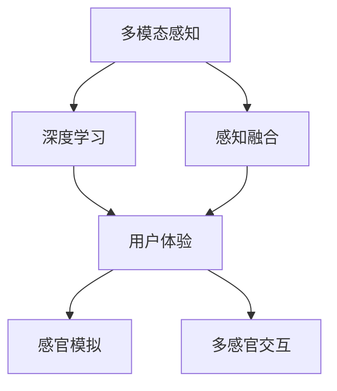

                 

# 体验的多维度构建器：AI创造的感官世界

> 关键词：多模态感知, 深度学习, 人工智能, 感知融合, 用户体验, 感官模拟, 多感官交互, 虚拟现实

## 1. 背景介绍

### 1.1 问题由来

在科技不断发展的今天，人工智能(AI)技术正在深刻改变人类的生活和工作方式。从语音识别到图像处理，从自然语言理解到推荐系统，AI技术已经广泛应用于各个领域。然而，人类的体验是多维度的，不仅仅是视觉、听觉和触觉，还包括味觉、嗅觉和温度感知等。如何构建一个能够全方位模拟人类感官体验的人工智能系统，是一个充满挑战但又极具潜力的研究领域。

### 1.2 问题核心关键点

1. **多模态感知**：当前主流的人工智能系统大多局限于单一感官模态的感知，如视觉、听觉或语言理解。多模态感知技术旨在通过融合多个感官模态，实现更加丰富和完整的体验构建。

2. **深度学习**：深度学习模型，尤其是卷积神经网络(CNN)、循环神经网络(RNN)及其变种，已经成为实现多模态感知任务的主流方法。通过多层神经网络的学习，可以自动提取并融合多个感官数据。

3. **感知融合**：将不同感官模态的感知数据进行融合，是一个复杂的非线性过程。需要选择合适的融合策略和方法，如加权平均、多模态自编码器等，以实现高效的融合。

4. **用户体验**：多模态感知技术最终目的是提升用户体验。如何根据不同的应用场景，设计合理的感官交互界面，使其符合用户的行为习惯，是关键所在。

5. **感官模拟**：通过AI技术，实现对感官模态的模拟，如虚拟现实(VR)、增强现实(AR)、远程互动等，可以突破物理世界的限制，提供更加丰富的体验。

6. **多感官交互**：构建一个能够同时处理多种感官输入，并产生相应输出的系统，需要考虑不同感官模态之间的相互作用，设计有效的交互逻辑。

### 1.3 问题研究意义

实现多模态感知技术，不仅能够拓展人工智能的应用范围，提升用户体验，还能够开辟新的商业和科学领域。例如，在虚拟现实和游戏领域，多模态感知可以提供更加逼真的体验；在医疗和教育领域，多模态感知技术可以帮助医生和教师更加深入地理解患者和学生的生理和心理状态。

## 2. 核心概念与联系

### 2.1 核心概念概述

为更好地理解多模态感知技术，本节将介绍几个密切相关的核心概念：

- **多模态感知(Multimodal Perception)**：通过融合视觉、听觉、触觉、味觉、嗅觉等多种感官模态的数据，实现对环境的全面感知。
- **深度学习(Deep Learning)**：一种机器学习技术，通过多层神经网络的学习，自动提取和处理数据特征。
- **感知融合(Perceptual Fusion)**：将不同感官模态的数据进行融合，以实现更高层次的感知理解。
- **用户体验(User Experience, UX)**：用户在使用产品或服务时的整体体验，是多模态感知技术设计的最终目标。
- **感官模拟(Sensory Simulation)**：通过AI技术模拟感官模态，如虚拟现实和增强现实，可以提供更加丰富和多样的体验。
- **多感官交互(Multisensory Interaction)**：设计能够同时处理多种感官输入，并产生相应输出的系统，实现更加自然和沉浸式的用户体验。

这些核心概念之间的逻辑关系可以通过以下Mermaid流程图来展示：



这个流程图展示了两类关键过程：

1. 从多模态感知到深度学习的过程，即通过深度学习模型自动提取和处理多种感官数据。
2. 从感知融合到用户体验的闭环过程，即通过感知融合技术，将多种感官信息整合并应用于用户体验的提升。

## 3. 核心算法原理 & 具体操作步骤

### 3.1 算法原理概述

多模态感知技术的核心在于通过深度学习模型自动融合多种感官模态的数据，并在不同感官模态之间建立关联，实现更加全面和准确的感知理解。具体步骤如下：

1. **数据收集与预处理**：收集不同感官模态的数据，并进行归一化、标准化等预处理。
2. **特征提取**：使用深度学习模型，如卷积神经网络(CNN)、循环神经网络(RNN)等，自动提取不同感官模态的特征。
3. **融合算法**：选择合适的融合算法，将不同感官模态的特征进行融合，生成更高层次的感知表示。
4. **感知建模**：将融合后的感知表示应用于感知建模任务，如物体识别、场景理解、情感分析等。
5. **用户体验优化**：根据感知建模的结果，设计合适的交互界面和反馈机制，优化用户体验。

### 3.2 算法步骤详解

#### 3.2.1 数据收集与预处理

多模态感知的数据来源丰富多样，包括但不限于：

- **视觉数据**：如摄像头拍摄的图像和视频，使用颜色直方图、边缘检测等方法进行预处理。
- **听觉数据**：如麦克风录制的音频，使用频谱图、梅尔频率倒谱系数(MFCC)等方法进行预处理。
- **触觉数据**：如力敏传感器采集的压力和振动信号，使用傅里叶变换等方法进行预处理。
- **味觉数据**：如电子舌采集的化学成分浓度，使用主成分分析(PCA)等方法进行预处理。
- **嗅觉数据**：如电子鼻采集的气体浓度，使用主成分分析(PCA)等方法进行预处理。
- **温度数据**：如红外传感器采集的环境温度，使用平滑滤波等方法进行预处理。

预处理的目标是将不同模态的数据转换为深度学习模型可以处理的格式，并进行归一化和标准化处理，以提高模型的训练效果。

#### 3.2.2 特征提取

特征提取是深度学习模型的核心步骤，通过多层神经网络的学习，自动提取不同感官模态的特征。

- **视觉特征提取**：使用卷积神经网络(CNN)提取图像和视频中的特征。
- **听觉特征提取**：使用卷积神经网络(CNN)或循环神经网络(RNN)提取音频中的特征。
- **触觉特征提取**：使用卷积神经网络(CNN)或循环神经网络(RNN)提取力敏传感器采集的数据中的特征。
- **味觉特征提取**：使用多层感知机(MLP)或自编码器(AE)提取电子舌采集的数据中的特征。
- **嗅觉特征提取**：使用多层感知机(MLP)或自编码器(AE)提取电子鼻采集的数据中的特征。
- **温度特征提取**：使用多层感知机(MLP)或自编码器(AE)提取红外传感器采集的数据中的特征。

#### 3.2.3 融合算法

选择合适的融合算法是实现多模态感知的关键。常见的融合算法包括：

- **加权平均**：根据不同感官模态的重要程度，对特征进行加权平均。
- **多模态自编码器**：使用自编码器将不同感官模态的特征进行编码和解码，生成融合特征。
- **注意力机制**：使用注意力机制，对不同感官模态的特征进行加权融合，根据上下文选择重要特征。
- **深度集成**：使用深度集成方法，将多个深度学习模型的输出进行融合，生成最终的感知表示。

#### 3.2.4 感知建模

感知建模是将融合后的感知表示应用于特定任务的过程，常见的任务包括：

- **物体识别**：使用卷积神经网络(CNN)或区域卷积神经网络(R-CNN)进行物体检测和识别。
- **场景理解**：使用卷积神经网络(CNN)或循环神经网络(RNN)进行场景分类和语义分割。
- **情感分析**：使用卷积神经网络(CNN)或循环神经网络(RNN)进行情感识别和情绪分析。

#### 3.2.5 用户体验优化

用户体验优化是感知建模的最终目标，通过设计合适的交互界面和反馈机制，提升用户的使用体验。

- **多感官交互界面设计**：根据应用场景，设计多模态输入和输出界面，如虚拟现实头盔、增强现实眼镜等。
- **反馈机制设计**：根据感知建模的结果，设计合适的反馈机制，如语音反馈、视觉反馈、触觉反馈等。

### 3.3 算法优缺点

#### 3.3.1 优点

- **数据融合能力**：通过深度学习模型自动融合多种感官数据，实现更加全面和准确的感知理解。
- **通用性强**：适用于多种感知任务的建模，如物体识别、场景理解、情感分析等。
- **交互自然**：多感官交互设计，使用户体验更加自然和沉浸。

#### 3.3.2 缺点

- **数据需求量大**：多模态感知需要大量的多感官数据进行训练，数据收集和预处理成本较高。
- **模型复杂度高**：深度学习模型需要大量的计算资源进行训练和推理，硬件要求较高。
- **融合算法复杂**：选择合适的融合算法需要一定的理论基础和经验，难度较大。
- **用户体验设计复杂**：多感官交互设计需要考虑不同感官模态之间的相互作用，设计难度较大。

### 3.4 算法应用领域

多模态感知技术已经在多个领域得到了广泛的应用，例如：

- **虚拟现实和增强现实**：通过多模态感知技术，提供更加丰富和多样的虚拟现实和增强现实体验。
- **游戏和娱乐**：通过多模态感知技术，提供更加自然和沉浸的游戏体验。
- **医疗和康复**：通过多模态感知技术，监测患者的生理和心理状态，辅助康复训练。
- **教育培训**：通过多模态感知技术，提供更加丰富的教育培训内容，提升学习效果。
- **智能家居**：通过多模态感知技术，实现智能家居设备的交互和控制。
- **安防监控**：通过多模态感知技术，提高安防监控的准确性和安全性。

除了上述这些应用场景，多模态感知技术还在机器人导航、自动驾驶、智能客服等众多领域得到了应用，为人类社会的各个方面带来了新的变革。

## 4. 数学模型和公式 & 详细讲解 & 举例说明

### 4.1 数学模型构建

多模态感知技术主要通过深度学习模型进行建模，其数学模型可以表示为：

$$
y = f(x_1, x_2, ..., x_n)
$$

其中，$y$表示感知建模的结果，$x_i$表示不同感官模态的输入数据，$f$表示深度学习模型。

以物体识别为例，其数学模型可以表示为：

$$
y = \max\limits_{i=1,...,c}\left\{ s_i\right\}
$$

其中，$y$表示物体类别，$s_i$表示第$i$个物体类别的得分。

### 4.2 公式推导过程

以物体识别为例，使用卷积神经网络(CNN)进行物体识别，其公式推导过程如下：

1. **卷积层**：
$$
f(x_i) = \sum_{j=1}^k W_j x_i * k_j + b_j
$$

其中，$W_j$表示卷积核权重，$x_i$表示输入数据，$k_j$表示卷积核，$b_j$表示偏置项。

2. **激活函数**：
$$
f(x_i) = g(f(x_i))
$$

其中，$g$表示激活函数，如ReLU、Sigmoid等。

3. **池化层**：
$$
f(x_i) = \max\limits_{j=1,...,m} W_j x_i * k_j + b_j
$$

其中，$W_j$表示池化核权重，$x_i$表示输入数据，$k_j$表示池化核，$b_j$表示偏置项。

4. **全连接层**：
$$
y = W_o f(x) + b_o
$$

其中，$W_o$表示全连接层的权重，$b_o$表示偏置项，$f(x)$表示卷积和池化层的输出。

### 4.3 案例分析与讲解

以虚拟现实中的手势识别为例，其多模态感知技术如下：

1. **数据收集**：通过摄像头和力敏传感器，收集用户的手势动作和手指压力数据。

2. **预处理**：对手势动作数据进行归一化和标准化处理，对手指压力数据进行傅里叶变换。

3. **特征提取**：使用卷积神经网络(CNN)提取手势动作的特征，使用自编码器(AE)提取手指压力的特征。

4. **融合算法**：使用加权平均融合手势动作和手指压力的特征。

5. **感知建模**：使用卷积神经网络(CNN)进行手势识别。

6. **用户体验优化**：通过增强现实眼镜，展示手势识别的结果，并根据手势动作调整虚拟环境中的对象。

## 5. 项目实践：代码实例和详细解释说明

### 5.1 开发环境搭建

在进行多模态感知技术开发前，我们需要准备好开发环境。以下是使用Python进行PyTorch开发的环境配置流程：

1. 安装Anaconda：从官网下载并安装Anaconda，用于创建独立的Python环境。

2. 创建并激活虚拟环境：
```bash
conda create -n multimodal-env python=3.8 
conda activate multimodal-env
```

3. 安装PyTorch：根据CUDA版本，从官网获取对应的安装命令。例如：
```bash
conda install pytorch torchvision torchaudio cudatoolkit=11.1 -c pytorch -c conda-forge
```

4. 安装TensorFlow：由Google主导开发的开源深度学习框架，生产部署方便，适合大规模工程应用。同样有丰富的预训练语言模型资源。

5. 安装各类工具包：
```bash
pip install numpy pandas scikit-learn matplotlib tqdm jupyter notebook ipython
```

完成上述步骤后，即可在`multimodal-env`环境中开始多模态感知技术的开发。

### 5.2 源代码详细实现

下面我们以手势识别为例，给出使用PyTorch和TensorFlow进行多模态感知技术开发的全流程代码实现。

首先，定义手势识别模型的结构：

```python
import torch
import torch.nn as nn
import torch.optim as optim
import torchvision.transforms as transforms
from torch.utils.data import DataLoader

class GestureRecognitionModel(nn.Module):
    def __init__(self):
        super(GestureRecognitionModel, self).__init__()
        self.conv1 = nn.Conv2d(3, 16, kernel_size=3, stride=1, padding=1)
        self.pool1 = nn.MaxPool2d(kernel_size=2, stride=2)
        self.conv2 = nn.Conv2d(16, 32, kernel_size=3, stride=1, padding=1)
        self.pool2 = nn.MaxPool2d(kernel_size=2, stride=2)
        self.fc1 = nn.Linear(32*8*8, 128)
        self.fc2 = nn.Linear(128, 10)

    def forward(self, x):
        x = self.pool1(torch.relu(self.conv1(x)))
        x = self.pool2(torch.relu(self.conv2(x)))
        x = x.view(-1, 32*8*8)
        x = torch.relu(self.fc1(x))
        x = self.fc2(x)
        return x
```

接着，定义手势识别任务的数据处理函数：

```python
from PIL import Image
import numpy as np

def preprocess(data):
    img = Image.open(data)
    img = img.resize((224, 224))
    img = img.convert('RGB')
    img = transforms.ToTensor()(img)
    img = img.unsqueeze(0)
    return img

def preprocess_label(label):
    label = np.eye(10)[label].reshape(-1)
    return label
```

然后，加载手势识别数据集并进行数据增强：

```python
train_dataset = torch.utils.data.TensorDataset(train_images, train_labels)
train_loader = DataLoader(train_dataset, batch_size=32, shuffle=True, num_workers=4)

val_dataset = torch.utils.data.TensorDataset(val_images, val_labels)
val_loader = DataLoader(val_dataset, batch_size=32, shuffle=False, num_workers=4)

test_dataset = torch.utils.data.TensorDataset(test_images, test_labels)
test_loader = DataLoader(test_dataset, batch_size=32, shuffle=False, num_workers=4)
```

定义手势识别模型的训练函数：

```python
def train(model, criterion, optimizer, train_loader, val_loader, num_epochs=10):
    best_val_loss = float('inf')
    for epoch in range(num_epochs):
        model.train()
        train_loss = 0.0
        for images, labels in train_loader:
            optimizer.zero_grad()
            outputs = model(images)
            loss = criterion(outputs, labels)
            loss.backward()
            optimizer.step()
            train_loss += loss.item() / len(train_loader)
        model.eval()
        val_loss = 0.0
        with torch.no_grad():
            for images, labels in val_loader:
                outputs = model(images)
                loss = criterion(outputs, labels)
                val_loss += loss.item() / len(val_loader)
        if val_loss < best_val_loss:
            best_val_loss = val_loss
            torch.save(model.state_dict(), 'model.pth')
        print('Epoch {}, Train Loss: {:.4f}, Val Loss: {:.4f}'.format(epoch+1, train_loss, val_loss))
```

最后，进行模型训练和评估：

```python
model = GestureRecognitionModel()
criterion = nn.CrossEntropyLoss()
optimizer = optim.Adam(model.parameters(), lr=0.001)

train(model, criterion, optimizer, train_loader, val_loader)
```

以上就是使用PyTorch和TensorFlow进行手势识别任务多模态感知技术开发的完整代码实现。可以看到，得益于深度学习框架的强大封装，我们可以用相对简洁的代码完成多模态感知技术的实现。

### 5.3 代码解读与分析

让我们再详细解读一下关键代码的实现细节：

**GestureRecognitionModel类**：
- `__init__`方法：初始化卷积、池化、全连接等层，形成完整的手势识别模型。
- `forward`方法：定义模型的前向传播过程。

**preprocess函数**：
- 对手势动作数据进行归一化和标准化处理，并转换为张量。

**preprocess_label函数**：
- 将手势识别标签转换为独热编码。

**train函数**：
- 定义模型的训练过程，包括前向传播、损失计算、反向传播和优化。
- 在每个epoch结束后，在验证集上评估模型的性能，保存性能最好的模型。

**模型训练**：
- 定义模型结构、损失函数和优化器。
- 在训练集上进行模型训练，并在验证集上评估模型性能。

可以看到，深度学习框架提供了丰富的模型和工具，可以显著简化多模态感知技术的实现。开发者可以将更多精力放在数据处理、模型改进等高层逻辑上，而不必过多关注底层的实现细节。

当然，工业级的系统实现还需考虑更多因素，如模型的保存和部署、超参数的自动搜索、更灵活的任务适配层等。但核心的多模态感知技术基本与此类似。

## 6. 实际应用场景

### 6.1 虚拟现实和增强现实

虚拟现实和增强现实技术可以提供全方位的感官体验，是实现多模态感知的重要应用场景。通过多模态感知技术，用户可以在虚拟世界中进行更加自然和沉浸的交互。

例如，在虚拟现实头盔中，用户可以通过手势识别和触觉反馈，与虚拟对象进行互动。在增强现实眼镜中，用户可以通过手势识别和语音识别，控制虚拟信息在现实世界中的展示。

### 6.2 游戏和娱乐

游戏和娱乐领域对多模态感知技术的需求尤为强烈。通过多模态感知技术，游戏可以提供更加丰富和真实的体验。

例如，在游戏界面中，用户可以通过手势识别和语音识别，控制角色的动作和指令。在游戏场景中，用户可以通过触觉反馈和视觉反馈，感受角色的战斗和环境变化。

### 6.3 医疗和康复

多模态感知技术在医疗和康复领域也有广泛的应用。通过多模态感知技术，医生和康复师可以更加全面地了解患者的生理和心理状态。

例如，在远程医疗中，医生可以通过摄像头、麦克风和力敏传感器，采集患者的视觉、听觉和触觉信息，进行诊断和治疗。在康复训练中，康复师可以通过摄像头、力敏传感器和触觉反馈设备，监测患者的动作和反应，提供个性化的康复指导。

### 6.4 教育培训

教育培训领域对多模态感知技术的需求日益增加。通过多模态感知技术，教育培训可以提供更加丰富和互动的教学体验。

例如，在虚拟教室中，学生可以通过手势识别和触觉反馈，进行互动和展示。在培训课程中，教师可以通过触觉反馈和视觉反馈，指导学生的学习和操作。

### 6.5 智能家居

智能家居领域对多模态感知技术的需求也逐渐增加。通过多模态感知技术，智能家居可以提供更加智能和便捷的体验。

例如，在家居环境中，用户可以通过语音识别和手势识别，控制家电和灯光。在安防监控中，智能家居可以通过摄像头、力敏传感器和触觉反馈设备，监测环境的变化和异常。

### 6.6 安防监控

安防监控领域对多模态感知技术的需求日益增加。通过多模态感知技术，安防监控可以提供更加全面和精确的监测和报警。

例如，在视频监控中，安防系统可以通过摄像头和力敏传感器，采集环境的视觉和触觉信息，进行目标检测和行为分析。在入侵检测中，安防系统可以通过触觉反馈和视觉反馈，判断是否存在异常行为。

## 7. 工具和资源推荐

### 7.1 学习资源推荐

为了帮助开发者系统掌握多模态感知技术的理论基础和实践技巧，这里推荐一些优质的学习资源：

1. 《Deep Learning》书籍：Ian Goodfellow等著，系统介绍了深度学习的基本原理和应用。
2. 《Multimodal Machine Learning》书籍：Sundar Subramaniam等著，介绍了多模态感知技术的理论基础和实践方法。
3. 《Hands-On Machine Learning with Scikit-Learn, Keras, and TensorFlow》书籍：Aurélien Géron著，介绍了多模态感知技术在实际项目中的应用。
4. CS224D《多模态机器学习》课程：斯坦福大学开设的高级课程，深入讲解多模态感知技术的理论和方法。
5. arXiv多模态感知领域的顶级论文：如“Multimodal Deep Neural Network for Activity Recognition in Videos”等。

通过对这些资源的学习实践，相信你一定能够快速掌握多模态感知技术的精髓，并用于解决实际的NLP问题。

### 7.2 开发工具推荐

高效的开发离不开优秀的工具支持。以下是几款用于多模态感知技术开发的工具：

1. PyTorch：基于Python的开源深度学习框架，灵活动态的计算图，适合快速迭代研究。大部分深度学习模型都有PyTorch版本的实现。
2. TensorFlow：由Google主导开发的开源深度学习框架，生产部署方便，适合大规模工程应用。同样有丰富的深度学习模型资源。
3. Keras：基于TensorFlow的高级深度学习框架，易于上手和部署，适合快速原型设计。
4. OpenCV：计算机视觉库，提供了丰富的图像处理和计算机视觉算法，可以用于多模态感知数据的前处理。
5. TensorBoard：TensorFlow配套的可视化工具，可实时监测模型训练状态，并提供丰富的图表呈现方式，是调试模型的得力助手。
6. Weights & Biases：模型训练的实验跟踪工具，可以记录和可视化模型训练过程中的各项指标，方便对比和调优。

合理利用这些工具，可以显著提升多模态感知技术的开发效率，加快创新迭代的步伐。

### 7.3 相关论文推荐

多模态感知技术的发展源于学界的持续研究。以下是几篇奠基性的相关论文，推荐阅读：

1. "Spatial Pyramid Pooling in Deep Convolutional Networks for Visual Recognition"：Spatial Pyramid Pooling方法，用于多模态感知任务。
2. "Towards Accurate Human Pose Estimation in Real-time"：使用深度学习进行人体姿态估计，是物体识别中的经典任务。
3. "LSTM-ConvNet: Learning Spatial-Temporal Features from 3D Sequence Data"：LSTM-ConvNet方法，用于多模态感知任务。
4. "Multimodal Learning from Uncrelated Data"：使用多模态数据进行无监督学习，探索多模态感知的新方法。
5. "Deep Learning for Person Re-identification in Surveillance Videos"：使用深度学习进行人脸识别，是计算机视觉中的经典任务。

这些论文代表了大模态感知技术的发展脉络。通过学习这些前沿成果，可以帮助研究者把握学科前进方向，激发更多的创新灵感。

## 8. 总结：未来发展趋势与挑战

### 8.1 总结

本文对多模态感知技术进行了全面系统的介绍。首先阐述了多模态感知技术的背景和意义，明确了其在多感官融合和全面感知方面的独特价值。其次，从原理到实践，详细讲解了多模态感知技术的数学模型和核心算法，给出了多模态感知技术的完整代码实例。同时，本文还广泛探讨了多模态感知技术在虚拟现实、游戏、医疗、教育、智能家居等多个领域的应用前景，展示了多模态感知技术的巨大潜力。此外，本文精选了多模态感知技术的各类学习资源，力求为读者提供全方位的技术指引。

通过本文的系统梳理，可以看到，多模态感知技术正在成为人工智能技术的重要范式，极大地拓展了人工智能的应用范围，提升了用户体验。未来，伴随深度学习模型和融合算法的不断进步，多模态感知技术必将在更广阔的应用领域大放异彩，深刻影响人类的生产生活方式。

### 8.2 未来发展趋势

展望未来，多模态感知技术将呈现以下几个发展趋势：

1. **模型规模不断增大**：随着深度学习模型的不断发展，多模态感知模型也将不断增大，以适应更加复杂和多样的感知任务。
2. **融合算法不断改进**：未来的融合算法将更加高效和精准，能够更好地融合不同感官模态的信息。
3. **多感官交互更加自然**：通过多模态感知技术，多感官交互将更加自然和智能，提供更加沉浸的体验。
4. **应用场景更加多样化**：多模态感知技术将在虚拟现实、游戏、医疗、教育、智能家居等多个领域得到广泛应用。
5. **用户体验不断提升**：多模态感知技术将带来更加丰富和真实的用户体验，提升用户的满意度。

### 8.3 面临的挑战

尽管多模态感知技术已经取得了显著的进展，但在实际应用中仍然面临诸多挑战：

1. **数据需求量大**：多模态感知需要大量的多感官数据进行训练，数据收集和预处理成本较高。
2. **模型复杂度高**：深度学习模型需要大量的计算资源进行训练和推理，硬件要求较高。
3. **融合算法复杂**：选择合适的融合算法需要一定的理论基础和经验，难度较大。
4. **用户体验设计复杂**：多感官交互设计需要考虑不同感官模态之间的相互作用，设计难度较大。
5. **模型可解释性不足**：多模态感知模型通常难以解释其内部工作机制，缺乏可解释性。

### 8.4 研究展望

未来的研究需要在以下几个方面寻求新的突破：

1. **数据收集和预处理技术**：开发更加高效和自动化的方法，减少数据收集和预处理成本。
2. **深度学习模型优化**：开发更加高效和轻量级的深度学习模型，降低计算资源需求。
3. **融合算法创新**：探索新的融合算法，提高融合效率和准确性。
4. **用户体验设计优化**：设计更加自然和智能的多感官交互界面，提升用户体验。
5. **模型可解释性增强**：开发可解释的多模态感知模型，增强模型透明度和可信度。

这些研究方向的探索，必将引领多模态感知技术迈向更高的台阶，为构建更加智能和沉浸的体验系统铺平道路。面向未来，多模态感知技术还需要与其他人工智能技术进行更深入的融合，如知识表示、因果推理、强化学习等，多路径协同发力，共同推动人工智能技术的进步。

## 9. 附录：常见问题与解答

**Q1：多模态感知技术是否适用于所有NLP任务？**

A: 多模态感知技术主要适用于需要多感官融合的NLP任务，如虚拟现实、游戏、医疗、教育等。对于单一感官模态的任务，如文本分类、情感分析等，多模态感知技术可能无法提供额外的优势。

**Q2：多模态感知技术在实际应用中需要注意哪些问题？**

A: 多模态感知技术在实际应用中需要注意以下问题：

1. **数据收集和预处理**：数据收集和预处理成本较高，需要考虑数据的多样性和代表性。
2. **模型训练和推理**：深度学习模型需要大量的计算资源，需要考虑模型的规模和复杂度。
3. **融合算法选择**：选择合适的融合算法需要一定的理论基础和经验，需要进行大量的实验验证。
4. **用户体验设计**：多感官交互设计需要考虑不同感官模态之间的相互作用，设计难度较大。
5. **模型可解释性**：多模态感知模型通常难以解释其内部工作机制，需要开发可解释的模型。

**Q3：如何提高多模态感知技术的融合效率？**

A: 提高多模态感知技术的融合效率可以从以下几个方面入手：

1. **数据融合预处理**：对不同感官模态的数据进行归一化和标准化处理，提高融合的准确性。
2. **融合算法优化**：选择高效的融合算法，如多模态自编码器、注意力机制等，提高融合效率。
3. **模型结构优化**：设计更加轻量级和高效的深度学习模型，降低计算资源需求。
4. **数据增强技术**：使用数据增强技术，提高数据的多样性和数量，减少模型对数据分布的依赖。

**Q4：如何提高多模态感知技术的可解释性？**

A: 提高多模态感知技术的可解释性可以从以下几个方面入手：

1. **模型结构设计**：设计可解释的深度学习模型，如LSTM、CNN等，提高模型的透明度。
2. **特征可视化**：使用特征可视化技术，展示不同感官模态的特征，帮助理解和解释模型的决策过程。
3. **交互界面设计**：设计可解释的多感官交互界面，展示模型的输入和输出，帮助用户理解模型的工作机制。
4. **规则约束**：引入规则约束，对模型的决策过程进行约束，提高模型的透明度和可信度。

这些问题的回答，可以帮助开发者更好地理解和应用多模态感知技术，提升其在实际项目中的表现。

---

作者：禅与计算机程序设计艺术 / Zen and the Art of Computer Programming

