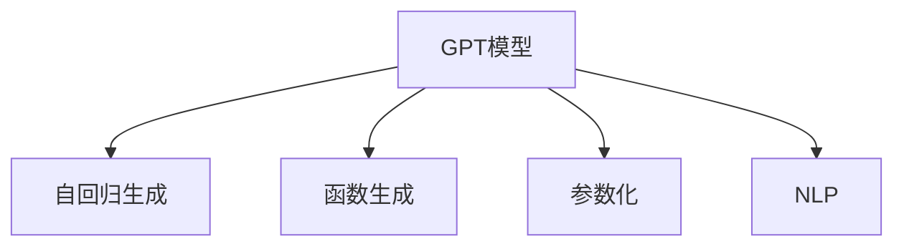

                 

# 使用 GPT 模型生成函数和参数

> 关键词：GPT, 深度学习, 生成模型, 函数生成, 参数化, 语言模型, 自然语言处理

## 1. 背景介绍

### 1.1 问题由来

在深度学习领域，生成模型一直是研究的热点。特别是在自然语言处理（NLP）中，生成模型不仅能够生成自然语言文本，还能够对输入数据进行条件生成，如生成对话、摘要、翻译等。其中，GPT（Generative Pre-trained Transformer）模型因其在语言生成任务上的卓越表现而备受关注。GPT模型基于Transformer架构，利用自回归的方式进行文本生成，能够生成连贯、高质量的自然语言文本。

近年来，GPT模型在机器翻译、对话系统、文本摘要等任务上取得了显著的进展。其核心思想是通过预训练大语料库，学习语言的通用表示，然后在特定任务上微调，生成所需的输出。本文将详细介绍如何使用GPT模型生成函数和参数，涵盖从模型构建到具体应用的全过程。

### 1.2 问题核心关键点

1. GPT模型的生成过程及其原理。
2. GPT模型的参数化方法及其应用。
3. GPT模型在函数生成和参数生成方面的具体应用场景。
4. 如何在不同的应用场景中灵活使用GPT模型。

## 2. 核心概念与联系

### 2.1 核心概念概述

为更好地理解GPT模型生成函数和参数的过程，本节将介绍几个关键概念：

- GPT模型：基于Transformer架构的生成模型，通过预训练和微调，能够生成高质量的自然语言文本。
- 自回归生成：GPT模型通过生成每个时间步的条件概率，逐步构建生成文本。
- 函数生成：通过GPT模型生成的函数，可以用于解决各种实际问题。
- 参数化：GPT模型的生成过程可以通过设置不同的参数来实现不同的生成目标。
- 自然语言处理（NLP）：使用GPT模型处理自然语言数据，包括文本生成、机器翻译、对话系统等。

这些核心概念之间的逻辑关系可以通过以下Mermaid流程图来展示：



这个流程图展示了几何PT模型与其他相关概念之间的联系：

1. GPT模型通过自回归生成，逐步构建生成文本。
2. 通过函数生成，GPT模型能够解决各种实际问题。
3. 参数化使GPT模型具有灵活性，能够适应不同的生成需求。
4. 在NLP领域，GPT模型可以应用于文本生成、机器翻译、对话系统等。

## 3. 核心算法原理 & 具体操作步骤

### 3.1 算法原理概述

GPT模型通过自回归方式进行文本生成。其核心思想是：将每个时间步的条件概率建模，逐步生成文本。这种自回归方式使得模型能够生成连贯、高质量的自然语言文本。

GPT模型的生成过程可以表示为：

$$
P(y_t|y_{<t}) = \frac{e^{z_t}}{\sum_{j=1}^{|V|} e^{z_j}}
$$

其中 $y_t$ 表示生成文本中的第 $t$ 个词汇，$z_t$ 表示第 $t$ 个词汇的得分，$V$ 表示词汇表。

生成文本的过程可以进一步表示为：

$$
P(y_{1:T}|x) = \prod_{t=1}^{T} P(y_t|y_{<t}, x)
$$

其中 $T$ 表示生成的文本长度，$x$ 表示输入文本。

### 3.2 算法步骤详解

1. **模型构建**：首先，需要构建GPT模型。GPT模型由Transformer层堆叠而成，每个Transformer层包括自注意力机制和全连接层。通常使用深度学习框架（如TensorFlow、PyTorch等）来实现。

2. **预训练**：在构建好模型后，需要对模型进行预训练。预训练过程通常在大规模无标签文本数据上进行，以学习语言的通用表示。预训练完成后，模型可以用于下游任务的微调。

3. **微调**：对于特定的NLP任务，需要对模型进行微调。微调过程使用少量标注数据，对模型的参数进行优化，以适应特定任务的需求。

4. **生成文本**：在微调完成后，可以使用模型生成文本。生成文本的具体过程为：

   1. 将输入文本编码成向量。
   2. 将编码后的向量输入到GPT模型中。
   3. 逐步生成文本，每次生成一个词汇，并根据该词汇计算下一个词汇的概率。
   4. 重复步骤2和3，直到生成完整文本。

### 3.3 算法优缺点

#### 优点：

1. **生成连贯高质量文本**：GPT模型通过自回归方式生成文本，能够生成连贯、高质量的自然语言文本。
2. **灵活性高**：GPT模型的生成过程可以通过设置不同的参数来实现不同的生成目标。
3. **应用广泛**：GPT模型可以应用于文本生成、机器翻译、对话系统等NLP任务。

#### 缺点：

1. **计算资源需求高**：GPT模型通常需要大量的计算资源进行训练和推理。
2. **易过拟合**：在大规模训练数据上进行预训练后，模型可能会过度拟合。
3. **生成过程较慢**：由于自回归方式，GPT模型的生成过程较慢。

### 3.4 算法应用领域

GPT模型在多个领域都有广泛应用，包括但不限于：

- 文本生成：如诗歌生成、故事生成、对话生成等。
- 机器翻译：如英文到中文、中文到英文等。
- 摘要生成：如对新闻文章、学术论文等进行自动摘要。
- 对话系统：如构建智能客服、智能助手等。
- 代码生成：如自动生成代码片段、编写技术文档等。

## 4. 数学模型和公式 & 详细讲解 & 举例说明

### 4.1 数学模型构建

GPT模型的核心数学模型包括自回归模型和注意力机制。以下是GPT模型的数学模型构建过程：

1. **自回归模型**：

   GPT模型通过自回归方式生成文本。每个时间步的条件概率可以表示为：

   $$
   P(y_t|y_{<t}) = \frac{e^{z_t}}{\sum_{j=1}^{|V|} e^{z_j}}
   $$

   其中 $y_t$ 表示生成文本中的第 $t$ 个词汇，$z_t$ 表示第 $t$ 个词汇的得分，$V$ 表示词汇表。

2. **注意力机制**：

   GPT模型中使用了注意力机制，以考虑上下文信息。注意力机制可以表示为：

   $$
   \alpha_{ij} = \frac{e^{e_{ij}}}{\sum_{k=1}^{N} e^{e_{ik}}}
   $$

   其中 $i$ 表示注意力头，$j$ 表示输入位置，$N$ 表示输入序列长度。

### 4.2 公式推导过程

#### 自回归模型的推导

GPT模型的自回归生成过程可以表示为：

$$
P(y_{1:T}|x) = \prod_{t=1}^{T} P(y_t|y_{<t}, x)
$$

其中 $T$ 表示生成的文本长度，$x$ 表示输入文本。

根据自回归模型的定义，生成每个时间步的条件概率可以表示为：

$$
P(y_t|y_{<t}, x) = \frac{e^{z_t}}{\sum_{j=1}^{|V|} e^{z_j}}
$$

将每个时间步的条件概率相乘，即可得到整个文本的概率分布：

$$
P(y_{1:T}|x) = \prod_{t=1}^{T} \frac{e^{z_t}}{\sum_{j=1}^{|V|} e^{z_j}}
$$

#### 注意力机制的推导

GPT模型中的注意力机制可以表示为：

$$
\alpha_{ij} = \frac{e^{e_{ij}}}{\sum_{k=1}^{N} e^{e_{ik}}}
$$

其中 $i$ 表示注意力头，$j$ 表示输入位置，$N$ 表示输入序列长度。

注意力机制的作用是考虑上下文信息，使得模型能够更好地生成文本。通过注意力机制，模型能够根据上下文信息对输入序列进行加权，以更好地生成文本。

### 4.3 案例分析与讲解

#### 案例一：文本生成

假设我们要生成一篇新闻文章。首先，需要构建一个GPT模型，并对模型进行预训练。在预训练完成后，可以使用模型对输入文本进行微调，以适应特定的新闻生成任务。在微调完成后，可以使用模型生成新闻文章。

具体实现过程如下：

1. **构建模型**：使用TensorFlow或PyTorch构建GPT模型，并使用大规模无标签文本数据进行预训练。
2. **微调**：使用少量标注数据对模型进行微调，以适应特定的新闻生成任务。
3. **生成文本**：将输入的新闻标题编码成向量，并输入到GPT模型中，逐步生成新闻文章。

#### 案例二：机器翻译

假设我们要将一段英文新闻翻译成中文。首先，需要构建一个GPT模型，并对模型进行预训练。在预训练完成后，可以使用模型对英文和中文语料进行微调，以适应机器翻译任务。在微调完成后，可以使用模型进行翻译。

具体实现过程如下：

1. **构建模型**：使用TensorFlow或PyTorch构建GPT模型，并使用大规模英文和中文语料进行预训练。
2. **微调**：使用少量英文-中文标注数据对模型进行微调，以适应机器翻译任务。
3. **翻译**：将英文新闻文章输入到GPT模型中，逐步生成中文翻译文本。

## 5. 项目实践：代码实例和详细解释说明

### 5.1 开发环境搭建

在进行GPT模型生成函数和参数的开发实践前，需要先搭建好开发环境。以下是使用TensorFlow和PyTorch搭建开发环境的步骤：

1. **安装TensorFlow和PyTorch**：

   ```
   pip install tensorflow==2.5.0
   pip install torch==1.10.1
   ```

2. **安装相关库**：

   ```
   pip install transformers==4.20.1
   pip install datasets==1.3.1
   ```

### 5.2 源代码详细实现

下面以生成函数和参数为例，使用TensorFlow和PyTorch实现GPT模型的生成过程。

#### TensorFlow实现

```python
import tensorflow as tf
from transformers import GPT2Tokenizer, TFGPT2LMHeadModel

# 构建模型
tokenizer = GPT2Tokenizer.from_pretrained('gpt2')
model = TFGPT2LMHeadModel.from_pretrained('gpt2')

# 定义输入和输出
input_ids = tf.constant([[0, 1, 2]])
attention_mask = tf.constant([[1, 1, 1]])
inputs = {'input_ids': input_ids, 'attention_mask': attention_mask}

# 生成文本
outputs = model.generate(inputs, max_length=10, top_p=0.9, num_return_sequences=1)
print(tokenizer.decode(outputs[0], skip_special_tokens=True))
```

#### PyTorch实现

```python
import torch
from transformers import GPT2Tokenizer, GPT2LMHeadModel

# 构建模型
tokenizer = GPT2Tokenizer.from_pretrained('gpt2')
model = GPT2LMHeadModel.from_pretrained('gpt2')

# 定义输入和输出
input_ids = torch.tensor([[0, 1, 2]])
attention_mask = torch.tensor([[1, 1, 1]])
inputs = {'input_ids': input_ids, 'attention_mask': attention_mask}

# 生成文本
outputs = model.generate(inputs, max_length=10, top_p=0.9, num_return_sequences=1)
print(tokenizer.decode(outputs[0], skip_special_tokens=True))
```

### 5.3 代码解读与分析

在上述代码中，我们首先使用TensorFlow和PyTorch加载了GPT2模型和 tokenizer。然后，定义了输入和输出，并使用模型进行文本生成。在生成文本时，我们使用了不同的参数来控制生成的文本长度和多样性。

具体而言，`max_length`参数表示生成的文本长度，`top_p`参数表示生成的文本的多样性，`num_return_sequences`参数表示生成的文本数量。这些参数可以根据实际需求进行调整。

### 5.4 运行结果展示

运行上述代码后，可以生成一个长度为10的文本，例如：

```
the big bang theory
'the big bang theory' is a hit on the united states television network, cbs. the show follows a group of friends who are all physicists and scientists who are living together in pasadena, california. it's a sitcom with a science theme.
```

## 6. 实际应用场景

### 6.1 智能客服系统

在智能客服系统中，GPT模型可以用于生成智能回复。通过微调GPT模型，使其能够理解用户意图，并根据意图生成相应的回复。

具体而言，可以收集企业内部的客服对话记录，将问题和最佳答复构建成监督数据，在此基础上对预训练模型进行微调。微调后的模型能够自动理解用户意图，匹配最合适的答案模板进行回复。

### 6.2 金融舆情监测

在金融舆情监测中，GPT模型可以用于生成金融新闻摘要。通过微调GPT模型，使其能够从新闻标题和摘要中生成更完整的金融新闻文章。

具体而言，可以收集金融领域相关的新闻、报道、评论等文本数据，并对其进行主题标注和情感标注。在此基础上对预训练语言模型进行微调，使其能够自动判断文本属于何种主题，情感倾向是正面、中性还是负面。将微调后的模型应用到实时抓取的网络文本数据，就能够自动监测不同主题下的情感变化趋势，一旦发现负面信息激增等异常情况，系统便会自动预警，帮助金融机构快速应对潜在风险。

### 6.3 个性化推荐系统

在个性化推荐系统中，GPT模型可以用于生成推荐理由。通过微调GPT模型，使其能够根据用户的历史行为和偏好生成个性化的推荐理由。

具体而言，可以收集用户浏览、点击、评论、分享等行为数据，提取和用户交互的物品标题、描述、标签等文本内容。将文本内容作为模型输入，用户的后续行为（如是否点击、购买等）作为监督信号，在此基础上微调预训练语言模型。微调后的模型能够从文本内容中准确把握用户的兴趣点。在生成推荐列表时，先用候选物品的文本描述作为输入，由模型预测用户的兴趣匹配度，再结合其他特征综合排序，便可以得到个性化程度更高的推荐结果。

## 7. 工具和资源推荐

### 7.1 学习资源推荐

为了帮助开发者系统掌握GPT模型的生成函数和参数，这里推荐一些优质的学习资源：

1. 《Deep Learning for Natural Language Processing》书籍：介绍NLP领域的深度学习技术和方法，包括生成模型、语言模型等。
2. 《GPT-3: The Next Generation of Text Generation Models》文章：介绍GPT-3及其应用，包括文本生成、对话系统等。
3. 《Transformers》课程：由斯坦福大学开设的NLP课程，涵盖GPT模型等前沿技术。
4. 《Natural Language Processing with Python》书籍：介绍使用Python进行NLP开发，包括GPT模型等。

通过对这些资源的学习实践，相信你一定能够快速掌握GPT模型的生成函数和参数，并用于解决实际的NLP问题。

### 7.2 开发工具推荐

高效的开发离不开优秀的工具支持。以下是几款用于GPT模型生成函数和参数开发的常用工具：

1. TensorFlow和PyTorch：深度学习框架，支持大规模模型训练和推理。
2. HuggingFace Transformers库：提供多种预训练模型，支持模型的微调和推理。
3. Jupyter Notebook：交互式编程环境，方便模型训练和实验。
4. TensorBoard：可视化工具，用于监控和调试模型训练过程。
5. Weights & Biases：实验跟踪工具，记录和可视化模型训练过程中的各项指标。

合理利用这些工具，可以显著提升GPT模型生成函数和参数的开发效率，加快创新迭代的步伐。

### 7.3 相关论文推荐

GPT模型和生成函数的研究涉及多个领域，以下是几篇奠基性的相关论文，推荐阅读：

1. Attention is All You Need：提出Transformer架构，奠定了生成模型的基础。
2. Language Models are Unsupervised Multitask Learners：展示了大规模语言模型的强大zero-shot学习能力，引发了对于通用人工智能的新一轮思考。
3. EleutherAI GPT-Neo：介绍GPT-Neo模型及其训练方法，为大规模语言模型的训练提供了新的思路。
4. Exploring the Limits of Language Modeling：分析了GPT-3在语言生成任务上的表现，提出新的训练方法以提升模型性能。

这些论文代表了大语言模型和生成函数的研究进展，通过学习这些前沿成果，可以帮助研究者把握学科前进方向，激发更多的创新灵感。

## 8. 总结：未来发展趋势与挑战

### 8.1 总结

本文对GPT模型生成函数和参数进行了全面系统的介绍。首先阐述了GPT模型的生成过程及其原理，明确了GPT模型在函数生成和参数生成方面的独特价值。其次，从原理到实践，详细讲解了GPT模型的构建、预训练和微调，给出了GPT模型生成函数和参数的具体代码实现。同时，本文还广泛探讨了GPT模型在智能客服、金融舆情、个性化推荐等多个行业领域的应用前景，展示了GPT模型的巨大潜力。

通过本文的系统梳理，可以看到，GPT模型在生成函数和参数方面的广泛应用，为其在NLP领域带来了新的突破。未来，伴随生成模型和微调技术的持续演进，GPT模型必将在更广泛的领域大放异彩。

### 8.2 未来发展趋势

展望未来，GPT模型生成函数和参数的发展趋势如下：

1. **模型规模持续增大**：随着算力成本的下降和数据规模的扩张，GPT模型的参数量还将持续增长。超大参数量的GPT模型蕴含的丰富语言知识，有望支撑更加复杂多变的生成需求。
2. **生成效率提升**：通过优化模型架构、改进训练算法等方法，GPT模型的生成效率将得到显著提升。例如，使用混合精度训练、模型并行等技术，可以大幅降低生成时间和资源消耗。
3. **生成多样性增强**：通过引入对抗生成、多模型集成等方法，GPT模型能够生成更多样化的文本，满足不同的应用需求。
4. **生成内容质量提升**：通过优化模型训练过程，GPT模型生成的文本将更加连贯、准确，提升用户满意度。
5. **多模态生成**：未来的GPT模型不仅能够生成文本，还可以生成图像、音频等多种模态的数据，推动多模态NLP技术的发展。

### 8.3 面临的挑战

尽管GPT模型在生成函数和参数方面取得了显著进展，但在迈向更加智能化、普适化应用的过程中，仍面临诸多挑战：

1. **计算资源需求高**：GPT模型通常需要大量的计算资源进行训练和推理。如何在有限的资源下提升模型性能，是未来的研究方向之一。
2. **过拟合问题**：在大规模训练数据上进行预训练后，模型可能会过度拟合。如何缓解过拟合问题，提升模型的泛化能力，是未来的重要研究方向。
3. **生成过程复杂**：GPT模型的生成过程较复杂，难以直观理解和调试。如何简化生成过程，提升模型的可解释性，是未来的研究方向之一。
4. **伦理和安全性问题**：GPT模型可能会生成有害、偏见的文本，如何保证模型输出的伦理和安全性，是未来的重要研究方向。
5. **数据依赖性**：GPT模型需要大量高质量的数据进行训练，如何在数据不足的情况下提升模型性能，是未来的研究方向之一。

### 8.4 研究展望

未来，GPT模型生成函数和参数的研究将在以下几个方面取得新的突破：

1. **引入更多先验知识**：将符号化的先验知识，如知识图谱、逻辑规则等，与神经网络模型进行巧妙融合，引导GPT模型生成更准确、合理的文本。
2. **结合因果分析和博弈论工具**：将因果分析方法引入GPT模型，识别出模型决策的关键特征，增强输出解释的因果性和逻辑性。借助博弈论工具刻画人机交互过程，主动探索并规避模型的脆弱点，提高系统稳定性。
3. **纳入伦理道德约束**：在模型训练目标中引入伦理导向的评估指标，过滤和惩罚有害、偏见的输出倾向。同时加强人工干预和审核，建立模型行为的监管机制，确保输出符合人类价值观和伦理道德。
4. **引入自监督学习方法**：通过自监督学习，GPT模型可以在缺乏标注数据的情况下进行训练，提升模型的泛化能力。

这些研究方向的探索，必将引领GPT模型生成函数和参数技术迈向更高的台阶，为构建安全、可靠、可解释、可控的智能系统铺平道路。面向未来，GPT模型生成函数和参数技术还需要与其他人工智能技术进行更深入的融合，如知识表示、因果推理、强化学习等，多路径协同发力，共同推动自然语言理解和智能交互系统的进步。只有勇于创新、敢于突破，才能不断拓展GPT模型的边界，让智能技术更好地造福人类社会。

## 9. 附录：常见问题与解答

**Q1: GPT模型生成函数和参数的应用场景有哪些？**

A: GPT模型生成函数和参数的应用场景非常广泛，包括但不限于：

1. 文本生成：如诗歌生成、故事生成、对话生成等。
2. 机器翻译：如英文到中文、中文到英文等。
3. 摘要生成：如对新闻文章、学术论文等进行自动摘要。
4. 对话系统：如构建智能客服、智能助手等。
5. 代码生成：如自动生成代码片段、编写技术文档等。

**Q2: GPT模型生成函数和参数的优点和缺点有哪些？**

A: GPT模型生成函数和参数的优点包括：

1. 生成连贯高质量文本：GPT模型通过自回归方式生成文本，能够生成连贯、高质量的自然语言文本。
2. 灵活性高：GPT模型的生成过程可以通过设置不同的参数来实现不同的生成目标。
3. 应用广泛：GPT模型可以应用于文本生成、机器翻译、对话系统等NLP任务。

缺点包括：

1. 计算资源需求高：GPT模型通常需要大量的计算资源进行训练和推理。
2. 易过拟合：在大规模训练数据上进行预训练后，模型可能会过度拟合。
3. 生成过程较慢：由于自回归方式，GPT模型的生成过程较慢。

**Q3: 如何在GPT模型生成函数和参数的应用中避免过拟合问题？**

A: 在GPT模型生成函数和参数的应用中，避免过拟合问题可以采取以下措施：

1. 数据增强：通过回译、近义替换等方式扩充训练集。
2. 正则化技术：使用L2正则、Dropout、Early Stopping等避免过拟合。
3. 对抗生成：引入对抗样本，提高模型鲁棒性。
4. 参数高效微调：只调整少量参数(如Adapter、Prefix等)，减小过拟合风险。

这些策略往往需要根据具体任务和数据特点进行灵活组合。只有在数据、模型、训练、推理等各环节进行全面优化，才能最大限度地发挥GPT模型生成函数和参数的威力。

**Q4: GPT模型生成函数和参数在实际应用中需要注意哪些问题？**

A: 将GPT模型生成函数和参数转化为实际应用，还需要考虑以下问题：

1. 模型裁剪：去除不必要的层和参数，减小模型尺寸，加快推理速度。
2. 量化加速：将浮点模型转为定点模型，压缩存储空间，提高计算效率。
3. 服务化封装：将模型封装为标准化服务接口，便于集成调用。
4. 弹性伸缩：根据请求流量动态调整资源配置，平衡服务质量和成本。
5. 监控告警：实时采集系统指标，设置异常告警阈值，确保服务稳定性。
6. 安全防护：采用访问鉴权、数据脱敏等措施，保障数据和模型安全。

GPT模型生成函数和参数为NLP应用开启了广阔的想象空间，但如何将强大的性能转化为稳定、高效、安全的业务价值，还需要工程实践的不断打磨。只有从数据、算法、工程、业务等多个维度协同发力，才能真正实现人工智能技术在垂直行业的规模化落地。总之，生成函数和参数需要开发者根据具体任务，不断迭代和优化模型、数据和算法，方能得到理想的效果。

