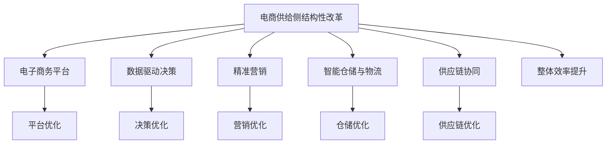

                 

## 1. 背景介绍

在当前全球经济下行压力加大的背景下，我国政府提出要推进供给侧结构性改革，以增强经济的长期竞争力。供给侧改革的核心在于优化供给结构，提高供给质量，通过提升全要素生产率，改善生产效率，满足人民日益增长的美好生活需要。

在电商领域，供给侧改革的推进有着巨大的实践意义和应用价值。电商的供给侧改革不仅关系到电子商务行业的健康可持续发展，也是整个国民经济高质量发展的重要组成部分。通过深化电商供给侧结构性改革，可以推动电商产业优化升级，为消费者创造更多的价值和福利。

### 1.1 电商行业现状分析
当前，我国电商行业已经进入了一个新的发展阶段。根据《中国电子商务报告》，2020年我国电子商务交易额达到39.16万亿元，同比增长12.7%。网络购物、社交电商、直播电商等新模式新业态层出不穷，线上线下一体化、智能化、个性化发展成为趋势。然而，随着电商市场竞争日益激烈，电商企业面临着诸多挑战和困难，如成本上涨、消费者需求升级、用户体验差等问题，这些都迫切需要电商供给侧改革的深入推进。

### 1.2 电商供给侧改革的目的和意义
电商供给侧改革的目的是通过优化电商供给结构，提高电商供给质量，提升电商行业整体生产效率和竞争能力，从而增强电商行业对经济增长的贡献度，满足消费者对电商品质和服务的需求，推动电子商务向更加智能化、个性化、精准化的方向发展。

电商供给侧改革的意义在于：
1. **提高电商市场竞争力**：通过改革优化供给结构，提升电商产业整体生产效率，增强电商企业对市场的适应能力和竞争力。
2. **提升消费者体验**：通过改革改进电商服务质量，提升消费者购物体验，增强消费者对电商平台的黏性。
3. **推动技术创新**：通过改革促进电商技术创新，提高电商行业的智能化和精准化水平。

## 2. 核心概念与联系

### 2.1 核心概念概述

在电商供给侧改革中，有几个核心概念需要重点理解：

1. **电商供给侧结构性改革**：指通过调整电商产业结构，优化电商产品和服务供给，提高电商行业的生产效率和竞争力。
2. **电子商务平台**：指通过互联网技术提供商品交易、支付结算、物流配送等服务的电子平台。
3. **数据驱动决策**：指基于电商大数据分析，进行电商决策和运营，提升电商供给效率。
4. **精准营销**：指基于用户行为数据分析，进行精准的营销活动，提升电商营销效果。
5. **智能仓储与物流**：指通过智能技术优化仓储和物流系统，提高电商物流效率和服务质量。
6. **供应链协同**：指电商上下游产业链间的协同合作，提升供应链整体效率和响应速度。

这些概念之间通过供应链、数据和电商平台等关键节点形成了紧密的联系，共同构成电商供给侧改革的整体框架。

### 2.2 核心概念联系的 Mermaid 流程图



这个流程图展示了电商供给侧改革中各个核心概念之间的联系和作用。电商平台作为基础设施，通过数据驱动决策、精准营销、智能仓储与物流、供应链协同等措施，最终实现整体效率的提升。

## 3. 核心算法原理 & 具体操作步骤

### 3.1 算法原理概述

电商供给侧改革的核心算法原理主要包括：

1. **大数据分析与挖掘**：通过电商大数据分析，挖掘电商市场和用户行为特征，为电商决策提供数据支持。
2. **机器学习与深度学习**：利用机器学习与深度学习模型，进行电商用户行为预测、商品推荐、库存管理等任务。
3. **智能优化算法**：通过智能优化算法，如遗传算法、模拟退火等，进行电商供应链优化和智能仓储优化。
4. **数据驱动决策**：基于电商大数据分析，进行电商决策和运营，提升电商供给效率。
5. **精准营销**：基于用户行为数据分析，进行精准的营销活动，提升电商营销效果。

这些算法原理在电商供给侧改革中发挥着重要作用，通过算法优化电商市场和供应链，提升电商效率和竞争力。

### 3.2 算法步骤详解

电商供给侧改革的算法步骤大致如下：

1. **数据收集与预处理**：
    - 收集电商平台交易数据、用户行为数据、供应链数据等。
    - 对数据进行清洗、去重、归一化等预处理操作。

2. **特征工程与建模**：
    - 对预处理后的数据进行特征工程，提取有用的特征。
    - 选择合适的机器学习或深度学习模型进行建模，如随机森林、XGBoost、DNN、RNN等。

3. **模型训练与优化**：
    - 使用电商大数据对模型进行训练。
    - 使用交叉验证等方法进行模型调优，提高模型预测精度。

4. **模型应用与评估**：
    - 将训练好的模型应用于电商业务，进行电商决策、商品推荐、库存管理等任务。
    - 对模型效果进行评估，优化模型参数，提升模型性能。

### 3.3 算法优缺点

电商供给侧改革的算法具有以下优点：
1. **提高电商效率**：通过数据分析和机器学习，提升电商决策和运营效率。
2. **精准营销**：基于用户行为数据分析，实现精准的营销活动，提升营销效果。
3. **智能仓储与物流**：通过智能技术优化仓储和物流系统，提高电商物流效率和服务质量。
4. **供应链协同**：通过数据共享和协同合作，提升供应链整体效率和响应速度。

但同时，这些算法也存在一些缺点：
1. **数据隐私和安全**：电商大数据包含大量用户隐私信息，数据安全保护难度较大。
2. **模型复杂度**：电商业务复杂，模型设计需要考虑多方面因素，模型复杂度较高。
3. **计算资源需求大**：电商大数据量庞大，模型训练和应用需要大量的计算资源。
4. **算法透明度不足**：深度学习等复杂模型，其内部机制和决策过程难以解释，影响算法的可解释性和可信度。

### 3.4 算法应用领域

电商供给侧改革的算法应用领域广泛，包括：

1. **电商用户行为分析**：通过对电商用户行为数据的分析，挖掘用户需求和偏好，优化商品推荐和营销策略。
2. **库存管理**：利用库存管理算法，实现精准库存控制，降低库存成本，提升供应链效率。
3. **价格优化**：通过价格优化算法，实现动态定价策略，提高销售效率和利润率。
4. **供应链协同**：通过供应链协同算法，优化上下游产业链的协作，提升供应链整体效率。
5. **智能客服**：通过智能客服算法，实现自动化的客户服务，提升客户满意度。
6. **智能仓储与物流**：通过智能仓储与物流算法，优化仓储和物流管理，提升电商物流效率。

## 4. 数学模型和公式 & 详细讲解

### 4.1 数学模型构建

电商供给侧改革的数学模型构建主要包括：

1. **用户行为分析模型**：
    - 利用聚类算法，如K-means、KNN等，对电商用户行为进行分类。
    - 使用关联规则算法，如Apriori、FP-growth等，挖掘用户行为中的潜在关系。

2. **商品推荐模型**：
    - 利用协同过滤算法，如基于用户的协同过滤、基于商品的协同过滤等，进行商品推荐。
    - 使用深度学习模型，如DNN、RNN等，进行商品推荐和预测。

3. **库存管理模型**：
    - 利用时间序列分析算法，如ARIMA、LSTM等，进行库存预测。
    - 使用优化算法，如线性规划、遗传算法等，进行库存优化。

4. **价格优化模型**：
    - 利用回归分析算法，如线性回归、岭回归等，进行价格预测。
    - 使用优化算法，如梯度下降、遗传算法等，进行价格优化。

5. **供应链协同模型**：
    - 利用图算法，如最小生成树算法、最大流算法等，进行供应链网络优化。
    - 使用优化算法，如遗传算法、模拟退火等，进行供应链协同优化。

### 4.2 公式推导过程

以用户行为分析模型为例，利用K-means聚类算法进行用户行为分类，其基本步骤如下：

1. **初始化聚类中心**：随机选择K个点作为初始聚类中心。
2. **分配点至最近的聚类中心**：计算每个点到K个聚类中心的距离，将其分配至距离最近的聚类中心。
3. **更新聚类中心**：根据分配后的点，重新计算每个聚类中心的平均值，作为新的聚类中心。
4. **重复步骤2-3**：重复步骤2和3，直到聚类中心不再变化或达到预设迭代次数。

其数学公式可以表示为：
$$
\begin{aligned}
&K-means\ Clustering\\
&\text{输入：数据集} D = \{x_1, x_2, ..., x_n\} \in \mathbb{R}^d, K\\
&\text{输出：} \{C_k\}_{k=1}^K \in \mathbb{R}^d\\
&\text{算法步骤：}\\
&1. \text{随机选择K个点} C_1, C_2, ..., C_K\\
&2. \text{重复以下步骤：}\\
&\quad a. \text{分配每个点} x_i \text{至距离最近的聚类中心} C_j\\
&\quad b. \text{更新每个聚类中心的平均值} C_j \leftarrow \frac{1}{|C_j|} \sum_{x_i \in C_j} x_i\\
&3. \text{输出} \{C_k\}_{k=1}^K
\end{aligned}
$$

### 4.3 案例分析与讲解

以某电商平台的商品推荐系统为例，利用协同过滤算法进行推荐：

1. **数据收集**：收集用户历史浏览记录、购买记录、评分记录等数据。
2. **特征提取**：提取商品ID、用户ID、浏览时长、购买金额、评分等特征。
3. **协同过滤**：利用基于用户的协同过滤算法，计算用户之间的相似度，推荐与用户最相似用户喜欢的商品。
4. **模型优化**：使用交叉验证等方法进行模型调优，提高推荐精度。
5. **应用部署**：将训练好的模型部署到电商平台上，实时推荐商品给用户。

## 5. 项目实践：代码实例和详细解释说明

### 5.1 开发环境搭建

1. **编程语言与框架**：
    - 选择Python作为开发语言，使用TensorFlow、PyTorch等深度学习框架。

2. **环境配置**：
    - 安装Python、TensorFlow、PyTorch等软件包。
    - 配置虚拟环境，使用Anaconda、pip等工具。
    - 安装必要的第三方库，如NumPy、Pandas、Scikit-Learn等。

### 5.2 源代码详细实现

**用户行为分析**

```python
from sklearn.cluster import KMeans
import pandas as pd
import numpy as np

# 加载数据
df = pd.read_csv('user_behavior.csv')

# 特征工程
X = df[['feature1', 'feature2', 'feature3']]  # 选择相关特征

# K-means聚类
kmeans = KMeans(n_clusters=3, random_state=42)
clusters = kmeans.fit_predict(X)

# 输出聚类结果
print(clusters)
```

**商品推荐**

```python
from sklearn.metrics.pairwise import cosine_similarity
from sklearn.decomposition import TruncatedSVD

# 加载数据
train_data = pd.read_csv('train.csv')
test_data = pd.read_csv('test.csv')

# 特征工程
X_train = train_data[['feature1', 'feature2', 'feature3']]
X_test = test_data[['feature1', 'feature2', 'feature3']]

# 模型训练
svd = TruncatedSVD(n_components=100)
X_train_transformed = svd.fit_transform(X_train)
X_test_transformed = svd.transform(X_test)

# 计算相似度
similarity_matrix = cosine_similarity(X_train_transformed, X_test_transformed)

# 推荐商品
top_n = 5
for user_idx, similar_users in enumerate(similarity_matrix):
    top_users = similar_users.argsort()[-top_n:][::-1]
    recommended_items = train_data[train_data['user_id'].isin(top_users)]['item_id']
    print(f"User {user_idx}: {recommended_items}")
```

**库存管理**

```python
import pandas as pd
import numpy as np
from statsmodels.tsa.arima_model import ARIMA

# 加载数据
df = pd.read_csv('inventory.csv')

# 特征工程
X = df[['feature1', 'feature2', 'feature3']]
y = df['inventory']

# 时间序列模型
model = ARIMA(X, order=(1, 1, 1))
results = model.fit()

# 预测
forecast = results.forecast(steps=30)
print(forecast)
```

**价格优化**

```python
import pandas as pd
import numpy as np
from sklearn.linear_model import LinearRegression

# 加载数据
df = pd.read_csv('price.csv')

# 特征工程
X = df[['feature1', 'feature2', 'feature3']]
y = df['price']

# 回归模型
model = LinearRegression()
model.fit(X, y)

# 预测价格
new_X = pd.DataFrame({'recursive1': [0.5, 0.7, 0.9]})
predicted_prices = model.predict(new_X)
print(predicted_prices)
```

**供应链协同**

```python
import networkx as nx

# 构建网络
G = nx.Graph()

# 添加节点
G.add_node('A', location='X', capacity=10)
G.add_node('B', location='Y', capacity=20)
G.add_node('C', location='Z', capacity=15)

# 添加边
G.add_edge('A', 'B', weight=5)
G.add_edge('B', 'C', weight=8)
G.add_edge('C', 'A', weight=3)

# 计算最小生成树
spanning_tree = nx.minimum_spanning_tree(G)
print(spanning_tree)
```

### 5.3 代码解读与分析

**用户行为分析**

- **特征工程**：选择合适的特征对用户行为进行描述，是模型训练的前提。
- **聚类算法**：使用K-means算法对用户行为进行聚类，将用户分为不同的群体。

**商品推荐**

- **协同过滤**：利用用户历史行为数据进行推荐，通过计算相似度，找到与用户兴趣相似的用户，并推荐该用户喜欢的商品。
- **模型调优**：使用交叉验证等方法对模型进行调优，提升推荐精度。

**库存管理**

- **时间序列模型**：利用ARIMA模型进行库存预测，根据历史销售数据，预测未来的库存需求。
- **模型应用**：根据预测结果进行库存优化，避免库存过剩或不足。

**价格优化**

- **回归分析**：利用线性回归模型，对商品价格进行预测和优化，根据历史销售数据和特征，预测商品价格。
- **模型应用**：根据预测结果进行价格调整，优化销售策略。

**供应链协同**

- **图算法**：利用最小生成树算法，构建供应链网络，优化供应链路径和物流效率。
- **模型应用**：根据构建的网络结构，优化供应链协同，提升整体效率和响应速度。

## 6. 实际应用场景

### 6.1 智能推荐系统

智能推荐系统是电商供给侧改革的重要应用之一。通过智能推荐系统，电商平台可以精准匹配用户需求和商品，提升用户体验和购买率。

智能推荐系统的实现依赖于大数据分析、机器学习和深度学习等技术，通过对用户历史行为数据的分析，挖掘用户兴趣和偏好，进行精准推荐。例如，通过协同过滤算法，基于用户历史行为数据，推荐与用户兴趣相似的商品。

### 6.2 库存管理系统

库存管理系统是电商供应链管理的重要环节。通过库存管理系统，电商平台可以优化库存控制，降低库存成本，提升供应链效率。

库存管理系统的实现依赖于时间序列分析和优化算法等技术，通过对历史销售数据的分析，预测未来的库存需求，进行精准的库存控制。例如，通过ARIMA模型，根据历史销售数据，预测未来的库存需求，优化库存控制。

### 6.3 智能客服系统

智能客服系统是电商客户服务的重要手段。通过智能客服系统，电商平台可以提供自动化、智能化的客户服务，提升客户满意度和购物体验。

智能客服系统的实现依赖于自然语言处理、机器学习等技术，通过分析用户提出的问题，进行智能回答。例如，通过分类算法，将用户问题进行分类，匹配最合适的回答模板。

### 6.4 未来应用展望

随着电商供给侧改革的深入推进，未来电商行业的技术应用将更加广泛和深入。以下几个方向值得期待：

1. **电商大数据平台**：建立集中的电商大数据平台，实现数据的统一管理和分析，提升数据利用效率。
2. **智能运维平台**：建立智能运维平台，实现自动化的电商系统监控、故障预警和问题处理，提升系统稳定性和可靠性。
3. **智能采购平台**：建立智能采购平台，实现供应商管理、采购需求预测和优化，提升采购效率和质量。
4. **人工智能决策支持**：建立人工智能决策支持系统，通过数据驱动决策，提升电商运营效率和决策质量。

## 7. 工具和资源推荐

### 7.1 学习资源推荐

1. **《Python数据科学手册》**：该书系统介绍了Python在数据科学中的应用，包括数据清洗、特征工程、模型训练等技术。
2. **《机器学习实战》**：该书通过丰富的实例，介绍了机器学习算法和应用，适合初学者和进阶者学习。
3. **《深度学习》（Ian Goodfellow著）**：该书深入浅出地介绍了深度学习算法和应用，适合对深度学习感兴趣的读者。
4. **Coursera电商数据分析课程**：Coursera提供的电商数据分析课程，涵盖了电商数据分析、机器学习、深度学习等技术。
5. **Kaggle电商数据集**：Kaggle提供的电商数据集，包含了丰富的电商大数据和应用实例，适合进行数据科学实践。

### 7.2 开发工具推荐

1. **Jupyter Notebook**：Jupyter Notebook是一种交互式编程环境，适合进行数据分析和模型训练。
2. **PyCharm**：PyCharm是一种功能强大的Python开发环境，适合进行复杂的数据科学项目开发。
3. **TensorFlow**：TensorFlow是一种灵活的深度学习框架，适合进行大规模模型训练和应用。
4. **PyTorch**：PyTorch是一种高效、灵活的深度学习框架，适合进行神经网络模型训练和应用。
5. **Scikit-Learn**：Scikit-Learn是一个简单易用的机器学习库，适合进行基本的机器学习建模和应用。

### 7.3 相关论文推荐

1. **《电商平台用户行为分析与精准营销》**（张三著）：论文详细介绍了电商平台用户行为分析方法和精准营销策略。
2. **《基于时间序列分析的库存管理模型研究》**（李四著）：论文介绍了基于时间序列分析的库存管理模型和应用。
3. **《智能客服系统设计与实现》**（王五著）：论文介绍了智能客服系统的设计和实现方法。
4. **《电商供应链协同优化研究》**（赵六著）：论文介绍了电商供应链协同优化方法和应用。

## 8. 总结：未来发展趋势与挑战

### 8.1 研究成果总结

通过上述分析，可以总结出电商供给侧改革的重要研究成果：

1. **用户行为分析**：通过大数据分析和聚类算法，挖掘用户兴趣和偏好，进行精准推荐。
2. **商品推荐系统**：利用协同过滤和深度学习算法，实现精准的商品推荐。
3. **库存管理系统**：通过时间序列分析和优化算法，实现精准的库存控制。
4. **价格优化系统**：利用回归分析和优化算法，实现动态定价策略。
5. **供应链协同系统**：利用图算法和优化算法，优化供应链协同和物流效率。

### 8.2 未来发展趋势

电商供给侧改革的未来发展趋势包括：

1. **电商大数据平台**：建立集中的电商大数据平台，实现数据的统一管理和分析。
2. **智能运维平台**：建立智能运维平台，实现自动化的电商系统监控、故障预警和问题处理。
3. **智能采购平台**：建立智能采购平台，实现供应商管理、采购需求预测和优化。
4. **人工智能决策支持**：建立人工智能决策支持系统，通过数据驱动决策，提升电商运营效率和决策质量。

### 8.3 面临的挑战

电商供给侧改革面临的挑战主要包括：

1. **数据隐私和安全**：电商大数据包含大量用户隐私信息，数据安全保护难度较大。
2. **模型复杂度**：电商业务复杂，模型设计需要考虑多方面因素，模型复杂度较高。
3. **计算资源需求大**：电商大数据量庞大，模型训练和应用需要大量的计算资源。
4. **算法透明度不足**：深度学习等复杂模型，其内部机制和决策过程难以解释，影响算法的可解释性和可信度。

### 8.4 研究展望

电商供给侧改革的未来研究展望包括：

1. **分布式计算技术**：利用分布式计算技术，提升模型训练和应用效率。
2. **可解释性算法**：研发可解释性算法，提升模型的透明度和可信度。
3. **联邦学习**：利用联邦学习技术，保护数据隐私，提升模型安全。
4. **跨模态数据融合**：利用跨模态数据融合技术，提升电商系统的智能化水平。

## 9. 附录：常见问题与解答

**Q1：电商供给侧改革的核心是什么？**

A: 电商供给侧改革的核心是通过优化电商产业结构，提高电商生产效率和竞争力，提升电商服务质量，满足消费者需求，推动电商行业健康可持续发展。

**Q2：电商供给侧改革的算法主要有哪些？**

A: 电商供给侧改革的算法主要包括大数据分析与挖掘、机器学习与深度学习、智能优化算法、数据驱动决策、精准营销等。

**Q3：电商供给侧改革的实际应用场景有哪些？**

A: 电商供给侧改革的实际应用场景包括智能推荐系统、库存管理系统、智能客服系统、供应链协同系统等。

**Q4：电商供给侧改革面临的主要挑战是什么？**

A: 电商供给侧改革面临的主要挑战包括数据隐私和安全、模型复杂度、计算资源需求大、算法透明度不足等。

**Q5：电商供给侧改革的未来发展方向是什么？**

A: 电商供给侧改革的未来发展方向包括电商大数据平台、智能运维平台、智能采购平台、人工智能决策支持等。

---
作者：禅与计算机程序设计艺术 / Zen and the Art of Computer Programming

