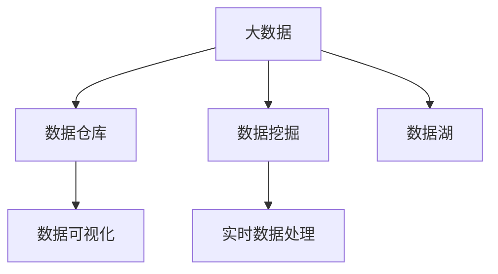

                 

# 信息差的技术管理提升：大数据如何提升技术管理

## 1. 背景介绍

在当前快速变化的科技环境中，企业的技术管理面临着诸多挑战。信息不对称、数据孤岛、决策缺乏依据等问题，使得技术团队难以有效协调资源，实现技术创新和业务转型的目标。随着大数据技术的兴起，通过数据驱动的管理方法，可以显著提升企业的技术管理水平。本文将探讨大数据在技术管理中的应用，如何通过数据挖掘、分析、可视化等手段，帮助技术管理者优化决策、提升团队协作效率，最终实现技术的健康发展。

### 1.1 问题由来

信息差（Information Gap）指的是在组织或系统内部，不同成员间或不同系统间存在的信息不对称，这会导致信息流动的障碍，影响决策的质量和速度。对于技术管理而言，信息差的存在，往往导致以下问题：

- **决策缺乏依据**：技术管理者难以获取全面、准确的技术状态和业务需求信息，导致决策时缺乏数据支撑。
- **资源分配不合理**：缺乏全局视角，可能导致资源分配的不均衡，影响项目的进展和绩效。
- **沟通效率低下**：信息孤岛使得团队成员之间难以快速沟通和协作，导致项目推进缓慢。
- **创新能力受限**：无法及时获取市场和技术趋势信息，影响创新项目的开发和应用。

### 1.2 问题核心关键点

解决信息差问题，提升技术管理效率的关键在于数据的使用和分析。大数据技术的发展为技术管理者提供了全新的工具和方法，可以从多个维度提升技术管理的水平。

1. **数据收集与整合**：通过收集和整合技术架构、业务需求、市场趋势等各类数据，构建统一的数据平台，为技术管理提供基础数据支撑。
2. **数据分析与洞察**：利用数据挖掘和分析技术，从海量数据中提取有价值的信息，为决策提供科学依据。
3. **数据可视化与展示**：通过数据可视化工具，将复杂的数据信息转化为直观的图表和报表，帮助管理者快速理解数据，做出决策。
4. **实时监控与预警**：利用大数据技术实现对技术系统的实时监控，及时发现问题并进行预警，提升系统的稳定性和可靠性。

## 2. 核心概念与联系

### 2.1 核心概念概述

为了更好地理解大数据在技术管理中的应用，本节将介绍几个密切相关的核心概念：

- **大数据**：通常指规模巨大、类型繁多、速度极快的数据集，包括结构化数据、半结构化数据和非结构化数据。通过大数据技术，可以对海量数据进行高效存储、处理和分析。
- **数据仓库**：用于集中存储和管理企业历史数据的数据库系统，通过ETL（Extract, Transform, Load）过程，将数据从多个来源集中存储，便于分析和查询。
- **数据挖掘**：从大数据中提取有用信息和知识的过程，包括聚类、分类、关联规则挖掘等。
- **数据可视化**：将数据转化为图表、地图等可视化形式，便于理解、分析和展示。
- **实时数据处理**：对实时产生的数据进行快速处理和分析，适用于需要即时响应的应用场景。
- **数据湖**：一种无结构的数据存储方式，可以容纳各种类型的数据，便于后续的数据分析和挖掘。

这些核心概念之间的逻辑关系可以通过以下Mermaid流程图来展示：



这个流程图展示了大数据技术在技术管理中的核心概念及其之间的关系：

1. 大数据通过数据仓库、数据湖等集中存储平台进行收集和整合。
2. 数据挖掘从这些数据中提取有用的信息和知识。
3. 数据可视化将分析结果转化为易于理解的图表和报表。
4. 实时数据处理对动态变化的数据进行快速分析和响应。

这些概念共同构成了大数据技术在技术管理中的整体框架，使得技术管理者能够利用数据进行科学决策、优化资源配置和提升团队协作效率。

## 3. 核心算法原理 & 具体操作步骤
### 3.1 算法原理概述

大数据在技术管理中的应用，核心在于通过数据驱动的方式，优化决策过程、提升资源利用率和团队协作效率。具体而言，大数据技术可以帮助技术管理者从以下几个方面进行优化：

- **决策支持**：通过分析历史数据和实时数据，为技术决策提供数据支持和洞察。
- **资源优化**：利用数据分析结果，优化技术资源（如硬件、软件、人员等）的分配和使用。
- **团队协作**：通过数据共享和可视化，促进团队成员间的沟通和协作，提升整体工作效率。
- **创新驱动**：利用大数据分析市场和技术趋势，支持技术创新和研发方向的调整。

### 3.2 算法步骤详解

大数据在技术管理中的应用，通常包括以下几个关键步骤：

**Step 1: 数据收集与整合**

- 收集企业内部和外部的各类数据，包括技术架构、业务需求、市场趋势、运营数据等。
- 利用ETL工具将数据从多个来源集中到数据仓库或数据湖中。
- 确保数据的完整性、一致性和安全性，避免数据孤岛和信息孤岛。

**Step 2: 数据清洗与预处理**

- 对收集到的数据进行清洗，去除重复、缺失和异常值。
- 对数据进行预处理，如归一化、编码、特征工程等，便于后续分析。
- 进行数据采样和划分，确保训练集、验证集和测试集的质量和多样性。

**Step 3: 数据分析与洞察**

- 利用数据挖掘技术，从数据中提取有价值的信息和模式。
- 使用机器学习算法，如分类、回归、聚类等，对数据进行建模和预测。
- 利用统计分析方法，如均值、方差、标准差等，评估数据的分布和特性。

**Step 4: 数据可视化与展示**

- 使用数据可视化工具，如Tableau、PowerBI等，将分析结果转化为图表、地图等可视化形式。
- 设计直观易懂的报表和仪表盘，帮助技术管理者快速理解数据和洞察结果。
- 利用交互式可视化工具，支持用户自定义分析维度和指标，进行动态分析。

**Step 5: 实时监控与预警**

- 利用流处理技术，对实时产生的数据进行快速处理和分析。
- 利用告警系统，对异常数据和指标进行实时监控和预警，避免潜在风险。
- 设计自动化流程，确保数据的持续监控和及时响应。

### 3.3 算法优缺点

大数据在技术管理中的应用，具有以下优点：

- **数据驱动决策**：通过数据分析，为技术决策提供科学依据，减少主观判断。
- **全面视角**：大数据覆盖企业内外多方面的数据，提供全局视角，优化资源配置。
- **实时响应**：实时数据处理和监控，帮助技术管理者及时发现和解决问题。
- **可视化展示**：数据可视化工具，提升数据理解效率，支持快速决策。

但大数据技术也存在一些局限性：

- **数据质量和完整性**：数据收集和清洗过程中，可能会存在数据质量不高、不完整的问题，影响分析结果。
- **技术复杂度**：大数据处理和分析涉及复杂的技术栈和工具链，需要较高的技术门槛。
- **隐私和安全性**：大数据处理涉及敏感数据，需要严格的数据保护和隐私政策。
- **存储和计算成本**：大数据存储和处理需要高昂的成本，对硬件和网络资源要求较高。

尽管存在这些局限性，但大数据技术在技术管理中的应用，仍具有不可替代的优势，能够显著提升企业的技术管理水平。

### 3.4 算法应用领域

大数据在技术管理中的应用，已经在多个领域得到了成功应用，例如：

- **IT治理**：通过大数据分析，优化IT资源分配，提升IT项目的管理效率。
- **性能监控**：利用大数据技术实时监控系统性能，及时发现和解决问题，提升系统可靠性。
- **故障预测**：通过大数据分析历史数据，预测系统故障，提前进行预防性维护，减少业务中断。
- **风险管理**：利用大数据分析，评估技术风险和业务风险，制定相应的应对策略。
- **知识管理**：通过大数据分析，提取技术知识和经验，支持技术团队的学习和成长。

这些领域的应用，展示了大数据技术在技术管理中的广泛价值，为企业的技术发展提供了有力的支持。

## 4. 数学模型和公式 & 详细讲解 & 举例说明

### 4.1 数学模型构建

本节将使用数学语言对大数据在技术管理中的应用进行更加严格的刻画。

假设企业内部有 $N$ 个技术项目，每个项目有 $M$ 个关键性能指标（KPI），表示为 $KPI_{i,j}$，其中 $i$ 表示项目编号，$j$ 表示KPI编号。设 $D$ 为所有项目的 $M$ 个KPI的历史数据集，$x$ 为第 $i$ 个项目 $j$ 个KPI的数据向量，$y$ 为对应的标签向量，$(x,y)$ 表示一个训练样本。

定义模型 $M_{\theta}$ 在数据样本 $(x,y)$ 上的损失函数为 $\ell(M_{\theta}(x),y)$，则在数据集 $D$ 上的经验风险为：

$$
\mathcal{L}(\theta) = \frac{1}{N} \sum_{i=1}^N \ell(M_{\theta}(x_i),y_i)
$$

其中 $\theta$ 为模型参数，$\ell$ 为损失函数，如均方误差、交叉熵等。

### 4.2 公式推导过程

以下我们以回归问题为例，推导均方误差损失函数的计算公式。

假设模型 $M_{\theta}$ 在输入 $x$ 上的预测为 $\hat{y}=M_{\theta}(x)$，则均方误差损失函数定义为：

$$
\ell(M_{\theta}(x),y) = \frac{1}{2}(y - \hat{y})^2
$$

将其代入经验风险公式，得：

$$
\mathcal{L}(\theta) = \frac{1}{2N} \sum_{i=1}^N \sum_{j=1}^M (y_{i,j} - M_{\theta}(x_{i,j}))^2
$$

根据链式法则，损失函数对参数 $\theta_k$ 的梯度为：

$$
\frac{\partial \mathcal{L}(\theta)}{\partial \theta_k} = \frac{1}{N} \sum_{i=1}^N \sum_{j=1}^M (y_{i,j} - M_{\theta}(x_{i,j})) (x_{i,j,k}) M_{\theta}'(x_{i,j}) - \frac{1}{N} \sum_{i=1}^N \sum_{j=1}^M (y_{i,j} - M_{\theta}(x_{i,j})) M_{\theta}''(x_{i,j})
$$

其中 $M_{\theta}'(x)$ 为模型对 $x$ 的导数，$M_{\theta}''(x)$ 为模型对 $x$ 的二阶导数。

在得到损失函数的梯度后，即可带入参数更新公式，完成模型的迭代优化。重复上述过程直至收敛，最终得到适应技术管理需求的最优模型参数 $\theta^*$。

### 4.3 案例分析与讲解

假设某企业的技术部门有多个项目，每个项目包含多个关键性能指标，如项目完成时间、项目预算、项目质量等。通过收集这些历史数据，构建一个基于回归模型的预测系统，用于预测未来项目的绩效。

首先，定义模型 $M_{\theta}$ 在数据样本 $(x,y)$ 上的损失函数为均方误差，则在数据集 $D$ 上的经验风险为：

$$
\mathcal{L}(\theta) = \frac{1}{N} \sum_{i=1}^N \sum_{j=1}^M (y_{i,j} - M_{\theta}(x_{i,j}))^2
$$

其中 $y_{i,j}$ 为第 $i$ 个项目 $j$ 个关键性能指标的真实值，$M_{\theta}(x_{i,j})$ 为模型对第 $i$ 个项目 $j$ 个指标的预测值。

在实际应用中，可以利用历史数据构建训练集，然后使用K-fold交叉验证方法进行模型训练和验证。最后，将模型应用于新项目的预测，评估模型的预测效果。

## 5. 项目实践：代码实例和详细解释说明

### 5.1 开发环境搭建

在进行技术管理数据分析实践前，我们需要准备好开发环境。以下是使用Python进行Pandas、NumPy、Scikit-learn等库的开发环境配置流程：

1. 安装Anaconda：从官网下载并安装Anaconda，用于创建独立的Python环境。

2. 创建并激活虚拟环境：
```bash
conda create -n tech-management python=3.8 
conda activate tech-management
```

3. 安装Pandas、NumPy、Scikit-learn等常用库：
```bash
pip install pandas numpy scikit-learn matplotlib
```

4. 安装必要的工具包：
```bash
pip install jupyter notebook ipython seaborn
```

完成上述步骤后，即可在`tech-management`环境中开始技术管理数据分析实践。

### 5.2 源代码详细实现

下面以一个简单的回归问题为例，给出使用Pandas进行数据分析的PyTorch代码实现。

首先，导入必要的库和数据集：

```python
import pandas as pd
import numpy as np
from sklearn.model_selection import train_test_split
from sklearn.linear_model import LinearRegression
from sklearn.metrics import mean_squared_error

# 加载数据集
data = pd.read_csv('data.csv')
```

接着，进行数据清洗和预处理：

```python
# 数据清洗
data.dropna(inplace=True)  # 去除缺失值

# 数据预处理
X = data.drop('y', axis=1)
y = data['y']
X_train, X_test, y_train, y_test = train_test_split(X, y, test_size=0.2, random_state=42)
```

然后，定义和训练模型：

```python
# 定义模型
model = LinearRegression()

# 训练模型
model.fit(X_train, y_train)

# 评估模型
y_pred = model.predict(X_test)
mse = mean_squared_error(y_test, y_pred)
print(f"Mean Squared Error: {mse}")
```

最后，展示模型预测结果：

```python
# 展示预测结果
print(y_pred)
```

以上就是使用Pandas进行回归问题分析的完整代码实现。可以看到，Pandas库提供了丰富的数据处理和分析工具，便于进行数据清洗、预处理和建模。

### 5.3 代码解读与分析

让我们再详细解读一下关键代码的实现细节：

**数据导入与清洗**：
- `pd.read_csv('data.csv')`：从CSV文件中读取数据，并存入Pandas DataFrame对象。
- `data.dropna(inplace=True)`：去除DataFrame中的缺失值。

**数据预处理**：
- `X = data.drop('y', axis=1)`：将除目标变量 `y` 以外的所有特征作为输入变量 `X`。
- `y = data['y']`：将目标变量 `y` 作为输出变量。
- `X_train, X_test, y_train, y_test = train_test_split(X, y, test_size=0.2, random_state=42)`：将数据集划分为训练集和测试集。

**模型训练与评估**：
- `model = LinearRegression()`：定义线性回归模型。
- `model.fit(X_train, y_train)`：使用训练集数据训练模型。
- `y_pred = model.predict(X_test)`：使用测试集数据进行模型预测。
- `mean_squared_error(y_test, y_pred)`：计算预测结果与真实值之间的均方误差。

**结果展示**：
- `print(y_pred)`：输出预测结果。

通过这个简单的代码示例，可以看到Pandas库在数据处理和分析中的强大能力。合理利用这些工具，可以显著提升技术管理数据分析的效率和准确性。

## 6. 实际应用场景

### 6.1 技术项目绩效预测

企业内部往往存在大量的技术项目，每个项目的目标和绩效指标各不相同。通过收集和分析这些项目的历史数据，可以构建一个预测模型，用于评估新项目的预期绩效，优化资源配置。

具体而言，可以收集项目的历史数据，包括项目名称、项目类型、项目预算、项目完成时间、项目质量等关键绩效指标。利用这些数据，构建一个回归模型，用于预测新项目的完成时间和质量。

例如，使用均方误差作为损失函数，构建一个线性回归模型：

$$
\mathcal{L}(\theta) = \frac{1}{N} \sum_{i=1}^N (y_{i} - M_{\theta}(x_{i}))^2
$$

其中 $x_i$ 为第 $i$ 个项目的特征向量，$y_i$ 为对应的项目完成时间或质量。通过训练该模型，可以预测新项目的预期完成时间和质量，帮助管理层做出科学决策。

### 6.2 故障预测与维护

技术系统的高可用性和稳定性，是企业运营的关键。通过大数据分析，可以提前预测系统故障，采取预防性维护措施，减少业务中断。

具体而言，可以收集系统历史运行数据，包括CPU使用率、内存占用、网络流量等关键指标。利用这些数据，构建一个预测模型，用于预测系统未来的故障点。

例如，使用均方误差作为损失函数，构建一个线性回归模型：

$$
\mathcal{L}(\theta) = \frac{1}{N} \sum_{i=1}^N (y_{i} - M_{\theta}(x_{i}))^2
$$

其中 $x_i$ 为第 $i$ 个时刻的运行数据，$y_i$ 为对应的系统故障状态。通过训练该模型，可以预测系统未来的故障点，提前进行维护，确保系统稳定运行。

### 6.3 风险评估与管理

企业技术管理的另一个重要方面是风险评估与管理。通过大数据分析，可以识别出技术项目和系统的潜在风险，制定相应的应对策略。

具体而言，可以收集历史数据，包括项目的预算、资源、进度、质量等关键指标，以及相关的风险因素。利用这些数据，构建一个分类模型，用于评估新项目的风险等级。

例如，使用交叉熵作为损失函数，构建一个逻辑回归模型：

$$
\mathcal{L}(\theta) = -\frac{1}{N} \sum_{i=1}^N (y_i \log \hat{y_i} + (1-y_i) \log (1-\hat{y_i}))
$$

其中 $x_i$ 为第 $i$ 个项目的特征向量，$y_i$ 为对应的风险等级（0表示低风险，1表示高风险）。通过训练该模型，可以评估新项目的风险等级，制定相应的风险管理策略。

### 6.4 未来应用展望

随着大数据技术的进一步发展，技术管理的数据驱动范式将更加成熟和普及。未来的技术管理将更加依赖数据来优化决策、提升资源利用率和团队协作效率。

1. **数据驱动决策**：大数据分析将为技术决策提供更加科学和全面的依据，减少主观判断，提升决策质量。
2. **资源优化配置**：通过大数据分析，可以实时监控技术资源的使用情况，优化资源配置，提升项目效率。
3. **团队协作提升**：大数据分析将促进团队成员间的信息共享和协作，提升整体工作效率。
4. **创新驱动发展**：大数据分析将支持技术创新和研发方向的调整，推动企业的技术进步。

大数据技术在技术管理中的应用，将不断深化和拓展，为企业的技术发展提供强有力的支撑。未来，随着数据量的不断增长和数据处理技术的不断进步，大数据将在技术管理中发挥更加重要的作用，推动企业迈向更高水平的技术管理。

## 7. 工具和资源推荐
### 7.1 学习资源推荐

为了帮助开发者系统掌握大数据在技术管理中的应用，这里推荐一些优质的学习资源：

1. 《大数据应用实践》系列博文：深入浅出地介绍了大数据在技术管理中的应用场景和实践方法。

2. CS229《机器学习》课程：斯坦福大学开设的机器学习明星课程，涵盖了数据预处理、特征工程、模型评估等基本概念和经典算法。

3. 《大数据分析与可视化》书籍：系统介绍了大数据分析的基本原理和可视化工具的使用，适用于大数据技术入门和实践。

4. Kaggle：全球最大的数据科学竞赛平台，提供丰富的数据集和实战案例，帮助开发者提升实战能力。

5. Weights & Biases：模型训练的实验跟踪工具，可以记录和可视化模型训练过程中的各项指标，方便对比和调优。

6. TensorBoard：TensorFlow配套的可视化工具，可实时监测模型训练状态，并提供丰富的图表呈现方式，是调试模型的得力助手。

通过这些资源的学习实践，相信你一定能够快速掌握大数据在技术管理中的应用，并用于解决实际的技术管理问题。

### 7.2 开发工具推荐

高效的数据分析和建模，离不开优秀的工具支持。以下是几款用于大数据技术管理开发常用的工具：

1. Pandas：Python开源数据分析库，提供了丰富的数据处理和分析工具，适用于数据清洗、预处理和建模。

2. NumPy：Python开源数值计算库，提供了高效的数组和矩阵计算功能，适用于数值分析和科学计算。

3. Scikit-learn：Python开源机器学习库，提供了各种经典的机器学习算法和工具，适用于数据挖掘和模型构建。

4. Tableau：商业数据可视化工具，可以将复杂的数据信息转化为直观的图表和报表，帮助技术管理者快速理解数据和洞察结果。

5. PowerBI：微软推出的数据可视化工具，支持与多种数据源的连接，提供丰富的数据可视化功能，适用于企业级数据管理。

6. Weights & Biases：模型训练的实验跟踪工具，可以记录和可视化模型训练过程中的各项指标，方便对比和调优。

合理利用这些工具，可以显著提升大数据技术管理数据分析的效率和准确性。

### 7.3 相关论文推荐

大数据技术的发展源于学界的持续研究。以下是几篇奠基性的相关论文，推荐阅读：

1. Google BigQuery：介绍了Google大数据平台BigQuery的技术架构和应用实践。

2. Cloudera Hive：介绍了Apache Hive在大数据处理中的作用和应用案例。

3. Spark：介绍了Apache Spark的分布式计算框架，适用于大规模数据处理和分析。

4. Hadoop：介绍了Apache Hadoop的分布式存储和计算架构，适用于海量数据的存储和处理。

这些论文代表了大数据技术发展的最新成果，深入理解这些论文，可以帮助你更全面地掌握大数据在技术管理中的应用。

## 8. 总结：未来发展趋势与挑战

### 8.1 研究成果总结

本文对大数据在技术管理中的应用进行了全面系统的介绍。通过大数据技术，技术管理者可以更科学、全面地掌握企业的技术状态和业务需求，优化决策过程、提升资源利用率和团队协作效率，最终实现技术的健康发展。

大数据技术在技术管理中的应用，已经在多个领域得到了成功应用，如技术项目绩效预测、故障预测与维护、风险评估与管理等，展示了大数据技术在技术管理中的广泛价值。

### 8.2 未来发展趋势

展望未来，大数据在技术管理中的应用将呈现以下几个发展趋势：

1. **数据治理与质量提升**：随着数据量的不断增长，数据治理和数据质量提升将成为大数据技术应用的关键。通过数据清洗、数据标注、数据融合等手段，提升数据质量，为数据分析和建模提供可靠的基础。

2. **实时数据处理与流式计算**：实时数据处理和流式计算技术的发展，将支持企业对动态变化的数据进行快速分析和响应。这对于需要即时响应的应用场景尤为重要，如故障预测和系统监控。

3. **机器学习与深度学习**：随着机器学习与深度学习技术的发展，大数据分析将更加智能化和自动化。利用深度学习模型，可以提取更复杂、更抽象的知识和规律，提升数据分析的精度和效果。

4. **数据可视化与交互式分析**：数据可视化工具的不断进步，将提升数据理解和分析的效率。交互式分析工具的普及，将支持用户自定义分析维度和指标，进行动态分析。

5. **跨领域知识融合**：跨领域知识融合技术的发展，将使得大数据分析更加全面和深入。通过结合领域专家的知识，可以更好地理解数据和提取有价值的信息。

6. **云平台与分布式计算**：云平台和分布式计算技术的发展，将使得大数据分析更加高效和可扩展。通过云平台，可以快速部署和扩展大数据分析任务，降低数据处理和分析的门槛。

以上趋势展示了大数据技术在技术管理中的未来发展方向，将进一步提升企业技术管理的效率和水平。

### 8.3 面临的挑战

尽管大数据在技术管理中的应用前景广阔，但在实际应用中也面临着一些挑战：

1. **数据质量和完整性**：数据收集和清洗过程中，可能会存在数据质量不高、不完整的问题，影响数据分析结果。

2. **技术复杂度**：大数据处理和分析涉及复杂的技术栈和工具链，需要较高的技术门槛。

3. **隐私和安全性**：大数据处理涉及敏感数据，需要严格的数据保护和隐私政策。

4. **存储和计算成本**：大数据存储和处理需要高昂的成本，对硬件和网络资源要求较高。

5. **数据孤岛和信息孤岛**：不同系统间的数据孤岛和信息孤岛，可能导致数据共享和信息交流的障碍。

尽管存在这些挑战，但大数据技术在技术管理中的应用，仍具有不可替代的优势，能够显著提升企业的技术管理水平。

### 8.4 研究展望

未来，大数据技术在技术管理中的应用，还需要在以下几个方面进行深入研究：

1. **数据治理与质量提升**：如何设计高效的数据治理策略，提升数据质量和完整性，是未来研究的重要方向。

2. **实时数据处理与流式计算**：如何高效地处理和分析实时数据，是未来研究的重要课题。

3. **机器学习与深度学习**：如何利用机器学习和深度学习技术，提升大数据分析的精度和效果，是未来研究的重要方向。

4. **数据可视化与交互式分析**：如何设计更加智能化、交互式的可视化工具，支持用户自定义分析维度和指标，是未来研究的重要方向。

5. **跨领域知识融合**：如何将跨领域知识与大数据分析结合，提升数据分析的全面性和深入性，是未来研究的重要方向。

6. **云平台与分布式计算**：如何高效利用云平台和分布式计算技术，提升大数据分析的可扩展性和效率，是未来研究的重要方向。

这些研究方向将引领大数据技术在技术管理中的应用，进一步提升企业技术管理的效率和水平。

## 9. 附录：常见问题与解答

**Q1：大数据在技术管理中的应用有哪些？**

A: 大数据在技术管理中的应用，主要包括以下几个方面：

- **技术项目绩效预测**：利用历史数据构建预测模型，评估新项目的预期绩效。
- **故障预测与维护**：通过大数据分析，预测系统故障，提前进行预防性维护。
- **风险评估与管理**：利用大数据分析，评估新项目的风险等级，制定相应的风险管理策略。
- **知识管理**：通过大数据分析，提取技术知识和经验，支持技术团队的学习和成长。
- **优化资源配置**：通过大数据分析，优化技术资源（如硬件、软件、人员等）的分配和使用。

**Q2：如何选择合适的数据清洗策略？**

A: 选择合适的数据清洗策略，应根据具体数据的特点和问题进行选择：

1. **缺失值处理**：对于缺失值，可以采用插值、删除、填充等方法进行处理。
2. **异常值检测**：对于异常值，可以采用统计方法、基于规则的方法或基于机器学习的方法进行检测和处理。
3. **重复值处理**：对于重复值，可以采用去重、合并等方法进行处理。
4. **数据类型转换**：对于不同类型的数据，可以进行数据类型转换，以便于后续处理。

**Q3：如何提高大数据分析的效率？**

A: 提高大数据分析的效率，可以从以下几个方面进行优化：

1. **选择合适的算法和模型**：根据具体问题和数据特点，选择合适的算法和模型，提升分析精度和效率。
2. **优化数据预处理流程**：通过数据清洗、归一化、特征工程等手段，优化数据预处理流程，提高数据质量。
3. **并行计算与分布式处理**：利用并行计算和分布式处理技术，提升大数据分析的效率和可扩展性。
4. **数据压缩与存储优化**：通过数据压缩和存储优化，减小数据存储和传输的负担，提升大数据分析的效率。

**Q4：如何保证大数据分析的准确性？**

A: 保证大数据分析的准确性，可以从以下几个方面进行优化：

1. **数据质量控制**：通过数据清洗、数据标注等手段，提升数据质量，保证分析结果的准确性。
2. **模型选择与调参**：根据具体问题和数据特点，选择合适的模型，并进行参数调优，提升模型精度。
3. **交叉验证与评估**：利用交叉验证和模型评估方法，评估模型的性能，避免过拟合和欠拟合。
4. **算法优化与改进**：根据具体问题和数据特点，优化和改进算法，提升算法效果。

**Q5：如何提升数据可视化的效果？**

A: 提升数据可视化的效果，可以从以下几个方面进行优化：

1. **选择合适的可视化工具**：根据具体需求和数据特点，选择合适的可视化工具，提升可视化效果。
2. **设计合理的可视化方案**：根据数据的特点和分析目标，设计合理的可视化方案，提升可视化效果。
3. **交互式可视化**：利用交互式可视化工具，支持用户自定义分析维度和指标，进行动态分析。
4. **多维可视化**：利用多维可视化工具，支持从多个角度和维度进行数据分析和展示，提升可视化效果。

通过以上优化措施，可以显著提升大数据分析的效率和准确性，帮助技术管理者做出科学决策、优化资源配置和提升团队协作效率。

---

作者：禅与计算机程序设计艺术 / Zen and the Art of Computer Programming

