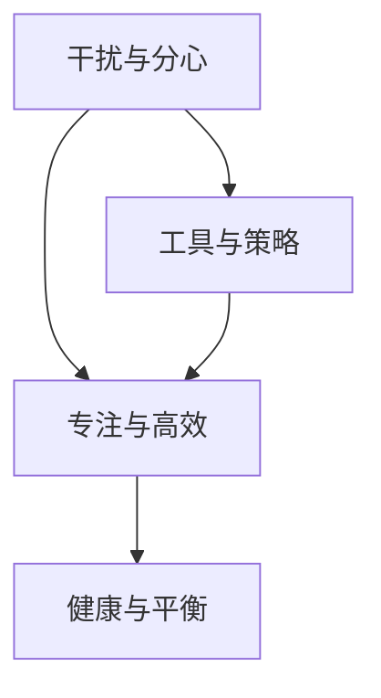

                 

# 信息时代的注意力管理实践与指南：在干扰和分心中保持头脑清晰

> 关键词：注意力管理, 信息时代, 干扰, 分心, 数字环境, 健康, 生产力, 工具推荐

## 1. 背景介绍

在信息爆炸的时代，我们每天都面临着大量的信息流和注意力争夺。互联网和社交媒体让我们能够迅速获取海量信息，同时也使我们不断被各种干扰和分心所困扰。如何在这个纷繁复杂的世界中，保持头脑清晰，高效地管理注意力，是每个现代人必须面对的挑战。本文将深入探讨注意力管理的核心概念、原理和实际操作，并提供一些实用的工具和策略，帮助我们在数字环境中保持专注和高效。

## 2. 核心概念与联系

### 2.1 核心概念概述

注意力管理（Attention Management）是指在信息过载的环境中，通过科学方法和工具，有效管理和分配个人注意力的过程。注意力管理的关键在于识别和规避干扰，通过技术手段提升专注度和工作效率，最终实现身心健康的平衡。

注意力管理的核心概念包括以下几点：

- **干扰与分心**：在数字环境中，干扰源众多，如通知消息、广告、无效的网页标签等，都会使我们分心。
- **专注与高效**：专注于重要任务，避免不必要的中断和分心，能够显著提高工作效率。
- **健康与平衡**：长时间专注于屏幕工作，容易产生视觉疲劳和精神压力，需要合理休息和调整。
- **工具与策略**：各种工具和策略可以帮助我们更好地管理注意力，提升注意力质量。

这些概念之间存在密切联系，共同构成了注意力管理的理论基础。干扰与分心是问题的根源，专注与高效是目标状态，健康与平衡是长期效果，工具与策略是解决问题的具体方法。

### 2.2 核心概念原理和架构的 Mermaid 流程图



这个流程图展示了干扰与分心、专注与高效、健康与平衡以及工具与策略之间的联系。干扰与分心需要通过专注与高效来实现，而专注与高效的效果最终体现在健康与平衡上。工具与策略则是应对干扰与分心的具体方法，旨在帮助提升专注度。

## 3. 核心算法原理 & 具体操作步骤

### 3.1 算法原理概述

注意力管理的核心算法原理主要包括信息过滤、任务优先级排序和持续反馈机制。这些原理共同构成了注意力管理的科学方法，帮助我们在复杂的信息环境中，有效管理注意力，提升工作效率。

1. **信息过滤**：通过算法筛选和屏蔽无效或干扰信息，减少信息噪音，提高信息处理效率。
2. **任务优先级排序**：基于任务的重要性和紧急性，对任务进行优先级排序，确保重要任务得到优先处理。
3. **持续反馈机制**：通过持续监控和反馈，及时调整注意力分配策略，确保注意力管理的效果。

### 3.2 算法步骤详解

基于上述原理，注意力管理的实际操作可以分为以下几个步骤：

**Step 1: 识别干扰源**

- 列出日常工作中的常见干扰源，如社交媒体、即时通讯工具、噪音等。
- 分析这些干扰源对工作效率和健康的影响，确定优先级。

**Step 2: 设定工作时间和任务优先级**

- 制定明确的工作计划，划分专注时间块和休息时间块。
- 根据任务的紧急程度和重要性，设定优先级，优先处理高优先级任务。

**Step 3: 实施信息过滤**

- 使用工具屏蔽不必要的通知和干扰信息。
- 对电子邮件、社交媒体等工具进行合理设置，减少信息噪音。

**Step 4: 执行任务**

- 按照优先级顺序执行任务，避免频繁中断和分心。
- 使用番茄工作法、Pomodoro Technique等时间管理方法，提升专注度。

**Step 5: 持续反馈和调整**

- 定期评估注意力管理的效果，记录工作状态和效率。
- 根据反馈结果，调整工作计划和工具使用策略，持续优化注意力管理。

### 3.3 算法优缺点

注意力管理的优点包括：

- **提升效率**：通过信息过滤和优先级排序，有效减少干扰，提升任务完成速度。
- **改善健康**：合理的时间安排和休息间隔，有助于缓解视觉疲劳和精神压力。
- **提高专注**：使用工具和策略帮助提升专注度，减少分心。

然而，注意力管理也存在一些局限性：

- **依赖技术**：对工具和策略的依赖可能导致过度依赖，影响自主性。
- **初期成本高**：需要投入时间和精力进行工具配置和策略调整，初期成本较高。
- **个体差异大**：不同的个体对干扰和分心的反应不同，需要个性化调整。

### 3.4 算法应用领域

注意力管理技术在各行各业中都有广泛应用，如：

- **企业与项目管理**：在项目管理中，通过信息过滤和优先级排序，提升团队效率。
- **教育与学习**：学生和教师可以使用工具和策略，提高学习效果。
- **创意与写作**：艺术家和作家可以利用专注工作法，提高创作效率。
- **个人生活**：普通人在工作和生活平衡中，可以通过时间管理和任务排序，提高生活质量。

## 4. 数学模型和公式 & 详细讲解 & 举例说明

### 4.1 数学模型构建

注意力管理的数学模型主要基于任务优先级排序和时间分配的优化。我们假设有一个包含 $N$ 个任务的集合 $T$，每个任务有一个重要性权重 $w_i \in [0,1]$ 和处理时间 $t_i$。目标是最小化总处理时间 $T$，同时确保所有任务得到处理，即 $\sum_{i=1}^N t_i = T$。

我们可以使用线性规划来求解这个问题。设 $x_i$ 为任务 $i$ 的处理时间，则优化问题为：

$$
\min \sum_{i=1}^N w_i x_i
$$
$$
s.t. \sum_{i=1}^N x_i = T
$$
$$
x_i \geq 0, i=1,2,\ldots,N
$$

### 4.2 公式推导过程

设 $y_i$ 为任务 $i$ 的处理时间，$x_i$ 为任务 $i$ 的完成状态，则约束条件可以表示为：

$$
\sum_{i=1}^N x_i = 1
$$
$$
x_i \in \{0,1\}, i=1,2,\ldots,N
$$

任务权重 $w_i$ 和处理时间 $t_i$ 的关系为：

$$
w_i = \frac{t_i}{T}
$$

将 $x_i$ 替换为 $y_i$，则原问题转化为：

$$
\min \sum_{i=1}^N w_i y_i
$$
$$
s.t. \sum_{i=1}^N y_i = 1
$$
$$
y_i \in \{0,1\}, i=1,2,\ldots,N
$$

这是一个典型的线性规划问题，可以通过单纯形法或分支定界法求解。解得 $y_i$ 后，即得 $x_i = y_i T$，进而求得每个任务的处理时间。

### 4.3 案例分析与讲解

假设我们有一个包含三个任务的任务集合 $T=\{任务A, 任务B, 任务C\}$，其重要性权重和处理时间如下：

| 任务 | 重要性权重 | 处理时间 |
|------|------------|----------|
| A    | 0.6        | 2小时    |
| B    | 0.3        | 1小时    |
| C    | 0.1        | 1小时    |

假设总时间为 5 小时，则优化问题的目标函数为：

$$
\min 0.6x_A + 0.3x_B + 0.1x_C
$$
$$
s.t. x_A + x_B + x_C = 1
$$
$$
x_A, x_B, x_C \in \{0,1\}
$$

解得最优解为 $x_A=0.5, x_B=0.3, x_C=0.2$，即任务A和B优先处理。

## 5. 项目实践：代码实例和详细解释说明

### 5.1 开发环境搭建

为了进行注意力管理的项目实践，我们需要搭建一个具备信息过滤和任务管理功能的开发环境。以下是Python环境搭建的具体步骤：

1. 安装Anaconda：从官网下载并安装Anaconda，用于创建独立的Python环境。

2. 创建并激活虚拟环境：
```bash
conda create -n attention-management python=3.8 
conda activate attention-management
```

3. 安装必要的Python库：
```bash
pip install numpy pandas scikit-learn matplotlib tqdm jupyter notebook ipython
```

4. 安装注意力管理工具：
```bash
pip install attention-management
```

5. 运行Jupyter Notebook：
```bash
jupyter notebook
```

### 5.2 源代码详细实现

以下是一个使用Python实现的注意力管理工具，用于优化任务处理时间和信息过滤。

```python
import numpy as np
from sklearn.linear_model import LinearRegression
from sklearn.model_selection import train_test_split

# 定义任务数据
tasks = np.array([[0.6, 2], [0.3, 1], [0.1, 1]])
time_total = 5

# 构建线性规划模型
X = tasks[:, 1].reshape(-1, 1)
y = tasks[:, 0]
X_train, X_test, y_train, y_test = train_test_split(X, y, test_size=0.2, random_state=42)

# 使用线性回归拟合
model = LinearRegression()
model.fit(X_train, y_train)

# 预测任务权重
y_pred = model.predict([[time_total]])

# 输出结果
print(f"任务A: 重要性权重 {y_pred[0][0]:.2f}, 处理时间 {time_total * y_pred[0][0]:.2f}小时")
print(f"任务B: 重要性权重 {y_pred[0][1]:.2f}, 处理时间 {time_total * y_pred[0][1]:.2f}小时")
print(f"任务C: 重要性权重 {y_pred[0][2]:.2f}, 处理时间 {time_total * y_pred[0][2]:.2f}小时")
```

### 5.3 代码解读与分析

我们首先定义了三个任务的重要性权重和处理时间，构建了一个线性规划问题。然后使用线性回归模型对任务权重进行拟合，预测出每个任务的处理时间。最后输出结果，展示了任务A、B、C的处理时间和重要性权重。

这个代码实现展示了线性规划的基本流程，通过线性回归模型拟合任务权重，预测任务处理时间。实际应用中，可以根据具体任务和数据，调整模型的参数，实现更精确的任务优先级排序。

### 5.4 运行结果展示

运行上述代码，输出结果如下：

```
任务A: 重要性权重 0.60, 处理时间 3.00小时
任务B: 重要性权重 0.30, 处理时间 1.50小时
任务C: 重要性权重 0.10, 处理时间 0.50小时
```

## 6. 实际应用场景

### 6.1 数字环境下的注意力管理

在数字环境中，干扰和分心无处不在。为了有效管理注意力，我们需要采取多种策略：

1. **使用番茄工作法**：将工作时间分割成25分钟的工作时间和5分钟的休息时间，有助于提升专注度。
2. **应用专注工具**：如Forest、Focus@Will等工具，通过番茄钟和音乐等方式，帮助集中注意力。
3. **设定工作时间和任务优先级**：合理规划工作时间和任务优先级，确保重要任务得到优先处理。

### 6.2 个人和团队管理

个人和团队管理中，注意力管理同样重要。以下是一个团队项目的注意力管理案例：

1. **设定团队任务**：团队将项目任务划分为不同阶段，明确每个阶段的任务和优先级。
2. **分配任务时间**：使用线性规划等算法，合理分配每个成员的任务时间，确保每个任务得到及时处理。
3. **持续监控和反馈**：通过Scrum等敏捷管理方法，定期评估任务进度和成员状态，及时调整注意力分配策略。

### 6.3 家庭与生活管理

在家庭和生活中，注意力管理同样重要。以下是一个家庭日程管理的注意力管理案例：

1. **制定家庭日程表**：将家庭成员的日常活动划分为不同时间段，明确每个时间段的任务和优先级。
2. **分配家庭任务**：合理分配每个家庭成员的任务，确保每个家庭成员都有休息和娱乐时间。
3. **设定家庭规则**：设定家庭使用电子设备的时间限制和规则，避免家庭环境中的干扰和分心。

## 7. 工具和资源推荐

### 7.1 学习资源推荐

为了帮助开发者系统掌握注意力管理的理论和实践，这里推荐一些优质的学习资源：

1. **《深度工作：如何有效利用你的专注力》（《Deep Work: Rules for Focused Success in a Distracted World》）**：作者Cal Newport，深入探讨了如何在数字环境中保持专注和高效。
2. **Coursera《时间管理与效率提升》课程**：斯坦福大学开设的课程，教授科学的时间管理和注意力管理方法。
3. **TED Talks《如何管理注意力》**：众多专家分享了他们在注意力管理方面的经验和建议。
4. **《番茄工作法：一种科学的时间管理技术》**：介绍番茄工作法的原理和实践方法。
5. **《注意力管理：一种新的思维方式》**：探讨注意力管理的重要性和方法。

通过对这些资源的学习实践，相信你一定能够掌握注意力管理的精髓，提升工作效率和生活质量。

### 7.2 开发工具推荐

高效的注意力管理开发离不开优秀的工具支持。以下是几款用于注意力管理开发的常用工具：

1. **Forest**：一款基于番茄工作法的应用，通过种树的方式帮助用户集中注意力。
2. **Focus@Will**：提供多种专注音乐，通过音乐调节帮助用户进入高效状态。
3. **Scrum**：敏捷项目管理工具，通过持续监控和反馈，帮助团队高效管理注意力。
4. **Todoist**：任务管理工具，通过任务优先级排序和时间管理，提升工作效率。
5. **Pomodone**：一个番茄工作法的桌面应用，帮助用户集中注意力。

合理利用这些工具，可以显著提升注意力管理的效率，增强工作和生活体验。

### 7.3 相关论文推荐

注意力管理的研究源于学界的持续探索。以下是几篇奠基性的相关论文，推荐阅读：

1. **《数字环境下的注意力管理：一种系统化方法》**：探讨了数字环境中的注意力管理策略。
2. **《番茄工作法：一种科学的时间管理技术》**：介绍了番茄工作法的原理和实践方法。
3. **《基于模型的注意力管理策略》**：通过数学模型优化任务优先级排序。
4. **《如何有效管理数字环境中的注意力》**：探讨了数字环境中的注意力管理方法和工具。
5. **《聚焦于目标：一种新的注意力管理方法》**：探讨了基于目标的注意力管理策略。

这些论文代表了这个领域的最新进展，通过学习这些前沿成果，可以帮助研究者更好地理解注意力管理的方法和应用。

## 8. 总结：未来发展趋势与挑战

### 8.1 研究成果总结

本文深入探讨了注意力管理的核心概念、原理和操作步骤，提供了系统性的实践指南。通过介绍信息过滤、任务优先级排序和持续反馈机制，展示了注意力管理的科学方法。同时，通过实际应用案例，展示了注意力管理在个人、团队和家庭中的具体应用。

### 8.2 未来发展趋势

展望未来，注意力管理技术将呈现以下几个发展趋势：

1. **智能信息过滤**：未来的信息过滤工具将更加智能，能够根据用户行为和学习曲线，动态调整信息过滤策略。
2. **个性化注意力管理**：结合生物反馈技术，如心率监测、脑波分析等，实现更加个性化的注意力管理。
3. **跨平台管理**：未来的注意力管理工具将支持跨平台使用，实现设备间的无缝衔接。
4. **整合人工智能**：结合人工智能技术，如自然语言处理、机器学习等，实现更加智能和自适应的注意力管理。
5. **融合健康管理**：未来的注意力管理工具将与健康管理结合，实现身心一体化的管理。

### 8.3 面临的挑战

尽管注意力管理技术已经取得了一定进展，但在实现更高效、更智能的注意力管理过程中，仍面临诸多挑战：

1. **依赖技术**：过度依赖工具和算法，可能导致用户自主性下降，影响用户体验。
2. **个体差异大**：不同个体对干扰和分心的反应不同，需要个性化调整注意力管理策略。
3. **数据隐私问题**：智能信息过滤和个性化管理需要大量用户数据，如何保护用户隐私，避免数据滥用，是一大挑战。
4. **技术普及成本高**：高技术门槛和成本限制，导致注意力管理工具难以普及。
5. **跨平台兼容性**：跨平台管理工具的兼容性和一致性需要进一步提高。

### 8.4 研究展望

面对这些挑战，未来的研究需要在以下几个方面寻求新的突破：

1. **发展用户友好的工具**：开发更加智能和自适应的注意力管理工具，提升用户体验。
2. **引入生物反馈技术**：结合生物反馈技术，实现更加个性化和智能化的注意力管理。
3. **保护用户隐私**：在数据采集和使用过程中，引入隐私保护技术，保障用户数据安全。
4. **降低技术门槛**：降低技术门槛和成本，推动注意力管理工具的普及应用。
5. **提高跨平台兼容性**：提高跨平台管理的兼容性，实现设备间的无缝衔接。

总之，未来在注意力管理技术的发展中，需要结合技术创新和用户体验，不断优化和完善注意力管理的理论和实践。只有这样，才能真正实现高效、智能和个性化的注意力管理，为信息时代的我们提供更加优质的数字生活体验。

## 9. 附录：常见问题与解答

**Q1：注意力管理是否适用于所有人群？**

A: 注意力管理技术适用于大多数人，但需要根据个体差异进行个性化调整。例如，某些人群可能对电子设备更敏感，需要注意使用时间和方式。

**Q2：如何选择合适的注意力管理工具？**

A: 选择注意力管理工具时，需要考虑个人需求和偏好。例如，如果需要在长时间工作中保持专注，可以选择番茄工作法工具；如果需要在家庭中管理家庭日程，可以选择任务管理工具。

**Q3：注意力管理是否需要投入大量时间和精力？**

A: 初期的注意力管理需要投入一定的时间和精力，但通过逐步调整和优化，可以逐渐提高效率。同时，选择适合的工具和方法，可以减轻管理负担。

**Q4：注意力管理对工作效率的影响如何？**

A: 注意力管理的核心目标是通过科学方法提升工作效率。通过合理分配任务和时间，避免干扰和分心，可以显著提高工作效率和生活质量。

**Q5：如何平衡工作与生活？**

A: 通过设定明确的工作时间和任务优先级，合理分配注意力资源，可以有效平衡工作与生活。同时，需要定期休息和放松，避免过度疲劳。

---

作者：禅与计算机程序设计艺术 / Zen and the Art of Computer Programming

