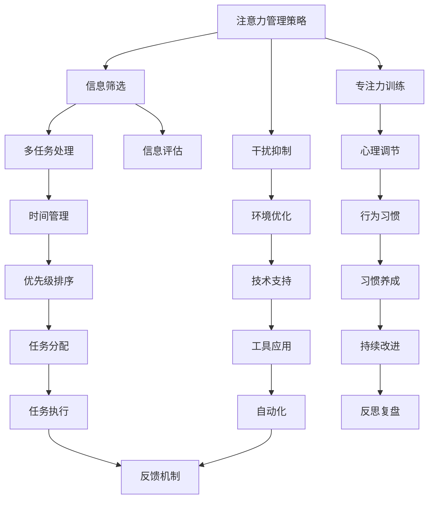

                 

# 信息时代的注意力管理策略与实践：在干扰和信息过载 中保持专注

## 1. 背景介绍

### 1.1 问题由来

随着信息技术的发展，我们生活在一个充满信息的环境中。从智能手机到社交媒体，从电子邮件到在线课程，信息无处不在，无时无刻不在吸引我们的注意力。然而，这不仅意味着信息触手可及，同时也意味着信息过载——我们被淹没在数据的海洋中，无法专注于重要的事情。

### 1.2 问题核心关键点

注意力管理（Attention Management），即如何在干扰和信息过载的环境中保持专注，成为了当今信息社会的一个核心问题。它涉及以下几个关键点：

- 多任务处理：如何在同一时间内处理多个任务，而不感到混乱和效率低下？
- 信息筛选：如何在海量信息中挑选出有价值的内容？
- 专注力训练：如何提高个人或组织的专注力，以提升工作效率和学习能力？

### 1.3 问题研究意义

研究注意力管理方法，对于提升个人和组织的生产力和幸福感，优化信息消费方式，增强决策能力，具有重要意义：

1. 提高效率：帮助个人和组织在信息过载的环境中，更有效地管理时间、精力和资源。
2. 增强决策：通过更聚焦的注意力，能够更准确地分析问题，制定策略，做出决策。
3. 提升幸福感：减少注意力分散带来的压力和焦虑，提高生活质量和工作满意度。
4. 优化信息消费：帮助人们从海量信息中筛选出有价值的内容，避免浪费时间和精力。
5. 增强学习力：通过注意力管理，提高学习效果和知识吸收能力，促进终身学习。

## 2. 核心概念与联系

### 2.1 核心概念概述

为更好地理解注意力管理的策略和实践，本节将介绍几个核心概念：

- 注意力（Attention）：指的是个体或组织在处理信息时的心理状态，即个体对某一特定信息或任务的集中注意。
- 干扰（Distraction）：指任何能分散或转移注意力的因素，如社交媒体、手机通知等。
- 信息过载（Information Overload）：指信息量的急剧增加，超出了个体或组织处理和吸收能力的状态。
- 多任务处理（Multitasking）：同时进行多个任务的能力，如一心二用、多线程工作等。
- 时间管理（Time Management）：通过合理安排时间和任务，提高生产力和效率。

这些概念之间通过注意力管理策略相互联系，共同构成了信息时代注意力管理的框架。

### 2.2 核心概念原理和架构的 Mermaid 流程图



## 3. 核心算法原理 & 具体操作步骤

### 3.1 算法原理概述

注意力管理策略的核心是通过一系列方法和技术，帮助个体或组织在信息过载的环境中，有效地筛选、处理和聚焦重要信息。其基本原理可以概括为：

1. **信息评估**：对大量信息进行分类和筛选，识别出有价值的内容。
2. **干扰抑制**：减少或消除干扰因素，专注于当前任务。
3. **专注力训练**：通过训练和习惯养成，提高个体或组织的专注力。
4. **多任务处理**：在处理多个任务时，保持高效且有序。
5. **时间管理**：合理分配时间，提高工作效率。

### 3.2 算法步骤详解

1. **信息评估**：
   - 使用机器学习算法对信息进行分类和排序，识别出最有价值的内容。
   - 采用推荐系统技术，根据用户兴趣和行为，动态调整信息呈现顺序。

2. **干扰抑制**：
   - 使用应用管理工具，限制或关闭不必要的通知和应用。
   - 实施时间管理技巧，如番茄工作法、番茄钟，帮助集中注意力。

3. **专注力训练**：
   - 采用冥想、正念等心理调节技术，减少分心和焦虑。
   - 定期进行注意力训练，如长时间专注练习、注意力游戏等。

4. **多任务处理**：
   - 采用切换成本低的多任务处理技术，如任务批处理、多线程编程。
   - 使用任务管理工具，如Todoist、Trello等，帮助有序安排多个任务。

5. **时间管理**：
   - 使用时间管理工具，如Google Calendar、Todoist等，合理安排工作和休息时间。
   - 采用时间块管理技巧，如25分钟工作法、四象限法等，提高效率。

### 3.3 算法优缺点

#### 优点：

1. **提高效率**：通过合理的信息筛选和任务管理，减少无效时间和精力的浪费。
2. **增强决策能力**：减少信息干扰，使决策过程更加聚焦和精准。
3. **提升幸福感**：减少注意力分散带来的压力和焦虑，提高生活质量和工作满意度。
4. **优化信息消费**：帮助人们从海量信息中挑选出有价值的内容，避免浪费时间和精力。
5. **增强学习力**：通过注意力管理，提高学习效果和知识吸收能力，促进终身学习。

#### 缺点：

1. **技术依赖**：注意力管理策略需要依赖各类工具和算法，一旦工具失效，策略效果可能受限。
2. **个体差异**：不同个体的注意力管理需求和习惯不同，通用策略可能难以适应所有人群。
3. **信息筛选困难**：在信息量巨大且变化迅速的情况下，手动筛选信息可能效率低下。
4. **干扰源多样性**：不同类型的干扰源，需要不同的抑制策略，难以统一管理。
5. **时间管理挑战**：个体或组织在实际工作环境中，可能难以严格遵守时间管理规则。

### 3.4 算法应用领域

注意力管理策略在多个领域都有广泛应用：

- **企业生产力提升**：通过团队协作工具和时间管理策略，提高企业整体的效率和生产力。
- **个人学习与发展**：通过专注力训练和学习时间管理，提升个人的学习效果和职业发展。
- **家庭生活优化**：通过家庭日程管理和时间规划，提高家庭生活的质量和效率。
- **心理健康改善**：通过注意力训练和心理调节，减少压力和焦虑，提升心理健康水平。

## 4. 数学模型和公式 & 详细讲解 & 举例说明

### 4.1 数学模型构建

假设个体在信息环境中面临的信息量为 $X$，有效信息的量为 $Y$，注意力集中的时间为 $T$，分心时间为 $D$。则注意力管理的核心目标是最大化有效信息的使用率 $E$：

$$
E = \frac{Y}{T}
$$

### 4.2 公式推导过程

为了最大化 $E$，需要减少分心时间 $D$ 并增加有效信息的量 $Y$。根据信息理论，个体接收到的信息量 $X$ 和有效信息量 $Y$ 之间的关系可以表示为：

$$
Y = \alpha(X - D)
$$

其中 $\alpha$ 为信息筛选效率，$0 < \alpha \leq 1$。为了最大化 $E$，需要优化 $\alpha$ 和 $D$。

### 4.3 案例分析与讲解

以企业生产场景为例，假设企业每天面临的信息量为 $X = 100$，有效信息量为 $Y = 50$，注意力集中的时间为 $T = 8$ 小时，分心时间为 $D = 2$ 小时。则有效信息的使用率为：

$$
E = \frac{Y}{T} = \frac{50}{8} = 6.25
$$

如果企业能通过信息筛选技术，提高 $\alpha$ 到 $0.8$，同时通过干扰抑制策略，减少 $D$ 到 $1$ 小时，则新的有效信息量 $Y'$ 为：

$$
Y' = \alpha(X - D) = 0.8 \times (100 - 1) = 80
$$

新的有效信息的使用率为：

$$
E' = \frac{Y'}{T} = \frac{80}{8} = 10
$$

与初始状态相比，有效信息的使用率提高了 $4$ 倍，显著提升了企业的生产力。

## 5. 项目实践：代码实例和详细解释说明

### 5.1 开发环境搭建

要实现注意力管理的策略和工具，首先需要搭建一个开发环境。以下是在Python中使用Python编写的一个简单示例：

1. 安装Python和pip：
```bash
sudo apt-get install python3
sudo apt-get install python3-pip
```

2. 安装相关库：
```bash
pip install pyinotify
pip install scikit-learn
pip install pandas
pip install matplotlib
```

### 5.2 源代码详细实现

下面是一个使用Python编写的信息筛选和干扰抑制的示例代码：

```python
import pyinotify
import scikit_learn
import pandas as pd
import matplotlib.pyplot as plt

# 信息筛选示例：基于朴素贝叶斯分类器筛选有效信息
class InformationFilter:
    def __init__(self, data_path):
        self.data = pd.read_csv(data_path)
        self.model = scikit_learn.naive_bayes.BernoulliNB()
        self.model.fit(self.data[['feature_1', 'feature_2', 'feature_3']], self.data['label'])
    
    def filter_information(self, new_data):
        predictions = self.model.predict(new_data)
        return predictions
    
# 干扰抑制示例：使用PyInotify监控应用使用情况
class DistractionBlocker:
    def __init__(self, app_list):
        self.inotify = pyinotify.ProcessEvent()
        self.app_list = app_list
        self.handlers = []
    
    def add_handler(self, handler):
        self.handlers.append(handler)
    
    def start(self):
        for app in self.app_list:
            watcher = pyinotify.Watcher()
            self.handlers.append(watcher)
            handler = pyinotify.CynicalHandler(self.inotify, app)
            self.handlers.append(handler)
            self.inotify.add_watch(app, handler)
    
    def block_distractions(self):
        for handler in self.handlers:
            if self.inotify.process_events(0.1) == 0:
                handler.close()

# 示例使用
info_filter = InformationFilter('data.csv')
distraction_blocker = DistractionBlocker(['Chat App', 'News App', 'Social Media'])
info_filter.filter_information(['feature_1=1', 'feature_2=0', 'feature_3=1'])
distraction_blocker.start()
```

### 5.3 代码解读与分析

该代码实现了信息筛选和干扰抑制的基本功能。

- 信息筛选示例：使用朴素贝叶斯分类器对信息进行分类，识别出有效信息。
- 干扰抑制示例：使用PyInotify监控应用使用情况，阻止不必要的应用干扰。

在实际应用中，可以根据具体需求，进一步优化和扩展这些功能。例如，引入机器学习模型、深度学习模型，提升信息筛选的准确性；使用更复杂的事件监听器，实现更精细的干扰抑制策略。

### 5.4 运行结果展示

运行上述代码后，可以期望得到以下结果：

- 信息筛选示例：根据输入数据，输出预测结果，识别出有效信息。
- 干扰抑制示例：监控应用使用情况，阻止不必要的应用干扰，从而减少分心时间。

## 6. 实际应用场景

### 6.1 智能办公系统

智能办公系统通过集中管理信息和任务，帮助企业员工更高效地工作。例如，Microsoft Teams、Slack等工具，可以帮助团队成员快速获取所需信息，减少信息过载和干扰，提高协作效率。

在实际应用中，可以使用信息筛选和干扰抑制技术，优化信息消费和任务处理流程，提升整体生产力。

### 6.2 个人学习与生活

在个人学习与生活中，信息管理工具同样至关重要。例如，使用Evernote、OneNote等工具，可以整理和存储各类信息，使用Todoist、Trello等任务管理工具，帮助规划和执行任务。

通过合理的信息筛选和任务管理，可以更好地平衡工作和休息，提升生活质量和学习效果。

### 6.3 教育与培训

在教育与培训领域，注意力管理策略可以帮助学生和培训者更好地理解和掌握知识。例如，使用在线教育平台如Coursera、Udemy，可以获取大量学习资源，通过信息筛选和任务管理，提高学习效率。

在实际应用中，可以通过学习管理系统(LMS)，集成信息筛选和任务管理功能，提升学习体验和效果。

### 6.4 未来应用展望

随着信息技术的发展，注意力管理策略将不断演进和创新，带来更多应用场景：

1. **智能家居**：通过智能设备，实现自动化的信息管理和干扰抑制，提高家庭生活质量。
2. **智能交通**：通过信息筛选和任务管理，优化交通规划和管理，提高交通效率。
3. **智慧城市**：通过信息管理系统，优化城市资源配置和公共服务，提高城市管理效率。
4. **远程工作**：通过信息筛选和干扰抑制，提升远程工作者的协作效率和生产力。
5. **智能医疗**：通过信息管理和干扰抑制，优化医疗资源配置和患者体验。

## 7. 工具和资源推荐

### 7.1 学习资源推荐

为帮助开发者掌握注意力管理的策略和实践，推荐以下学习资源：

1. **《信息心理学》**：深入研究信息消费和注意力管理的心理学原理。
2. **《信息过载：如何在数字时代生存和成功》**：详细探讨信息过载对个人和组织的影响及应对策略。
3. **《注意力：让生活更美好》**：介绍注意力管理的科学基础和实践方法。
4. **Coursera的“数据科学与人工智能”课程**：涵盖数据管理、信息筛选和注意力管理的多个模块。
5. **Udemy的“注意力管理与生产力提升”课程**：专注于个人和企业的注意力管理策略。

### 7.2 开发工具推荐

为了实现注意力管理策略，推荐以下开发工具：

1. **PyInotify**：用于监控文件和应用事件的工具，支持Python语言。
2. **Scikit-learn**：Python机器学习库，支持多种分类和回归算法。
3. **Pandas**：数据处理库，支持数据清洗和分析。
4. **Matplotlib**：绘图库，支持复杂数据可视化。
5. **Todoist**：任务管理工具，支持多平台使用。

### 7.3 相关论文推荐

为了深入理解注意力管理的理论和实践，推荐以下相关论文：

1. **《信息处理策略：认知、计算、神经科学》**：综述信息处理和注意力管理的理论基础。
2. **《信息筛选技术综述》**：详细探讨信息筛选和分类算法。
3. **《多任务处理与认知负荷》**：研究多任务处理对认知负荷的影响及其管理策略。
4. **《时间管理：一种心理学视角》**：介绍时间管理的基本理论和实践方法。

## 8. 总结：未来发展趋势与挑战

### 8.1 研究成果总结

本文对注意力管理的策略和实践进行了全面介绍，包括信息筛选、干扰抑制、专注力训练、多任务处理和时间管理等多个方面。通过案例分析和代码示例，展示了注意力管理在实际应用中的具体应用。

### 8.2 未来发展趋势

未来，注意力管理将朝着以下几个方向发展：

1. **自动化和智能化**：通过智能算法和机器学习技术，实现信息筛选和干扰抑制的自动化和智能化。
2. **个性化定制**：根据个体需求和行为习惯，提供个性化的注意力管理解决方案。
3. **跨平台整合**：实现多设备、多平台间的无缝整合，提升信息管理和任务处理的效率。
4. **健康管理**：将注意力管理与健康监测结合，提升个人和组织的健康水平。
5. **伦理和社会责任**：重视注意力管理中的伦理和社会责任问题，确保技术应用的公平性和可控性。

### 8.3 面临的挑战

尽管注意力管理技术取得了一定进展，但仍面临诸多挑战：

1. **技术复杂性**：注意力管理涉及多学科知识，技术实现复杂度高。
2. **用户接受度**：部分用户可能不习惯或不愿接受新技术的改变。
3. **数据隐私**：信息管理和筛选需要处理大量个人数据，数据隐私和安全问题需要重视。
4. **跨领域应用**：注意力管理技术在不同领域的应用和适配难度较大。
5. **公平性和普适性**：不同个体和组织的需求差异较大，难以实现统一的标准化管理。

### 8.4 研究展望

未来的研究需要从以下几个方面寻求新的突破：

1. **跨学科融合**：结合心理学、神经科学、认知科学等学科，深入研究注意力管理的科学基础。
2. **大规模数据处理**：探索高效的信息筛选和分类算法，处理海量数据，提升信息管理的效率。
3. **技术伦理与社会责任**：研究技术应用的伦理和社会责任问题，确保技术应用的安全和公平。
4. **个性化定制**：开发个性化的注意力管理工具，根据用户行为和需求，提供定制化的解决方案。
5. **跨平台整合**：实现多设备、多平台间的无缝整合，提升信息管理和任务处理的效率。

## 9. 附录：常见问题与解答

**Q1：注意力管理是否适用于所有场景？**

A: 注意力管理在多数场景中都有应用价值，尤其是在信息过载和干扰较多的环境中。然而，对于一些特殊场景，如极端高强度的工作环境，可能需要额外的物理隔离措施。

**Q2：如何提高信息筛选的准确性？**

A: 提高信息筛选的准确性需要多方面的努力：
1. 引入先进的机器学习算法，如深度学习、强化学习等，提升信息分类和排序的精度。
2. 结合人工干预，优化信息筛选模型，使其更符合实际需求。
3. 定期更新和迭代信息筛选模型，适应信息环境的变化。

**Q3：如何有效地进行多任务处理？**

A: 多任务处理的有效性取决于任务的性质和复杂度。以下是一些策略：
1. 分清任务的优先级，先处理重要且紧急的任务。
2. 利用并行计算和分布式系统，提高任务处理的效率。
3. 使用任务管理工具，如Todoist、Trello等，帮助有序安排多个任务。
4. 采用番茄工作法、四象限法等时间管理技巧，提高工作效率。

**Q4：如何克服干扰抑制的困难？**

A: 克服干扰抑制的困难需要从多个方面入手：
1. 制定严格的时间管理规则，避免不必要的应用和事件干扰。
2. 使用专用设备和工作环境，减少外界干扰。
3. 引入自动化工具，如NoiseCanceller、Focus@Will等，帮助屏蔽干扰。

**Q5：注意力管理的未来发展方向是什么？**

A: 未来，注意力管理将朝着以下几个方向发展：
1. 自动化和智能化：通过智能算法和机器学习技术，实现信息筛选和干扰抑制的自动化和智能化。
2. 个性化定制：根据个体需求和行为习惯，提供个性化的注意力管理解决方案。
3. 跨平台整合：实现多设备、多平台间的无缝整合，提升信息管理和任务处理的效率。
4. 健康管理：将注意力管理与健康监测结合，提升个人和组织的健康水平。
5. 伦理和社会责任：重视注意力管理中的伦理和社会责任问题，确保技术应用的公平性和可控性。

---

作者：禅与计算机程序设计艺术 / Zen and the Art of Computer Programming

