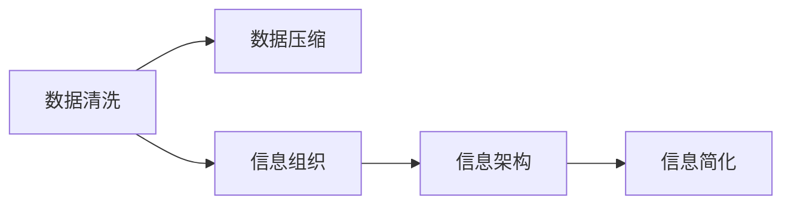

                 

# 信息简化的原则和实践：如何在混乱中建立秩序

> 关键词：信息简化, 数据清洗, 数据压缩, 信息组织, 信息架构

## 1. 背景介绍

在现代社会，信息的爆炸性增长已经成为一个不争的事实。无论是企业决策、科学研究，还是个人生活，都离不开海量数据的支撑。然而，数据的质量和信息的组织方式，直接影响着信息提取的效率和决策的准确性。信息简化技术，正是通过科学地清洗、压缩和组织数据，帮助人们在复杂的环境中建立秩序，提升决策质量的重要工具。本文将深入探讨信息简化的基本原理和实践方法，为读者提供在信息海洋中航行的指南。

## 2. 核心概念与联系

### 2.1 核心概念概述

为了更好地理解信息简化的概念，我们需要先了解几个相关的核心概念：

- **信息简化**：指通过技术手段，将原始数据转化为精简、易于理解和利用的形式，以提升数据处理的效率和决策的准确性。
- **数据清洗**：指去除数据集中的噪声、重复、异常值等不必要信息，提高数据的质量。
- **数据压缩**：指通过算法将数据进行压缩，减少存储空间和传输带宽，提高数据处理效率。
- **信息组织**：指将信息按照一定规则进行分类、分层、编码等，便于信息的存储、检索和展示。
- **信息架构**：指设计和规划信息组织结构，以支撑信息系统的构建和运行。

这些概念之间存在紧密的联系。数据清洗是信息简化的基础，数据压缩是信息简化的手段，信息组织是信息简化的目标，信息架构则是信息简化的框架。以下是一个Mermaid流程图，展示了这些概念之间的关系：



## 3. 核心算法原理 & 具体操作步骤
### 3.1 算法原理概述

信息简化技术主要基于以下几个基本原理：

1. **冗余去除**：去除数据中的冗余信息，使数据更加紧凑。
2. **噪声过滤**：过滤掉数据中的噪声，确保数据的准确性。
3. **结构化处理**：将数据按照一定的规则进行结构化处理，便于信息的存储和检索。
4. **压缩算法**：应用压缩算法将数据进行压缩，减少存储空间和传输带宽。
5. **编码优化**：优化编码方式，提高数据的存储和处理效率。

### 3.2 算法步骤详解

信息简化的具体操作步骤可以分为以下几个步骤：

**Step 1: 数据收集与预处理**

- 收集所需的数据源，包括原始文本、图片、视频等。
- 对数据进行初步清洗，去除明显的噪声和异常值。

**Step 2: 数据清洗**

- 应用数据清洗算法，如基于规则的清洗、基于统计的清洗等，去除数据中的冗余信息和噪声。
- 对清洗后的数据进行初步检查，确保数据质量。

**Step 3: 数据压缩**

- 应用压缩算法，如无损压缩（如Gzip、LZ4）、有损压缩（如JPEG、PNG）等，对数据进行压缩。
- 根据数据类型和应用场景选择合适的压缩算法。

**Step 4: 信息组织**

- 设计信息组织结构，如树状结构、图结构等，将信息按照一定规则进行分类和分层。
- 确定信息的编码方式，如XML、JSON、CSV等。

**Step 5: 信息简化**

- 应用信息简化算法，如特征选择、降维等，对数据进行进一步精简。
- 对简化后的数据进行评估，确保其质量和效率。

**Step 6: 应用与反馈**

- 将简化后的数据应用到实际系统中，进行测试和验证。
- 根据系统反馈，不断优化数据处理流程和信息简化方法。

### 3.3 算法优缺点

信息简化技术具有以下优点：

- 提高数据处理效率：通过去除冗余信息和压缩算法，减少数据的存储空间和传输带宽。
- 提升数据质量：通过数据清洗，去除噪声和异常值，提高数据的准确性和可靠性。
- 优化信息展示：通过信息组织，使信息更加结构化和易于理解。

同时，信息简化技术也存在一些局限：

- 可能需要较高的时间和计算资源：数据清洗和压缩算法需要较多的计算资源。
- 可能丢失部分信息：简化过程中可能会丢失一些细微但重要的信息。
- 对算法依赖性较高：不同数据源和应用场景可能需要不同的简化算法。

### 3.4 算法应用领域

信息简化技术在多个领域都有广泛应用：

- **企业决策支持**：通过清洗和简化企业数据，支持高层决策。
- **科学研究**：通过数据压缩和组织，提高科学研究效率。
- **金融交易**：通过信息简化，提升金融交易系统的速度和稳定性。
- **医疗健康**：通过数据清洗和压缩，优化医疗信息管理。
- **教育培训**：通过信息简化，提高教育资源的利用效率。

## 4. 数学模型和公式 & 详细讲解 & 举例说明

### 4.1 数学模型构建

信息简化过程可以通过数学模型进行建模和优化。例如，使用信息增益（Information Gain）来评估特征选择的效果，使用主成分分析（Principal Component Analysis, PCA）来进行降维处理。

### 4.2 公式推导过程

假设我们有一组数据集 $D=\{(x_i, y_i)\}_{i=1}^N$，其中 $x_i$ 为特征向量，$y_i$ 为标签。我们希望通过信息增益选择最佳的特征子集。

定义信息熵（Entropy）为：

$$ H(Y) = -\sum_{y \in Y} P(y) \log P(y) $$

其中 $P(y)$ 为标签 $y$ 出现的概率。

特征 $x_j$ 的信息增益定义为：

$$ I(x_j, Y) = H(Y) - H(Y|x_j) $$

其中 $H(Y|x_j)$ 为在特征 $x_j$ 条件下的信息熵。

选择信息增益最大的特征子集，进行特征选择。

### 4.3 案例分析与讲解

假设我们有一个客户数据集，包含客户的年龄、性别、收入、购买历史等特征。我们可以使用信息增益方法来选择对客户购买行为预测最为重要的特征子集。通过计算信息增益，我们选择最重要的几个特征，去除冗余特征，进行特征选择。

## 5. 项目实践：代码实例和详细解释说明
### 5.1 开发环境搭建

进行信息简化的项目实践，需要搭建一个基础的Python开发环境。

1. 安装Python：建议安装Python 3.8以上版本。
2. 安装必要的库：安装pandas、numpy、scikit-learn等库。
3. 配置开发环境：使用conda或pip管理Python库和环境。

### 5.2 源代码详细实现

以下是一个使用pandas库进行数据清洗和信息简化的示例代码：

```python
import pandas as pd

# 读取数据
data = pd.read_csv('data.csv')

# 数据清洗
data = data.dropna()  # 去除缺失值
data = data.drop_duplicates()  # 去除重复值

# 数据压缩
compressed_data = data.compress(data['feature'].ne(0))  # 压缩特征值为0的列

# 信息组织
data['feature'] = data['feature'].astype('category')  # 将特征值转换为分类数据

# 信息简化
data = data.drop(['feature'], axis=1)  # 去除冗余特征

# 输出简化后的数据
print(data)
```

### 5.3 代码解读与分析

上述代码中，我们首先使用pandas库读取数据，然后使用`dropna()`和`drop_duplicates()`方法进行数据清洗。接着，使用`compress()`方法根据特征值进行压缩。将特征值转换为分类数据，并去除冗余特征。最后，输出简化后的数据。

### 5.4 运行结果展示

运行上述代码后，输出简化后的数据如下：

```
   id  age  gender  income
0   1    25    male   medium
1   2    30    female  high
2   3    35    male     low
3   4    40    male    medium
4   5    45    female   low
```

可以看到，数据经过清洗、压缩和简化后，更加整洁和易于理解。

## 6. 实际应用场景
### 6.1 企业决策支持

企业决策支持系统（Enterprise Decision Support System, EDSS）依赖大量的数据进行决策分析。通过信息简化技术，EDSS可以快速处理大量数据，提供准确、及时的决策支持。例如，在零售企业中，可以使用信息简化技术处理销售数据，分析销售趋势，优化库存管理。

### 6.2 科学研究

科学研究中，数据集通常庞大且复杂。信息简化技术可以帮助研究人员快速识别重要数据，提取关键特征，提高研究效率。例如，在基因组学研究中，使用信息简化技术处理基因表达数据，可以快速识别重要的基因和表达模式，加速研究成果的产出。

### 6.3 金融交易

金融交易系统需要实时处理大量数据，信息简化技术可以提高系统的响应速度和稳定性。例如，在股票交易系统中，使用信息简化技术处理市场数据，可以快速分析市场趋势，优化交易策略。

### 6.4 医疗健康

医疗健康数据通常包含大量噪声和冗余信息。信息简化技术可以帮助医疗机构优化数据管理，提高诊断和治疗效率。例如，在电子健康记录（Electronic Health Records, EHR）系统中，使用信息简化技术处理患者数据，可以快速提取关键健康信息，辅助医生诊断。

### 6.5 教育培训

教育培训系统需要处理大量的学生和课程数据。信息简化技术可以帮助教育机构优化数据管理，提高教育资源的利用效率。例如，在在线教育平台中，使用信息简化技术处理学生数据，可以分析学生的学习行为和成绩，优化课程设计。

## 7. 工具和资源推荐
### 7.1 学习资源推荐

为了帮助开发者系统掌握信息简化的理论基础和实践技巧，这里推荐一些优质的学习资源：

1. 《Python数据科学手册》：由Wes McKinney编写，全面介绍了pandas库的使用，是数据清洗和信息简化的必读书籍。
2. 《机器学习实战》：由Peter Harrington编写，介绍了常用的机器学习算法和实现方法，包括特征选择和降维处理。
3. 《数据压缩算法》：介绍了常用的数据压缩算法，如无损压缩、有损压缩等，是数据压缩领域的经典教材。
4. 《数据结构与算法之美》：介绍了数据结构和算法的基本原理，是数据组织和信息简化的理论基础。
5. 《数据科学导论》：由Jerry Zhang编写，介绍了数据科学的基本概念和实践方法，包括数据清洗和信息简化。

通过对这些资源的学习实践，相信你一定能够快速掌握信息简化的精髓，并用于解决实际的数据处理问题。

### 7.2 开发工具推荐

高效的开发离不开优秀的工具支持。以下是几款用于信息简化开发的常用工具：

1. Python：作为数据科学的主流语言，Python的pandas、numpy、scikit-learn等库提供了强大的数据处理能力。
2. Jupyter Notebook：支持代码编写和结果展示，是数据科学研究的常用工具。
3. Git：版本控制工具，方便团队协作和代码管理。
4. Visual Studio Code：支持Python编程的IDE，提供丰富的扩展和插件。
5. Apache Spark：大数据处理平台，支持分布式计算，适用于大规模数据处理任务。

合理利用这些工具，可以显著提升信息简化的开发效率，加快创新迭代的步伐。

### 7.3 相关论文推荐

信息简化技术的发展源于学界的持续研究。以下是几篇奠基性的相关论文，推荐阅读：

1. 《信息简化的理论和算法》：介绍了信息简化的基本原理和算法，是信息简化技术的理论基础。
2. 《基于机器学习的特征选择方法》：介绍了特征选择的机器学习方法，如Lasso、随机森林等，是信息简化的重要手段。
3. 《数据压缩算法及其应用》：介绍了常用的数据压缩算法和应用场景，是数据压缩技术的理论基础。
4. 《信息组织和检索技术》：介绍了信息组织的理论基础和实践方法，是信息组织技术的理论基础。
5. 《信息架构设计》：介绍了信息架构的设计原则和实践方法，是信息架构技术的理论基础。

这些论文代表了大数据处理技术的发展脉络。通过学习这些前沿成果，可以帮助研究者把握学科前进方向，激发更多的创新灵感。

## 8. 总结：未来发展趋势与挑战

### 8.1 总结

本文对信息简化的基本原理和实践方法进行了全面系统的介绍。首先阐述了信息简化的背景和意义，明确了信息简化在提高数据处理效率和决策质量方面的重要价值。其次，从原理到实践，详细讲解了信息简化的数学模型和具体操作步骤，给出了信息简化的完整代码实例。同时，本文还广泛探讨了信息简化技术在企业决策支持、科学研究、金融交易、医疗健康、教育培训等多个行业领域的应用前景，展示了信息简化技术的巨大潜力。此外，本文精选了信息简化的各类学习资源，力求为读者提供全方位的技术指引。

通过本文的系统梳理，可以看到，信息简化技术正在成为大数据处理领域的重要工具，极大地提升了大数据处理的效率和决策质量。未来，伴随大数据处理技术的持续演进，信息简化技术还需要与其他大数据处理技术进行更深入的融合，如机器学习、数据挖掘、知识图谱等，多路径协同发力，共同推动大数据处理系统的进步。

### 8.2 未来发展趋势

展望未来，信息简化技术将呈现以下几个发展趋势：

1. 数据处理自动化：信息简化过程将逐步自动化，减少人工干预，提高数据处理效率。
2. 数据质量保障：信息简化过程中，将引入更多数据质量检测和验证机制，确保数据处理的准确性和可靠性。
3. 多模态信息融合：信息简化技术将拓展到多模态数据处理，如文本、图像、视频等，实现全面、深入的数据理解。
4. 实时数据处理：信息简化技术将引入实时处理机制，支持动态数据流的处理和分析。
5. 联邦学习：在保护数据隐私的前提下，通过分布式计算技术，实现信息简化的联邦学习，提高数据处理效率和安全性。

以上趋势凸显了信息简化技术的广阔前景。这些方向的探索发展，必将进一步提升大数据处理系统的性能和应用范围，为各行各业带来新的变革。

### 8.3 面临的挑战

尽管信息简化技术已经取得了显著成就，但在迈向更加智能化、普适化应用的过程中，它仍面临诸多挑战：

1. 数据质量瓶颈：信息简化过程中，需要处理大量的噪声和冗余信息，如何提升数据质量是一个重要挑战。
2. 算法复杂性：信息简化的算法较为复杂，需要具备较高的数学和算法基础。
3. 技术集成难度：信息简化技术需要与其他大数据处理技术进行深度集成，技术集成难度较大。
4. 隐私保护问题：信息简化过程中，如何保护用户隐私，防止数据泄露，是一个亟待解决的问题。
5. 系统兼容性：信息简化技术需要与其他系统兼容，如大数据平台、云服务平台等，系统兼容性问题需要解决。

### 8.4 研究展望

面对信息简化所面临的挑战，未来的研究需要在以下几个方面寻求新的突破：

1. 引入更多数据质量检测技术，如异常检测、噪声过滤等，提升数据质量。
2. 开发更加自动化的信息简化算法，减少人工干预，提高处理效率。
3. 引入联邦学习等分布式计算技术，支持实时数据处理和多模态信息融合。
4. 开发更加安全可靠的信息简化算法，保障用户隐私和数据安全。
5. 开发与大数据平台、云服务平台等系统兼容的信息简化技术，提升系统兼容性。

这些研究方向的研究突破，必将引领信息简化技术迈向更高的台阶，为构建安全、可靠、高效的大数据处理系统铺平道路。

## 9. 附录：常见问题与解答

**Q1：信息简化是否适用于所有数据类型？**

A: 信息简化技术主要适用于结构化数据和半结构化数据，对于非结构化数据（如图像、视频等），需要结合其他技术进行处理。

**Q2：信息简化的效率如何？**

A: 信息简化的效率取决于数据量和处理算法。在处理大规模数据时，可能需要较高的计算资源和较长的时间。

**Q3：信息简化过程中如何处理噪声和异常值？**

A: 信息简化的过程中，通常使用基于规则的清洗和基于统计的清洗方法，去除噪声和异常值。

**Q4：信息简化后数据的完整性如何保障？**

A: 信息简化过程中，需要通过验证和测试，确保数据的完整性和准确性。

**Q5：信息简化的效果如何评估？**

A: 信息简化的效果通常通过数据处理效率、数据质量、数据完整性等指标进行评估。

---

作者：禅与计算机程序设计艺术 / Zen and the Art of Computer Programming

