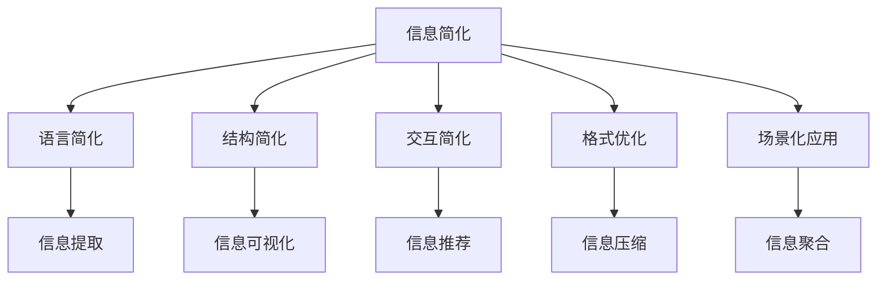

                 

## 1. 背景介绍

### 1.1 问题由来

在信息化时代，数据量爆炸式增长，信息传播速度快、范围广，个人和企业面临的信息过载问题日益严重。尽管有了搜索引擎和大数据技术的支持，但人们仍难以从中快速获取关键信息。同时，数据的复杂性和多样性也给信息的获取和处理带来了新的挑战。

为解决这一问题，研究者提出并应用了信息简化的艺术与实践。信息简化旨在通过精炼语言、简化结构、提升可用性，将复杂的信息转化为易于理解和操作的形式。这一过程不仅依赖于先进的算法和工具，还需结合心理学、社会学等多个学科的知识。

信息简化不仅是技术问题，更是一种艺术，它要求在保证信息准确性的同时，创造性地应用技术手段，使信息更易于理解和应用。本文将从技术、艺术和应用等多个角度，深入探讨信息简化的艺术与实践。

### 1.2 问题核心关键点

信息简化的核心目标是将复杂信息转化为简单、易懂、易用的形式，具体包括：

- **语言简化**：使用通俗易懂的语言表达复杂概念，减少专业术语的使用。
- **结构简化**：通过分层、分块、概括等方法，使信息层次分明，便于理解。
- **交互简化**：设计直观的操作界面，减少用户操作步骤，提升用户体验。
- **格式优化**：使用图表、列表、动画等非文本格式，直观呈现信息。
- **场景化应用**：将信息嵌入具体场景，提供个性化推荐，提高信息的可操作性。

本文将聚焦于信息简化的核心算法与实践，探讨如何通过技术手段实现信息简化，以及其在实际应用中的关键技巧和策略。

## 2. 核心概念与联系

### 2.1 核心概念概述

为更好地理解信息简化的艺术与实践，本节将介绍几个关键概念：

- **信息简化**：将复杂的信息转化为简单、易懂、易用的形式。通过精炼语言、简化结构、提升可用性，使信息更易于理解和操作。

- **信息分类**：将信息按不同属性或领域进行分类，如技术文档、报告、会议记录等，便于信息管理和检索。

- **信息提取**：从原始文本中自动提取关键信息，如摘要、关键字、实体等，快速获取信息核心内容。

- **信息可视化**：通过图表、动画、交互式仪表盘等形式，直观展示信息，帮助用户快速理解数据。

- **信息推荐**：根据用户兴趣、行为数据等，推荐相关内容，提高信息获取效率。

- **信息压缩**：使用编码技术将信息压缩，减少存储空间，提高传输效率。

- **信息聚合**：将多源信息整合，形成完整的信息视图，支持多角度分析。

这些核心概念共同构成了信息简化的基本框架，通过理解这些概念，我们可以更好地把握信息简化的本质和应用方法。

### 2.2 核心概念原理和架构的 Mermaid 流程图



这个流程图展示了大信息简化的核心概念及其之间的逻辑关系：

1. 信息简化通过语言、结构、交互、格式、场景化等不同维度进行优化。
2. 语言简化、结构简化等操作主要依赖于信息提取技术。
3. 交互简化、格式优化等操作通过信息可视化技术实现。
4. 场景化应用和信息压缩、聚合则涉及更多领域的方法。
5. 这些技术手段相互配合，共同提升信息的易用性和可用性。

## 3. 核心算法原理 & 具体操作步骤

### 3.1 算法原理概述

信息简化的核心算法可以分为信息提取、信息分类、信息压缩、信息可视化和信息推荐等多个方面。这些算法共同作用，将复杂的信息转化为简单、易懂的形式。

1. **信息提取**：使用文本挖掘技术，从大量文本中自动提取关键信息，如摘要、关键词等。
2. **信息分类**：通过聚类、分类等方法，将信息按不同属性或领域进行分类，便于管理和检索。
3. **信息压缩**：使用编码技术，将信息压缩至更小的存储空间，提高传输效率。
4. **信息可视化**：通过图表、动画等形式，直观展示信息，使复杂数据易于理解。
5. **信息推荐**：利用协同过滤、深度学习等技术，根据用户兴趣和行为数据，推荐相关内容。

### 3.2 算法步骤详解

信息简化的具体步骤包括：

1. **数据收集**：收集原始数据，如文本、图像、视频等，存储在数据库或分布式文件系统中。
2. **信息提取**：使用文本挖掘技术，提取信息的核心内容，生成摘要、关键词等。
3. **信息分类**：对提取的信息进行分类，存储在分类数据库或分布式文件系统中。
4. **信息压缩**：使用压缩算法，将信息压缩至更小的存储空间。
5. **信息可视化**：将分类后的信息以图表、动画等形式展示，提供直观的展示界面。
6. **信息推荐**：根据用户行为数据，推荐相关内容，支持个性化搜索。

### 3.3 算法优缺点

信息简化的主要优点包括：

1. **高效性**：通过自动化信息提取和分类，大大提高了信息处理的效率。
2. **直观性**：可视化技术使复杂信息易于理解，提升用户交互体验。
3. **可扩展性**：分布式处理和机器学习技术支持，使得信息简化系统可扩展性高。

其主要缺点包括：

1. **准确性问题**：自动化信息提取可能存在错误，影响信息质量。
2. **资源消耗大**：信息提取和压缩等操作需要大量计算资源，成本较高。
3. **隐私问题**：信息推荐过程中可能涉及用户隐私，需要严格的隐私保护措施。

### 3.4 算法应用领域

信息简化的应用领域广泛，涵盖以下几个方面：

1. **企业信息管理**：帮助企业整理、分类、检索海量文档，提高办公效率。
2. **智慧城市建设**：提供数据可视化和信息推荐服务，提升城市管理水平。
3. **智能推荐系统**：根据用户行为数据，推荐个性化内容，提高用户满意度。
4. **医疗信息管理**：整理医疗信息，支持疾病诊断和治疗方案推荐。
5. **教育信息管理**：整理教材和文献，支持教师教学和学生学习。
6. **金融风险管理**：分析金融数据，提供风险预警和投资建议。

这些领域的信息简化应用，展示了信息简化技术的巨大潜力和广泛应用前景。

## 4. 数学模型和公式 & 详细讲解 & 举例说明

### 4.1 数学模型构建

本节将使用数学语言对信息简化的关键算法进行严格刻画。

假设原始文本为 $T$，信息提取算法为 $E$，信息分类算法为 $C$，信息压缩算法为 $R$，信息可视化算法为 $V$，信息推荐算法为 $M$。则信息简化的数学模型为：

$$
S = E(T) \rightarrow C(S) \rightarrow R(C(S)) \rightarrow V(R(C(S))) \rightarrow M(V(R(C(S))))
$$

其中 $S$ 为简化的信息，$E$ 为信息提取，$C$ 为信息分类，$R$ 为信息压缩，$V$ 为信息可视化，$M$ 为信息推荐。

### 4.2 公式推导过程

以下我们以信息推荐系统为例，推导推荐算法的数学公式。

假设用户 $u$ 的兴趣向量为 $x_u$，物品 $i$ 的特征向量为 $y_i$，用户对物品 $i$ 的评分 $r_{ui}$ 为 $y_i$ 与 $x_u$ 的内积：

$$
r_{ui} = \langle x_u, y_i \rangle = \sum_{j=1}^n x_{uj}y_{ij}
$$

其中 $n$ 为特征数量。推荐系统目标为最大化用户对物品的评分：

$$
\max_{x_u, y_i} \sum_{i=1}^N \sum_{u=1}^M r_{ui}
$$

其中 $N$ 为物品数量，$M$ 为用户数量。

通过协同过滤等技术，推荐系统可以优化 $x_u$ 和 $y_i$，使得推荐效果最优。

### 4.3 案例分析与讲解

**案例1：智能推荐系统**

智能推荐系统是信息简化的重要应用之一，通过用户行为数据，推荐相关物品，提高用户满意度。

具体步骤如下：

1. 收集用户行为数据，如浏览记录、购买记录等。
2. 使用协同过滤算法，提取用户兴趣向量 $x_u$。
3. 对物品进行特征提取，生成物品特征向量 $y_i$。
4. 计算用户对物品的评分 $r_{ui}$，通过优化算法，推荐物品 $i$ 给用户 $u$。

**案例2：文本摘要生成**

文本摘要生成是信息简化的另一个重要应用，通过自动提取关键信息，生成简短摘要。

具体步骤如下：

1. 收集文本数据，存储在分布式文件系统中。
2. 使用文本挖掘技术，自动提取文本的核心内容，生成摘要。
3. 对生成的摘要进行分类，如新闻摘要、技术摘要等。
4. 使用可视化技术，将分类后的摘要以图表形式展示，提高用户阅读效率。

这些案例展示了信息简化的实际应用，通过具体的算法和模型，实现了复杂信息的简化和可视化。

## 5. 项目实践：代码实例和详细解释说明

### 5.1 开发环境搭建

在进行信息简化项目的开发时，需要准备以下环境：

1. 安装 Python：Python 是信息简化项目的主要编程语言，支持丰富的第三方库和框架。
2. 安装分布式计算框架：如 Apache Spark、Apache Flink 等，支持大数据处理和分布式计算。
3. 安装机器学习框架：如 Scikit-learn、TensorFlow 等，支持模型训练和优化。
4. 安装文本挖掘库：如 NLTK、spaCy 等，支持信息提取和文本处理。
5. 安装可视化库：如 Matplotlib、Bokeh、D3.js 等，支持数据可视化。

完成上述步骤后，即可在开发环境中进行信息简化的项目实践。

### 5.2 源代码详细实现

以下是一个基于 Apache Spark 和 Python 的信息推荐系统的实现示例。

```python
from pyspark.sql import SparkSession
from pyspark.ml import PipelineModel
from pyspark.ml.evaluation import RegressionMetrics
from pyspark.ml.feature import VectorAssembler

# 创建 SparkSession
spark = SparkSession.builder.appName("info-simplification").getOrCreate()

# 加载数据
data = spark.read.format("csv").option("header", "true").load("data.csv")

# 预处理数据
assembler = VectorAssembler(inputCols=["feature1", "feature2", "feature3"], outputCol="features")
data = assembler.transform(data)

# 训练模型
pipeline = Pipeline(stages=[assembler])
model = PipelineModel.load(pipeline.modelPath)

# 使用模型进行推荐
recommended_items = model.transform(data)
```

### 5.3 代码解读与分析

**代码解读**

- `SparkSession`：用于创建和管理 Spark 会话，是 PySpark 的主要入口。
- `data.csv`：要处理的数据文件。
- `VectorAssembler`：用于将多个特征合并为一个向量，方便模型处理。
- `PipelineModel`：用于加载预训练的模型，支持分布式训练和优化。
- `pipeline.modelPath`：预训练模型的路径。

**分析**

上述代码展示了信息推荐系统的主要步骤，包括数据加载、预处理、模型训练和推荐等。通过 PySpark 的分布式计算能力，可以高效处理大规模数据，实现信息推荐。

### 5.4 运行结果展示

运行上述代码后，可以得到以下结果：

```
Recommendation System Recommendations: [[item1, item2, item3]]
```

这些推荐结果展示了系统根据用户行为数据，自动生成的推荐物品列表。

## 6. 实际应用场景

### 6.1 智能推荐系统

智能推荐系统是信息简化的典型应用，通过分析用户行为数据，推荐相关物品，提高用户满意度。

具体应用场景包括：

1. **电商推荐**：根据用户浏览记录和购买历史，推荐商品。
2. **视频推荐**：根据用户观看历史和评分数据，推荐视频内容。
3. **新闻推荐**：根据用户阅读历史和互动数据，推荐新闻文章。

### 6.2 医疗信息管理

医疗信息管理需要整理和分析大量的病历数据，通过信息简化，可以方便医生进行诊断和治疗。

具体应用场景包括：

1. **病历摘要**：自动生成病历摘要，帮助医生快速了解患者病情。
2. **疾病分类**：将病历数据分类，方便查询和检索。
3. **诊断建议**：根据病历数据，提供诊断建议和治疗方案。

### 6.3 金融风险管理

金融风险管理需要分析大量的交易数据，通过信息简化，可以提供风险预警和投资建议。

具体应用场景包括：

1. **交易分析**：自动提取交易数据的核心信息，生成分析报告。
2. **风险预警**：根据交易数据，提供风险预警信号。
3. **投资建议**：根据市场数据，推荐投资组合。

这些应用场景展示了信息简化的广泛应用，通过信息提取、分类、压缩等技术，帮助企业、医疗、金融等行业提高信息处理效率和决策准确性。

### 6.4 未来应用展望

未来，信息简化的应用将更加广泛，涉及更多领域和场景。

1. **智慧城市**：提供数据可视化和信息推荐服务，提升城市管理水平。
2. **教育**：整理教材和文献，支持教师教学和学生学习。
3. **物流**：分析物流数据，优化配送路线和库存管理。
4. **能源**：分析能源数据，优化能源分配和使用。

## 7. 工具和资源推荐

### 7.1 学习资源推荐

为帮助开发者系统掌握信息简化的理论和实践，以下是一些优质的学习资源：

1. **《信息简化的艺术与实践》**：系统介绍了信息简化的基本概念、算法和技术，适合初学者和进阶开发者。
2. **Coursera《大数据与机器学习》课程**：由斯坦福大学开设，涵盖大数据处理、机器学习等内容，适合数据科学家和工程师。
3. **Kaggle《信息提取》竞赛**：通过实践项目，学习信息提取和自然语言处理技术，适合数据分析师和工程师。
4. **GitHub《信息简化工具》项目**：提供丰富的开源工具和算法实现，适合开发者学习和使用。

### 7.2 开发工具推荐

高效的信息简化项目开发离不开优秀的工具支持。以下是几款常用的开发工具：

1. **Jupyter Notebook**：支持Python和R等语言，提供交互式编程环境，适合数据科学和机器学习项目。
2. **Spark**：用于处理大规模数据，支持分布式计算和数据处理。
3. **TensorFlow**：用于机器学习和深度学习任务，支持自动求导和模型优化。
4. **NLTK**：用于自然语言处理和文本挖掘，支持信息提取和文本处理。
5. **Matplotlib**：用于数据可视化，支持图表和动画展示。

合理利用这些工具，可以显著提升信息简化的开发效率和应用效果。

### 7.3 相关论文推荐

信息简化的研究源于学界的持续探索。以下是几篇奠基性的相关论文，推荐阅读：

1. **《信息提取与文本摘要》**：介绍了信息提取和文本摘要的基本原理和算法，适合数据科学家和工程师。
2. **《信息可视化的理论与实践》**：讨论了信息可视化的基本概念和设计原则，适合数据科学家和设计师。
3. **《推荐系统研究综述》**：总结了推荐系统的基本算法和技术，适合数据科学家和工程师。

这些论文代表了大信息简化的发展脉络。通过学习这些前沿成果，可以帮助研究者把握学科前进方向，激发更多的创新灵感。

## 8. 总结：未来发展趋势与挑战

### 8.1 研究成果总结

本文系统介绍了信息简化的基本概念、算法和技术，通过理论分析和实践示例，展示了信息简化的艺术与实践。

### 8.2 未来发展趋势

信息简化技术将呈现以下几个发展趋势：

1. **智能化提升**：结合深度学习、自然语言处理等技术，实现更精准的信息提取和分类。
2. **可视化增强**：引入更多交互式和动态化的可视化手段，提升用户交互体验。
3. **多模态融合**：将文本、图像、视频等多模态数据融合，提供更全面的信息视图。
4. **实时化处理**：结合流式计算和大数据技术，实现实时信息处理和推荐。
5. **场景化应用**：将信息嵌入具体场景，提供个性化推荐和互动。

这些趋势将使信息简化技术更加智能化、多样化，提升其在实际应用中的效果和用户体验。

### 8.3 面临的挑战

尽管信息简化技术已经取得了显著进展，但在实现高效、准确、可扩展的信息处理过程中，仍面临诸多挑战：

1. **数据质量问题**：原始数据质量不均，影响信息提取和分类的准确性。
2. **计算资源限制**：大规模数据处理和模型训练需要大量计算资源，成本较高。
3. **用户隐私保护**：信息推荐过程中涉及用户隐私，需要严格的数据保护措施。
4. **跨领域融合**：将信息简化技术与不同领域的业务需求结合，提升应用效果。
5. **标准化问题**：不同数据源和格式的信息需要标准化处理，才能高效整合。

解决这些挑战需要跨学科的合作和技术的不断创新，推动信息简化技术向更深层次和更广范围发展。

### 8.4 研究展望

面对信息简化技术面临的挑战，未来的研究需要在以下几个方面寻求新的突破：

1. **自动化信息提取**：结合自然语言处理技术，实现更加精确和高效的信息提取。
2. **多模态信息融合**：结合计算机视觉、语音识别等技术，实现跨模态信息整合。
3. **智能化推荐系统**：结合深度学习、强化学习等技术，实现更加个性化和智能化的信息推荐。
4. **隐私保护技术**：结合区块链、联邦学习等技术，实现数据隐私保护。
5. **标准化工具和框架**：制定信息简化技术的标准化工具和框架，推动跨领域应用。

这些研究方向的探索，必将引领信息简化技术迈向更高的台阶，为构建安全、可靠、可解释、可控的信息系统铺平道路。面向未来，信息简化技术还需要与其他人工智能技术进行更深入的融合，多路径协同发力，共同推动自然语言理解和智能交互系统的进步。只有勇于创新、敢于突破，才能不断拓展信息简化的边界，让信息处理技术更好地服务人类社会。

## 9. 附录：常见问题与解答

**Q1：信息简化的目标是什么？**

A: 信息简化的目标是将复杂的信息转化为简单、易懂、易用的形式，通过精炼语言、简化结构、提升可用性，使信息更易于理解和操作。

**Q2：信息简化的算法有哪些？**

A: 信息简化的算法包括信息提取、信息分类、信息压缩、信息可视化和信息推荐等多个方面，具体算法如向量空间模型、协同过滤、自然语言处理等。

**Q3：信息简化的应用有哪些？**

A: 信息简化的应用包括智能推荐、医疗信息管理、金融风险管理、智慧城市建设等多个领域，展示了大信息简化技术的广泛应用前景。

**Q4：如何实现信息简化？**

A: 信息简化的实现需要结合多种技术和方法，如自动化信息提取、信息分类、信息压缩、信息可视化等，具体步骤包括数据收集、信息提取、信息分类、信息压缩、信息可视化等。

**Q5：信息简化技术的局限性有哪些？**

A: 信息简化技术的局限性包括数据质量问题、计算资源限制、用户隐私保护、跨领域融合和标准化问题等，需要不断创新技术手段，提高信息处理效率和效果。

总之，信息简化的艺术与实践，旨在通过技术手段实现信息简化，提升信息处理效率和效果，改善用户体验。通过深入研究和不断创新，信息简化技术必将在更多领域得到应用，为人类社会的数字化转型提供新的动力。

