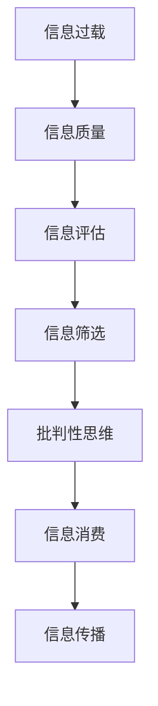

                 

## 1. 背景介绍

在信息时代，人们面临前所未有的信息过载问题。社交媒体、新闻网站、专业论坛、电子邮件等渠道每天充斥着大量的信息，如何批判性地消费和评估这些信息，成为当今社会的一大挑战。这一挑战不仅影响到个人的决策和判断，也关系到企业和政府机构的信息获取和处理。因此，我们有必要深入理解信息过载的本质，并学习有效的信息质量评估方法，以帮助我们更好地消费和利用这些信息。

### 1.1 信息过载的现状与挑战

信息过载指的是在可管理的信息量之外，人们接触到的信息量过大，以至于无法对其进行及时、有效的处理和利用。信息过载的现状主要表现在以下几个方面：

1. **数据量爆炸**：全球每年产生的数据量呈指数级增长，仅2021年全球数据量就达到了44 ZB（Zettabytes），预计到2025年将增长至175 ZB。
2. **信息源多样化**：互联网使得信息来源变得丰富多样，无论是传统媒体还是社交媒体、新闻网站、博客等，都成为信息的主要来源。
3. **信息的真实性和可靠性难以判断**：互联网的匿名性和去中心化特性，使得虚假信息和假新闻层出不穷，真实性和可靠性难以判断。
4. **信息筛选和评估难度增加**：面对海量信息，如何筛选和评估信息变得复杂，个人和组织都需要花费大量时间和精力。

### 1.2 信息过载的影响

信息过载不仅给个人的学习和工作带来负担，还可能导致决策失误、认知负担、心理健康问题等。对企业和政府而言，信息过载还可能导致战略失误、资源浪费和政策失灵。因此，如何有效地管理和评估信息，已成为信息时代的重要课题。

## 2. 核心概念与联系

### 2.1 核心概念概述

为了更好地理解和应对信息过载，我们需要掌握以下几个核心概念：

1. **信息过载**：信息量超出个人或组织有效处理和利用的能力。
2. **信息质量**：信息的可靠性、完整性、相关性和时效性等。
3. **信息评估**：通过一系列方法和工具，对信息的真实性、可靠性和价值进行判断和评估。
4. **信息筛选**：从大量的信息中筛选出最有价值和相关的信息。
5. **批判性思维**：运用逻辑和证据，对信息进行客观、理性的分析和判断。

### 2.2 核心概念原理和架构的 Mermaid 流程图



## 3. 核心算法原理 & 具体操作步骤

### 3.1 算法原理概述

基于监督学习的信息质量评估方法，旨在通过大量标注数据训练一个分类器，用于自动判断信息的真实性和可靠性。其核心思想是，将真实和可靠的信息标记为正例，将虚假和不可靠的信息标记为负例，训练一个分类器来区分这两类信息。

### 3.2 算法步骤详解

1. **数据准备**：收集和标注大量的信息样本，每个样本包含原始信息和标注标签（真实或可靠）。
2. **特征工程**：从原始信息中提取特征，如文本长度、关键词、信息来源等，用于训练分类器。
3. **模型训练**：使用机器学习算法（如朴素贝叶斯、支持向量机、深度学习等）训练一个分类器，用于判断信息的质量。
4. **模型评估**：在验证集上评估模型性能，如准确率、召回率、F1分数等，调整模型参数。
5. **模型应用**：在实际场景中应用模型，对新的信息进行质量评估，筛选出高质量的信息。

### 3.3 算法优缺点

#### 优点：

1. **自动化**：通过机器学习算法，可以自动判断信息的真实性和可靠性，节省人力成本。
2. **可扩展性**：可以处理大规模的信息样本，适用于各种信息场景。
3. **准确性**：基于大量标注数据训练的分类器，准确率较高。

#### 缺点：

1. **数据依赖**：模型性能高度依赖于标注数据的质量和数量，标注成本较高。
2. **过拟合风险**：如果训练数据过于单一，模型可能出现过拟合，影响泛化性能。
3. **复杂性**：模型训练和调参需要一定的技术背景，门槛较高。

### 3.4 算法应用领域

基于监督学习的信息质量评估方法，广泛应用于以下几个领域：

1. **新闻媒体**：自动判断新闻报道的真实性和可靠性，防止假新闻传播。
2. **社交媒体**：识别和筛选虚假信息和有害内容，保护用户安全和隐私。
3. **金融领域**：评估金融信息的真实性，防止金融诈骗。
4. **医疗健康**：评估健康信息的真实性和可靠性，防止误导性信息传播。
5. **政府机构**：自动筛选和评估政策信息，提高决策科学性。

## 4. 数学模型和公式 & 详细讲解 & 举例说明

### 4.1 数学模型构建

信息质量评估的数学模型通常包括训练集、测试集、特征向量、标签和分类器。假设训练集为 $D=\{(x_i,y_i)\}_{i=1}^N$，其中 $x_i$ 为原始信息，$y_i$ 为标注标签（0或1）。特征向量 $x_i \in \mathbb{R}^d$，分类器 $h: \mathbb{R}^d \rightarrow \{0,1\}$。

### 4.2 公式推导过程

假设有 $m$ 个特征，用 $x_{i,j}$ 表示第 $i$ 个样本的第 $j$ 个特征。分类器的损失函数 $L$ 可以表示为：

$$
L(h) = -\frac{1}{N}\sum_{i=1}^N [y_i \log h(x_i) + (1-y_i) \log(1-h(x_i))]
$$

其中，$h(x_i)$ 表示分类器对第 $i$ 个样本的预测概率。

### 4.3 案例分析与讲解

以新闻媒体的虚假信息识别为例，我们可以使用朴素贝叶斯分类器进行信息质量评估。首先，收集和标注大量新闻报道和标签，将其分为训练集和测试集。然后，提取新闻报道的关键词、信息来源、作者等特征，作为分类器的输入。最后，在测试集上评估分类器的性能，调整模型参数，得到最终的信息质量评估模型。

## 5. 项目实践：代码实例和详细解释说明

### 5.1 开发环境搭建

1. **安装Python**：
   ```bash
   sudo apt-get update
   sudo apt-get install python3-pip
   ```
   
2. **安装Pandas和Scikit-Learn**：
   ```bash
   pip install pandas scikit-learn
   ```
   
3. **准备数据集**：
   ```python
   import pandas as pd
   df = pd.read_csv('news_data.csv')
   ```

### 5.2 源代码详细实现

```python
from sklearn.feature_extraction.text import CountVectorizer
from sklearn.model_selection import train_test_split
from sklearn.naive_bayes import MultinomialNB
from sklearn.metrics import accuracy_score

# 数据预处理
vectorizer = CountVectorizer(stop_words='english')
X = vectorizer.fit_transform(df['text'])
y = df['label']

# 分割数据集
X_train, X_test, y_train, y_test = train_test_split(X, y, test_size=0.2)

# 训练朴素贝叶斯分类器
clf = MultinomialNB()
clf.fit(X_train, y_train)

# 预测并评估模型
y_pred = clf.predict(X_test)
accuracy = accuracy_score(y_test, y_pred)
print(f"Accuracy: {accuracy}")
```

### 5.3 代码解读与分析

上述代码展示了如何使用朴素贝叶斯分类器进行信息质量评估。首先，通过 `CountVectorizer` 将文本数据转换为特征向量，然后将其分割为训练集和测试集。接着，使用 `MultinomialNB` 训练分类器，并在测试集上评估模型的准确性。

## 6. 实际应用场景

### 6.1 新闻媒体

新闻媒体面临大量的信息过载问题，虚假信息和假新闻泛滥。通过信息质量评估，新闻媒体可以自动筛选和过滤虚假信息，提升新闻报道的真实性和可信度。例如，BBC News 使用机器学习算法自动评估其报道的真实性，防止假新闻传播。

### 6.2 社交媒体

社交媒体上的信息质量参差不齐，虚假信息和有害内容时常出现。通过信息质量评估，社交媒体平台可以自动识别和删除虚假信息，保护用户安全和隐私。例如，Facebook 使用机器学习算法自动检测和删除虚假信息，提升平台的用户体验。

### 6.3 金融领域

金融信息的质量直接关系到投资决策的准确性。通过信息质量评估，金融机构可以自动筛选和评估金融信息，防止金融诈骗和市场操纵。例如，JP Morgan Chase 使用机器学习算法评估新闻报道的真实性，防止金融市场操纵。

### 6.4 医疗健康

健康信息的质量关系到公众健康和医疗决策。通过信息质量评估，医疗机构可以自动筛选和评估健康信息，防止误导性信息传播。例如，Mayo Clinic 使用机器学习算法评估健康信息的真实性，提升医疗服务的质量。

## 7. 工具和资源推荐

### 7.1 学习资源推荐

1. **《信息素养教育》（Information Literacy Education）**：该书系统介绍了信息素养的基本概念和核心技能，适合信息管理、图书馆学和教育等领域的学生和从业者。
2. **Coursera《信息素养》（Information Literacy）**：Coursera提供的在线课程，涵盖信息素养的基本概念和技能，由世界各地的专家教授授课。
3. **Google Scholar**：一个免费、开放的平台，提供全球学术资源的搜索和访问，适合学术研究和资料收集。

### 7.2 开发工具推荐

1. **Python**：Python是最流行的编程语言之一，具有丰富的库和工具，适用于信息质量评估和文本处理。
2. **Pandas**：Pandas是一个数据分析库，可以轻松处理和分析大型数据集。
3. **Scikit-Learn**：Scikit-Learn是一个机器学习库，提供了大量的算法和工具，适用于信息质量评估和分类任务。

### 7.3 相关论文推荐

1. **"Evaluating Information Quality in Social Media: A Survey"**：这篇文章系统回顾了信息质量评估在社交媒体中的应用，并提出了未来研究方向。
2. **"Real-Time Detection of Misinformation Using Deep Learning"**：这篇文章介绍了使用深度学习模型自动检测虚假信息的方法和实践。
3. **"Robust Information Quality Assessment in Big Data"**：这篇文章探讨了在大数据背景下，如何有效地评估信息质量，并提出了新的方法和技术。

## 8. 总结：未来发展趋势与挑战

### 8.1 研究成果总结

信息质量评估方法在信息时代的应用已取得显著成果，提高了信息处理的效率和准确性。然而，仍存在一些挑战，如数据标注成本高、模型泛化性能差、技术门槛高等。

### 8.2 未来发展趋势

1. **自动化程度提高**：随着机器学习技术的不断发展，信息质量评估将更加自动化，减少了人工干预的需求。
2. **多模态信息融合**：未来的信息质量评估将融合多种数据源，如文本、图像、音频等，提供更全面的评估结果。
3. **跨领域应用拓展**：信息质量评估将在更多领域得到应用，如教育、政府、法律等，提升这些领域的决策效率和质量。
4. **模型透明性和可解释性**：未来的信息质量评估模型将更加透明和可解释，帮助用户理解和信任模型的输出。

### 8.3 面临的挑战

1. **数据标注成本**：高质量标注数据的获取和维护成本高，制约了信息质量评估的发展。
2. **模型泛化性能**：现有的信息质量评估模型在泛化性能上仍有提升空间，需要更多数据和算法优化。
3. **技术门槛**：信息质量评估技术仍有一定的技术门槛，需要更多的技术和资源支持。

### 8.4 研究展望

未来的信息质量评估研究需要在以下几个方面进行突破：

1. **无监督学习**：探索无监督或半监督学习技术，减少对标注数据的依赖，提高评估效率。
2. **深度学习**：进一步研究深度学习技术，提升信息质量评估的准确性和泛化能力。
3. **跨领域融合**：将信息质量评估与其他技术结合，如自然语言处理、计算机视觉等，提供更全面的信息评估服务。

## 9. 附录：常见问题与解答

### Q1: 信息质量评估的原理是什么？

A: 信息质量评估的原理是通过训练分类器，将信息样本分为真实和可靠的信息（正例）和虚假和不可靠的信息（负例），然后通过预测新信息的质量。

### Q2: 信息质量评估的模型有哪些？

A: 常用的信息质量评估模型包括朴素贝叶斯、支持向量机、深度学习等。

### Q3: 信息质量评估的优缺点是什么？

A: 信息质量评估的优点包括自动化、可扩展性和准确性。缺点包括数据依赖、过拟合风险和复杂性。

### Q4: 信息质量评估的应用有哪些？

A: 信息质量评估在新闻媒体、社交媒体、金融领域、医疗健康等领域都有广泛应用，提升信息处理的效率和质量。

### Q5: 如何提升信息质量评估的准确性？

A: 可以通过增加标注数据量、优化特征提取、调整模型参数等方法，提升信息质量评估的准确性。

作者：禅与计算机程序设计艺术 / Zen and the Art of Computer Programming

