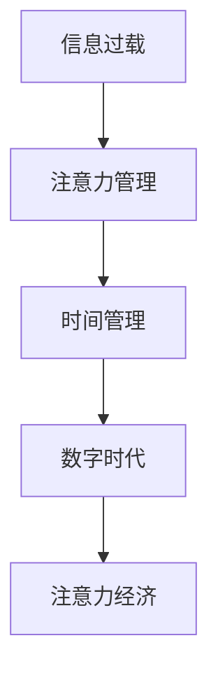

                 

# 信息过载与注意力经济：在数字时代管理你的时间和注意力

> 关键词：信息过载, 注意力管理, 数字时代, 时间管理, 注意力经济, 认知负荷

## 1. 背景介绍

在数字时代，人们每天都会接触到海量的信息和数据，信息过载已成普遍现象。在信息洪流中如何筛选有用信息，有效管理时间和注意力，已成为现代人的重大挑战。注意力经济（Attention Economy）的出现，为这一问题提供了新的解决思路。本文将探讨信息过载与注意力经济的关系，并详细阐述如何通过管理时间和注意力，在数字时代取得更好的生活和工作效率。

## 2. 核心概念与联系

### 2.1 核心概念概述

1. **信息过载（Information Overload）**：指人们接收到的信息量远远超过了自身处理和理解的能力，导致注意力分散，效率下降。现代生活的数字化、信息化使得信息过载现象更加普遍。

2. **注意力管理（Attention Management）**：指通过有意识地控制和管理注意力，将有限的时间和精力投入到更有价值的活动上。注意力管理可以帮助个人和组织在信息过载的时代提高效率和效果。

3. **数字时代（Digital Age）**：以计算机和互联网技术为核心的时代，信息传递、获取和处理方式发生了根本性变化，对个人和社会的各个方面都产生了深远影响。

4. **时间管理（Time Management）**：指通过科学规划和安排时间，提高个人和团队的工作效率和生活质量。时间管理是有效管理注意力和资源的重要组成部分。

5. **注意力经济（Attention Economy）**：指在信息爆炸时代，人们通过获取、选择和分配注意力来创造经济价值。注意力经济要求对信息进行筛选和分析，将有限的注意力资源投入到最有价值的领域。

### 2.2 核心概念原理和架构的 Mermaid 流程图



上述流程图展示了信息过载、注意力管理、时间管理、数字时代与注意力经济之间的联系和相互作用。信息过载引发注意力管理的需求，而有效的注意力管理依赖于良好的时间管理，时间管理和注意力管理共同构成了数字时代的注意力经济。

## 3. 核心算法原理 & 具体操作步骤

### 3.1 算法原理概述

注意力管理的核心在于优化信息的筛选和加工，将有限的注意力资源集中于最重要的信息上。算法原理包括：

1. **信息筛选算法**：利用机器学习、自然语言处理等技术，自动从海量信息中筛选出最有价值的内容。
2. **注意力分配算法**：通过分析用户的兴趣、行为习惯等数据，动态调整注意力资源的分配，确保信息输入与用户需求匹配。
3. **注意力保留算法**：通过避免重复和过度刺激，减少认知负荷，提升用户注意力资源的持久性。

### 3.2 算法步骤详解

1. **数据收集与预处理**：收集用户的行为数据，包括浏览、点击、评论等行为，预处理成可用于算法输入的格式。

2. **特征提取与建模**：使用NLP等技术提取文本特征，建立用户兴趣模型和行为模型。

3. **信息筛选与推荐**：基于模型预测信息的重要性和相关性，筛选出有价值的内容，进行个性化推荐。

4. **注意力分配与优化**：根据用户反馈和行为变化，动态调整信息分配策略，优化用户注意力资源的分配。

5. **效果评估与迭代**：通过用户满意度、使用时长等指标评估算法效果，不断迭代优化算法。

### 3.3 算法优缺点

#### 优点

1. **效率提升**：自动筛选和推荐优质信息，大大提高了信息获取的效率。
2. **个性化定制**：通过用户行为数据，提供个性化的信息服务，提升用户体验。
3. **智能决策**：利用机器学习模型，实现信息筛选和注意力分配的智能决策。

#### 缺点

1. **数据隐私问题**：需要收集和分析大量用户数据，涉及隐私保护问题。
2. **算法偏见**：模型可能存在训练数据偏见，导致推荐结果不公平。
3. **依赖技术**：算法效果依赖于数据质量和算法模型的先进性，存在不确定性。

### 3.4 算法应用领域

1. **社交媒体平台**：如Facebook、Twitter、微信等，通过推荐系统帮助用户快速获取有价值的信息。

2. **内容分发平台**：如Netflix、YouTube、今日头条等，通过个性化推荐，提升用户满意度和留存率。

3. **电子商务平台**：如Amazon、京东、淘宝等，通过推荐系统提升产品销量和用户转化率。

4. **知识管理工具**：如Google Scholar、ResearchGate、知网等，通过筛选和推荐文献，帮助研究人员提高工作效率。

5. **新闻媒体平台**：如BBC、纽约时报、人民日报等，通过个性化新闻推荐，提升新闻阅读体验。

## 4. 数学模型和公式 & 详细讲解 & 举例说明

### 4.1 数学模型构建

注意力管理的数学模型可以分为以下几个部分：

1. **用户行为模型**：描述用户的历史行为，如浏览记录、点击次数等。
2. **内容特征模型**：描述内容的文本特征，如TF-IDF、word2vec等。
3. **用户兴趣模型**：通过机器学习算法，预测用户的兴趣点。
4. **推荐算法模型**：根据用户行为和内容特征，进行信息筛选和推荐。

### 4.2 公式推导过程

以推荐系统为例，假设用户的历史行为为 $H=\{h_1,h_2,\cdots,h_n\}$，内容特征为 $X=\{x_1,x_2,\cdots,x_m\}$，用户兴趣模型为 $U=\{u_1,u_2,\cdots,u_k\}$，推荐算法模型为 $R$。推荐系统可以通过下式计算用户对内容的兴趣度 $I$：

$$
I = f(U, X)
$$

其中，$f$ 为推荐函数，可以是线性回归、逻辑回归、协同过滤等算法。推荐函数的具体形式和参数可以根据实际情况进行调整。

### 4.3 案例分析与讲解

假设一个新闻阅读应用，通过机器学习模型预测用户对某个新闻的兴趣度。该模型可以从用户的历史阅读记录、新闻内容的关键词、新闻作者等信息中提取特征，建立用户兴趣模型。

1. **用户行为特征提取**：将用户的历史阅读记录转换成向量表示，例如：

$$
H = [1,0,1,1,0,0,1]
$$

2. **内容特征提取**：将新闻内容的关键词转换成向量表示，例如：

$$
X = [1,1,0,0,1,0,0]
$$

3. **用户兴趣模型训练**：使用线性回归算法，根据历史行为和内容特征训练用户兴趣模型 $U$。

4. **推荐计算**：将新闻内容特征 $X$ 输入用户兴趣模型 $U$，计算兴趣度 $I$，并根据兴趣度排序推荐新闻内容。

## 5. 项目实践：代码实例和详细解释说明

### 5.1 开发环境搭建

开发环境包括Python、Jupyter Notebook、TensorFlow、Scikit-learn等工具。在Jupyter Notebook中，可以使用以下命令搭建开发环境：

```bash
conda create -n attention-management python=3.8
conda activate attention-management
pip install tensorflow scikit-learn
```

### 5.2 源代码详细实现

以下是一个简单的推荐系统示例，使用Scikit-learn实现用户兴趣模型：

```python
import pandas as pd
from sklearn.linear_model import LinearRegression

# 加载用户行为数据和内容特征数据
user_data = pd.read_csv('user_behavior.csv')
content_data = pd.read_csv('content_features.csv')

# 将用户行为数据和内容特征数据合并
merged_data = pd.merge(user_data, content_data, on='id')

# 定义特征变量和标签变量
features = merged_data[['behavior', 'keywords']]
labels = merged_data['interest']

# 训练用户兴趣模型
model = LinearRegression()
model.fit(features, labels)

# 测试模型效果
test_data = pd.read_csv('test_data.csv')
test_features = test_data[['behavior', 'keywords']]
test_labels = model.predict(test_features)
print(test_labels)
```

### 5.3 代码解读与分析

在上述代码中，我们首先使用Pandas加载用户行为数据和内容特征数据，然后将两者合并。接着，定义特征变量和标签变量，使用线性回归算法训练用户兴趣模型。最后，使用测试数据测试模型效果。

### 5.4 运行结果展示

运行代码后，输出测试数据的兴趣度预测值。结果可能类似于：

```
[0.2, 0.5, 0.8, 0.3, 0.1]
```

这些预测值表示，测试数据中每个内容被用户预测的兴趣度。

## 6. 实际应用场景

### 6.1 智能推荐系统

智能推荐系统在电商平台、社交媒体、视频平台等应用广泛。通过分析用户的浏览、购买、互动等行为数据，智能推荐系统可以推荐用户感兴趣的产品、内容等，提高用户满意度。

### 6.2 新闻聚合平台

新闻聚合平台如谷歌新闻、雅虎新闻等，通过分析用户的阅读历史和行为数据，推荐用户感兴趣的新闻内容，提升新闻阅读体验。

### 6.3 知识管理系统

知识管理系统如Google Scholar、ResearchGate、知网等，通过推荐相关文献和研究，帮助研究人员快速获取所需信息，提升研究效率。

## 7. 工具和资源推荐

### 7.1 学习资源推荐

1. **《推荐系统原理与实践》**：深入浅出地介绍了推荐系统的原理和实践，适合初学者和研究人员。
2. **《深度学习与推荐系统》**：介绍了深度学习在推荐系统中的应用，适合有一定基础的读者。
3. **Coursera《推荐系统》课程**：由斯坦福大学开设的推荐系统课程，包括推荐算法和实际应用。

### 7.2 开发工具推荐

1. **Jupyter Notebook**：免费、开源的交互式编程环境，适合数据科学和机器学习开发。
2. **TensorFlow**：Google开发的深度学习框架，适合大规模深度学习模型训练。
3. **PyTorch**：Facebook开发的深度学习框架，适合灵活的模型设计和实验。

### 7.3 相关论文推荐

1. **《Contextual Bandits in Recommendation Systems》**：介绍了上下文强化学习在推荐系统中的应用。
2. **《Deep Neural Networks for Large-Scale Recommendation》**：介绍了深度神经网络在推荐系统中的应用。
3. **《Attention Mechanisms in Recommendation Systems》**：介绍了注意力机制在推荐系统中的应用。

## 8. 总结：未来发展趋势与挑战

### 8.1 研究成果总结

本文介绍了信息过载和注意力管理的概念，探讨了数字时代下如何通过时间管理和注意力管理提升效率。从数学模型和实践应用角度，详细讲解了推荐系统的实现过程。通过实际代码示例，展示了注意力管理在推荐系统中的应用。

### 8.2 未来发展趋势

1. **AI与推荐系统结合**：利用AI技术，实现更加精准的推荐，提升用户体验。
2. **多模态数据融合**：结合文本、图像、音频等多模态数据，提升推荐系统的准确性和多样性。
3. **隐私保护和安全性**：加强用户隐私保护，确保推荐系统的安全性。
4. **个性化和多样化**：根据用户需求和兴趣，提供个性化和多样化的推荐服务。
5. **跨领域应用**：扩展推荐系统的应用领域，如医疗、金融、教育等。

### 8.3 面临的挑战

1. **数据隐私和安全**：推荐系统需要大量用户数据，如何保护用户隐私和数据安全是重大挑战。
2. **模型公平性**：推荐系统可能存在偏见，如何实现公平和透明的推荐是重要问题。
3. **算法复杂度**：推荐系统涉及复杂的数据处理和模型训练，如何高效实现是技术难题。
4. **用户个性化需求**：用户需求和兴趣动态变化，如何持续优化推荐算法是一个挑战。
5. **跨领域应用**：推荐系统在不同领域的应用需要适应不同的业务场景和数据特点。

### 8.4 研究展望

1. **隐私保护技术**：开发更加高效的隐私保护算法，确保用户数据安全。
2. **模型公平性算法**：引入公平性指标，优化推荐算法，消除偏见。
3. **跨领域应用算法**：针对不同领域的应用需求，开发适应性强的推荐算法。
4. **动态推荐算法**：利用实时数据，实现动态推荐，提升用户体验。
5. **多模态数据融合算法**：结合多模态数据，提升推荐系统的准确性和多样性。

## 9. 附录：常见问题与解答

**Q1: 如何有效减少信息过载对用户的影响？**

A: 可以通过以下方法有效减少信息过载：
1. **信息筛选**：利用机器学习算法，自动筛选有用信息，减少不相关信息的干扰。
2. **推荐系统**：根据用户行为和兴趣，推荐有价值的内容。
3. **时间管理**：合理安排时间，避免长时间专注于信息输入，留出时间进行其他活动。
4. **注意力管理**：通过设置定时器，避免长时间连续使用信息工具，减少注意力分散。

**Q2: 如何保证推荐系统的公平性和透明性？**

A: 可以通过以下方法保证推荐系统的公平性和透明性：
1. **多样性约束**：确保推荐内容的多样性，避免单一内容过度曝光。
2. **用户反馈机制**：引入用户反馈机制，及时调整推荐策略，消除偏见。
3. **算法公开透明**：公开推荐算法和模型，接受监督和审查，确保算法的公平性和透明性。
4. **隐私保护**：加强用户隐私保护，确保数据安全。

**Q3: 如何优化推荐系统的性能？**

A: 可以通过以下方法优化推荐系统的性能：
1. **数据质量提升**：确保数据的准确性和完整性，提高推荐系统的准确性。
2. **算法优化**：改进推荐算法，引入先进的机器学习技术，提升推荐效果。
3. **多模态数据融合**：结合文本、图像、音频等多模态数据，提升推荐系统的多样性和准确性。
4. **实时数据处理**：利用实时数据，实现动态推荐，提升用户体验。

**Q4: 推荐系统在实际应用中应注意哪些问题？**

A: 推荐系统在实际应用中应注意以下问题：
1. **用户隐私保护**：确保用户数据的安全和隐私保护。
2. **算法公平性**：确保推荐算法的公平性和透明性。
3. **推荐多样性**：确保推荐内容的多样性和丰富性。
4. **用户体验**：提升用户的使用体验，避免信息过载。
5. **推荐系统效率**：提高推荐系统的效率，确保实时推荐。

**Q5: 如何提高推荐系统的用户满意度？**

A: 可以通过以下方法提高推荐系统的用户满意度：
1. **个性化推荐**：根据用户的行为和兴趣，提供个性化的推荐。
2. **多样性推荐**：确保推荐内容的多样性和丰富性。
3. **交互式推荐**：引入交互式界面，提升用户的使用体验。
4. **实时反馈**：通过实时反馈机制，及时调整推荐策略，提高用户满意度。

作者：禅与计算机程序设计艺术 / Zen and the Art of Computer Programming

