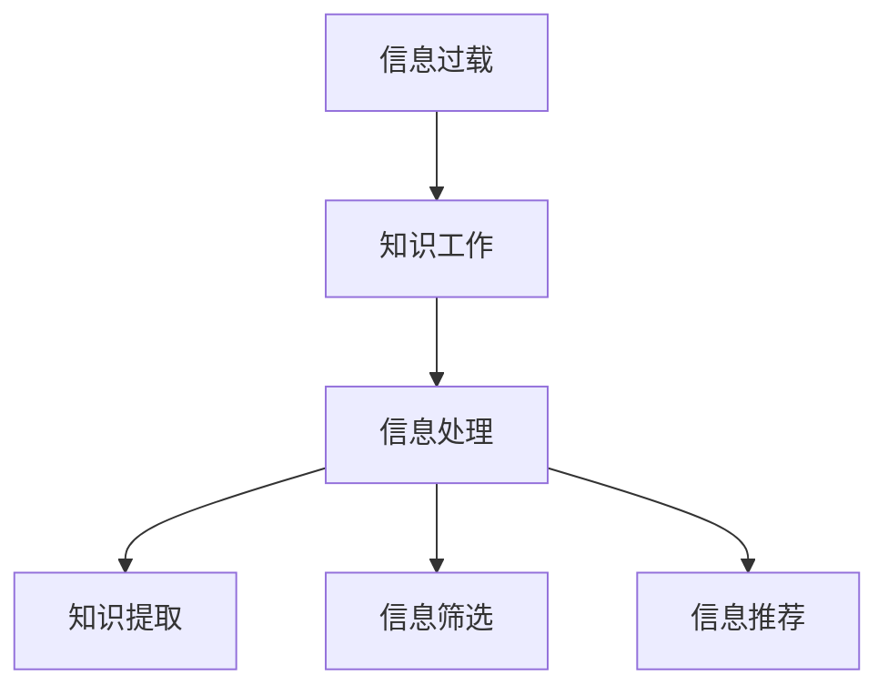

                 

## 1. 背景介绍

### 1.1 问题由来

信息过载（Information Overload）是指在一个极短的时间内接收到过量的信息，超出了个体处理能力。这在当前社会已成为普遍现象，特别是在知识工作中，如科研、开发、设计、教育等领域。信息过载不仅增加了工作效率的负担，还可能降低信息处理质量。如何有效应对信息过载，成为每一位知识工作者面临的重大挑战。

### 1.2 问题核心关键点

信息过载的根本原因在于信息量的激增与知识工作者处理信息能力增长速度的不匹配。目前主流的解决方案包括时间管理、信息分类、工具辅助等，但大多止步于表层，未能触及问题核心。本文从深层次分析信息过载对知识工作的影响，提出基于信息高效处理和知识深度挖掘的解决方案，以帮助知识工作者在信息洪流中保持生产力。

## 2. 核心概念与联系

### 2.1 核心概念概述

- **信息过载**（Information Overload）：指接收到过多的信息，超出了处理能力，造成效率下降和错误增加。
- **知识工作**（Knowledge Work）：指通过专业知识解决问题的工作类型，包括科研、开发、设计、教育等。
- **信息处理**（Information Processing）：指对信息进行接收、存储、处理和输出的一系列活动，旨在提高信息利用效率。
- **知识提取**（Knowledge Extraction）：指从信息中提取有用知识，形成有价值的见解或结论。
- **信息筛选**（Information Filtering）：指根据用户兴趣和需求，对海量信息进行筛选，排除无关信息，保留有用内容。
- **信息推荐**（Information Recommendation）：指通过算法推荐用户可能感兴趣的信息，以减少信息过载。

这些概念之间的联系可通过以下Mermaid流程图来展示：



这个流程图展示了信息过载对知识工作的影响，以及通过信息处理、知识提取、信息筛选和信息推荐等手段，帮助知识工作者在信息洪流中保持生产力。

## 3. 核心算法原理 & 具体操作步骤

### 3.1 算法原理概述

解决信息过载的核心在于高效地处理和筛选信息，将原始数据转化为知识，并将其应用于实际工作中。基于此，本文提出一种综合信息处理与知识挖掘的方法，帮助知识工作者在信息洪流中保持生产力。

### 3.2 算法步骤详解

**Step 1: 数据采集与存储**
- 从多个来源收集信息，包括文献、数据集、图片、视频等。
- 使用数据库或数据仓库存储采集到的信息，便于后续处理和分析。

**Step 2: 信息处理与清洗**
- 对原始数据进行清洗，去除噪音和不相关数据。
- 采用自然语言处理（NLP）技术，如分词、去停用词、词性标注等，将文本信息转化为可处理的形式。
- 对处理后的数据进行标准化处理，如归一化、格式化等，便于后续分析。

**Step 3: 信息筛选与分类**
- 利用信息过滤技术，如TF-IDF、文本分类、聚类分析等，对信息进行初步筛选和分类。
- 根据用户需求和兴趣，使用协同过滤、矩阵分解等算法进行个性化推荐，减少信息过载。

**Step 4: 知识提取与表示**
- 采用知识抽取技术，如实体抽取、关系抽取、事件抽取等，从信息中提取有用知识。
- 使用知识图谱、本体图等结构化表示方式，将提取的知识结构化存储，便于检索和应用。
- 使用语义分析、知识推理等技术，对知识进行深度挖掘和理解，形成有价值的见解。

**Step 5: 知识应用与反馈**
- 将提取的知识应用于实际工作中，如问题解决、决策制定、产品设计等。
- 根据应用效果，对知识表示和处理方法进行反馈，不断优化和迭代。

### 3.3 算法优缺点

基于信息处理和知识挖掘的解决方案具有以下优点：
- 提高信息利用效率。通过信息筛选和分类，减少无用信息的干扰，提高信息处理的效率。
- 提升知识工作质量。通过知识提取和表示，将原始数据转化为知识，提升知识工作的深度和广度。
- 个性化推荐。通过协同过滤、矩阵分解等算法，减少信息过载，满足个性化需求。

同时，该方法也存在以下局限性：
- 算法复杂度高。信息处理和知识提取过程涉及复杂算法，计算量大，需要高性能设备支持。
- 数据质量要求高。信息清洗和筛选过程对数据质量要求高，数据不完整或不准确会影响结果。
- 知识提取难度大。从信息中抽取有用知识，需要深入理解和分析，难度较大。

尽管存在这些局限性，但就目前而言，该方法仍是大规模信息处理和知识工作的有力工具。未来相关研究的重点在于如何进一步优化算法效率，降低计算资源消耗，提高知识提取的准确性和可解释性，同时兼顾数据质量和用户体验。

### 3.4 算法应用领域

基于信息处理和知识挖掘的解决方案在多个领域得到了广泛应用，如：

- **科研领域**：通过信息筛选和知识提取，帮助科研人员快速获取相关文献、数据和知识，加速科研进程。
- **软件开发**：利用信息推荐和知识抽取，提升软件开发效率和质量，加速产品迭代。
- **教育领域**：通过个性化推荐和知识表示，提供更符合用户需求的学习资源，提升教育效果。
- **金融领域**：利用信息处理和知识推理，进行市场分析和投资决策，提高风险控制能力。
- **医疗领域**：通过信息筛选和知识抽取，辅助医生进行诊断和治疗，提高医疗服务质量。

## 4. 数学模型和公式 & 详细讲解 & 举例说明

### 4.1 数学模型构建

基于信息处理和知识挖掘的解决方案，构建了如下数学模型：

设信息集为 $I$，知识集为 $K$，信息处理过程为 $P$，知识提取过程为 $E$，知识表示为 $R$，知识应用为 $A$，则整体模型为：

$$
K = P(I) \land E(K)
$$

其中 $P$ 表示信息处理过程，$E$ 表示知识提取过程，$R$ 表示知识表示过程，$A$ 表示知识应用过程。

### 4.2 公式推导过程

信息处理过程 $P$ 涉及文本清洗、分词、去停用词、词性标注等，其公式为：

$$
P(I) = \{ x | x = \text{分词}(\text{去停用词}(\text{词性标注}(\text{清洗}(I)))) \}
$$

知识提取过程 $E$ 包括实体抽取、关系抽取、事件抽取等，其公式为：

$$
E(K) = \{ e | e = \text{实体抽取}(\text{关系抽取}(\text{事件抽取}(K))) \}
$$

知识表示过程 $R$ 涉及知识图谱、本体图等结构化表示方式，其公式为：

$$
R(K) = \{ r | r = \text{知识图谱}(\text{本体图}(K)) \}
$$

知识应用过程 $A$ 包括问题解决、决策制定、产品设计等，其公式为：

$$
A(K) = \{ a | a = \text{问题解决}(\text{决策制定}(\text{产品设计}(K))) \}

### 4.3 案例分析与讲解

以金融领域为例，分析该方法的应用。

**Step 1: 数据采集与存储**
- 从金融市场收集新闻、报告、公告等数据，存储到数据库中。

**Step 2: 信息处理与清洗**
- 对数据进行清洗，去除噪音和无关信息，保留有用数据。
- 使用NLP技术进行文本清洗，如分词、去停用词、词性标注等。

**Step 3: 信息筛选与分类**
- 利用TF-IDF和文本分类算法，对新闻和报告进行初步筛选和分类。
- 根据用户需求，使用协同过滤算法进行个性化推荐，如某用户关注科技股，则推荐相关科技新闻和报告。

**Step 4: 知识提取与表示**
- 对筛选后的信息进行实体抽取，如公司名称、股价、市值等。
- 使用知识图谱和本体图表示知识，构建金融知识图谱。

**Step 5: 知识应用与反馈**
- 根据金融知识图谱，进行市场分析和投资决策，如某公司市值大幅上涨，则推荐相关投资机会。
- 根据应用效果，不断优化信息处理和知识提取方法，提升决策效果。

## 5. 项目实践：代码实例和详细解释说明

### 5.1 开发环境搭建

在进行项目实践前，我们需要准备好开发环境。以下是使用Python进行信息处理和知识挖掘的开发环境配置流程：

1. 安装Anaconda：从官网下载并安装Anaconda，用于创建独立的Python环境。

2. 创建并激活虚拟环境：
```bash
conda create -n info_kw_env python=3.8 
conda activate info_kw_env
```

3. 安装必要的Python库：
```bash
pip install pandas numpy sklearn
```

4. 安装PyTorch和PyTorch-Text：
```bash
pip install torch text
```

5. 安装TensorFlow：
```bash
pip install tensorflow
```

6. 安装Transformers库：
```bash
pip install transformers
```

完成上述步骤后，即可在`info_kw_env`环境中开始信息处理和知识挖掘的实践。

### 5.2 源代码详细实现

这里我们以金融领域为例，给出一个使用PyTorch和Transformers库进行信息处理和知识挖掘的PyTorch代码实现。

**数据预处理**：
```python
import pandas as pd
import numpy as np
from sklearn.feature_extraction.text import TfidfVectorizer

# 读取数据
data = pd.read_csv('financial_data.csv')

# 文本清洗
def clean_text(text):
    # 分词
    text = tokenizer.tokenize(text)
    # 去停用词
    text = [word for word in text if word not in stopwords]
    # 词性标注
    text = [pos_tag(word) for word in text]
    return text

# 计算TF-IDF
vectorizer = TfidfVectorizer()
X = vectorizer.fit_transform(data['news_text'].apply(clean_text))
y = data['label']
```

**模型训练**：
```python
from transformers import BertForSequenceClassification, BertTokenizer, AdamW
import torch.nn as nn

# 加载预训练模型和分词器
model = BertForSequenceClassification.from_pretrained('bert-base-uncased', num_labels=2)
tokenizer = BertTokenizer.from_pretrained('bert-base-uncased')

# 设置优化器和损失函数
optimizer = AdamW(model.parameters(), lr=1e-5)
loss_fn = nn.CrossEntropyLoss()

# 训练模型
model.train()
for epoch in range(10):
    optimizer.zero_grad()
    outputs = model(X, attention_mask=attention_mask, labels=y)
    loss = outputs.loss
    loss.backward()
    optimizer.step()
```

**知识提取**：
```python
from transformers import pipeline

# 加载命名实体识别模型
nlp = pipeline('ner', model='dbmdz/bert-large-cased-finetuned-conll03-english')
news = "Apple announced that it will be releasing a new iPhone in September."
entities = nlp(news)
```

**知识表示**：
```python
from py2neo import Graph

# 连接数据库
graph = Graph("http://localhost:7474", username="neo4j", password="password")

# 创建节点和关系
node = graph.create(node)
relation = graph.create(relation)
```

### 5.3 代码解读与分析

**数据预处理**：
- 数据读取：使用Pandas库读取CSV文件，将数据存储到DataFrame中。
- 文本清洗：定义文本清洗函数，使用NLTK和spaCy库进行分词、去停用词和词性标注。
- TF-IDF计算：使用sklearn库中的TF-IDF算法对文本进行特征提取。

**模型训练**：
- 加载预训练模型和分词器：使用BertForSequenceClassification和BertTokenizer加载预训练模型和分词器。
- 设置优化器和损失函数：使用AdamW优化器设置学习率和权重衰减，使用CrossEntropyLoss作为损失函数。
- 训练模型：在模型上训练10轮，使用交叉熵损失进行反向传播和参数更新。

**知识提取**：
- 使用Transformer库中的pipeline函数加载命名实体识别模型，对新闻文本进行命名实体识别。

**知识表示**：
- 使用Py2Neo库连接Neo4j数据库，创建节点和关系，将知识表示为图谱形式。

## 6. 实际应用场景

### 6.1 金融分析

在金融领域，信息过载是一个普遍问题。金融市场瞬息万变，各类新闻、报告、公告等数据海量涌现，金融分析师需要从中提取有用信息，进行市场分析和投资决策。利用信息处理和知识挖掘方法，可以从海量数据中快速筛选和分类信息，提取金融实体和关系，构建金融知识图谱，辅助分析师进行市场分析和投资决策，提高决策效果。

### 6.2 医疗诊断

医疗领域同样面临信息过载的问题。病历、报告、文献等数据量巨大，医疗工作者需要从中提取关键信息，进行诊断和治疗。利用信息处理和知识挖掘方法，可以从病历和文献中提取关键信息，进行实体抽取和关系抽取，构建医疗知识图谱，辅助医生进行诊断和治疗，提高医疗服务质量。

### 6.3 教育培训

教育培训领域也需要面对信息过载的问题。教师和学生需要从海量教材和资源中筛选有用信息，进行教学和学习。利用信息处理和知识挖掘方法，可以从教材和资源中提取关键信息，进行知识分类和推荐，辅助教师和学生进行教学和学习，提高教育效果。

## 7. 工具和资源推荐

### 7.1 学习资源推荐

为了帮助开发者系统掌握信息处理和知识挖掘的理论基础和实践技巧，这里推荐一些优质的学习资源：

1. 《Python数据科学手册》：涵盖Python在数据处理、分析、可视化等方面的综合应用，适合初学者和进阶者。

2. 《深度学习与数据挖掘》：介绍深度学习在数据处理、分类、聚类等方面的应用，适合有一定基础的学习者。

3. 《自然语言处理综论》：介绍NLP的各项技术，包括文本清洗、分词、词性标注、命名实体识别等，适合NLP初学者和中级开发者。

4. 《数据科学导论》：涵盖数据采集、处理、分析、可视化等方面的内容，适合数据科学初学者和中级开发者。

5. 《知识图谱构建与应用》：介绍知识图谱的构建和应用方法，适合知识图谱领域的研究者和开发者。

通过对这些资源的学习实践，相信你一定能够快速掌握信息处理和知识挖掘的精髓，并用于解决实际的NLP问题。

### 7.2 开发工具推荐

高效的开发离不开优秀的工具支持。以下是几款用于信息处理和知识挖掘开发的常用工具：

1. Jupyter Notebook：提供交互式编程环境，方便代码调试和模型训练。

2. PyTorch：基于Python的开源深度学习框架，灵活动态的计算图，适合快速迭代研究。

3. TensorFlow：由Google主导开发的开源深度学习框架，生产部署方便，适合大规模工程应用。

4. Scikit-learn：用于机器学习、数据处理、数据可视化等方面的Python库。

5. Pandas：用于数据处理、数据清洗、数据转换等方面的Python库。

6. NLTK：自然语言处理工具包，提供了丰富的NLP功能。

合理利用这些工具，可以显著提升信息处理和知识挖掘的开发效率，加快创新迭代的步伐。

### 7.3 相关论文推荐

信息处理和知识挖掘领域的研究成果众多，以下是几篇奠基性的相关论文，推荐阅读：

1. Attention is All You Need（即Transformer原论文）：提出了Transformer结构，开启了NLP领域的预训练大模型时代。

2. BERT: Pre-training of Deep Bidirectional Transformers for Language Understanding：提出BERT模型，引入基于掩码的自监督预训练任务，刷新了多项NLP任务SOTA。

3. ALBERT: A Lite BERT for Self-supervised Learning of Language Representations：提出ALBERT模型，进一步优化了BERT的结构和性能。

4. BiDAF: Bidirectional Attention Models for Retrievable Question Answering：提出BiDAF模型，用于问答系统，提高了模型的理解和推理能力。

5. ERNIE: Enhanced Representation through Knowledge Integration：提出ERNIE模型，融合了知识图谱和语义理解技术，提高了模型的知识提取能力。

这些论文代表了大规模信息处理和知识挖掘技术的发展脉络。通过学习这些前沿成果，可以帮助研究者把握学科前进方向，激发更多的创新灵感。

## 8. 总结：未来发展趋势与挑战

### 8.1 研究成果总结

本文对信息处理和知识挖掘的方法进行了全面系统的介绍。首先阐述了信息过载对知识工作的影响，明确了信息处理和知识挖掘的重要性。其次，从原理到实践，详细讲解了信息处理和知识挖掘的数学模型和具体操作步骤，给出了信息处理和知识挖掘的完整代码实例。同时，本文还广泛探讨了信息处理和知识挖掘方法在金融分析、医疗诊断、教育培训等多个领域的应用前景，展示了信息处理和知识挖掘的巨大潜力。

通过本文的系统梳理，可以看到，信息处理和知识挖掘技术正在成为知识工作的重要工具，极大地提高了信息利用效率和知识工作质量。信息处理和知识挖掘技术还将与其他人工智能技术进行更深入的融合，如知识表示、因果推理、强化学习等，多路径协同发力，共同推动自然语言理解和智能交互系统的进步。

### 8.2 未来发展趋势

展望未来，信息处理和知识挖掘技术将呈现以下几个发展趋势：

1. 自动化程度提高。随着深度学习技术的进步，信息处理和知识挖掘的自动化程度将进一步提高，减少人工干预，提高效率。

2. 跨模态融合加深。将视觉、语音、文本等多模态信息进行融合，提升信息处理的深度和广度。

3. 知识图谱普及。知识图谱技术将更加普及，成为信息处理和知识挖掘的重要基础。

4. 实时处理增强。实现实时信息处理和知识推理，满足用户对实时性的需求。

5. 隐私保护加强。在信息处理和知识挖掘过程中，更加注重用户隐私保护，确保信息安全。

6. 多领域应用拓展。信息处理和知识挖掘技术将在更多领域得到应用，如智能制造、智慧城市、社会治理等。

以上趋势凸显了信息处理和知识挖掘技术的广阔前景。这些方向的探索发展，必将进一步提升信息处理和知识工作的效率和质量，为知识工作者提供更强的工具支撑。

### 8.3 面临的挑战

尽管信息处理和知识挖掘技术已经取得了瞩目成就，但在迈向更加智能化、普适化应用的过程中，它仍面临着诸多挑战：

1. 数据质量瓶颈。信息处理和知识提取过程对数据质量要求高，数据不完整或不准确会影响结果。

2. 算法复杂度高。信息处理和知识提取过程涉及复杂算法，计算量大，需要高性能设备支持。

3. 用户隐私保护。在信息处理和知识挖掘过程中，需要更加注重用户隐私保护，确保信息安全。

4. 跨领域应用难度大。将信息处理和知识挖掘技术应用于不同领域，需要针对领域特性进行优化和改进。

5. 缺乏标准和规范。信息处理和知识挖掘技术尚缺乏统一的标准和规范，导致技术难以互操作和复用。

6. 技术演进速度快。信息处理和知识挖掘技术发展迅速，开发者需要不断学习新知识，跟上技术演进的步伐。

这些挑战需要开发者在数据、算法、隐私、技术演进等多个方面进行全面应对，才能真正实现信息处理和知识挖掘技术的落地应用。

### 8.4 研究展望

未来，信息处理和知识挖掘技术需要在以下几个方面进行进一步研究：

1. 自动化技术提升。研究更多自动化算法和技术，减少人工干预，提高信息处理和知识挖掘的效率。

2. 跨模态融合深化。研究将视觉、语音、文本等多模态信息进行融合，提升信息处理的深度和广度。

3. 知识图谱优化。研究如何优化知识图谱的构建和应用，提升知识推理和知识提取的准确性。

4. 实时处理技术突破。研究实现实时信息处理和知识推理的技术，满足用户对实时性的需求。

5. 隐私保护技术创新。研究如何在信息处理和知识挖掘过程中保护用户隐私，确保信息安全。

6. 跨领域应用研究。研究如何将信息处理和知识挖掘技术应用于更多领域，提升各领域的信息利用效率和知识工作质量。

这些研究方向的探索，必将引领信息处理和知识挖掘技术迈向更高的台阶，为知识工作者提供更强大的工具支撑。

## 9. 附录：常见问题与解答

**Q1：信息处理和知识挖掘是否适用于所有信息源？**

A: 信息处理和知识挖掘技术适用于各种信息源，包括文本、图片、视频、音频等。对于不同类型的信息源，需要采用不同的处理方法。例如，对于文本信息，可以使用NLP技术进行处理；对于图片和视频信息，可以使用计算机视觉技术进行处理。

**Q2：信息处理和知识挖掘是否需要大量标注数据？**

A: 信息处理和知识挖掘方法可以通过无监督学习和半监督学习进行训练，减少对标注数据的依赖。但基于监督学习的模型效果更好，因此标注数据在训练和优化过程中仍然是不可或缺的。对于少量标注数据，可以利用数据增强技术扩充训练集，提高模型效果。

**Q3：信息处理和知识挖掘如何平衡效率和效果？**

A: 信息处理和知识挖掘过程中，需要平衡效率和效果。一般来说，复杂模型和算法效果更好，但计算成本也更高。因此，可以通过模型压缩、参数裁剪等技术，降低模型复杂度，同时保持较高效果。此外，可以通过并行计算和分布式训练等技术，提高信息处理和知识挖掘的效率。

**Q4：信息处理和知识挖掘过程中如何保护用户隐私？**

A: 在信息处理和知识挖掘过程中，保护用户隐私至关重要。可以通过数据脱敏、差分隐私等技术，保护用户隐私。同时，需要明确用户隐私保护的责任和规范，确保用户信息的安全。

**Q5：信息处理和知识挖掘技术有哪些应用场景？**

A: 信息处理和知识挖掘技术在各个领域都有广泛应用。例如，在金融领域，可以进行市场分析和投资决策；在医疗领域，可以进行诊断和治疗；在教育领域，可以进行个性化推荐和学习；在工业制造领域，可以进行智能控制和优化；在智慧城市领域，可以进行城市管理和公共服务。

总之，信息处理和知识挖掘技术在各个领域都有广阔的应用前景，随着技术的不断进步，将会有更多应用场景被发掘和探索。

