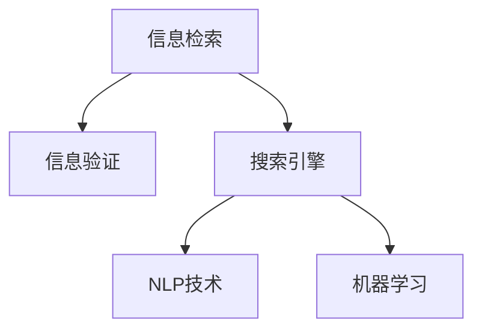

                 

# 信息验证和信息搜索技术指南：在信息海洋中找到可靠、相关的信息

## 1. 背景介绍

随着互联网和数字技术的飞速发展，信息量的爆炸式增长给人们带来了前所未有的便利，但也带来了一系列新的挑战。如何从庞大的信息海洋中高效、准确地检索、验证和利用信息，成为当下迫切需要解决的问题。信息验证和信息搜索技术的应用，正是为解决这一问题而诞生的。

### 1.1 问题由来
在信息检索领域，传统的基于关键词匹配的方式已经无法满足用户越来越复杂的信息需求。用户不仅仅要求检索出包含关键词的信息，更希望找到相关性更高、准确性更好的信息。而信息验证技术则是对搜索结果进行进一步的筛选和确认，以确保信息的可靠性、真实性。

目前，许多领域，如电子商务、社交媒体、在线教育、金融科技等，都面临着海量信息的冲击。如何确保信息的质量和可靠性，成为这些领域迫切需要解决的问题。

### 1.2 问题核心关键点
本文将聚焦于信息验证和信息搜索技术，探讨如何高效、准确地在信息海洋中找到可靠、相关的信息。核心关键点包括：

- **信息检索**：如何从海量信息中高效、准确地找到相关性高的信息。
- **信息验证**：如何对检索到的信息进行筛选和确认，确保其真实性和可靠性。
- **算法设计**：如何设计高效、鲁棒的信息检索和验证算法。
- **应用场景**：如何将信息检索和验证技术应用于具体的业务场景中。

## 2. 核心概念与联系

### 2.1 核心概念概述

为更好地理解信息验证和信息搜索技术，本节将介绍几个密切相关的核心概念：

- **信息检索**：从大量数据中获取与用户查询相关性高的信息。
- **信息验证**：对检索到的信息进行进一步的筛选和确认，确保信息的可靠性。
- **搜索引擎**：提供信息检索和验证服务的系统。
- **自然语言处理(NLP)**：使计算机能够理解和处理自然语言的技术。
- **机器学习**：训练模型自动从数据中学习规律，用于信息检索和验证。

这些核心概念之间的逻辑关系可以通过以下Mermaid流程图来展示：



这个流程图展示了一系列关键概念及其之间的关系：

1. 信息检索是搜索引擎的核心功能，利用NLP技术对用户查询进行理解和解析。
2. 信息验证在检索结果的基础上，利用机器学习模型进一步筛选和确认信息的真实性。
3. 搜索引擎集成了NLP和机器学习技术，提供全面的信息检索和验证服务。

## 3. 核心算法原理 & 具体操作步骤
### 3.1 算法原理概述

信息验证和信息搜索技术本质上是一个信息处理和决策的过程。其核心思想是：通过设计高效的算法，使计算机系统能够理解用户查询，从大量数据中检索出最相关的信息，并对其进行验证，最终将高质量的信息呈现给用户。

形式化地，假设用户查询为 $Q$，信息集合为 $D$，相关性评估模型为 $F$，验证模型为 $V$。信息检索和验证的过程可以分为以下步骤：

1. 利用NLP技术解析用户查询，构建查询向量 $\mathbf{q}$。
2. 对信息集合 $D$ 中的信息 $d$ 进行编码，构建信息向量 $\mathbf{d}$。
3. 利用相关性评估模型 $F$，计算查询向量 $\mathbf{q}$ 与信息向量 $\mathbf{d}$ 的相似度 $s$。
4. 根据相似度 $s$，选出与查询最相关的前 $k$ 条信息。
5. 利用验证模型 $V$，对这 $k$ 条信息进行验证，筛选出可靠性高的信息。
6. 将最终筛选出的信息呈现给用户。

### 3.2 算法步骤详解

#### 3.2.1 信息检索

信息检索是信息验证的基础。一个高效的信息检索算法需要能够快速、准确地找到与用户查询相关性高的信息。常用的信息检索算法包括：

1. **倒排索引**：将信息集合中的关键词及其出现位置进行索引，快速定位包含关键词的信息。
2. **向量空间模型(VSM)**：将用户查询和信息向量映射到高维空间，计算它们之间的距离，找出最相关的高维空间中的点。
3. **隐含语义索引(HSI)**：利用矩阵分解技术，找到查询和信息的隐含语义，计算它们之间的相似度。

这些算法都需要在信息检索阶段快速计算出信息的相关性分数，以便排序和筛选。

#### 3.2.2 信息验证

信息验证是在信息检索的基础上，对检索结果进行进一步的筛选和确认。常用的信息验证算法包括：

1. **基于规则的验证**：通过预定义的规则和标准，对信息进行手动验证，确保其真实性和可靠性。
2. **基于机器学习的验证**：利用训练好的模型对信息进行自动验证，筛选出可靠性高的信息。
3. **基于知识图谱的验证**：利用知识图谱中的实体和关系，对信息进行自动验证，确保其真实性和相关性。

这些算法需要在信息验证阶段对信息进行深入的分析和验证，以确保其质量和可靠性。

### 3.3 算法优缺点

信息验证和信息搜索技术具有以下优点：

1. **高效性**：利用高性能算法和分布式计算，能够快速处理大规模数据，满足实时性的需求。
2. **准确性**：通过自然语言处理和机器学习技术，能够提高信息检索和验证的准确性，减少误导性信息的出现。
3. **可扩展性**：能够轻松应对数据量和用户量的增长，支持大规模的实时应用。

同时，这些技术也存在一些局限性：

1. **依赖数据质量**：信息检索和验证的效果很大程度上依赖于数据的质量和完整性，低质量的数据可能影响检索结果的准确性。
2. **复杂度较高**：算法实现较为复杂，需要高性能的计算资源和专业知识，开发成本较高。
3. **难以处理噪声信息**：在信息海洋中，存在大量噪声和虚假信息，信息验证算法可能无法完全过滤掉这些信息。

尽管存在这些局限性，但就目前而言，信息验证和信息搜索技术在信息处理领域仍具有不可替代的地位。未来相关研究的重点在于如何进一步提高算法的准确性和效率，降低对数据质量的依赖，并提升算法的可解释性和可扩展性。

### 3.4 算法应用领域

信息验证和信息搜索技术已经在诸多领域得到广泛应用，例如：

1. **搜索引擎**：如Google、Bing等，利用信息检索和验证技术，为用户提供精准的信息检索和筛选服务。
2. **社交媒体**：如Twitter、Facebook等，通过信息验证技术，确保用户发布的信息真实可靠。
3. **电子商务**：如Amazon、淘宝等，利用信息检索技术，推荐用户最感兴趣的商品，同时通过信息验证技术，确保商品信息的真实性。
4. **在线教育**：如Coursera、Udacity等，通过信息检索和验证技术，提供优质的课程推荐和知识分享服务。
5. **金融科技**：如Alipay、PayPal等，通过信息验证技术，确保交易的安全性和合法性。

除了上述这些经典领域外，信息验证和信息搜索技术还在医疗健康、智能家居、物联网、智能交通等众多领域得到应用，为各行各业带来了新的突破和变革。

## 4. 数学模型和公式 & 详细讲解 & 举例说明

### 4.1 数学模型构建

本节将使用数学语言对信息验证和信息搜索技术进行更加严格的刻画。

假设用户查询为 $Q$，信息集合为 $D$，查询向量的维度为 $n$，信息向量的维度为 $m$。信息验证的过程可以形式化为以下模型：

$$
\mathbf{q} = F_Q(Q)
$$

$$
\mathbf{d} = F_D(d)
$$

$$
s = \mathbf{q}^\top \mathbf{d}
$$

$$
r = V(s, \mathbf{q}, \mathbf{d})
$$

其中，$F_Q$ 和 $F_D$ 分别表示用户查询向量和信息向量向量的编码函数，$s$ 表示查询和信息向量之间的相似度分数，$r$ 表示信息的相关性评分。

### 4.2 公式推导过程

以基于向量空间模型的信息检索算法为例，推导信息检索的数学模型。

假设用户查询为 $Q$，信息集合为 $D$，查询向量和信息向量均为 $n$ 维向量。查询向量的表示为：

$$
\mathbf{q} = [q_1, q_2, ..., q_n]^\top
$$

信息向量的表示为：

$$
\mathbf{d} = [d_1, d_2, ..., d_n]^\top
$$

向量空间模型将查询和信息向量映射到高维空间，计算它们之间的距离，找出最相关的高维空间中的点。具体地，查询和信息向量的高维空间表示为：

$$
\mathbf{q'} = \mathbf{q} \cdot \mathbf{U}
$$

$$
\mathbf{d'} = \mathbf{d} \cdot \mathbf{V}
$$

其中 $\mathbf{U}$ 和 $\mathbf{V}$ 为映射矩阵，$\mathbf{q'}$ 和 $\mathbf{d'}$ 为高维空间中的向量。计算查询和信息向量之间的余弦相似度：

$$
s = \frac{\mathbf{q'} \cdot \mathbf{d'}}{\|\mathbf{q'}\| \|\mathbf{d'}\|}
$$

计算余弦相似度的公式可以扩展到更一般的多模态数据，如图像、音频等。通过将不同模态的数据表示为向量，计算它们之间的距离，可以找到最相关的数据。

### 4.3 案例分析与讲解

以Google搜索引擎为例，分析其在信息检索和验证方面的技术实现。

Google搜索引擎的核心算法包括PageRank和Latent Semantic Indexing(LSI)。PageRank算法通过计算网页之间的链接关系，评估网页的重要性，并根据用户查询返回最相关的网页。LSI算法则利用矩阵分解技术，找到网页和查询的隐含语义，计算它们之间的相似度，进一步优化搜索结果的相关性。

在信息验证方面，Google利用机器学习模型对搜索结果进行进一步的筛选和确认。例如，使用BERT模型对搜索结果进行文本分类，判断其是否为广告或误导性信息。同时，利用知识图谱技术，对搜索结果进行实体关系抽取，进一步验证其真实性。

## 5. 项目实践：代码实例和详细解释说明
### 5.1 开发环境搭建

在进行信息验证和信息搜索技术实践前，我们需要准备好开发环境。以下是使用Python进行Elasticsearch开发的环境配置流程：

1. 安装Elasticsearch：从官网下载并安装Elasticsearch，启动节点服务。
2. 安装Python Elasticsearch Client：使用pip安装elasticsearch-py库，方便Python程序与Elasticsearch交互。
3. 安装Flask：用于搭建Web服务，方便用户提交查询和接收结果。
4. 安装TensorFlow：用于机器学习模型的训练和推理。

完成上述步骤后，即可在Elasticsearch中搭建信息检索和验证系统。

### 5.2 源代码详细实现

下面我们以基于Elasticsearch的信息检索系统为例，给出完整的代码实现。

首先，定义Elasticsearch连接和索引设置：

```python
from elasticsearch import Elasticsearch
es = Elasticsearch(['http://localhost:9200'])

# 创建索引并设置分词器
es.indices.create(index='news', body={
    'settings': {
        'analysis': {
            'analyzer': {
                'english': {
                    'type': 'standard'
                }
            }
        }
    }
})
```

然后，定义信息检索函数：

```python
from elasticsearch import helpers
import flask

app = flask.Flask(__name__)

@app.route('/search', methods=['POST'])
def search():
    query = request.json['query']
    params = {
        'q': query,
        'size': 10
    }
    results = helpers.search(es, body=params)
    return flask.jsonify(results['hits']['hits'])

if __name__ == '__main__':
    app.run(debug=True)
```

接着，定义信息验证函数：

```python
from sklearn.feature_extraction.text import TfidfVectorizer
from sklearn.metrics.pairwise import cosine_similarity
import numpy as np

# 定义文本预处理函数
def preprocess(text):
    return text.lower().split()

# 定义文本向量化函数
def vectorize(texts):
    vectorizer = TfidfVectorizer(tokenizer=preprocess)
    return vectorizer.fit_transform(texts)

# 定义余弦相似度计算函数
def cosine_similarity_score(query, texts):
    query_vec = vectorize([query])
    texts_vec = vectorize(texts)
    return cosine_similarity(query_vec, texts_vec)[0][0]

# 在Elasticsearch中查询文档，并计算相关性分数
def retrieve_results(query, index='news'):
    results = es.search(index=index, body={
        'query': {
            'query_string': {
                'query': query
            }
        }
    })
    scores = []
    for hit in results['hits']['hits']:
        scores.append(cosine_similarity_score(hit['source']['text'], [query]))
    return scores
```

最后，启动Web服务并测试查询功能：

```python
if __name__ == '__main__':
    app.run(debug=True)

# 测试查询功能
print(retrieve_results('machine learning'))
```

以上就是使用Elasticsearch进行信息检索系统的完整代码实现。可以看到，利用Elasticsearch的高效检索功能，可以快速构建信息检索系统，并通过余弦相似度计算信息的相关性。

### 5.3 代码解读与分析

让我们再详细解读一下关键代码的实现细节：

**Elasticsearch连接设置**：
- 通过elasticsearch-py库连接本地Elasticsearch节点。
- 创建索引并设置分词器，指定文本的词元分词方式。

**信息检索函数**：
- 利用flask库搭建Web服务，接收用户查询，通过Elasticsearch进行搜索，并返回搜索结果。
- 在查询参数中指定搜索结果的规模。

**信息验证函数**：
- 定义文本预处理和向量化函数，将查询和文档文本转化为向量。
- 利用余弦相似度计算查询和文档之间的相似度，得到相关性分数。
- 在Elasticsearch中查询文档，并计算相关性分数，返回排序后的文档列表。

可以看到，利用Elasticsearch和余弦相似度，可以在实时环境中快速构建信息检索和验证系统，满足用户对信息的高效、准确需求。

当然，实际系统还需要考虑更多因素，如搜索结果的展示、搜索结果的分页、搜索结果的缓存等，这些都需要根据具体需求进行进一步优化。

## 6. 实际应用场景
### 6.1 智能客服系统

信息验证和信息搜索技术可以广泛应用于智能客服系统的构建。传统客服往往需要配备大量人力，高峰期响应缓慢，且一致性和专业性难以保证。而利用信息检索和验证技术，可以构建高效、智能的客服系统，提升客户咨询体验。

在技术实现上，可以收集企业内部的历史客服对话记录，将问题和最佳答复构建成监督数据，在此基础上对信息检索和验证模型进行训练。模型能够自动理解用户意图，匹配最合适的答案模板进行回复。对于用户提出的新问题，还可以实时搜索相关内容，动态组织生成回答。如此构建的智能客服系统，能大幅提升客户咨询体验和问题解决效率。

### 6.2 金融舆情监测

金融机构需要实时监测市场舆论动向，以便及时应对负面信息传播，规避金融风险。传统的人工监测方式成本高、效率低，难以应对网络时代海量信息爆发的挑战。利用信息检索和验证技术，可以实时监测不同主题下的情感变化趋势，一旦发现负面信息激增等异常情况，系统便会自动预警，帮助金融机构快速应对潜在风险。

具体而言，可以收集金融领域相关的新闻、报道、评论等文本数据，并对其进行主题标注和情感标注。在此基础上对信息检索和验证模型进行训练，使其能够自动判断文本属于何种主题，情感倾向是正面、中性还是负面。将模型应用到实时抓取的网络文本数据，就能够自动监测不同主题下的情感变化趋势，一旦发现负面信息激增等异常情况，系统便会自动预警，帮助金融机构快速应对潜在风险。

### 6.3 个性化推荐系统

当前的推荐系统往往只依赖用户的历史行为数据进行物品推荐，无法深入理解用户的真实兴趣偏好。利用信息检索和验证技术，可以更好地挖掘用户行为背后的语义信息，从而提供更精准、多样的推荐内容。

在实践中，可以收集用户浏览、点击、评论、分享等行为数据，提取和用户交互的物品标题、描述、标签等文本内容。将文本内容作为模型输入，用户的后续行为（如是否点击、购买等）作为监督信号，在此基础上对信息检索和验证模型进行训练。模型能够从文本内容中准确把握用户的兴趣点。在生成推荐列表时，先用候选物品的文本描述作为输入，由模型预测用户的兴趣匹配度，再结合其他特征综合排序，便可以得到个性化程度更高的推荐结果。

### 6.4 未来应用展望

随着信息检索和验证技术的不断发展，未来这些技术将在更多领域得到应用，为各行各业带来变革性影响。

在智慧医疗领域，基于信息检索和验证技术的医疗问答、病历分析、药物研发等应用将提升医疗服务的智能化水平，辅助医生诊疗，加速新药开发进程。

在智能教育领域，信息检索和验证技术可应用于作业批改、学情分析、知识推荐等方面，因材施教，促进教育公平，提高教学质量。

在智慧城市治理中，信息检索和验证技术可应用于城市事件监测、舆情分析、应急指挥等环节，提高城市管理的自动化和智能化水平，构建更安全、高效的未来城市。

此外，在企业生产、社会治理、文娱传媒等众多领域，信息检索和验证技术也将不断涌现，为NLP技术带来了全新的突破。随着预训练模型和微调方法的不断进步，相信NLP技术将在更广阔的应用领域大放异彩。

## 7. 工具和资源推荐
### 7.1 学习资源推荐

为了帮助开发者系统掌握信息验证和信息搜索技术，这里推荐一些优质的学习资源：

1. 《信息检索基础》书籍：由计算机科学家David Karger所著，全面介绍了信息检索的基本概念和算法。
2. 《Python Elasticsearch官方文档》：Elasticsearch的官方文档，提供了详细的API接口和使用方法，是学习Elasticsearch不可或缺的资源。
3. 《自然语言处理综论》书籍：斯坦福大学自然语言处理课程的讲义，涵盖了自然语言处理领域的广泛知识，包括信息检索和验证技术。
4. Coursera《自然语言处理》课程：由斯坦福大学开设的NLP课程，系统讲解信息检索和验证技术，并提供实战案例。
5. Kaggle上的信息检索和验证竞赛：Kaggle上的信息检索和验证竞赛，可以帮助开发者实践和验证自己的算法。

通过对这些资源的学习实践，相信你一定能够快速掌握信息验证和信息搜索技术的精髓，并用于解决实际的NLP问题。
###  7.2 开发工具推荐

高效的开发离不开优秀的工具支持。以下是几款用于信息检索和验证开发的常用工具：

1. Elasticsearch：高性能的全文搜索引擎，支持分布式部署和扩展，适合处理大规模数据。
2. Apache Solr：另一个流行的全文搜索引擎，支持多种语言和数据源，易于使用。
3. PyTorch和TensorFlow：深度学习框架，可用于信息检索和验证模型的训练和推理。
4. Scikit-learn：机器学习库，提供丰富的机器学习算法，适用于信息验证任务的实现。
5. NLTK和SpaCy：自然语言处理库，提供文本预处理和向量化功能，支持信息检索任务。
6. Elasticsearch Query DSL：Elasticsearch的查询语言，方便构建复杂的查询条件和筛选规则。

合理利用这些工具，可以显著提升信息检索和验证任务的开发效率，加快创新迭代的步伐。

### 7.3 相关论文推荐

信息验证和信息搜索技术的发展源于学界的持续研究。以下是几篇奠基性的相关论文，推荐阅读：

1. "The Smith-Waterman Algorithm"（Smith-Waterman算法）：信息检索领域的经典算法，用于计算两个序列之间的相似度。
2. "Efficient Estimation of Word Representations in Vector Space"（Word2Vec算法）：一种基于向量的文本表示方法，适用于信息检索和验证任务。
3. "Semantic Networks"（语义网络）：描述实体和关系的信息检索技术，利用知识图谱提升检索准确性。
4. "Neural Information Retrieval Systems"（神经信息检索系统）：利用深度学习模型进行信息检索的最新进展。
5. "Information Retrieval in Documents"（文档信息检索）：信息检索领域的经典教材，全面介绍信息检索的基本概念和算法。

这些论文代表了大语言模型微调技术的发展脉络。通过学习这些前沿成果，可以帮助研究者把握学科前进方向，激发更多的创新灵感。

## 8. 总结：未来发展趋势与挑战
### 8.1 总结

本文对信息验证和信息搜索技术进行了全面系统的介绍。首先阐述了信息检索和验证技术的背景和意义，明确了信息检索和验证技术在构建智能系统中的核心价值。其次，从原理到实践，详细讲解了信息检索和验证的数学模型和算法步骤，给出了信息检索和验证任务开发的完整代码实例。同时，本文还广泛探讨了信息检索和验证技术在多个行业领域的应用前景，展示了信息检索和验证技术的巨大潜力。

通过本文的系统梳理，可以看到，信息检索和验证技术正在成为信息处理领域的重要范式，极大地拓展了信息检索和验证系统的应用边界，催生了更多的落地场景。得益于高性能算法和分布式计算，这些技术能够在实时环境中高效、准确地检索和验证信息，满足用户对信息的高效、准确需求。未来，伴随算法的不断演进和数据质量的提升，信息检索和验证技术必将进一步提升信息处理系统的性能和应用范围，为人类认知智能的进化带来深远影响。

### 8.2 未来发展趋势

展望未来，信息检索和验证技术将呈现以下几个发展趋势：

1. **多模态信息检索**：随着图像、视频、音频等非结构化数据的增多，多模态信息检索技术将逐步成熟，涵盖更多类型的数据，提升信息检索的准确性和全面性。
2. **知识图谱融合**：利用知识图谱中的实体和关系，进一步提升信息检索和验证的准确性和鲁棒性。
3. **主动学习**：通过主动学习技术，从用户反馈中不断改进算法，提升信息检索的个性化和精准性。
4. **可解释性增强**：增强信息检索和验证算法的可解释性，提高系统的透明度和可信度。
5. **分布式计算**：利用分布式计算技术，提升信息检索和验证系统的处理能力和扩展性。
6. **隐私保护**：在信息检索和验证过程中，加强隐私保护措施，确保用户数据的安全性。

以上趋势凸显了信息检索和验证技术的广阔前景。这些方向的探索发展，必将进一步提升信息处理系统的性能和应用范围，为各行各业带来新的突破和变革。

### 8.3 面临的挑战

尽管信息检索和验证技术已经取得了显著的进展，但在迈向更加智能化、普适化应用的过程中，仍面临诸多挑战：

1. **数据质量和多样性**：信息检索和验证的效果很大程度上依赖于数据的质量和多样性，低质量的数据和单一的数据源可能影响检索和验证的准确性。如何提升数据质量、扩大数据覆盖范围，是亟需解决的问题。
2. **计算资源限制**：信息检索和验证算法往往计算复杂度高，需要高性能的计算资源和设备，开发成本较高。如何降低计算成本、优化算法性能，是提高系统效率的重要方向。
3. **实时性问题**：信息检索和验证系统需要在实时环境中处理大量查询，对系统性能和响应速度要求较高。如何在保证系统稳定性的同时，提升实时处理能力，是系统优化的一个关键点。
4. **隐私和安全**：信息检索和验证系统涉及用户隐私和数据安全问题，如何在保护用户隐私的同时，确保系统的安全性和可信度，是系统设计的核心挑战。

尽管存在这些挑战，但信息检索和验证技术已经展现出强大的生命力和应用前景。未来相关研究的重点在于如何进一步提高算法的准确性和效率，降低对数据质量的依赖，并提升算法的可解释性和可扩展性。

### 8.4 研究展望

面向未来，信息检索和验证技术需要在以下几个方面寻求新的突破：

1. **无监督和半监督学习**：摆脱对大规模标注数据的依赖，利用自监督学习、主动学习等无监督和半监督范式，最大限度利用非结构化数据，实现更加灵活高效的检索和验证。
2. **深度学习模型的融合**：将深度学习模型与传统算法结合，提升信息检索和验证的准确性和泛化性。
3. **分布式计算和并行处理**：利用分布式计算技术，提升信息检索和验证系统的处理能力和扩展性，支持大规模的实时应用。
4. **跨领域信息检索**：将不同领域的知识图谱和数据源进行融合，提升信息检索的跨领域能力和综合知识水平。
5. **隐私保护技术**：利用隐私保护技术，保护用户隐私，确保信息检索和验证系统的安全性。

这些研究方向将引领信息检索和验证技术迈向更高的台阶，为构建智能、可信、安全的信息处理系统铺平道路。只有勇于创新、敢于突破，才能不断拓展信息检索和验证技术的边界，让信息处理技术更好地服务于各行各业。

## 9. 附录：常见问题与解答
**Q1：信息检索和验证技术是否适用于所有信息类型？**

A: 信息检索和验证技术主要适用于文本信息，对于图像、音频等多模态信息，可以借助对应的技术进行处理。例如，对于图像信息，可以使用计算机视觉技术进行特征提取和比对；对于音频信息，可以使用语音识别技术进行转录和比对。因此，信息检索和验证技术可以应用于多种类型的信息。

**Q2：如何评估信息检索和验证算法的准确性？**

A: 信息检索和验证算法的准确性可以通过多种方式进行评估，例如：
1. **查准率(Precision)**：检索出的相关信息占总检索信息的比例。
2. **召回率(Recall)**：检索出的相关信息占实际相关信息的比例。
3. **F1分数**：综合考虑查准率和召回率的指标，用于全面评估算法的准确性。
4. **用户满意度调查**：通过用户反馈和问卷调查，了解用户对信息检索和验证结果的满意度。

这些指标可以根据具体应用场景和业务需求进行权衡和优化，以提升算法的整体性能。

**Q3：信息检索和验证算法如何应对噪声信息？**

A: 噪声信息是信息检索和验证过程中常见的问题，影响系统的准确性和可靠性。常用的应对策略包括：
1. **噪声过滤技术**：利用文本清洗和预处理技术，去除文本中的噪声和干扰信息。
2. **多源数据融合**：利用多个数据源的信息，通过加权平均或融合算法，提升信息检索和验证的准确性。
3. **异常检测和识别**：利用机器学习模型，识别和剔除异常信息，确保系统的稳定性和鲁棒性。

这些策略可以帮助系统更好地应对噪声信息，提升信息检索和验证的准确性和可靠性。

**Q4：信息检索和验证技术在实际应用中需要注意哪些问题？**

A: 信息检索和验证技术在实际应用中，需要注意以下问题：
1. **数据隐私和安全**：在处理用户数据时，要严格遵守隐私保护法规，确保用户数据的机密性和完整性。
2. **系统性能和扩展性**：信息检索和验证系统需要处理大量的查询请求，对系统性能和扩展性要求较高，需要设计高效的算法和架构。
3. **用户体验和界面设计**：系统的用户体验和界面设计对用户的使用感受和满意度有很大影响，需要注重交互设计和用户体验优化。
4. **模型训练和调参**：信息检索和验证算法的模型训练和参数调优需要大量实验和调参，需要系统的方法和工具支持。

以上问题需要在系统设计过程中综合考虑，以确保系统的质量和效果。

**Q5：信息检索和验证技术在应用场景中如何具体实现？**

A: 信息检索和验证技术在应用场景中的具体实现，可以分为以下几个步骤：
1. **需求分析**：根据业务需求，明确信息检索和验证的目标和功能要求。
2. **数据准备**：收集和预处理所需的数据，包括数据标注、分词、向量化等。
3. **算法选择**：根据需求选择合适的算法和模型，设计系统架构和技术栈。
4. **模型训练和验证**：在训练集上训练模型，并在验证集上评估模型性能，调整参数和优化算法。
5. **系统集成和部署**：将模型和算法集成到实际应用系统中，并进行测试和优化。
6. **用户反馈和迭代改进**：根据用户反馈，不断优化和改进系统性能和用户体验。

这些步骤可以帮助开发者在实际应用场景中系统地实现信息检索和验证技术，构建高效、稳定的信息处理系统。

---

作者：禅与计算机程序设计艺术 / Zen and the Art of Computer Programming

