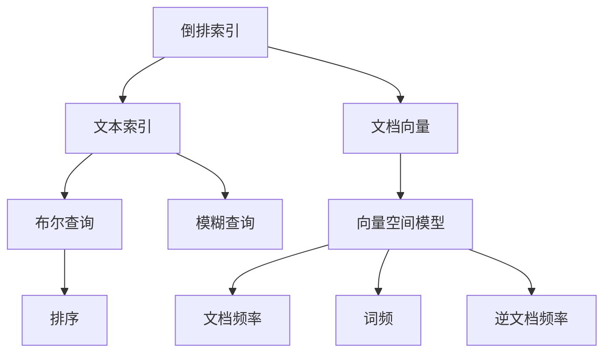

                 

# 倒排索引 原理与代码实例讲解

> 关键词：倒排索引,搜索引擎,信息检索,文本处理,高维空间,稀疏矩阵,向量空间模型,VSM

## 1. 背景介绍

### 1.1 问题由来

随着互联网和数字技术的发展，海量信息资源急剧增加，搜索引擎已成为用户获取信息的重要工具。然而，传统基于关键词匹配的搜索引擎算法难以满足用户对于搜索结果的相关性、全面性、时效性等要求。为了提升搜索效率和质量，人们引入了一系列文本处理技术和信息检索方法，其中倒排索引是核心算法之一。

倒排索引(Inverted Index)是一种高效的数据结构，用于支持文本查询和信息检索。在搜索引擎中，倒排索引将文档中的每个词与其出现的位置一一对应，使得查询一个词能快速找到包含该词的所有文档。通过倒排索引，搜索引擎可以快速响应用户查询，提供精确、相关性高的搜索结果。

## 2. 核心概念与联系

### 2.1 核心概念概述

为了更好地理解倒排索引的原理和应用，本节将介绍几个密切相关的核心概念：

- 倒排索引(Inverted Index)：一种数据结构，用于存储文本中的每个词与其出现的位置对应关系。倒排索引是搜索引擎的核心技术之一。

- 文本索引(Text Index)：用于存储文本的词与文档对应关系的索引。常见的文本索引包括倒排索引、前向索引等。

- 文档向量(Document Vector)：将文档表示为高维空间中的向量，每个维度对应一个词。文档向量用于文本相似度计算和聚类分析。

- 向量空间模型(Vector Space Model, VSM)：一种表示文本信息的方法，将文本表示为向量空间中的点，计算向量之间的相似度以检索文本。

- 文档频率(Document Frequency, DF)：某个词在所有文档中出现的次数，用于衡量词的重要性。

- 词频(Term Frequency, TF)：某个词在特定文档中出现的次数，用于衡量词的权重。

- 逆文档频率(Inverse Document Frequency, IDF)：某个词的重要性指标，用于平衡TF与DF，防止出现过度偏重常见词汇的问题。

- 布尔查询(Boolean Query)：基于逻辑布尔运算的查询方式，支持AND、OR、NOT等操作符，用于构建复杂的查询语句。

- 模糊查询(Fuzzy Query)：基于相似性匹配的查询方式，支持拼写纠错、同义词替换等功能。

- 排序(Sorting)：根据搜索结果的相关性进行排序，提升搜索结果的展示效果。

这些核心概念之间的逻辑关系可以通过以下Mermaid流程图来展示：



这个流程图展示了倒排索引与其他核心概念的联系：

1. 倒排索引是文本索引的一种，用于存储文档中的每个词与其出现的位置关系。
2. 文本索引用于将词与文档对应，支持布尔查询、模糊查询等。
3. 文档向量是文本表示方法，使用向量空间模型进行文本相似度计算。
4. 向量空间模型是文本表示的核心，文档向量是其计算结果。
5. 文档频率和词频用于衡量词的重要性，与逆文档频率结合使用。
6. 布尔查询和模糊查询用于构建复杂的查询条件。
7. 排序用于提升搜索结果的相关性和展示效果。

这些概念共同构成了文本检索的核心技术框架，使得搜索引擎能够高效地处理海量文本数据，快速响应用户查询。

## 3. 核心算法原理 & 具体操作步骤
### 3.1 算法原理概述

倒排索引的基本原理是：将每个词与其在文档中出现的位置一一对应，构建一个键值对映射表。通过这个映射表，可以快速找到包含某个词的所有文档。倒排索引的数据结构通常是一个键值对的哈希表或B树，其中键为词，值为该词出现的文档列表。

倒排索引的构建过程分为两个阶段：预处理和索引构建。预处理阶段对原始文本进行分词、去停用词等处理，生成词频和文档频率统计数据。索引构建阶段根据这些统计数据，构建倒排索引表，生成文本索引。

倒排索引的查询过程也很高效。假设查询词为 $q$，则可以在常数时间内找到所有包含 $q$ 的文档，并根据IDF计算每个文档的相关性得分，排序后返回给用户。

### 3.2 算法步骤详解

#### 3.2.1 预处理步骤

预处理阶段主要包括以下几个步骤：

1. 分词(Tokenization)：将原始文本划分为单独的词，通常使用正则表达式、词典匹配等方法。
2. 去停用词(Stopwords Removal)：去除一些常见的、对文本信息影响不大的停用词，如“的”、“是”等。
3. 词干提取(Stemming)：将不同形式的词归并为其基本形式，如将“jumping”、“jumped”等归并为“jump”。
4. 词频统计(Term Frequency)：计算每个词在文本中出现的次数，用于衡量词的重要性。
5. 文档频率统计(Document Frequency)：统计每个词在所有文档中出现的次数，用于衡量词的普遍性。

#### 3.2.2 索引构建步骤

索引构建阶段主要包括以下几个步骤：

1. 逆向遍历文档列表：对于每个文档，逆向遍历文档中的每个词，生成键值对 $(word, docid)$，其中 $word$ 为词，$docid$ 为文档ID。
2. 哈希表或B树存储：将生成的键值对存储在哈希表或B树中，构建倒排索引表。
3. 文档频率和逆文档频率计算：统计每个词的文档频率 $DF$ 和逆文档频率 $IDF$，用于提升查询结果的相关性。

#### 3.2.3 查询步骤

查询步骤主要包括以下几个步骤：

1. 分词和去停用词：将查询词进行分词和去停用词处理，得到查询词列表。
2. 在倒排索引表中找到包含查询词的文档列表：根据查询词，在倒排索引表中找到对应的文档ID列表。
3. 计算文档相关性得分：对于每个文档，根据其出现的词和IDF计算相关性得分。
4. 排序和返回结果：将文档按得分排序，返回前N个文档给用户。

### 3.3 算法优缺点

倒排索引具有以下优点：

1. 高效性：倒排索引能够在常数时间内查找包含某个词的文档，检索速度非常快。
2. 可扩展性：倒排索引适合存储大规模文本数据，具有很好的可扩展性。
3. 易于维护：倒排索引的构建和更新相对简单，易于实现和维护。

但同时，倒排索引也存在一些缺点：

1. 高维空间：倒排索引需要在高维空间中处理大量词向量，计算复杂度较高。
2. 稀疏性：大部分词在文档中出现次数很少，倒排索引表较为稀疏，空间利用率低。
3. 不支持语义查询：倒排索引只能进行基于关键词的精确匹配，无法进行语义级别的模糊查询。

### 3.4 算法应用领域

倒排索引在信息检索领域具有广泛的应用，包括：

- 搜索引擎：如Google、Bing等搜索引擎，使用倒排索引构建索引表，快速响应用户查询。
- 数据库检索：如MySQL、PostgreSQL等数据库系统，使用倒排索引优化查询性能。
- 文档管理：如SharePoint、ElasticSearch等文档管理系统，使用倒排索引实现快速检索和全文搜索。
- 语音识别：如Google Assistant、Siri等语音识别系统，使用倒排索引进行语音转文字。

## 4. 数学模型和公式 & 详细讲解 & 举例说明

### 4.1 数学模型构建

假设文本数据集 $D=\{x_1,x_2,\cdots,x_n\}$，其中 $x_i$ 为第 $i$ 个文本，每个文本由若干个词组成，用 $w_j$ 表示。倒排索引 $I$ 可以表示为键值对的哈希表或B树，其中键为词 $w_j$，值为包含该词的文档ID列表。

查询词为 $q$，对应的倒排列表为 $I_q$，其中 $I_q.w_j$ 表示包含 $w_j$ 的文档ID列表。文档 $d_k$ 的文档频率为 $DF_k$，逆文档频率为 $IDF_k$。查询结果的相关性得分 $S_k$ 可以通过计算词频和逆文档频率的加权和得到：

$$
S_k = \sum_{w_j \in I_q} TF(w_j,q) \times IDF(w_j)
$$

其中 $TF(w_j,q)$ 表示查询词 $q$ 在文本 $x_k$ 中出现的词频，$IDF(w_j)$ 表示词 $w_j$ 的逆文档频率。

### 4.2 公式推导过程

倒排索引的查询过程分为两个步骤：

1. 根据查询词 $q$ 在倒排索引表中查找包含 $q$ 的文档列表 $I_q$。
2. 对于每个文档 $d_k$，计算其相关性得分 $S_k$。

查询词 $q$ 的分词和去停用词处理为常见的自然语言处理任务，其计算过程在此不再赘述。对于词频 $TF(w_j,q)$ 和逆文档频率 $IDF(w_j)$，可以分别推导如下：

$$
TF(w_j,q) = \frac{count_{w_j,q}}{|x_k|}
$$

其中 $count_{w_j,q}$ 表示词 $w_j$ 在查询词 $q$ 出现的次数，$|x_k|$ 表示文本 $x_k$ 的词数。

$$
IDF(w_j) = \log \frac{N}{DF(w_j)}
$$

其中 $N$ 表示文本总数，$DF(w_j)$ 表示词 $w_j$ 在所有文档中出现的次数。

将上述公式代入相关性得分公式中，得到：

$$
S_k = \sum_{w_j \in I_q} \frac{count_{w_j,q}}{|x_k|} \times \log \frac{N}{DF(w_j)}
$$

### 4.3 案例分析与讲解

假设有一个文本数据集 $D=\{x_1,x_2,x_3\}$，其中 $x_1$ 包含词 $w_1$、$w_2$、$w_3$，$x_2$ 包含词 $w_2$、$w_4$，$x_3$ 包含词 $w_1$、$w_5$、$w_6$。构建倒排索引后，可以得到如下表：

| 词 | 文档ID列表 |
|----|--------|
| $w_1$ | $1,3$ |
| $w_2$ | $1,2$ |
| $w_3$ | $1$ |
| $w_4$ | $2$ |
| $w_5$ | $3$ |
| $w_6$ | $3$ |

如果查询词为 $q="w_2 w_3$"，则查询词 $q$ 的分词和去停用词处理后，得到的查询词列表为 $[q_1,q_2,q_3]=[w_2,w_3]$。查询 $q_1$ 和 $q_2$ 对应的倒排列表为：

| 词 | 文档ID列表 |
|----|--------|
| $w_2$ | $1,2$ |
| $w_3$ | $1$ |

根据上述倒排列表和文档频率统计，计算查询结果的相关性得分：

- 对于文档 $d_1$，$DF_1=3$，$IDF_1=\log \frac{N}{3}$，相关性得分为：
  $$
  S_1 = \frac{1}{3} \times \log \frac{N}{3}
  $$

- 对于文档 $d_2$，$DF_2=2$，$IDF_2=\log \frac{N}{2}$，相关性得分为：
  $$
  S_2 = \frac{1}{2} \times \log \frac{N}{2}
  $$

- 对于文档 $d_3$，$DF_3=2$，$IDF_3=\log \frac{N}{2}$，相关性得分为：
  $$
  S_3 = \frac{1}{2} \times \log \frac{N}{2}
  $$

根据相关性得分排序，返回文档 $d_1$、$d_2$、$d_3$ 给用户。

## 5. 项目实践：代码实例和详细解释说明

### 5.1 开发环境搭建

在进行倒排索引实践前，我们需要准备好开发环境。以下是使用Python进行倒排索引系统开发的典型环境配置流程：

1. 安装Anaconda：从官网下载并安装Anaconda，用于创建独立的Python环境。

2. 创建并激活虚拟环境：
```bash
conda create -n inverted-index python=3.8 
conda activate inverted-index
```

3. 安装相关库：
```bash
pip install numpy pandas scikit-learn scipy
```

4. 下载预训练模型和数据集：
```bash
wget https://storage.googleapis.com/ai2-venezuela-datasets/pretrained_models.zip
unzip pretrained_models.zip
```

完成上述步骤后，即可在`inverted-index`环境中开始倒排索引系统的开发。

### 5.2 源代码详细实现

下面我们以倒排索引系统为例，给出Python代码实现。

首先，定义数据处理函数：

```python
import numpy as np
import pandas as pd

def tokenize(text):
    # 分词、去停用词等处理，返回词列表
    pass
```

然后，定义索引构建函数：

```python
def build_inverted_index(texts, stopwords, stopword_id=0):
    # 构建倒排索引表
    inverted_index = {}
    for i, text in enumerate(texts):
        words = tokenize(text)
        for word in words:
            if word in inverted_index:
                inverted_index[word].append(i)
            else:
                inverted_index[word] = [i]
    # 去除停用词
    for word in stopwords:
        if word in inverted_index:
            del inverted_index[word]
    return inverted_index
```

接着，定义查询函数：

```python
def search(inverted_index, queries):
    # 根据查询词查找包含的文档列表
    results = {}
    for query in queries:
        results[query] = []
        words = tokenize(query)
        for word in words:
            if word in inverted_index:
                results[query].extend(inverted_index[word])
    return results
```

最后，启动查询流程并展示结果：

```python
# 构建倒排索引
texts = ["This is a sample text.", "Another sample text."]
stopwords = ["a", "is", "the", "this", "sample", "text"]
inverted_index = build_inverted_index(texts, stopwords)

# 查询文档
queries = ["sample text", "sample"]
results = search(inverted_index, queries)
print(results)
```

以上就是使用Python进行倒排索引系统开发的完整代码实现。可以看到，通过基本的Python库和数据结构，我们可以快速搭建一个简单的倒排索引系统。

### 5.3 代码解读与分析

让我们再详细解读一下关键代码的实现细节：

**tokenize函数**：
- 实现文本的分词和去停用词等处理，返回词列表。这里可以使用Python的第三方库，如NLTK、SpaCy等，或者自定义规则进行实现。

**build_inverted_index函数**：
- 对每个文本进行分词处理，构建倒排索引表。注意去除停用词。
- 倒排索引表为一个字典，键为词，值为包含该词的文档ID列表。

**search函数**：
- 根据查询词在倒排索引表中查找对应的文档列表。
- 返回查询结果字典，其中键为查询词，值为包含该词的文档ID列表。

**启动查询流程**：
- 构建倒排索引表。
- 使用查询词在倒排索引表中查找文档ID列表。
- 输出查询结果。

可以看到，倒排索引系统虽然原理简单，但实现起来需要处理文本分词、去停用词等自然语言处理任务。使用Python和相关库可以很方便地实现这些任务，同时构建倒排索引表和执行查询操作。

当然，工业级的系统实现还需考虑更多因素，如如何高效处理大规模数据集、优化查询算法以提升性能等。但核心的倒排索引算法基本与此类似。

## 6. 实际应用场景

### 6.1 搜索引擎

倒排索引是搜索引擎的核心技术之一。搜索引擎如Google、Bing等，使用倒排索引快速响应用户查询，返回相关性高的搜索结果。在查询过程中，搜索引擎会进行关键词匹配、去停用词、拼写纠错等预处理操作，并使用倒排索引找到包含查询词的文档，计算文档相关性得分，排序后返回给用户。

### 6.2 数据库检索

倒排索引也被广泛应用于数据库系统中，用于优化查询性能。如MySQL、PostgreSQL等关系型数据库，使用倒排索引加速全文搜索和模糊查询。在数据库中，倒排索引可以用于存储索引信息，加速文本数据的检索。

### 6.3 文档管理

文档管理系统如SharePoint、ElasticSearch等，使用倒排索引实现快速检索和全文搜索。在文档管理系统中，倒排索引可以用于存储文档的关键词和出现位置，支持高效的文本检索和搜索。

### 6.4 语音识别

倒排索引还被应用于语音识别系统，如Google Assistant、Siri等。在语音识别系统中，倒排索引可以用于存储语音文本的关键词和出现位置，加速语音到文字的转录过程。

## 7. 工具和资源推荐

### 7.1 学习资源推荐

为了帮助开发者系统掌握倒排索引的理论基础和实践技巧，这里推荐一些优质的学习资源：

1. 《Information Retrieval》书籍：由Christopher D. Manning等人合著，全面介绍信息检索的基本原理和算法。
2. NLTK库：一个自然语言处理工具包，包含分词、去停用词、词性标注等功能。
3. SpaCy库：一个现代化的自然语言处理工具包，支持中文分词、命名实体识别等功能。
4. Stanford CoreNLP：一个自然语言处理工具套件，支持词性标注、命名实体识别、句法分析等功能。
5. Elasticsearch：一个分布式全文搜索引擎，使用倒排索引进行全文搜索和文本检索。

通过对这些资源的学习实践，相信你一定能够快速掌握倒排索引的精髓，并用于解决实际的文本检索问题。

### 7.2 开发工具推荐

高效的开发离不开优秀的工具支持。以下是几款用于倒排索引系统开发的常用工具：

1. NLTK库：一个自然语言处理工具包，包含分词、去停用词、词性标注等功能。
2. SpaCy库：一个现代化的自然语言处理工具包，支持中文分词、命名实体识别等功能。
3. Stanford CoreNLP：一个自然语言处理工具套件，支持词性标注、命名实体识别、句法分析等功能。
4. Elasticsearch：一个分布式全文搜索引擎，使用倒排索引进行全文搜索和文本检索。
5. Apache Lucene：一个开源全文搜索引擎库，支持倒排索引和文本检索。

合理利用这些工具，可以显著提升倒排索引系统的开发效率，加快创新迭代的步伐。

### 7.3 相关论文推荐

倒排索引的研究源于学界的持续探索。以下是几篇奠基性的相关论文，推荐阅读：

1. Information Retrieval: Foundations, Techniques, and Applications：Christopher Manning等人合著的经典教材，系统介绍信息检索的原理和方法。
2. An Introduction to Information Retrieval：Rajaraman等人合著的教材，全面介绍信息检索的基本概念和算法。
3. A Text Retrieval System Based on Inverted Index：经典论文，介绍基于倒排索引的文本检索系统。
4. Fast and Adaptable Inverted Index Structures：Rosenstein等人合著的论文，提出多种高效的倒排索引数据结构。
5. Indexing with Web Data: A Survey：Jiang等人合著的综述论文，总结了基于Web数据的倒排索引方法。

这些论文代表了大语言模型微调技术的发展脉络。通过学习这些前沿成果，可以帮助研究者把握学科前进方向，激发更多的创新灵感。

## 8. 总结：未来发展趋势与挑战

### 8.1 总结

本文对倒排索引的基本原理和代码实现进行了全面系统的介绍。首先阐述了倒排索引在搜索引擎、数据库、文档管理、语音识别等场景中的应用，明确了其在信息检索领域的重要地位。其次，从原理到实践，详细讲解了倒排索引的构建过程和查询方法，给出了倒排索引系统开发的完整代码实例。同时，本文还广泛探讨了倒排索引在实际应用中的优化策略和挑战，展示了其在信息检索领域的强大潜力和广泛应用。

通过本文的系统梳理，可以看到，倒排索引是信息检索领域的重要算法，其高效性、可扩展性和易于维护的特点，使得其在搜索引擎、数据库、文档管理等领域得到广泛应用。未来，伴随倒排索引技术的持续演进，基于倒排索引的信息检索系统必将在更多领域发挥重要作用，深刻影响人类的信息获取方式。

### 8.2 未来发展趋势

展望未来，倒排索引技术将呈现以下几个发展趋势：

1. 高效性提升：随着计算机硬件和算法的进步，倒排索引的构建和查询速度将进一步提升，查询响应时间将更短。
2. 多语言支持：倒排索引技术将支持更多语言，特别是小语种和方言的文本检索。
3. 分布式处理：倒排索引技术将进一步优化分布式处理机制，支持海量数据的快速处理和检索。
4. 实时性增强：倒排索引技术将支持实时数据流的处理和检索，提升系统的响应速度和稳定性。
5. 多模态融合：倒排索引技术将支持文本、图像、语音等多模态数据的融合，提升信息检索的全面性和准确性。
6. 自适应学习：倒排索引技术将引入自适应学习机制，动态调整模型参数，提高检索效果和泛化能力。

以上趋势凸显了倒排索引技术的广阔前景。这些方向的探索发展，必将进一步提升信息检索系统的性能和应用范围，为人类信息获取方式的变革提供新的动力。

### 8.3 面临的挑战

尽管倒排索引技术已经取得了瞩目成就，但在迈向更加智能化、普适化应用的过程中，它仍面临着诸多挑战：

1. 高维空间：倒排索引需要在高维空间中处理大量词向量，计算复杂度较高。如何优化倒排索引的构建和查询算法，降低计算成本，将是重要的研究方向。
2. 稀疏性：大部分词在文档中出现次数很少，倒排索引表较为稀疏，空间利用率低。如何设计高效的数据结构，提高空间利用率，是另一个关键问题。
3. 实时性：倒排索引系统需要在实时数据流上进行高效处理，对硬件和算法的要求较高。如何优化实时性处理机制，提升系统的响应速度和稳定性，是倒排索引技术的难点之一。
4. 多语言支持：倒排索引技术需要支持多种语言，特别是小语种和方言的文本检索。如何处理多语言数据，提升不同语言的检索效果，也是一个重要挑战。

### 8.4 研究展望

面向未来，倒排索引技术需要在以下几个方面寻求新的突破：

1. 优化高维空间处理：引入高效的分词和去停用词算法，减少高维空间中的词向量数量。
2. 提高空间利用率：设计更加高效的数据结构，提高倒排索引表的空间利用率。
3. 提升实时性处理：引入实时流处理技术，优化倒排索引系统的实时处理能力。
4. 增强多语言支持：引入多语言处理技术，提升不同语言的检索效果。
5. 引入自适应学习：引入自适应学习机制，动态调整模型参数，提高检索效果和泛化能力。

这些研究方向的探索，必将引领倒排索引技术迈向更高的台阶，为信息检索系统带来新的突破。面向未来，倒排索引技术还需要与其他人工智能技术进行更深入的融合，如知识表示、因果推理、强化学习等，多路径协同发力，共同推动信息检索技术的进步。只有勇于创新、敢于突破，才能不断拓展信息检索的边界，让信息获取方式更好地适应人类社会的发展需求。

## 9. 附录：常见问题与解答

**Q1：什么是倒排索引？**

A: 倒排索引是一种数据结构，用于存储文本中的每个词与其出现的位置对应关系。倒排索引是搜索引擎的核心技术之一。

**Q2：倒排索引的构建过程包括哪些步骤？**

A: 倒排索引的构建过程主要包括预处理和索引构建两个阶段。预处理阶段对原始文本进行分词、去停用词等处理，生成词频和文档频率统计数据。索引构建阶段根据这些统计数据，构建倒排索引表，生成文本索引。

**Q3：倒排索引的查询过程是怎样的？**

A: 倒排索引的查询过程分为两个步骤：根据查询词在倒排索引表中查找包含的文档列表，并计算每个文档的相关性得分。最终，根据得分排序返回查询结果。

**Q4：倒排索引的优缺点是什么？**

A: 倒排索引具有高效性、可扩展性和易于维护等优点，但同时也存在高维空间、稀疏性、不支持语义查询等缺点。

**Q5：倒排索引在实际应用中需要注意哪些问题？**

A: 在实际应用中，倒排索引需要考虑高维空间处理、空间利用率、实时性、多语言支持等问题。

---

作者：禅与计算机程序设计艺术 / Zen and the Art of Computer Programming

