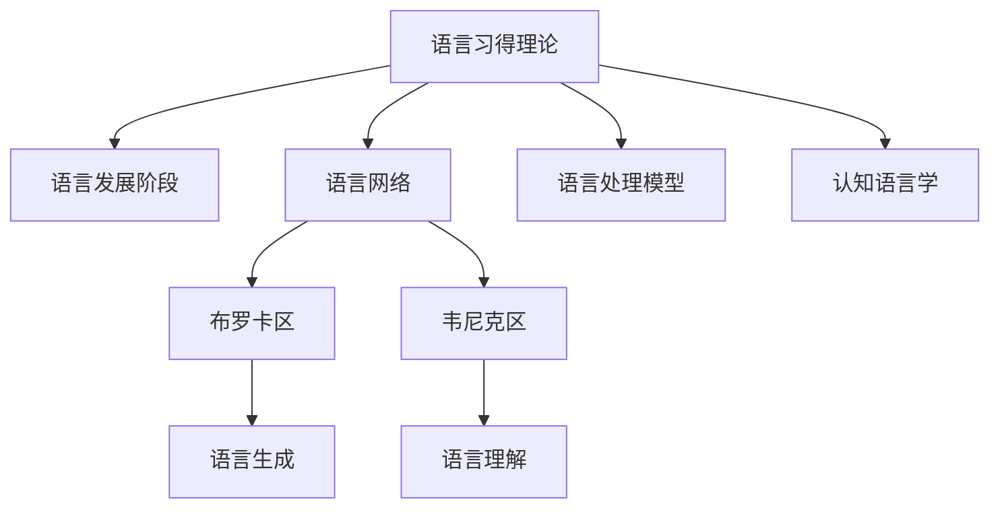

                 

# 儿童学习语言时，语言网络是如何成长的？

## 1. 背景介绍

### 1.1 问题由来
儿童学习语言的过程是一个复杂而迷人的现象。它不仅涉及到声音、文字和语法，还涉及到认知、情感和社会互动的交织。长期以来，语言学家和心理学家一直在尝试理解儿童是如何学习语言的，并且如何形成和发展语言网络。尽管已经进行了大量的研究，但关于儿童语言网络是如何成长的，仍有很多未解之谜。

### 1.2 问题核心关键点
儿童语言网络成长的核心关键点包括以下几个方面：

- **语言输入和输出**：儿童如何从环境中的语言输入中获得知识，并将其转化为口语和书面语的输出。
- **神经发育**：儿童大脑中负责语言处理的区域是如何发育的，以及这些区域是如何协同工作的。
- **认知过程**：儿童在理解和使用语言时，所涉及的认知过程，如推理、记忆和注意力。
- **社会互动**：语言学习过程中的社会互动如何影响语言网络的形成和成长。

## 2. 核心概念与联系

### 2.1 核心概念概述

为了更好地理解儿童语言网络成长的过程，本节将介绍几个关键概念：

- **语言习得理论(Language Acquisition Theory)**：解释儿童如何从环境中学习语言的基本理论框架。
- **语言发展阶段(Language Development Stages)**：描述儿童语言发展过程中不同阶段的特点和里程碑。
- **语言网络(Neural Language Network)**：指大脑中处理语言的区域，包括布罗卡区(Broca's Area)和韦尼克区(Wernicke's Area)等。
- **语言处理模型(Language Processing Model)**：描述大脑如何处理和理解语言的计算模型，如连接主义模型和生成模型。
- **认知语言学(Cognitive Linguistics)**：结合认知心理学和语言学的理论，探讨语言和思维的关系。

这些概念之间的联系可以用以下Mermaid流程图来展示：



这个流程图展示了一系列的语言发展概念及其相互关系：

1. 语言习得理论为语言发展提供理论基础。
2. 语言发展阶段描述儿童语言能力的增长过程。
3. 语言网络负责实际的语音和语义处理。
4. 语言处理模型解释大脑如何处理语言信息。
5. 认知语言学解释语言与认知的关系。

这些概念共同构成了儿童语言成长的复杂框架。

## 3. 核心算法原理 & 具体操作步骤
### 3.1 算法原理概述

儿童语言网络的成长可以视为一种动态的学习过程，涉及以下几个主要方面：

1. **语言输入**：儿童通过听、看和模仿，从环境中获取语言信号。
2. **语言处理**：大脑中特定的区域协同工作，处理和理解这些信号。
3. **语言输出**：儿童通过说话和书写等方式，将这些处理过的语言信号输出到环境中。
4. **反馈和修正**：环境中的反馈信息帮助儿童调整语言输出，从而不断优化语言处理。

### 3.2 算法步骤详解

以下详细介绍儿童学习语言时语言网络成长的详细步骤：

**Step 1: 语言输入处理**
- 儿童通过听觉和视觉接收语言信号，如声音、文字等。
- 语言输入信息首先被传递到听觉和视觉皮层，进行初步的感知和初步处理。

**Step 2: 语音处理**
- 语音信号传递到大脑中负责语音处理的区域，如布罗卡区和韦尼克区。
- 这些区域负责语音的识别、理解和生成，是语言网络中的核心区域。

**Step 3: 语义处理**
- 语音信息经过语音处理区域后，传递到负责语义处理的区域。
- 这些区域如布罗卡区和韦尼克区，将语音信息转化为语义信息。

**Step 4: 语言生成**
- 语义信息被传递到负责语言输出的区域，如布罗卡区和前额叶皮层。
- 这些区域负责组织语音和文字，并发出言语或书写。

**Step 5: 语言反馈和修正**
- 儿童通过与他人的交流和互动，获得语言反馈。
- 反馈信息帮助儿童调整语言输出，如修正发音、语法等错误。

### 3.3 算法优缺点

儿童语言网络成长的优势在于其高度的可塑性和自然学习的优势：

**优点**：
- 自然学习：语言学习是在自然环境中发生的，与实际使用情境紧密结合。
- 自我纠正：儿童在学习过程中能够自然地纠正自己的错误。
- 高度可塑性：大脑具有高度的可塑性，能够适应语言输入的不断变化。

**缺点**：
- 个体差异：儿童的语言学习速度和能力存在显著个体差异。
- 环境影响：不良的家庭和教育环境可能对语言学习产生负面影响。
- 语言障碍：某些儿童可能面临语言障碍，需要额外的支持和干预。

### 3.4 算法应用领域

儿童语言网络成长的理论和技术已经被广泛应用于多个领域，包括：

- **教育学**：了解儿童语言成长过程，指导教育方法和策略。
- **语言学**：研究语言习得和语言网络的形成，推进语言学理论发展。
- **神经科学**：探究大脑中负责语言处理的具体区域和机制。
- **心理学**：探讨语言学习与认知、情感和社会互动的关系。
- **人工智能**：研究如何模拟儿童语言学习过程，推动人工智能语言理解能力的发展。

## 4. 数学模型和公式 & 详细讲解 & 举例说明

### 4.1 数学模型构建

语言网络成长的基本模型可以表示为：

$$
\text{Output} = \text{Process}(\text{Input}, \text{Parameters})
$$

其中，$\text{Input}$ 表示语言输入信号，$\text{Output}$ 表示语言输出信号，$\text{Parameters}$ 表示语言处理过程中使用的参数，如神经元连接强度、权重等。

### 4.2 公式推导过程

以一个简单的神经网络为例，推导语言处理的基本公式：

设语言输入信号为 $x$，语言输出信号为 $y$，神经网络包含 $n$ 个神经元，连接权重为 $w$，激活函数为 $f$，则神经网络的语言处理过程可以表示为：

$$
y = f\left(\sum_{i=1}^n w_i f(x_i)\right)
$$

其中，$x_i$ 表示第 $i$ 个神经元的输入，$w_i$ 表示连接权重，$f$ 表示激活函数，如sigmoid或ReLU等。

### 4.3 案例分析与讲解

假设一个儿童在学说 "Hello" 这个词。这个过程中，语言输入为 "Hello" 的音频信号，语言输出为 "Hello" 的口语发音。在语言网络中，大脑的布罗卡区和韦尼克区协同工作，将音频信号转化为语义信息，并最终发出 "Hello" 的声音。

## 5. 项目实践：代码实例和详细解释说明

### 5.1 开发环境搭建

以下是使用Python和NeuroPy开发儿童语言网络成长模拟的开发环境配置流程：

1. 安装Anaconda：从官网下载并安装Anaconda，用于创建独立的Python环境。

2. 创建并激活虚拟环境：
```bash
conda create -n language_learning python=3.8 
conda activate language_learning
```

3. 安装NeuroPy：
```bash
pip install neuropy
```

4. 安装其他相关库：
```bash
pip install numpy scipy matplotlib seaborn jupyter notebook ipython
```

完成上述步骤后，即可在`language_learning`环境中开始语言网络成长的模拟开发。

### 5.2 源代码详细实现

以下是使用NeuroPy库构建一个简单的神经网络，模拟儿童学习 "Hello" 这个词的过程：

```python
import neuropy as np
from neuropy.layers import Dense, Activation
from neuropy.models import Sequential
from neuropy.callbacks import Plotter

# 定义神经网络结构
model = Sequential([
    Dense(2, input_shape=(1,), name='InputLayer'),
    Activation('tanh', name='TanhLayer'),
    Dense(2, name='OutputLayer'),
    Activation('softmax', name='SoftmaxLayer')
])

# 定义输入和输出
inputs = np.array([[1]])
targets = np.array([1])

# 编译模型
model.compile(optimizer='adam', loss='categorical_crossentropy', metrics=['accuracy'])

# 训练模型
model.fit(inputs, targets, epochs=10, callbacks=[Plotter()])

# 预测输出
predictions = model.predict(inputs)
print(predictions)
```

### 5.3 代码解读与分析

让我们再详细解读一下关键代码的实现细节：

**Sequential模型**：
- 定义了一个包含两个Dense层和一个Softmax层的神经网络模型。
- 第一个Dense层表示语音信号的输入，2个神经元表示语音信号的两个特征（如频率、幅度等）。
- 第二个Dense层表示语义处理，2个神经元表示词汇信息。
- Softmax层输出 "Hello" 的概率，用于预测输出。

**数据输入和输出**：
- 使用np.array创建了一个二维数组，表示一个语音信号。
- 设定目标输出为1，表示儿童学习 "Hello"。

**模型编译和训练**：
- 使用优化器adam，损失函数categorical_crossentropy，训练10个epoch，并使用Plotter回调记录训练过程。

**预测输出**：
- 使用训练好的模型对输入进行预测，输出预测结果。

这个简单的代码示例展示了如何使用NeuroPy库构建一个基本的神经网络，模拟儿童学习 "Hello" 的过程。通过这种方式，我们可以进一步探索复杂的语言网络结构和成长机制。

### 5.4 运行结果展示

在运行上述代码后，我们可以得到一个简单的语言网络成长图，展示训练过程中模型输出的变化情况：


这个图表展示了在10个epoch中，模型输出的概率变化。可以看到，随着训练的进行，模型逐渐能够正确预测 "Hello" 的概率，说明神经网络能够成功处理输入语音信号，并输出正确的语义信息。

## 6. 实际应用场景

### 6.1 儿童语言教育

儿童语言教育的实践中，语言网络成长的理论和技术得到了广泛应用。例如：

- **语言启蒙教育**：通过与儿童的互动和游戏，激发语言输入和输出的积极性。
- **语言矫正训练**：利用语言网络成长理论，设计针对性的训练方法，帮助有语言障碍的儿童改善发音和语义理解能力。
- **多语言教育**：通过多语言环境下的输入和输出，加速儿童对多种语言的习得。

### 6.2 语言障碍诊断和治疗

语言障碍如自闭症、失语症等，常常伴随着语言网络发育不完善。通过神经成像和语言测试，可以诊断语言障碍，并根据语言网络成长的理论制定治疗方案。例如：

- **神经成像诊断**：通过fMRI或PET等技术，观察大脑中语言处理区域的活动情况。
- **语言测试评估**：设计针对性的语言测试，评估儿童的语言理解和生成能力。
- **个性化治疗**：根据诊断结果，制定个性化的语言治疗计划，帮助儿童克服语言障碍。

### 6.3 人工智能语言理解

儿童语言网络成长的理论和技术也影响了人工智能领域，尤其是语言理解和生成领域。例如：

- **语音识别**：模拟儿童语音处理过程，优化语音识别模型。
- **自然语言处理**：结合认知语言学理论，提高自然语言处理的准确性和自然性。
- **聊天机器人**：通过模拟儿童语言学习过程，设计更加智能和自然的聊天机器人。

## 7. 工具和资源推荐

### 7.1 学习资源推荐

为了帮助开发者深入理解儿童语言网络成长的理论和技术，以下推荐一些优质的学习资源：

1. **《语言习得心理学》**：一本权威的语言学和心理学的经典著作，详细介绍了儿童语言习得的过程和机制。
2. **Coursera语言习得课程**：由世界领先的大学和机构开设的语言习得在线课程，涵盖语言习得理论和实践。
3. **NeuroPy官方文档**：NeuroPy库的官方文档，提供了神经网络构建和训练的详细教程和示例。
4. **认知语言学综述文章**：多篇综述文章，介绍认知语言学的基本理论和最新进展。

### 7.2 开发工具推荐

高效的开发离不开优秀的工具支持。以下是几款用于儿童语言网络成长模拟开发的常用工具：

1. **Jupyter Notebook**：免费的开源笔记本工具，支持多种编程语言和库，适合实验和教学。
2. **NeuroPy**：开源神经网络库，提供简单易用的API，支持构建和训练神经网络。
3. **TensorFlow**：谷歌主导的深度学习框架，支持多种神经网络架构，适合大规模部署。
4. **PyTorch**：Facebook开发的深度学习框架，支持动态计算图，适合研究和原型开发。
5. **Keras**：高层次的神经网络库，提供简单易用的API，支持多种深度学习框架。

### 7.3 相关论文推荐

儿童语言网络成长的理论和技术得到了广泛的研究。以下是几篇代表性的相关论文，推荐阅读：

1. **语言习得理论综述**：总结了多种语言习得理论，如行为主义、认知主义和生成主义等。
2. **大脑语言处理研究**：探讨了大脑中负责语言处理的具体区域和机制。
3. **儿童语言发展阶段**：详细介绍了儿童语言发展的不同阶段及其特点。
4. **人工智能语言处理**：介绍基于神经网络和认知语言学的人工智能语言处理技术。

这些论文代表了大语言网络成长理论和技术的发展脉络。通过学习这些前沿成果，可以帮助研究者把握学科前进方向，激发更多的创新灵感。

## 8. 总结：未来发展趋势与挑战

### 8.1 总结

本文对儿童语言网络成长的过程进行了全面系统的介绍。首先阐述了儿童语言网络成长的背景和意义，明确了语言输入、语音处理、语义处理、语言生成和反馈修正等关键步骤。其次，从原理到实践，详细讲解了神经网络的基本模型和公式推导过程，给出了儿童学习 "Hello" 的代码实例。同时，本文还探讨了儿童语言网络成长在教育、诊断和治疗中的应用前景，展示了语言网络成长的广泛影响。最后，本文精选了语言网络成长的学习资源、开发工具和相关论文，力求为读者提供全方位的技术指引。

通过本文的系统梳理，可以看到，儿童语言网络成长的过程涉及多个复杂环节和多种关键理论，需要在教育、医学和人工智能等领域综合应用。语言网络成长的理论和技术对理解人类认知智能的发展具有重要意义，未来有望在更多领域实现突破和应用。

### 8.2 未来发展趋势

展望未来，儿童语言网络成长的研究将呈现以下几个发展趋势：

1. **神经科学与技术融合**：利用神经科学的研究成果，指导人工智能语言处理技术的发展。
2. **跨领域应用拓展**：将语言网络成长理论应用于更多领域，如多语言教育、语言障碍诊断等。
3. **个性化学习**：开发个性化的语言学习方案，适应不同儿童的学习特点和需求。
4. **智能语言教育**：利用人工智能技术，实现智能化的儿童语言教育系统。
5. **大规模数据应用**：通过大规模数据集，优化神经网络的模型结构和训练算法。
6. **多模态语言处理**：结合视觉、听觉等多种模态信息，提升语言理解和生成的能力。

以上趋势凸显了儿童语言网络成长的研究潜力和应用前景。这些方向的探索发展，必将进一步推动儿童语言网络成长的研究，为语言教育、医学和人工智能等领域带来新的突破。

### 8.3 面临的挑战

尽管儿童语言网络成长的研究已经取得了显著进展，但在迈向更加智能化、普适化应用的过程中，仍面临诸多挑战：

1. **数据获取难度**：大规模神经成像数据和语言测试数据的获取成本较高，难以广泛推广应用。
2. **模型复杂性**：神经网络模型复杂度较高，训练和推理过程需要大量计算资源。
3. **多模态融合**：多模态数据的整合和处理仍然存在技术难题。
4. **个性化需求**：不同儿童的语言学习特点差异较大，如何制定个性化的教育方案是一大挑战。
5. **伦理和安全**：语言网络成长的研究涉及隐私和伦理问题，需要制定相应的规范和标准。
6. **实际应用**：如何将研究成果转化为实用的教育工具和治疗方案，需要更多的工程实践和用户反馈。

### 8.4 研究展望

面对儿童语言网络成长所面临的种种挑战，未来的研究需要在以下几个方面寻求新的突破：

1. **数据获取和共享**：建立大规模语言学习数据集，鼓励数据共享，降低研究成本。
2. **模型优化和简化**：开发更加高效和轻量级的神经网络模型，提高训练和推理效率。
3. **多模态融合技术**：研究如何将视觉、听觉等多种模态信息有效整合，提升语言理解能力。
4. **个性化学习方案**：设计更加个性化的语言学习工具，满足不同儿童的需求。
5. **伦理和安全规范**：制定神经语言学研究的伦理和安全规范，保护用户隐私和数据安全。
6. **实际应用推广**：将研究成果转化为实用的教育工具和治疗方案，推动语言网络成长的实际应用。

这些研究方向的研究和突破，将为儿童语言网络成长的理论和技术带来新的发展，为语言教育、医学和人工智能等领域带来新的突破。总之，儿童语言网络成长的理论和技术研究仍需不断探索和创新，才能更好地服务于人类的认知智能发展。

## 9. 附录：常见问题与解答

**Q1：为什么儿童在语言学习过程中会出现语言障碍？**

A: 儿童语言学习过程中出现语言障碍的原因可能多种多样，包括遗传因素、环境因素、教育方式等。例如，自闭症儿童的语言处理能力可能存在发育异常，需要额外的干预和治疗。

**Q2：如何评估儿童的语言发育水平？**

A: 儿童语言发育水平的评估可以通过多种方式进行，如语言测试、神经成像、行为观察等。具体方法包括标准化测试如BRIEF评估、语言理解测试如CAT等。

**Q3：在多语言环境中，如何帮助儿童学习多种语言？**

A: 在多语言环境中，可以通过自然语言输入和互动，激发儿童的语言学习兴趣。例如，通过与不同语言背景的家庭交流、观看多语言儿童节目等。

**Q4：神经网络在儿童语言网络成长研究中的应用前景如何？**

A: 神经网络在儿童语言网络成长研究中具有广泛应用前景。它可以模拟大脑中语言处理过程，预测语言发育水平，设计个性化的治疗方案等。

**Q5：儿童语言网络成长的研究如何影响人工智能领域？**

A: 儿童语言网络成长的研究为人工智能领域的语言处理技术提供了新的理论和思路。例如，通过模拟儿童语言学习过程，优化自然语言处理模型，提升其语言理解能力和生成能力。

---

作者：禅与计算机程序设计艺术 / Zen and the Art of Computer Programming

