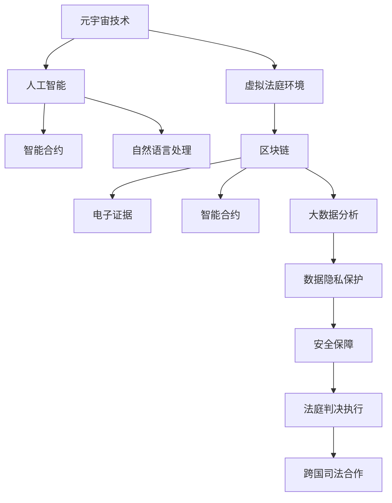
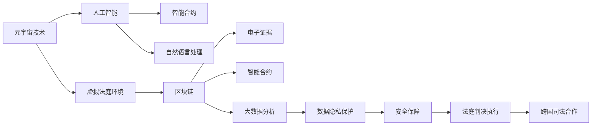

                 

# 元宇宙中的虚拟法庭:跨国纠纷解决的新平台

> 关键词：元宇宙, 虚拟法庭, 跨国纠纷解决, 人工智能, 区块链, 电子证据, 智能合约, 隐私保护, 安全保障

## 1. 背景介绍

### 1.1 元宇宙的概念及其发展

元宇宙(Metaverse)是指一个由多个虚拟世界和数字领域构成的、可交互的虚拟空间。它由多个用户创造的虚拟环境和体验组成，可以包含数字身份、虚拟物品、虚拟经济等多种元素，并具备高度的可交互性和沉浸感。自2021年Facebook公司正式更名为Meta以来，元宇宙迅速成为科技界的焦点话题，吸引了全球众多企业和个人的广泛关注。

元宇宙的诞生，源于人们对虚拟世界的无限憧憬和真实世界的数字化转型需求。它不仅带来了全新的社交、娱乐和生活方式，还为经济、政治、法律等领域提供了新的应用场景和创新机会。在法律领域，虚拟法庭的兴起，为跨国纠纷解决提供了一种新的解决方案，使得跨国法律事务的执行和监督变得更加高效和公正。

### 1.2 虚拟法庭的兴起

虚拟法庭是指在元宇宙中建立的一种虚拟化的法律审判系统，它利用人工智能、区块链、大数据等前沿技术，为跨国纠纷解决提供全新的平台。与传统的线下法庭不同，虚拟法庭可以在元宇宙环境中实现更加灵活、高效、安全的纠纷解决，同时还能增强审判的透明度和参与度，提升用户满意度。

虚拟法庭的应用场景包括但不限于：
1. **跨国商业纠纷**：国际贸易、知识产权、金融合同等跨国商业纠纷的解决。
2. **知识产权纠纷**：版权、专利、商标等知识产权相关的纠纷调解。
3. **消费者权益保护**：在线购物、网络服务等方面的消费者权益保护。
4. **劳动争议**：跨国公司与员工之间的劳动争议仲裁。
5. **遗产继承**：跨国遗产继承纠纷的裁决。

虚拟法庭的兴起，得益于元宇宙技术的快速发展和人们对数字化、智能化审判的需求增加。它不仅能节省时间和成本，还能提高审判的公平性和透明度，为法律体系的数字化转型提供新的突破。

### 1.3 跨国纠纷解决的挑战

在当前的国际法律体系下，跨国纠纷解决面临诸多挑战：
1. **管辖权冲突**：不同国家之间的法律体系和司法管辖权存在较大差异，难以达成一致。
2. **证据收集和保存**：跨国案件涉及多国证据，收集和保存难度较大，且易受政治、法律等影响。
3. **法律适用**：不同国家的法律规定和解释存在较大差异，选择适用法律需经过复杂论证。
4. **执行困难**：跨国案件的判决难以在对方国家得到有效执行，存在执行难的问题。
5. **成本和时间**：传统的跨国纠纷解决方式成本高、时间长，效率低下。

为应对这些挑战，虚拟法庭应运而生，利用前沿技术实现跨国纠纷解决的自动化、数字化和智能化，提升审判效率和公平性。

## 2. 核心概念与联系

### 2.1 核心概念概述

虚拟法庭的实现涉及多个核心概念和技术，包括但不限于：
1. **元宇宙技术**：用于构建虚拟法庭的虚拟环境。
2. **人工智能**：用于自动化审判和智能合约执行。
3. **区块链技术**：用于保证审判过程和证据的真实性和不可篡改性。
4. **大数据分析**：用于案件数据分析和预测。
5. **隐私保护技术**：用于保护用户和企业的敏感信息。
6. **安全保障**：用于防止黑客攻击和数据泄露。

这些核心概念之间相互联系，共同构成了虚拟法庭的技术基础。通过合理解释和应用这些技术，虚拟法庭能够为跨国纠纷解决提供高效、公正、安全的平台。

### 2.2 核心概念原理和架构的 Mermaid 流程图



该图展示了虚拟法庭的核心架构和技术流程，从元宇宙技术的构建到最终的司法判决执行，每一步都依赖于关键技术。

### 2.3 核心概念原理和架构的 Mermaid 流程图(Mermaid 流程节点中不要有括号、逗号等特殊字符)



## 3. 核心算法原理 & 具体操作步骤

### 3.1 算法原理概述

虚拟法庭的核心算法原理基于人工智能、区块链和大数据分析技术，旨在实现跨国纠纷解决的自动化、数字化和智能化。

1. **人工智能**：用于自动化审判和智能合约执行。通过自然语言处理(NLP)、机器学习(ML)等技术，虚拟法庭可以自动分析案件材料、证据，并生成判决建议。
2. **区块链技术**：用于保证审判过程和证据的真实性和不可篡改性。通过区块链技术，审判过程和证据可以保存在不可篡改的链上，确保审判的公正性和透明度。
3. **大数据分析**：用于案件数据分析和预测。通过大数据分析，虚拟法庭可以预测案件的发展趋势，帮助法官和律师做出更准确的判决和策略。

### 3.2 算法步骤详解

虚拟法庭的实现步骤如下：
1. **案件提交**：用户或律师在虚拟法庭平台上提交案件材料和证据。
2. **智能合约执行**：智能合约自动验证案件材料的合法性和完整性。
3. **人工智能辅助审判**：人工智能系统自动分析案件材料和证据，生成判决建议。
4. **区块链存储**：将审判过程和证据保存在区块链上，确保其真实性和不可篡改性。
5. **判决生成**：法官根据人工智能的建议，结合自身法律知识，生成最终判决。
6. **判决执行**：将判决结果上传至区块链，并在元宇宙环境中进行公开和监督。

### 3.3 算法优缺点

虚拟法庭具有以下优点：
1. **高效性**：通过自动化和数字化，大大缩短了审判时间和成本。
2. **公正性**：区块链技术保证了审判过程和证据的真实性和不可篡改性，提高了审判的公正性。
3. **透明度**：审判过程公开透明，每个步骤都有记录，提高了审判的透明度。
4. **灵活性**：在元宇宙环境中，审判可以灵活调整，适应不同的审判场景和需求。

但虚拟法庭也存在以下缺点：
1. **技术门槛高**：构建和维护虚拟法庭需要较高的技术门槛，需具备相关领域的专业知识和技术能力。
2. **数据隐私风险**：在虚拟法庭中，用户的敏感信息需要保护，防止数据泄露和滥用。
3. **法律适用复杂**：不同国家的法律体系和司法实践存在差异，选择适用法律需经过复杂论证。
4. **技术成熟度不足**：虚拟法庭技术尚处于发展初期，存在一些技术上的不完善和不确定性。

### 3.4 算法应用领域

虚拟法庭的应用领域包括但不限于：
1. **跨国商业纠纷**：国际贸易、知识产权、金融合同等跨国商业纠纷的解决。
2. **知识产权纠纷**：版权、专利、商标等知识产权相关的纠纷调解。
3. **消费者权益保护**：在线购物、网络服务等方面的消费者权益保护。
4. **劳动争议**：跨国公司与员工之间的劳动争议仲裁。
5. **遗产继承**：跨国遗产继承纠纷的裁决。

## 4. 数学模型和公式 & 详细讲解 & 举例说明

### 4.1 数学模型构建

虚拟法庭的实现涉及多个数学模型和算法，以下介绍其中的关键模型。

1. **人工智能模型**：
   - 自然语言处理(NLP)模型：用于分析和处理自然语言文本。
   - 机器学习(ML)模型：用于生成判决建议。
   - 知识图谱模型：用于建立法律知识库和案例库。

2. **区块链模型**：
   - 共识算法模型：用于保证区块链的共识机制。
   - 智能合约模型：用于自动化审判和证据验证。

3. **大数据模型**：
   - 数据清洗模型：用于处理和清洗数据。
   - 数据挖掘模型：用于发现数据中的规律和趋势。

### 4.2 公式推导过程

以智能合约模型为例，介绍其核心算法和公式。

智能合约的核心公式如下：

$$
C = P + \lambda M + \alpha R
$$

其中，$C$ 表示智能合约执行结果，$P$ 表示案件材料合法性验证结果，$M$ 表示人工智能生成的判决建议，$\lambda$ 和 $\alpha$ 分别表示案件材料和判决建议的权重。

智能合约的执行步骤如下：
1. **输入**：将案件材料和判决建议输入智能合约。
2. **合法性验证**：智能合约验证案件材料的合法性和完整性。
3. **评分计算**：根据案件材料和判决建议，计算出每个因素的评分，并将结果相加。
4. **执行结果**：根据计算结果，智能合约生成执行结果，并将结果上传至区块链。

### 4.3 案例分析与讲解

以跨国商业纠纷为例，介绍虚拟法庭的实现过程。

1. **案件提交**：原告和被告在虚拟法庭平台上提交案件材料和证据。
2. **智能合约执行**：智能合约自动验证案件材料的合法性和完整性。
3. **人工智能辅助审判**：人工智能系统自动分析案件材料和证据，生成判决建议。
4. **区块链存储**：将审判过程和证据保存在区块链上，确保其真实性和不可篡改性。
5. **判决生成**：法官根据人工智能的建议，结合自身法律知识，生成最终判决。
6. **判决执行**：将判决结果上传至区块链，并在元宇宙环境中进行公开和监督。

## 5. 项目实践：代码实例和详细解释说明

### 5.1 开发环境搭建

为构建虚拟法庭，需要搭建相应的开发环境，包括以下步骤：

1. **安装开发工具**：
   - 安装Python、Java、Node.js等开发环境。
   - 安装Git版本控制系统。
   - 安装VSCode、IntelliJ IDEA等集成开发环境。

2. **搭建虚拟法庭平台**：
   - 搭建元宇宙平台，使用Unity或Unreal Engine等工具。
   - 搭建区块链平台，使用Hyperledger Fabric或Ethereum等技术。
   - 搭建人工智能平台，使用TensorFlow、PyTorch等深度学习框架。

3. **部署智能合约**：
   - 使用Solidity语言编写智能合约代码。
   - 在区块链上部署智能合约，并进行测试。

4. **集成其他系统**：
   - 集成自然语言处理系统，使用SpaCy、NLTK等工具。
   - 集成大数据分析系统，使用Apache Hadoop、Spark等技术。

### 5.2 源代码详细实现

以智能合约的实现为例，介绍代码的详细实现过程。

```python
from solidity import *

# 定义智能合约
contract VirtualCourt {
    address public owner;
    uint256 public caseId;
    bool public isCompleted;

    constructor() {
        owner = msg.sender;
        caseId = msg.id;
        isCompleted = false;
    }

    function isValidEvidence(uint256 _evidenceId) public returns (bool) {
        // 验证证据合法性
        // 实现具体验证逻辑
        return true;
    }

    function executeContract() public {
        // 执行智能合约
        // 实现具体执行逻辑
        isCompleted = true;
    }
}
```

### 5.3 代码解读与分析

在上述代码中，定义了一个名为VirtualCourt的智能合约，用于处理案件材料和执行判决。智能合约包含了多个关键函数，包括isValidEvidence和executeContract等。

isValidEvidence函数用于验证案件材料的合法性和完整性，是智能合约的核心功能之一。在实际应用中，可以根据具体的法律规定和证据类型，编写相应的验证逻辑。

executeContract函数用于执行智能合约，生成判决结果。在执行过程中，可以根据人工智能的建议，结合法官的法律知识和经验，生成最终的判决结果。

### 5.4 运行结果展示

在智能合约执行完毕后，可以通过区块链查询到审判结果和证据记录，确保审判过程的透明和公正。

## 6. 实际应用场景

### 6.1 跨国商业纠纷

跨国商业纠纷是虚拟法庭的重要应用场景之一。通过虚拟法庭，可以高效解决国际贸易、知识产权、金融合同等纠纷。

### 6.2 知识产权纠纷

知识产权纠纷涉及到版权、专利、商标等知识产权的保护。虚拟法庭可以快速处理复杂的知识产权案件，保护权利人的合法权益。

### 6.3 消费者权益保护

在线购物、网络服务等方面的消费者权益保护问题，可以通过虚拟法庭进行快速处理和解决。

### 6.4 劳动争议

跨国公司与员工之间的劳动争议仲裁，可以通过虚拟法庭进行高效处理，保护劳动者的合法权益。

### 6.5 遗产继承

跨国遗产继承纠纷的裁决，可以通过虚拟法庭进行快速处理，保护遗产继承人的合法权益。

## 7. 工具和资源推荐

### 7.1 学习资源推荐

1. **区块链技术**：
   - 《区块链原理与实践》
   - 《区块链应用开发实战》

2. **人工智能技术**：
   - 《深度学习》
   - 《自然语言处理基础》

3. **大数据技术**：
   - 《大数据技术与应用》
   - 《数据挖掘与统计分析》

4. **元宇宙技术**：
   - 《元宇宙：技术、经济与文化》
   - 《虚拟现实技术与应用》

### 7.2 开发工具推荐

1. **开发环境**：
   - VSCode
   - IntelliJ IDEA

2. **区块链平台**：
   - Ethereum
   - Hyperledger Fabric

3. **人工智能平台**：
   - TensorFlow
   - PyTorch

4. **自然语言处理平台**：
   - SpaCy
   - NLTK

### 7.3 相关论文推荐

1. **区块链技术**：
   - 《区块链共识算法研究综述》
   - 《区块链安全与隐私保护技术》

2. **人工智能技术**：
   - 《深度学习在自然语言处理中的应用》
   - 《人工智能辅助审判系统研究》

3. **大数据技术**：
   - 《大数据分析技术与应用》
   - 《数据挖掘与机器学习在法律中的应用》

4. **元宇宙技术**：
   - 《元宇宙中的虚拟法庭技术研究》
   - 《虚拟现实技术在法律中的应用》

## 8. 总结：未来发展趋势与挑战

### 8.1 研究成果总结

虚拟法庭作为元宇宙技术的重要应用之一，为跨国纠纷解决提供了新的解决方案。通过人工智能、区块链和大数据分析等前沿技术，虚拟法庭能够实现审判的自动化、数字化和智能化，提高审判的效率和公正性。

### 8.2 未来发展趋势

1. **技术融合**：虚拟法庭将继续与其他前沿技术进行深度融合，如云计算、物联网、大数据等，拓展其应用场景和能力。
2. **法律适用统一**：通过区块链技术，各国法律适用标准将逐步统一，减少跨国司法管辖权的冲突。
3. **用户友好性**：元宇宙技术将使得虚拟法庭更加友好和易用，提升用户体验和满意度。

### 8.3 面临的挑战

1. **技术成熟度**：虚拟法庭技术尚处于发展初期，需要进一步优化和完善。
2. **数据隐私保护**：在虚拟法庭中，用户的敏感信息需要保护，防止数据泄露和滥用。
3. **法律适用复杂**：不同国家的法律体系和司法实践存在差异，选择适用法律需经过复杂论证。

### 8.4 研究展望

未来，虚拟法庭将进一步优化和扩展，成为元宇宙技术的重要组成部分。通过不断创新和探索，虚拟法庭有望为跨国纠纷解决提供更加高效、公正和透明的解决方案，推动法律体系的数字化转型。

## 9. 附录：常见问题与解答

**Q1：虚拟法庭的实现是否需要高昂的成本？**

A: 虚拟法庭的实现成本取决于技术复杂度和项目规模。对于小型项目，可以利用开源工具和平台进行快速搭建。而对于大型项目，需要投入更多的人力、物力和时间进行开发和部署。

**Q2：虚拟法庭是否具有法律效力？**

A: 虚拟法庭生成的判决结果，需要通过法定程序进行确认和执行，才能具有法律效力。具体法律效力需根据各国的法律规定和司法实践进行确定。

**Q3：虚拟法庭如何保证审判的公正性？**

A: 虚拟法庭通过区块链技术保证审判过程和证据的真实性和不可篡改性，通过智能合约自动化执行判决，确保审判的公正性和透明度。

**Q4：虚拟法庭能否处理所有类型的案件？**

A: 虚拟法庭目前主要应用于跨国商业纠纷、知识产权纠纷、消费者权益保护等领域，但对于一些复杂的案件，仍需依赖人工介入和法官的判断。

**Q5：虚拟法庭如何保证用户的数据隐私？**

A: 虚拟法庭采用数据加密、访问控制等技术手段，保护用户的敏感信息，防止数据泄露和滥用。同时，用户可以控制自己的数据，选择是否共享和公开。

---

作者：禅与计算机程序设计艺术 / Zen and the Art of Computer Programming

