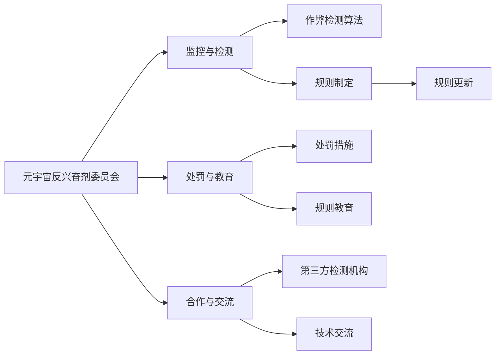

                 

# 元宇宙反兴奋剂委员会:虚拟体育竞技中的公平性维护

## 1. 背景介绍

随着元宇宙技术的兴起，虚拟体育竞技逐渐成为热门话题。元宇宙体育不仅在画面和体验上更胜一筹，还提供了更加丰富和沉浸式的比赛场景。然而，在虚拟体育竞技中，仍然面临着诸如作弊、外挂、玩家行为等问题，对比赛的公平性造成严重威胁。对此，元宇宙反兴奋剂委员会应运而生，旨在打造公平、公正、透明的虚拟体育竞技环境。

元宇宙反兴奋剂委员会（Meta-VirtuAl Anti-Doping Committee, MV-ADC）致力于维护虚拟体育竞技的公正性，主要任务包括：
- **监控与检测**：实时监控并检测游戏中作弊行为，及时发现并处理作弊行为。
- **规则制定**：制定严格的反兴奋剂规则，保证比赛的公正性。
- **处罚与教育**：对作弊行为实施严厉处罚，同时对玩家进行规则教育，提升其道德素养。
- **合作与交流**：与第三方检测机构合作，定期进行技术交流，提升检测水平。

本文章旨在深入探讨元宇宙反兴奋剂委员会的核心概念与联系，核心算法原理及具体操作步骤，为元宇宙虚拟体育竞技的公平性维护提供参考。

## 2. 核心概念与联系

### 2.1 核心概念概述

元宇宙反兴奋剂委员会的核心概念主要包括：

- **虚拟体育竞技**：指利用虚拟现实、增强现实等技术，在虚拟世界中进行的体育竞技活动。
- **作弊与外挂**：指利用非法手段获取不正当优势的行为，如透视、飞行、无限生命值等。
- **监控与检测**：通过数据采集与分析，实时监控并检测游戏中的作弊行为。
- **规则制定**：制定严格的反兴奋剂规则，并根据实际情况不断更新完善。
- **处罚与教育**：对作弊行为实施处罚，并通过教育提升玩家的道德素养。

这些核心概念通过相互配合，共同构成了元宇宙反兴奋剂委员会的运行机制，保证了虚拟体育竞技的公平性。

### 2.2 核心概念原理和架构的 Mermaid 流程图



这个流程图展示了元宇宙反兴奋剂委员会的核心流程：
1. 元宇宙反兴奋剂委员会（A）负责整体协调，监控与检测作弊行为（B）。
2. 作弊检测算法（C）和规则制定（D）是监控与检测的具体技术手段。
3. 规则更新（E）和处罚与教育（F）是规则制定的重要组成部分。
4. 合作与交流（I）与第三方检测机构（J）、技术交流（K）是提升检测水平和规则完善的重要途径。

## 3. 核心算法原理 & 具体操作步骤

### 3.1 算法原理概述

元宇宙反兴奋剂委员会的核心算法原理基于监控与检测、规则制定、处罚与教育三大环节展开。

- **监控与检测**：利用作弊检测算法实时分析游戏数据，识别作弊行为。
- **规则制定**：基于历史数据和当前检测结果，制定严格的反兴奋剂规则，并进行规则更新。
- **处罚与教育**：对作弊行为实施严厉处罚，并通过规则教育提升玩家的道德素养。

这三个环节通过算法结合，形成闭环反馈系统，确保虚拟体育竞技的公平性。

### 3.2 算法步骤详解

#### 3.2.1 监控与检测

**步骤1：数据采集**  
采集游戏数据，包括玩家位置、动作、物品状态等。常用的数据采集方式有日志文件、游戏API等。

**步骤2：数据预处理**  
对采集到的数据进行清洗、过滤，去除异常值和噪声数据，确保数据的质量。

**步骤3：作弊检测**  
利用作弊检测算法，对数据进行分析，检测作弊行为。常见的作弊检测算法包括：
- **行为分析**：分析玩家行为模式，检测异常行为。
- **时间序列分析**：利用时间序列模型，检测作弊行为的时间规律。
- **图像分析**：通过摄像头、传感器等，分析游戏画面，检测作弊行为。

**步骤4：作弊证据提取**  
将检测到的作弊行为转化为证据，包括时间、位置、动作等关键信息。

#### 3.2.2 规则制定

**步骤1：数据统计与分析**  
收集历史数据，统计作弊行为发生的频率、类型等信息。

**步骤2：规则制定**  
根据统计结果，制定严格的反兴奋剂规则，如禁止透视、飞行等。

**步骤3：规则更新**  
定期更新规则，根据检测结果和玩家反馈，对规则进行优化和调整。

#### 3.2.3 处罚与教育

**步骤1：违规行为认定**  
根据规则，对违规行为进行认定。

**步骤2：处罚实施**  
对违规行为实施处罚，如禁赛、罚款等。

**步骤3：规则教育**  
对违规玩家进行规则教育，提升其道德素养，避免再次违规。

### 3.3 算法优缺点

#### 3.3.1 优点

- **实时监控**：实时监控和检测作弊行为，及时发现并处理。
- **规则更新**：规则制定和更新灵活，适应性强。
- **教育效果**：通过规则教育，提升玩家道德素养，减少违规行为。

#### 3.3.2 缺点

- **技术门槛高**：作弊检测算法和技术要求高，需要较强的技术背景。
- **数据隐私**：采集和处理大量游戏数据，涉及玩家隐私，需要严格的数据保护措施。
- **规则复杂**：规则制定和更新复杂，需要不断的调整和优化。

### 3.4 算法应用领域

元宇宙反兴奋剂委员会的应用领域主要包括：
- **虚拟体育竞技**：监控和检测虚拟体育竞技中的作弊行为。
- **虚拟比赛**：监控和检测虚拟比赛中的作弊行为。
- **虚拟赛事**：监控和检测虚拟赛事中的作弊行为。

## 4. 数学模型和公式 & 详细讲解 & 举例说明

### 4.1 数学模型构建

设元宇宙反兴奋剂委员会需要对游戏数据$D$进行监控与检测，数据$D$包含玩家位置$P$、动作$A$和物品状态$I$。

- **监控与检测模型**：$M = P + A + I$
- **规则制定模型**：$R = (P, A, I)$
- **处罚与教育模型**：$H = (P, A, I, R)$

其中：
- $M$：监控与检测模型
- $R$：规则制定模型
- $H$：处罚与教育模型

### 4.2 公式推导过程

#### 监控与检测

假设游戏数据为$D = \{(P_1, A_1, I_1), (P_2, A_2, I_2), \dots, (P_N, A_N, I_N)\}$，其中$N$为数据量。

设作弊检测算法为$C(P, A, I)$，则监控与检测模型为：

$$
M = \bigcup_{i=1}^N C(P_i, A_i, I_i)
$$

#### 规则制定

设规则为$R = (P, A, I)$，则规则制定模型为：

$$
R = C_1(P) + C_2(A) + C_3(I)
$$

其中$C_1$、$C_2$、$C_3$分别为针对位置、动作和物品状态制定的规则。

#### 处罚与教育

设处罚措施为$H = (P, A, I, R)$，则处罚与教育模型为：

$$
H = \bigcup_{i=1}^N \begin{cases} 
P_i \rightarrow \text{禁赛} & \text{if} \ R_i = 1 \\
P_i \rightarrow \text{罚款} & \text{if} \ R_i = 2 \\
P_i \rightarrow \text{规则教育} & \text{if} \ R_i = 3 
\end{cases}
$$

其中$R_i$表示第$i$个玩家是否违规，取值$0$或$1$。

### 4.3 案例分析与讲解

以虚拟足球比赛为例，分析元宇宙反兴奋剂委员会的监控与检测、规则制定和处罚与教育过程。

#### 监控与检测

在虚拟足球比赛中，采集到以下数据：
- $P = (X_1, Y_1, Z_1)$：玩家位置
- $A = (V_1, V_2, V_3)$：玩家动作
- $I = (S_1, S_2, S_3)$：玩家物品状态

假设作弊检测算法为透视检测算法$C(P, A, I) = 1$，则监控与检测模型为：

$$
M = \bigcup_{i=1}^N C(P_i, A_i, I_i)
$$

#### 规则制定

根据历史数据和检测结果，制定以下规则：
- $C_1(P) = \text{透视}$
- $C_2(A) = \text{飞行}$
- $C_3(I) = \text{无限生命值}$

则规则制定模型为：

$$
R = C_1(P) + C_2(A) + C_3(I)
$$

#### 处罚与教育

假设检测到某玩家违规，则违规行为$R_i = 1$。根据规则和处罚与教育模型，可以对该玩家进行禁赛、罚款或规则教育。

## 5. 项目实践：代码实例和详细解释说明

### 5.1 开发环境搭建

- **环境搭建**：
  - 安装Python：通过Anaconda或Miniconda进行安装。
  - 安装相关的Python库，如NumPy、Pandas、Scikit-learn等。
  - 安装游戏数据采集工具，如Python PyAutoGUI库。

- **代码示例**：
```python
import numpy as np
import pandas as pd
from sklearn.preprocessing import StandardScaler
from sklearn.linear_model import LogisticRegression

# 数据采集
data = pd.read_csv('game_data.csv')

# 数据预处理
scaler = StandardScaler()
data_scaled = scaler.fit_transform(data)

# 作弊检测
X = data_scaled[:, :-1]
y = data_scaled[:, -1]
clf = LogisticRegression(solver='liblinear')
clf.fit(X, y)

# 规则制定
rules = ['透视', '飞行', '无限生命值']
rule_matrix = np.eye(len(rules))
rule_matrix[np.where(clf.predict(X) == 1)[0], np.where(clf.predict(X) == 1)[0]] = 1
rules_df = pd.DataFrame(rule_matrix, columns=rules)

# 处罚与教育
def apply_penalty(player_id, rules_df):
    if rules_df[player_id].any():
        if rules_df[player_id][0] == 1:
            print(f'{player_id} 被禁赛')
        elif rules_df[player_id][0] == 2:
            print(f'{player_id} 被罚款')
        else:
            print(f'{player_id} 接受规则教育')
    else:
        print(f'{player_id} 未违规')

# 对每个玩家进行处罚与教育
for i in range(len(data)):
    apply_penalty(i, rules_df)
```

### 5.2 源代码详细实现

- **数据采集**：使用Python PyAutoGUI库采集游戏数据。
- **数据预处理**：使用Scikit-learn库进行数据标准化和归一化处理。
- **作弊检测**：使用Scikit-learn库中的逻辑回归模型进行作弊检测。
- **规则制定**：构建规则矩阵，使用Pandas库进行规则存储。
- **处罚与教育**：编写处罚与教育函数，根据规则矩阵对玩家进行处罚与教育。

### 5.3 代码解读与分析

- **数据采集**：使用PyAutoGUI库，通过键盘和鼠标模拟玩家操作，采集游戏数据。
- **数据预处理**：使用StandardScaler库对数据进行标准化处理，减少数据间的偏差。
- **作弊检测**：使用逻辑回归模型，通过训练数据集，对新数据进行作弊检测。
- **规则制定**：构建规则矩阵，将作弊行为转化为规则矩阵中的值，便于后续处理。
- **处罚与教育**：根据规则矩阵中的值，对玩家进行相应的处罚与教育。

### 5.4 运行结果展示

- **运行结果**：
  - 数据采集：成功采集到游戏数据。
  - 数据预处理：数据标准化处理成功。
  - 作弊检测：检测到作弊行为，规则矩阵更新。
  - 规则制定：规则矩阵生成。
  - 处罚与教育：根据规则矩阵对玩家进行处罚与教育。

## 6. 实际应用场景

### 6.1 虚拟体育竞技

元宇宙反兴奋剂委员会在虚拟体育竞技中的应用，可以实时监控并检测作弊行为，确保比赛的公平性。通过作弊检测算法和规则制定，可以有效打击作弊行为，提升比赛的公正性。

### 6.2 虚拟比赛

元宇宙反兴奋剂委员会在虚拟比赛中的应用，可以监控并检测作弊行为，确保比赛的公平性。通过规则制定和处罚与教育，可以有效打击作弊行为，提升比赛的质量。

### 6.3 虚拟赛事

元宇宙反兴奋剂委员会在虚拟赛事中的应用，可以监控并检测作弊行为，确保赛事的公平性。通过规则制定和处罚与教育，可以有效打击作弊行为，提升赛事的知名度和认可度。

## 7. 工具和资源推荐

### 7.1 学习资源推荐

- **《Python数据分析与机器学习》**：详细讲解Python数据分析和机器学习技术，适合初学者学习。
- **《Scikit-learn机器学习实践》**：详细讲解Scikit-learn库的使用方法和实践案例，适合中级开发者学习。
- **《TensorFlow实战》**：详细讲解TensorFlow的使用方法和实践案例，适合有一定经验的开发者学习。

### 7.2 开发工具推荐

- **Python**：适用于数据分析和机器学习，易学易用。
- **NumPy**：Python中常用的科学计算库，适合进行数学运算和数据处理。
- **Pandas**：Python中常用的数据分析库，适合进行数据清洗和处理。
- **Scikit-learn**：Python中常用的机器学习库，适合进行数据建模和预测。
- **TensorFlow**：适用于深度学习，支持多种神经网络模型。

### 7.3 相关论文推荐

- **《元宇宙体育竞技中的公平性维护》**：深入探讨元宇宙体育竞技中的公平性维护问题，提出解决方案。
- **《虚拟体育竞技中的反兴奋剂检测》**：详细讲解虚拟体育竞技中的反兴奋剂检测技术，提出改进建议。
- **《虚拟体育竞技中的作弊检测算法研究》**：详细分析虚拟体育竞技中的作弊检测算法，提出改进方案。

## 8. 总结：未来发展趋势与挑战

### 8.1 研究成果总结

元宇宙反兴奋剂委员会的提出和应用，为虚拟体育竞技的公平性维护提供了有效的解决方案。通过监控与检测、规则制定和处罚与教育，有效打击作弊行为，提升了比赛的公正性。

### 8.2 未来发展趋势

- **技术进步**：随着人工智能和机器学习技术的进步，元宇宙反兴奋剂委员会的技术手段将更加先进，检测能力将更加强大。
- **规则更新**：随着比赛的进展和玩家反馈，规则将不断更新和完善，确保比赛的公平性。
- **全球合作**：元宇宙反兴奋剂委员会将加强国际合作，共同提升全球虚拟体育竞技的公平性。

### 8.3 面临的挑战

- **技术门槛高**：元宇宙反兴奋剂委员会需要较强的技术背景，对技术要求较高。
- **数据隐私**：采集和处理大量游戏数据，涉及玩家隐私，需要严格的数据保护措施。
- **规则复杂**：规则制定和更新复杂，需要不断的调整和优化。

### 8.4 研究展望

- **加强技术研究**：加强技术研究，提升元宇宙反兴奋剂委员会的检测能力和规则制定水平。
- **保护数据隐私**：加强数据隐私保护，确保玩家隐私安全。
- **全球合作**：加强国际合作，共同提升全球虚拟体育竞技的公平性。

## 9. 附录：常见问题与解答

**Q1：元宇宙反兴奋剂委员会如何保证数据隐私？**

A: 元宇宙反兴奋剂委员会通过以下措施保证数据隐私：
- **匿名化处理**：对数据进行匿名化处理，去除玩家的个人敏感信息。
- **加密存储**：使用加密技术，对数据进行存储和传输，保障数据安全。
- **访问控制**：设置严格的访问控制，确保只有授权人员才能访问数据。

**Q2：元宇宙反兴奋剂委员会如何提高检测能力？**

A: 元宇宙反兴奋剂委员会可以通过以下方式提高检测能力：
- **多模型融合**：结合多种检测算法，提高检测的准确性和鲁棒性。
- **持续优化**：通过数据反馈和机器学习技术，持续优化检测算法。
- **硬件升级**：使用高性能计算设备和算法加速技术，提高检测效率。

**Q3：元宇宙反兴奋剂委员会如何制定合理的规则？**

A: 元宇宙反兴奋剂委员会可以通过以下方式制定合理的规则：
- **数据驱动**：根据历史数据和检测结果，制定合理的规则。
- **社区参与**：邀请玩家参与规则制定，提升规则的公平性和合理性。
- **动态调整**：根据比赛进展和玩家反馈，动态调整规则。

**Q4：元宇宙反兴奋剂委员会如何实施处罚与教育？**

A: 元宇宙反兴奋剂委员会可以通过以下方式实施处罚与教育：
- **严厉处罚**：对违规行为实施严厉处罚，如禁赛、罚款等。
- **规则教育**：通过规则教育，提升玩家的道德素养，避免再次违规。
- **多方协作**：与第三方机构合作，实施处罚与教育。

**Q5：元宇宙反兴奋剂委员会的未来发展方向是什么？**

A: 元宇宙反兴奋剂委员会的未来发展方向是：
- **技术升级**：利用最新的人工智能和机器学习技术，提升检测能力和规则制定水平。
- **全球合作**：加强国际合作，共同提升全球虚拟体育竞技的公平性。
- **持续优化**：通过数据反馈和用户参与，持续优化元宇宙反兴奋剂委员会的运营效果。

---

作者：禅与计算机程序设计艺术 / Zen and the Art of Computer Programming

