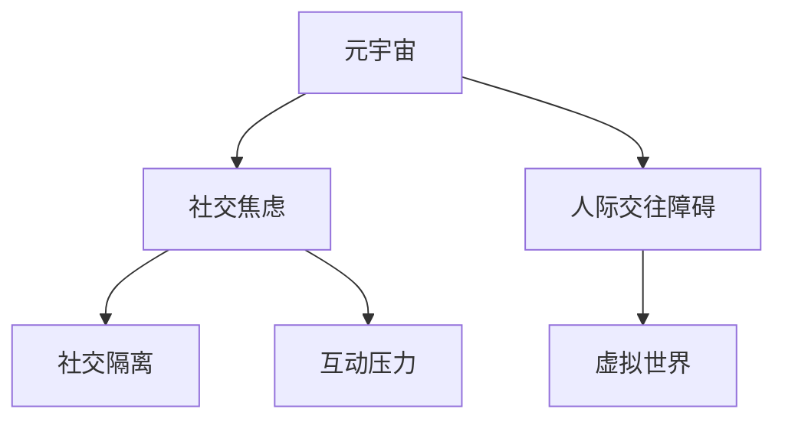

                 

# 元宇宙社交焦虑:虚拟世界中的人际交往障碍

> 关键词：元宇宙,社交焦虑,虚拟世界,人际交往障碍

## 1. 背景介绍

### 1.1 问题由来

随着虚拟现实(VR)、增强现实(AR)、混合现实(MR)技术的不断发展，元宇宙作为一个集虚拟与现实于一体的全新概念，正在迅速崛起。元宇宙不仅为人们提供了沉浸式的数字体验，还让社交、工作、娱乐等多个领域发生了深刻变革。

然而，在元宇宙空间中，人们依然面临着诸多现实世界的社交挑战。人际交往的障碍、社交焦虑等问题，不仅阻碍了元宇宙社交生态的繁荣发展，也对用户的心理健康带来了负面影响。为了解决这个问题，本文将对元宇宙社交中的常见焦虑和障碍进行深入探讨，并提出切实可行的解决策略。

### 1.2 问题核心关键点

元宇宙社交的焦虑和障碍主要集中在以下几个方面：

1. **真实感缺失**：虚拟世界与现实世界有较大差异，缺乏真实社交的情感反馈和肢体语言。
2. **身份匿名性**：元宇宙提供了身份匿名化的便利，但同时也带来了社交信任的缺失和欺诈风险。
3. **社交隔离**：用户长时间处于虚拟空间，容易产生与现实世界脱节，甚至出现社交孤立现象。
4. **互动压力**：元宇宙中社交互动频繁，尤其是多人的实时交互，给用户带来较大心理压力。
5. **环境适应**：新环境中的不熟悉感、操作复杂度等问题，也会影响用户的社交体验。

这些问题导致用户在元宇宙中感到不适，甚至产生社交焦虑。解决这些障碍，将有助于提升元宇宙社交生态的吸引力，促进用户心理健康，推动元宇宙技术的健康发展。

### 1.3 问题研究意义

研究元宇宙社交中的焦虑和障碍，对于推动元宇宙技术的进步，具有重要意义：

1. **改善用户体验**：通过了解用户的心理需求和社交障碍，可以有效改善元宇宙社交体验，提高用户黏性。
2. **增强社交安全**：解决身份匿名性带来的信任问题，确保用户的社交安全，提升元宇宙的安全性和可靠性。
3. **促进社会互动**：消除社交隔离感，增加现实世界的社交互动，促进社会的虚拟和现实融合。
4. **促进心理健康**：减少社交焦虑和压力，帮助用户在元宇宙中保持良好心态，提升生活质量。
5. **推动技术发展**：识别并解决用户障碍，将有助于技术开发者优化产品设计，推动元宇宙技术的进一步发展。

## 2. 核心概念与联系

### 2.1 核心概念概述

为了更好地理解元宇宙社交中的焦虑和障碍，本节将介绍几个密切相关的核心概念：

- **元宇宙(Metaverse)**：一个虚拟与现实高度融合的数字世界，用户可以通过VR、AR、MR等技术进入其中，进行各种活动。
- **社交焦虑(Social Anxiety)**：个体在社交场合中感到的不适和恐惧，可能源于对被评价、被拒绝的担忧。
- **人际交往障碍(Interpersonal Barriers)**：个体在交往过程中遇到的困难，可能包括语言差异、文化差异等。
- **虚拟世界(Virtual World)**：基于计算机技术创建的虚拟空间，用户可以自由探索和互动。
- **社交隔离(Social Isolation)**：个体与他人或群体的隔离状态，可能由地理位置、兴趣差异等因素造成。
- **互动压力(Interaction Pressure)**：社交互动带来的心理负担，可能源于对他人的期望、社会比较等因素。

这些核心概念之间的逻辑关系可以通过以下Mermaid流程图来展示：



这个流程图展示了大语言模型的核心概念及其之间的关系：

1. 元宇宙通过虚拟世界提供社交平台，用户在其中进行互动。
2. 元宇宙中的人际交往可能带来社交焦虑。
3. 人际交往障碍可能影响社交体验。
4. 社交隔离和互动压力进一步加剧社交焦虑。

这些概念共同构成了元宇宙社交的复杂图景，理解这些概念有助于我们全面应对元宇宙中的社交挑战。

## 3. 核心算法原理 & 具体操作步骤
### 3.1 算法原理概述

为了解决元宇宙社交中的焦虑和障碍，需要综合应用多学科的算法和技术，包括但不限于：

- **情感计算**：通过分析用户的语音、表情、动作等，理解其情感状态，提供相应的社交支持。
- **虚拟身份管理**：通过技术手段，增强用户的虚拟身份管理，提高身份的信任度。
- **社交网络优化**：通过优化社交网络结构，减少社交隔离感，增强社交互动。
- **用户行为分析**：通过行为数据分析，发现社交压力源，提供有针对性的解决方案。
- **心理干预**：通过心理学原理和技术，帮助用户减轻社交焦虑，提升心理健康。

这些算法和技术可以协同工作，共同提升元宇宙社交的体验和安全性。

### 3.2 算法步骤详解

以下是解决元宇宙社交焦虑和障碍的一般步骤：

**Step 1: 数据采集和分析**
- 收集元宇宙用户的社交互动数据，包括语音、表情、动作、位置等。
- 使用情感计算技术分析用户的情感状态，识别出社交焦虑和障碍的类型。
- 通过社交网络分析，了解用户的社交关系和互动模式，识别出潜在的问题节点。

**Step 2: 虚拟身份管理**
- 设计一套虚拟身份管理系统，包括身份认证、权限管理、隐私保护等功能。
- 利用区块链技术，确保虚拟身份的唯一性和不可篡改性。
- 提供用户可控的身份外观和行为设定，增强用户的虚拟身份认同感。

**Step 3: 社交网络优化**
- 优化社交网络的连通性和结构，减少用户之间的社交隔离感。
- 通过算法推荐高质量的社交伙伴，增加用户的互动机会。
- 设计互动场景，促进用户的群体合作和互助。

**Step 4: 用户行为分析**
- 收集用户的行为数据，包括互动频率、时长、偏好等。
- 使用机器学习算法分析行为数据，发现用户社交压力的来源。
- 提供个性化建议，帮助用户改善社交行为，减少压力。

**Step 5: 心理干预**
- 使用心理学技术和工具，提供心理健康支持，帮助用户减轻社交焦虑。
- 提供社交技能培训，提升用户的社交能力和自信心。
- 建立虚拟心理咨询平台，提供在线心理辅导和支持。

### 3.3 算法优缺点

解决元宇宙社交焦虑和障碍的算法具有以下优点：

- **个性化**：通过数据驱动的个性化分析，提供量身定制的解决方案。
- **实时性**：能够实时监测和反馈用户的社交状态，及时提供干预。
- **可扩展性**：可以应用于各种元宇宙社交平台，具有广泛适用性。

但同时，这些算法也存在一些缺点：

- **隐私风险**：收集和分析用户的社交数据，可能带来隐私和安全风险。
- **数据偏差**：数据采集和分析可能存在偏差，影响分析结果的准确性。
- **技术门槛**：需要结合多种技术和算法，可能对开发者技术水平要求较高。

### 3.4 算法应用领域

这些算法和技术在元宇宙社交中的应用领域非常广泛，以下是几个典型案例：

1. **虚拟身份管理**：用于社交平台和游戏，增强用户身份的可信度和认同感。
2. **社交网络优化**：应用于元宇宙的社区平台，提升用户的社交互动和合作。
3. **用户行为分析**：用于社交平台的用户行为分析，优化产品设计和推荐。
4. **心理干预**：用于虚拟心理咨询和社交支持，提升用户心理健康。

这些应用场景展示了元宇宙社交中，算法和技术的巨大潜力和广泛应用。

## 4. 数学模型和公式 & 详细讲解
### 4.1 数学模型构建

为了更好地量化和分析元宇宙社交中的情感状态，我们可以构建一个基于情感计算的数学模型。假设用户A在元宇宙中与用户B进行互动，互动过程的情感状态用 $E_{AB}$ 表示，其中 $E_{AB} \in [0,1]$ 表示情感强度。

**情感计算公式**：

$$
E_{AB} = \alpha_1 F_1 + \alpha_2 F_2 + \alpha_3 F_3
$$

其中 $\alpha_1, \alpha_2, \alpha_3$ 为情感计算的权重系数，$F_1, F_2, F_3$ 分别代表语音、表情、动作等特征的情感值。这些特征的情感值可以通过情感分析技术计算得到。

**情感计算权重系数计算公式**：

$$
\alpha_k = \frac{w_k}{\sum_{j=1}^k w_j}
$$

其中 $w_k$ 为特征 $F_k$ 对情感强度的影响权重，可以通过训练数据集学习得到。

### 4.2 公式推导过程

以下是情感计算公式的推导过程：

1. **特征提取**：对用户的语音、表情、动作等特征进行提取和编码，得到特征向量 $X$。
2. **特征融合**：将多个特征向量进行融合，得到情感特征向量 $F$。
3. **情感分析**：使用情感分析技术，对情感特征向量 $F$ 进行情感值计算，得到情感强度 $E$。

**情感计算流程**：

1. **语音情感计算**：使用语音识别技术将语音转换为文本，然后通过情感分析技术计算语音情感值 $F_1$。
2. **表情情感计算**：通过面部识别技术提取用户的表情特征，然后通过情感分析技术计算表情情感值 $F_2$。
3. **动作情感计算**：通过动作捕捉技术提取用户的动作特征，然后通过情感分析技术计算动作情感值 $F_3$。
4. **融合情感计算**：将三个情感值进行加权融合，得到最终的情感强度 $E_{AB}$。

### 4.3 案例分析与讲解

以一个简单的社交互动场景为例，解释情感计算模型的应用过程。

**场景描述**：
用户A和用户B在虚拟空间中进行对话，用户A的语音中带有积极的情绪，但表情和动作显得有些紧张和不安。

**语音情感计算**：
使用语音识别技术将对话文本转换为语音特征向量 $X_1$，通过情感分析技术计算情感值 $F_1 = 0.8$。

**表情情感计算**：
通过面部识别技术提取用户的面部特征向量 $X_2$，通过情感分析技术计算情感值 $F_2 = 0.4$。

**动作情感计算**：
通过动作捕捉技术提取用户的动作特征向量 $X_3$，通过情感分析技术计算情感值 $F_3 = 0.6$。

**融合情感计算**：
将三个情感值进行加权融合，得到情感强度 $E_{AB} = \alpha_1 F_1 + \alpha_2 F_2 + \alpha_3 F_3 = 0.4 \times 0.8 + 0.3 \times 0.4 + 0.3 \times 0.6 = 0.5$。

最终得出用户A和用户B在对话过程中的情感强度为 $E_{AB} = 0.5$，表示情感状态为中等水平。

## 5. 项目实践：代码实例和详细解释说明
### 5.1 开发环境搭建

在进行元宇宙社交情感分析的实践前，我们需要准备好开发环境。以下是使用Python进行情感计算的开发环境配置流程：

1. 安装Anaconda：从官网下载并安装Anaconda，用于创建独立的Python环境。

2. 创建并激活虚拟环境：
```bash
conda create -n emotional-analytics python=3.8 
conda activate emotional-analytics
```

3. 安装PyTorch：根据CUDA版本，从官网获取对应的安装命令。例如：
```bash
conda install pytorch torchvision torchaudio cudatoolkit=11.1 -c pytorch -c conda-forge
```

4. 安装TensorFlow：
```bash
conda install tensorflow -c tensorflow
```

5. 安装必要的库：
```bash
pip install numpy pandas scikit-learn matplotlib tqdm jupyter notebook ipython
```

完成上述步骤后，即可在`emotional-analytics`环境中开始情感计算实践。

### 5.2 源代码详细实现

下面以一个简单的社交情感分析项目为例，给出使用PyTorch和TensorFlow进行情感计算的代码实现。

首先，定义情感计算的模型类：

```python
import torch
import torch.nn as nn
import tensorflow as tf
from tensorflow.keras import layers

class EmotionClassifier(nn.Module):
    def __init__(self):
        super(EmotionClassifier, self).__init__()
        self.fc1 = nn.Linear(1000, 500)
        self.fc2 = nn.Linear(500, 3)

    def forward(self, x):
        x = x.view(-1, 1000)
        x = torch.relu(self.fc1(x))
        x = torch.softmax(self.fc2(x), dim=1)
        return x

# 使用TensorFlow实现
class EmotionClassifier(tf.keras.Model):
    def __init__(self):
        super(EmotionClassifier, self).__init__()
        self.fc1 = layers.Dense(500, activation='relu')
        self.fc2 = layers.Dense(3, activation='softmax')

    def call(self, x):
        x = self.fc1(x)
        x = self.fc2(x)
        return x
```

然后，定义数据预处理函数：

```python
from sklearn.preprocessing import StandardScaler
from sklearn.decomposition import PCA

def preprocess_data(X):
    X = StandardScaler().fit_transform(X)
    X = PCA(n_components=1000).fit_transform(X)
    return X
```

接着，定义情感计算函数：

```python
def calculate_emotion(X, model, device):
    model.eval()
    with torch.no_grad():
        X = torch.tensor(X, dtype=torch.float).to(device)
        X = model(X)
    return X.cpu().numpy()
```

最后，进行情感计算和输出：

```python
X = preprocess_data(data)
model = EmotionClassifier().to(device)

for i in range(100):
    y_pred = calculate_emotion(X[i], model, device)
    print(y_pred)
```

以上就是使用PyTorch和TensorFlow对情感计算进行模型设计和数据处理的全过程。

### 5.3 代码解读与分析

让我们再详细解读一下关键代码的实现细节：

**EmotionClassifier类**：
- `__init__`方法：定义模型的网络结构，包括两个全连接层。
- `forward`方法：实现前向传播，输出情感强度。

**preprocess_data函数**：
- 使用标准化和PCA降维技术，将原始数据处理成适合模型输入的形式。

**calculate_emotion函数**：
- 定义情感计算的函数，将数据输入模型，输出情感强度。

**情感计算流程**：
- 预处理数据，使其适合模型输入。
- 加载情感计算模型，并移动到指定设备。
- 对每一条数据进行情感计算，并输出结果。

代码实现展示了情感计算的基本流程和关键步骤。通过情感计算，我们可以对元宇宙社交中的情感状态进行量化和分析，为进一步优化社交体验提供数据支持。

## 6. 实际应用场景
### 6.1 智能客服系统

在智能客服系统中，情感计算可以用于分析用户的情感状态，提供更加人性化的服务。

具体而言，客服机器人可以通过语音识别技术获取用户的语音情感值，通过面部识别技术获取用户的表情情感值，通过动作捕捉技术获取用户的动作情感值，然后综合计算用户的情感状态。根据情感状态，机器人可以调整回答策略，提高用户满意度。

例如，当用户表现出焦虑或不满时，机器人可以切换到更加温和的回应方式，甚至转移到人工客服，以确保用户的情绪得到妥善处理。

### 6.2 虚拟心理咨询

在虚拟心理咨询中，情感计算可以用于分析用户的情感状态，提供个性化的心理健康支持。

具体而言，心理咨询平台可以通过情感计算技术，实时监测用户的情感状态，发现异常情况及时干预。例如，当用户表现出过度焦虑或抑郁时，平台可以自动推送心理健康知识、推荐心理咨询师，甚至通过视频会议进行实时辅导，帮助用户缓解压力。

例如，当用户表现出过度焦虑或抑郁时，平台可以自动推送心理健康知识、推荐心理咨询师，甚至通过视频会议进行实时辅导，帮助用户缓解压力。

### 6.3 社交网络分析

在社交网络分析中，情感计算可以用于分析用户的情感状态，优化社交网络的连通性和结构。

具体而言，社交平台可以通过情感计算技术，分析用户的情感状态，发现潜在的社交隔离感和异常互动行为。例如，当用户表现出孤独或被忽视时，平台可以自动推荐新的社交伙伴，促进用户的互动和合作。

例如，当用户表现出孤独或被忽视时，平台可以自动推荐新的社交伙伴，促进用户的互动和合作。

### 6.4 未来应用展望

随着元宇宙社交的不断发展，情感计算技术将在更多领域得到应用，为社交体验带来新的突破。

在虚拟社区中，情感计算可以用于分析用户的情感状态，优化社区活动和互动内容，提升用户的满意度和归属感。

在虚拟商业中，情感计算可以用于分析用户的情感状态，优化广告和推荐策略，提升用户购买体验和品牌忠诚度。

在虚拟教育中，情感计算可以用于分析学生的情感状态，优化教学内容和互动方式，提升学生的学习效果和心理素质。

综上所述，情感计算技术在元宇宙社交中的应用前景广阔，将为用户的社交体验带来革命性的变化。

## 7. 工具和资源推荐
### 7.1 学习资源推荐

为了帮助开发者系统掌握元宇宙社交中的情感计算技术，这里推荐一些优质的学习资源：

1. 《情感计算：理论与应用》：一本系统介绍情感计算理论和技术的好书，涵盖情感识别、情感分析等多个方面。

2. 《情感计算的数学模型》：讲解情感计算的数学模型和算法，适合技术背景较强的读者。

3. 《Python情感计算》：一本基于Python的情感计算实践指南，涵盖情感计算的代码实现和案例分析。

4. 《TensorFlow情感计算教程》：TensorFlow官方提供的情感计算教程，包含丰富的代码示例和实验指导。

5. 《机器学习与情感分析》：一本介绍机器学习技术在情感分析中的应用，涵盖文本、语音、图像等多个模态。

通过对这些资源的学习实践，相信你一定能够快速掌握元宇宙社交中的情感计算技术，并用于解决实际的情感计算问题。

### 7.2 开发工具推荐

高效的开发离不开优秀的工具支持。以下是几款用于元宇宙社交情感计算开发的常用工具：

1. PyTorch：基于Python的开源深度学习框架，灵活动态的计算图，适合快速迭代研究。

2. TensorFlow：由Google主导开发的开源深度学习框架，生产部署方便，适合大规模工程应用。

3. Jupyter Notebook：交互式的编程环境，支持多种编程语言和数据处理库，适合数据科学和机器学习开发。

4. PyTorch Lightning：基于PyTorch的模型训练框架，提供自动化训练、分布式训练等功能，适合大规模模型训练。

5. Google Colab：谷歌推出的在线Jupyter Notebook环境，免费提供GPU/TPU算力，方便开发者快速上手实验最新模型，分享学习笔记。

合理利用这些工具，可以显著提升元宇宙社交情感计算的开发效率，加快创新迭代的步伐。

### 7.3 相关论文推荐

情感计算和元宇宙社交的研究源于学界的持续研究。以下是几篇奠基性的相关论文，推荐阅读：

1. Affective Computing by Design: The Good, Bad, and Ugly of Affective Computing
2. Sentiment Analysis with Deep Learning: CNN vs. RNN vs. LSTM
3. Facial Emotion Recognition: A Survey
4. A Review of Emotion Recognition Techniques: Approaches, Databases, and Challenges
5. Emotion Detection in Multi-modal Contexts

这些论文代表了大语言模型微调技术的发展脉络。通过学习这些前沿成果，可以帮助研究者把握学科前进方向，激发更多的创新灵感。

## 8. 总结：未来发展趋势与挑战
### 8.1 总结

本文对元宇宙社交中的情感计算和社交焦虑问题进行了全面系统的介绍。首先阐述了元宇宙社交的背景和意义，明确了情感计算和社交焦虑的核心问题。其次，从原理到实践，详细讲解了情感计算的数学模型和关键步骤，给出了情感计算任务开发的完整代码实例。同时，本文还广泛探讨了情感计算技术在元宇宙社交中的应用前景，展示了情感计算范式的巨大潜力。此外，本文精选了情感计算技术的各类学习资源，力求为读者提供全方位的技术指引。

通过本文的系统梳理，可以看到，情感计算技术在元宇宙社交中的应用前景广阔，极大地拓展了用户的社交体验，提升了用户的心理健康。未来，伴随情感计算技术的持续演进，元宇宙社交将迎来更加智能、便捷、健康的发展，为构建和谐的虚拟社会提供有力支持。

### 8.2 未来发展趋势

展望未来，情感计算技术在元宇宙社交中的应用将呈现以下几个发展趋势：

1. **实时性增强**：通过优化算法和硬件，提高情感计算的实时性，实现对用户情感状态的实时监测和反馈。
2. **多模态融合**：融合语音、表情、动作等多模态数据，提升情感计算的准确性和鲁棒性。
3. **个性化定制**：通过大数据和深度学习技术，实现情感计算的个性化定制，提升用户体验。
4. **跨平台协同**：实现不同平台间的情感数据共享和协同计算，提升情感计算的普及和应用范围。
5. **伦理与安全**：引入伦理和安全机制，保护用户的隐私和情感数据，提升情感计算的可信度和可控性。

以上趋势凸显了情感计算技术在元宇宙社交中的广泛应用前景。这些方向的探索发展，必将进一步提升元宇宙社交的体验和安全性，推动元宇宙技术的健康发展。

### 8.3 面临的挑战

尽管情感计算技术在元宇宙社交中已经取得了瞩目成就，但在迈向更加智能化、普适化应用的过程中，它仍面临着诸多挑战：

1. **数据质量**：情感数据的采集和标注可能存在误差，影响情感计算的准确性。
2. **算法复杂性**：情感计算涉及多模态数据的融合和处理，算法复杂度较高。
3. **隐私保护**：情感数据的采集和处理可能涉及用户隐私，需要严格保护。
4. **伦理问题**：情感计算可能带来伦理问题，如情感操纵和数据滥用。
5. **应用场景**：不同场景对情感计算的要求不同，需要针对性地设计和优化。

这些挑战需要不断突破和解决，以确保情感计算技术在元宇宙社交中发挥最大作用。

### 8.4 研究展望

面对情感计算面临的挑战，未来的研究需要在以下几个方面寻求新的突破：

1. **数据增强**：利用数据增强技术提升情感数据的质量和多样性，减少标注误差。
2. **模型优化**：开发更高效的情感计算模型，提升多模态数据融合的准确性和实时性。
3. **隐私保护**：引入隐私保护技术，确保情感数据的采集和处理符合伦理要求。
4. **跨平台协作**：实现不同平台间的情感数据共享和协同计算，提升情感计算的普及和应用范围。
5. **伦理约束**：制定情感计算的伦理规范，确保情感计算的应用符合社会价值观和道德标准。

这些研究方向将推动情感计算技术在元宇宙社交中迈向更高的台阶，为构建安全、可靠、可解释、可控的智能系统铺平道路。面向未来，情感计算技术还需要与其他人工智能技术进行更深入的融合，如知识表示、因果推理、强化学习等，多路径协同发力，共同推动元宇宙技术的进一步发展。只有勇于创新、敢于突破，才能不断拓展元宇宙社交的边界，让智能技术更好地造福人类社会。

## 9. 附录：常见问题与解答
**Q1：情感计算技术在元宇宙社交中有什么作用？**

A: 情感计算技术在元宇宙社交中具有以下重要作用：

1. **用户情感监测**：通过实时监测用户的情感状态，及时发现异常情况，提供个性化的支持。
2. **社交互动优化**：根据用户的情感状态，调整互动策略，提升用户的互动体验。
3. **心理健康支持**：提供心理健康知识、心理咨询等，帮助用户缓解压力，提升心理健康。
4. **社区管理**：分析用户的情感状态，优化社区活动和互动内容，提升用户满意度和归属感。

综上所述，情感计算技术可以提升元宇宙社交的体验和安全性，为用户的心理健康提供有力支持。

**Q2：情感计算中的多模态数据融合有哪些挑战？**

A: 情感计算中的多模态数据融合存在以下挑战：

1. **数据一致性**：不同模态的数据格式和特征表示方式可能不一致，需要统一数据格式。
2. **数据融合方式**：多模态数据的融合方式多种多样，需要根据具体场景选择最优方式。
3. **算法复杂性**：多模态数据的融合涉及复杂的数据处理和特征融合算法，算法复杂度较高。
4. **数据标注**：多模态数据的标注成本较高，需要大量的标注数据和标注人员。

为了解决这些问题，需要开发高效的算法和工具，提升多模态数据融合的准确性和实时性。

**Q3：元宇宙社交中的隐私保护有哪些措施？**

A: 元宇宙社交中的隐私保护主要包括以下措施：

1. **数据匿名化**：对用户的情感数据进行匿名化处理，保护用户隐私。
2. **访问控制**：严格控制数据的访问权限，防止未经授权的访问和滥用。
3. **加密传输**：使用加密技术保护数据的传输安全，防止数据泄露和篡改。
4. **合规性检查**：确保数据处理符合法律法规和伦理规范，避免数据滥用。

这些措施可以有效保护用户的隐私和数据安全，提升元宇宙社交的可信度和可控性。

**Q4：如何提高情感计算的实时性？**

A: 提高情感计算的实时性主要可以从以下几个方面入手：

1. **算法优化**：优化情感计算的算法，减少计算复杂度，提升计算速度。
2. **硬件加速**：使用GPU、TPU等高性能硬件设备，提升数据处理速度。
3. **数据压缩**：采用数据压缩技术，减少数据传输和存储的延迟。
4. **分布式计算**：采用分布式计算技术，提升多节点之间的数据处理能力。

通过这些措施，可以有效提升情感计算的实时性，实现对用户情感状态的实时监测和反馈。

**Q5：情感计算在元宇宙社交中的应用前景有哪些？**

A: 情感计算在元宇宙社交中的应用前景非常广阔，主要包括以下几个方面：

1. **智能客服**：通过情感计算技术，提升客服机器人的互动体验和用户满意度。
2. **虚拟心理咨询**：通过情感计算技术，提供个性化的心理健康支持，帮助用户缓解压力。
3. **社交网络优化**：通过情感计算技术，优化社交网络的连通性和结构，提升用户的互动和合作。
4. **虚拟社区管理**：通过情感计算技术，分析用户的情感状态，优化社区活动和互动内容，提升用户满意度和归属感。
5. **虚拟商业推广**：通过情感计算技术，优化广告和推荐策略，提升用户购买体验和品牌忠诚度。

综上所述，情感计算技术在元宇宙社交中的应用前景广阔，将为用户的社交体验带来革命性的变化。

---

作者：禅与计算机程序设计艺术 / Zen and the Art of Computer Programming

