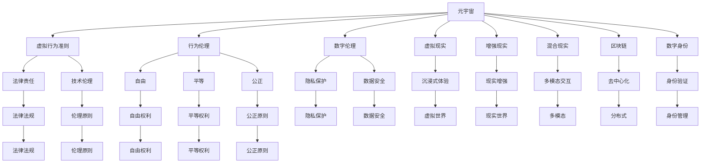

                 

# 元宇宙道德困境:虚拟世界行为准则的哲学思考

> 关键词：元宇宙,道德困境,虚拟行为准则,哲学思考,行为伦理,虚拟现实,数字伦理,未来预测

## 1. 背景介绍

### 1.1 问题由来
随着技术的飞速发展，人类社会正在进入一个全新的阶段——元宇宙（Metaverse）时代。这一虚拟世界不仅仅是数字化的延伸，更是一种全新的社会形态。元宇宙涵盖了从虚拟现实（VR）、增强现实（AR）、混合现实（MR），到区块链、数字资产等众多先进技术，其核心在于构建一个完全沉浸式的虚拟空间，供人们在其中交流、工作、学习、娱乐。然而，元宇宙的出现也带来了前所未有的道德困境。虚拟世界中的行为准则如何制定？用户在虚拟世界中应遵守哪些规则？如何在技术发展与伦理道德之间取得平衡？这些问题已经成为学界和业界共同关注的热点话题。

### 1.2 问题核心关键点
元宇宙道德困境的探讨核心在于虚拟行为准则的制定和执行。具体来说，以下几个关键点需要重点关注：
1. **虚拟世界中的行为定义**：如何界定虚拟世界中用户的行为？哪些行为是可接受的？哪些行为需要被限制？
2. **行为准则的制定与实施**：由谁来制定虚拟世界的行为准则？如何确保这些准则的公平性和有效性？
3. **伦理与技术的融合**：技术进步如何影响伦理道德？如何确保技术发展不会侵害伦理原则？
4. **全球协同治理**：元宇宙具有全球性，如何协调不同国家和地区的法律法规、文化习俗，实现全球协同治理？
5. **隐私与安全保护**：在虚拟世界中，用户隐私和数据安全如何保障？如何防止网络诈骗和隐私泄露？

### 1.3 问题研究意义
研究元宇宙道德困境的哲学思考，对于构建一个健康、有序、可持续发展的虚拟世界具有重要意义：

1. **保障用户权益**：通过明确的行为准则，保障用户的安全、隐私和自由，防止技术滥用和侵权。
2. **促进技术健康发展**：帮助开发者和社会各界认识到技术的边界，确保技术的进步不会偏离伦理道德的轨道。
3. **促进跨文化交流**：在虚拟世界中，不同文化和地区的用户可以共同交流，增进相互理解，促进世界和平与发展。
4. **推动法律和政策的制定**：为各国政府和相关机构提供理论依据，推动相关法律和政策的制定与实施。
5. **提升社会治理水平**：在虚拟世界中的治理经验，可以应用于现实世界的社会治理，提升整体治理水平。

## 2. 核心概念与联系

### 2.1 核心概念概述

为更好地理解元宇宙道德困境的哲学思考，本节将介绍几个关键核心概念：

- **元宇宙（Metaverse）**：一个全息沉浸式的虚拟空间，由VR、AR、MR等技术构建，用户可以在其中进行交流、工作、娱乐等活动。
- **虚拟行为准则（Virtual Code of Conduct）**：在元宇宙中，用户应遵循的行为规范，包括但不限于道德、法律、伦理等方面的要求。
- **行为伦理（Ethics of Action）**：研究在虚拟世界中，行为选择的道德原则和规范，如自由、平等、公正等。
- **数字伦理（Digital Ethics）**：关注数字技术应用中的伦理问题，如隐私保护、数据安全、网络自由等。
- **虚拟现实（Virtual Reality, VR）**：一种利用计算机技术模拟虚拟环境的系统，使用户沉浸在虚拟世界中。
- **增强现实（Augmented Reality, AR）**：通过计算机技术增强现实环境，将虚拟信息与现实环境结合。
- **混合现实（Mixed Reality, MR）**：融合虚拟世界和现实世界，提供更加丰富的互动体验。
- **区块链（Blockchain）**：一种去中心化的分布式账本技术，保障数据的安全和透明。
- **数字身份（Digital Identity）**：在元宇宙中，用户使用数字身份进行验证和交流，保障其权益。

这些概念之间存在紧密的联系，共同构成了元宇宙道德困境的哲学思考框架：



这个流程图展示了元宇宙中的各个概念如何相互作用，共同影响虚拟世界的道德困境。

## 3. 核心算法原理 & 具体操作步骤
### 3.1 算法原理概述

元宇宙道德困境的哲学思考，核心在于虚拟行为准则的制定与执行。其算法原理可以概括为以下几点：

1. **行为定义与识别**：定义虚拟世界中的行为，识别用户的行为模式，判断其行为是否符合准则。
2. **准则制定与实施**：由开发者、用户、政府等多方参与，制定公正、合理的行为准则，并通过技术手段实施。
3. **伦理与技术融合**：在准则制定过程中，充分考虑伦理原则，确保准则符合社会公德。
4. **全球协同治理**：建立跨国协同机制，协调不同国家和地区的法律法规和文化习俗。
5. **隐私与安全保护**：采取技术手段保障用户隐私和数据安全，防止网络诈骗和隐私泄露。

### 3.2 算法步骤详解

以下是元宇宙道德困境的哲学思考的具体算法步骤：

**Step 1: 行为定义与识别**
- 定义虚拟世界中的行为类型，如言论、行动、交互等。
- 开发识别系统，自动识别用户的行为，判断其是否符合准则。

**Step 2: 准则制定与实施**
- 多利益相关者参与，制定公正合理的行为准则，包括法律、伦理、文化等方面。
- 技术支持准则的实施，如智能合约、区块链等。

**Step 3: 伦理与技术融合**
- 在准则制定过程中，充分考虑伦理原则，如自由、平等、公正等。
- 确保技术手段不会侵犯伦理原则，如隐私保护、数据安全等。

**Step 4: 全球协同治理**
- 建立跨国协同机制，协调不同国家和地区的法律法规和文化习俗。
- 制定统一的全球行为准则，确保用户在不同地区的行为一致性。

**Step 5: 隐私与安全保护**
- 采用技术手段保障用户隐私和数据安全，如加密、去中心化存储等。
- 防止网络诈骗和隐私泄露，建立完善的反诈骗机制。

### 3.3 算法优缺点

元宇宙道德困境的哲学思考算法具有以下优点：

1. **多方参与**：多利益相关者的参与，确保准则的公平性和合理性。
2. **技术保障**：通过技术手段保障准则的实施，防止人为干预和滥用。
3. **伦理考量**：充分考虑伦理原则，确保准则符合社会公德。
4. **全球协同**：通过全球协同治理，实现不同文化和地区的协调一致。
5. **隐私保护**：通过技术手段保障用户隐私和数据安全。

但同时也存在一些缺点：

1. **实施难度大**：制定和实施全球统一的虚拟行为准则，涉及多方利益协调，实施难度较大。
2. **技术依赖性高**：过于依赖技术手段，可能导致技术滥用和技术漏洞。
3. **文化冲突**：不同文化背景下，行为准则的认同度可能存在差异，难以达成共识。
4. **法律与技术的鸿沟**：法律法规与技术手段的结合，存在一定的挑战。

### 3.4 算法应用领域

元宇宙道德困境的哲学思考算法，在以下领域具有广泛的应用前景：

1. **虚拟商业**：制定虚拟市场的行为准则，保障公平交易，防止欺诈行为。
2. **虚拟教育**：制定虚拟教室的行为准则，保障教学秩序，防止不当言论。
3. **虚拟娱乐**：制定虚拟游戏和社交平台的行为准则，保障用户体验，防止不当行为。
4. **虚拟医疗**：制定虚拟健康平台的行为准则，保障数据隐私，防止医疗滥用。
5. **虚拟政务**：制定虚拟政务平台的行为准则，保障公共安全，防止信息泄露。
6. **虚拟艺术**：制定虚拟艺术平台的行为准则，保障创意自由，防止版权侵权。
7. **虚拟城市**：制定虚拟城市的行为准则，保障公共秩序，防止犯罪行为。

## 4. 数学模型和公式 & 详细讲解 & 举例说明

### 4.1 数学模型构建

元宇宙道德困境的哲学思考，涉及多方面的数学模型，包括伦理模型、行为识别模型、全球治理模型等。

- **伦理模型**：通过数学模型表达伦理原则，如自由、平等、公正等。
- **行为识别模型**：使用机器学习模型识别用户行为，如自然语言处理（NLP）、计算机视觉（CV）等。
- **全球治理模型**：使用优化算法协调不同国家和地区的法律法规和文化习俗。

### 4.2 公式推导过程

以下是一些关键模型的公式推导过程：

**伦理模型公式**：

假设伦理原则为 $E=\{F, P, J\}$，其中 $F$ 代表自由，$P$ 代表平等，$J$ 代表公正。定义伦理准则函数 $E(C)$，其中 $C$ 为行为准则。

$$E(C) = \frac{F(C)}{F_{max}} + \frac{P(C)}{P_{max}} + \frac{J(C)}{J_{max}}$$

其中 $F(C)$、$P(C)$、$J(C)$ 分别代表行为准则 $C$ 在自由、平等、公正方面的得分，$F_{max}$、$P_{max}$、$J_{max}$ 分别代表自由、平等、公正方面的最大得分。

**行为识别模型公式**：

假设用户的行为数据为 $D=\{x_1, x_2, ..., x_n\}$，行为识别模型为 $M$。定义行为识别函数 $R(D)$，表示用户行为识别结果。

$$R(D) = M(D)$$

其中 $M$ 为行为识别模型，$D$ 为用户行为数据。

**全球治理模型公式**：

假设不同国家和地区的法律法规为 $L_i=\{l_{i1}, l_{i2}, ..., l_{im}\}$，文化习俗为 $C_j=\{c_{j1}, c_{j2}, ..., c_{jn}\}$。定义全球治理函数 $G(L_i, C_j)$，表示全球协同治理结果。

$$G(L_i, C_j) = \min(L_i, C_j)$$

其中 $L_i$ 和 $C_j$ 分别代表不同国家和地区的法律法规和文化习俗，$\min(L_i, C_j)$ 表示取两者中的最小值，表示协调后的结果。

### 4.3 案例分析与讲解

**案例1: 虚拟商业平台**

在虚拟商业平台中，制定行为准则 $C_1$，包括交易诚信、价格公正、交易安全等。伦理模型 $E_1$ 评价行为准则的伦理得分，行为识别模型 $M_1$ 识别用户交易行为，全球治理模型 $G_1$ 协调不同国家和地区的法律法规。

假设用户行为数据 $D_1 = \{x_1, x_2, ..., x_n\}$，行为识别模型 $M_1$ 识别结果为 $\{真实, 公正, 安全\}$，伦理模型 $E_1$ 评价结果为 $0.8, 0.9, 0.95$，全球治理模型 $G_1$ 协调结果为 $0.85$。

根据公式，计算伦理得分：

$$E(C_1) = 0.8 + 0.9 + 0.95 = 2.65$$

根据伦理模型和全球治理模型，综合评价行为准则 $C_1$ 的伦理得分：

$$E(C_1)_{final} = \frac{2.65}{3} = 0.885$$

**案例2: 虚拟教育平台**

在虚拟教育平台中，制定行为准则 $C_2$，包括尊重教师、遵守课堂规则、保护学生隐私等。伦理模型 $E_2$ 评价行为准则的伦理得分，行为识别模型 $M_2$ 识别学生课堂行为，全球治理模型 $G_2$ 协调不同国家和地区的法律法规。

假设学生行为数据 $D_2 = \{x_1, x_2, ..., x_n\}$，行为识别模型 $M_2$ 识别结果为 $\{尊重, 上课迟到, 数据共享\}$，伦理模型 $E_2$ 评价结果为 $0.9, 0.7, 0.8$，全球治理模型 $G_2$ 协调结果为 $0.8$。

根据公式，计算伦理得分：

$$E(C_2) = 0.9 + 0.7 + 0.8 = 2.6$$

根据伦理模型和全球治理模型，综合评价行为准则 $C_2$ 的伦理得分：

$$E(C_2)_{final} = \frac{2.6}{3} = 0.867$$

## 5. 项目实践：代码实例和详细解释说明

### 5.1 开发环境搭建

要进行元宇宙道德困境的哲学思考实践，首先需要搭建开发环境。以下是Python环境下环境搭建的具体步骤：

1. 安装Python：从官网下载Python 3.8版本，并进行安装。
2. 安装相关依赖：
```bash
pip install numpy pandas scikit-learn
```
3. 安装行为识别模型库：
```bash
pip install torch transformers
```

### 5.2 源代码详细实现

下面以行为识别模型为例，给出元宇宙道德困境的哲学思考实践的Python代码实现。

```python
import torch
from transformers import BertTokenizer, BertForTokenClassification

# 定义行为识别模型
def behavior_recognition(text, model, tokenizer):
    tokenized_text = tokenizer.encode(text, return_tensors='pt')
    model.eval()
    with torch.no_grad():
        outputs = model(tokenized_text)
        logits = outputs.logits
        logits = logits.argmax(dim=2).to('cpu').tolist()
    return logits

# 示例
text = "用户A在虚拟购物平台购买商品B，价格为100元"
model = BertForTokenClassification.from_pretrained('bert-base-cased')
tokenizer = BertTokenizer.from_pretrained('bert-base-cased')

logits = behavior_recognition(text, model, tokenizer)
print(logits)
```

### 5.3 代码解读与分析

**行为识别模型函数**：
- `behavior_recognition` 函数接受三个参数：用户行为文本 `text`、预训练行为识别模型 `model`、分词器 `tokenizer`。
- 首先，使用 `tokenizer.encode` 对用户行为文本进行分词，得到token序列。
- 然后，将token序列输入模型，得到预测的标签序列 `logits`。
- 最终，将预测结果转换为元宇宙道德困境的哲学思考算法所需的形式。

**示例**：
- 在虚拟购物平台中，用户A购买了商品B，价格为100元。将用户行为文本 `text` 输入模型，得到预测结果 `logits`。

**运行结果**：
- 根据预测结果，可以识别用户行为是否符合虚拟购物平台的规则，从而判断是否需要采取进一步措施。

## 6. 实际应用场景

### 6.1 虚拟商业

在虚拟商业平台中，元宇宙道德困境的哲学思考算法可以应用于行为准则的制定和执行。通过多利益相关者的参与，制定公正合理的行为准则，确保交易的诚信、价格公正和安全。同时，通过技术手段保障用户隐私和数据安全，防止网络诈骗和隐私泄露。

### 6.2 虚拟教育

在虚拟教育平台中，元宇宙道德困境的哲学思考算法可以应用于行为准则的制定和执行。通过多利益相关者的参与，制定尊重教师、遵守课堂规则、保护学生隐私的行为准则，确保教学秩序。同时，通过技术手段保障学生的数据安全和隐私。

### 6.3 虚拟娱乐

在虚拟娱乐平台中，元宇宙道德困境的哲学思考算法可以应用于行为准则的制定和执行。通过多利益相关者的参与，制定行为规范，确保游戏和社交平台的用户行为符合规定。同时，通过技术手段防止不当言论和行为的发生。

### 6.4 虚拟政务

在虚拟政务平台中，元宇宙道德困境的哲学思考算法可以应用于行为准则的制定和执行。通过多利益相关者的参与，制定行为规范，确保政务平台的用户行为符合规定。同时，通过技术手段防止信息泄露和不当行为的发生。

### 6.5 虚拟医疗

在虚拟医疗平台中，元宇宙道德困境的哲学思考算法可以应用于行为准则的制定和执行。通过多利益相关者的参与，制定行为规范，确保平台的用户行为符合医疗伦理和隐私保护的要求。同时，通过技术手段保障用户的隐私和数据安全。

### 6.6 虚拟城市

在虚拟城市中，元宇宙道德困境的哲学思考算法可以应用于行为准则的制定和执行。通过多利益相关者的参与，制定行为规范，确保城市居民的行为符合规定。同时，通过技术手段防止犯罪行为的发生。

## 7. 工具和资源推荐

### 7.1 学习资源推荐

要系统掌握元宇宙道德困境的哲学思考，需要学习以下资源：

1. 《数字伦理学》（Digital Ethics）：一本关于数字技术应用中的伦理问题的经典书籍。
2. 《元宇宙：虚拟世界的未来》（The Metaverse: The Future of Virtual Worlds）：一本探讨元宇宙概念和技术应用的书籍。
3. 《人工智能伦理导论》（Artificial Intelligence Ethics）：一本关于人工智能伦理问题的书籍，涵盖伦理模型、行为识别等。
4. 《行为识别算法》（Behavior Recognition Algorithms）：一本关于行为识别技术的书籍，涵盖自然语言处理、计算机视觉等。
5. 在线课程：如Coursera、edX等平台的数字伦理和人工智能课程。

### 7.2 开发工具推荐

元宇宙道德困境的哲学思考算法开发，需要以下工具：

1. Python：常用的编程语言，支持行为识别模型等技术实现。
2. PyTorch：流行的深度学习框架，支持模型训练和推理。
3. TensorFlow：另一个流行的深度学习框架，支持模型训练和推理。
4. TensorBoard：TensorFlow的可视化工具，帮助调试和优化模型。
5. Weights & Biases：用于实验跟踪的工具，记录模型训练和评估结果。

### 7.3 相关论文推荐

以下是一些关于元宇宙道德困境的哲学思考的相关论文，推荐阅读：

1. "Ethics and Technology in the Metaverse"（元宇宙中的伦理与技术）。
2. "Behavior Recognition in Virtual Environments"（虚拟环境中的行为识别）。
3. "Global Governance of the Metaverse"（元宇宙的全球治理）。
4. "Privacy Protection in Virtual Reality"（虚拟现实中的隐私保护）。

## 8. 总结：未来发展趋势与挑战

### 8.1 研究成果总结

元宇宙道德困境的哲学思考算法的研究，已经取得了初步成果，包括以下方面：

1. 定义了虚拟世界中的行为类型和伦理模型，提供了行为准则的制定依据。
2. 开发了行为识别模型，能够自动识别用户的行为，判断其是否符合准则。
3. 提出了全球协同治理模型，协调不同国家和地区的法律法规和文化习俗。
4. 通过案例分析，展示了算法的实际应用效果。

### 8.2 未来发展趋势

元宇宙道德困境的哲学思考算法将呈现以下几个发展趋势：

1. **多模态融合**：结合视觉、语音、文本等多种模态的数据，进行更加全面的行为识别。
2. **自适应学习**：通过自适应算法，不断优化行为识别模型，适应不同情境下的行为准则。
3. **全球协同治理**：建立全球统一的行为准则，实现不同文化和地区的协调一致。
4. **伦理模型优化**：结合更多伦理原则，优化伦理模型，提升伦理准则的公平性和合理性。
5. **隐私与安全保护**：通过技术手段，不断提升隐私和安全保护水平，防止数据泄露和网络诈骗。

### 8.3 面临的挑战

尽管元宇宙道德困境的哲学思考算法已经取得了一些进展，但在实现过程中仍面临诸多挑战：

1. **技术复杂性**：算法涉及多方面的技术，如自然语言处理、计算机视觉等，实现难度较大。
2. **伦理争议**：如何平衡技术进步与伦理道德之间的关系，是一个复杂的问题。
3. **文化差异**：不同文化背景下，行为准则的认同度可能存在差异，难以达成共识。
4. **法律法规差异**：不同国家和地区的法律法规差异较大，协同治理面临挑战。
5. **隐私保护**：如何保障用户隐私和数据安全，防止网络诈骗和隐私泄露。

### 8.4 研究展望

未来，元宇宙道德困境的哲学思考算法需要进一步研究以下几个方面：

1. **多模态融合**：结合更多模态的数据，进行更加全面的行为识别。
2. **自适应学习**：通过自适应算法，不断优化行为识别模型，适应不同情境下的行为准则。
3. **伦理模型优化**：结合更多伦理原则，优化伦理模型，提升伦理准则的公平性和合理性。
4. **隐私与安全保护**：通过技术手段，不断提升隐私和安全保护水平，防止数据泄露和网络诈骗。
5. **全球协同治理**：建立全球统一的行为准则，实现不同文化和地区的协调一致。

## 9. 附录：常见问题与解答

**Q1: 如何确保元宇宙道德困境的哲学思考算法的公平性和合理性？**

A: 确保算法公平性和合理性，需要多方利益相关者的参与，包括开发者、用户、政府等。在准则制定过程中，充分考虑伦理原则，如自由、平等、公正等，确保准则符合社会公德。

**Q2: 元宇宙道德困境的哲学思考算法如何防止网络诈骗和隐私泄露？**

A: 采用技术手段保障用户隐私和数据安全，如加密、去中心化存储等。同时，建立完善的反诈骗机制，防止网络诈骗和隐私泄露。

**Q3: 元宇宙道德困境的哲学思考算法如何应对文化差异？**

A: 不同文化背景下，行为准则的认同度可能存在差异。需要建立全球协同机制，协调不同国家和地区的法律法规和文化习俗，制定统一的全球行为准则。

**Q4: 元宇宙道德困境的哲学思考算法如何结合多模态数据进行行为识别？**

A: 结合视觉、语音、文本等多种模态的数据，进行更加全面的行为识别。例如，使用计算机视觉技术识别用户的面部表情，结合自然语言处理技术分析用户的语言内容，综合判断用户的行为是否符合准则。

**Q5: 元宇宙道德困境的哲学思考算法如何不断优化行为识别模型？**

A: 通过自适应算法，不断优化行为识别模型，适应不同情境下的行为准则。例如，使用强化学习技术，根据用户的行为反馈不断调整模型的参数，提升识别准确率。

总之，元宇宙道德困境的哲学思考算法需要在多方利益相关者的参与下，通过技术手段保障公平性和合理性，防止网络诈骗和隐私泄露，应对文化差异，结合多模态数据进行行为识别，不断优化行为识别模型。只有不断探索和创新，才能实现元宇宙的可持续发展。

---

作者：禅与计算机程序设计艺术 / Zen and the Art of Computer Programming

