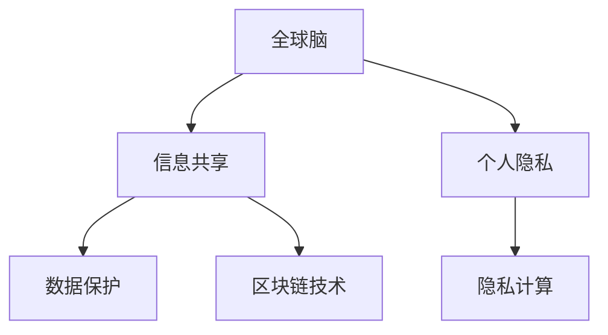

                 

# 全球脑与个人隐私:信息共享的边界

## 1. 背景介绍

在全球化信息时代，互联网的发展极大地改变了人类的生活和工作方式。信息共享已经成为促进全球交流和经济发展的重要推动力。然而，在信息共享的过程中，个人隐私的保护也成为了一个日益重要的话题。如何在享受信息共享带来的便利的同时，保护个人隐私，成为现代信息技术面临的重大挑战。

本文将从技术角度探讨全球脑（即全球互联的智能大脑）如何影响个人隐私，以及如何在信息共享的边界内保护个人隐私。

## 2. 核心概念与联系

### 2.1 核心概念概述

- **全球脑（Global Brain）**：指由全球范围内的互联网用户、智能设备、数据中心等构成的分布式计算网络，具有高度互联、自我组织、自我进化的特性。

- **信息共享（Information Sharing）**：指通过互联网平台，将数据、知识、资源等进行发布、传播和利用的过程。

- **个人隐私（Personal Privacy）**：指个人信息、数据不被未经授权的第三方获取、使用、泄露的风险。

- **数据保护（Data Protection）**：指通过法律法规和技术手段，保护个人数据不被非法收集、存储、处理和传输。

- **区块链技术（Blockchain Technology）**：指一种去中心化的分布式账本技术，具有透明性、不可篡改性等特点，适用于保护数据隐私和防止数据滥用。

- **隐私计算（Privacy-Preserving Computing）**：指在不泄露原始数据的情况下，计算数据集的属性或结果的计算方法，包括差分隐私、多方安全计算等。

这些核心概念之间的逻辑关系可以通过以下Mermaid流程图来展示：



这个流程图展示了大规模信息共享下，全球脑对个人隐私的影响，以及信息保护的各种技术手段。

## 3. 核心算法原理 & 具体操作步骤
### 3.1 算法原理概述

信息共享的过程中，个人隐私受到多方面的威胁，包括数据泄露、隐私滥用、身份盗用等。为了在信息共享的边界内保护个人隐私，本文将探讨以下几个关键算法和原理：

- **差分隐私（Differential Privacy）**：指在数据发布过程中，通过在原始数据中添加噪声，使得攻击者无法通过单一的数据点推测出任何个体信息的隐私保护方法。

- **多方安全计算（Secure Multi-Party Computation, SMPC）**：指在多个参与方之间，通过加密和协议计算，在不泄露数据本身的情况下，进行数据处理和计算的方法。

- **同态加密（Homomorphic Encryption）**：指在不解密数据的情况下，直接在加密数据上执行计算，得到计算结果的隐私保护方法。

- **匿名化（Anonymization）**：指通过去除或模糊化个人身份信息，使得数据集无法直接关联到个体的方法。

- **数据最小化原则（Data Minimization Principle）**：指在数据收集和处理过程中，仅收集和处理必要的数据，减少数据泄露的风险。

### 3.2 算法步骤详解

以差分隐私为例，具体的步骤包括：

1. **数据收集**：从用户、设备等处收集数据。
2. **噪声添加**：在数据上添加随机噪声，使得个体信息在发布后无法被推断出来。
3. **数据发布**：将噪声化后的数据公开发布。
4. **结果计算**：对噪声化数据进行计算，得到统计结果。
5. **模型评估**：评估差分隐私模型的效果，调整噪声强度以平衡隐私保护和结果精度。

### 3.3 算法优缺点

差分隐私的优势包括：

- **隐私保护强**：通过添加噪声，有效保护个体隐私。
- **灵活性强**：适用于多种数据类型和数据分布。

其缺点包括：

- **精度下降**：噪声的添加会降低结果的精度。
- **计算复杂**：噪声的计算和处理增加了计算复杂度。

### 3.4 算法应用领域

差分隐私技术已经广泛应用于各种领域，包括社交网络分析、医疗数据分析、金融数据分析等。通过差分隐私保护个人数据，能够在保障数据隐私的前提下，进行大规模的数据分析和研究。

## 4. 数学模型和公式 & 详细讲解 & 举例说明

### 4.1 数学模型构建

差分隐私的数学模型可以表示为：

$$
\mathcal{L}(f,\epsilon) = \sup_{\delta \in (0,1)} \left\{ \frac{1}{\epsilon} + \frac{1}{\delta} \right\}
$$

其中，$f$ 为差分隐私算法，$\epsilon$ 为隐私参数，$\delta$ 为正确性参数。

### 4.2 公式推导过程

差分隐私的核心在于如何添加噪声。假设原始数据为 $x$，隐私保护后的数据为 $y$，噪声为 $z$，则有：

$$
y = f(x,z)
$$

噪声的分布需要满足一定的要求，以确保隐私保护。常见的噪声分布包括拉普拉斯分布、高斯分布等。

以拉普拉斯分布为例，其概率密度函数为：

$$
p(z) = \frac{1}{2b} e^{-|z|/b}
$$

其中，$b$ 为噪声的缩放因子，决定了隐私保护的程度。

### 4.3 案例分析与讲解

假设我们有一个用户数据集，包含用户的位置信息。原始数据集为 $x$，大小为 $n \times d$，其中 $n$ 为样本数，$d$ 为特征数。为了保护隐私，我们添加一个拉普拉斯噪声，缩放因子为 $b$。

设 $y$ 为噪声化后的数据，则有：

$$
y = x + z
$$

其中 $z \sim \text{Lap}(b)$。为了计算 $y$ 的均值和方差，我们采用差分隐私的加性机制：

$$
\bar{y} = \frac{1}{n} \sum_{i=1}^n y_i
$$

对于均值，其隐私保护程度为：

$$
\mathcal{L}(\bar{y},\epsilon) = \frac{1}{\epsilon} + \frac{1}{\delta} \approx \frac{b}{\epsilon}
$$

其中，$\epsilon$ 为隐私保护参数，$\delta$ 为正确性参数。

## 5. 项目实践：代码实例和详细解释说明

### 5.1 开发环境搭建

在进行差分隐私实践前，我们需要准备好开发环境。以下是使用Python进行PyTorch开发的环境配置流程：

1. 安装Anaconda：从官网下载并安装Anaconda，用于创建独立的Python环境。

2. 创建并激活虚拟环境：
```bash
conda create -n pytorch-env python=3.8 
conda activate pytorch-env
```

3. 安装PyTorch：根据CUDA版本，从官网获取对应的安装命令。例如：
```bash
conda install pytorch torchvision torchaudio cudatoolkit=11.1 -c pytorch -c conda-forge
```

4. 安装相关库：
```bash
pip install numpy pandas scikit-learn torch privacy
```

完成上述步骤后，即可在`pytorch-env`环境中开始差分隐私实践。

### 5.2 源代码详细实现

以下是一个使用差分隐私进行数据处理的Python代码示例：

```python
import torch
import numpy as np
from torch.nn import functional as F

# 定义隐私参数
epsilon = 0.1
delta = 0.01
b = np.log(2/delta) / epsilon

# 定义数据集
x = torch.randn(100, 2)

# 定义差分隐私模型
def laplace_mechanism(x, b):
    z = torch.randn_like(x) * b
    return x + z

# 应用差分隐私
y = laplace_mechanism(x, b)

# 计算均值
y_mean = torch.mean(y)

# 计算隐私保护程度
L = torch.tensor([1/epsilon + 1/delta])
```

### 5.3 代码解读与分析

**laplace_mechanism函数**：
- 定义在差分隐私模型中，将原始数据 $x$ 与噪声 $z$ 相加，得到噪声化后的数据 $y$。

**y_mean计算**：
- 对噪声化后的数据 $y$ 进行均值计算，得到均值 $\bar{y}$。

**隐私保护程度L**：
- 根据差分隐私公式，计算隐私保护程度 $\mathcal{L}(\bar{y},\epsilon)$。

通过这段代码，我们可以看到差分隐私的实际应用，以及如何在保证隐私保护的前提下，进行数据的处理和分析。

### 5.4 运行结果展示

以下是一个差分隐私保护的实际应用案例：

假设我们有一个用户位置数据集，大小为 $n \times 2$，其中 $n$ 为样本数，$2$ 为二维位置信息。为了保护隐私，我们对位置数据应用差分隐私保护，缩放因子 $b$ 为 $0.1$，隐私参数 $\epsilon$ 为 $0.1$，正确性参数 $\delta$ 为 $0.01$。

我们首先计算原始数据的均值，得到 $\bar{x}$：

```python
x = torch.randn(100, 2)
x_mean = torch.mean(x, dim=0)
```

然后应用差分隐私保护，得到噪声化后的均值 $\bar{y}$：

```python
y = laplace_mechanism(x, b)
y_mean = torch.mean(y, dim=0)
```

最后计算隐私保护程度 $\mathcal{L}(\bar{y},\epsilon)$：

```python
L = torch.tensor([1/epsilon + 1/delta])
```

通过上述代码，我们可以看到差分隐私在实际应用中的效果，以及如何平衡隐私保护和结果精度。

## 6. 实际应用场景

### 6.1 社交网络分析

在社交网络分析中，差分隐私技术可以用于保护用户的行为数据，防止攻击者通过数据分析推测出用户的隐私信息。通过差分隐私保护用户行为数据，社交网络平台可以在保障用户隐私的前提下，进行数据统计和分析。

### 6.2 医疗数据分析

在医疗数据分析中，差分隐私技术可以用于保护患者的健康数据，防止数据泄露和滥用。通过差分隐私保护医疗数据，医疗机构可以在保障患者隐私的前提下，进行数据分析和研究。

### 6.3 金融数据分析

在金融数据分析中，差分隐私技术可以用于保护用户的金融交易数据，防止数据泄露和滥用。通过差分隐私保护金融数据，金融机构可以在保障用户隐私的前提下，进行数据分析和风险评估。

### 6.4 未来应用展望

随着差分隐私技术的不断成熟，其应用领域将会进一步拓展。未来，差分隐私技术有望在智能合约、物联网、人工智能等领域得到广泛应用，为数据隐私保护提供更多技术手段和解决方案。

## 7. 工具和资源推荐
### 7.1 学习资源推荐

为了帮助开发者系统掌握差分隐私的理论基础和实践技巧，这里推荐一些优质的学习资源：

1. 《Differential Privacy: Privacy Preserving Data Analysis》书籍：详细介绍了差分隐私的原理、方法和应用，是差分隐私学习的经典教材。

2. 《Secure Multi-Party Computation》书籍：介绍了多方安全计算的基本原理和应用，是差分隐私学习的补充读物。

3. 《Homomorphic Encryption: Concepts and Hardware Realizations》书籍：介绍了同态加密的基本原理和实现方法，是差分隐私学习的补充读物。

4. 差分隐私相关的在线课程和讲座，如Coursera上的《Differential Privacy》课程，涵盖了差分隐私的多个方面。

5. 差分隐私相关的开源项目和工具，如Google的Differential Privacy框架和工具，提供了差分隐私保护的实际应用场景。

通过对这些资源的学习实践，相信你一定能够快速掌握差分隐私的精髓，并用于解决实际的隐私保护问题。

### 7.2 开发工具推荐

高效的工具是差分隐私实践的必备条件。以下是几款用于差分隐私开发的常用工具：

1. PyTorch：基于Python的开源深度学习框架，适合快速迭代研究。支持差分隐私算法，如Laplace Mechanism、Gaussian Mechanism等。

2. TensorFlow：由Google主导开发的开源深度学习框架，生产部署方便，适合大规模工程应用。支持差分隐私算法，如Gaussian Mechanism、Differential Privacy等。

3. PySyft：一个开源的差分隐私和联邦学习框架，支持差分隐私算法和多方安全计算，适合构建分布式隐私保护系统。

4. Federated Learning Platform：一个开源的联邦学习平台，支持差分隐私保护和多方安全计算，适合构建分布式隐私保护系统。

5. PySymPy：一个开源的符号计算库，支持差分隐私算法和符号计算，适合进行差分隐私的理论分析和研究。

合理利用这些工具，可以显著提升差分隐私实践的开发效率，加快创新迭代的步伐。

### 7.3 相关论文推荐

差分隐私技术的发展源于学界的持续研究。以下是几篇奠基性的相关论文，推荐阅读：

1. Differential Privacy（《差分隐私》论文）：提出了差分隐私的概念，并给出了差分隐私的定义和形式化方法。

2. Privacy-Preserving Data Analysis（《隐私保护数据分析》论文）：介绍了差分隐私的原理和应用，是差分隐私学习的经典文献。

3. Practical and Optimal L1-Differential Privacy（《L1差分隐私的实践与优化》论文）：介绍了L1差分隐私的实现方法和优化策略，是差分隐私学习的补充文献。

4. Privacy-Preserving Procedures and Metrics in Machine Learning（《机器学习中的隐私保护程序和度量》论文）：介绍了机器学习中的隐私保护方法，是差分隐私学习的补充文献。

这些论文代表了大规模信息共享下，差分隐私技术的发展脉络。通过学习这些前沿成果，可以帮助研究者把握学科前进方向，激发更多的创新灵感。

## 8. 总结：未来发展趋势与挑战

### 8.1 总结

本文对差分隐私在大规模信息共享下的应用进行了全面系统的介绍。首先阐述了差分隐私在保障个人隐私方面的重要意义，以及差分隐私技术的发展历程。其次，从原理到实践，详细讲解了差分隐私的数学模型和具体实现，给出了差分隐私实践的完整代码实例。同时，本文还探讨了差分隐私在多个实际应用场景中的具体应用，展示了差分隐私技术的广泛应用前景。

通过本文的系统梳理，可以看到，差分隐私技术已经成为保障个人隐私的重要手段，广泛应用于各种数据共享和分析场景。随着差分隐私技术的不断成熟，其应用领域将会进一步拓展，为数据隐私保护提供更多技术手段和解决方案。

### 8.2 未来发展趋势

展望未来，差分隐私技术将呈现以下几个发展趋势：

1. **隐私保护的普适性增强**：差分隐私技术将逐步从特定场景，扩展到更广泛的数据共享和分析场景，成为隐私保护的标准方法。

2. **差分隐私与联邦学习的融合**：差分隐私和联邦学习技术的结合，将使得数据隐私保护和分布式计算协同发展，为大规模数据分析提供更多选择。

3. **隐私保护的智能化提升**：通过机器学习和人工智能技术，差分隐私技术将实现更加智能化的隐私保护，使得隐私保护更加自动化和智能化。

4. **隐私保护的透明性提升**：差分隐私技术将实现更加透明化的隐私保护，使得隐私保护过程和结果更加可解释和可控。

5. **隐私保护的技术创新**：差分隐私技术将不断涌现新的技术创新，如差分微积分、差分协方差等，提升隐私保护的效果和效率。

以上趋势凸显了差分隐私技术的广阔前景。这些方向的探索发展，必将进一步提升差分隐私的保护能力，为构建安全、可靠、可解释、可控的智能系统铺平道路。

### 8.3 面临的挑战

尽管差分隐私技术已经取得了瞩目成就，但在隐私保护的具体实施过程中，仍面临着诸多挑战：

1. **隐私保护与结果精度之间的平衡**：差分隐私的加入会降低结果的精度，如何在保障隐私保护的同时，保证结果的精度，是一个重要的研究课题。

2. **隐私保护技术的不成熟**：差分隐私技术虽然已经取得一定进展，但仍存在一些技术难题，如隐私保护的参数选择、隐私保护的程度控制等。

3. **隐私保护技术的可扩展性**：差分隐私技术在大规模数据集上的应用，面临计算和存储的挑战，如何在保证隐私保护的同时，提高隐私保护技术的可扩展性，是一个重要的研究方向。

4. **隐私保护技术的安全性**：差分隐私技术需要结合其他安全技术，如加密技术、匿名化技术等，才能有效保护数据隐私，避免数据泄露和滥用。

5. **隐私保护技术的公平性**：差分隐私技术需要考虑数据集的公平性，避免数据偏斜和歧视，使得隐私保护更加公平和公正。

6. **隐私保护技术的伦理问题**：差分隐私技术需要考虑隐私保护的伦理问题，如数据隐私权、数据利用权等，使得隐私保护更加合法和合规。

这些挑战凸显了差分隐私技术在实施过程中需要考虑的复杂因素，未来需要在隐私保护、结果精度、安全性和公平性等方面进行深入研究。

### 8.4 研究展望

面对差分隐私技术面临的诸多挑战，未来的研究需要在以下几个方面寻求新的突破：

1. **隐私保护技术的优化**：研究更加高效的差分隐私算法，如差分协方差、差分微积分等，提升隐私保护的效果和效率。

2. **隐私保护技术的智能化**：结合人工智能技术，实现更加智能化的隐私保护，使得隐私保护更加自动化和智能化。

3. **隐私保护技术的多模态融合**：结合多模态数据，实现更加全面的隐私保护，提升隐私保护的效果和鲁棒性。

4. **隐私保护技术的伦理约束**：研究隐私保护的伦理问题，制定隐私保护的标准和规范，确保隐私保护的法律合规和社会责任。

这些研究方向将为差分隐私技术的进一步发展提供新的动力，使得差分隐私技术在保障个人隐私的同时，为数据共享和分析提供更多技术手段和解决方案。

## 9. 附录：常见问题与解答

**Q1：差分隐私如何影响数据分析的精度？**

A: 差分隐私通过添加噪声保护数据隐私，但这也会降低数据分析的精度。具体而言，噪声的加入会导致数据分布的微小变化，从而影响数据分析的结果。因此，差分隐私需要在隐私保护和数据分析精度之间进行平衡，选择合适的噪声强度和隐私参数。

**Q2：差分隐私如何应用于数据共享场景？**

A: 差分隐私可以应用于数据共享场景，通过保护数据隐私，使得数据可以在多方面进行共享和分析。具体而言，数据共享方可以对数据进行差分隐私保护，然后将保护后的数据发布给其他数据使用方，保证数据在使用过程中不会被滥用。

**Q3：差分隐私和匿名化技术有什么区别？**

A: 差分隐私和匿名化技术都是保护数据隐私的重要手段，但它们的目的和方法有所不同。匿名化技术通过去除或模糊化数据中的标识信息，使得数据无法直接关联到个体；而差分隐私通过添加噪声，使得攻击者无法通过单一的数据点推测出任何个体信息。

**Q4：差分隐私的实现需要哪些技术支持？**

A: 差分隐私的实现需要以下技术支持：

1. 噪声生成算法：用于生成随机噪声，如拉普拉斯分布、高斯分布等。
2. 隐私保护算法：用于将原始数据与噪声相结合，实现差分隐私保护。
3. 隐私参数选择：用于确定差分隐私的保护程度，选择合适的隐私参数。
4. 数据处理和分析算法：用于在差分隐私保护后，进行数据处理和分析。

**Q5：差分隐私的应用前景如何？**

A: 差分隐私的应用前景非常广阔，可以应用于各种数据共享和分析场景，如社交网络分析、医疗数据分析、金融数据分析等。通过差分隐私保护数据隐私，可以在保障用户隐私的前提下，进行数据共享和分析，推动数据科学的发展。

通过这些问题的解答，相信你能够更全面地了解差分隐私的原理和应用，掌握差分隐私技术的实际应用方法。

