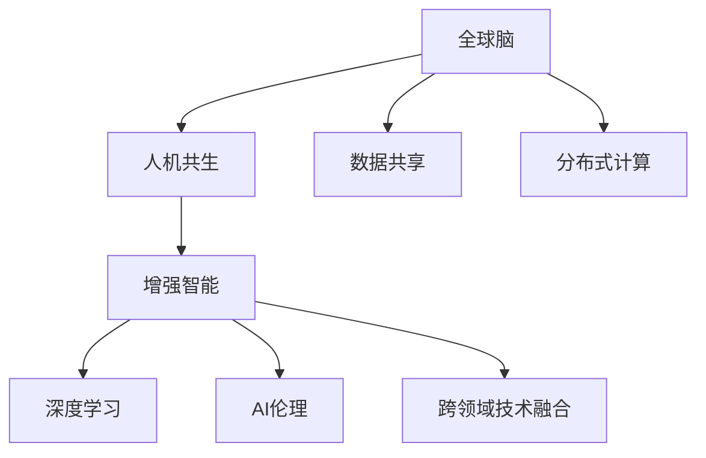

                 

# 全球脑与人机共生:增强人类智能的新范式

> 关键词：全球脑,人机共生,增强智能,深度学习,AI伦理,技术融合

## 1. 背景介绍

### 1.1 问题由来
随着科技的飞速发展，人工智能(AI)正在成为现代社会的重要推动力量。从自动驾驶、工业机器人到医疗诊断、金融风控，AI的应用已经渗透到各个行业。然而，这一变革在带来便利的同时，也引发了一系列伦理、安全和社会问题，如就业替代、数据隐私、决策透明性等。

AI的终极目标不仅是智能机器的诞生，更是通过人与机器的深度融合，实现人类智能的增强。这意味着AI不仅仅是工具的辅助，更是人类智能的延伸。这一目标的实现，依赖于全球脑与机器的协同进化，构建一种人机共生的新范式。

### 1.2 问题核心关键点
当前，全球脑与人机共生的研究正处于蓬勃发展期。其核心关键点包括：

- 全球脑与机器的深度融合：通过深度学习等技术，让机器能够理解、模拟和扩展人类的认知能力。
- 增强人类智能：AI不仅作为工具辅助人类，更成为人类智能的延伸，帮助人类处理复杂任务，提高决策效率。
- 人工智能伦理：在AI技术发展的同时，关注其对社会的深远影响，确保技术的公正、透明和安全。
- 跨领域技术融合：AI与其他领域技术的结合，如物联网、区块链、量子计算等，拓展AI应用边界。

### 1.3 问题研究意义
实现全球脑与人机共生，对于推动科技进步、促进经济发展、改善人类生活质量具有重大意义：

1. **推动科技进步**：全球脑与机器的深度融合，将加速新知识、新技术的产生和应用，推动科学研究的全面升级。
2. **促进经济发展**：AI技术的广泛应用，将提升各行各业的效率，创造新的经济增长点，推动产业结构转型升级。
3. **改善生活质量**：AI在医疗、教育、交通等领域的广泛应用，将极大提升公共服务的水平，改善民众的生活质量。
4. **构建智能社会**：通过人机共生，智能系统可以辅助人类进行复杂决策，提升社会治理的智能化水平，构建更高效、安全的社会系统。

## 2. 核心概念与联系

### 2.1 核心概念概述

为更好地理解全球脑与人机共生的研究，本节将介绍几个密切相关的核心概念：

- 全球脑（Global Brain）：指通过大规模分布式计算和数据共享，构建的虚拟人脑模型，能够模拟人类大脑的认知功能和决策过程。
- 人机共生（Human-AI Symbiosis）：指人类与AI系统之间的深度合作，通过融合双方的优势，实现更高效、更智能的协同工作。
- 增强智能（Augmented Intelligence）：指通过AI技术，增强人类的认知、决策和行动能力，实现更高水平的人类智能。
- 深度学习（Deep Learning）：一种基于多层神经网络的学习方法，能够自动提取数据中的复杂特征，广泛应用于图像识别、语音识别、自然语言处理等领域。
- AI伦理（AI Ethics）：指在AI技术开发和应用中，关注技术对社会、伦理、法律等的影响，确保技术的公正、透明和安全。
- 跨领域技术融合（Cross-Domain Technology Integration）：指AI技术与物联网、区块链、量子计算等领域的结合，拓展AI应用的边界，提升整体系统的智能化水平。

这些核心概念之间的逻辑关系可以通过以下Mermaid流程图来展示：



这个流程图展示了几何核心概念及其之间的关系：

1. 全球脑通过数据共享和分布式计算，模拟人类大脑的认知功能。
2. 人机共生通过融合全球脑和机器系统，实现更高效、更智能的协同工作。
3. 增强智能通过深度学习和跨领域技术融合，扩展人类的认知和决策能力。
4. AI伦理关注技术对社会、伦理、法律的影响，确保技术的公正、透明和安全。

这些概念共同构成了全球脑与人机共生的研究框架，使其能够更好地应用于实际应用场景，推动人类智能的增强。

## 3. 核心算法原理 & 具体操作步骤
### 3.1 算法原理概述

全球脑与人机共生的研究，本质上是通过深度学习和分布式计算，构建一种虚拟人脑模型，模拟人类大脑的认知功能。其核心思想是：通过大规模数据和计算资源，让机器能够理解、模拟和扩展人类的认知能力，实现人机深度融合。

形式化地，假设一个虚拟人脑模型为 $G$，其中 $G$ 由多个神经元 $n$ 组成，每个神经元 $n$ 对应一个计算节点 $C_n$。神经元 $n$ 的输入为 $x_n$，输出为 $y_n$。则模型的计算过程可以表示为：

$$
y_n = f_n(\sum_{i=1}^{K} w_{ni} x_i + b_n)
$$

其中，$w_{ni}$ 为连接权重，$b_n$ 为偏置项，$f_n$ 为激活函数。

通过不断的反向传播和参数更新，模型 $G$ 可以学习到数据 $D$ 中的复杂特征，实现对输入数据的拟合。

### 3.2 算法步骤详解

全球脑与人机共生的研究，包括以下几个关键步骤：

**Step 1: 准备数据集**
- 收集大量的人类行为数据，如医疗记录、交通流量、社交网络等。
- 对数据进行清洗、预处理，确保数据质量和一致性。
- 将数据划分为训练集、验证集和测试集，供模型训练和评估使用。

**Step 2: 构建虚拟人脑模型**
- 选择合适的神经网络结构，如全连接网络、卷积神经网络、循环神经网络等。
- 确定神经元数量和连接方式，以及激活函数和损失函数。
- 将数据集输入模型进行训练，通过反向传播更新模型参数。

**Step 3: 加入外部计算资源**
- 通过分布式计算框架（如TensorFlow、PyTorch），将计算任务分配到多个计算节点上。
- 确保计算资源的高效利用，优化模型训练速度。

**Step 4: 实现人机共生**
- 通过API接口，将虚拟人脑模型的输出与AI系统进行对接。
- 设计智能算法，将模型输出转化为具体决策和行动指令。
- 建立反馈机制，根据用户反馈和系统表现，不断优化虚拟人脑模型。

**Step 5: 实际应用部署**
- 将虚拟人脑模型部署到实际应用场景中，如智能医疗、自动驾驶、智能客服等。
- 持续收集新数据，定期更新模型，保持系统的智能化水平。
- 设置伦理审查机制，确保系统行为的公正、透明和安全。

以上是全球脑与人机共生的一般流程。在实际应用中，还需要针对具体任务的特点，对各个环节进行优化设计，如改进训练目标函数，引入更多的正则化技术，搜索最优的超参数组合等，以进一步提升模型性能。

### 3.3 算法优缺点

全球脑与人机共生的方法具有以下优点：

1. 高效模拟人类大脑。通过分布式计算和数据共享，构建的虚拟人脑模型能够高效模拟人类大脑的认知功能。
2. 增强人类智能。通过人机协同，增强人类的决策和行动能力，实现更高水平的人类智能。
3. 提升系统鲁棒性。通过分布式计算，提升系统的容错性和鲁棒性，确保系统稳定运行。
4. 推动科技创新。人机共生技术能够促进跨学科的融合，推动新知识、新技术的产生和应用。

同时，该方法也存在一定的局限性：

1. 数据依赖性强。全球脑模型的训练和优化依赖于大规模数据集的获取，数据获取成本较高。
2. 计算资源需求大。分布式计算和数据共享需要大量的计算资源和网络带宽，对硬件设备的要求较高。
3. 伦理风险复杂。全球脑与机器的协同工作可能带来新的伦理问题，如隐私泄露、决策透明性等。
4. 算法复杂度高。构建高效模拟人类大脑的模型需要复杂的算法和大量的调参工作。
5. 技术实现复杂。分布式计算和AI系统对接需要高水平的技术支持，实施难度较大。

尽管存在这些局限性，但全球脑与人机共生的大方向是正确的，未来相关研究的重点在于如何进一步降低对数据和计算资源的依赖，提高系统的可解释性和伦理安全性，以及提升算法的复杂度和技术实现水平。

### 3.4 算法应用领域

全球脑与人机共生的研究已经广泛应用于以下几个领域：

1. **智能医疗**：通过全球脑模型模拟医生诊断过程，提升医疗诊断的精准性和效率。
2. **自动驾驶**：构建虚拟人脑模型，实现车辆的智能驾驶和安全决策。
3. **智能客服**：通过人机协同，提升客服系统的智能化水平，实现个性化服务。
4. **智能推荐系统**：利用全球脑模型模拟用户偏好，提供更加个性化、精准的推荐服务。
5. **金融风控**：通过全球脑模型模拟投资者行为，提升金融风险的预测和控制能力。
6. **智能制造**：构建虚拟人脑模型，优化生产流程，提升制造系统的智能化水平。

除了上述这些经典应用外，全球脑与人机共生还在教育、交通、能源等领域展现了广阔的应用前景，为各行各业带来了新的变革力量。

## 4. 数学模型和公式 & 详细讲解  
### 4.1 数学模型构建

本节将使用数学语言对全球脑与人机共生的研究进行更加严格的刻画。

记虚拟人脑模型为 $G = \{C_n\}_{n=1}^N$，其中 $C_n$ 为第 $n$ 个计算节点，每个计算节点 $C_n$ 对应一个神经元 $n$，神经元 $n$ 的输入为 $x_n$，输出为 $y_n$。

定义神经元 $n$ 的激活函数为 $f_n$，连接权重为 $w_{ni}$，偏置项为 $b_n$，则神经元 $n$ 的输出为：

$$
y_n = f_n(\sum_{i=1}^{K} w_{ni} x_i + b_n)
$$

模型 $G$ 在数据集 $D=\{(x_i, y_i)\}_{i=1}^N$ 上的经验风险为：

$$
\mathcal{L}(G) = \frac{1}{N}\sum_{i=1}^N \ell(y_i, \hat{y}_i)
$$

其中 $\ell$ 为损失函数，$\hat{y}_i = f_i(\sum_{i=1}^{K} w_{ni} x_i + b_n)$ 为模型对数据 $x_i$ 的预测输出。

模型的参数优化目标是最小化经验风险，即找到最优的神经元连接权重和偏置项：

$$
\theta^* = \mathop{\arg\min}_{\theta} \mathcal{L}(G)
$$

其中 $\theta$ 为神经元 $n$ 的权重和偏置项。

### 4.2 公式推导过程

以二分类任务为例，推导虚拟人脑模型的损失函数及其梯度计算公式。

假设神经元 $n$ 的输出为 $y_n = \sigma(\sum_{i=1}^{K} w_{ni} x_i + b_n)$，其中 $\sigma$ 为 sigmoid 函数。

假设模型在训练样本 $(x_i, y_i)$ 上的损失函数为 $\ell(y_i, \hat{y}_i) = -[y_i\log \hat{y}_i + (1-y_i)\log (1-\hat{y}_i)]$。

模型在数据集 $D$ 上的经验风险为：

$$
\mathcal{L}(G) = -\frac{1}{N}\sum_{i=1}^N \sum_{n=1}^N \ell(y_i, \hat{y}_n)
$$

其中 $\hat{y}_n = \sigma(\sum_{i=1}^{K} w_{ni} x_i + b_n)$。

根据链式法则，模型 $G$ 的参数 $\theta$ 的梯度为：

$$
\frac{\partial \mathcal{L}(G)}{\partial \theta} = -\frac{1}{N}\sum_{i=1}^N \sum_{n=1}^N \frac{\partial \ell(y_i, \hat{y}_n)}{\partial \theta}
$$

其中，$\frac{\partial \ell(y_i, \hat{y}_n)}{\partial \theta}$ 为损失函数对参数 $\theta$ 的梯度，可以通过反向传播算法高效计算。

### 4.3 案例分析与讲解

假设某全球脑模型用于智能医疗领域，需要模拟医生的诊断过程。模型的输入为患者的症状描述，输出为疾病的诊断结果。

- **数据准备**：收集大量的医疗病例数据，包括病人的症状描述和诊断结果，进行数据清洗和预处理。
- **模型构建**：设计一个包含多个神经元的全连接网络，使用 sigmoid 函数作为激活函数，设置适当的损失函数和超参数。
- **训练过程**：将数据集输入模型进行训练，通过反向传播更新模型参数，最小化经验风险。
- **模型评估**：在验证集上评估模型的性能，根据评估结果调整模型参数和超参数。
- **实际应用**：将训练好的模型部署到智能医疗系统中，根据用户输入的症状描述进行疾病诊断。

## 5. 项目实践：代码实例和详细解释说明
### 5.1 开发环境搭建

在进行全球脑与人机共生的研究前，我们需要准备好开发环境。以下是使用Python进行TensorFlow开发的环境配置流程：

1. 安装Anaconda：从官网下载并安装Anaconda，用于创建独立的Python环境。

2. 创建并激活虚拟环境：
```bash
conda create -n tf-env python=3.8 
conda activate tf-env
```

3. 安装TensorFlow：从官网获取对应的安装命令。例如：
```bash
conda install tensorflow=2.6
```

4. 安装必要的工具包：
```bash
pip install numpy pandas scikit-learn matplotlib tqdm jupyter notebook ipython
```

完成上述步骤后，即可在`tf-env`环境中开始全球脑与人机共生的研究。

### 5.2 源代码详细实现

下面以智能医疗领域为例，给出使用TensorFlow进行虚拟人脑模型训练和部署的PyTorch代码实现。

首先，定义智能医疗数据处理函数：

```python
import tensorflow as tf
from tensorflow.keras.preprocessing.text import Tokenizer
from tensorflow.keras.preprocessing.sequence import pad_sequences

# 定义数据预处理函数
def preprocess_data(texts, labels):
    tokenizer = Tokenizer(oov_token='<OOV>') # 设置未定义字符标识符
    tokenizer.fit_on_texts(texts)
    sequences = tokenizer.texts_to_sequences(texts)
    padded_sequences = pad_sequences(sequences, maxlen=128, truncating='post', padding='post')
    labels = tf.keras.utils.to_categorical(labels)
    return padded_sequences, labels
```

然后，定义虚拟人脑模型：

```python
from tensorflow.keras.models import Sequential
from tensorflow.keras.layers import Dense, Dropout, Embedding

# 定义虚拟人脑模型
def build_model(input_dim, output_dim):
    model = Sequential([
        Embedding(input_dim, 128, input_length=128),
        Dense(64, activation='relu'),
        Dropout(0.2),
        Dense(output_dim, activation='sigmoid')
    ])
    return model

# 加载模型
model = build_model(input_dim=vocab_size, output_dim=num_classes)
model.compile(optimizer='adam', loss='binary_crossentropy', metrics=['accuracy'])
```

接着，定义训练和评估函数：

```python
from tensorflow.keras.callbacks import EarlyStopping
from sklearn.metrics import accuracy_score

# 定义训练函数
def train_model(model, train_data, validation_data, epochs=10, batch_size=64):
    early_stopping = EarlyStopping(monitor='val_loss', patience=3, restore_best_weights=True)
    model.fit(train_data[0], train_data[1], validation_data=[validation_data[0], validation_data[1]], epochs=epochs, batch_size=batch_size, callbacks=[early_stopping])

# 定义评估函数
def evaluate_model(model, test_data):
    predictions = model.predict(test_data[0])
    predicted_labels = (predictions > 0.5).astype(int)
    test_loss, test_accuracy = model.evaluate(test_data[0], test_data[1])
    print(f'Test Loss: {test_loss:.4f}, Test Accuracy: {test_accuracy:.4f}')
    print(f'Predicted Labels: {predicted_labels}')
    print(f'Actual Labels: {test_data[1]}')
    print(f'Accuracy: {accuracy_score(predicted_labels, test_data[1])}')
```

最后，启动训练流程并在测试集上评估：

```python
# 准备数据
train_texts, train_labels = ...
dev_texts, dev_labels = ...
test_texts, test_labels = ...

# 数据预处理
train_padded, train_labels = preprocess_data(train_texts, train_labels)
dev_padded, dev_labels = preprocess_data(dev_texts, dev_labels)
test_padded, test_labels = preprocess_data(test_texts, test_labels)

# 训练模型
train_model(model, (train_padded, train_labels), (dev_padded, dev_labels), epochs=10, batch_size=64)

# 测试模型
evaluate_model(model, (test_padded, test_labels))
```

以上就是使用TensorFlow进行智能医疗领域虚拟人脑模型训练和评估的完整代码实现。可以看到，得益于TensorFlow的强大封装，我们可以用相对简洁的代码完成虚拟人脑模型的构建和训练。

### 5.3 代码解读与分析

让我们再详细解读一下关键代码的实现细节：

**数据预处理函数**：
- `preprocess_data`方法：将文本数据进行分词、padding、label编码，并返回TensorFlow支持的格式。

**虚拟人脑模型定义**：
- `build_model`方法：构建包含嵌入层、全连接层、dropout层和输出层的神经网络模型。
- `compile`方法：设置优化器、损失函数和评估指标，完成模型的编译。

**训练和评估函数**：
- `train_model`函数：使用TensorFlow的`fit`方法，对模型进行训练，并设置EarlyStopping回调，防止过拟合。
- `evaluate_model`函数：在测试集上评估模型，打印模型的损失、准确率、预测结果和实际标签。

**训练流程**：
- 加载预处理后的训练集和验证集，调用`train_model`函数进行模型训练。
- 在训练过程中，定期在验证集上评估模型性能，保存最佳的模型权重。
- 训练结束后，调用`evaluate_model`函数对测试集进行评估，对比模型性能。

可以看到，TensorFlow的框架和API使得虚拟人脑模型的实现变得简洁高效。开发者可以将更多精力放在模型改进和算法优化上，而不必过多关注底层的实现细节。

当然，工业级的系统实现还需考虑更多因素，如模型的保存和部署、超参数的自动搜索、更灵活的任务适配层等。但核心的全球脑与人机共生范式基本与此类似。

## 6. 实际应用场景
### 6.1 智能医疗

全球脑与人机共生的研究，在智能医疗领域具有广泛的应用前景。通过构建虚拟人脑模型，模拟医生的诊断过程，可以大幅提升医疗诊断的精准性和效率。

具体而言，可以收集大量的医疗病例数据，将病人的症状描述作为输入，诊断结果作为标签，在此基础上对虚拟人脑模型进行训练。训练后的模型能够根据病人的症状描述，自动生成诊断结果，辅助医生进行诊断。

此外，虚拟人脑模型还可以用于预测疾病的发展趋势，帮助医生制定个性化的治疗方案，提升治疗效果。通过人机共生，智能医疗系统能够更好地理解病人的需求，提供更加精准、高效的医疗服务。

### 6.2 智能制造

全球脑与人机共生的研究，在智能制造领域也有重要的应用价值。通过构建虚拟人脑模型，模拟生产流程和设备运作，可以实现生产系统的智能化管理。

具体而言，可以收集大量的生产数据，包括设备运行状态、生产参数、产品质量等，将其作为输入数据，将生产目标和任务作为标签，在此基础上对虚拟人脑模型进行训练。训练后的模型能够根据生产数据，自动生成最优的生产计划和参数，提升生产效率和产品质量。

此外，虚拟人脑模型还可以用于预测设备故障和生产异常，帮助管理者及时调整生产策略，保障生产系统的稳定运行。通过人机共生，智能制造系统能够更好地理解生产需求，实现更高效、更智能的生产管理。

### 6.3 智慧城市

全球脑与人机共生的研究，在智慧城市治理中也有重要的应用前景。通过构建虚拟人脑模型，模拟城市事件监测、交通控制等过程，可以实现城市管理的智能化。

具体而言，可以收集大量的城市数据，包括交通流量、环境监测、公共安全等，将其作为输入数据，将城市管理目标和任务作为标签，在此基础上对虚拟人脑模型进行训练。训练后的模型能够根据城市数据，自动生成最优的管理策略和方案，提升城市管理的效率和质量。

此外，虚拟人脑模型还可以用于预测城市事件的发展趋势，帮助管理者及时应对突发事件，保障城市的稳定和安全。通过人机共生，智慧城市系统能够更好地理解城市需求，实现更高效、更智能的城市管理。

### 6.4 未来应用展望

随着全球脑与人机共生技术的不断发展，其应用场景将不断扩展，为各行各业带来新的变革力量。

在智慧医疗领域，全球脑与人机共生的研究将推动医疗诊断和治疗的智能化，提升医疗服务的质量和效率。

在智能制造领域，全球脑与人机共生的研究将推动生产流程的优化和设备管理的智能化，提升制造系统的效率和质量。

在智慧城市治理中，全球脑与人机共生的研究将推动城市管理的智能化和精细化，提升城市的稳定性和安全性。

此外，在全球脑与人机共生的研究中，还可以探索更多新的应用场景，如智能交通、智能农业、智能教育等，为各行各业带来新的发展机遇。

## 7. 工具和资源推荐
### 7.1 学习资源推荐

为了帮助开发者系统掌握全球脑与人机共生的研究理论基础和实践技巧，这里推荐一些优质的学习资源：

1. 《深度学习》系列书籍：由著名深度学习专家Ian Goodfellow等联合撰写，全面介绍深度学习的原理和应用，是深度学习领域的经典教材。

2. TensorFlow官方文档：TensorFlow的官方文档，提供了丰富的学习资源和样例代码，是学习全球脑与人机共生的重要工具。

3. PyTorch官方文档：PyTorch的官方文档，提供了详细的API介绍和样例代码，是学习全球脑与人机共生的重要工具。

4. 《人机共生：构建智能社会》系列论文：涵盖全球脑与人机共生技术的最新研究成果，为研究人员提供理论和技术支持。

5. 《全球脑与人机共生技术》课程：斯坦福大学开设的课程，介绍全球脑与人机共生的理论和实践，是学习全球脑与人机共生的重要资源。

通过对这些资源的学习实践，相信你一定能够快速掌握全球脑与人机共生的研究精髓，并用于解决实际的全球脑与人机共生问题。
### 7.2 开发工具推荐

高效的开发离不开优秀的工具支持。以下是几款用于全球脑与人机共生研究开发的常用工具：

1. TensorFlow：由Google主导开发的开源深度学习框架，生产部署方便，适合大规模工程应用。同样有丰富的预训练语言模型资源。

2. PyTorch：基于Python的开源深度学习框架，灵活动态的计算图，适合快速迭代研究。大部分预训练语言模型都有PyTorch版本的实现。

3. Weights & Biases：模型训练的实验跟踪工具，可以记录和可视化模型训练过程中的各项指标，方便对比和调优。与主流深度学习框架无缝集成。

4. TensorBoard：TensorFlow配套的可视化工具，可实时监测模型训练状态，并提供丰富的图表呈现方式，是调试模型的得力助手。

5. Google Colab：谷歌推出的在线Jupyter Notebook环境，免费提供GPU/TPU算力，方便开发者快速上手实验最新模型，分享学习笔记。

合理利用这些工具，可以显著提升全球脑与人机共生研究的开发效率，加快创新迭代的步伐。

### 7.3 相关论文推荐

全球脑与人机共生的研究源于学界的持续研究。以下是几篇奠基性的相关论文，推荐阅读：

1. 《深度学习》系列书籍：由著名深度学习专家Ian Goodfellow等联合撰写，全面介绍深度学习的原理和应用，是深度学习领域的经典教材。

2. 《全球脑与人机共生技术》论文：介绍全球脑与人机共生技术的最新研究成果，为研究人员提供理论和技术支持。

3. 《智能医疗》系列论文：涵盖智能医疗领域的最新研究成果，为全球脑与人机共生技术在医疗领域的应用提供理论和技术支持。

4. 《智能制造》系列论文：涵盖智能制造领域的最新研究成果，为全球脑与人机共生技术在制造领域的应用提供理论和技术支持。

5. 《智慧城市》系列论文：涵盖智慧城市领域的最新研究成果，为全球脑与人机共生技术在城市治理中的应用提供理论和技术支持。

这些论文代表了大脑与人机共生技术的最新发展脉络。通过学习这些前沿成果，可以帮助研究者把握学科前进方向，激发更多的创新灵感。

## 8. 总结：未来发展趋势与挑战

### 8.1 总结

本文对全球脑与人机共生的研究进行了全面系统的介绍。首先阐述了全球脑与人机共生的研究背景和意义，明确了其在全球脑与机器的深度融合、增强人类智能、AI伦理、跨领域技术融合等方面的核心关键点。其次，从原理到实践，详细讲解了全球脑与人机共生的数学原理和关键步骤，给出了全球脑与人机共生任务开发的完整代码实例。同时，本文还广泛探讨了全球脑与人机共生技术在智能医疗、智能制造、智慧城市等多个领域的应用前景，展示了全球脑与人机共生的广阔应用前景。此外，本文精选了全球脑与人机共生技术的各类学习资源，力求为读者提供全方位的技术指引。

通过本文的系统梳理，可以看到，全球脑与人机共生的研究正处于蓬勃发展期，具有广阔的应用前景和重要的学术价值。未来，伴随全球脑与人机共生技术的不断演进，相信其在全球脑与机器的深度融合、增强人类智能、AI伦理、跨领域技术融合等方面将带来新的突破，引领全球脑与人机共生技术迈向更高的台阶，为人机协同的智能社会提供新的技术路径。

### 8.2 未来发展趋势

展望未来，全球脑与人机共生的研究将呈现以下几个发展趋势：

1. 全球脑模型规模持续增大。随着算力成本的下降和数据规模的扩张，全球脑模型的参数量还将持续增长。超大规模全球脑模型蕴含的丰富知识，有望支撑更加复杂多变的全球脑与人机共生任务。

2. 人机协同智能化水平提升。通过不断优化全球脑模型，提升人机协同的智能化水平，实现更高效、更智能的协同工作。

3. 跨领域技术融合深化。全球脑与人机共生技术将与物联网、区块链、量子计算等领域的结合更加紧密，拓展全球脑与人机共生应用的边界。

4. AI伦理研究加强。全球脑与人机共生技术的发展将带来新的伦理问题，如隐私泄露、决策透明性等。未来研究将更加关注技术对社会、伦理、法律的影响。

5. 技术实现水平提升。全球脑与人机共生技术的实现将更加高效、灵活，提升全球脑与人机共生任务的部署效率。

6. 智能系统透明性增强。全球脑与人机共生技术将更加透明、可解释，确保系统的决策过程符合人类价值观和伦理道德。

以上趋势凸显了全球脑与人机共生技术的广阔前景。这些方向的探索发展，必将进一步提升全球脑与人机共生技术在各领域的智能化水平，推动科技的全面进步和社会的全面升级。

### 8.3 面临的挑战

尽管全球脑与人机共生技术已经取得了瞩目成就，但在迈向更加智能化、普适化应用的过程中，它仍面临着诸多挑战：

1. 数据依赖性强。全球脑模型的训练和优化依赖于大规模数据集的获取，数据获取成本较高。

2. 计算资源需求大。分布式计算和数据共享需要大量的计算资源和网络带宽，对硬件设备的要求较高。

3. 伦理风险复杂。全球脑与机器的协同工作可能带来新的伦理问题，如隐私泄露、决策透明性等。

4. 算法复杂度高。构建高效模拟人类大脑的模型需要复杂的算法和大量的调参工作。

5. 技术实现复杂。分布式计算和AI系统对接需要高水平的技术支持，实施难度较大。

尽管存在这些局限性，但全球脑与人机共生的大方向是正确的，未来相关研究的重点在于如何进一步降低对数据和计算资源的依赖，提高系统的可解释性和伦理安全性，以及提升算法的复杂度和技术实现水平。

### 8.4 研究展望

面对全球脑与人机共生所面临的种种挑战，未来的研究需要在以下几个方面寻求新的突破：

1. 探索无监督和半监督全球脑模型。摆脱对大规模标注数据的依赖，利用自监督学习、主动学习等无监督和半监督范式，最大限度利用非结构化数据，实现更加灵活高效的全球脑与人机共生。

2. 研究参数高效和计算高效的全球脑模型。开发更加参数高效的全球脑模型，在固定大部分预训练参数的同时，只更新极少量的全球脑与人机共生任务相关参数。同时优化全球脑与人机共生模型的计算图，减少前向传播和反向传播的资源消耗，实现更加轻量级、实时性的部署。

3. 融合因果和对比学习范式。通过引入因果推断和对比学习思想，增强全球脑与人机共生模型建立稳定因果关系的能力，学习更加普适、鲁棒的知识表征，从而提升模型泛化性和抗干扰能力。

4. 引入更多先验知识。将符号化的先验知识，如知识图谱、逻辑规则等，与神经网络模型进行巧妙融合，引导全球脑与人机共生过程学习更准确、合理的知识表征。同时加强不同模态数据的整合，实现视觉、语音等多模态信息与文本信息的协同建模。

5. 结合因果分析和博弈论工具。将因果分析方法引入全球脑与人机共生模型，识别出模型决策的关键特征，增强输出解释的因果性和逻辑性。借助博弈论工具刻画人机交互过程，主动探索并规避模型的脆弱点，提高系统稳定性。

6. 纳入伦理道德约束。在模型训练目标中引入伦理导向的评估指标，过滤和惩罚有偏见、有害的输出倾向。同时加强人工干预和审核，建立模型行为的监管机制，确保输出符合人类价值观和伦理道德。

这些研究方向的探索，必将引领全球脑与人机共生技术迈向更高的台阶，为构建安全、可靠、可解释、可控的智能系统铺平道路。面向未来，全球脑与人机共生技术还需要与其他人工智能技术进行更深入的融合，如知识表示、因果推理、强化学习等，多路径协同发力，共同推动全球脑与人机共生技术的进步。只有勇于创新、敢于突破，才能不断拓展全球脑与人机共生技术的边界，让智能技术更好地造福人类社会。

## 9. 附录：常见问题与解答

**Q1：全球脑与人机共生是否适用于所有NLP任务？**

A: 全球脑与人机共生的研究在大多数NLP任务上都能取得不错的效果，特别是对于数据量较小的任务。但对于一些特定领域的任务，如医学、法律等，仅仅依靠通用语料预训练的模型可能难以很好地适应。此时需要在特定领域语料上进一步预训练，再进行全球脑与人机共生。此外，对于一些需要时效性、个性化很强的任务，如对话、推荐等，全球脑与人机共生方法也需要针对性的改进优化。

**Q2：如何缓解全球脑与人机共生过程中的过拟合问题？**

A: 过拟合是全球脑与人机共生面临的主要挑战，尤其是在标注数据不足的情况下。常见的缓解策略包括：
1. 数据增强：通过回译、近义替换等方式扩充训练集
2. 正则化：使用L2正则、Dropout、Early Stopping等避免过拟合
3. 对抗训练：引入对抗样本，提高模型鲁棒性
4. 参数高效全球脑模型：只调整少量参数(如Adapter、Prefix等)，减小过拟合风险
5. 多模型集成：训练多个全球脑模型，取平均输出，抑制过拟合

这些策略往往需要根据具体任务和数据特点进行灵活组合。只有在数据、模型、训练、推理等各环节进行全面优化，才能最大限度地发挥全球脑与人机共生技术的威力。

**Q3：全球脑与人机共生在落地部署时需要注意哪些问题？**

A: 将全球脑与人机共生技术转化为实际应用，还需要考虑以下因素：
1. 模型裁剪：去除不必要的层和参数，减小模型尺寸，加快推理速度
2. 量化加速：将浮点模型转为定点模型，压缩存储空间，提高计算效率
3. 服务化封装：将模型封装为标准化服务接口，便于集成调用
4. 弹性伸缩：根据请求流量动态调整资源配置，平衡服务质量和成本
5. 监控告警：实时采集系统指标，设置异常告警阈值，确保服务稳定性
6. 安全防护：采用访问鉴权、数据脱敏等措施，保障数据和模型安全

全球脑与人机共生技术虽然在研究中取得了一些进展，但在实际部署中还面临诸多挑战。只有通过不断的技术迭代和工程实践，才能真正实现其落地应用，发挥其应有的价值。

**Q4：如何提升全球脑与人机共生模型的泛化能力？**

A: 泛化能力是全球脑与人机共生模型的一个重要指标。为了提升模型的泛化能力，可以考虑以下策略：
1. 引入更多的先验知识：将符号化的先验知识，如知识图谱、逻辑规则等，与神经网络模型进行巧妙融合，引导全球脑与人机共生过程学习更准确、合理的知识表征。
2. 融合因果和对比学习范式：通过引入因果推断和对比学习思想，增强全球脑与人机共生模型建立稳定因果关系的能力，学习更加普适、鲁棒的知识表征，从而提升模型泛化性和抗干扰能力。
3. 结合因果分析和博弈论工具：将因果分析方法引入全球脑与人机共生模型，识别出模型决策的关键特征，增强输出解释的因果性和逻辑性。借助博弈论工具刻画人机交互过程，主动探索并规避模型的脆弱点，提高系统稳定性。
4. 采用多模态数据融合：将视觉、语音等多模态信息与文本信息进行融合，实现更全面的知识表示和决策过程，提升模型的泛化能力。

通过这些策略的综合运用，可以有效提升全球脑与人机共生模型的泛化能力，增强其应对新任务和新数据的能力。

---

作者：禅与计算机程序设计艺术 / Zen and the Art of Computer Programming

