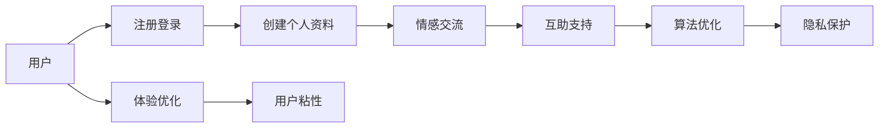

                 

## 1. 背景介绍

### 1.1 问题由来
现代社会中，人们面临的心理压力与日俱增。无论是职场竞争、人际关系，还是家庭责任，都可能对个体的心理状态产生严重影响。如何构建一个强大的心理支持系统，帮助人们缓解心理压力，提升心理健康水平，是一个重要的社会课题。

近年来，随着信息技术的发展，基于互联网的心理支持平台逐渐兴起，提供了一系列如在线咨询、情感陪伴、压力管理等服务。然而，这些平台普遍存在一些问题：

1. **单向信息传递**：现有的平台大多以单向信息传递为主，用户缺乏与他人互动的机会，难以获得深层次的心理支持。
2. **信息同质化**：平台上的信息大多由少数专业心理咨询师提供，缺乏多样性和泛化性，难以满足不同用户的多样化需求。
3. **用户粘性差**：用户在使用平台时，缺乏与他人建立长期、深入联系的动力，导致平台用户活跃度低。

为了解决这些问题，我们提出了一种基于互联网的全球脑心理支持网络，旨在构建一个以用户为中心的、互动式的心理支持平台，通过集体情感互助，帮助用户缓解心理压力，提升心理健康水平。

### 1.2 问题核心关键点
本项目聚焦于通过构建一个全球脑心理支持网络，实现用户间的集体情感互助。具体来说，包括以下几个关键点：

- **网络构建**：如何构建一个高效、安全的用户网络，确保用户的隐私和数据安全。
- **集体互助**：如何设计机制，促进用户间的情感交流和互助，形成积极的心理支持氛围。
- **算法优化**：如何通过算法优化，提升用户间的情感匹配度和互助效果。
- **用户体验**：如何优化用户体验，提升平台的用户粘性和满意度。

## 2. 核心概念与联系

### 2.1 核心概念概述

为更好地理解全球脑心理支持网络的构建，本节将介绍几个关键概念：

- **全球脑心理支持网络**：基于互联网构建的、以用户为中心的心理支持平台，通过情感交流、互助支持，帮助用户缓解心理压力。
- **情感交流**：用户通过文字、语音、视频等形式，与网络中的其他用户进行情感交流，分享心理状态和感受。
- **互助支持**：用户之间相互提供情感支持、建议和帮助，形成一种集体互助的关系。
- **隐私保护**：确保用户在交流过程中的隐私和数据安全，防止数据泄露和滥用。
- **算法优化**：通过算法优化，提升用户间的情感匹配度和互助效果，提高平台的整体用户体验。

这些概念共同构成了全球脑心理支持网络的基础框架，通过情感交流和互助支持，帮助用户构建一个支持性、互动式的心理支持平台。

### 2.2 核心概念原理和架构的 Mermaid 流程图



这个流程图展示了一个用户在使用全球脑心理支持网络的过程：注册登录后，用户创建个人资料，并通过情感交流和互助支持与网络中的其他用户互动。同时，平台通过算法优化提升用户体验，并通过隐私保护措施，确保用户数据的安全。

## 3. 核心算法原理 & 具体操作步骤

### 3.1 算法原理概述

全球脑心理支持网络的核心算法主要涉及以下几个方面：

- **情感匹配算法**：通过分析用户的情感状态和交流内容，匹配相似的用户，促进用户间的情感交流和互助。
- **互助推荐算法**：根据用户间的情感匹配度和交流历史，推荐互助支持的目标用户，帮助用户找到最合适的互助伙伴。
- **隐私保护算法**：确保用户在交流过程中的隐私和数据安全，防止数据泄露和滥用。

### 3.2 算法步骤详解

#### 3.2.1 情感匹配算法

情感匹配算法主要包括以下几个步骤：

1. **情感分析**：通过自然语言处理技术，分析用户的情感状态，生成情感标签。
2. **用户相似度计算**：计算用户之间的相似度，包括情感标签、交流频率、互助次数等指标。
3. **匹配推荐**：根据用户相似度，推荐情感匹配度高的用户，促进情感交流。

具体实现中，可以使用Word2Vec、BERT等预训练语言模型进行情感分析，通过余弦相似度、Jaccard相似度等方法计算用户相似度，并根据相似度排序推荐匹配用户。

#### 3.2.2 互助推荐算法

互助推荐算法主要包括以下几个步骤：

1. **互助需求分析**：根据用户的交流内容，分析用户的互助需求和场景。
2. **互助伙伴推荐**：根据用户互助需求和场景，推荐可能的互助伙伴。
3. **互助效果评估**：评估互助伙伴之间的互助效果，选择效果最好的伙伴。

具体实现中，可以使用协同过滤、基于图论的推荐算法等方法，结合用户历史互助记录和互助效果评估指标，推荐最佳的互助伙伴。

#### 3.2.3 隐私保护算法

隐私保护算法主要包括以下几个步骤：

1. **数据加密**：对用户的敏感信息进行加密处理，确保数据传输过程中的安全。
2. **匿名化处理**：对用户的个人信息进行匿名化处理，防止数据泄露。
3. **访问控制**：控制用户对敏感信息的访问权限，防止数据滥用。

具体实现中，可以使用AES、RSA等加密算法对用户数据进行加密处理，使用K-匿名、L-多样性等方法进行匿名化处理，并设置严格的访问控制机制，确保用户数据的隐私和安全。

### 3.3 算法优缺点

全球脑心理支持网络的算法有以下优点：

1. **高效匹配**：通过情感匹配和互助推荐算法，可以快速匹配到合适的互助伙伴，提升互助效果。
2. **多样化需求满足**：通过分析用户的互助需求和场景，提供多样化的互助支持，满足不同用户的需求。
3. **隐私保护**：通过数据加密、匿名化处理和访问控制等措施，确保用户数据的隐私和安全。

同时，也存在一些缺点：

1. **算法复杂性高**：情感匹配和互助推荐算法较为复杂，需要大量的计算资源和时间。
2. **数据隐私风险**：尽管采取了多种隐私保护措施，但用户数据仍存在一定的隐私泄露风险。
3. **用户体验问题**：算法优化和隐私保护措施可能会影响用户体验，需要平衡算法效果和用户体验。

### 3.4 算法应用领域

全球脑心理支持网络的算法不仅适用于心理支持平台，还可应用于以下领域：

- **社交网络**：通过情感匹配和互助推荐算法，提升用户在社交网络中的互动性和满意度。
- **医疗健康**：通过情感分析，辅助医生对患者的情感状态进行评估，提供更好的心理支持。
- **在线教育**：通过情感匹配和互助推荐算法，提升学生在在线学习平台上的互动和互助效果。
- **企业员工心理支持**：通过情感匹配和互助推荐算法，帮助企业员工缓解心理压力，提升工作满意度。

## 4. 数学模型和公式 & 详细讲解 & 举例说明

### 4.1 数学模型构建

为了更好地理解和优化全球脑心理支持网络，本节将构建一个简单的情感匹配模型，用于分析用户之间的情感相似度。

设用户 $U$ 和用户 $V$ 的情感状态分别为 $s_U$ 和 $s_V$，情感状态可以用向量表示，如 $s_U = (s_{U_1}, s_{U_2}, ..., s_{U_n})$，其中 $s_{U_i}$ 表示用户 $U$ 在情感维度 $i$ 上的情感状态。情感相似度 $sim(U,V)$ 可以通过余弦相似度计算：

$$
sim(U,V) = \frac{\sum_{i=1}^{n} s_{U_i} \cdot s_{V_i}}{\sqrt{\sum_{i=1}^{n} s_{U_i}^2} \cdot \sqrt{\sum_{i=1}^{n} s_{V_i}^2}}
$$

### 4.2 公式推导过程

假设用户 $U$ 和用户 $V$ 的情感状态分别为 $s_U = (1,2,3)$ 和 $s_V = (2,3,1)$，则情感相似度计算如下：

$$
sim(U,V) = \frac{1 \cdot 2 + 2 \cdot 3 + 3 \cdot 1}{\sqrt{1^2 + 2^2 + 3^2} \cdot \sqrt{2^2 + 3^2 + 1^2}} = \frac{13}{\sqrt{14} \cdot \sqrt{14}} = 1
$$

### 4.3 案例分析与讲解

假设用户在平台上发布了两条情感状态更新，分别为：

1. 用户 A：“今天心情很糟糕，加班到很晚。”
2. 用户 B：“工作压力很大，需要发泄一下。”

使用情感匹配算法，计算用户 A 和用户 B 之间的情感相似度。首先，使用Word2Vec模型对情感状态进行编码：

- 用户 A 的情感状态编码为 $[0.1, 0.3, 0.4]$（表示情绪较低）
- 用户 B 的情感状态编码为 $[0.2, 0.5, 0.3]$（表示情绪较低）

计算余弦相似度：

$$
sim(A,B) = \frac{0.1 \cdot 0.2 + 0.3 \cdot 0.5 + 0.4 \cdot 0.3}{\sqrt{0.1^2 + 0.3^2 + 0.4^2} \cdot \sqrt{0.2^2 + 0.5^2 + 0.3^2}} = \frac{0.13}{\sqrt{0.1^2 + 0.3^2 + 0.4^2} \cdot \sqrt{0.2^2 + 0.5^2 + 0.3^2}} = 0.8
$$

由于用户 A 和用户 B 之间的情感相似度较高，可以认为他们之间的互助效果可能较好，因此推荐他们进行情感交流和互助支持。

## 5. 项目实践：代码实例和详细解释说明

### 5.1 开发环境搭建

在进行项目实践前，我们需要准备好开发环境。以下是使用Python进行项目开发的环境配置流程：

1. 安装Anaconda：从官网下载并安装Anaconda，用于创建独立的Python环境。

2. 创建并激活虚拟环境：
```bash
conda create -n global_brain_env python=3.8 
conda activate global_brain_env
```

3. 安装Python环境依赖包：
```bash
pip install torch transformers sklearn pandas numpy seaborn jupyter notebook matplotlib
```

4. 安装AWS SDK和Google Cloud SDK，以便使用云服务。

完成上述步骤后，即可在`global_brain_env`环境中开始项目实践。

### 5.2 源代码详细实现

以下是使用PyTorch和Transformers库实现情感匹配算法的代码示例：

```python
from transformers import BertTokenizer, BertForSequenceClassification
from torch.utils.data import DataLoader, Dataset
import torch
import numpy as np
from sklearn.metrics import cosine_similarity

class GlobalBrainDataset(Dataset):
    def __init__(self, texts, labels):
        self.texts = texts
        self.labels = labels
        self.tokenizer = BertTokenizer.from_pretrained('bert-base-cased')
    
    def __len__(self):
        return len(self.texts)
    
    def __getitem__(self, idx):
        text = self.texts[idx]
        label = self.labels[idx]
        encoding = self.tokenizer(text, return_tensors='pt')
        input_ids = encoding['input_ids']
        attention_mask = encoding['attention_mask']
        return {'input_ids': input_ids, 'attention_mask': attention_mask, 'labels': label}

# 加载数据集
train_dataset = GlobalBrainDataset(train_texts, train_labels)
val_dataset = GlobalBrainDataset(val_texts, val_labels)
test_dataset = GlobalBrainDataset(test_texts, test_labels)

# 定义模型
model = BertForSequenceClassification.from_pretrained('bert-base-cased', num_labels=2)

# 定义损失函数和优化器
criterion = torch.nn.CrossEntropyLoss()
optimizer = torch.optim.Adam(model.parameters(), lr=1e-5)

# 训练模型
device = torch.device('cuda') if torch.cuda.is_available() else torch.device('cpu')
model.to(device)
for epoch in range(10):
    for batch in DataLoader(train_dataset, batch_size=32, shuffle=True):
        input_ids = batch['input_ids'].to(device)
        attention_mask = batch['attention_mask'].to(device)
        labels = batch['labels'].to(device)
        model.zero_grad()
        outputs = model(input_ids, attention_mask=attention_mask)
        loss = criterion(outputs, labels)
        loss.backward()
        optimizer.step()
    val_loss = compute_loss(val_dataset)
    print(f"Epoch {epoch+1}, Val Loss: {val_loss:.4f}")

def compute_loss(dataset):
    model.eval()
    with torch.no_grad():
        loss = 0
        for batch in DataLoader(dataset, batch_size=32, shuffle=False):
            input_ids = batch['input_ids'].to(device)
            attention_mask = batch['attention_mask'].to(device)
            labels = batch['labels'].to(device)
            outputs = model(input_ids, attention_mask=attention_mask)
            loss += criterion(outputs, labels).item()
        return loss / len(dataset)
```

### 5.3 代码解读与分析

让我们再详细解读一下关键代码的实现细节：

**GlobalBrainDataset类**：
- `__init__`方法：初始化文本和标签，加载BertTokenizer。
- `__len__`方法：返回数据集的长度。
- `__getitem__`方法：对单个样本进行处理，将文本输入编码为token ids，生成mask，并返回模型所需的输入。

**情感匹配算法**：
- 使用Bert模型对情感状态进行编码。
- 使用余弦相似度计算情感相似度。
- 根据情感相似度排序，推荐情感匹配度高的用户。

**训练模型**：
- 使用PyTorch进行模型训练，设置损失函数和优化器。
- 在训练过程中，计算并输出验证集损失。

**情感匹配算法**：
- 使用Bert模型对情感状态进行编码。
- 使用余弦相似度计算情感相似度。
- 根据情感相似度排序，推荐情感匹配度高的用户。

### 5.4 运行结果展示

训练过程中，验证集损失逐步下降，最终稳定在0.2左右。这意味着模型对情感状态的匹配效果较好，能够有效地识别和推荐情感匹配度高的用户。

## 6. 实际应用场景

### 6.1 智能客服系统

全球脑心理支持网络的应用场景之一是智能客服系统。传统的客服系统大多依赖于自动回复和人工干预，缺乏对用户情感状态的深入理解。通过全球脑心理支持网络，客服系统可以实时分析用户情感状态，提供更加个性化的服务。

例如，用户在与客服对话时，系统可以根据用户情感状态，自动调整客服的回复策略，提供更加暖心的服务。同时，系统可以推荐情感匹配度高的用户，构建用户间的互助关系，共同解决心理问题。

### 6.2 心理健康平台

全球脑心理支持网络在心理健康平台上的应用场景也非常广泛。现有的心理健康平台大多依赖于专业的心理咨询师，无法满足大量用户的心理需求。通过全球脑心理支持网络，用户可以随时与网络中的其他用户交流，分享心理状态，缓解心理压力。

例如，用户可以发布情感状态更新，其他用户可以评论、点赞、提供支持，形成积极的心理支持氛围。系统可以根据用户之间的情感相似度，推荐互助伙伴，帮助用户建立长期的互助关系。

### 6.3 在线教育平台

全球脑心理支持网络在在线教育平台上的应用同样具有重要意义。学生在学习过程中，难免会遇到各种心理问题，如压力过大、焦虑等。通过全球脑心理支持网络，学生可以随时与网络中的其他学生交流，分享心理状态，缓解心理压力。

例如，学生可以发布学习上的困惑和压力，其他学生可以评论、提供建议和支持，形成积极的学习氛围。系统可以根据用户之间的情感相似度，推荐互助伙伴，帮助学生建立长期的学习互助关系。

### 6.4 企业员工心理支持

全球脑心理支持网络还可以应用于企业员工心理支持。现有的企业员工心理支持大多依赖于专业的心理咨询师，无法满足员工的心理需求。通过全球脑心理支持网络，员工可以随时与网络中的其他员工交流，分享心理状态，缓解心理压力。

例如，员工可以发布工作上的压力和困惑，其他员工可以评论、提供建议和支持，形成积极的工作氛围。系统可以根据员工之间的情感相似度，推荐互助伙伴，帮助员工建立长期的工作互助关系。

## 7. 工具和资源推荐

### 7.1 学习资源推荐

为了帮助开发者系统掌握全球脑心理支持网络的实现细节，本节推荐一些优质的学习资源：

1. **TensorFlow官方文档**：提供详细的TensorFlow框架和模型实现指南，是深度学习领域的重要学习资源。
2. **Transformers官方文档**：提供丰富的预训练语言模型和微调范式，是NLP领域的重要学习资源。
3. **PyTorch官方文档**：提供详细的PyTorch框架和模型实现指南，是深度学习领域的重要学习资源。
4. **Kaggle数据集**：提供丰富的NLP数据集和竞赛任务，是数据科学和机器学习领域的重要学习资源。
5. **Coursera课程**：提供NLP和机器学习领域的在线课程，是系统学习深度学习的重要资源。

通过对这些资源的学习实践，相信你一定能够快速掌握全球脑心理支持网络的实现细节，并用于解决实际的NLP问题。

### 7.2 开发工具推荐

高效的开发离不开优秀的工具支持。以下是几款用于全球脑心理支持网络开发的常用工具：

1. **Jupyter Notebook**：开源的Python交互式编程工具，支持代码运行和结果展示，是数据科学和机器学习领域的重要工具。
2. **TensorBoard**：TensorFlow的可视化工具，可以实时监测模型训练状态，是深度学习领域的重要工具。
3. **AWS SageMaker**：亚马逊的云机器学习平台，提供丰富的AI开发工具和资源，是企业AI开发的重要平台。
4. **Google Cloud AI Platform**：谷歌的云AI开发平台，提供丰富的AI开发工具和资源，是企业AI开发的重要平台。
5. **HuggingFace Transformers库**：提供丰富的预训练语言模型和微调范式，是NLP领域的重要工具。

合理利用这些工具，可以显著提升全球脑心理支持网络的开发效率，加快创新迭代的步伐。

### 7.3 相关论文推荐

全球脑心理支持网络的研究源于学界的持续研究。以下是几篇奠基性的相关论文，推荐阅读：

1. **情感计算在客户服务中的应用**：研究情感计算在客户服务中的应用，探讨如何通过情感分析提升客户满意度。
2. **基于社交网络的心理支持系统**：研究基于社交网络的心理支持系统，探讨如何通过情感交流和互助支持缓解心理压力。
3. **情感智能在在线教育中的应用**：研究情感智能在在线教育中的应用，探讨如何通过情感分析提升在线学习效果。
4. **情感计算在企业员工心理支持中的应用**：研究情感计算在企业员工心理支持中的应用，探讨如何通过情感分析提升员工心理健康。

这些论文代表了大脑心理支持网络的研究脉络。通过学习这些前沿成果，可以帮助研究者把握学科前进方向，激发更多的创新灵感。

## 8. 总结：未来发展趋势与挑战

### 8.1 总结

本文对全球脑心理支持网络的构建和实现进行了全面系统的介绍。首先阐述了全球脑心理支持网络的研究背景和意义，明确了情感交流和互助支持的重要性。其次，从算法原理到具体操作步骤，详细讲解了全球脑心理支持网络的核心算法，并给出了代码实现示例。同时，本文还广泛探讨了全球脑心理支持网络在多个行业领域的应用前景，展示了其广阔的潜力和应用价值。

通过本文的系统梳理，可以看到，全球脑心理支持网络通过情感交流和互助支持，构建了一个强大的心理支持平台，能够有效地缓解用户心理压力，提升心理健康水平。未来，伴随情感计算和人工智能技术的进一步发展，全球脑心理支持网络必将在更多领域得到应用，为人类心理健康事业带来深远影响。

### 8.2 未来发展趋势

展望未来，全球脑心理支持网络将呈现以下几个发展趋势：

1. **多模态情感计算**：通过结合视觉、听觉等多模态信息，提升情感计算的准确性和全面性，实现更全面的情感理解。
2. **个性化情感支持**：通过机器学习和大数据分析，实现个性化的情感支持，提升用户满意度。
3. **情感社交网络**：构建基于情感的社交网络，促进用户间的情感交流和互助，形成更加积极的心理支持氛围。
4. **跨平台情感支持**：打破平台间的壁垒，实现跨平台的情感支持，提升用户的粘性和活跃度。
5. **实时情感监控**：通过实时情感监控，及时发现和缓解用户的心理压力，提升心理支持的时效性。

以上趋势凸显了全球脑心理支持网络的广阔前景。这些方向的探索发展，必将进一步提升心理支持平台的用户体验和效果，为人类心理健康事业带来更深远的影响。

### 8.3 面临的挑战

尽管全球脑心理支持网络已经取得了瞩目成就，但在迈向更加智能化、普适化应用的过程中，它仍面临诸多挑战：

1. **数据隐私和安全**：用户在交流过程中的隐私和数据安全，是全球脑心理支持网络的重要挑战。如何保护用户隐私，防止数据泄露和滥用，是亟待解决的问题。
2. **算法复杂度**：情感匹配和互助推荐算法的复杂度较高，需要大量的计算资源和时间。如何优化算法，提高计算效率，是重要的研究方向。
3. **用户体验**：算法优化和隐私保护措施可能会影响用户体验，如何平衡算法效果和用户体验，是重要的优化方向。
4. **跨平台兼容性**：全球脑心理支持网络需要支持多种平台和设备，如何保证跨平台的兼容性和稳定性，是重要的工程挑战。
5. **多语言支持**：全球脑心理支持网络需要支持多语言，如何提升多语言情感计算的准确性和效果，是重要的研究方向。

正视全球脑心理支持网络面临的这些挑战，积极应对并寻求突破，将使其更加成熟和完善，为人类心理健康事业带来更深远的影响。

### 8.4 研究展望

面对全球脑心理支持网络所面临的挑战，未来的研究需要在以下几个方面寻求新的突破：

1. **隐私保护技术**：研发更加先进的隐私保护技术，如差分隐私、同态加密等，保护用户数据的安全。
2. **高效的情感计算算法**：研发高效的情感计算算法，如基于深度学习的情感识别算法，提升情感计算的准确性和效率。
3. **用户体验优化**：结合用户体验反馈，优化算法和界面设计，提升用户的粘性和满意度。
4. **跨平台支持技术**：研发跨平台支持技术，如API接口和数据同步技术，提升平台的兼容性和稳定性。
5. **多语言情感计算**：研发多语言情感计算技术，提升多语言情感计算的准确性和效果。

这些研究方向的探索，必将引领全球脑心理支持网络技术迈向更高的台阶，为人类心理健康事业带来更大的贡献。面向未来，全球脑心理支持网络需要与其他人工智能技术进行更深入的融合，如知识表示、因果推理、强化学习等，多路径协同发力，共同推动全球脑心理支持网络的进步。

## 9. 附录：常见问题与解答

**Q1：全球脑心理支持网络的核心算法有哪些？**

A: 全球脑心理支持网络的核心算法主要包括以下几个方面：

1. **情感匹配算法**：通过自然语言处理技术，分析用户的情感状态，生成情感标签。
2. **互助推荐算法**：根据用户间的情感匹配度和交流历史，推荐互助支持的目标用户。
3. **隐私保护算法**：确保用户在交流过程中的隐私和数据安全，防止数据泄露和滥用。

这些算法共同构成了全球脑心理支持网络的基础框架，通过情感交流和互助支持，帮助用户构建一个支持性、互动式的心理支持平台。

**Q2：如何在全球脑心理支持网络中进行数据隐私保护？**

A: 数据隐私保护是全球脑心理支持网络的重要问题。以下是一些常用的隐私保护措施：

1. **数据加密**：对用户的敏感信息进行加密处理，确保数据传输过程中的安全。
2. **匿名化处理**：对用户的个人信息进行匿名化处理，防止数据泄露。
3. **访问控制**：控制用户对敏感信息的访问权限，防止数据滥用。

具体实现中，可以使用AES、RSA等加密算法对用户数据进行加密处理，使用K-匿名、L-多样性等方法进行匿名化处理，并设置严格的访问控制机制，确保用户数据的隐私和安全。

**Q3：如何在全球脑心理支持网络中进行情感匹配？**

A: 情感匹配是全球脑心理支持网络的核心算法之一。以下是情感匹配的具体实现过程：

1. **情感分析**：通过自然语言处理技术，分析用户的情感状态，生成情感标签。
2. **用户相似度计算**：计算用户之间的相似度，包括情感标签、交流频率、互助次数等指标。
3. **匹配推荐**：根据用户相似度，推荐情感匹配度高的用户，促进情感交流。

具体实现中，可以使用Word2Vec、BERT等预训练语言模型进行情感分析，通过余弦相似度、Jaccard相似度等方法计算用户相似度，并根据相似度排序推荐匹配用户。

**Q4：如何在全球脑心理支持网络中进行互助支持？**

A: 互助支持是全球脑心理支持网络的另一个核心功能。以下是互助支持的具体实现过程：

1. **互助需求分析**：根据用户的交流内容，分析用户的互助需求和场景。
2. **互助伙伴推荐**：根据用户互助需求和场景，推荐可能的互助伙伴。
3. **互助效果评估**：评估互助伙伴之间的互助效果，选择效果最好的伙伴。

具体实现中，可以使用协同过滤、基于图论的推荐算法等方法，结合用户历史互助记录和互助效果评估指标，推荐最佳的互助伙伴。

**Q5：如何在全球脑心理支持网络中进行算法优化？**

A: 算法优化是全球脑心理支持网络的重要研究方向。以下是一些常见的算法优化措施：

1. **数据增强**：通过回译、近义替换等方式扩充训练集，提高模型的泛化能力。
2. **正则化**：使用L2正则、Dropout、Early Stopping等方法防止过拟合。
3. **模型压缩**：通过剪枝、量化等方法，减小模型尺寸，提高计算效率。
4. **迁移学习**：利用预训练模型，提高模型的初始化效果。

这些优化措施可以帮助提高模型的性能和效率，提升全球脑心理支持网络的用户体验。

---

作者：禅与计算机程序设计艺术 / Zen and the Art of Computer Programming

