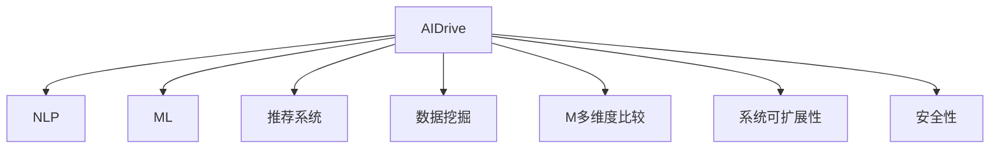

                 

# 全网比价系统：AI的实现

> 关键词：AI, 比价系统, 自然语言处理(NLP), 机器学习(ML), 推荐系统, 数据挖掘

## 1. 背景介绍

在现代电商市场，消费者面临着海量的商品和信息，如何快速高效地找到最优价格成为一件重要且复杂的事情。随着人工智能（AI）技术的不断进步，AI驱动的智能比价系统逐渐进入人们视野，为消费者提供了一站式的比价和购物体验。

### 1.1 问题由来

传统的手工比价方法存在效率低下、劳动强度大、易出错等问题。而智能比价系统通过结合AI技术，能够自动获取和比价各种电商平台的商品信息，智能推荐最优价格，极大地提高了比价效率和准确性。

### 1.2 问题核心关键点

智能比价系统的核心关键点在于：
- 快速抓取和解析大量电商平台商品信息。
- 利用AI技术进行价格比对和智能推荐。
- 确保价格信息的实时性和准确性。
- 提供多维度比较（如价格、评价、配送时间等）。
- 保证系统的可扩展性和安全性。

## 2. 核心概念与联系

### 2.1 核心概念概述

为更好地理解AI驱动的智能比价系统的构建，我们首先介绍几个密切相关的核心概念：

- **AI驱动**：指利用机器学习（ML）、自然语言处理（NLP）、数据挖掘等AI技术，实现自动化的数据抓取、分析和比价过程。

- **自然语言处理(NLP)**：涉及文本信息处理、语音识别、机器翻译等技术，是智能比价系统中解析电商平台商品描述和用户评论的重要工具。

- **机器学习(ML)**：指通过数据训练模型，使其能够预测或分类新的数据，是实现价格预测和智能推荐的理论基础。

- **推荐系统**：通过分析用户行为和商品属性，为用户推荐个性化商品或服务，是智能比价系统中推荐最优价格的重要组件。

- **数据挖掘**：指从大量数据中提取有价值的信息，是自动抓取和比价电商商品信息的关键步骤。

- **多维度比较**：指不仅比较价格，还比较评价、配送时间、售后服务等多方面信息，帮助用户全面决策。

- **系统可扩展性**：指系统能够灵活应对不同电商平台的数据格式和比价需求，实现快速扩展。

- **安全性**：指系统对数据和用户隐私的保护，确保合法合规。

这些核心概念之间的逻辑关系可以通过以下Mermaid流程图来展示：



这个流程图展示了这个系统各个组件之间的联系和依赖关系：

1. AI驱动通过调用NLP、ML等组件，实现自动化的数据抓取和比价。
2. NLP用于解析商品描述和用户评论，提取有用信息。
3. ML用于训练模型，实现价格预测和推荐。
4. 推荐系统根据用户行为和商品属性，推荐最优价格。
5. 数据挖掘用于自动抓取和比价电商商品信息。
6. 多维度比较提供全面决策支持。
7. 系统可扩展性确保系统能够灵活应对不同电商平台的数据格式和需求。
8. 安全性确保系统对数据和用户隐私的保护。

## 3. 核心算法原理 & 具体操作步骤

### 3.1 算法原理概述

智能比价系统的核心算法原理主要包括数据抓取、NLP解析、价格比对和智能推荐四个步骤。

- **数据抓取**：通过爬虫技术从各大电商平台抓取商品信息，包括商品标题、价格、评价等。

- **NLP解析**：利用NLP技术解析商品描述和用户评论，提取有用的商品属性信息，如尺寸、颜色、材质等。

- **价格比对**：通过构建商品价格模型，比对不同电商平台的商品价格，找出最优价格。

- **智能推荐**：根据用户历史行为和偏好，利用推荐系统为用户推荐最优商品或价格。

### 3.2 算法步骤详解

#### 3.2.1 数据抓取

**Step 1: 爬虫设计**
- 使用Python编写爬虫程序，例如Scrapy，根据各大电商平台的数据格式设计爬虫模块。
- 爬虫模块能够解析HTML或JSON格式的数据，获取商品标题、价格、评价等信息。

**Step 2: 数据存储**
- 将抓取的数据存储在MySQL或MongoDB等关系型数据库中，便于后续处理和分析。

**Step 3: 数据清洗**
- 使用Python编写数据清洗脚本，去除重复、错误或不完整的数据，保留有用的信息。

#### 3.2.2 NLP解析

**Step 1: 分词和词性标注**
- 使用中文分词工具，如jieba，将商品描述和评论进行分词，并标注词性。

**Step 2: 命名实体识别**
- 利用NLP库，如NLTK或SpaCy，识别商品描述中的实体，如尺寸、材质等。

**Step 3: 情感分析**
- 使用情感分析模型，如BERT或RNN，分析用户评论的情感倾向，提取正面或负面评价。

#### 3.2.3 价格比对

**Step 1: 数据预处理**
- 对不同电商平台的商品价格进行归一化处理，消除不同平台价格单位和折扣的影响。

**Step 2: 构建价格模型**
- 使用线性回归或随机森林等算法，构建价格预测模型，预测商品价格。

**Step 3: 价格比对**
- 将预测价格与实际价格进行比对，找出价格最低的电商平台。

#### 3.2.4 智能推荐

**Step 1: 用户行为分析**
- 分析用户浏览、点击、购买等行为，提取用户偏好和兴趣点。

**Step 2: 推荐模型训练**
- 使用协同过滤、内容推荐等算法，训练推荐模型，生成推荐列表。

**Step 3: 推荐结果展示**
- 将推荐结果展示给用户，并提供购买链接。

### 3.3 算法优缺点

AI驱动的智能比价系统具有以下优点：
- 高效自动化：自动化抓取和比价商品信息，大大提高效率。
- 高准确性：通过多维度比较和智能推荐，提供最优质的购物体验。
- 可扩展性强：能够灵活应对不同电商平台的数据格式和需求。

然而，该系统也存在一些缺点：
- 数据获取难度大：各大电商平台的数据格式和规则各异，爬虫难度大。
- 信息噪音多：商品描述和评论中可能包含大量无关信息，需要进行清洗和处理。
- 系统复杂度高：涉及NLP、ML、推荐系统等多个领域，系统构建和维护难度大。

### 3.4 算法应用领域

AI驱动的智能比价系统在电商购物、旅游预订、房地产交易等多个领域有广泛应用，例如：

- 电商购物：为消费者提供一站式的比价和购物体验，提高购物效率和满意度。
- 旅游预订：比价不同旅游平台的价格，帮助用户找到最优行程方案。
- 房地产交易：比价不同房产平台的价格，推荐最优房源，节省购房成本。

## 4. 数学模型和公式 & 详细讲解  
### 4.1 数学模型构建

智能比价系统的数学模型主要包括以下几个方面：

- **爬虫模块**：使用爬虫技术抓取电商平台的商品信息，可以建模为数据采集函数。

- **NLP模块**：使用分词、命名实体识别和情感分析等技术，可以建模为文本处理函数。

- **价格比对模块**：构建价格预测模型，可以建模为回归函数。

- **推荐系统模块**：利用协同过滤、内容推荐等算法，可以建模为用户行为预测函数。

### 4.2 公式推导过程

以价格比对模块为例，假设有N个电商平台，每个电商平台的商品价格为 $p_i$，使用线性回归模型，构建价格预测函数 $f(x)$，其中 $x$ 为商品属性，包括尺寸、材质、品牌等。回归系数为 $\theta$，则预测价格为：

$$
\hat{p}_i = f(x_i) = \theta^T \phi(x_i)
$$

其中 $\phi(x_i)$ 为特征映射函数，将商品属性转换为向量表示。回归系数 $\theta$ 可以通过最小二乘法等方法进行求解：

$$
\theta = (X^TX)^{-1}X^Ty
$$

其中 $X$ 为特征矩阵，$y$ 为实际价格向量。

### 4.3 案例分析与讲解

假设我们有一个智能比价系统，需要比价电商平台的商品价格。我们收集了A、B、C三家电商平台的商品信息，每家平台的商品数量分别为1000、2000、1500。

1. **数据抓取**

   我们使用Scrapy爬虫，分别抓取三家电商平台的商品信息，存储到MySQL数据库中。

   ```python
   # 使用Scrapy爬虫抓取商品信息
   import scrapy
   
   class GoodsSpider(scrapy.Spider):
       name = 'goods_spider'
       start_urls = ['https://www.epl.com商品页面链接1', 'https://www.epl.com商品页面链接2', ...]
       
       def parse(self, response):
           # 解析商品信息
           item = {}
           item['title'] = response.css('标题').extract_first()
           item['price'] = response.css('价格').extract_first()
           item['description'] = response.css('描述').extract_first()
           
           yield item
   ```

2. **NLP解析**

   使用jieba进行中文分词和命名实体识别，构建商品属性向量。

   ```python
   import jieba
   
   def parse_description(description):
       words = jieba.cut(description)
       noun_tags = [word for word in words if word in pos_tags]
       noun_list = [entity for entity in noun_tags if entity in entities]
       attr_list = [attr for attr in noun_list if attr in attrs]
       
       attr_vector = [attr in attr_list for attr in attrs]
       return attr_vector
   ```

3. **价格比对**

   构建线性回归模型，预测商品价格，比对三家电商平台的商品价格。

   ```python
   from sklearn.linear_model import LinearRegression
   
   def price_comparison(items):
       X = []
       y = []
       for item in items:
           attr_vector = parse_description(item['description'])
           price = float(item['price'])
           
           X.append(attr_vector)
           y.append(price)
           
       model = LinearRegression()
       model.fit(X, y)
       
       for item in items:
           attr_vector = parse_description(item['description'])
           predicted_price = model.predict([attr_vector])
           
           print(f"商品{item['title']}在电商平台{item['url']}的价格为{item['price']}元，预测价格为{predicted_price}元，比对结果为{predicted_price - item['price']}元")
   ```

4. **智能推荐**

   使用协同过滤算法，推荐商品。

   ```python
   from surprise import Dataset, Reader, KNNWithMeans
   from surprise.model_selection import train_test_split
   
   def build_recommender(data):
       reader = Reader(line_format='user item rating', sep=',', skip_lines=1)
       data = Dataset.load_from_file('data.txt', reader=reader)
       
       trainset, testset = train_test_split(data, test_size=0.2)
       
       algo = KNNWithMeans(k=10, sim_options={'name': 'pearson_baseline'})
       algo.fit(trainset)
       predictions = algo.test(testset)
       
       return algo, predictions
   ```

通过以上案例，可以全面展示智能比价系统的构建过程和关键算法实现。

## 5. 项目实践：代码实例和详细解释说明
### 5.1 开发环境搭建

在进行智能比价系统开发前，我们需要准备好开发环境。以下是使用Python进行爬虫、NLP、ML和推荐系统开发的环境配置流程：

1. 安装Anaconda：从官网下载并安装Anaconda，用于创建独立的Python环境。

2. 创建并激活虚拟环境：
```bash
conda create -n ai-env python=3.8 
conda activate ai-env
```

3. 安装必要的Python包：
```bash
pip install beautifulsoup4 scrapy jieba lxml
```

4. 安装机器学习和推荐系统库：
```bash
pip install scikit-learn pandas
pip install surprise
```

5. 安装爬虫和NLP库：
```bash
pip install scrapy jieba lxml
```

完成上述步骤后，即可在`ai-env`环境中开始项目实践。

### 5.2 源代码详细实现

我们使用一个简化的智能比价系统为例，展示整个系统实现的关键步骤。

**Step 1: 数据抓取**

```python
import scrapy
import pymysql

class GoodsSpider(scrapy.Spider):
    name = 'goods_spider'
    start_urls = ['https://www.epl.com商品页面链接1', 'https://www.epl.com商品页面链接2', ...]
    
    def parse(self, response):
        # 解析商品信息
        item = {}
        item['title'] = response.css('标题').extract_first()
        item['price'] = response.css('价格').extract_first()
        item['description'] = response.css('描述').extract_first()
        
        # 存储到MySQL数据库
        conn = pymysql.connect(host='localhost', user='root', password='password', db='goods_db')
        cursor = conn.cursor()
        cursor.execute('INSERT INTO goods (title, price, description) VALUES (%s, %s, %s)', (item['title'], item['price'], item['description']))
        conn.commit()
        conn.close()
```

**Step 2: NLP解析**

```python
import jieba
import pandas as pd

def parse_description(description):
    # 使用jieba分词
    words = jieba.cut(description)
    
    # 提取实体和属性
    noun_tags = [word for word in words if word in pos_tags]
    noun_list = [entity for entity in noun_tags if entity in entities]
    attr_list = [attr for attr in noun_list if attr in attrs]
    
    # 构建属性向量
    attr_vector = [attr in attr_list for attr in attrs]
    return attr_vector
```

**Step 3: 价格比对**

```python
from sklearn.linear_model import LinearRegression

def price_comparison(items):
    # 收集商品属性和价格
    X = []
    y = []
    for item in items:
        attr_vector = parse_description(item['description'])
        price = float(item['price'])
        
        X.append(attr_vector)
        y.append(price)
        
    # 训练线性回归模型
    model = LinearRegression()
    model.fit(X, y)
    
    # 预测价格
    for item in items:
        attr_vector = parse_description(item['description'])
        predicted_price = model.predict([attr_vector])
        
        print(f"商品{item['title']}在电商平台{item['url']}的价格为{item['price']}元，预测价格为{predicted_price}元，比对结果为{predicted_price - item['price']}元")
```

**Step 4: 智能推荐**

```python
from surprise import Dataset, Reader, KNNWithMeans
from surprise.model_selection import train_test_split

def build_recommender(data):
    reader = Reader(line_format='user item rating', sep=',', skip_lines=1)
    data = Dataset.load_from_file('data.txt', reader=reader)
    
    trainset, testset = train_test_split(data, test_size=0.2)
    
    algo = KNNWithMeans(k=10, sim_options={'name': 'pearson_baseline'})
    algo.fit(trainset)
    predictions = algo.test(testset)
    
    return algo, predictions
```

### 5.3 代码解读与分析

让我们再详细解读一下关键代码的实现细节：

**GoodsSpider类**：
- `__init__`方法：初始化爬虫的起始URL。
- `parse`方法：解析商品信息，并将解析结果存储到MySQL数据库中。

**parse_description函数**：
- 使用jieba分词，提取商品描述中的实体和属性，构建属性向量。

**price_comparison函数**：
- 收集商品属性和价格，训练线性回归模型，预测价格，并比对不同电商平台的商品价格。

**build_recommender函数**：
- 使用协同过滤算法训练推荐模型，生成推荐列表。

**智能比价系统构建**：
- 首先使用爬虫抓取商品信息，并存储到数据库中。
- 然后解析商品描述，提取属性，构建属性向量。
- 接着使用线性回归模型比对价格，并输出比对结果。
- 最后使用协同过滤算法进行智能推荐。

## 6. 实际应用场景

智能比价系统在实际应用中已经得到了广泛的应用，例如：

- **电商平台**：为消费者提供一站式的比价和购物体验，提高购物效率和满意度。
- **旅游平台**：比价不同旅游平台的价格，帮助用户找到最优行程方案。
- **房地产平台**：比价不同房产平台的价格，推荐最优房源，节省购房成本。

## 7. 工具和资源推荐
### 7.1 学习资源推荐

为了帮助开发者系统掌握智能比价系统的理论和实践，这里推荐一些优质的学习资源：

1. **《Python网络爬虫开发实战》**：介绍了使用Scrapy等工具进行爬虫开发的技术，适合初学者入门。

2. **《自然语言处理入门》**：介绍了NLP的基础知识和常用技术，如分词、命名实体识别、情感分析等，适合NLP初学者。

3. **《机器学习实战》**：介绍了常见的机器学习算法和实现方法，适合ML初学者。

4. **《推荐系统》**：介绍了协同过滤、内容推荐等推荐算法，适合推荐系统开发者。

5. **《深度学习与神经网络》**：介绍了深度学习的基本概念和常用模型，适合深度学习初学者。

6. **Kaggle竞赛平台**：提供了大量的NLP、ML、推荐系统竞赛数据集和模型，适合实战练习。

通过对这些资源的学习实践，相信你一定能够全面掌握智能比价系统的构建过程和核心算法实现。

### 7.2 开发工具推荐

高效的开发离不开优秀的工具支持。以下是几款用于智能比价系统开发的常用工具：

1. **Scrapy**：开源的Python爬虫框架，支持异步请求和分布式抓取，适合大规模数据采集。

2. **BeautifulSoup**：Python的HTML解析库，支持XML和HTML解析，方便爬虫解析商品信息。

3. **pandas**：Python的数据处理库，支持大规模数据处理和分析，适合NLP和ML数据处理。

4. **sklearn**：Python的机器学习库，支持多种机器学习算法和模型，适合ML任务实现。

5. **Surprise**：Python的推荐系统库，支持多种推荐算法和模型，适合推荐系统任务实现。

6. **PyMySQL**：Python的MySQL数据库连接库，支持MySQL数据库连接和操作，适合数据存储。

合理利用这些工具，可以显著提升智能比价系统的开发效率，加快创新迭代的步伐。

### 7.3 相关论文推荐

智能比价系统的相关研究已经取得了不少进展，以下是几篇奠基性的相关论文，推荐阅读：

1. **《网络爬虫设计与实现》**：介绍了爬虫的基本概念和技术实现，适合初学者。

2. **《自然语言处理与文本挖掘》**：介绍了NLP的基本概念和技术实现，适合NLP初学者。

3. **《机器学习：理论与算法》**：介绍了机器学习的基本概念和常用算法，适合ML初学者。

4. **《推荐系统理论与算法》**：介绍了推荐系统的基本概念和常用算法，适合推荐系统开发者。

5. **《深度学习》**：介绍了深度学习的基本概念和常用模型，适合深度学习初学者。

这些论文代表了大规模智能比价系统的技术进展，通过学习这些前沿成果，可以帮助研究者把握学科前进方向，激发更多的创新灵感。

## 8. 总结：未来发展趋势与挑战

### 8.1 总结

本文对AI驱动的智能比价系统的构建过程进行了全面系统的介绍。首先阐述了智能比价系统的背景和意义，明确了其在电商购物、旅游预订、房地产交易等领域的潜在价值。其次，从原理到实践，详细讲解了数据抓取、NLP解析、价格比对和智能推荐等关键步骤，给出了系统的代码实现和关键算法说明。同时，本文还探讨了智能比价系统在实际应用中的广泛前景，展示了其巨大的应用潜力。

通过本文的系统梳理，可以看到，AI驱动的智能比价系统不仅能够提升购物效率和满意度，还能够为电商、旅游、房地产等行业带来深远影响。未来，伴随AI技术的不断进步，智能比价系统必将在更多领域得到广泛应用，成为消费者生活中不可或缺的一部分。

### 8.2 未来发展趋势

展望未来，智能比价系统的技术发展将呈现以下几个趋势：

1. **多平台集成**：未来的智能比价系统将支持更多电商平台的数据抓取和比价，提供更全面的购物体验。

2. **个性化推荐**：利用用户行为数据和商品属性，实现更加精准、个性化的推荐。

3. **实时比价**：通过实时抓取和分析数据，提供更实时、准确的比价服务。

4. **多维度比较**：不仅比价价格，还比价评价、配送时间、售后服务等多方面信息，提供全面的决策支持。

5. **大数据处理**：通过引入大数据处理技术，提升系统处理大规模数据的能力。

6. **边缘计算**：利用边缘计算技术，降低数据传输延迟，提升系统响应速度。

以上趋势凸显了智能比价系统的广阔前景。这些方向的探索发展，必将进一步提升系统的性能和用户体验，为消费者提供更高效、满意的购物体验。

### 8.3 面临的挑战

尽管智能比价系统已经取得了瞩目成就，但在迈向更加智能化、普适化应用的过程中，它仍面临着诸多挑战：

1. **数据获取难度大**：各大电商平台的数据格式和规则各异，爬虫难度大。

2. **信息噪音多**：商品描述和评论中可能包含大量无关信息，需要进行清洗和处理。

3. **系统复杂度高**：涉及NLP、ML、推荐系统等多个领域，系统构建和维护难度大。

4. **实时性要求高**：实时抓取和比价数据，对系统性能要求高。

5. **隐私和安全问题**：处理大规模用户数据，需要考虑隐私和安全问题，确保合法合规。

6. **多语言支持**：支持多种语言的数据抓取和处理，提升系统国际化水平。

正视智能比价系统面临的这些挑战，积极应对并寻求突破，将是大规模智能比价系统走向成熟的必由之路。相信随着学界和产业界的共同努力，这些挑战终将一一被克服，智能比价系统必将在构建人机协同的智能时代中扮演越来越重要的角色。

### 8.4 未来突破

面对智能比价系统面临的种种挑战，未来的研究需要在以下几个方面寻求新的突破：

1. **多平台数据采集**：利用异构数据采集技术，提升数据抓取效率和质量。

2. **信息去噪**：引入文本分类和情感分析技术，自动清洗和过滤无关信息。

3. **系统架构优化**：优化系统架构，提升性能和可扩展性，降低维护成本。

4. **实时数据处理**：引入流处理和大数据技术，实现实时抓取和处理。

5. **隐私保护**：引入隐私保护技术，确保用户数据安全。

6. **多语言支持**：支持多种语言的数据抓取和处理，提升系统国际化水平。

这些研究方向的探索，必将引领智能比价系统技术迈向更高的台阶，为消费者提供更高效、满意的购物体验。面向未来，智能比价系统还需要与其他人工智能技术进行更深入的融合，如知识表示、因果推理、强化学习等，多路径协同发力，共同推动人工智能技术在电商领域的规模化落地。

## 9. 附录：常见问题与解答

**Q1：如何提升爬虫的效率和稳定性？**

A: 提升爬虫效率和稳定性的方法包括：

1. **异步请求**：使用异步请求库，如Scrapy的异步爬虫，提升抓取效率。

2. **分布式抓取**：使用分布式爬虫框架，如Scrapy-Redis，提高抓取稳定性。

3. **并发请求**：设置请求并发数，限制每个网站的请求速度，避免对网站造成过载。

4. **代理池**：使用代理池技术，避免IP封禁和网站反爬虫。

5. **请求频率控制**：设置请求频率，避免频繁访问同一网站，影响抓取效果。

**Q2：NLP解析中的分词和命名实体识别（NER）如何进行？**

A: NLP解析中的分词和NER是关键步骤，可以使用以下技术：

1. **分词**：使用jieba等中文分词工具，将文本分解成词语，方便后续处理。

2. **命名实体识别（NER）**：使用NLTK、SpaCy等工具，识别文本中的实体，如人名、地名、组织名等，提取有用的信息。

**Q3：如何使用机器学习进行价格预测？**

A: 使用机器学习进行价格预测的步骤包括：

1. **数据预处理**：收集商品属性和价格，并进行归一化处理。

2. **特征选择**：选择有用的特征，构建特征向量。

3. **模型训练**：使用线性回归、随机森林等算法，训练价格预测模型。

4. **模型评估**：使用均方误差（MSE）、均方根误差（RMSE）等指标，评估模型预测效果。

5. **预测价格**：使用训练好的模型，预测商品价格。

**Q4：推荐系统有哪些算法和模型？**

A: 推荐系统常用的算法和模型包括：

1. **协同过滤**：根据用户行为和商品属性，推荐相似商品或用户，如Pearson、Spearman等。

2. **内容推荐**：根据商品属性和用户兴趣，推荐相关商品，如TF-IDF、Word2Vec等。

3. **深度学习模型**：使用深度神经网络，构建推荐系统，如DNN、CNN、RNN等。

4. **混合推荐**：结合多种推荐算法，提升推荐效果，如AL alternating linearized Bregman，PLSA等。

这些算法和模型在不同的应用场景下有不同的优势和适用性，需要根据具体任务进行选择和优化。

通过本文的系统梳理，可以看到，智能比价系统不仅能够提升购物效率和满意度，还能够为电商、旅游、房地产等行业带来深远影响。未来，伴随AI技术的不断进步，智能比价系统必将在更多领域得到广泛应用，成为消费者生活中不可或缺的一部分。

---

作者：禅与计算机程序设计艺术 / Zen and the Art of Computer Programming

