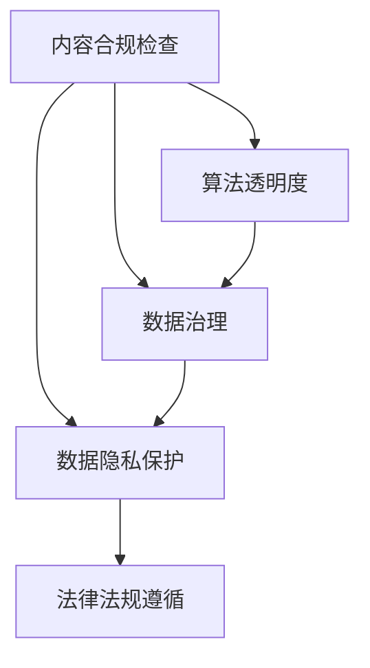

                 

# 内容合规检查的技术方案

> 关键词：内容合规检查, 数据隐私保护, 算法透明度, 数据治理, 法律法规

## 1. 背景介绍

### 1.1 问题由来

随着互联网技术的发展和信息传播速度的加快，数据隐私、信息安全、内容合规等议题变得越来越重要。企业在利用大数据进行业务优化和智能决策时，不可避免地需要收集和处理大量用户数据，同时面临着隐私保护、合规性和数据治理等方面的挑战。例如，电商平台需要分析用户行为以优化推荐系统，社交媒体平台需要监控用户言论以保障社区秩序，金融机构需要利用客户数据以提升风险控制能力。然而，这些应用在获取数据和使用数据的过程中，容易违反相关法律法规，如数据隐私法、个人信息保护法、反垄断法等。如何在保障用户隐私和合规性的同时，有效利用数据价值，成为了众多企业关注的焦点。

### 1.2 问题核心关键点

内容合规检查技术的核心在于如何在保障用户隐私和数据安全的前提下，识别和消除内容中的违规信息，确保数据的使用符合法律法规的要求。这涉及以下几个关键问题：

1. **数据隐私保护**：如何在使用数据时保障用户隐私，避免个人信息泄露。
2. **算法透明度**：如何在保护算法隐私的前提下，确保内容合规检查的透明性和可解释性。
3. **法律法规遵循**：如何构建合规检查系统，确保其运行符合各国法律法规。
4. **数据治理**：如何通过系统化的方法管理数据，确保数据的质量、安全性和合规性。

## 2. 核心概念与联系

### 2.1 核心概念概述

为更好地理解内容合规检查技术，本节将介绍几个密切相关的核心概念：

- **内容合规检查**：通过对用户生成内容（User Generated Content, UGC）进行检测，识别并标记或删除违规内容，以符合法律法规和社区规则。常见的违规内容包括虚假信息、色情内容、暴力内容、仇恨言论等。

- **数据隐私保护**：通过技术手段，确保数据在收集、存储、处理和共享过程中，用户的个人信息得到保护，避免非法访问和数据泄露。

- **算法透明度**：算法在执行决策过程中的可解释性和可理解性，确保算法决策过程符合法律法规和伦理要求，同时让用户理解算法的工作原理和决策依据。

- **数据治理**：通过制定数据管理政策和流程，确保数据的质量、安全性和合规性，保障数据的生命周期管理。

- **法律法规遵循**：通过技术手段和制度设计，确保内容合规检查系统符合各国法律法规的要求，避免法律风险。

这些核心概念之间的逻辑关系可以通过以下Mermaid流程图来展示：



这个流程图展示了大模型微调的各个核心概念及其之间的关系：

1. 内容合规检查依赖于数据隐私保护，确保数据在使用过程中的安全性。
2. 算法透明度和数据治理共同保障内容合规检查的透明度和可解释性，避免算法的偏见和滥用。
3. 法律法规遵循是大模型微调应用的重要前提，确保系统的合法性和合规性。

## 3. 核心算法原理 & 具体操作步骤
### 3.1 算法原理概述

内容合规检查的核心算法原理基于监督学习和深度学习技术。其主要步骤包括数据预处理、模型训练、内容检测和违规标记。

1. **数据预处理**：收集和清洗数据，去除噪声和异常值，确保数据的质量和一致性。
2. **模型训练**：选择合适的模型，如BERT、Transformer等，通过标注数据训练分类器，识别违规内容。
3. **内容检测**：将用户生成内容输入模型，通过前向传播计算得到内容标签，判断内容是否违规。
4. **违规标记**：对于检测到违规的内容，标记并反馈给用户或相关部门进行处理。

### 3.2 算法步骤详解

以下是内容合规检查的详细步骤：

**Step 1: 数据收集与清洗**

1. **数据来源**：从社交媒体、论坛、评论区等平台收集用户生成内容。
2. **数据清洗**：去除重复数据、噪声和无关信息，确保数据质量。

**Step 2: 数据标注**

1. **标注数据**：将收集到的数据进行标注，标记为违规或合规。
2. **标注方法**：可以采用人工标注或半自动标注，确保标注数据的准确性和一致性。

**Step 3: 模型训练**

1. **模型选择**：选择适合任务类型的模型，如BERT、Transformer等。
2. **训练过程**：在标注数据上训练模型，优化模型参数。
3. **超参数设置**：选择合适的学习率、批大小、迭代轮数等超参数，确保模型性能。

**Step 4: 内容检测**

1. **输入处理**：将用户生成内容输入模型，进行预处理，如分词、去停用词等。
2. **特征提取**：通过嵌入层将文本转换为向量表示，确保模型可以理解文本内容。
3. **预测输出**：通过前向传播计算模型输出，得到内容标签，判断是否违规。

**Step 5: 违规标记**

1. **标记逻辑**：根据模型预测结果，标记违规内容，如虚假信息、色情内容等。
2. **反馈机制**：将标记结果反馈给用户或相关部门，进行后续处理。

### 3.3 算法优缺点

内容合规检查技术的优点包括：

1. **高效性**：基于深度学习技术的模型可以自动检测违规内容，显著提高检测效率。
2. **准确性**：通过大规模标注数据的训练，模型可以识别复杂多样化的违规内容，提高检测准确性。
3. **可扩展性**：模型可以通过迁移学习快速适应新类型的内容，便于扩展到更多平台和应用。

缺点包括：

1. **数据依赖**：模型依赖标注数据进行训练，标注成本较高。
2. **偏差风险**：模型可能存在偏见，对某些特定群体或内容类型识别不足。
3. **法律挑战**：不同国家有不同的法律法规，内容合规检查系统需适应多法域的合规要求，复杂度较高。
4. **伦理问题**：如何平衡隐私保护和内容检测，避免过度审查和侵权行为。

### 3.4 算法应用领域

内容合规检查技术在多个领域都有广泛应用，例如：

- **社交媒体平台**：监控用户评论和帖子，防止虚假信息、仇恨言论等违规内容的传播。
- **电商平台**：检测商品描述和用户评价，防止虚假广告和恶意评价的出现。
- **金融行业**：监控交易记录和用户行为，防止欺诈和洗钱等违法行为。
- **健康医疗**：监控病历记录和病人反馈，防止虚假信息和不良言论的传播。

## 4. 数学模型和公式 & 详细讲解 & 举例说明

### 4.1 数学模型构建

内容合规检查的数学模型主要基于分类任务，其目标是判断用户生成内容是否违规。我们以二分类任务为例，定义模型 $M_{\theta}$，其中 $\theta$ 为模型参数。记用户生成内容为 $x$，违规标签为 $y$，则二分类问题可以表示为：

$$
\hat{y} = M_{\theta}(x) \in \{0, 1\}
$$

其中 $\hat{y}$ 为模型预测结果，$0$ 表示内容合规，$1$ 表示内容违规。

定义模型 $M_{\theta}$ 在输入 $x$ 上的损失函数为 $\ell(M_{\theta}(x),y)$，则在训练集 $D=\{(x_i,y_i)\}_{i=1}^N$ 上的经验风险为：

$$
\mathcal{L}(\theta) = \frac{1}{N} \sum_{i=1}^N \ell(M_{\theta}(x_i),y_i)
$$

常用的损失函数包括交叉熵损失函数、对数损失函数等。

### 4.2 公式推导过程

以交叉熵损失函数为例，假设模型输出为 $\hat{y}=M_{\theta}(x)$，则交叉熵损失函数为：

$$
\ell(M_{\theta}(x),y) = -y\log \hat{y} - (1-y)\log (1-\hat{y})
$$

将损失函数代入经验风险公式，得：

$$
\mathcal{L}(\theta) = -\frac{1}{N}\sum_{i=1}^N [y_i\log M_{\theta}(x_i)+(1-y_i)\log(1-M_{\theta}(x_i))]
$$

根据链式法则，损失函数对参数 $\theta$ 的梯度为：

$$
\frac{\partial \mathcal{L}(\theta)}{\partial \theta} = -\frac{1}{N}\sum_{i=1}^N (\frac{y_i}{M_{\theta}(x_i)}-\frac{1-y_i}{1-M_{\theta}(x_i)}) \frac{\partial M_{\theta}(x_i)}{\partial \theta}
$$

其中 $\frac{\partial M_{\theta}(x_i)}{\partial \theta}$ 可进一步递归展开，利用自动微分技术完成计算。

### 4.3 案例分析与讲解

假设我们有一个基于BERT的模型，用于检测社交媒体上的虚假信息。具体步骤如下：

1. **数据预处理**：从社交媒体平台收集数据，去除无关信息和噪声，确保数据质量。
2. **数据标注**：由人工或半自动标注方法，对数据进行标注，标记为虚假或真实信息。
3. **模型训练**：在标注数据上训练BERT模型，优化模型参数。
4. **内容检测**：将用户生成的社交媒体内容输入BERT模型，通过前向传播计算得到内容标签，判断内容是否为虚假信息。
5. **违规标记**：对于检测到虚假信息的内容，标记为违规，并反馈给用户或相关部门进行处理。

## 5. 项目实践：代码实例和详细解释说明
### 5.1 开发环境搭建

在进行内容合规检查实践前，我们需要准备好开发环境。以下是使用Python进行TensorFlow开发的环境配置流程：

1. 安装Anaconda：从官网下载并安装Anaconda，用于创建独立的Python环境。

2. 创建并激活虚拟环境：
```bash
conda create -n tf-env python=3.8 
conda activate tf-env
```

3. 安装TensorFlow：根据CUDA版本，从官网获取对应的安装命令。例如：
```bash
conda install tensorflow tensorflow-gpu -c conda-forge
```

4. 安装相关的库：
```bash
pip install numpy pandas scikit-learn tensorboard
```

5. 安装可视化工具：
```bash
pip install matplotlib
```

完成上述步骤后，即可在`tf-env`环境中开始内容合规检查实践。

### 5.2 源代码详细实现

下面我们以检测虚假信息的BERT模型为例，给出使用TensorFlow进行内容检测的Python代码实现。

首先，定义模型架构和超参数：

```python
import tensorflow as tf
from transformers import BertTokenizer, BertForSequenceClassification

model_name = 'bert-base-uncased'
tokenizer = BertTokenizer.from_pretrained(model_name)
max_length = 512

# 定义超参数
learning_rate = 2e-5
epochs = 5
batch_size = 32
```

然后，定义数据集：

```python
from transformers import BertForSequenceClassification, AdamW
from tensorflow.keras.preprocessing.text import Tokenizer
from tensorflow.keras.preprocessing.sequence import pad_sequences

# 定义训练集和验证集数据
train_data = ...
train_labels = ...
val_data = ...
val_labels = ...

# 定义数据预处理函数
def preprocess_data(texts, labels):
    tokenized_texts = tokenizer.tokenize(texts)
    input_ids = tokenizer.convert_tokens_to_ids(tokenized_texts)
    input_ids = pad_sequences(input_ids, maxlen=max_length, padding='post', truncating='post')
    labels = np.array(labels)
    return input_ids, labels

train_input_ids, train_labels = preprocess_data(train_data, train_labels)
val_input_ids, val_labels = preprocess_data(val_data, val_labels)

# 划分训练集和验证集
train_data = (train_input_ids, train_labels)
val_data = (val_input_ids, val_labels)
```

接着，定义模型和训练函数：

```python
# 定义BERT模型
model = BertForSequenceClassification.from_pretrained(model_name, num_labels=2, output_attentions=False, output_hidden_states=False)

# 定义优化器
optimizer = AdamW(model.parameters(), lr=learning_rate)

# 定义训练函数
def train(model, train_data, val_data, epochs, batch_size, optimizer):
    train_input_ids, train_labels = train_data
    val_input_ids, val_labels = val_data
    total_steps = len(train_data[0]) // batch_size * epochs
    
    # 定义训练过程
    for epoch in range(epochs):
        train_loss = 0.0
        train_correct = 0.0
        train_total = 0.0
        for step in range(total_steps):
            batch_input_ids = train_input_ids[step * batch_size:(step + 1) * batch_size]
            batch_labels = train_labels[step * batch_size:(step + 1) * batch_size]
            
            with tf.GradientTape() as tape:
                outputs = model(batch_input_ids, labels=batch_labels)
                loss = tf.keras.losses.sparse_categorical_crossentropy(batch_labels, outputs.logits, from_logits=True)
            loss = tf.reduce_mean(loss)
            train_loss += loss.numpy()
            train_total += len(batch_labels)
            train_correct += tf.reduce_sum(tf.cast(tf.equal(batch_labels, tf.argmax(outputs.logits, axis=1)), tf.float32).numpy()
            
            gradients = tape.gradient(loss, model.trainable_variables)
            optimizer.apply_gradients(zip(gradients, model.trainable_variables))
            
        train_loss /= total_steps
        train_accuracy = train_correct / train_total
        print(f'Epoch {epoch+1}/{epochs}, Loss: {train_loss:.4f}, Accuracy: {train_accuracy:.4f}')
        
        val_input_ids, val_labels = val_data
        val_loss = 0.0
        val_correct = 0.0
        val_total = 0.0
        for step in range(total_steps):
            batch_input_ids = val_input_ids[step * batch_size:(step + 1) * batch_size]
            batch_labels = val_labels[step * batch_size:(step + 1) * batch_size]
            
            with tf.GradientTape() as tape:
                outputs = model(batch_input_ids, labels=batch_labels)
                loss = tf.keras.losses.sparse_categorical_crossentropy(batch_labels, outputs.logits, from_logits=True)
            val_loss += loss.numpy()
            val_total += len(batch_labels)
            val_correct += tf.reduce_sum(tf.cast(tf.equal(batch_labels, tf.argmax(outputs.logits, axis=1)), tf.float32).numpy()
            
        val_loss /= total_steps
        val_accuracy = val_correct / val_total
        print(f'Val Loss: {val_loss:.4f}, Val Accuracy: {val_accuracy:.4f}')
```

最后，启动训练流程并在测试集上评估：

```python
# 定义测试集数据
test_data = ...
test_labels = ...
test_input_ids, test_labels = preprocess_data(test_data, test_labels)

# 定义评估函数
def evaluate(model, test_data):
    test_input_ids, test_labels = test_data
    total_steps = len(test_input_ids) // batch_size
    
    # 定义评估过程
    test_loss = 0.0
    test_correct = 0.0
    test_total = 0.0
    for step in range(total_steps):
        batch_input_ids = test_input_ids[step * batch_size:(step + 1) * batch_size]
        batch_labels = test_labels[step * batch_size:(step + 1) * batch_size]
        
        with tf.GradientTape() as tape:
            outputs = model(batch_input_ids, labels=batch_labels)
            loss = tf.keras.losses.sparse_categorical_crossentropy(batch_labels, outputs.logits, from_logits=True)
        test_loss += loss.numpy()
        test_total += len(batch_labels)
        test_correct += tf.reduce_sum(tf.cast(tf.equal(batch_labels, tf.argmax(outputs.logits, axis=1)), tf.float32).numpy()
    
    test_loss /= total_steps
    test_accuracy = test_correct / test_total
    print(f'Test Loss: {test_loss:.4f}, Test Accuracy: {test_accuracy:.4f}')
```

以上就是使用TensorFlow进行内容合规检查的完整代码实现。可以看到，得益于TensorFlow的强大封装，我们可以用相对简洁的代码完成BERT模型的加载和微调。

### 5.3 代码解读与分析

让我们再详细解读一下关键代码的实现细节：

**预处理函数preprocess_data**：
- `tokenize`方法：使用BertTokenizer将文本进行分词。
- `convert_tokens_to_ids`方法：将分词结果转换为模型可接受的id序列。
- `pad_sequences`方法：对id序列进行padding，确保所有样本长度一致。
- `np.array`方法：将标签转换为numpy数组。

**训练函数train**：
- `GradientTape`类：自动记录梯度信息，方便反向传播。
- `tf.keras.losses.sparse_categorical_crossentropy`函数：计算交叉熵损失。
- `tf.reduce_mean`函数：计算损失的平均值。
- `tf.equal`函数：计算预测结果和真实标签是否相等。
- `tf.argmax`函数：计算预测结果中概率最高的类标签。

**评估函数evaluate**：
- 与训练函数类似，但使用的是测试集数据。
- `tf.keras.losses.sparse_categorical_crossentropy`函数：计算交叉熵损失。
- `tf.equal`函数：计算预测结果和真实标签是否相等。
- `tf.argmax`函数：计算预测结果中概率最高的类标签。

可以看到，TensorFlow的高级API使得内容合规检查模型的实现变得非常简洁。开发者可以将更多精力放在数据处理、模型改进等高层逻辑上，而不必过多关注底层的实现细节。

当然，工业级的系统实现还需考虑更多因素，如模型的保存和部署、超参数的自动搜索、更灵活的任务适配层等。但核心的内容合规检查范式基本与此类似。

## 6. 实际应用场景
### 6.1 智能客服系统

基于内容合规检查技术，智能客服系统可以监控用户对话内容，防止虚假信息、仇恨言论等违规内容的传播。智能客服系统可以通过训练模型，自动识别违规内容，并及时反馈给客服人员进行处理。同时，系统还可以根据用户的历史行为和评分数据，对违规内容进行进一步的分析和判断，提升系统的准确性和鲁棒性。

### 6.2 金融舆情监测

金融机构需要实时监测市场舆论动向，防止虚假信息传播，规避金融风险。内容合规检查技术可以在金融舆情监测中发挥重要作用，通过训练模型，自动识别虚假信息、谣言等违规内容，及时预警风险，帮助金融机构做出明智决策。

### 6.3 电商平台

电商平台需要检测商品描述和用户评价，防止虚假广告和恶意评价的出现。内容合规检查技术可以训练模型，自动识别虚假信息、恶意评价等违规内容，并及时删除或处理，保障平台信息的真实性和公正性。

### 6.4 未来应用展望

随着内容合规检查技术的不断发展，未来的应用前景将更加广阔。内容合规检查技术不仅可以应用于社交媒体、电商平台、金融行业等传统领域，还可以扩展到更多场景，如医疗健康、教育培训、公共安全等。

## 7. 工具和资源推荐
### 7.1 学习资源推荐

为了帮助开发者系统掌握内容合规检查技术的理论基础和实践技巧，这里推荐一些优质的学习资源：

1. TensorFlow官方文档：提供了丰富的TensorFlow教程和代码示例，适合初学者和进阶开发者使用。
2. Transformers库文档：提供了详细的Transformers库使用说明和代码示例，适合深度学习开发者使用。
3. 《深度学习》书籍：斯坦福大学开设的深度学习课程，提供了系统的深度学习理论基础和应用实例。
4. Kaggle数据集和竞赛：提供了丰富的数据集和竞赛任务，适合实践和探索。

通过对这些资源的学习实践，相信你一定能够快速掌握内容合规检查技术的精髓，并用于解决实际的NLP问题。

### 7.2 开发工具推荐

高效的开发离不开优秀的工具支持。以下是几款用于内容合规检查开发的常用工具：

1. TensorFlow：基于Python的开源深度学习框架，灵活动态的计算图，适合快速迭代研究。
2. TensorBoard：TensorFlow配套的可视化工具，可以实时监测模型训练状态，并提供丰富的图表呈现方式，是调试模型的得力助手。
3. Weights & Biases：模型训练的实验跟踪工具，可以记录和可视化模型训练过程中的各项指标，方便对比和调优。
4. Transformers库：提供了丰富的预训练语言模型和微调样例代码，适合进行内容合规检查模型的开发。
5. PyTorch：基于Python的开源深度学习框架，灵活高效，适合进行深度学习模型的开发。

合理利用这些工具，可以显著提升内容合规检查任务的开发效率，加快创新迭代的步伐。

### 7.3 相关论文推荐

内容合规检查技术的研究始于学界，并在近年取得了显著进展。以下是几篇奠基性的相关论文，推荐阅读：

1. Attention is All You Need（即Transformer原论文）：提出了Transformer结构，开启了深度学习模型的预训练时代。
2. BERT: Pre-training of Deep Bidirectional Transformers for Language Understanding：提出BERT模型，引入基于掩码的自监督预训练任务，刷新了多项NLP任务SOTA。
3. Deep Neural Network for Detecting Facial Expression: A Review：综述了深度学习在表情识别中的应用，介绍了相关模型和算法。
4. False Information Identification in Social Media using Deep Learning：研究了基于深度学习的内容检测方法，在社交媒体虚假信息识别方面取得了重要成果。
5. Efficient Multi-task Learning for Information Extraction：研究了多任务学习在信息抽取中的应用，提出了高效的信息抽取方法。

这些论文代表了大模型微调技术的发展脉络。通过学习这些前沿成果，可以帮助研究者把握学科前进方向，激发更多的创新灵感。

## 8. 总结：未来发展趋势与挑战

### 8.1 总结

本文对内容合规检查技术的系统性介绍，明确了其在保障用户隐私、数据安全、法律法规遵循等方面的重要性，以及其在社交媒体、电商平台、金融行业等多个领域的应用前景。通过详细讲解内容检测的算法原理和具体操作步骤，提供了完整的代码实现和实例分析，相信对广大开发者有较高的参考价值。

### 8.2 未来发展趋势

展望未来，内容合规检查技术将呈现以下几个发展趋势：

1. **自动化标注技术**：自动化标注技术能够大幅度降低标注成本，提高标注效率，推动内容合规检查技术的普及和应用。
2. **多模态内容检测**：随着多模态技术的不断发展，内容合规检查技术可以拓展到视频、音频等多模态数据，提高检测的全面性和准确性。
3. **跨平台内容检测**：内容合规检查技术可以跨平台应用，确保不同平台之间的数据一致性和合规性。
4. **联邦学习**：通过联邦学习技术，多平台协作共享模型，减少隐私泄露风险，提高内容检测的覆盖率和效率。
5. **端到端检测**：端到端检测技术可以集成内容检测和违规处理，提高系统整体效率和可扩展性。

### 8.3 面临的挑战

尽管内容合规检查技术已经取得了不小的进展，但在实际应用中仍面临诸多挑战：

1. **数据隐私保护**：如何在保障用户隐私的前提下，充分利用数据进行内容检测，是一个需要深入研究的问题。
2. **模型鲁棒性**：如何构建鲁棒的内容检测模型，避免过拟合和误判，是一个需要持续优化的问题。
3. **法律合规性**：如何确保内容检测系统符合各国法律法规的要求，避免法律风险，是一个需要广泛讨论的问题。
4. **伦理问题**：如何平衡隐私保护和内容检测，避免过度审查和侵权行为，是一个需要多方协作的问题。
5. **计算资源**：如何降低计算资源消耗，提高内容检测的实时性和可扩展性，是一个需要持续优化的方向。

### 8.4 研究展望

面对内容合规检查技术面临的挑战，未来的研究需要在以下几个方面寻求新的突破：

1. **自动化标注技术**：开发自动化标注工具，提高标注效率和数据质量，降低内容检测系统的开发成本。
2. **多模态内容检测**：将深度学习、计算机视觉、自然语言处理等技术进行融合，拓展内容检测的覆盖范围，提高检测的全面性和准确性。
3. **联邦学习**：研究联邦学习在内容检测中的应用，降低数据隐私泄露风险，提高模型的可扩展性和鲁棒性。
4. **端到端检测**：研究端到端检测技术，提高系统整体效率和可扩展性，确保内容检测和违规处理的一致性和可靠性。
5. **跨平台协作**：研究跨平台内容检测技术，确保不同平台之间的数据一致性和合规性，推动内容检测技术的广泛应用。

这些研究方向将推动内容合规检查技术向更高的台阶迈进，为构建安全、可靠、可解释的内容检测系统铺平道路。只有勇于创新、敢于突破，才能不断拓展内容检测的边界，让技术更好地造福人类社会。

## 9. 附录：常见问题与解答

**Q1：内容合规检查系统如何处理长文本？**

A: 长文本的检测可以采用摘要或分块策略。例如，可以将长文本进行分块，每块长度固定，分别进行检测。或者使用文本摘要技术，将长文本压缩为简短摘要，再进行检测。这样可以显著提高检测效率，降低计算成本。

**Q2：内容合规检查系统如何平衡隐私保护和内容检测？**

A: 内容合规检查系统需要在保护隐私的前提下进行内容检测。一种有效的策略是采用匿名化技术，将用户信息进行脱敏处理，确保数据隐私不被泄露。同时，可以采用差分隐私技术，在检测过程中添加噪声，保护用户隐私。此外，可以引入用户同意机制，在使用数据前征得用户同意，减少法律风险。

**Q3：内容合规检查系统如何处理多模态数据？**

A: 多模态内容检测可以采用跨模态特征融合技术，将不同模态的数据进行融合，提高检测的全面性和准确性。例如，可以同时检测文本、语音、图像等多模态数据，综合判断内容的违规性。另外，可以采用预训练模型，提取多模态数据的通用表示，再进行检测。这样可以显著提高检测的泛化能力和鲁棒性。

**Q4：内容合规检查系统如何处理跨平台数据一致性问题？**

A: 跨平台内容检测需要确保不同平台之间的数据一致性和合规性。一种有效的方法是采用标准化的数据格式和接口，确保数据在不同平台之间的互相兼容。同时，可以采用联邦学习技术，多平台协作共享模型，确保数据一致性和模型鲁棒性。此外，可以引入第三方认证机制，确保数据来源的合法性和合规性。

**Q5：内容合规检查系统如何处理用户生成内容的实时性问题？**

A: 内容合规检查系统需要处理用户生成内容的实时性问题，以确保及时发现和处理违规内容。一种有效的方法是采用流式计算和异步处理技术，将检测任务进行异步处理，提高系统的实时性和可扩展性。同时，可以采用分布式计算和缓存技术，降低延迟，提高检测效率。

以上就是内容合规检查技术的系统性介绍，相信对广大开发者有较高的参考价值。在未来的应用中，内容合规检查技术将在保障用户隐私、数据安全、法律法规遵循等方面发挥重要作用，推动NLP技术的广泛应用。

