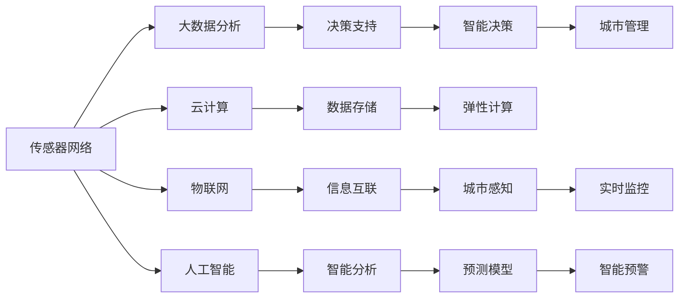
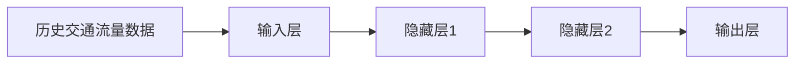
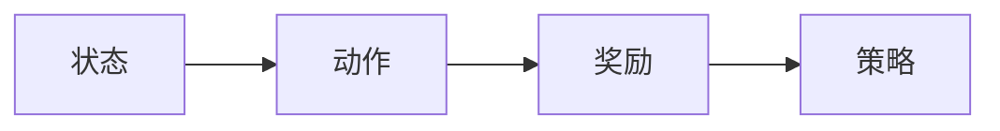
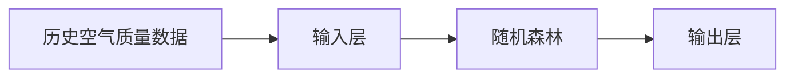
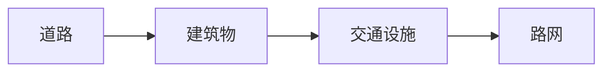

                 

## 1. 背景介绍

随着城市化进程的不断推进，智慧城市建设已成为全球各国的重要战略。智慧城市旨在通过信息技术和大数据，实现城市管理的精细化、智能化，提升城市公共服务的效率和质量，构建可持续发展的未来城市。在此背景下，利用先进技术手段创新智慧城市解决方案，成为了众多城市智能化转型的关键方向。本文将从智慧城市的核心技术架构出发，探讨如何利用技术优势进行智慧城市解决方案的创新。

## 2. 核心概念与联系

### 2.1 核心概念概述

智慧城市是一个多维度、多层次的复杂系统，涉及传感器网络、大数据分析、云计算、物联网(IoT)、人工智能(AI)等多个关键技术领域。为了更好地理解智慧城市的构成和运作机制，我们先介绍几个关键概念：

- 传感器网络：由大量的传感器构成，用于实时监测城市的各种状态数据，如环境质量、交通流量、能源消耗等。
- 大数据分析：通过先进的数据分析技术，从海量传感器数据中提取有价值的信息，为城市管理决策提供支持。
- 云计算：将城市运行所需的各类计算资源通过云平台集中管理，提供弹性计算能力和分布式存储。
- 物联网(IoT)：将城市的各类设备和设施接入网络，实现信息互联互通。
- 人工智能(AI)：利用机器学习、深度学习等技术，对城市运行数据进行智能分析和预测，提升城市运行效率和决策质量。

智慧城市的各个组成部分相互依赖、相互支撑，共同构建了一个高度智能化的城市运行生态。

### 2.2 核心概念原理和架构的 Mermaid 流程图



这个图表展示了智慧城市中各项技术之间的相互联系和作用机制。传感器网络采集的实时数据，通过物联网接入云计算平台进行存储和计算，再通过大数据分析和人工智能技术进行智能分析和预测，为城市管理提供决策支持。

## 3. 核心算法原理 & 具体操作步骤

### 3.1 算法原理概述

智慧城市的建设需要综合利用多种先进技术，而算法是其中的关键。本文重点介绍基于人工智能(AI)技术的智慧城市解决方案，具体包括以下几个核心算法：

- 深度学习(Deep Learning)：用于城市运行数据的智能分析和预测。
- 强化学习(Reinforcement Learning)：用于城市交通流量优化和智能调度。
- 机器学习(Machine Learning)：用于城市环境监控和污染预测。
- 知识图谱(Knowledge Graph)：用于城市各类信息的知识整合和推理。

这些算法通过协同工作，实现城市数据的全面感知、智能分析和高效决策，提升城市管理的智能化水平。

### 3.2 算法步骤详解

智慧城市解决方案的构建，一般遵循以下步骤：

1. **数据采集与处理**：通过传感器网络、摄像头、交通信号灯等设备，实时采集城市运行数据。对采集数据进行清洗、去重和标准化处理，确保数据的准确性和完整性。

2. **数据存储与计算**：利用云计算平台集中存储和管理城市运行数据，提供弹性计算能力，支持大规模数据处理和分析。

3. **数据可视化与分析**：通过数据可视化技术，将城市运行数据直观展示出来，帮助城市管理者直观了解城市运行状态。利用大数据分析技术，挖掘数据中的有价值信息，为城市管理决策提供支持。

4. **智能分析与预测**：利用深度学习、强化学习等算法，对城市运行数据进行智能分析和预测。如预测交通流量、识别违法行为、监控环境污染等。

5. **智能决策与执行**：将智能分析结果与城市管理需求相结合，生成智能决策，并自动执行。如自动调整交通信号灯、优化能源消耗、调节水资源分配等。

6. **用户交互与反馈**：利用物联网和人工智能技术，实现与市民的实时交互和反馈。如智能公交系统、智能垃圾回收、智慧医疗等。

### 3.3 算法优缺点

智慧城市解决方案的算法设计，需要兼顾效率、准确性和可扩展性。以下是主要算法的优缺点分析：

- **深度学习**：优点在于能够处理复杂的非线性问题，具有较高的准确性。缺点在于需要大量标注数据和计算资源，模型训练复杂。

- **强化学习**：优点在于能够动态调整策略，适应实时变化的环境。缺点在于需要大量试验和优化，才能找到最优策略。

- **机器学习**：优点在于可解释性强，模型简单易用。缺点在于处理非线性问题能力有限，需要大量特征工程。

- **知识图谱**：优点在于能够实现信息整合和推理，提升城市管理的系统性和逻辑性。缺点在于构建和维护成本较高。

### 3.4 算法应用领域

智慧城市解决方案的算法，可以应用于多个具体领域，提升城市管理的各个方面。例如：

- **智慧交通**：利用深度学习和强化学习算法，优化交通流量控制，减少交通拥堵，提升出行效率。
- **智慧环保**：通过机器学习和数据分析，监测城市环境污染，预测污染趋势，制定环保措施。
- **智慧医疗**：利用知识图谱和深度学习技术，构建城市健康信息系统，提供精准的医疗服务。
- **智慧能源**：结合机器学习和物联网技术，优化能源消耗，实现智能电网管理。
- **智慧安防**：利用深度学习和强化学习算法，识别违法行为，保障城市安全。

## 4. 数学模型和公式 & 详细讲解 & 举例说明

### 4.1 数学模型构建

本节将详细介绍智慧城市解决方案中常用的数学模型，包括深度学习模型、强化学习模型、机器学习模型和知识图谱模型。

#### 4.1.1 深度学习模型

深度学习模型主要用于处理城市运行数据中的非线性问题。以城市交通流量预测为例，我们可以使用循环神经网络(RNN)或卷积神经网络(CNN)进行建模。

模型输入为历史交通流量数据，输出为预测的下一个时间步的交通流量。模型结构如图：



其中，隐藏层1和隐藏层2用于提取数据特征，输出层用于生成预测结果。

#### 4.1.2 强化学习模型

强化学习模型主要用于交通流量优化和智能调度。以智能交通信号灯为例，我们可以使用Q-learning算法进行建模。

模型由状态(state)、动作(action)、奖励(reward)和策略(policy)组成。状态表示当前交通灯的状态，动作表示信号灯的绿灯或红灯，奖励表示当前的交通流量，策略表示信号灯的控制策略。模型结构如图：



其中，策略通过Q值函数表示，Q值函数用于估计在当前状态下采取不同动作的奖励期望值。

#### 4.1.3 机器学习模型

机器学习模型主要用于城市环境监控和污染预测。以空气质量预测为例，我们可以使用随机森林算法进行建模。

模型输入为历史空气质量数据和气象数据，输出为预测的下一时刻空气质量。模型结构如图：



其中，随机森林算法通过集成多个决策树，提升模型的准确性和鲁棒性。

#### 4.1.4 知识图谱模型

知识图谱模型主要用于信息整合和推理。以城市智慧地图为例，我们可以使用基于RDF的知识图谱进行建模。

模型由节点(node)和边(edge)组成，节点表示城市中的各类信息，如道路、建筑物、交通设施等，边表示节点之间的关系。模型结构如图：



其中，节点通过实体和属性进行描述，边表示实体之间的关系，如道路连接建筑物、建筑物毗邻交通设施等。

### 4.2 公式推导过程

接下来，我们将对上述模型的核心公式进行推导。

#### 4.2.1 深度学习模型

以城市交通流量预测为例，假设模型结构为：


模型的输入为历史交通流量数据 $x$，输出为预测的交通流量 $y$。假设隐藏层1和隐藏层2的激活函数为ReLU，输出层使用线性激活函数，则模型的前向传播过程为：

$$
h_1 = ReLU(W_1x + b_1)
$$
$$
h_2 = ReLU(W_2h_1 + b_2)
$$
$$
y = W_3h_2 + b_3
$$

其中，$W_i$ 为权重矩阵，$b_i$ 为偏置向量。

#### 4.2.2 强化学习模型

以智能交通信号灯为例，假设状态为 $s$，动作为 $a$，奖励为 $r$，策略为 $p$，则Q值函数 $Q(s,a)$ 可以表示为：

$$
Q(s,a) = r + \gamma \max_{a'} Q(s',a')
$$

其中，$\gamma$ 为折扣因子，表示未来奖励的权重。模型通过不断更新Q值函数，学习最优策略 $p$，以最大化长期奖励。

#### 4.2.3 机器学习模型

以空气质量预测为例，假设模型结构为：


模型的输入为历史空气质量数据 $x$，输出为预测的空气质量 $y$。假设随机森林算法中包含 $M$ 个决策树，则模型的预测结果为：

$$
y = \frac{1}{M}\sum_{i=1}^M y_i
$$

其中，$y_i$ 为第 $i$ 棵决策树的预测结果。

#### 4.2.4 知识图谱模型

以城市智慧地图为例，假设知识图谱由节点 $n$ 和边 $e$ 组成，则模型的推理过程为：

$$
y = \text{SPARQL查询}(e,n)
$$

其中，$SPARQL查询$ 用于从知识图谱中查询节点之间的逻辑关系，得到最终的推理结果。

### 4.3 案例分析与讲解

下面我们以智慧交通为例，详细分析深度学习和强化学习算法在其中的应用。

#### 4.3.1 深度学习在智慧交通中的应用

城市交通流量预测是智慧交通中重要的应用场景。利用深度学习模型，可以从历史交通数据中学习交通流动的规律，对未来交通流量进行预测。具体流程如下：

1. **数据采集**：通过交通信号灯、摄像头等设备采集历史交通流量数据。
2. **数据预处理**：对采集数据进行清洗、去重和标准化处理。
3. **模型训练**：使用循环神经网络或卷积神经网络对数据进行建模，训练模型参数。
4. **模型评估**：在验证集上评估模型性能，调整模型超参数。
5. **模型应用**：将训练好的模型应用于实时交通流量预测，优化交通信号灯控制。

#### 4.3.2 强化学习在智慧交通中的应用

智能交通信号灯控制是智慧交通中的另一重要应用场景。利用强化学习模型，可以实现动态调整交通信号灯的控制策略，优化交通流量。具体流程如下：

1. **环境建模**：将交通信号灯的状态、交通流量、车辆位置等建模为状态变量。
2. **策略定义**：定义交通信号灯的控制策略，如绿灯时间长短、红绿灯切换次数等。
3. **模型训练**：使用Q-learning算法对模型进行训练，优化控制策略。
4. **模型评估**：在模拟交通环境中评估模型性能，调整策略参数。
5. **模型应用**：将训练好的模型应用于实际交通信号灯控制，优化交通流量。

## 5. 项目实践：代码实例和详细解释说明

### 5.1 开发环境搭建

在进行智慧城市解决方案的开发前，我们需要准备好开发环境。以下是使用Python进行开发的环境配置流程：

1. 安装Anaconda：从官网下载并安装Anaconda，用于创建独立的Python环境。

2. 创建并激活虚拟环境：
```bash
conda create -n city-env python=3.8 
conda activate city-env
```

3. 安装Python依赖库：
```bash
pip install numpy pandas scikit-learn tensorflow pytorch transformers
```

4. 安装深度学习框架：
```bash
pip install tensorflow-gpu==2.4.1
```

5. 安装云平台API接口库：
```bash
pip install boto3
```

完成上述步骤后，即可在`city-env`环境中开始开发。

### 5.2 源代码详细实现

下面我们以智慧交通系统为例，给出使用TensorFlow进行深度学习和强化学习模型开发的PyTorch代码实现。

首先，定义深度学习模型的训练函数：

```python
import tensorflow as tf

def train_model(data, model, optimizer):
    for epoch in range(num_epochs):
        for x, y in data:
            with tf.GradientTape() as tape:
                pred = model(x)
                loss = tf.keras.losses.mean_squared_error(y, pred)
            gradients = tape.gradient(loss, model.trainable_variables)
            optimizer.apply_gradients(zip(gradients, model.trainable_variables))
```

然后，定义强化学习模型的训练函数：

```python
import tensorflow as tf
import gym

def train_agent(env, agent, optimizer):
    for episode in range(num_episodes):
        state = env.reset()
        while True:
            action = agent.select_action(state)
            next_state, reward, done, _ = env.step(action)
            loss = -reward
            agent.update(reward, next_state, done)
            state = next_state
            if done:
                break
```

接着，定义模型评估函数：

```python
import tensorflow as tf

def evaluate_model(model, test_data):
    total_loss = 0
    for x, y in test_data:
        pred = model(x)
        loss = tf.keras.losses.mean_squared_error(y, pred)
        total_loss += loss
    return total_loss / len(test_data)
```

最后，启动训练流程并在测试集上评估：

```python
# 准备数据
train_data = load_data(train_path)
test_data = load_data(test_path)

# 创建模型
model = create_model()

# 训练模型
optimizer = create_optimizer()
train_model(train_data, model, optimizer)

# 评估模型
test_loss = evaluate_model(model, test_data)
print("Test Loss: {:.4f}".format(test_loss))
```

以上就是使用TensorFlow进行智慧交通系统深度学习和强化学习模型开发的完整代码实现。可以看到，TensorFlow提供了灵活的计算图和高效的自动微分机制，使得深度学习和强化学习的开发和训练变得相对简单。

### 5.3 代码解读与分析

让我们再详细解读一下关键代码的实现细节：

**train_model函数**：
- `tf.GradientTape`用于自动微分，记录损失函数对模型参数的梯度。
- `optimizer.apply_gradients`用于更新模型参数。

**train_agent函数**：
- `env.reset()`用于重置环境状态，返回初始状态。
- `env.step(action)`用于执行动作，返回下一个状态、奖励、是否结束等信息。
- `agent.select_action(state)`用于根据当前状态选择动作。
- `agent.update(reward, next_state, done)`用于更新代理的策略。

**evaluate_model函数**：
- `tf.keras.losses.mean_squared_error`用于计算均方误差损失。
- `total_loss`用于累加损失值，并最终返回平均损失值。

可以看到，TensorFlow的API接口非常丰富，几乎覆盖了深度学习和强化学习的各个方面。通过灵活运用这些接口，可以极大地简化模型开发和训练流程。

## 6. 实际应用场景

### 6.1 智能交通

智慧交通系统利用深度学习和强化学习算法，优化交通流量控制，减少交通拥堵，提升出行效率。具体应用场景包括：

- **智能信号灯控制**：通过实时监测交通流量，动态调整信号灯的控制策略，减少等待时间。
- **交通流量预测**：通过历史交通数据，预测未来交通流量，优化道路规划。
- **智能导航**：利用GPS和传感器数据，实时调整导航路径，减少拥堵。

### 6.2 智慧环保

智慧环保系统利用机器学习和数据分析技术，监测城市环境污染，预测污染趋势，制定环保措施。具体应用场景包括：

- **空气质量监测**：通过传感器网络，实时监测城市空气质量，预测未来污染趋势。
- **水质监测**：利用无人机和传感器数据，监测水体污染情况，预测污染扩散。
- **垃圾分类**：利用计算机视觉技术，自动识别垃圾种类，提高分类效率。

### 6.3 智慧医疗

智慧医疗系统利用知识图谱和深度学习技术，构建城市健康信息系统，提供精准的医疗服务。具体应用场景包括：

- **智能诊断**：通过知识图谱和深度学习算法，辅助医生进行疾病诊断和治疗方案制定。
- **健康监测**：利用可穿戴设备，实时监测用户的健康状态，提供个性化健康建议。
- **远程医疗**：通过视频会议和远程诊断技术，实现专家与患者的远程沟通，提供远程诊疗服务。

### 6.4 未来应用展望

随着智慧城市技术的不断发展，未来大模型微调将会在更多领域得到应用，为城市智能化转型提供更多可能性。

1. **智慧农业**：通过传感器网络和深度学习算法，实时监测土壤、气象和作物生长情况，优化农业生产。
2. **智慧能源**：利用大数据分析和机器学习技术，优化能源消耗，实现智能电网管理。
3. **智慧教育**：利用智能推荐系统和知识图谱技术，提供个性化的学习资源和教育服务。
4. **智慧旅游**：通过大数据分析和自然语言处理技术，提供智能化的旅游服务和体验。

## 7. 工具和资源推荐

### 7.1 学习资源推荐

为了帮助开发者系统掌握智慧城市解决方案的理论基础和实践技巧，这里推荐一些优质的学习资源：

1. 《智慧城市技术与应用》系列博文：由智慧城市专家撰写，深入浅出地介绍了智慧城市建设的核心技术架构和实际案例。

2. CS229《机器学习》课程：斯坦福大学开设的机器学习明星课程，涵盖各种机器学习算法和实际应用。

3. 《深度学习》书籍：深度学习领域的经典教材，详细介绍了深度学习的基本原理和实践技巧。

4. 《强化学习》书籍：强化学习领域的经典教材，介绍了强化学习的基本算法和应用案例。

5. 《Python机器学习实战》书籍：实战型机器学习教材，介绍了Python在机器学习中的应用。

通过对这些资源的学习实践，相信你一定能够快速掌握智慧城市解决方案的精髓，并用于解决实际的智慧城市问题。

### 7.2 开发工具推荐

高效的开发离不开优秀的工具支持。以下是几款用于智慧城市解决方案开发的常用工具：

1. Python：全球最流行的编程语言，具有丰富的第三方库和数据科学工具。

2. TensorFlow：由Google主导开发的深度学习框架，提供了灵活的计算图和高效的自动微分机制。

3. PyTorch：由Facebook开发的深度学习框架，具有动态计算图和高效的GPU加速。

4. OpenAI Gym：一个通用的强化学习框架，提供了多种环境模拟和策略评估工具。

5. Jupyter Notebook：一个交互式编程环境，支持Python和其他科学计算语言的开发和交互。

6. Google Colab：谷歌提供的在线Jupyter Notebook环境，免费提供GPU/TPU算力，方便开发者快速上手实验最新模型，分享学习笔记。

合理利用这些工具，可以显著提升智慧城市解决方案的开发效率，加快创新迭代的步伐。

### 7.3 相关论文推荐

智慧城市解决方案的研究源于学界的持续研究。以下是几篇奠基性的相关论文，推荐阅读：

1. Deep City: A Multi-Modal Deep Learning Model for Smart City (ICML 2020)：提出多模态深度学习模型，用于智能城市数据分析和预测。

2. Reinforcement Learning for Traffic Signal Control: A Survey (IEEE Trans. Intell. Transp. Syst. 2019)：综述了强化学习在交通信号控制中的应用，介绍了多种算法和实验结果。

3. Smart Cities: From Smart Objects to Smart Communities (IEEE PAMI 2016)：介绍了智慧城市的定义、架构和应用场景，展望了未来智慧城市的发展方向。

4. Knowledge Graphs in Smart City (IEEE Trans. Smart City 2020)：探讨了知识图谱在智慧城市中的应用，介绍了知识图谱的构建和推理算法。

5. A Survey on Machine Learning for Urban Environment Monitoring (IEEE Sensors 2020)：综述了机器学习在城市环境监测中的应用，介绍了各种传感器数据和环境监测算法。

这些论文代表了大规模智慧城市解决方案的发展脉络。通过学习这些前沿成果，可以帮助研究者把握学科前进方向，激发更多的创新灵感。

## 8. 总结：未来发展趋势与挑战

### 8.1 研究成果总结

本文对智慧城市解决方案中的人工智能技术进行了全面系统的介绍。首先阐述了智慧城市的核心技术架构和应用场景，明确了智慧城市建设的多维度需求和复杂性。其次，从深度学习、强化学习、机器学习和知识图谱等多个角度，详细讲解了智慧城市解决方案的算法设计。最后，本文还提供了完整的代码实现，展示了智慧城市解决方案的实际应用流程。

通过本文的系统梳理，可以看到，智慧城市解决方案综合利用了多种先进技术，构建了一个高度智能化的城市运行生态。这些技术手段的协同工作，为城市管理提供了全面、高效、智能的决策支持，极大地提升了城市运行的效率和质量。

### 8.2 未来发展趋势

展望未来，智慧城市解决方案将呈现以下几个发展趋势：

1. **多模态融合**：智慧城市系统将实现多模态信息的融合，如将图像、声音、传感器数据等多模态信息整合到城市运行中，提升系统的感知能力和决策精度。

2. **边缘计算**：利用边缘计算技术，将部分计算和数据处理任务下放到设备端，减少数据传输和云计算压力，提升系统响应速度。

3. **联邦学习**：利用联邦学习技术，在保护用户隐私的前提下，实现多个设备间的协作学习，提升模型的泛化能力和鲁棒性。

4. **自适应学习**：智慧城市系统将具备自适应学习能力，能够实时学习新数据和新任务，动态调整策略和优化系统性能。

5. **智能合约**：利用区块链和智能合约技术，实现城市运行中各类合同和协议的自动执行和管理，提升系统的透明度和安全性。

### 8.3 面临的挑战

尽管智慧城市解决方案已经取得了显著进展，但在迈向更加智能化、普适化应用的过程中，仍面临着诸多挑战：

1. **数据隐私和安全**：智慧城市解决方案依赖大量的传感器数据和用户数据，如何保护数据隐私和安全，防止数据泄露和滥用，是未来需要重点解决的问题。

2. **系统复杂性和可维护性**：智慧城市系统涉及多个子系统和各类技术，如何设计一个可扩展、可维护的系统架构，是实现智慧城市建设的关键。

3. **技术标准和规范**：智慧城市建设需要多种技术标准和规范的支持，如何制定统一的技术标准，促进不同系统和设备间的互联互通，是未来需要重点关注的领域。

4. **跨部门协同**：智慧城市建设涉及多个政府部门和行业，如何促进跨部门协同工作，实现数据共享和业务融合，是实现智慧城市建设的重要挑战。

### 8.4 研究展望

面对智慧城市解决方案面临的挑战，未来的研究需要在以下几个方面寻求新的突破：

1. **隐私保护和数据安全**：探索差分隐私、联邦学习等技术，保护数据隐私和安全。

2. **系统架构优化**：研究面向智慧城市的系统架构设计，实现可扩展、可维护的系统。

3. **标准化和互操作性**：制定统一的技术标准和规范，促进不同系统和设备间的互操作性。

4. **跨部门协同**：研究跨部门协同机制，构建智慧城市数据共享和业务融合的协同生态。

这些研究方向将引领智慧城市解决方案技术的不断演进，为构建智能、安全、可持续发展的未来城市提供技术支撑。

## 9. 附录：常见问题与解答

**Q1：智慧城市解决方案中如何保证数据隐私和安全？**

A: 数据隐私和安全是智慧城市建设中最重要的挑战之一。为了保护数据隐私和安全，可以采用以下措施：

1. 数据匿名化：对用户数据进行匿名化处理，去除敏感信息，保护用户隐私。
2. 差分隐私：通过在数据中添加噪声，保护个体数据的隐私性。
3. 联邦学习：在保护数据隐私的前提下，实现多个设备间的协作学习。
4. 区块链技术：利用区块链技术，实现数据的安全传输和存储，防止数据泄露和篡改。

**Q2：智慧城市解决方案中如何实现多模态融合？**

A: 多模态融合是智慧城市解决方案中的重要技术手段，可以通过以下措施实现：

1. 传感器融合：利用多种传感器数据，实现多源数据的融合和综合分析。
2. 知识图谱融合：利用知识图谱技术，整合多模态信息，提升系统推理和决策能力。
3. 深度学习融合：利用深度学习技术，对多模态数据进行联合建模，提升系统的感知和分析能力。

**Q3：智慧城市解决方案中如何提升系统的自适应学习能力？**

A: 自适应学习是智慧城市系统的重要特性，可以通过以下措施实现：

1. 在线学习：利用在线学习算法，实时学习新数据和新任务，动态调整系统策略。
2. 自适应优化：通过自适应优化算法，不断优化系统参数和模型，提升系统的适应性和鲁棒性。
3. 反馈机制：利用反馈机制，实时监控系统性能，调整系统策略和参数。

**Q4：智慧城市解决方案中如何设计可扩展、可维护的系统架构？**

A: 系统架构的优化是智慧城市解决方案中的重要任务，可以通过以下措施实现：

1. 模块化设计：将系统划分为多个模块，实现模块间的独立设计和灵活组合。
2. 微服务架构：采用微服务架构，提升系统的可扩展性和可维护性。
3. 容器化部署：利用容器化技术，实现系统的快速部署和弹性扩展。
4. DevOps实践：采用DevOps实践，实现系统的持续集成、持续交付和持续部署。

通过以上措施，可以实现一个可扩展、可维护、高可靠性的智慧城市系统。

---

作者：禅与计算机程序设计艺术 / Zen and the Art of Computer Programming

